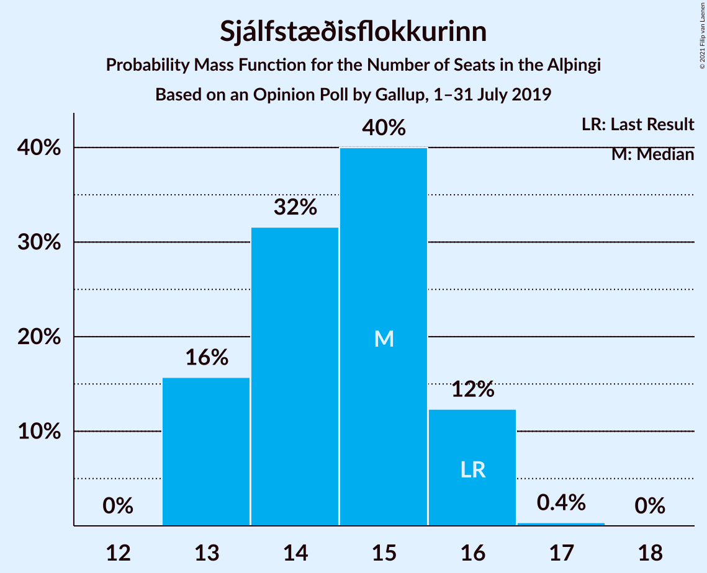
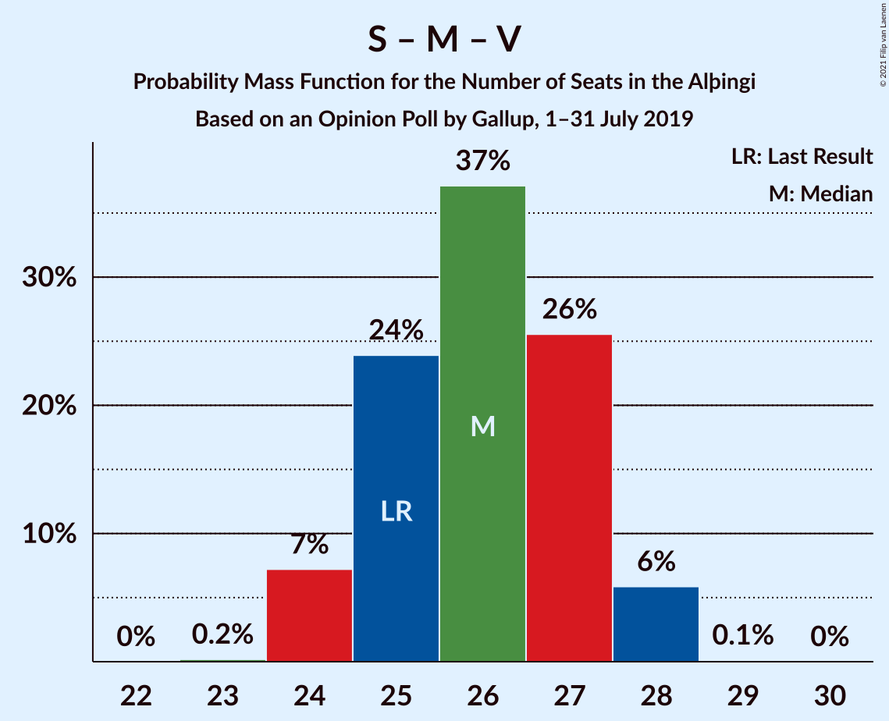

# Opinion Poll by Gallup, 1–31 July 2019

<a href="#voting-intentions">Voting Intentions</a> | <a href="#seats">Seats</a> | <a href="#coalitions">Coalitions</a> | <a href="#technical-information">Technical Information</a>

## Voting Intentions

### Confidence Intervals

| Party | Last Result | Poll Result | 80% Confidence Interval | 90% Confidence Interval | 95% Confidence Interval | 99% Confidence Interval |
|:-----:|:-----------:|:-----------:|:-----------------------:|:-----------------------:|:-----------------------:|:-----------------------:|
| Sjálfstæðisflokkurinn | 25.2% | 21.7% | 20.5–22.9% |20.1–23.3% |19.9–23.6% |19.3–24.2% |
| Samfylkingin | 12.1% | 13.7% | 12.8–14.8% |12.5–15.1% |12.3–15.4% |11.8–15.9% |
| Píratar | 9.2% | 12.7% | 11.8–13.8% |11.5–14.1% |11.3–14.3% |10.9–14.8% |
| Viðreisn | 6.7% | 12.2% | 11.3–13.2% |11.0–13.5% |10.8–13.8% |10.4–14.3% |
| Miðflokkurinn | 10.9% | 12.2% | 11.2–13.2% |11.0–13.5% |10.8–13.7% |10.3–14.2% |
| Vinstrihreyfingin – grænt framboð | 16.9% | 12.0% | 11.1–13.1% |10.9–13.4% |10.7–13.6% |10.2–14.1% |
| Framsóknarflokkurinn | 10.7% | 8.5% | 7.8–9.4% |7.5–9.7% |7.4–9.9% |7.0–10.3% |
| Flokkur fólksins | 6.9% | 3.7% | 3.2–4.3% |3.1–4.5% |2.9–4.7% |2.7–5.0% |
| Sósíalistaflokkur Íslands | 0.0% | 3.2% | 2.7–3.8% |2.6–3.9% |2.5–4.1% |2.3–4.4% |

*Note:* The poll result column reflects the actual value used in the calculations. Published results may vary slightly, and in addition be rounded to fewer digits.

## Seats

### Confidence Intervals

| Party | Last Result | Median | 80% Confidence Interval | 90% Confidence Interval | 95% Confidence Interval | 99% Confidence Interval |
|:-----:|:-----------:|:------:|:-----------------------:|:-----------------------:|:-----------------------:|:-----------------------:|
| <a href="#sjálfstæðisflokkurinn">Sjálfstæðisflokkurinn</a> | 16 | 15 | 14–15 |14–16 |14–16 |13–16 |
| <a href="#samfylkingin">Samfylkingin</a> | 7 | 9 | 9–10 |8–10 |8–10 |8–11 |
| <a href="#píratar">Píratar</a> | 6 | 9 | 7–9 |7–9 |7–9 |7–10 |
| <a href="#viðreisn">Viðreisn</a> | 4 | 8 | 8–9 |8–9 |7–9 |7–9 |
| <a href="#miðflokkurinn">Miðflokkurinn</a> | 7 | 9 | 8–9 |8–9 |7–10 |7–10 |
| <a href="#vinstrihreyfingin-–-grænt-framboð">Vinstrihreyfingin – grænt framboð</a> | 11 | 7 | 7–9 |7–9 |7–9 |7–9 |
| <a href="#framsóknarflokkurinn">Framsóknarflokkurinn</a> | 8 | 6 | 5–6 |5–6 |5–6 |5–7 |
| <a href="#flokkur-fólksins">Flokkur fólksins</a> | 4 | 0 | 0 |0 |0 |0–3 |
| <a href="#sósíalistaflokkur-íslands">Sósíalistaflokkur Íslands</a> | 0 | 0 | 0 |0 |0 |0 |

### Sjálfstæðisflokkurinn

*For a full overview of the results for this party, see the [Sjálfstæðisflokkurinn](party-sjálfstæðisflokkurinn.html) page.*

| Number of Seats | Probability | Accumulated | Special Marks |
|:---------------:|:-----------:|:-----------:|:-------------:|
| 13 | 0.6% | 100% |  |
| 14 | 33% | 99.4% |  |
| 15 | 61% | 67% | Median |
| 16 | 6% | 6% | Last Result |
| 17 | 0% | 0.1% |  |
| 18 | 0% | 0% |  |

### Samfylkingin

*For a full overview of the results for this party, see the [Samfylkingin](party-samfylkingin.html) page.*

| Number of Seats | Probability | Accumulated | Special Marks |
|:---------------:|:-----------:|:-----------:|:-------------:|
| 7 | 0% | 100% | Last Result |
| 8 | 5% | 100% |  |
| 9 | 51% | 95% | Median |
| 10 | 42% | 43% |  |
| 11 | 1.1% | 1.1% |  |
| 12 | 0% | 0% |  |

### Píratar

*For a full overview of the results for this party, see the [Píratar](party-píratar.html) page.*

| Number of Seats | Probability | Accumulated | Special Marks |
|:---------------:|:-----------:|:-----------:|:-------------:|
| 6 | 0% | 100% | Last Result |
| 7 | 11% | 100% |  |
| 8 | 33% | 89% |  |
| 9 | 54% | 56% | Median |
| 10 | 2% | 2% |  |
| 11 | 0% | 0% |  |

### Viðreisn

*For a full overview of the results for this party, see the [Viðreisn](party-viðreisn.html) page.*

| Number of Seats | Probability | Accumulated | Special Marks |
|:---------------:|:-----------:|:-----------:|:-------------:|
| 4 | 0% | 100% | Last Result |
| 5 | 0% | 100% |  |
| 6 | 0% | 100% |  |
| 7 | 4% | 100% |  |
| 8 | 64% | 96% | Median |
| 9 | 32% | 32% |  |
| 10 | 0.2% | 0.2% |  |
| 11 | 0% | 0% |  |

### Miðflokkurinn

*For a full overview of the results for this party, see the [Miðflokkurinn](party-miðflokkurinn.html) page.*

| Number of Seats | Probability | Accumulated | Special Marks |
|:---------------:|:-----------:|:-----------:|:-------------:|
| 6 | 0.2% | 100% |  |
| 7 | 5% | 99.8% | Last Result |
| 8 | 29% | 95% |  |
| 9 | 63% | 66% | Median |
| 10 | 4% | 4% |  |
| 11 | 0% | 0% |  |

### Vinstrihreyfingin – grænt framboð

*For a full overview of the results for this party, see the [Vinstrihreyfingin – grænt framboð](party-vinstrihreyfingin–græntframboð.html) page.*

| Number of Seats | Probability | Accumulated | Special Marks |
|:---------------:|:-----------:|:-----------:|:-------------:|
| 7 | 51% | 100% | Median |
| 8 | 5% | 49% |  |
| 9 | 44% | 44% |  |
| 10 | 0.1% | 0.1% |  |
| 11 | 0% | 0% | Last Result |

### Framsóknarflokkurinn

*For a full overview of the results for this party, see the [Framsóknarflokkurinn](party-framsóknarflokkurinn.html) page.*

| Number of Seats | Probability | Accumulated | Special Marks |
|:---------------:|:-----------:|:-----------:|:-------------:|
| 4 | 0.2% | 100% |  |
| 5 | 47% | 99.8% |  |
| 6 | 51% | 53% | Median |
| 7 | 2% | 2% |  |
| 8 | 0% | 0% | Last Result |

### Flokkur fólksins

*For a full overview of the results for this party, see the [Flokkur fólksins](party-flokkurfólksins.html) page.*

| Number of Seats | Probability | Accumulated | Special Marks |
|:---------------:|:-----------:|:-----------:|:-------------:|
| 0 | 99.4% | 100% | Median |
| 1 | 0% | 0.6% |  |
| 2 | 0% | 0.6% |  |
| 3 | 0.6% | 0.6% |  |
| 4 | 0% | 0% | Last Result |

### Sósíalistaflokkur Íslands

*For a full overview of the results for this party, see the [Sósíalistaflokkur Íslands](party-sósíalistaflokkuríslands.html) page.*

| Number of Seats | Probability | Accumulated | Special Marks |
|:---------------:|:-----------:|:-----------:|:-------------:|
| 0 | 100% | 100% | Last Result, Median |

## Coalitions

### Confidence Intervals

| Coalition | Last Result | Median | Majority? | 80% Confidence Interval | 90% Confidence Interval | 95% Confidence Interval | 99% Confidence Interval |
|:---------:|:-----------:|:------:|:---------:|:-----------------------:|:-----------------------:|:-----------------------:|:-----------------------:|
| Samfylkingin – Píratar – Viðreisn – Vinstrihreyfingin – grænt framboð | 28 | 34 | 99.5% | 33–35 | 33–35 | 33–35 | 31–35 |
| Samfylkingin – Miðflokkurinn – Vinstrihreyfingin – grænt framboð – Framsóknarflokkurinn | 33 | 31 | 46% | 31–33 | 30–33 | 29–33 | 29–33 |
| Sjálfstæðisflokkurinn – Miðflokkurinn – Framsóknarflokkurinn | 31 | 29 | 0.3% | 28–30 | 28–30 | 28–30 | 28–31 |
| Sjálfstæðisflokkurinn – Vinstrihreyfingin – grænt framboð – Framsóknarflokkurinn | 35 | 28 | 0% | 27–30 | 27–30 | 27–30 | 26–31 |
| Samfylkingin – Píratar – Vinstrihreyfingin – grænt framboð | 24 | 26 | 0% | 25–26 | 25–26 | 25–27 | 24–27 |
| Samfylkingin – Miðflokkurinn – Vinstrihreyfingin – grænt framboð | 25 | 26 | 0% | 25–27 | 25–27 | 24–27 | 24–27 |
| Sjálfstæðisflokkurinn – Samfylkingin | 23 | 24 | 0% | 23–25 | 23–25 | 23–26 | 22–26 |
| Sjálfstæðisflokkurinn – Miðflokkurinn | 23 | 24 | 0% | 22–24 | 22–24 | 22–25 | 22–26 |
| Sjálfstæðisflokkurinn – Vinstrihreyfingin – grænt framboð | 27 | 22 | 0% | 22–24 | 22–24 | 22–25 | 21–25 |
| Sjálfstæðisflokkurinn – Viðreisn | 20 | 23 | 0% | 23 | 22–24 | 21–25 | 21–25 |
| Samfylkingin – Vinstrihreyfingin – grænt framboð – Framsóknarflokkurinn | 26 | 22 | 0% | 22–24 | 22–24 | 22–24 | 21–24 |
| Miðflokkurinn – Vinstrihreyfingin – grænt framboð – Framsóknarflokkurinn | 26 | 22 | 0% | 21–24 | 21–24 | 21–24 | 20–24 |
| Sjálfstæðisflokkurinn – Framsóknarflokkurinn | 24 | 20 | 0% | 20–21 | 20–21 | 20–21 | 19–22 |
| Miðflokkurinn – Vinstrihreyfingin – grænt framboð | 18 | 16 | 0% | 16–18 | 16–18 | 16–18 | 14–18 |
| Samfylkingin – Vinstrihreyfingin – grænt framboð | 18 | 17 | 0% | 17–18 | 16–18 | 16–18 | 15–19 |
| Píratar – Vinstrihreyfingin – grænt framboð | 17 | 16 | 0% | 16–17 | 16–18 | 15–18 | 15–18 |
| Vinstrihreyfingin – grænt framboð – Framsóknarflokkurinn | 19 | 13 | 0% | 12–15 | 12–15 | 12–15 | 12–15 |

### Samfylkingin – Píratar – Viðreisn – Vinstrihreyfingin – grænt framboð

| Number of Seats | Probability | Accumulated | Special Marks |
|:---------------:|:-----------:|:-----------:|:-------------:|
| 28 | 0% | 100% | Last Result |
| 29 | 0% | 100% |  |
| 30 | 0% | 100% |  |
| 31 | 0.5% | 100% |  |
| 32 | 1.0% | 99.5% | Majority |
| 33 | 23% | 98.5% | Median |
| 34 | 44% | 76% |  |
| 35 | 32% | 32% |  |
| 36 | 0.3% | 0.4% |  |
| 37 | 0.1% | 0.1% |  |
| 38 | 0% | 0% |  |

### Samfylkingin – Miðflokkurinn – Vinstrihreyfingin – grænt framboð – Framsóknarflokkurinn

| Number of Seats | Probability | Accumulated | Special Marks |
|:---------------:|:-----------:|:-----------:|:-------------:|
| 29 | 3% | 100% |  |
| 30 | 4% | 97% |  |
| 31 | 47% | 94% | Median |
| 32 | 32% | 46% | Majority |
| 33 | 14% | 14% | Last Result |
| 34 | 0% | 0% |  |

### Sjálfstæðisflokkurinn – Miðflokkurinn – Framsóknarflokkurinn

| Number of Seats | Probability | Accumulated | Special Marks |
|:---------------:|:-----------:|:-----------:|:-------------:|
| 26 | 0.1% | 100% |  |
| 27 | 0.4% | 99.9% |  |
| 28 | 32% | 99.5% |  |
| 29 | 44% | 67% |  |
| 30 | 22% | 23% | Median |
| 31 | 0.6% | 0.9% | Last Result |
| 32 | 0.3% | 0.3% | Majority |
| 33 | 0% | 0% |  |

### Sjálfstæðisflokkurinn – Vinstrihreyfingin – grænt framboð – Framsóknarflokkurinn

| Number of Seats | Probability | Accumulated | Special Marks |
|:---------------:|:-----------:|:-----------:|:-------------:|
| 25 | 0.1% | 100% |  |
| 26 | 0.4% | 99.9% |  |
| 27 | 41% | 99.5% |  |
| 28 | 11% | 58% | Median |
| 29 | 33% | 47% |  |
| 30 | 14% | 14% |  |
| 31 | 0.5% | 0.5% |  |
| 32 | 0% | 0% | Majority |
| 33 | 0% | 0% |  |
| 34 | 0% | 0% |  |
| 35 | 0% | 0% | Last Result |

### Samfylkingin – Píratar – Vinstrihreyfingin – grænt framboð

| Number of Seats | Probability | Accumulated | Special Marks |
|:---------------:|:-----------:|:-----------:|:-------------:|
| 23 | 0.3% | 100% |  |
| 24 | 0.8% | 99.7% | Last Result |
| 25 | 23% | 98.9% | Median |
| 26 | 73% | 76% |  |
| 27 | 3% | 3% |  |
| 28 | 0.4% | 0.4% |  |
| 29 | 0.1% | 0.1% |  |
| 30 | 0% | 0% |  |

### Samfylkingin – Miðflokkurinn – Vinstrihreyfingin – grænt framboð

| Number of Seats | Probability | Accumulated | Special Marks |
|:---------------:|:-----------:|:-----------:|:-------------:|
| 23 | 0.1% | 100% |  |
| 24 | 5% | 99.9% |  |
| 25 | 10% | 95% | Last Result, Median |
| 26 | 68% | 85% |  |
| 27 | 16% | 17% |  |
| 28 | 0.3% | 0.3% |  |
| 29 | 0% | 0% |  |

### Sjálfstæðisflokkurinn – Samfylkingin

| Number of Seats | Probability | Accumulated | Special Marks |
|:---------------:|:-----------:|:-----------:|:-------------:|
| 21 | 0.2% | 100% |  |
| 22 | 0.6% | 99.8% |  |
| 23 | 33% | 99.2% | Last Result |
| 24 | 23% | 67% | Median |
| 25 | 41% | 44% |  |
| 26 | 3% | 3% |  |
| 27 | 0% | 0% |  |

### Sjálfstæðisflokkurinn – Miðflokkurinn

| Number of Seats | Probability | Accumulated | Special Marks |
|:---------------:|:-----------:|:-----------:|:-------------:|
| 21 | 0.1% | 100% |  |
| 22 | 28% | 99.9% |  |
| 23 | 11% | 72% | Last Result |
| 24 | 57% | 61% | Median |
| 25 | 3% | 4% |  |
| 26 | 0.7% | 0.7% |  |
| 27 | 0% | 0% |  |

### Sjálfstæðisflokkurinn – Vinstrihreyfingin – grænt framboð

| Number of Seats | Probability | Accumulated | Special Marks |
|:---------------:|:-----------:|:-----------:|:-------------:|
| 20 | 0.1% | 100% |  |
| 21 | 1.1% | 99.9% |  |
| 22 | 51% | 98.8% | Median |
| 23 | 32% | 48% |  |
| 24 | 12% | 16% |  |
| 25 | 3% | 3% |  |
| 26 | 0.1% | 0.1% |  |
| 27 | 0% | 0% | Last Result |

### Sjálfstæðisflokkurinn – Viðreisn

| Number of Seats | Probability | Accumulated | Special Marks |
|:---------------:|:-----------:|:-----------:|:-------------:|
| 20 | 0% | 100% | Last Result |
| 21 | 3% | 100% |  |
| 22 | 2% | 97% |  |
| 23 | 87% | 94% | Median |
| 24 | 3% | 7% |  |
| 25 | 3% | 4% |  |
| 26 | 0.1% | 0.1% |  |
| 27 | 0% | 0% |  |

### Samfylkingin – Vinstrihreyfingin – grænt framboð – Framsóknarflokkurinn

| Number of Seats | Probability | Accumulated | Special Marks |
|:---------------:|:-----------:|:-----------:|:-------------:|
| 20 | 0.4% | 100% |  |
| 21 | 1.4% | 99.6% |  |
| 22 | 52% | 98% | Median |
| 23 | 4% | 46% |  |
| 24 | 42% | 42% |  |
| 25 | 0.4% | 0.4% |  |
| 26 | 0% | 0% | Last Result |

### Miðflokkurinn – Vinstrihreyfingin – grænt framboð – Framsóknarflokkurinn

| Number of Seats | Probability | Accumulated | Special Marks |
|:---------------:|:-----------:|:-----------:|:-------------:|
| 20 | 2% | 100% |  |
| 21 | 43% | 98% |  |
| 22 | 12% | 55% | Median |
| 23 | 30% | 44% |  |
| 24 | 14% | 14% |  |
| 25 | 0% | 0% |  |
| 26 | 0% | 0% | Last Result |

### Sjálfstæðisflokkurinn – Framsóknarflokkurinn

| Number of Seats | Probability | Accumulated | Special Marks |
|:---------------:|:-----------:|:-----------:|:-------------:|
| 18 | 0.2% | 100% |  |
| 19 | 1.3% | 99.8% |  |
| 20 | 72% | 98% |  |
| 21 | 24% | 26% | Median |
| 22 | 2% | 2% |  |
| 23 | 0% | 0% |  |
| 24 | 0% | 0% | Last Result |

### Miðflokkurinn – Vinstrihreyfingin – grænt framboð

| Number of Seats | Probability | Accumulated | Special Marks |
|:---------------:|:-----------:|:-----------:|:-------------:|
| 14 | 1.4% | 100% |  |
| 15 | 0.4% | 98.6% |  |
| 16 | 51% | 98% | Median |
| 17 | 33% | 47% |  |
| 18 | 14% | 14% | Last Result |
| 19 | 0.1% | 0.1% |  |
| 20 | 0% | 0% |  |

### Samfylkingin – Vinstrihreyfingin – grænt framboð

| Number of Seats | Probability | Accumulated | Special Marks |
|:---------------:|:-----------:|:-----------:|:-------------:|
| 15 | 0.8% | 100% |  |
| 16 | 9% | 99.2% | Median |
| 17 | 49% | 90% |  |
| 18 | 40% | 42% | Last Result |
| 19 | 1.5% | 2% |  |
| 20 | 0.1% | 0.1% |  |
| 21 | 0% | 0% |  |

### Píratar – Vinstrihreyfingin – grænt framboð

| Number of Seats | Probability | Accumulated | Special Marks |
|:---------------:|:-----------:|:-----------:|:-------------:|
| 15 | 4% | 100% |  |
| 16 | 60% | 96% | Median |
| 17 | 30% | 36% | Last Result |
| 18 | 6% | 6% |  |
| 19 | 0.2% | 0.2% |  |
| 20 | 0% | 0% |  |

### Vinstrihreyfingin – grænt framboð – Framsóknarflokkurinn

| Number of Seats | Probability | Accumulated | Special Marks |
|:---------------:|:-----------:|:-----------:|:-------------:|
| 11 | 0.1% | 100% |  |
| 12 | 41% | 99.9% |  |
| 13 | 12% | 59% | Median |
| 14 | 5% | 47% |  |
| 15 | 41% | 42% |  |
| 16 | 0.1% | 0.1% |  |
| 17 | 0% | 0% |  |
| 18 | 0% | 0% |  |
| 19 | 0% | 0% | Last Result |

## Technical Information

### Opinion Poll

+ **Polling firm:** Gallup
+ **Commissioner(s):** —
+ **Fieldwork period:** 1–31 July 2019

### Calculations

+ **Sample size:** 1884
+ **Simulations done:** 131,072
+ **Error estimate:** 2.21%

