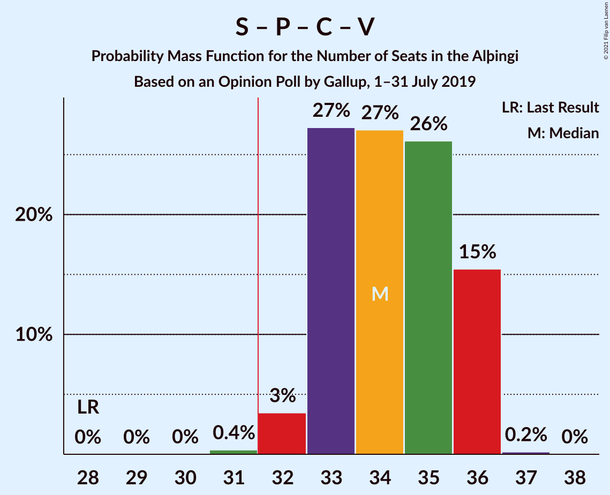
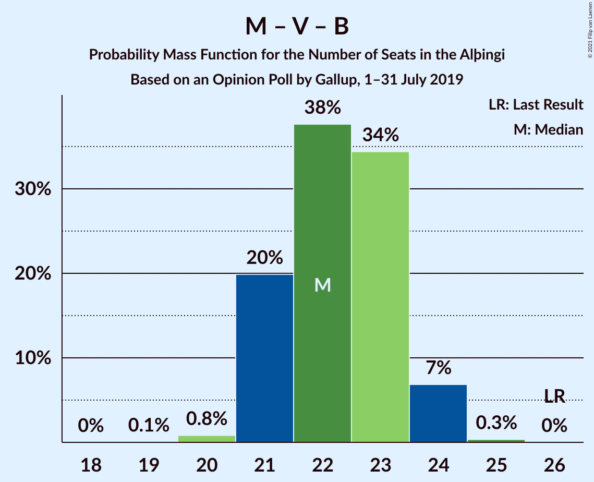
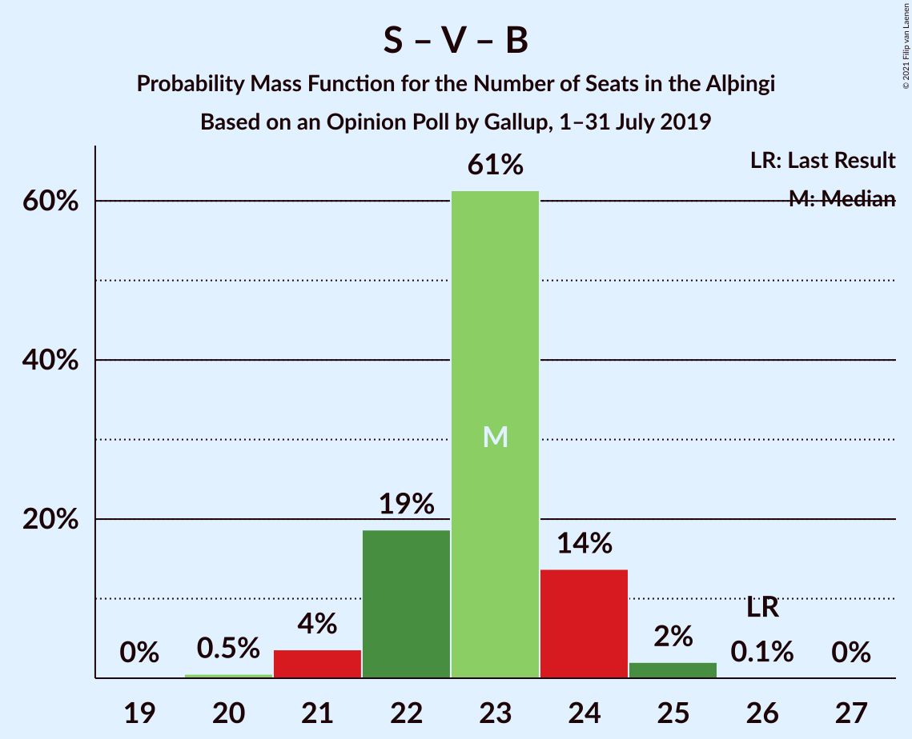

# Opinion Poll by Gallup, 1–31 July 2019

<a href="#voting-intentions">Voting Intentions</a> | <a href="#seats">Seats</a> | <a href="#coalitions">Coalitions</a> | <a href="#technical-information">Technical Information</a>

## Voting Intentions

### Confidence Intervals

| Party | Last Result | Poll Result | 80% Confidence Interval | 90% Confidence Interval | 95% Confidence Interval | 99% Confidence Interval |
|:-----:|:-----------:|:-----------:|:-----------------------:|:-----------------------:|:-----------------------:|:-----------------------:|
| Sjálfstæðisflokkurinn | 25.2% | 21.7% | 20.5–22.9% |20.2–23.2% |19.9–23.5% |19.4–24.1% |
| Samfylkingin | 12.1% | 13.7% | 12.8–14.8% |12.5–15.1% |12.3–15.3% |11.9–15.8% |
| Píratar | 9.2% | 12.7% | 11.8–13.7% |11.6–14.0% |11.4–14.3% |10.9–14.8% |
| Viðreisn | 6.7% | 12.2% | 11.3–13.2% |11.1–13.5% |10.9–13.7% |10.5–14.2% |
| Miðflokkurinn | 10.9% | 12.1% | 11.2–13.1% |11.0–13.4% |10.8–13.6% |10.4–14.1% |
| Vinstrihreyfingin – grænt framboð | 16.9% | 12.0% | 11.1–13.0% |10.9–13.3% |10.7–13.5% |10.3–14.0% |
| Framsóknarflokkurinn | 10.7% | 8.5% | 7.8–9.4% |7.6–9.6% |7.4–9.8% |7.1–10.3% |
| Flokkur fólksins | 6.9% | 3.7% | 3.2–4.3% |3.1–4.5% |3.0–4.6% |2.7–4.9% |
| Sósíalistaflokkur Íslands | 0.0% | 3.2% | 2.7–3.8% |2.6–3.9% |2.5–4.1% |2.3–4.3% |

*Note:* The poll result column reflects the actual value used in the calculations. Published results may vary slightly, and in addition be rounded to fewer digits.

## Seats

### Confidence Intervals

| Party | Last Result | Median | 80% Confidence Interval | 90% Confidence Interval | 95% Confidence Interval | 99% Confidence Interval |
|:-----:|:-----------:|:------:|:-----------------------:|:-----------------------:|:-----------------------:|:-----------------------:|
| <a href="#sjálfstæðisflokkurinn">Sjálfstæðisflokkurinn</a> | 16 | 14 | 14–15 |14–16 |14–16 |13–16 |
| <a href="#samfylkingin">Samfylkingin</a> | 7 | 9 | 9–10 |8–10 |8–11 |8–11 |
| <a href="#píratar">Píratar</a> | 6 | 9 | 8–9 |8–9 |8–9 |7–10 |
| <a href="#viðreisn">Viðreisn</a> | 4 | 8 | 8–9 |7–9 |7–9 |7–10 |
| <a href="#miðflokkurinn">Miðflokkurinn</a> | 7 | 8 | 8–9 |8–10 |8–10 |7–10 |
| <a href="#vinstrihreyfingin-–-grænt-framboð">Vinstrihreyfingin – grænt framboð</a> | 11 | 8 | 8 |7–9 |7–10 |7–10 |
| <a href="#framsóknarflokkurinn">Framsóknarflokkurinn</a> | 8 | 7 | 5–7 |5–7 |4–7 |4–7 |
| <a href="#flokkur-fólksins">Flokkur fólksins</a> | 4 | 0 | 0 |0 |0 |0 |
| <a href="#sósíalistaflokkur-íslands">Sósíalistaflokkur Íslands</a> | 0 | 0 | 0 |0 |0 |0 |

### Sjálfstæðisflokkurinn

*For a full overview of the results for this party, see the [Sjálfstæðisflokkurinn](party-sjálfstæðisflokkurinn.html) page.*

| Number of Seats | Probability | Accumulated | Special Marks |
|:---------------:|:-----------:|:-----------:|:-------------:|
| 13 | 1.2% | 100% |  |
| 14 | 67% | 98.8% | Median |
| 15 | 25% | 31% |  |
| 16 | 7% | 7% | Last Result |
| 17 | 0.1% | 0.1% |  |
| 18 | 0% | 0% |  |

### Samfylkingin

*For a full overview of the results for this party, see the [Samfylkingin](party-samfylkingin.html) page.*

| Number of Seats | Probability | Accumulated | Special Marks |
|:---------------:|:-----------:|:-----------:|:-------------:|
| 7 | 0% | 100% | Last Result |
| 8 | 6% | 100% |  |
| 9 | 73% | 94% | Median |
| 10 | 16% | 21% |  |
| 11 | 5% | 5% |  |
| 12 | 0% | 0% |  |

### Píratar

*For a full overview of the results for this party, see the [Píratar](party-píratar.html) page.*

| Number of Seats | Probability | Accumulated | Special Marks |
|:---------------:|:-----------:|:-----------:|:-------------:|
| 6 | 0% | 100% | Last Result |
| 7 | 2% | 100% |  |
| 8 | 25% | 98% |  |
| 9 | 72% | 73% | Median |
| 10 | 0.7% | 0.7% |  |
| 11 | 0% | 0% |  |

### Viðreisn

*For a full overview of the results for this party, see the [Viðreisn](party-viðreisn.html) page.*

| Number of Seats | Probability | Accumulated | Special Marks |
|:---------------:|:-----------:|:-----------:|:-------------:|
| 4 | 0% | 100% | Last Result |
| 5 | 0% | 100% |  |
| 6 | 0% | 100% |  |
| 7 | 10% | 100% |  |
| 8 | 70% | 90% | Median |
| 9 | 19% | 20% |  |
| 10 | 1.2% | 1.2% |  |
| 11 | 0% | 0% |  |

### Miðflokkurinn

*For a full overview of the results for this party, see the [Miðflokkurinn](party-miðflokkurinn.html) page.*

| Number of Seats | Probability | Accumulated | Special Marks |
|:---------------:|:-----------:|:-----------:|:-------------:|
| 6 | 0.1% | 100% |  |
| 7 | 2% | 99.9% | Last Result |
| 8 | 69% | 98% | Median |
| 9 | 19% | 28% |  |
| 10 | 9% | 9% |  |
| 11 | 0% | 0% |  |

### Vinstrihreyfingin – grænt framboð

*For a full overview of the results for this party, see the [Vinstrihreyfingin – grænt framboð](party-vinstrihreyfingin–græntframboð.html) page.*

| Number of Seats | Probability | Accumulated | Special Marks |
|:---------------:|:-----------:|:-----------:|:-------------:|
| 6 | 0.3% | 100% |  |
| 7 | 9% | 99.7% |  |
| 8 | 83% | 91% | Median |
| 9 | 5% | 8% |  |
| 10 | 3% | 3% |  |
| 11 | 0% | 0% | Last Result |

### Framsóknarflokkurinn

*For a full overview of the results for this party, see the [Framsóknarflokkurinn](party-framsóknarflokkurinn.html) page.*

| Number of Seats | Probability | Accumulated | Special Marks |
|:---------------:|:-----------:|:-----------:|:-------------:|
| 4 | 3% | 100% |  |
| 5 | 26% | 97% |  |
| 6 | 17% | 72% |  |
| 7 | 55% | 55% | Median |
| 8 | 0% | 0% | Last Result |

### Flokkur fólksins

*For a full overview of the results for this party, see the [Flokkur fólksins](party-flokkurfólksins.html) page.*

| Number of Seats | Probability | Accumulated | Special Marks |
|:---------------:|:-----------:|:-----------:|:-------------:|
| 0 | 99.9% | 100% | Median |
| 1 | 0% | 0.1% |  |
| 2 | 0% | 0.1% |  |
| 3 | 0.1% | 0.1% |  |
| 4 | 0% | 0% | Last Result |

### Sósíalistaflokkur Íslands

*For a full overview of the results for this party, see the [Sósíalistaflokkur Íslands](party-sósíalistaflokkuríslands.html) page.*

| Number of Seats | Probability | Accumulated | Special Marks |
|:---------------:|:-----------:|:-----------:|:-------------:|
| 0 | 100% | 100% | Last Result, Median |

## Coalitions

### Confidence Intervals

| Coalition | Last Result | Median | Majority? | 80% Confidence Interval | 90% Confidence Interval | 95% Confidence Interval | 99% Confidence Interval |
|:---------:|:-----------:|:------:|:---------:|:-----------------------:|:-----------------------:|:-----------------------:|:-----------------------:|
| Samfylkingin – Píratar – Viðreisn – Vinstrihreyfingin – grænt framboð | 28 | 34 | 98.8% | 33–35 | 33–36 | 33–36 | 31–36 |
| Samfylkingin – Miðflokkurinn – Vinstrihreyfingin – grænt framboð – Framsóknarflokkurinn | 33 | 32 | 77% | 31–32 | 30–33 | 30–33 | 30–34 |
| Sjálfstæðisflokkurinn – Miðflokkurinn – Framsóknarflokkurinn | 31 | 29 | 1.1% | 28–30 | 27–30 | 27–30 | 27–32 |
| Sjálfstæðisflokkurinn – Vinstrihreyfingin – grænt framboð – Framsóknarflokkurinn | 35 | 29 | 0.4% | 28–29 | 27–29 | 27–30 | 26–31 |
| Samfylkingin – Miðflokkurinn – Vinstrihreyfingin – grænt framboð | 25 | 25 | 0% | 25–27 | 25–27 | 25–28 | 24–28 |
| Samfylkingin – Píratar – Vinstrihreyfingin – grænt framboð | 24 | 26 | 0% | 25–27 | 25–27 | 25–28 | 24–28 |
| Sjálfstæðisflokkurinn – Miðflokkurinn | 23 | 22 | 0% | 22–24 | 22–25 | 22–25 | 22–26 |
| Sjálfstæðisflokkurinn – Samfylkingin | 23 | 23 | 0% | 23–25 | 23–25 | 22–25 | 22–26 |
| Sjálfstæðisflokkurinn – Viðreisn | 20 | 22 | 0% | 22–24 | 22–24 | 21–25 | 21–25 |
| Sjálfstæðisflokkurinn – Vinstrihreyfingin – grænt framboð | 27 | 22 | 0% | 22–24 | 22–24 | 22–24 | 21–25 |
| Miðflokkurinn – Vinstrihreyfingin – grænt framboð – Framsóknarflokkurinn | 26 | 23 | 0% | 21–23 | 21–24 | 21–24 | 20–24 |
| Samfylkingin – Vinstrihreyfingin – grænt framboð – Framsóknarflokkurinn | 26 | 24 | 0% | 22–24 | 22–24 | 21–24 | 21–25 |
| Sjálfstæðisflokkurinn – Framsóknarflokkurinn | 24 | 21 | 0% | 19–21 | 19–21 | 19–22 | 19–22 |
| Samfylkingin – Vinstrihreyfingin – grænt framboð | 18 | 17 | 0% | 16–18 | 16–19 | 16–19 | 16–19 |
| Miðflokkurinn – Vinstrihreyfingin – grænt framboð | 18 | 16 | 0% | 16–18 | 16–18 | 15–19 | 14–19 |
| Píratar – Vinstrihreyfingin – grænt framboð | 17 | 17 | 0% | 16–17 | 16–18 | 15–19 | 15–19 |
| Vinstrihreyfingin – grænt framboð – Framsóknarflokkurinn | 19 | 15 | 0% | 13–15 | 13–15 | 12–15 | 12–16 |

### Samfylkingin – Píratar – Viðreisn – Vinstrihreyfingin – grænt framboð

| Number of Seats | Probability | Accumulated | Special Marks |
|:---------------:|:-----------:|:-----------:|:-------------:|
| 28 | 0% | 100% | Last Result |
| 29 | 0% | 100% |  |
| 30 | 0% | 100% |  |
| 31 | 1.2% | 100% |  |
| 32 | 1.0% | 98.8% | Majority |
| 33 | 16% | 98% |  |
| 34 | 62% | 82% | Median |
| 35 | 14% | 20% |  |
| 36 | 5% | 5% |  |
| 37 | 0.2% | 0.2% |  |
| 38 | 0% | 0% |  |

### Samfylkingin – Miðflokkurinn – Vinstrihreyfingin – grænt framboð – Framsóknarflokkurinn

| Number of Seats | Probability | Accumulated | Special Marks |
|:---------------:|:-----------:|:-----------:|:-------------:|
| 28 | 0.1% | 100% |  |
| 29 | 0.3% | 99.9% |  |
| 30 | 5% | 99.7% |  |
| 31 | 18% | 95% |  |
| 32 | 69% | 77% | Median, Majority |
| 33 | 6% | 7% | Last Result |
| 34 | 1.1% | 1.1% |  |
| 35 | 0% | 0% |  |

### Sjálfstæðisflokkurinn – Miðflokkurinn – Framsóknarflokkurinn

| Number of Seats | Probability | Accumulated | Special Marks |
|:---------------:|:-----------:|:-----------:|:-------------:|
| 26 | 0.2% | 100% |  |
| 27 | 5% | 99.8% |  |
| 28 | 14% | 95% |  |
| 29 | 62% | 80% | Median |
| 30 | 16% | 18% |  |
| 31 | 1.0% | 2% | Last Result |
| 32 | 1.1% | 1.1% | Majority |
| 33 | 0% | 0% |  |

### Sjálfstæðisflokkurinn – Vinstrihreyfingin – grænt framboð – Framsóknarflokkurinn

| Number of Seats | Probability | Accumulated | Special Marks |
|:---------------:|:-----------:|:-----------:|:-------------:|
| 26 | 0.6% | 100% |  |
| 27 | 9% | 99.4% |  |
| 28 | 23% | 90% |  |
| 29 | 63% | 67% | Median |
| 30 | 3% | 4% |  |
| 31 | 0.4% | 0.8% |  |
| 32 | 0.4% | 0.4% | Majority |
| 33 | 0% | 0% |  |
| 34 | 0% | 0% |  |
| 35 | 0% | 0% | Last Result |

### Samfylkingin – Miðflokkurinn – Vinstrihreyfingin – grænt framboð

| Number of Seats | Probability | Accumulated | Special Marks |
|:---------------:|:-----------:|:-----------:|:-------------:|
| 23 | 0.1% | 100% |  |
| 24 | 1.0% | 99.9% |  |
| 25 | 64% | 98.9% | Last Result, Median |
| 26 | 18% | 35% |  |
| 27 | 13% | 17% |  |
| 28 | 4% | 4% |  |
| 29 | 0% | 0% |  |

### Samfylkingin – Píratar – Vinstrihreyfingin – grænt framboð

| Number of Seats | Probability | Accumulated | Special Marks |
|:---------------:|:-----------:|:-----------:|:-------------:|
| 23 | 0.2% | 100% |  |
| 24 | 2% | 99.8% | Last Result |
| 25 | 17% | 98% |  |
| 26 | 69% | 80% | Median |
| 27 | 7% | 11% |  |
| 28 | 3% | 3% |  |
| 29 | 0.1% | 0.1% |  |
| 30 | 0% | 0% |  |

### Sjálfstæðisflokkurinn – Miðflokkurinn

| Number of Seats | Probability | Accumulated | Special Marks |
|:---------------:|:-----------:|:-----------:|:-------------:|
| 21 | 0.4% | 100% |  |
| 22 | 60% | 99.6% | Median |
| 23 | 16% | 40% | Last Result |
| 24 | 17% | 24% |  |
| 25 | 6% | 7% |  |
| 26 | 1.3% | 1.3% |  |
| 27 | 0% | 0% |  |

### Sjálfstæðisflokkurinn – Samfylkingin

| Number of Seats | Probability | Accumulated | Special Marks |
|:---------------:|:-----------:|:-----------:|:-------------:|
| 21 | 0.2% | 100% |  |
| 22 | 4% | 99.8% |  |
| 23 | 60% | 96% | Last Result, Median |
| 24 | 13% | 36% |  |
| 25 | 20% | 22% |  |
| 26 | 2% | 2% |  |
| 27 | 0.1% | 0.1% |  |
| 28 | 0% | 0% |  |

### Sjálfstæðisflokkurinn – Viðreisn

| Number of Seats | Probability | Accumulated | Special Marks |
|:---------------:|:-----------:|:-----------:|:-------------:|
| 20 | 0% | 100% | Last Result |
| 21 | 4% | 100% |  |
| 22 | 61% | 96% | Median |
| 23 | 19% | 35% |  |
| 24 | 13% | 15% |  |
| 25 | 3% | 3% |  |
| 26 | 0% | 0% |  |

### Sjálfstæðisflokkurinn – Vinstrihreyfingin – grænt framboð

| Number of Seats | Probability | Accumulated | Special Marks |
|:---------------:|:-----------:|:-----------:|:-------------:|
| 20 | 0.1% | 100% |  |
| 21 | 2% | 99.9% |  |
| 22 | 70% | 98% | Median |
| 23 | 17% | 28% |  |
| 24 | 8% | 10% |  |
| 25 | 2% | 2% |  |
| 26 | 0.1% | 0.1% |  |
| 27 | 0% | 0% | Last Result |

### Miðflokkurinn – Vinstrihreyfingin – grænt framboð – Framsóknarflokkurinn

| Number of Seats | Probability | Accumulated | Special Marks |
|:---------------:|:-----------:|:-----------:|:-------------:|
| 20 | 2% | 100% |  |
| 21 | 18% | 98% |  |
| 22 | 8% | 80% |  |
| 23 | 62% | 72% | Median |
| 24 | 9% | 10% |  |
| 25 | 0.2% | 0.2% |  |
| 26 | 0% | 0% | Last Result |

### Samfylkingin – Vinstrihreyfingin – grænt framboð – Framsóknarflokkurinn

| Number of Seats | Probability | Accumulated | Special Marks |
|:---------------:|:-----------:|:-----------:|:-------------:|
| 20 | 0.1% | 100% |  |
| 21 | 2% | 99.9% |  |
| 22 | 18% | 97% |  |
| 23 | 13% | 80% |  |
| 24 | 65% | 66% | Median |
| 25 | 0.9% | 1.0% |  |
| 26 | 0.1% | 0.1% | Last Result |
| 27 | 0% | 0% |  |

### Sjálfstæðisflokkurinn – Framsóknarflokkurinn

| Number of Seats | Probability | Accumulated | Special Marks |
|:---------------:|:-----------:|:-----------:|:-------------:|
| 18 | 0.2% | 100% |  |
| 19 | 10% | 99.8% |  |
| 20 | 20% | 89% |  |
| 21 | 67% | 69% | Median |
| 22 | 2% | 3% |  |
| 23 | 0.5% | 0.5% |  |
| 24 | 0% | 0% | Last Result |

### Samfylkingin – Vinstrihreyfingin – grænt framboð

| Number of Seats | Probability | Accumulated | Special Marks |
|:---------------:|:-----------:|:-----------:|:-------------:|
| 15 | 0.2% | 100% |  |
| 16 | 12% | 99.8% |  |
| 17 | 64% | 88% | Median |
| 18 | 16% | 24% | Last Result |
| 19 | 8% | 8% |  |
| 20 | 0.1% | 0.1% |  |
| 21 | 0% | 0% |  |

### Miðflokkurinn – Vinstrihreyfingin – grænt framboð

| Number of Seats | Probability | Accumulated | Special Marks |
|:---------------:|:-----------:|:-----------:|:-------------:|
| 14 | 0.6% | 100% |  |
| 15 | 2% | 99.4% |  |
| 16 | 75% | 97% | Median |
| 17 | 9% | 22% |  |
| 18 | 11% | 14% | Last Result |
| 19 | 3% | 3% |  |
| 20 | 0% | 0% |  |

### Píratar – Vinstrihreyfingin – grænt framboð

| Number of Seats | Probability | Accumulated | Special Marks |
|:---------------:|:-----------:|:-----------:|:-------------:|
| 14 | 0.2% | 100% |  |
| 15 | 3% | 99.8% |  |
| 16 | 28% | 96% |  |
| 17 | 63% | 69% | Last Result, Median |
| 18 | 3% | 5% |  |
| 19 | 3% | 3% |  |
| 20 | 0% | 0% |  |

### Vinstrihreyfingin – grænt framboð – Framsóknarflokkurinn

| Number of Seats | Probability | Accumulated | Special Marks |
|:---------------:|:-----------:|:-----------:|:-------------:|
| 11 | 0.1% | 100% |  |
| 12 | 5% | 99.9% |  |
| 13 | 25% | 95% |  |
| 14 | 12% | 70% |  |
| 15 | 58% | 59% | Median |
| 16 | 0.9% | 0.9% |  |
| 17 | 0% | 0% |  |
| 18 | 0% | 0% |  |
| 19 | 0% | 0% | Last Result |

## Technical Information

### Opinion Poll

+ **Polling firm:** Gallup
+ **Commissioner(s):** —
+ **Fieldwork period:** 1–31 July 2019

### Calculations

+ **Sample size:** 2002
+ **Simulations done:** 524,288
+ **Error estimate:** 1.62%

