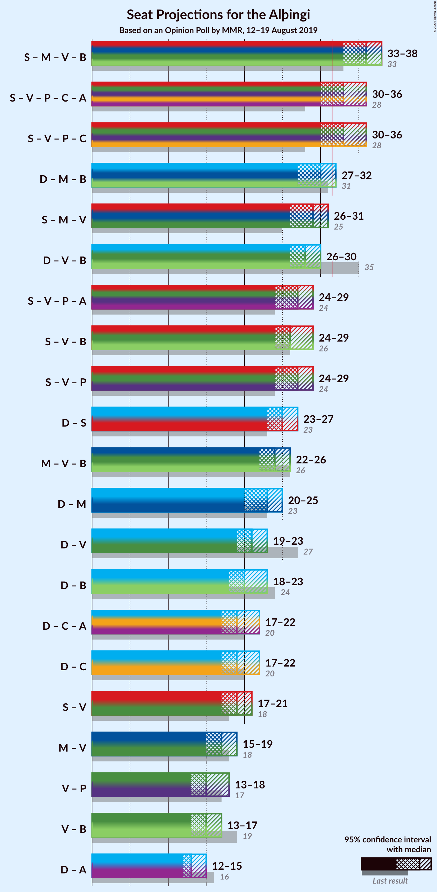
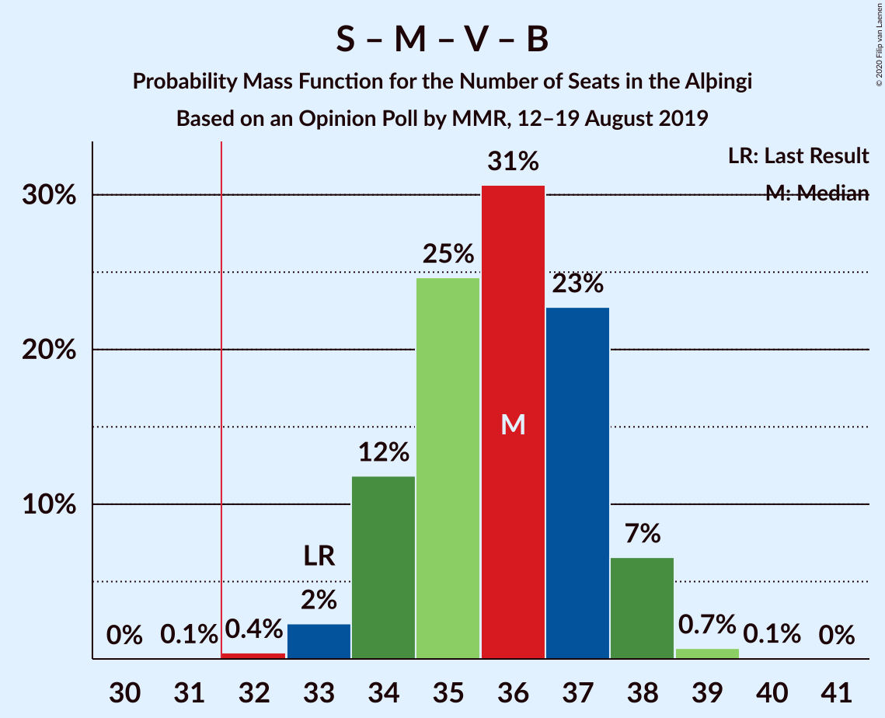
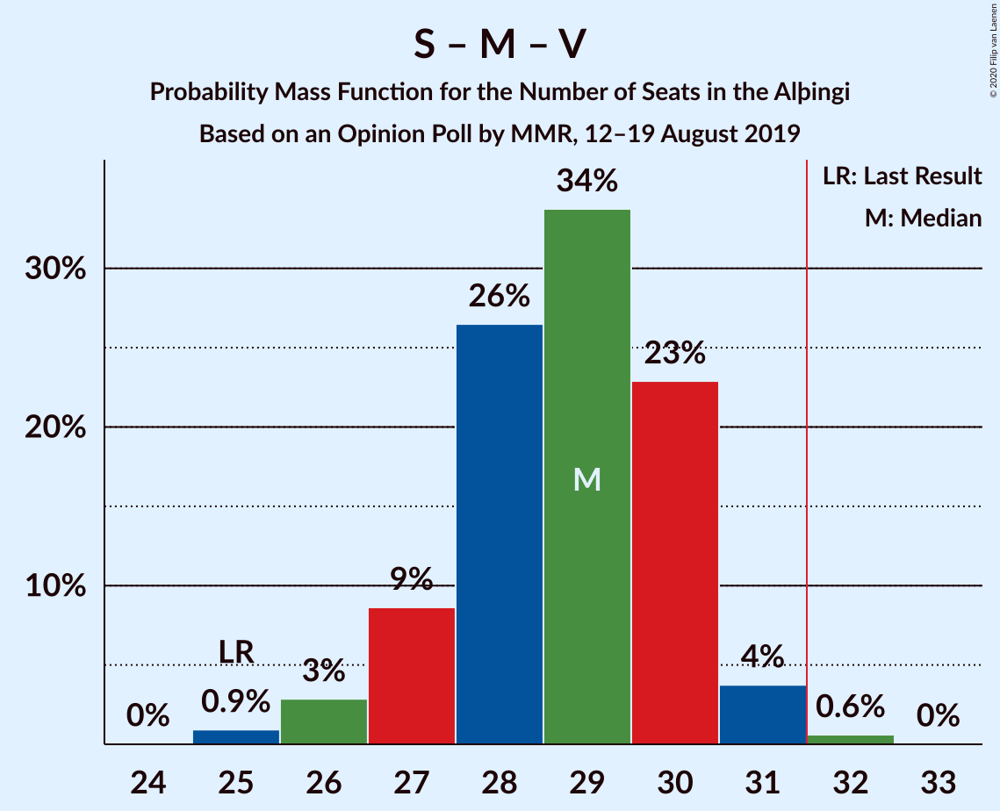
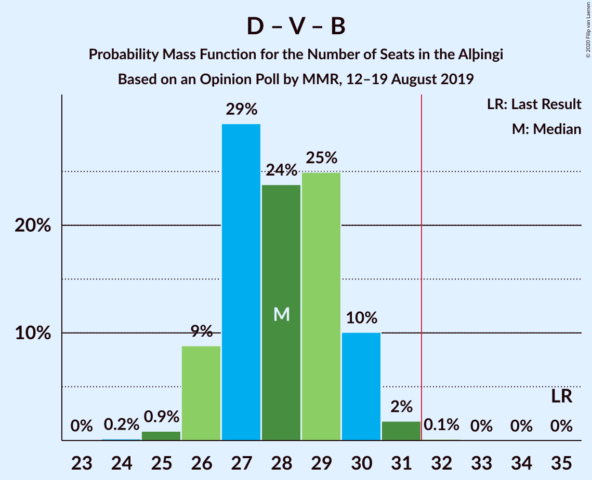

# Opinion Poll by MMR, 12–19 August 2019

<a href="#voting-intentions">Voting Intentions</a> | <a href="#seats">Seats</a> | <a href="#coalitions">Coalitions</a> | <a href="#technical-information">Technical Information</a>

## Voting Intentions

### Confidence Intervals

| Party | Last Result | Poll Result | 80% Confidence Interval | 90% Confidence Interval | 95% Confidence Interval | 99% Confidence Interval |
|:-----:|:-----------:|:-----------:|:-----------------------:|:-----------------------:|:-----------------------:|:-----------------------:|
| Sjálfstæðisflokkurinn | 25.2% | 19.1% | 17.6–20.8% |17.1–21.2% |16.8–21.7% |16.0–22.5% |
| Samfylkingin | 12.1% | 16.8% | 15.3–18.4% |14.9–18.8% |14.6–19.2% |13.9–20.0% |
| Miðflokkurinn | 10.9% | 13.0% | 11.8–14.5% |11.4–14.9% |11.1–15.3% |10.5–16.0% |
| Vinstrihreyfingin – grænt framboð | 16.9% | 11.5% | 10.3–12.9% |10.0–13.3% |9.7–13.7% |9.1–14.4% |
| Píratar | 9.2% | 11.3% | 10.1–12.7% |9.8–13.1% |9.5–13.4% |8.9–14.1% |
| Framsóknarflokkurinn | 10.7% | 10.4% | 9.3–11.8% |8.9–12.1% |8.7–12.5% |8.1–13.1% |
| Viðreisn | 6.7% | 9.3% | 8.2–10.6% |7.9–10.9% |7.6–11.3% |7.1–11.9% |
| Flokkur fólksins | 6.9% | 4.1% | 3.4–5.1% |3.2–5.3% |3.1–5.6% |2.8–6.1% |
| Sósíalistaflokkur Íslands | 0.0% | 2.9% | 2.3–3.7% |2.2–4.0% |2.0–4.2% |1.8–4.6% |

*Note:* The poll result column reflects the actual value used in the calculations. Published results may vary slightly, and in addition be rounded to fewer digits.

## Seats

### Confidence Intervals

| Party | Last Result | Median | 80% Confidence Interval | 90% Confidence Interval | 95% Confidence Interval | 99% Confidence Interval |
|:-----:|:-----------:|:------:|:-----------------------:|:-----------------------:|:-----------------------:|:-----------------------:|
| <a href="#sjálfstæðisflokkurinn">Sjálfstæðisflokkurinn</a> | 16 | 13 | 12–15 |12–15 |11–15 |11–15 |
| <a href="#samfylkingin">Samfylkingin</a> | 7 | 12 | 10–13 |10–13 |9–13 |9–14 |
| <a href="#miðflokkurinn">Miðflokkurinn</a> | 7 | 10 | 8–10 |8–10 |7–10 |7–11 |
| <a href="#vinstrihreyfingin-–-grænt-framboð">Vinstrihreyfingin – grænt framboð</a> | 11 | 8 | 7–9 |6–9 |6–9 |6–10 |
| <a href="#píratar">Píratar</a> | 6 | 8 | 7–8 |6–9 |6–9 |6–10 |
| <a href="#framsóknarflokkurinn">Framsóknarflokkurinn</a> | 8 | 7 | 6–8 |6–8 |6–9 |5–10 |
| <a href="#viðreisn">Viðreisn</a> | 4 | 6 | 5–7 |5–8 |5–8 |5–8 |
| <a href="#flokkur-fólksins">Flokkur fólksins</a> | 4 | 0 | 0 |0–3 |0–3 |0–4 |
| <a href="#sósíalistaflokkur-íslands">Sósíalistaflokkur Íslands</a> | 0 | 0 | 0 |0 |0 |0 |

### Sjálfstæðisflokkurinn

*For a full overview of the results for this party, see the [Sjálfstæðisflokkurinn](party-sjálfstæðisflokkurinn.html) page.*

| Number of Seats | Probability | Accumulated | Special Marks |
|:---------------:|:-----------:|:-----------:|:-------------:|
| 10 | 0.2% | 100% |  |
| 11 | 3% | 99.8% |  |
| 12 | 26% | 97% |  |
| 13 | 25% | 71% | Median |
| 14 | 27% | 46% |  |
| 15 | 19% | 19% |  |
| 16 | 0.3% | 0.3% | Last Result |
| 17 | 0% | 0% |  |

### Samfylkingin

*For a full overview of the results for this party, see the [Samfylkingin](party-samfylkingin.html) page.*

| Number of Seats | Probability | Accumulated | Special Marks |
|:---------------:|:-----------:|:-----------:|:-------------:|
| 7 | 0% | 100% | Last Result |
| 8 | 0.3% | 100% |  |
| 9 | 3% | 99.7% |  |
| 10 | 13% | 97% |  |
| 11 | 30% | 84% |  |
| 12 | 33% | 54% | Median |
| 13 | 18% | 20% |  |
| 14 | 2% | 2% |  |
| 15 | 0.1% | 0.1% |  |
| 16 | 0% | 0% |  |

### Miðflokkurinn

*For a full overview of the results for this party, see the [Miðflokkurinn](party-miðflokkurinn.html) page.*

| Number of Seats | Probability | Accumulated | Special Marks |
|:---------------:|:-----------:|:-----------:|:-------------:|
| 6 | 0.2% | 100% |  |
| 7 | 3% | 99.8% | Last Result |
| 8 | 13% | 97% |  |
| 9 | 30% | 84% |  |
| 10 | 52% | 54% | Median |
| 11 | 2% | 2% |  |
| 12 | 0.1% | 0.1% |  |
| 13 | 0% | 0% |  |

### Vinstrihreyfingin – grænt framboð

*For a full overview of the results for this party, see the [Vinstrihreyfingin – grænt framboð](party-vinstrihreyfingin–græntframboð.html) page.*

| Number of Seats | Probability | Accumulated | Special Marks |
|:---------------:|:-----------:|:-----------:|:-------------:|
| 5 | 0.1% | 100% |  |
| 6 | 5% | 99.9% |  |
| 7 | 33% | 95% |  |
| 8 | 48% | 62% | Median |
| 9 | 12% | 14% |  |
| 10 | 2% | 2% |  |
| 11 | 0% | 0% | Last Result |

### Píratar

*For a full overview of the results for this party, see the [Píratar](party-píratar.html) page.*

| Number of Seats | Probability | Accumulated | Special Marks |
|:---------------:|:-----------:|:-----------:|:-------------:|
| 5 | 0.1% | 100% |  |
| 6 | 10% | 99.9% | Last Result |
| 7 | 37% | 90% |  |
| 8 | 44% | 53% | Median |
| 9 | 8% | 9% |  |
| 10 | 0.9% | 0.9% |  |
| 11 | 0% | 0% |  |

### Framsóknarflokkurinn

*For a full overview of the results for this party, see the [Framsóknarflokkurinn](party-framsóknarflokkurinn.html) page.*

| Number of Seats | Probability | Accumulated | Special Marks |
|:---------------:|:-----------:|:-----------:|:-------------:|
| 5 | 1.3% | 100% |  |
| 6 | 35% | 98.7% |  |
| 7 | 40% | 64% | Median |
| 8 | 20% | 24% | Last Result |
| 9 | 4% | 4% |  |
| 10 | 0.6% | 0.6% |  |
| 11 | 0% | 0% |  |

### Viðreisn

*For a full overview of the results for this party, see the [Viðreisn](party-viðreisn.html) page.*

| Number of Seats | Probability | Accumulated | Special Marks |
|:---------------:|:-----------:|:-----------:|:-------------:|
| 4 | 0.3% | 100% | Last Result |
| 5 | 16% | 99.7% |  |
| 6 | 42% | 84% | Median |
| 7 | 36% | 41% |  |
| 8 | 5% | 5% |  |
| 9 | 0.1% | 0.1% |  |
| 10 | 0% | 0% |  |

### Flokkur fólksins

*For a full overview of the results for this party, see the [Flokkur fólksins](party-flokkurfólksins.html) page.*

| Number of Seats | Probability | Accumulated | Special Marks |
|:---------------:|:-----------:|:-----------:|:-------------:|
| 0 | 91% | 100% | Median |
| 1 | 0% | 9% |  |
| 2 | 0% | 9% |  |
| 3 | 8% | 9% |  |
| 4 | 0.8% | 0.8% | Last Result |
| 5 | 0% | 0% |  |

### Sósíalistaflokkur Íslands

*For a full overview of the results for this party, see the [Sósíalistaflokkur Íslands](party-sósíalistaflokkuríslands.html) page.*

| Number of Seats | Probability | Accumulated | Special Marks |
|:---------------:|:-----------:|:-----------:|:-------------:|
| 0 | 99.9% | 100% | Last Result, Median |
| 1 | 0% | 0.1% |  |
| 2 | 0% | 0.1% |  |
| 3 | 0.1% | 0.1% |  |
| 4 | 0% | 0% |  |

## Coalitions

### Confidence Intervals

| Coalition | Last Result | Median | Majority? | 80% Confidence Interval | 90% Confidence Interval | 95% Confidence Interval | 99% Confidence Interval |
|:---------:|:-----------:|:------:|:---------:|:-----------------------:|:-----------------------:|:-----------------------:|:-----------------------:|
| Samfylkingin – Miðflokkurinn – Vinstrihreyfingin – grænt framboð – Framsóknarflokkurinn | 33 | 35 | 99.8% | 34–38 | 33–38 | 33–38 | 32–40 |
| Samfylkingin – Vinstrihreyfingin – grænt framboð – Píratar – Viðreisn | 28 | 33 | 87% | 31–36 | 31–36 | 30–36 | 30–36 |
| Sjálfstæðisflokkurinn – Miðflokkurinn – Framsóknarflokkurinn | 31 | 30 | 7% | 27–31 | 27–32 | 27–32 | 27–32 |
| Samfylkingin – Miðflokkurinn – Vinstrihreyfingin – grænt framboð | 25 | 29 | 1.1% | 27–30 | 26–31 | 26–31 | 25–32 |
| Sjálfstæðisflokkurinn – Vinstrihreyfingin – grænt framboð – Framsóknarflokkurinn | 35 | 28 | 0.2% | 27–30 | 26–30 | 26–30 | 24–31 |
| Samfylkingin – Vinstrihreyfingin – grænt framboð – Framsóknarflokkurinn | 26 | 26 | 0% | 24–28 | 24–28 | 24–29 | 23–30 |
| Samfylkingin – Vinstrihreyfingin – grænt framboð – Píratar | 24 | 27 | 0% | 25–29 | 24–29 | 24–29 | 23–30 |
| Miðflokkurinn – Vinstrihreyfingin – grænt framboð – Framsóknarflokkurinn | 26 | 24 | 0% | 23–26 | 22–26 | 22–27 | 21–27 |
| Sjálfstæðisflokkurinn – Samfylkingin | 23 | 25 | 0% | 23–27 | 23–27 | 22–27 | 21–28 |
| Sjálfstæðisflokkurinn – Miðflokkurinn | 23 | 23 | 0% | 20–24 | 20–25 | 20–25 | 20–25 |
| Sjálfstæðisflokkurinn – Vinstrihreyfingin – grænt framboð | 27 | 21 | 0% | 20–23 | 20–23 | 19–23 | 18–24 |
| Sjálfstæðisflokkurinn – Framsóknarflokkurinn | 24 | 20 | 0% | 19–22 | 18–22 | 18–23 | 17–23 |
| Sjálfstæðisflokkurinn – Viðreisn | 20 | 20 | 0% | 18–21 | 18–22 | 17–22 | 16–22 |
| Samfylkingin – Vinstrihreyfingin – grænt framboð | 18 | 19 | 0% | 18–21 | 17–21 | 17–21 | 16–23 |
| Miðflokkurinn – Vinstrihreyfingin – grænt framboð | 18 | 17 | 0% | 16–18 | 15–19 | 15–19 | 14–20 |
| Vinstrihreyfingin – grænt framboð – Framsóknarflokkurinn | 19 | 15 | 0% | 13–16 | 13–17 | 13–17 | 12–18 |
| Vinstrihreyfingin – grænt framboð – Píratar | 17 | 15 | 0% | 14–17 | 13–17 | 13–17 | 13–18 |

### Samfylkingin – Miðflokkurinn – Vinstrihreyfingin – grænt framboð – Framsóknarflokkurinn

| Number of Seats | Probability | Accumulated | Special Marks |
|:---------------:|:-----------:|:-----------:|:-------------:|
| 31 | 0.2% | 100% |  |
| 32 | 0.4% | 99.8% | Majority |
| 33 | 5% | 99.4% | Last Result |
| 34 | 17% | 94% |  |
| 35 | 28% | 77% |  |
| 36 | 28% | 49% |  |
| 37 | 9% | 21% | Median |
| 38 | 12% | 13% |  |
| 39 | 0.4% | 0.9% |  |
| 40 | 0.5% | 0.5% |  |
| 41 | 0% | 0% |  |

### Samfylkingin – Vinstrihreyfingin – grænt framboð – Píratar – Viðreisn

| Number of Seats | Probability | Accumulated | Special Marks |
|:---------------:|:-----------:|:-----------:|:-------------:|
| 28 | 0% | 100% | Last Result |
| 29 | 0.4% | 100% |  |
| 30 | 3% | 99.6% |  |
| 31 | 10% | 96% |  |
| 32 | 24% | 87% | Majority |
| 33 | 26% | 62% |  |
| 34 | 17% | 36% | Median |
| 35 | 8% | 19% |  |
| 36 | 11% | 11% |  |
| 37 | 0.2% | 0.2% |  |
| 38 | 0% | 0% |  |

### Sjálfstæðisflokkurinn – Miðflokkurinn – Framsóknarflokkurinn

| Number of Seats | Probability | Accumulated | Special Marks |
|:---------------:|:-----------:|:-----------:|:-------------:|
| 25 | 0% | 100% |  |
| 26 | 0.4% | 99.9% |  |
| 27 | 12% | 99.6% |  |
| 28 | 9% | 87% |  |
| 29 | 20% | 78% |  |
| 30 | 28% | 58% | Median |
| 31 | 23% | 30% | Last Result |
| 32 | 7% | 7% | Majority |
| 33 | 0.2% | 0.2% |  |
| 34 | 0% | 0% |  |

### Samfylkingin – Miðflokkurinn – Vinstrihreyfingin – grænt framboð

| Number of Seats | Probability | Accumulated | Special Marks |
|:---------------:|:-----------:|:-----------:|:-------------:|
| 24 | 0.1% | 100% |  |
| 25 | 2% | 99.9% | Last Result |
| 26 | 5% | 98% |  |
| 27 | 12% | 93% |  |
| 28 | 26% | 81% |  |
| 29 | 28% | 55% |  |
| 30 | 19% | 28% | Median |
| 31 | 7% | 8% |  |
| 32 | 1.0% | 1.1% | Majority |
| 33 | 0.1% | 0.1% |  |
| 34 | 0% | 0% |  |

### Sjálfstæðisflokkurinn – Vinstrihreyfingin – grænt framboð – Framsóknarflokkurinn

| Number of Seats | Probability | Accumulated | Special Marks |
|:---------------:|:-----------:|:-----------:|:-------------:|
| 24 | 0.6% | 100% |  |
| 25 | 0.6% | 99.4% |  |
| 26 | 8% | 98.8% |  |
| 27 | 33% | 91% |  |
| 28 | 23% | 58% | Median |
| 29 | 21% | 35% |  |
| 30 | 12% | 13% |  |
| 31 | 1.3% | 1.5% |  |
| 32 | 0.2% | 0.2% | Majority |
| 33 | 0% | 0% |  |
| 34 | 0% | 0% |  |
| 35 | 0% | 0% | Last Result |

### Samfylkingin – Vinstrihreyfingin – grænt framboð – Framsóknarflokkurinn

| Number of Seats | Probability | Accumulated | Special Marks |
|:---------------:|:-----------:|:-----------:|:-------------:|
| 22 | 0.1% | 100% |  |
| 23 | 0.6% | 99.8% |  |
| 24 | 12% | 99.3% |  |
| 25 | 24% | 87% |  |
| 26 | 25% | 63% | Last Result |
| 27 | 10% | 38% | Median |
| 28 | 25% | 28% |  |
| 29 | 2% | 3% |  |
| 30 | 0.7% | 0.7% |  |
| 31 | 0% | 0% |  |

### Samfylkingin – Vinstrihreyfingin – grænt framboð – Píratar

| Number of Seats | Probability | Accumulated | Special Marks |
|:---------------:|:-----------:|:-----------:|:-------------:|
| 23 | 1.0% | 100% |  |
| 24 | 7% | 99.0% | Last Result |
| 25 | 8% | 92% |  |
| 26 | 26% | 84% |  |
| 27 | 30% | 58% |  |
| 28 | 12% | 28% | Median |
| 29 | 14% | 16% |  |
| 30 | 2% | 2% |  |
| 31 | 0.2% | 0.2% |  |
| 32 | 0% | 0% | Majority |

### Miðflokkurinn – Vinstrihreyfingin – grænt framboð – Framsóknarflokkurinn

| Number of Seats | Probability | Accumulated | Special Marks |
|:---------------:|:-----------:|:-----------:|:-------------:|
| 20 | 0.1% | 100% |  |
| 21 | 0.7% | 99.9% |  |
| 22 | 9% | 99.2% |  |
| 23 | 29% | 91% |  |
| 24 | 30% | 62% |  |
| 25 | 20% | 32% | Median |
| 26 | 9% | 12% | Last Result |
| 27 | 3% | 3% |  |
| 28 | 0.2% | 0.2% |  |
| 29 | 0% | 0% |  |

### Sjálfstæðisflokkurinn – Samfylkingin

| Number of Seats | Probability | Accumulated | Special Marks |
|:---------------:|:-----------:|:-----------:|:-------------:|
| 20 | 0% | 100% |  |
| 21 | 0.6% | 99.9% |  |
| 22 | 3% | 99.3% |  |
| 23 | 15% | 96% | Last Result |
| 24 | 11% | 81% |  |
| 25 | 42% | 70% | Median |
| 26 | 13% | 28% |  |
| 27 | 14% | 15% |  |
| 28 | 0.6% | 0.6% |  |
| 29 | 0% | 0% |  |

### Sjálfstæðisflokkurinn – Miðflokkurinn

| Number of Seats | Probability | Accumulated | Special Marks |
|:---------------:|:-----------:|:-----------:|:-------------:|
| 19 | 0.4% | 100% |  |
| 20 | 12% | 99.6% |  |
| 21 | 7% | 88% |  |
| 22 | 21% | 81% |  |
| 23 | 27% | 60% | Last Result, Median |
| 24 | 25% | 33% |  |
| 25 | 7% | 7% |  |
| 26 | 0.2% | 0.2% |  |
| 27 | 0% | 0% |  |

### Sjálfstæðisflokkurinn – Vinstrihreyfingin – grænt framboð

| Number of Seats | Probability | Accumulated | Special Marks |
|:---------------:|:-----------:|:-----------:|:-------------:|
| 17 | 0.2% | 100% |  |
| 18 | 0.8% | 99.8% |  |
| 19 | 4% | 99.0% |  |
| 20 | 33% | 95% |  |
| 21 | 25% | 62% | Median |
| 22 | 26% | 37% |  |
| 23 | 11% | 11% |  |
| 24 | 0.7% | 0.8% |  |
| 25 | 0% | 0% |  |
| 26 | 0% | 0% |  |
| 27 | 0% | 0% | Last Result |

### Sjálfstæðisflokkurinn – Framsóknarflokkurinn

| Number of Seats | Probability | Accumulated | Special Marks |
|:---------------:|:-----------:|:-----------:|:-------------:|
| 17 | 0.7% | 100% |  |
| 18 | 6% | 99.2% |  |
| 19 | 26% | 93% |  |
| 20 | 27% | 68% | Median |
| 21 | 20% | 40% |  |
| 22 | 16% | 20% |  |
| 23 | 4% | 4% |  |
| 24 | 0.2% | 0.2% | Last Result |
| 25 | 0% | 0% |  |

### Sjálfstæðisflokkurinn – Viðreisn

| Number of Seats | Probability | Accumulated | Special Marks |
|:---------------:|:-----------:|:-----------:|:-------------:|
| 16 | 1.1% | 100% |  |
| 17 | 4% | 98.9% |  |
| 18 | 10% | 95% |  |
| 19 | 30% | 85% | Median |
| 20 | 32% | 55% | Last Result |
| 21 | 17% | 23% |  |
| 22 | 6% | 6% |  |
| 23 | 0.1% | 0.1% |  |
| 24 | 0% | 0% |  |

### Samfylkingin – Vinstrihreyfingin – grænt framboð

| Number of Seats | Probability | Accumulated | Special Marks |
|:---------------:|:-----------:|:-----------:|:-------------:|
| 16 | 1.3% | 100% |  |
| 17 | 8% | 98.7% |  |
| 18 | 19% | 91% | Last Result |
| 19 | 30% | 72% |  |
| 20 | 20% | 42% | Median |
| 21 | 20% | 22% |  |
| 22 | 2% | 2% |  |
| 23 | 0.5% | 0.5% |  |
| 24 | 0% | 0% |  |

### Miðflokkurinn – Vinstrihreyfingin – grænt framboð

| Number of Seats | Probability | Accumulated | Special Marks |
|:---------------:|:-----------:|:-----------:|:-------------:|
| 13 | 0.2% | 100% |  |
| 14 | 0.5% | 99.8% |  |
| 15 | 6% | 99.3% |  |
| 16 | 25% | 93% |  |
| 17 | 31% | 69% |  |
| 18 | 29% | 37% | Last Result, Median |
| 19 | 7% | 8% |  |
| 20 | 0.9% | 1.0% |  |
| 21 | 0.1% | 0.1% |  |
| 22 | 0% | 0% |  |

### Vinstrihreyfingin – grænt framboð – Framsóknarflokkurinn

| Number of Seats | Probability | Accumulated | Special Marks |
|:---------------:|:-----------:|:-----------:|:-------------:|
| 11 | 0.1% | 100% |  |
| 12 | 0.6% | 99.9% |  |
| 13 | 17% | 99.3% |  |
| 14 | 30% | 83% |  |
| 15 | 30% | 53% | Median |
| 16 | 17% | 22% |  |
| 17 | 5% | 6% |  |
| 18 | 0.5% | 0.6% |  |
| 19 | 0.1% | 0.1% | Last Result |
| 20 | 0% | 0% |  |

### Vinstrihreyfingin – grænt framboð – Píratar

| Number of Seats | Probability | Accumulated | Special Marks |
|:---------------:|:-----------:|:-----------:|:-------------:|
| 12 | 0.2% | 100% |  |
| 13 | 5% | 99.8% |  |
| 14 | 22% | 94% |  |
| 15 | 29% | 72% |  |
| 16 | 31% | 43% | Median |
| 17 | 11% | 12% | Last Result |
| 18 | 1.2% | 1.5% |  |
| 19 | 0.1% | 0.2% |  |
| 20 | 0.1% | 0.1% |  |
| 21 | 0% | 0% |  |

## Technical Information

### Opinion Poll

+ **Polling firm:** MMR
+ **Commissioner(s):** —
+ **Fieldwork period:** 12–19 August 2019

### Calculations

+ **Sample size:** 990
+ **Simulations done:** 131,072
+ **Error estimate:** 4.34%

