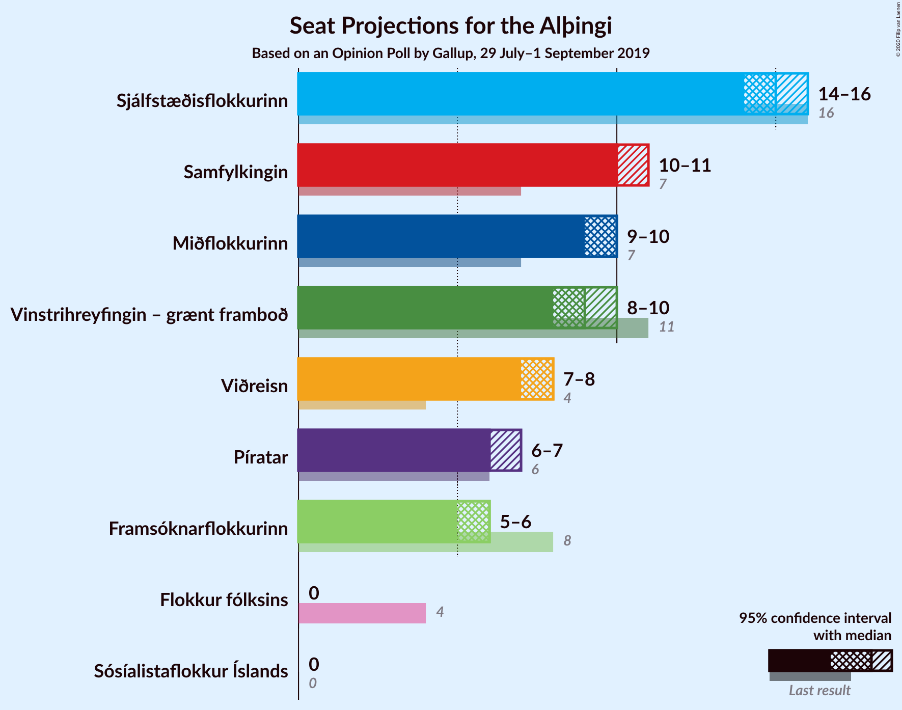
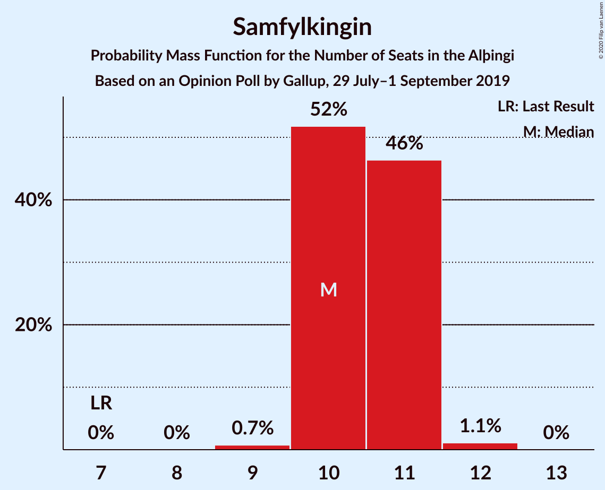

# Opinion Poll by Gallup, 29 July–1 September 2019

<a href="#voting-intentions">Voting Intentions</a> | <a href="#seats">Seats</a> | <a href="#coalitions">Coalitions</a> | <a href="#technical-information">Technical Information</a>

## Voting Intentions

### Confidence Intervals

| Party | Last Result | Poll Result | 80% Confidence Interval | 90% Confidence Interval | 95% Confidence Interval | 99% Confidence Interval |
|:-----:|:-----------:|:-----------:|:-----------------------:|:-----------------------:|:-----------------------:|:-----------------------:|
| Sjálfstæðisflokkurinn | 25.2% | 21.7% | 20.9–22.6% |20.7–22.8% |20.5–23.0% |20.1–23.4% |
| Samfylkingin | 12.1% | 15.5% | 14.8–16.3% |14.6–16.5% |14.4–16.7% |14.1–17.0% |
| Miðflokkurinn | 10.9% | 13.4% | 12.7–14.1% |12.5–14.3% |12.4–14.5% |12.1–14.8% |
| Vinstrihreyfingin – grænt framboð | 16.9% | 12.8% | 12.1–13.5% |12.0–13.7% |11.8–13.9% |11.5–14.2% |
| Viðreisn | 6.7% | 11.4% | 10.8–12.1% |10.6–12.3% |10.5–12.4% |10.2–12.8% |
| Píratar | 9.2% | 9.3% | 8.7–9.9% |8.6–10.1% |8.4–10.2% |8.2–10.5% |
| Framsóknarflokkurinn | 10.7% | 8.3% | 7.8–8.9% |7.6–9.1% |7.5–9.2% |7.2–9.5% |
| Flokkur fólksins | 6.9% | 3.8% | 3.4–4.2% |3.3–4.3% |3.2–4.4% |3.1–4.6% |

*Note:* The poll result column reflects the actual value used in the calculations. Published results may vary slightly, and in addition be rounded to fewer digits.

## Seats

### Confidence Intervals

| Party | Last Result | Median | 80% Confidence Interval | 90% Confidence Interval | 95% Confidence Interval | 99% Confidence Interval |
|:-----:|:-----------:|:------:|:-----------------------:|:-----------------------:|:-----------------------:|:-----------------------:|
| <a href="#sjálfstæðisflokkurinn">Sjálfstæðisflokkurinn</a> | 16 | 15 | 14–15 |14–16 |14–16 |14–16 |
| <a href="#samfylkingin">Samfylkingin</a> | 7 | 11 | 10–11 |10–11 |10–11 |10–12 |
| <a href="#miðflokkurinn">Miðflokkurinn</a> | 7 | 9 | 9–10 |9–10 |9–10 |9–10 |
| <a href="#vinstrihreyfingin-–-grænt-framboð">Vinstrihreyfingin – grænt framboð</a> | 11 | 9 | 8–10 |8–10 |8–10 |8–10 |
| <a href="#viðreisn">Viðreisn</a> | 4 | 8 | 7–8 |7–8 |7–8 |7–9 |
| <a href="#píratar">Píratar</a> | 6 | 6 | 6–7 |6–7 |6–7 |5–7 |
| <a href="#framsóknarflokkurinn">Framsóknarflokkurinn</a> | 8 | 5 | 5–6 |5–6 |5–6 |5–6 |
| <a href="#flokkur-fólksins">Flokkur fólksins</a> | 4 | 0 | 0 |0 |0 |0 |

### Sjálfstæðisflokkurinn

*For a full overview of the results for this party, see the [Sjálfstæðisflokkurinn](party-sjálfstæðisflokkurinn.html) page.*

| Number of Seats | Probability | Accumulated | Special Marks |
|:---------------:|:-----------:|:-----------:|:-------------:|
| 14 | 10% | 100% |  |
| 15 | 80% | 90% | Median |
| 16 | 10% | 10% | Last Result |
| 17 | 0% | 0% |  |

### Samfylkingin

*For a full overview of the results for this party, see the [Samfylkingin](party-samfylkingin.html) page.*

| Number of Seats | Probability | Accumulated | Special Marks |
|:---------------:|:-----------:|:-----------:|:-------------:|
| 7 | 0% | 100% | Last Result |
| 8 | 0% | 100% |  |
| 9 | 0.4% | 100% |  |
| 10 | 29% | 99.6% |  |
| 11 | 70% | 71% | Median |
| 12 | 0.8% | 0.8% |  |
| 13 | 0% | 0% |  |

### Miðflokkurinn

*For a full overview of the results for this party, see the [Miðflokkurinn](party-miðflokkurinn.html) page.*

| Number of Seats | Probability | Accumulated | Special Marks |
|:---------------:|:-----------:|:-----------:|:-------------:|
| 7 | 0% | 100% | Last Result |
| 8 | 0% | 100% |  |
| 9 | 62% | 100% | Median |
| 10 | 37% | 38% |  |
| 11 | 0.1% | 0.1% |  |
| 12 | 0% | 0% |  |

### Vinstrihreyfingin – grænt framboð

*For a full overview of the results for this party, see the [Vinstrihreyfingin – grænt framboð](party-vinstrihreyfingin–græntframboð.html) page.*

| Number of Seats | Probability | Accumulated | Special Marks |
|:---------------:|:-----------:|:-----------:|:-------------:|
| 7 | 0.1% | 100% |  |
| 8 | 24% | 99.9% |  |
| 9 | 63% | 76% | Median |
| 10 | 13% | 13% |  |
| 11 | 0% | 0% | Last Result |

### Viðreisn

*For a full overview of the results for this party, see the [Viðreisn](party-viðreisn.html) page.*

| Number of Seats | Probability | Accumulated | Special Marks |
|:---------------:|:-----------:|:-----------:|:-------------:|
| 4 | 0% | 100% | Last Result |
| 5 | 0% | 100% |  |
| 6 | 0.1% | 100% |  |
| 7 | 19% | 99.9% |  |
| 8 | 80% | 81% | Median |
| 9 | 1.2% | 1.2% |  |
| 10 | 0% | 0% |  |

### Píratar

*For a full overview of the results for this party, see the [Píratar](party-píratar.html) page.*

| Number of Seats | Probability | Accumulated | Special Marks |
|:---------------:|:-----------:|:-----------:|:-------------:|
| 5 | 1.2% | 100% |  |
| 6 | 89% | 98.8% | Last Result, Median |
| 7 | 10% | 10% |  |
| 8 | 0% | 0% |  |

### Framsóknarflokkurinn

*For a full overview of the results for this party, see the [Framsóknarflokkurinn](party-framsóknarflokkurinn.html) page.*

| Number of Seats | Probability | Accumulated | Special Marks |
|:---------------:|:-----------:|:-----------:|:-------------:|
| 4 | 0.1% | 100% |  |
| 5 | 88% | 99.9% | Median |
| 6 | 12% | 12% |  |
| 7 | 0.1% | 0.1% |  |
| 8 | 0% | 0% | Last Result |

### Flokkur fólksins

*For a full overview of the results for this party, see the [Flokkur fólksins](party-flokkurfólksins.html) page.*

| Number of Seats | Probability | Accumulated | Special Marks |
|:---------------:|:-----------:|:-----------:|:-------------:|
| 0 | 100% | 100% | Median |
| 1 | 0% | 0% |  |
| 2 | 0% | 0% |  |
| 3 | 0% | 0% |  |
| 4 | 0% | 0% | Last Result |

## Coalitions

### Confidence Intervals

| Coalition | Last Result | Median | Majority? | 80% Confidence Interval | 90% Confidence Interval | 95% Confidence Interval | 99% Confidence Interval |
|:---------:|:-----------:|:------:|:---------:|:-----------------------:|:-----------------------:|:-----------------------:|:-----------------------:|
| Samfylkingin – Miðflokkurinn – Vinstrihreyfingin – grænt framboð – Framsóknarflokkurinn | 33 | 34 | 100% | 34–35 | 33–35 | 33–35 | 33–36 |
| Samfylkingin – Vinstrihreyfingin – grænt framboð – Viðreisn – Píratar | 28 | 34 | 99.4% | 33–34 | 32–34 | 32–34 | 31–34 |
| Sjálfstæðisflokkurinn – Miðflokkurinn – Framsóknarflokkurinn | 31 | 29 | 0.5% | 29–30 | 29–31 | 29–31 | 29–32 |
| Sjálfstæðisflokkurinn – Vinstrihreyfingin – grænt framboð – Framsóknarflokkurinn | 35 | 29 | 0% | 28–30 | 28–30 | 28–30 | 27–31 |
| Samfylkingin – Miðflokkurinn – Vinstrihreyfingin – grænt framboð | 25 | 29 | 0% | 28–30 | 28–30 | 28–30 | 27–30 |
| Sjálfstæðisflokkurinn – Samfylkingin | 23 | 26 | 0% | 25–26 | 25–26 | 25–27 | 24–27 |
| Sjálfstæðisflokkurinn – Miðflokkurinn | 23 | 24 | 0% | 24–25 | 24–25 | 24–26 | 23–26 |
| Samfylkingin – Vinstrihreyfingin – grænt framboð – Píratar | 24 | 26 | 0% | 25–26 | 25–26 | 24–26 | 24–27 |
| Samfylkingin – Vinstrihreyfingin – grænt framboð – Framsóknarflokkurinn | 26 | 25 | 0% | 24–25 | 24–26 | 23–26 | 23–26 |
| Miðflokkurinn – Vinstrihreyfingin – grænt framboð – Framsóknarflokkurinn | 26 | 23 | 0% | 23–24 | 23–24 | 23–25 | 22–25 |
| Sjálfstæðisflokkurinn – Vinstrihreyfingin – grænt framboð | 27 | 24 | 0% | 23–25 | 23–25 | 23–25 | 22–25 |
| Sjálfstæðisflokkurinn – Viðreisn | 20 | 23 | 0% | 22–23 | 22–24 | 21–24 | 21–24 |
| Sjálfstæðisflokkurinn – Framsóknarflokkurinn | 24 | 20 | 0% | 20–21 | 19–21 | 19–21 | 19–22 |
| Samfylkingin – Vinstrihreyfingin – grænt framboð | 18 | 20 | 0% | 19–20 | 19–20 | 18–20 | 18–21 |
| Miðflokkurinn – Vinstrihreyfingin – grænt framboð | 18 | 18 | 0% | 18–19 | 18–19 | 18–19 | 17–19 |
| Vinstrihreyfingin – grænt framboð – Píratar | 17 | 15 | 0% | 14–16 | 14–16 | 14–16 | 14–16 |
| Vinstrihreyfingin – grænt framboð – Framsóknarflokkurinn | 19 | 14 | 0% | 13–15 | 13–15 | 13–15 | 13–16 |

### Samfylkingin – Miðflokkurinn – Vinstrihreyfingin – grænt framboð – Framsóknarflokkurinn

| Number of Seats | Probability | Accumulated | Special Marks |
|:---------------:|:-----------:|:-----------:|:-------------:|
| 32 | 0.3% | 100% | Majority |
| 33 | 7% | 99.7% | Last Result |
| 34 | 77% | 92% | Median |
| 35 | 13% | 15% |  |
| 36 | 2% | 2% |  |
| 37 | 0% | 0% |  |

### Samfylkingin – Vinstrihreyfingin – grænt framboð – Viðreisn – Píratar

| Number of Seats | Probability | Accumulated | Special Marks |
|:---------------:|:-----------:|:-----------:|:-------------:|
| 28 | 0% | 100% | Last Result |
| 29 | 0% | 100% |  |
| 30 | 0% | 100% |  |
| 31 | 0.6% | 100% |  |
| 32 | 6% | 99.4% | Majority |
| 33 | 36% | 93% |  |
| 34 | 57% | 58% | Median |
| 35 | 0.5% | 0.5% |  |
| 36 | 0% | 0% |  |

### Sjálfstæðisflokkurinn – Miðflokkurinn – Framsóknarflokkurinn

| Number of Seats | Probability | Accumulated | Special Marks |
|:---------------:|:-----------:|:-----------:|:-------------:|
| 28 | 0.5% | 100% |  |
| 29 | 57% | 99.5% | Median |
| 30 | 36% | 42% |  |
| 31 | 6% | 7% | Last Result |
| 32 | 0.5% | 0.5% | Majority |
| 33 | 0% | 0% |  |

### Sjálfstæðisflokkurinn – Vinstrihreyfingin – grænt framboð – Framsóknarflokkurinn

| Number of Seats | Probability | Accumulated | Special Marks |
|:---------------:|:-----------:|:-----------:|:-------------:|
| 27 | 0.8% | 100% |  |
| 28 | 22% | 99.2% |  |
| 29 | 55% | 77% | Median |
| 30 | 21% | 22% |  |
| 31 | 2% | 2% |  |
| 32 | 0% | 0% | Majority |
| 33 | 0% | 0% |  |
| 34 | 0% | 0% |  |
| 35 | 0% | 0% | Last Result |

### Samfylkingin – Miðflokkurinn – Vinstrihreyfingin – grænt framboð

| Number of Seats | Probability | Accumulated | Special Marks |
|:---------------:|:-----------:|:-----------:|:-------------:|
| 25 | 0% | 100% | Last Result |
| 26 | 0% | 100% |  |
| 27 | 0.6% | 100% |  |
| 28 | 12% | 99.4% |  |
| 29 | 77% | 87% | Median |
| 30 | 10% | 11% |  |
| 31 | 0.3% | 0.3% |  |
| 32 | 0% | 0% | Majority |

### Sjálfstæðisflokkurinn – Samfylkingin

| Number of Seats | Probability | Accumulated | Special Marks |
|:---------------:|:-----------:|:-----------:|:-------------:|
| 23 | 0% | 100% | Last Result |
| 24 | 2% | 100% |  |
| 25 | 31% | 98% |  |
| 26 | 63% | 68% | Median |
| 27 | 5% | 5% |  |
| 28 | 0.1% | 0.1% |  |
| 29 | 0% | 0% |  |

### Sjálfstæðisflokkurinn – Miðflokkurinn

| Number of Seats | Probability | Accumulated | Special Marks |
|:---------------:|:-----------:|:-----------:|:-------------:|
| 23 | 2% | 100% | Last Result |
| 24 | 62% | 98% | Median |
| 25 | 32% | 35% |  |
| 26 | 4% | 4% |  |
| 27 | 0% | 0% |  |

### Samfylkingin – Vinstrihreyfingin – grænt framboð – Píratar

| Number of Seats | Probability | Accumulated | Special Marks |
|:---------------:|:-----------:|:-----------:|:-------------:|
| 23 | 0.2% | 100% |  |
| 24 | 3% | 99.8% | Last Result |
| 25 | 26% | 97% |  |
| 26 | 68% | 70% | Median |
| 27 | 2% | 2% |  |
| 28 | 0% | 0% |  |

### Samfylkingin – Vinstrihreyfingin – grænt framboð – Framsóknarflokkurinn

| Number of Seats | Probability | Accumulated | Special Marks |
|:---------------:|:-----------:|:-----------:|:-------------:|
| 23 | 3% | 100% |  |
| 24 | 27% | 97% |  |
| 25 | 64% | 69% | Median |
| 26 | 5% | 6% | Last Result |
| 27 | 0.4% | 0.4% |  |
| 28 | 0% | 0% |  |

### Miðflokkurinn – Vinstrihreyfingin – grænt framboð – Framsóknarflokkurinn

| Number of Seats | Probability | Accumulated | Special Marks |
|:---------------:|:-----------:|:-----------:|:-------------:|
| 22 | 1.0% | 100% |  |
| 23 | 64% | 99.0% | Median |
| 24 | 31% | 35% |  |
| 25 | 4% | 4% |  |
| 26 | 0.1% | 0.1% | Last Result |
| 27 | 0% | 0% |  |

### Sjálfstæðisflokkurinn – Vinstrihreyfingin – grænt framboð

| Number of Seats | Probability | Accumulated | Special Marks |
|:---------------:|:-----------:|:-----------:|:-------------:|
| 22 | 2% | 100% |  |
| 23 | 25% | 98% |  |
| 24 | 55% | 72% | Median |
| 25 | 17% | 17% |  |
| 26 | 0.3% | 0.3% |  |
| 27 | 0% | 0% | Last Result |

### Sjálfstæðisflokkurinn – Viðreisn

| Number of Seats | Probability | Accumulated | Special Marks |
|:---------------:|:-----------:|:-----------:|:-------------:|
| 20 | 0% | 100% | Last Result |
| 21 | 3% | 100% |  |
| 22 | 19% | 97% |  |
| 23 | 72% | 78% | Median |
| 24 | 6% | 6% |  |
| 25 | 0.1% | 0.1% |  |
| 26 | 0% | 0% |  |

### Sjálfstæðisflokkurinn – Framsóknarflokkurinn

| Number of Seats | Probability | Accumulated | Special Marks |
|:---------------:|:-----------:|:-----------:|:-------------:|
| 19 | 6% | 100% |  |
| 20 | 77% | 94% | Median |
| 21 | 16% | 17% |  |
| 22 | 1.1% | 1.1% |  |
| 23 | 0% | 0% |  |
| 24 | 0% | 0% | Last Result |

### Samfylkingin – Vinstrihreyfingin – grænt framboð

| Number of Seats | Probability | Accumulated | Special Marks |
|:---------------:|:-----------:|:-----------:|:-------------:|
| 17 | 0.1% | 100% |  |
| 18 | 5% | 99.9% | Last Result |
| 19 | 32% | 95% |  |
| 20 | 61% | 63% | Median |
| 21 | 2% | 2% |  |
| 22 | 0% | 0% |  |

### Miðflokkurinn – Vinstrihreyfingin – grænt framboð

| Number of Seats | Probability | Accumulated | Special Marks |
|:---------------:|:-----------:|:-----------:|:-------------:|
| 17 | 2% | 100% |  |
| 18 | 71% | 98% | Last Result, Median |
| 19 | 28% | 28% |  |
| 20 | 0.1% | 0.1% |  |
| 21 | 0% | 0% |  |

### Vinstrihreyfingin – grænt framboð – Píratar

| Number of Seats | Probability | Accumulated | Special Marks |
|:---------------:|:-----------:|:-----------:|:-------------:|
| 13 | 0.4% | 100% |  |
| 14 | 21% | 99.6% |  |
| 15 | 59% | 78% | Median |
| 16 | 20% | 20% |  |
| 17 | 0.1% | 0.1% | Last Result |
| 18 | 0% | 0% |  |

### Vinstrihreyfingin – grænt framboð – Framsóknarflokkurinn

| Number of Seats | Probability | Accumulated | Special Marks |
|:---------------:|:-----------:|:-----------:|:-------------:|
| 13 | 20% | 100% |  |
| 14 | 60% | 80% | Median |
| 15 | 17% | 19% |  |
| 16 | 2% | 2% |  |
| 17 | 0% | 0% |  |
| 18 | 0% | 0% |  |
| 19 | 0% | 0% | Last Result |

## Technical Information

### Opinion Poll

+ **Polling firm:** Gallup
+ **Commissioner(s):** —
+ **Fieldwork period:** 29 July–1 September 2019

### Calculations

+ **Sample size:** 3976
+ **Simulations done:** 131,072
+ **Error estimate:** 0.58%

