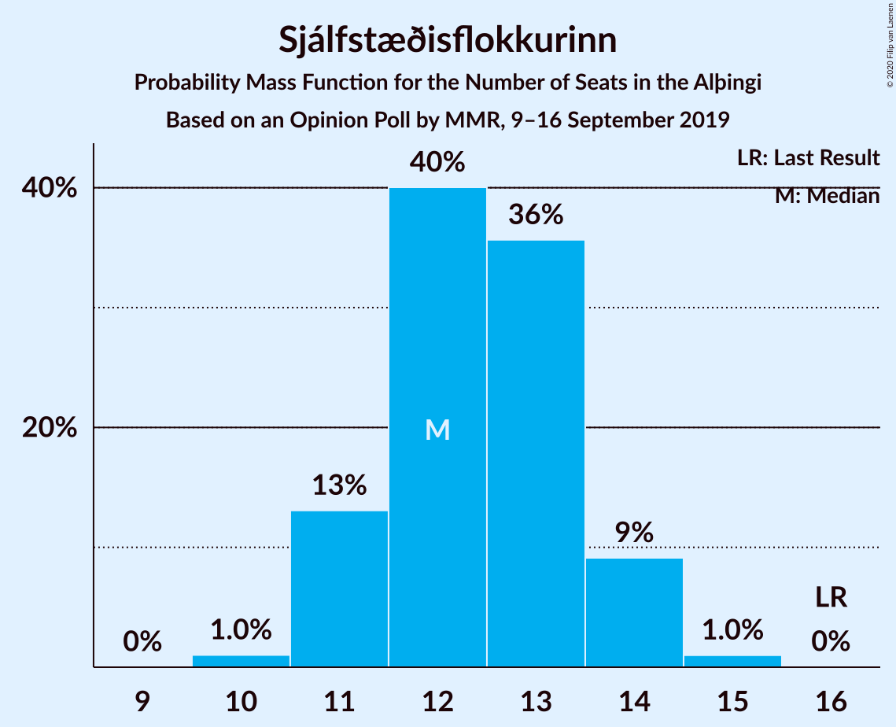
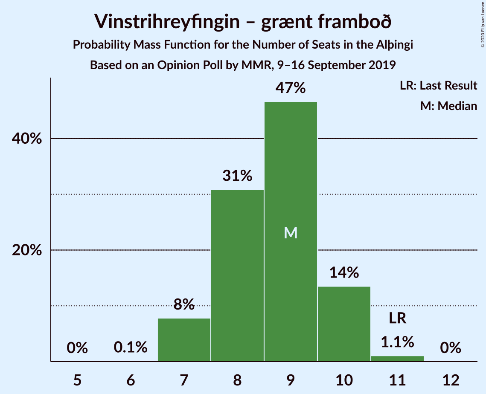
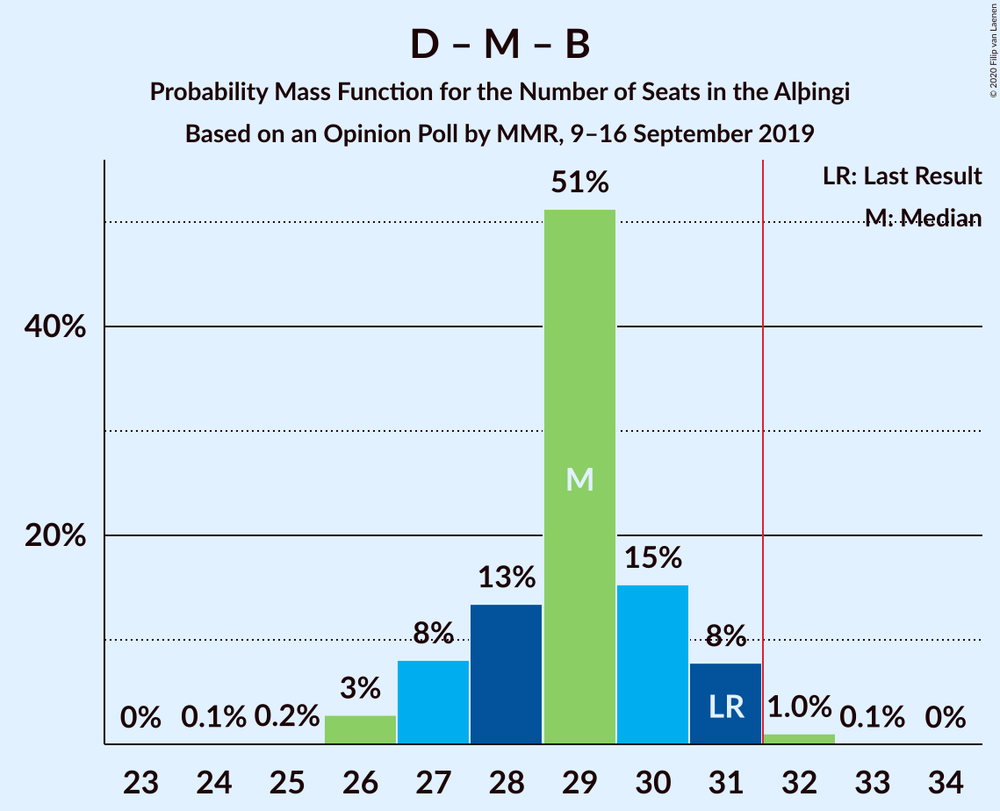
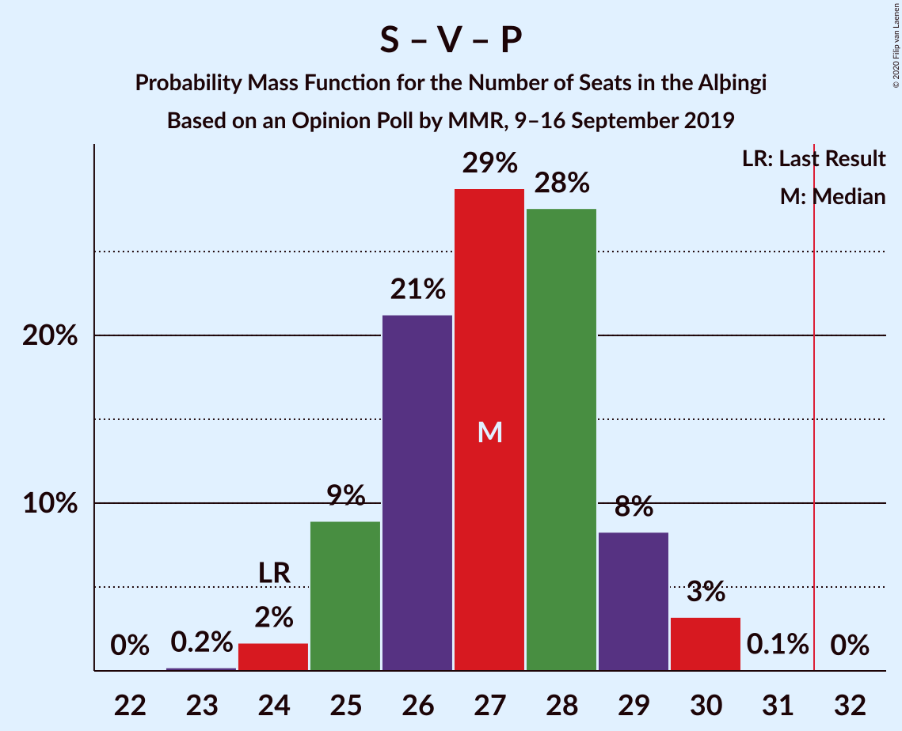
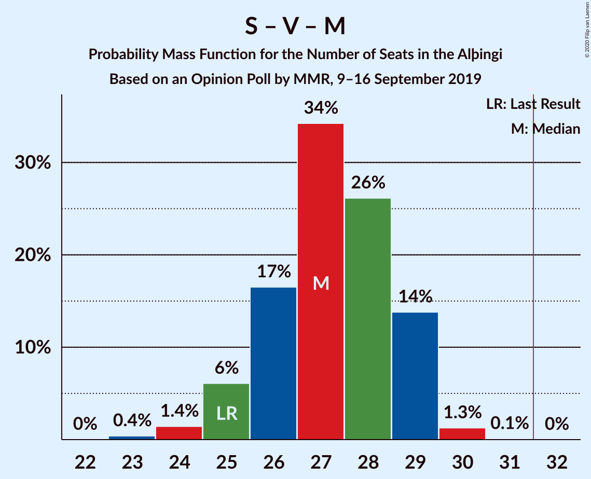
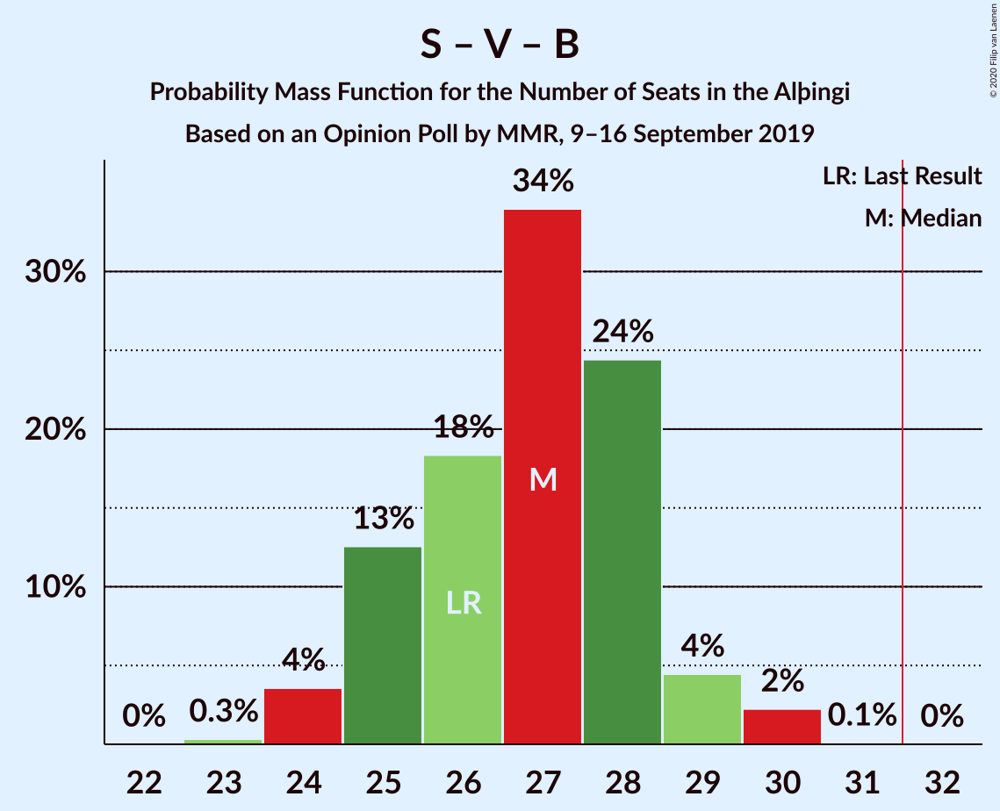

# Opinion Poll by MMR, 9–16 September 2019

<a href="#voting-intentions">Voting Intentions</a> | <a href="#seats">Seats</a> | <a href="#coalitions">Coalitions</a> | <a href="#technical-information">Technical Information</a>

## Voting Intentions

### Confidence Intervals

| Party | Last Result | Poll Result | 80% Confidence Interval | 90% Confidence Interval | 95% Confidence Interval | 99% Confidence Interval |
|:-----:|:-----------:|:-----------:|:-----------------------:|:-----------------------:|:-----------------------:|:-----------------------:|
| Sjálfstæðisflokkurinn | 25.2% | 18.3% | 16.8–19.9% |16.4–20.3% |16.0–20.7% |15.4–21.5% |
| Samfylkingin | 12.1% | 14.8% | 13.5–16.3% |13.1–16.8% |12.8–17.1% |12.2–17.8% |
| Vinstrihreyfingin – grænt framboð | 16.9% | 12.8% | 11.6–14.2% |11.2–14.6% |10.9–15.0% |10.4–15.7% |
| Píratar | 9.2% | 12.4% | 11.2–13.8% |10.9–14.2% |10.6–14.6% |10.0–15.3% |
| Miðflokkurinn | 10.9% | 12.1% | 10.9–13.4% |10.5–13.8% |10.2–14.2% |9.7–14.9% |
| Framsóknarflokkurinn | 10.7% | 11.8% | 10.6–13.1% |10.2–13.5% |10.0–13.9% |9.4–14.6% |
| Viðreisn | 6.7% | 10.2% | 9.1–11.5% |8.8–11.9% |8.6–12.2% |8.0–12.9% |
| Flokkur fólksins | 6.9% | 4.0% | 3.3–4.9% |3.1–5.2% |3.0–5.4% |2.7–5.9% |
| Sósíalistaflokkur Íslands | 0.0% | 2.0% | 1.6–2.7% |1.4–2.9% |1.3–3.1% |1.1–3.4% |

*Note:* The poll result column reflects the actual value used in the calculations. Published results may vary slightly, and in addition be rounded to fewer digits.

## Seats

### Confidence Intervals

| Party | Last Result | Median | 80% Confidence Interval | 90% Confidence Interval | 95% Confidence Interval | 99% Confidence Interval |
|:-----:|:-----------:|:------:|:-----------------------:|:-----------------------:|:-----------------------:|:-----------------------:|
| <a href="#sjálfstæðisflokkurinn">Sjálfstæðisflokkurinn</a> | 16 | 12 | 11–14 |11–14 |11–14 |10–15 |
| <a href="#samfylkingin">Samfylkingin</a> | 7 | 10 | 9–11 |9–11 |8–12 |8–12 |
| <a href="#vinstrihreyfingin-–-grænt-framboð">Vinstrihreyfingin – grænt framboð</a> | 11 | 9 | 8–10 |7–10 |7–10 |7–11 |
| <a href="#píratar">Píratar</a> | 6 | 8 | 7–9 |7–9 |7–10 |7–10 |
| <a href="#miðflokkurinn">Miðflokkurinn</a> | 7 | 8 | 7–10 |7–10 |7–10 |6–10 |
| <a href="#framsóknarflokkurinn">Framsóknarflokkurinn</a> | 8 | 8 | 7–9 |7–10 |7–10 |6–10 |
| <a href="#viðreisn">Viðreisn</a> | 4 | 7 | 6–8 |6–8 |6–8 |5–9 |
| <a href="#flokkur-fólksins">Flokkur fólksins</a> | 4 | 0 | 0 |0–3 |0–3 |0–3 |
| <a href="#sósíalistaflokkur-íslands">Sósíalistaflokkur Íslands</a> | 0 | 0 | 0 |0 |0 |0 |

### Sjálfstæðisflokkurinn

*For a full overview of the results for this party, see the [Sjálfstæðisflokkurinn](party-sjálfstæðisflokkurinn.html) page.*

| Number of Seats | Probability | Accumulated | Special Marks |
|:---------------:|:-----------:|:-----------:|:-------------:|
| 10 | 1.0% | 100% |  |
| 11 | 13% | 98.9% |  |
| 12 | 40% | 86% | Median |
| 13 | 36% | 46% |  |
| 14 | 9% | 10% |  |
| 15 | 1.0% | 1.0% |  |
| 16 | 0% | 0% | Last Result |

### Samfylkingin

*For a full overview of the results for this party, see the [Samfylkingin](party-samfylkingin.html) page.*

| Number of Seats | Probability | Accumulated | Special Marks |
|:---------------:|:-----------:|:-----------:|:-------------:|
| 7 | 0% | 100% | Last Result |
| 8 | 4% | 100% |  |
| 9 | 18% | 96% |  |
| 10 | 49% | 78% | Median |
| 11 | 26% | 30% |  |
| 12 | 3% | 4% |  |
| 13 | 0.3% | 0.3% |  |
| 14 | 0% | 0% |  |

### Vinstrihreyfingin – grænt framboð

*For a full overview of the results for this party, see the [Vinstrihreyfingin – grænt framboð](party-vinstrihreyfingin–græntframboð.html) page.*

| Number of Seats | Probability | Accumulated | Special Marks |
|:---------------:|:-----------:|:-----------:|:-------------:|
| 6 | 0.1% | 100% |  |
| 7 | 8% | 99.9% |  |
| 8 | 31% | 92% |  |
| 9 | 47% | 61% | Median |
| 10 | 14% | 15% |  |
| 11 | 1.1% | 1.1% | Last Result |
| 12 | 0% | 0% |  |

### Píratar

*For a full overview of the results for this party, see the [Píratar](party-píratar.html) page.*

| Number of Seats | Probability | Accumulated | Special Marks |
|:---------------:|:-----------:|:-----------:|:-------------:|
| 6 | 0.4% | 100% | Last Result |
| 7 | 10% | 99.5% |  |
| 8 | 51% | 89% | Median |
| 9 | 34% | 38% |  |
| 10 | 4% | 4% |  |
| 11 | 0.2% | 0.2% |  |
| 12 | 0% | 0% |  |

### Miðflokkurinn

*For a full overview of the results for this party, see the [Miðflokkurinn](party-miðflokkurinn.html) page.*

| Number of Seats | Probability | Accumulated | Special Marks |
|:---------------:|:-----------:|:-----------:|:-------------:|
| 6 | 2% | 100% |  |
| 7 | 14% | 98% | Last Result |
| 8 | 35% | 85% | Median |
| 9 | 35% | 49% |  |
| 10 | 14% | 14% |  |
| 11 | 0.1% | 0.1% |  |
| 12 | 0% | 0% |  |

### Framsóknarflokkurinn

*For a full overview of the results for this party, see the [Framsóknarflokkurinn](party-framsóknarflokkurinn.html) page.*

| Number of Seats | Probability | Accumulated | Special Marks |
|:---------------:|:-----------:|:-----------:|:-------------:|
| 6 | 1.5% | 100% |  |
| 7 | 22% | 98% |  |
| 8 | 54% | 76% | Last Result, Median |
| 9 | 13% | 23% |  |
| 10 | 10% | 10% |  |
| 11 | 0.1% | 0.1% |  |
| 12 | 0% | 0% |  |

### Viðreisn

*For a full overview of the results for this party, see the [Viðreisn](party-viðreisn.html) page.*

| Number of Seats | Probability | Accumulated | Special Marks |
|:---------------:|:-----------:|:-----------:|:-------------:|
| 4 | 0% | 100% | Last Result |
| 5 | 2% | 100% |  |
| 6 | 41% | 98% |  |
| 7 | 45% | 57% | Median |
| 8 | 11% | 12% |  |
| 9 | 0.7% | 0.7% |  |
| 10 | 0% | 0% |  |

### Flokkur fólksins

*For a full overview of the results for this party, see the [Flokkur fólksins](party-flokkurfólksins.html) page.*

| Number of Seats | Probability | Accumulated | Special Marks |
|:---------------:|:-----------:|:-----------:|:-------------:|
| 0 | 90% | 100% | Median |
| 1 | 0% | 10% |  |
| 2 | 0% | 10% |  |
| 3 | 9% | 10% |  |
| 4 | 0.4% | 0.4% | Last Result |
| 5 | 0% | 0% |  |

### Sósíalistaflokkur Íslands

*For a full overview of the results for this party, see the [Sósíalistaflokkur Íslands](party-sósíalistaflokkuríslands.html) page.*

| Number of Seats | Probability | Accumulated | Special Marks |
|:---------------:|:-----------:|:-----------:|:-------------:|
| 0 | 100% | 100% | Last Result, Median |

## Coalitions

### Confidence Intervals

| Coalition | Last Result | Median | Majority? | 80% Confidence Interval | 90% Confidence Interval | 95% Confidence Interval | 99% Confidence Interval |
|:---------:|:-----------:|:------:|:---------:|:-----------------------:|:-----------------------:|:-----------------------:|:-----------------------:|
| Samfylkingin – Vinstrihreyfingin – grænt framboð – Miðflokkurinn – Framsóknarflokkurinn | 33 | 35 | 99.7% | 34–37 | 33–37 | 33–37 | 32–38 |
| Samfylkingin – Vinstrihreyfingin – grænt framboð – Píratar – Viðreisn | 28 | 34 | 95% | 32–35 | 31–36 | 31–36 | 30–37 |
| Sjálfstæðisflokkurinn – Vinstrihreyfingin – grænt framboð – Framsóknarflokkurinn | 35 | 29 | 5% | 27–31 | 27–31 | 26–32 | 26–32 |
| Sjálfstæðisflokkurinn – Miðflokkurinn – Framsóknarflokkurinn | 31 | 29 | 1.1% | 27–30 | 27–31 | 26–31 | 26–32 |
| Samfylkingin – Vinstrihreyfingin – grænt framboð – Píratar | 24 | 27 | 0% | 25–29 | 25–29 | 25–30 | 24–30 |
| Samfylkingin – Vinstrihreyfingin – grænt framboð – Miðflokkurinn | 25 | 27 | 0% | 26–29 | 25–29 | 25–29 | 24–30 |
| Samfylkingin – Vinstrihreyfingin – grænt framboð – Framsóknarflokkurinn | 26 | 27 | 0% | 25–28 | 25–29 | 24–29 | 24–30 |
| Vinstrihreyfingin – grænt framboð – Miðflokkurinn – Framsóknarflokkurinn | 26 | 25 | 0% | 24–27 | 23–27 | 23–27 | 22–28 |
| Sjálfstæðisflokkurinn – Samfylkingin | 23 | 22 | 0% | 21–24 | 21–24 | 20–25 | 20–26 |
| Sjálfstæðisflokkurinn – Vinstrihreyfingin – grænt framboð | 27 | 21 | 0% | 20–22 | 19–23 | 19–24 | 18–24 |
| Sjálfstæðisflokkurinn – Miðflokkurinn | 23 | 21 | 0% | 20–22 | 19–23 | 19–23 | 17–24 |
| Sjálfstæðisflokkurinn – Framsóknarflokkurinn | 24 | 21 | 0% | 19–22 | 19–22 | 18–23 | 18–24 |
| Sjálfstæðisflokkurinn – Viðreisn | 20 | 19 | 0% | 18–20 | 17–21 | 17–21 | 16–22 |
| Samfylkingin – Vinstrihreyfingin – grænt framboð | 18 | 19 | 0% | 17–20 | 17–20 | 16–21 | 16–22 |
| Vinstrihreyfingin – grænt framboð – Framsóknarflokkurinn | 19 | 17 | 0% | 15–18 | 15–19 | 15–19 | 14–20 |
| Vinstrihreyfingin – grænt framboð – Miðflokkurinn | 18 | 17 | 0% | 16–19 | 15–19 | 15–19 | 14–20 |
| Vinstrihreyfingin – grænt framboð – Píratar | 17 | 17 | 0% | 16–18 | 15–19 | 15–19 | 14–20 |

### Samfylkingin – Vinstrihreyfingin – grænt framboð – Miðflokkurinn – Framsóknarflokkurinn

| Number of Seats | Probability | Accumulated | Special Marks |
|:---------------:|:-----------:|:-----------:|:-------------:|
| 31 | 0.3% | 100% |  |
| 32 | 0.5% | 99.7% | Majority |
| 33 | 7% | 99.1% | Last Result |
| 34 | 15% | 92% |  |
| 35 | 29% | 77% | Median |
| 36 | 37% | 49% |  |
| 37 | 10% | 11% |  |
| 38 | 2% | 2% |  |
| 39 | 0.1% | 0.1% |  |
| 40 | 0% | 0% |  |

### Samfylkingin – Vinstrihreyfingin – grænt framboð – Píratar – Viðreisn

| Number of Seats | Probability | Accumulated | Special Marks |
|:---------------:|:-----------:|:-----------:|:-------------:|
| 28 | 0% | 100% | Last Result |
| 29 | 0.1% | 100% |  |
| 30 | 0.8% | 99.9% |  |
| 31 | 4% | 99.1% |  |
| 32 | 12% | 95% | Majority |
| 33 | 15% | 83% |  |
| 34 | 48% | 68% | Median |
| 35 | 10% | 19% |  |
| 36 | 7% | 10% |  |
| 37 | 2% | 2% |  |
| 38 | 0% | 0% |  |

### Sjálfstæðisflokkurinn – Vinstrihreyfingin – grænt framboð – Framsóknarflokkurinn

| Number of Seats | Probability | Accumulated | Special Marks |
|:---------------:|:-----------:|:-----------:|:-------------:|
| 25 | 0.2% | 100% |  |
| 26 | 3% | 99.8% |  |
| 27 | 8% | 97% |  |
| 28 | 15% | 89% |  |
| 29 | 31% | 74% | Median |
| 30 | 31% | 42% |  |
| 31 | 6% | 11% |  |
| 32 | 4% | 5% | Majority |
| 33 | 0.4% | 0.5% |  |
| 34 | 0% | 0% |  |
| 35 | 0% | 0% | Last Result |

### Sjálfstæðisflokkurinn – Miðflokkurinn – Framsóknarflokkurinn

| Number of Seats | Probability | Accumulated | Special Marks |
|:---------------:|:-----------:|:-----------:|:-------------:|
| 24 | 0.1% | 100% |  |
| 25 | 0.2% | 99.9% |  |
| 26 | 3% | 99.8% |  |
| 27 | 8% | 97% |  |
| 28 | 13% | 89% | Median |
| 29 | 51% | 75% |  |
| 30 | 15% | 24% |  |
| 31 | 8% | 9% | Last Result |
| 32 | 1.0% | 1.1% | Majority |
| 33 | 0.1% | 0.1% |  |
| 34 | 0% | 0% |  |

### Samfylkingin – Vinstrihreyfingin – grænt framboð – Píratar

| Number of Seats | Probability | Accumulated | Special Marks |
|:---------------:|:-----------:|:-----------:|:-------------:|
| 23 | 0.2% | 100% |  |
| 24 | 2% | 99.8% | Last Result |
| 25 | 9% | 98% |  |
| 26 | 21% | 89% |  |
| 27 | 29% | 68% | Median |
| 28 | 28% | 39% |  |
| 29 | 8% | 12% |  |
| 30 | 3% | 3% |  |
| 31 | 0.1% | 0.1% |  |
| 32 | 0% | 0% | Majority |

### Samfylkingin – Vinstrihreyfingin – grænt framboð – Miðflokkurinn

| Number of Seats | Probability | Accumulated | Special Marks |
|:---------------:|:-----------:|:-----------:|:-------------:|
| 23 | 0.4% | 100% |  |
| 24 | 1.4% | 99.6% |  |
| 25 | 6% | 98% | Last Result |
| 26 | 17% | 92% |  |
| 27 | 34% | 76% | Median |
| 28 | 26% | 41% |  |
| 29 | 14% | 15% |  |
| 30 | 1.3% | 1.4% |  |
| 31 | 0.1% | 0.1% |  |
| 32 | 0% | 0% | Majority |

### Samfylkingin – Vinstrihreyfingin – grænt framboð – Framsóknarflokkurinn

| Number of Seats | Probability | Accumulated | Special Marks |
|:---------------:|:-----------:|:-----------:|:-------------:|
| 23 | 0.3% | 100% |  |
| 24 | 4% | 99.7% |  |
| 25 | 13% | 96% |  |
| 26 | 18% | 84% | Last Result |
| 27 | 34% | 65% | Median |
| 28 | 24% | 31% |  |
| 29 | 4% | 7% |  |
| 30 | 2% | 2% |  |
| 31 | 0.1% | 0.1% |  |
| 32 | 0% | 0% | Majority |

### Vinstrihreyfingin – grænt framboð – Miðflokkurinn – Framsóknarflokkurinn

| Number of Seats | Probability | Accumulated | Special Marks |
|:---------------:|:-----------:|:-----------:|:-------------:|
| 21 | 0.1% | 100% |  |
| 22 | 1.0% | 99.9% |  |
| 23 | 6% | 98.9% |  |
| 24 | 18% | 93% |  |
| 25 | 32% | 75% | Median |
| 26 | 31% | 42% | Last Result |
| 27 | 10% | 12% |  |
| 28 | 1.2% | 1.3% |  |
| 29 | 0.1% | 0.1% |  |
| 30 | 0% | 0% |  |

### Sjálfstæðisflokkurinn – Samfylkingin

| Number of Seats | Probability | Accumulated | Special Marks |
|:---------------:|:-----------:|:-----------:|:-------------:|
| 19 | 0.4% | 100% |  |
| 20 | 4% | 99.6% |  |
| 21 | 14% | 95% |  |
| 22 | 31% | 81% | Median |
| 23 | 28% | 50% | Last Result |
| 24 | 19% | 22% |  |
| 25 | 3% | 3% |  |
| 26 | 0.5% | 0.6% |  |
| 27 | 0% | 0% |  |

### Sjálfstæðisflokkurinn – Vinstrihreyfingin – grænt framboð

| Number of Seats | Probability | Accumulated | Special Marks |
|:---------------:|:-----------:|:-----------:|:-------------:|
| 17 | 0.1% | 100% |  |
| 18 | 2% | 99.9% |  |
| 19 | 8% | 98% |  |
| 20 | 17% | 90% |  |
| 21 | 37% | 73% | Median |
| 22 | 27% | 37% |  |
| 23 | 7% | 10% |  |
| 24 | 3% | 3% |  |
| 25 | 0.1% | 0.1% |  |
| 26 | 0% | 0% |  |
| 27 | 0% | 0% | Last Result |

### Sjálfstæðisflokkurinn – Miðflokkurinn

| Number of Seats | Probability | Accumulated | Special Marks |
|:---------------:|:-----------:|:-----------:|:-------------:|
| 17 | 0.6% | 100% |  |
| 18 | 2% | 99.4% |  |
| 19 | 7% | 98% |  |
| 20 | 23% | 90% | Median |
| 21 | 42% | 67% |  |
| 22 | 17% | 25% |  |
| 23 | 7% | 8% | Last Result |
| 24 | 0.7% | 0.8% |  |
| 25 | 0.1% | 0.1% |  |
| 26 | 0% | 0% |  |

### Sjálfstæðisflokkurinn – Framsóknarflokkurinn

| Number of Seats | Probability | Accumulated | Special Marks |
|:---------------:|:-----------:|:-----------:|:-------------:|
| 17 | 0.3% | 100% |  |
| 18 | 4% | 99.6% |  |
| 19 | 14% | 95% |  |
| 20 | 30% | 81% | Median |
| 21 | 35% | 52% |  |
| 22 | 12% | 16% |  |
| 23 | 3% | 4% |  |
| 24 | 0.7% | 0.7% | Last Result |
| 25 | 0.1% | 0.1% |  |
| 26 | 0% | 0% |  |

### Sjálfstæðisflokkurinn – Viðreisn

| Number of Seats | Probability | Accumulated | Special Marks |
|:---------------:|:-----------:|:-----------:|:-------------:|
| 16 | 0.6% | 100% |  |
| 17 | 5% | 99.4% |  |
| 18 | 20% | 95% |  |
| 19 | 44% | 75% | Median |
| 20 | 23% | 31% | Last Result |
| 21 | 6% | 8% |  |
| 22 | 1.2% | 1.3% |  |
| 23 | 0.1% | 0.1% |  |
| 24 | 0% | 0% |  |

### Samfylkingin – Vinstrihreyfingin – grænt framboð

| Number of Seats | Probability | Accumulated | Special Marks |
|:---------------:|:-----------:|:-----------:|:-------------:|
| 15 | 0.2% | 100% |  |
| 16 | 3% | 99.8% |  |
| 17 | 9% | 97% |  |
| 18 | 25% | 88% | Last Result |
| 19 | 38% | 63% | Median |
| 20 | 20% | 25% |  |
| 21 | 4% | 5% |  |
| 22 | 0.6% | 0.6% |  |
| 23 | 0% | 0% |  |

### Vinstrihreyfingin – grænt framboð – Framsóknarflokkurinn

| Number of Seats | Probability | Accumulated | Special Marks |
|:---------------:|:-----------:|:-----------:|:-------------:|
| 13 | 0.1% | 100% |  |
| 14 | 1.3% | 99.9% |  |
| 15 | 12% | 98.6% |  |
| 16 | 27% | 87% |  |
| 17 | 35% | 60% | Median |
| 18 | 19% | 25% |  |
| 19 | 5% | 6% | Last Result |
| 20 | 0.6% | 0.6% |  |
| 21 | 0% | 0% |  |

### Vinstrihreyfingin – grænt framboð – Miðflokkurinn

| Number of Seats | Probability | Accumulated | Special Marks |
|:---------------:|:-----------:|:-----------:|:-------------:|
| 13 | 0.1% | 100% |  |
| 14 | 1.2% | 99.9% |  |
| 15 | 5% | 98.7% |  |
| 16 | 23% | 93% |  |
| 17 | 31% | 71% | Median |
| 18 | 28% | 40% | Last Result |
| 19 | 11% | 11% |  |
| 20 | 0.8% | 0.8% |  |
| 21 | 0% | 0% |  |

### Vinstrihreyfingin – grænt framboð – Píratar

| Number of Seats | Probability | Accumulated | Special Marks |
|:---------------:|:-----------:|:-----------:|:-------------:|
| 14 | 0.7% | 100% |  |
| 15 | 7% | 99.3% |  |
| 16 | 24% | 93% |  |
| 17 | 38% | 69% | Last Result, Median |
| 18 | 24% | 31% |  |
| 19 | 6% | 7% |  |
| 20 | 0.9% | 0.9% |  |
| 21 | 0% | 0% |  |

## Technical Information

### Opinion Poll

+ **Polling firm:** MMR
+ **Commissioner(s):** —
+ **Fieldwork period:** 9–16 September 2019

### Calculations

+ **Sample size:** 1045
+ **Simulations done:** 1,048,576
+ **Error estimate:** 1.71%

