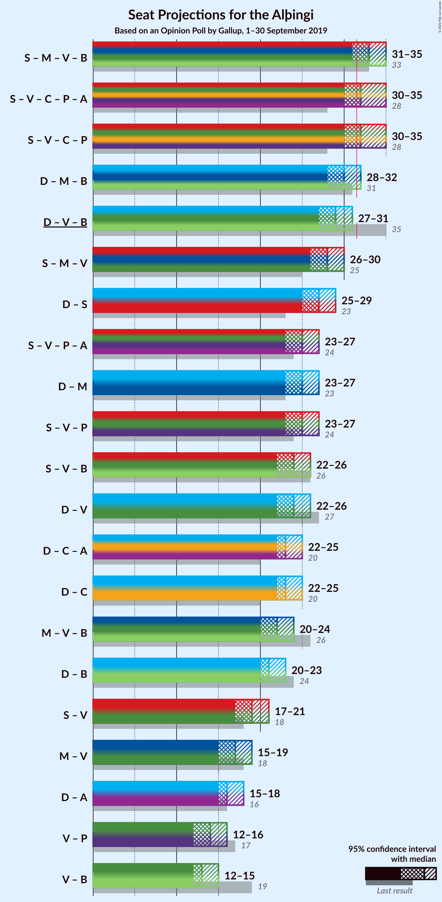
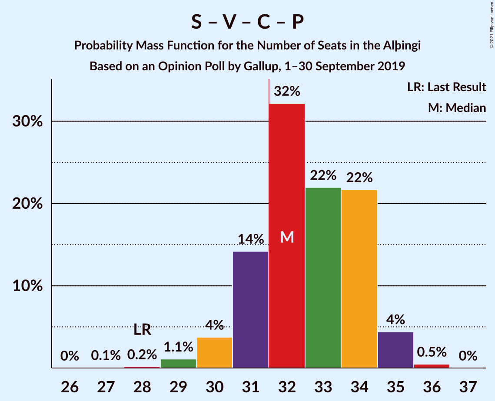
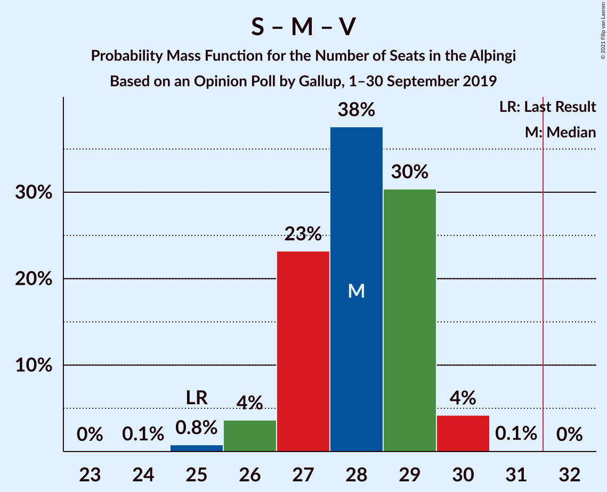

# Opinion Poll by Gallup, 1–30 September 2019

<a href="#voting-intentions">Voting Intentions</a> | <a href="#seats">Seats</a> | <a href="#coalitions">Coalitions</a> | <a href="#technical-information">Technical Information</a>

## Voting Intentions

### Confidence Intervals

| Party | Last Result | Poll Result | 80% Confidence Interval | 90% Confidence Interval | 95% Confidence Interval | 99% Confidence Interval |
|:-----:|:-----------:|:-----------:|:-----------------------:|:-----------------------:|:-----------------------:|:-----------------------:|
| Sjálfstæðisflokkurinn | 25.2% | 23.6% | 22.4–24.8% |22.1–25.2% |21.8–25.5% |21.2–26.1% |
| Samfylkingin | 12.1% | 16.1% | 15.1–17.2% |14.8–17.5% |14.6–17.8% |14.1–18.4% |
| Miðflokkurinn | 10.9% | 12.3% | 11.4–13.3% |11.2–13.6% |11.0–13.9% |10.5–14.3% |
| Vinstrihreyfingin – grænt framboð | 16.9% | 12.0% | 11.1–13.0% |10.9–13.3% |10.7–13.5% |10.3–14.0% |
| Viðreisn | 6.7% | 11.2% | 10.4–12.2% |10.1–12.5% |9.9–12.7% |9.5–13.2% |
| Píratar | 9.2% | 9.7% | 8.9–10.6% |8.7–10.9% |8.5–11.1% |8.2–11.6% |
| Framsóknarflokkurinn | 10.7% | 7.9% | 7.2–8.8% |7.0–9.0% |6.8–9.2% |6.5–9.6% |
| Flokkur fólksins | 6.9% | 4.3% | 3.8–4.9% |3.6–5.1% |3.5–5.3% |3.2–5.6% |
| Sósíalistaflokkur Íslands | 0.0% | 2.7% | 2.3–3.2% |2.2–3.4% |2.1–3.5% |1.9–3.8% |

*Note:* The poll result column reflects the actual value used in the calculations. Published results may vary slightly, and in addition be rounded to fewer digits.

## Seats

### Confidence Intervals

| Party | Last Result | Median | 80% Confidence Interval | 90% Confidence Interval | 95% Confidence Interval | 99% Confidence Interval |
|:-----:|:-----------:|:------:|:-----------------------:|:-----------------------:|:-----------------------:|:-----------------------:|
| <a href="#sjálfstæðisflokkurinn">Sjálfstæðisflokkurinn</a> | 16 | 16 | 15–17 |15–17 |15–18 |14–18 |
| <a href="#samfylkingin">Samfylkingin</a> | 7 | 11 | 10–12 |10–12 |10–12 |9–12 |
| <a href="#miðflokkurinn">Miðflokkurinn</a> | 7 | 10 | 8–10 |8–10 |7–10 |7–10 |
| <a href="#vinstrihreyfingin-–-grænt-framboð">Vinstrihreyfingin – grænt framboð</a> | 11 | 8 | 7–9 |7–9 |7–9 |6–10 |
| <a href="#viðreisn">Viðreisn</a> | 4 | 7 | 7–8 |6–8 |6–8 |6–9 |
| <a href="#píratar">Píratar</a> | 6 | 6 | 6–7 |6–7 |5–7 |5–8 |
| <a href="#framsóknarflokkurinn">Framsóknarflokkurinn</a> | 8 | 5 | 4–6 |4–6 |4–6 |4–6 |
| <a href="#flokkur-fólksins">Flokkur fólksins</a> | 4 | 0 | 0 |0 |0–3 |0–3 |
| <a href="#sósíalistaflokkur-íslands">Sósíalistaflokkur Íslands</a> | 0 | 0 | 0 |0 |0 |0 |

### Sjálfstæðisflokkurinn

*For a full overview of the results for this party, see the [Sjálfstæðisflokkurinn](party-sjálfstæðisflokkurinn.html) page.*

| Number of Seats | Probability | Accumulated | Special Marks |
|:---------------:|:-----------:|:-----------:|:-------------:|
| 14 | 2% | 100% |  |
| 15 | 15% | 98% |  |
| 16 | 50% | 83% | Last Result, Median |
| 17 | 29% | 33% |  |
| 18 | 4% | 4% |  |
| 19 | 0.1% | 0.1% |  |
| 20 | 0% | 0% |  |

### Samfylkingin

*For a full overview of the results for this party, see the [Samfylkingin](party-samfylkingin.html) page.*

| Number of Seats | Probability | Accumulated | Special Marks |
|:---------------:|:-----------:|:-----------:|:-------------:|
| 7 | 0% | 100% | Last Result |
| 8 | 0% | 100% |  |
| 9 | 1.3% | 100% |  |
| 10 | 34% | 98.7% |  |
| 11 | 54% | 65% | Median |
| 12 | 10% | 10% |  |
| 13 | 0.3% | 0.3% |  |
| 14 | 0% | 0% |  |

### Miðflokkurinn

*For a full overview of the results for this party, see the [Miðflokkurinn](party-miðflokkurinn.html) page.*

| Number of Seats | Probability | Accumulated | Special Marks |
|:---------------:|:-----------:|:-----------:|:-------------:|
| 7 | 3% | 100% | Last Result |
| 8 | 11% | 97% |  |
| 9 | 32% | 85% |  |
| 10 | 53% | 53% | Median |
| 11 | 0% | 0% |  |

### Vinstrihreyfingin – grænt framboð

*For a full overview of the results for this party, see the [Vinstrihreyfingin – grænt framboð](party-vinstrihreyfingin–græntframboð.html) page.*

| Number of Seats | Probability | Accumulated | Special Marks |
|:---------------:|:-----------:|:-----------:|:-------------:|
| 6 | 1.5% | 100% |  |
| 7 | 23% | 98.5% |  |
| 8 | 61% | 76% | Median |
| 9 | 14% | 15% |  |
| 10 | 1.0% | 1.0% |  |
| 11 | 0% | 0% | Last Result |

### Viðreisn

*For a full overview of the results for this party, see the [Viðreisn](party-viðreisn.html) page.*

| Number of Seats | Probability | Accumulated | Special Marks |
|:---------------:|:-----------:|:-----------:|:-------------:|
| 4 | 0% | 100% | Last Result |
| 5 | 0% | 100% |  |
| 6 | 8% | 100% |  |
| 7 | 46% | 92% | Median |
| 8 | 45% | 46% |  |
| 9 | 0.6% | 0.6% |  |
| 10 | 0% | 0% |  |

### Píratar

*For a full overview of the results for this party, see the [Píratar](party-píratar.html) page.*

| Number of Seats | Probability | Accumulated | Special Marks |
|:---------------:|:-----------:|:-----------:|:-------------:|
| 5 | 3% | 100% |  |
| 6 | 66% | 97% | Last Result, Median |
| 7 | 30% | 31% |  |
| 8 | 0.9% | 0.9% |  |
| 9 | 0% | 0% |  |

### Framsóknarflokkurinn

*For a full overview of the results for this party, see the [Framsóknarflokkurinn](party-framsóknarflokkurinn.html) page.*

| Number of Seats | Probability | Accumulated | Special Marks |
|:---------------:|:-----------:|:-----------:|:-------------:|
| 4 | 14% | 100% |  |
| 5 | 74% | 86% | Median |
| 6 | 12% | 12% |  |
| 7 | 0.2% | 0.2% |  |
| 8 | 0% | 0% | Last Result |

### Flokkur fólksins

*For a full overview of the results for this party, see the [Flokkur fólksins](party-flokkurfólksins.html) page.*

| Number of Seats | Probability | Accumulated | Special Marks |
|:---------------:|:-----------:|:-----------:|:-------------:|
| 0 | 95% | 100% | Median |
| 1 | 0% | 5% |  |
| 2 | 0% | 5% |  |
| 3 | 5% | 5% |  |
| 4 | 0% | 0% | Last Result |

### Sósíalistaflokkur Íslands

*For a full overview of the results for this party, see the [Sósíalistaflokkur Íslands](party-sósíalistaflokkuríslands.html) page.*

| Number of Seats | Probability | Accumulated | Special Marks |
|:---------------:|:-----------:|:-----------:|:-------------:|
| 0 | 100% | 100% | Last Result, Median |

## Coalitions

### Confidence Intervals

| Coalition | Last Result | Median | Majority? | 80% Confidence Interval | 90% Confidence Interval | 95% Confidence Interval | 99% Confidence Interval |
|:---------:|:-----------:|:------:|:---------:|:-----------------------:|:-----------------------:|:-----------------------:|:-----------------------:|
| Samfylkingin – Miðflokkurinn – Vinstrihreyfingin – grænt framboð – Framsóknarflokkurinn | 33 | 33 | 91% | 32–34 | 31–35 | 31–35 | 31–35 |
| Samfylkingin – Vinstrihreyfingin – grænt framboð – Viðreisn – Píratar | 28 | 32 | 85% | 31–33 | 31–34 | 30–34 | 29–35 |
| Sjálfstæðisflokkurinn – Miðflokkurinn – Framsóknarflokkurinn | 31 | 31 | 11% | 29–32 | 29–32 | 29–32 | 28–33 |
| Sjálfstæðisflokkurinn – Vinstrihreyfingin – grænt framboð – Framsóknarflokkurinn | 35 | 29 | 0.4% | 28–30 | 28–31 | 27–31 | 27–31 |
| Samfylkingin – Miðflokkurinn – Vinstrihreyfingin – grænt framboð | 25 | 28 | 0% | 27–29 | 26–30 | 26–30 | 25–30 |
| Sjálfstæðisflokkurinn – Samfylkingin | 23 | 27 | 0% | 26–28 | 26–28 | 25–29 | 25–29 |
| Sjálfstæðisflokkurinn – Miðflokkurinn | 23 | 26 | 0% | 24–26 | 24–27 | 24–27 | 23–27 |
| Samfylkingin – Vinstrihreyfingin – grænt framboð – Píratar | 24 | 25 | 0% | 24–26 | 24–26 | 23–27 | 22–27 |
| Sjálfstæðisflokkurinn – Vinstrihreyfingin – grænt framboð | 27 | 24 | 0% | 23–25 | 23–26 | 22–26 | 22–26 |
| Sjálfstæðisflokkurinn – Viðreisn | 20 | 24 | 0% | 22–25 | 22–25 | 22–26 | 21–26 |
| Samfylkingin – Vinstrihreyfingin – grænt framboð – Framsóknarflokkurinn | 26 | 24 | 0% | 23–25 | 23–25 | 21–26 | 21–26 |
| Miðflokkurinn – Vinstrihreyfingin – grænt framboð – Framsóknarflokkurinn | 26 | 22 | 0% | 21–23 | 21–24 | 21–24 | 20–24 |
| Sjálfstæðisflokkurinn – Framsóknarflokkurinn | 24 | 21 | 0% | 20–22 | 20–23 | 20–23 | 19–23 |
| Samfylkingin – Vinstrihreyfingin – grænt framboð | 18 | 19 | 0% | 18–20 | 17–20 | 17–20 | 16–21 |
| Miðflokkurinn – Vinstrihreyfingin – grænt framboð | 18 | 17 | 0% | 16–18 | 16–18 | 15–18 | 15–19 |
| Vinstrihreyfingin – grænt framboð – Píratar | 17 | 14 | 0% | 13–15 | 13–15 | 13–16 | 12–16 |
| Vinstrihreyfingin – grænt framboð – Framsóknarflokkurinn | 19 | 13 | 0% | 12–14 | 12–14 | 11–15 | 11–15 |

### Samfylkingin – Miðflokkurinn – Vinstrihreyfingin – grænt framboð – Framsóknarflokkurinn

| Number of Seats | Probability | Accumulated | Special Marks |
|:---------------:|:-----------:|:-----------:|:-------------:|
| 29 | 0.1% | 100% |  |
| 30 | 0.3% | 99.9% |  |
| 31 | 8% | 99.6% |  |
| 32 | 25% | 91% | Majority |
| 33 | 32% | 67% | Last Result |
| 34 | 28% | 35% | Median |
| 35 | 6% | 6% |  |
| 36 | 0.1% | 0.1% |  |
| 37 | 0% | 0% |  |

### Samfylkingin – Vinstrihreyfingin – grænt framboð – Viðreisn – Píratar

| Number of Seats | Probability | Accumulated | Special Marks |
|:---------------:|:-----------:|:-----------:|:-------------:|
| 28 | 0% | 100% | Last Result |
| 29 | 1.1% | 99.9% |  |
| 30 | 3% | 98.9% |  |
| 31 | 11% | 96% |  |
| 32 | 44% | 85% | Median, Majority |
| 33 | 32% | 42% |  |
| 34 | 9% | 10% |  |
| 35 | 0.6% | 0.7% |  |
| 36 | 0.2% | 0.2% |  |
| 37 | 0% | 0% |  |

### Sjálfstæðisflokkurinn – Miðflokkurinn – Framsóknarflokkurinn

| Number of Seats | Probability | Accumulated | Special Marks |
|:---------------:|:-----------:|:-----------:|:-------------:|
| 27 | 0.3% | 100% |  |
| 28 | 1.2% | 99.6% |  |
| 29 | 10% | 98% |  |
| 30 | 34% | 89% |  |
| 31 | 44% | 55% | Last Result, Median |
| 32 | 10% | 11% | Majority |
| 33 | 0.5% | 0.5% |  |
| 34 | 0% | 0% |  |

### Sjálfstæðisflokkurinn – Vinstrihreyfingin – grænt framboð – Framsóknarflokkurinn

| Number of Seats | Probability | Accumulated | Special Marks |
|:---------------:|:-----------:|:-----------:|:-------------:|
| 26 | 0.4% | 100% |  |
| 27 | 3% | 99.6% |  |
| 28 | 32% | 97% |  |
| 29 | 26% | 65% | Median |
| 30 | 30% | 38% |  |
| 31 | 8% | 8% |  |
| 32 | 0.3% | 0.4% | Majority |
| 33 | 0% | 0% |  |
| 34 | 0% | 0% |  |
| 35 | 0% | 0% | Last Result |

### Samfylkingin – Miðflokkurinn – Vinstrihreyfingin – grænt framboð

| Number of Seats | Probability | Accumulated | Special Marks |
|:---------------:|:-----------:|:-----------:|:-------------:|
| 25 | 2% | 100% | Last Result |
| 26 | 5% | 98% |  |
| 27 | 29% | 93% |  |
| 28 | 26% | 64% |  |
| 29 | 31% | 38% | Median |
| 30 | 7% | 7% |  |
| 31 | 0% | 0% |  |

### Sjálfstæðisflokkurinn – Samfylkingin

| Number of Seats | Probability | Accumulated | Special Marks |
|:---------------:|:-----------:|:-----------:|:-------------:|
| 23 | 0% | 100% | Last Result |
| 24 | 0.3% | 100% |  |
| 25 | 3% | 99.7% |  |
| 26 | 23% | 96% |  |
| 27 | 53% | 74% | Median |
| 28 | 18% | 21% |  |
| 29 | 2% | 3% |  |
| 30 | 0% | 0.1% |  |
| 31 | 0% | 0% |  |

### Sjálfstæðisflokkurinn – Miðflokkurinn

| Number of Seats | Probability | Accumulated | Special Marks |
|:---------------:|:-----------:|:-----------:|:-------------:|
| 22 | 0.3% | 100% |  |
| 23 | 1.1% | 99.7% | Last Result |
| 24 | 14% | 98.6% |  |
| 25 | 21% | 85% |  |
| 26 | 56% | 64% | Median |
| 27 | 7% | 8% |  |
| 28 | 0.2% | 0.2% |  |
| 29 | 0% | 0% |  |

### Samfylkingin – Vinstrihreyfingin – grænt framboð – Píratar

| Number of Seats | Probability | Accumulated | Special Marks |
|:---------------:|:-----------:|:-----------:|:-------------:|
| 22 | 2% | 100% |  |
| 23 | 3% | 98% |  |
| 24 | 39% | 96% | Last Result |
| 25 | 19% | 57% | Median |
| 26 | 34% | 38% |  |
| 27 | 4% | 4% |  |
| 28 | 0.3% | 0.3% |  |
| 29 | 0% | 0% |  |

### Sjálfstæðisflokkurinn – Vinstrihreyfingin – grænt framboð

| Number of Seats | Probability | Accumulated | Special Marks |
|:---------------:|:-----------:|:-----------:|:-------------:|
| 21 | 0.1% | 100% |  |
| 22 | 4% | 99.9% |  |
| 23 | 25% | 96% |  |
| 24 | 36% | 71% | Median |
| 25 | 29% | 35% |  |
| 26 | 5% | 6% |  |
| 27 | 0.4% | 0.5% | Last Result |
| 28 | 0% | 0% |  |

### Sjálfstæðisflokkurinn – Viðreisn

| Number of Seats | Probability | Accumulated | Special Marks |
|:---------------:|:-----------:|:-----------:|:-------------:|
| 20 | 0% | 100% | Last Result |
| 21 | 1.3% | 100% |  |
| 22 | 18% | 98.7% |  |
| 23 | 28% | 81% | Median |
| 24 | 30% | 52% |  |
| 25 | 20% | 23% |  |
| 26 | 3% | 3% |  |
| 27 | 0% | 0% |  |

### Samfylkingin – Vinstrihreyfingin – grænt framboð – Framsóknarflokkurinn

| Number of Seats | Probability | Accumulated | Special Marks |
|:---------------:|:-----------:|:-----------:|:-------------:|
| 21 | 2% | 100% |  |
| 22 | 2% | 97% |  |
| 23 | 43% | 95% |  |
| 24 | 37% | 52% | Median |
| 25 | 10% | 14% |  |
| 26 | 4% | 5% | Last Result |
| 27 | 0.1% | 0.1% |  |
| 28 | 0% | 0% |  |

### Miðflokkurinn – Vinstrihreyfingin – grænt framboð – Framsóknarflokkurinn

| Number of Seats | Probability | Accumulated | Special Marks |
|:---------------:|:-----------:|:-----------:|:-------------:|
| 19 | 0.1% | 100% |  |
| 20 | 2% | 99.9% |  |
| 21 | 15% | 98% |  |
| 22 | 47% | 83% |  |
| 23 | 30% | 37% | Median |
| 24 | 6% | 7% |  |
| 25 | 0.1% | 0.1% |  |
| 26 | 0% | 0% | Last Result |

### Sjálfstæðisflokkurinn – Framsóknarflokkurinn

| Number of Seats | Probability | Accumulated | Special Marks |
|:---------------:|:-----------:|:-----------:|:-------------:|
| 19 | 1.0% | 100% |  |
| 20 | 24% | 99.0% |  |
| 21 | 39% | 75% | Median |
| 22 | 30% | 37% |  |
| 23 | 6% | 7% |  |
| 24 | 0.2% | 0.2% | Last Result |
| 25 | 0% | 0% |  |

### Samfylkingin – Vinstrihreyfingin – grænt framboð

| Number of Seats | Probability | Accumulated | Special Marks |
|:---------------:|:-----------:|:-----------:|:-------------:|
| 16 | 1.1% | 100% |  |
| 17 | 6% | 98.9% |  |
| 18 | 41% | 93% | Last Result |
| 19 | 33% | 52% | Median |
| 20 | 18% | 19% |  |
| 21 | 1.3% | 1.4% |  |
| 22 | 0.1% | 0.1% |  |
| 23 | 0% | 0% |  |

### Miðflokkurinn – Vinstrihreyfingin – grænt framboð

| Number of Seats | Probability | Accumulated | Special Marks |
|:---------------:|:-----------:|:-----------:|:-------------:|
| 14 | 0.2% | 100% |  |
| 15 | 3% | 99.8% |  |
| 16 | 12% | 97% |  |
| 17 | 41% | 85% |  |
| 18 | 42% | 43% | Last Result, Median |
| 19 | 1.2% | 1.2% |  |
| 20 | 0% | 0% |  |

### Vinstrihreyfingin – grænt framboð – Píratar

| Number of Seats | Probability | Accumulated | Special Marks |
|:---------------:|:-----------:|:-----------:|:-------------:|
| 12 | 1.5% | 100% |  |
| 13 | 19% | 98.5% |  |
| 14 | 43% | 79% | Median |
| 15 | 32% | 37% |  |
| 16 | 5% | 5% |  |
| 17 | 0.2% | 0.2% | Last Result |
| 18 | 0% | 0% |  |

### Vinstrihreyfingin – grænt framboð – Framsóknarflokkurinn

| Number of Seats | Probability | Accumulated | Special Marks |
|:---------------:|:-----------:|:-----------:|:-------------:|
| 11 | 3% | 100% |  |
| 12 | 28% | 97% |  |
| 13 | 50% | 69% | Median |
| 14 | 14% | 19% |  |
| 15 | 4% | 4% |  |
| 16 | 0.1% | 0.1% |  |
| 17 | 0% | 0% |  |
| 18 | 0% | 0% |  |
| 19 | 0% | 0% | Last Result |

## Technical Information

### Opinion Poll

+ **Polling firm:** Gallup
+ **Commissioner(s):** —
+ **Fieldwork period:** 1–30 September 2019

### Calculations

+ **Sample size:** 2002
+ **Simulations done:** 1,048,576
+ **Error estimate:** 1.60%

