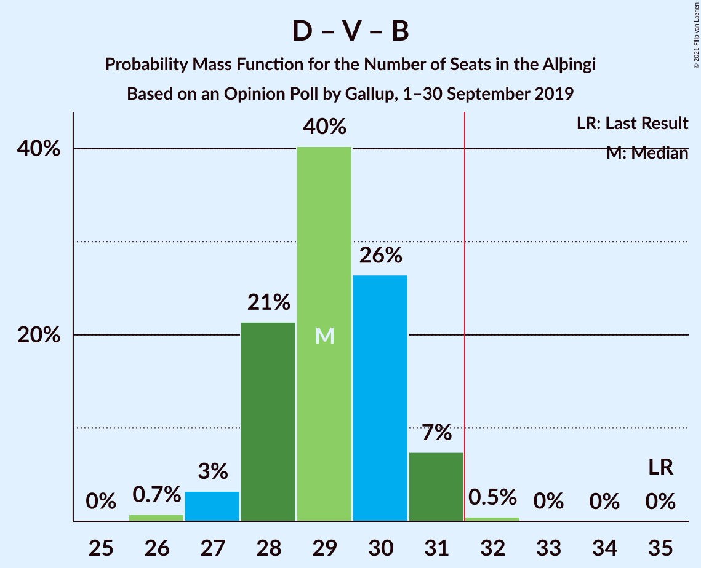

# Opinion Poll by Gallup, 1–30 September 2019

<a href="#voting-intentions">Voting Intentions</a> | <a href="#seats">Seats</a> | <a href="#coalitions">Coalitions</a> | <a href="#technical-information">Technical Information</a>

## Voting Intentions

### Confidence Intervals

| Party | Last Result | Poll Result | 80% Confidence Interval | 90% Confidence Interval | 95% Confidence Interval | 99% Confidence Interval |
|:-----:|:-----------:|:-----------:|:-----------------------:|:-----------------------:|:-----------------------:|:-----------------------:|
| Sjálfstæðisflokkurinn | 25.2% | 23.6% | 22.3–24.9% |22.0–25.2% |21.7–25.5% |21.1–26.2% |
| Samfylkingin | 12.1% | 16.1% | 15.1–17.3% |14.8–17.6% |14.5–17.9% |14.1–18.4% |
| Miðflokkurinn | 10.9% | 12.3% | 11.4–13.3% |11.1–13.6% |10.9–13.9% |10.5–14.4% |
| Vinstrihreyfingin – grænt framboð | 16.9% | 12.0% | 11.1–13.1% |10.9–13.4% |10.7–13.6% |10.2–14.1% |
| Viðreisn | 6.7% | 11.3% | 10.4–12.2% |10.1–12.5% |9.9–12.8% |9.5–13.2% |
| Píratar | 9.2% | 9.7% | 8.9–10.6% |8.7–10.9% |8.5–11.1% |8.1–11.6% |
| Framsóknarflokkurinn | 10.7% | 7.9% | 7.2–8.8% |7.0–9.0% |6.8–9.2% |6.4–9.6% |
| Flokkur fólksins | 6.9% | 4.3% | 3.7–5.0% |3.6–5.2% |3.5–5.3% |3.2–5.7% |
| Sósíalistaflokkur Íslands | 0.0% | 2.7% | 2.3–3.3% |2.2–3.4% |2.1–3.6% |1.9–3.8% |

*Note:* The poll result column reflects the actual value used in the calculations. Published results may vary slightly, and in addition be rounded to fewer digits.

## Seats

### Confidence Intervals

| Party | Last Result | Median | 80% Confidence Interval | 90% Confidence Interval | 95% Confidence Interval | 99% Confidence Interval |
|:-----:|:-----------:|:------:|:-----------------------:|:-----------------------:|:-----------------------:|:-----------------------:|
| <a href="#sjálfstæðisflokkurinn">Sjálfstæðisflokkurinn</a> | 16 | 17 | 15–17 |15–17 |15–17 |14–18 |
| <a href="#samfylkingin">Samfylkingin</a> | 7 | 11 | 10–12 |10–12 |10–12 |9–12 |
| <a href="#miðflokkurinn">Miðflokkurinn</a> | 7 | 9 | 9–10 |7–10 |7–10 |7–10 |
| <a href="#vinstrihreyfingin-–-grænt-framboð">Vinstrihreyfingin – grænt framboð</a> | 11 | 8 | 7–8 |7–9 |7–9 |7–10 |
| <a href="#viðreisn">Viðreisn</a> | 4 | 7 | 7–8 |7–8 |6–8 |6–8 |
| <a href="#píratar">Píratar</a> | 6 | 6 | 6–7 |6–7 |5–7 |5–8 |
| <a href="#framsóknarflokkurinn">Framsóknarflokkurinn</a> | 8 | 5 | 5–6 |5–6 |4–6 |4–6 |
| <a href="#flokkur-fólksins">Flokkur fólksins</a> | 4 | 0 | 0 |0 |0 |0–3 |
| <a href="#sósíalistaflokkur-íslands">Sósíalistaflokkur Íslands</a> | 0 | 0 | 0 |0 |0 |0 |

### Sjálfstæðisflokkurinn

*For a full overview of the results for this party, see the [Sjálfstæðisflokkurinn](party-sjálfstæðisflokkurinn.html) page.*

| Number of Seats | Probability | Accumulated | Special Marks |
|:---------------:|:-----------:|:-----------:|:-------------:|
| 13 | 0.2% | 100% |  |
| 14 | 0.5% | 99.8% |  |
| 15 | 26% | 99.4% |  |
| 16 | 13% | 74% | Last Result |
| 17 | 59% | 61% | Median |
| 18 | 2% | 2% |  |
| 19 | 0% | 0% |  |

### Samfylkingin

*For a full overview of the results for this party, see the [Samfylkingin](party-samfylkingin.html) page.*

| Number of Seats | Probability | Accumulated | Special Marks |
|:---------------:|:-----------:|:-----------:|:-------------:|
| 7 | 0% | 100% | Last Result |
| 8 | 0% | 100% |  |
| 9 | 1.3% | 100% |  |
| 10 | 28% | 98.7% |  |
| 11 | 59% | 70% | Median |
| 12 | 12% | 12% |  |
| 13 | 0.2% | 0.2% |  |
| 14 | 0% | 0% |  |

### Miðflokkurinn

*For a full overview of the results for this party, see the [Miðflokkurinn](party-miðflokkurinn.html) page.*

| Number of Seats | Probability | Accumulated | Special Marks |
|:---------------:|:-----------:|:-----------:|:-------------:|
| 6 | 0.1% | 100% |  |
| 7 | 7% | 99.9% | Last Result |
| 8 | 3% | 93% |  |
| 9 | 58% | 90% | Median |
| 10 | 33% | 33% |  |
| 11 | 0% | 0% |  |

### Vinstrihreyfingin – grænt framboð

*For a full overview of the results for this party, see the [Vinstrihreyfingin – grænt framboð](party-vinstrihreyfingin–græntframboð.html) page.*

| Number of Seats | Probability | Accumulated | Special Marks |
|:---------------:|:-----------:|:-----------:|:-------------:|
| 6 | 0.5% | 100% |  |
| 7 | 27% | 99.5% |  |
| 8 | 66% | 72% | Median |
| 9 | 5% | 6% |  |
| 10 | 1.2% | 1.2% |  |
| 11 | 0% | 0% | Last Result |

### Viðreisn

*For a full overview of the results for this party, see the [Viðreisn](party-viðreisn.html) page.*

| Number of Seats | Probability | Accumulated | Special Marks |
|:---------------:|:-----------:|:-----------:|:-------------:|
| 4 | 0% | 100% | Last Result |
| 5 | 0% | 100% |  |
| 6 | 5% | 100% |  |
| 7 | 70% | 95% | Median |
| 8 | 25% | 25% |  |
| 9 | 0.2% | 0.2% |  |
| 10 | 0% | 0% |  |

### Píratar

*For a full overview of the results for this party, see the [Píratar](party-píratar.html) page.*

| Number of Seats | Probability | Accumulated | Special Marks |
|:---------------:|:-----------:|:-----------:|:-------------:|
| 5 | 3% | 100% |  |
| 6 | 56% | 97% | Last Result, Median |
| 7 | 40% | 41% |  |
| 8 | 1.1% | 1.1% |  |
| 9 | 0% | 0% |  |

### Framsóknarflokkurinn

*For a full overview of the results for this party, see the [Framsóknarflokkurinn](party-framsóknarflokkurinn.html) page.*

| Number of Seats | Probability | Accumulated | Special Marks |
|:---------------:|:-----------:|:-----------:|:-------------:|
| 4 | 4% | 100% |  |
| 5 | 69% | 96% | Median |
| 6 | 26% | 27% |  |
| 7 | 0.1% | 0.1% |  |
| 8 | 0% | 0% | Last Result |

### Flokkur fólksins

*For a full overview of the results for this party, see the [Flokkur fólksins](party-flokkurfólksins.html) page.*

| Number of Seats | Probability | Accumulated | Special Marks |
|:---------------:|:-----------:|:-----------:|:-------------:|
| 0 | 98% | 100% | Median |
| 1 | 0% | 2% |  |
| 2 | 0% | 2% |  |
| 3 | 2% | 2% |  |
| 4 | 0.1% | 0.1% | Last Result |
| 5 | 0% | 0% |  |

### Sósíalistaflokkur Íslands

*For a full overview of the results for this party, see the [Sósíalistaflokkur Íslands](party-sósíalistaflokkuríslands.html) page.*

| Number of Seats | Probability | Accumulated | Special Marks |
|:---------------:|:-----------:|:-----------:|:-------------:|
| 0 | 100% | 100% | Last Result, Median |

## Coalitions

### Confidence Intervals

| Coalition | Last Result | Median | Majority? | 80% Confidence Interval | 90% Confidence Interval | 95% Confidence Interval | 99% Confidence Interval |
|:---------:|:-----------:|:------:|:---------:|:-----------------------:|:-----------------------:|:-----------------------:|:-----------------------:|
| Samfylkingin – Miðflokkurinn – Vinstrihreyfingin – grænt framboð – Framsóknarflokkurinn | 33 | 33 | 98% | 32–33 | 32–34 | 32–34 | 31–35 |
| Samfylkingin – Vinstrihreyfingin – grænt framboð – Viðreisn – Píratar | 28 | 32 | 89% | 31–34 | 31–34 | 31–34 | 30–35 |
| Sjálfstæðisflokkurinn – Miðflokkurinn – Framsóknarflokkurinn | 31 | 31 | 9% | 29–31 | 29–32 | 29–32 | 28–33 |
| Sjálfstæðisflokkurinn – Vinstrihreyfingin – grænt framboð – Framsóknarflokkurinn | 35 | 30 | 0.2% | 28–30 | 28–30 | 27–30 | 27–31 |
| Samfylkingin – Miðflokkurinn – Vinstrihreyfingin – grænt framboð | 25 | 28 | 0% | 27–28 | 27–29 | 27–30 | 26–30 |
| Sjálfstæðisflokkurinn – Samfylkingin | 23 | 28 | 0% | 25–28 | 25–28 | 25–28 | 24–30 |
| Sjálfstæðisflokkurinn – Miðflokkurinn | 23 | 26 | 0% | 24–26 | 23–27 | 23–27 | 23–27 |
| Samfylkingin – Vinstrihreyfingin – grænt framboð – Píratar | 24 | 25 | 0% | 24–27 | 24–27 | 23–27 | 22–27 |
| Samfylkingin – Vinstrihreyfingin – grænt framboð – Framsóknarflokkurinn | 26 | 24 | 0% | 23–25 | 22–26 | 22–26 | 22–26 |
| Sjálfstæðisflokkurinn – Vinstrihreyfingin – grænt framboð | 27 | 25 | 0% | 22–25 | 22–25 | 22–25 | 21–26 |
| Sjálfstæðisflokkurinn – Viðreisn | 20 | 24 | 0% | 23–24 | 22–24 | 22–25 | 22–25 |
| Miðflokkurinn – Vinstrihreyfingin – grænt framboð – Framsóknarflokkurinn | 26 | 22 | 0% | 21–23 | 21–23 | 21–23 | 19–24 |
| Sjálfstæðisflokkurinn – Framsóknarflokkurinn | 24 | 22 | 0% | 20–22 | 20–22 | 20–22 | 19–23 |
| Samfylkingin – Vinstrihreyfingin – grænt framboð | 18 | 19 | 0% | 17–20 | 17–20 | 17–20 | 16–21 |
| Miðflokkurinn – Vinstrihreyfingin – grænt framboð | 18 | 17 | 0% | 17–18 | 15–18 | 15–18 | 14–19 |
| Vinstrihreyfingin – grænt framboð – Píratar | 17 | 14 | 0% | 14–15 | 14–15 | 13–16 | 12–16 |
| Vinstrihreyfingin – grænt framboð – Framsóknarflokkurinn | 19 | 13 | 0% | 12–14 | 12–14 | 12–14 | 11–15 |

### Samfylkingin – Miðflokkurinn – Vinstrihreyfingin – grænt framboð – Framsóknarflokkurinn

| Number of Seats | Probability | Accumulated | Special Marks |
|:---------------:|:-----------:|:-----------:|:-------------:|
| 30 | 0.1% | 100% |  |
| 31 | 2% | 99.9% |  |
| 32 | 9% | 98% | Majority |
| 33 | 81% | 89% | Last Result, Median |
| 34 | 6% | 8% |  |
| 35 | 2% | 2% |  |
| 36 | 0% | 0% |  |

### Samfylkingin – Vinstrihreyfingin – grænt framboð – Viðreisn – Píratar

| Number of Seats | Probability | Accumulated | Special Marks |
|:---------------:|:-----------:|:-----------:|:-------------:|
| 28 | 0% | 100% | Last Result |
| 29 | 0.1% | 100% |  |
| 30 | 2% | 99.9% |  |
| 31 | 9% | 98% |  |
| 32 | 72% | 89% | Median, Majority |
| 33 | 3% | 17% |  |
| 34 | 13% | 14% |  |
| 35 | 1.4% | 2% |  |
| 36 | 0% | 0.1% |  |
| 37 | 0% | 0% |  |

### Sjálfstæðisflokkurinn – Miðflokkurinn – Framsóknarflokkurinn

| Number of Seats | Probability | Accumulated | Special Marks |
|:---------------:|:-----------:|:-----------:|:-------------:|
| 26 | 0.1% | 100% |  |
| 27 | 0.1% | 99.9% |  |
| 28 | 2% | 99.8% |  |
| 29 | 13% | 98% |  |
| 30 | 5% | 85% |  |
| 31 | 72% | 81% | Last Result, Median |
| 32 | 8% | 9% | Majority |
| 33 | 0.6% | 0.6% |  |
| 34 | 0% | 0% |  |

### Sjálfstæðisflokkurinn – Vinstrihreyfingin – grænt framboð – Framsóknarflokkurinn

| Number of Seats | Probability | Accumulated | Special Marks |
|:---------------:|:-----------:|:-----------:|:-------------:|
| 26 | 0.3% | 100% |  |
| 27 | 4% | 99.6% |  |
| 28 | 21% | 96% |  |
| 29 | 9% | 74% |  |
| 30 | 63% | 65% | Median |
| 31 | 1.4% | 2% |  |
| 32 | 0.2% | 0.2% | Majority |
| 33 | 0% | 0% |  |
| 34 | 0% | 0% |  |
| 35 | 0% | 0% | Last Result |

### Samfylkingin – Miðflokkurinn – Vinstrihreyfingin – grænt framboð

| Number of Seats | Probability | Accumulated | Special Marks |
|:---------------:|:-----------:|:-----------:|:-------------:|
| 25 | 0.1% | 100% | Last Result |
| 26 | 2% | 99.9% |  |
| 27 | 31% | 98% |  |
| 28 | 59% | 67% | Median |
| 29 | 5% | 8% |  |
| 30 | 3% | 3% |  |
| 31 | 0.4% | 0.4% |  |
| 32 | 0% | 0% | Majority |

### Sjálfstæðisflokkurinn – Samfylkingin

| Number of Seats | Probability | Accumulated | Special Marks |
|:---------------:|:-----------:|:-----------:|:-------------:|
| 23 | 0% | 100% | Last Result |
| 24 | 0.6% | 100% |  |
| 25 | 19% | 99.4% |  |
| 26 | 7% | 80% |  |
| 27 | 14% | 74% |  |
| 28 | 58% | 59% | Median |
| 29 | 0.6% | 2% |  |
| 30 | 1.3% | 1.3% |  |
| 31 | 0% | 0% |  |

### Sjálfstæðisflokkurinn – Miðflokkurinn

| Number of Seats | Probability | Accumulated | Special Marks |
|:---------------:|:-----------:|:-----------:|:-------------:|
| 22 | 0.1% | 100% |  |
| 23 | 8% | 99.9% | Last Result |
| 24 | 5% | 92% |  |
| 25 | 23% | 87% |  |
| 26 | 55% | 64% | Median |
| 27 | 8% | 8% |  |
| 28 | 0.2% | 0.2% |  |
| 29 | 0% | 0% |  |

### Samfylkingin – Vinstrihreyfingin – grænt framboð – Píratar

| Number of Seats | Probability | Accumulated | Special Marks |
|:---------------:|:-----------:|:-----------:|:-------------:|
| 22 | 0.6% | 100% |  |
| 23 | 2% | 99.3% |  |
| 24 | 22% | 97% | Last Result |
| 25 | 60% | 75% | Median |
| 26 | 2% | 15% |  |
| 27 | 12% | 13% |  |
| 28 | 0.3% | 0.4% |  |
| 29 | 0% | 0% |  |

### Samfylkingin – Vinstrihreyfingin – grænt framboð – Framsóknarflokkurinn

| Number of Seats | Probability | Accumulated | Special Marks |
|:---------------:|:-----------:|:-----------:|:-------------:|
| 21 | 0.3% | 100% |  |
| 22 | 6% | 99.6% |  |
| 23 | 24% | 93% |  |
| 24 | 57% | 69% | Median |
| 25 | 3% | 12% |  |
| 26 | 8% | 8% | Last Result |
| 27 | 0% | 0% |  |

### Sjálfstæðisflokkurinn – Vinstrihreyfingin – grænt framboð

| Number of Seats | Probability | Accumulated | Special Marks |
|:---------------:|:-----------:|:-----------:|:-------------:|
| 21 | 0.6% | 100% |  |
| 22 | 18% | 99.4% |  |
| 23 | 7% | 81% |  |
| 24 | 16% | 74% |  |
| 25 | 56% | 58% | Median |
| 26 | 1.5% | 2% |  |
| 27 | 0.1% | 0.1% | Last Result |
| 28 | 0% | 0% |  |

### Sjálfstæðisflokkurinn – Viðreisn

| Number of Seats | Probability | Accumulated | Special Marks |
|:---------------:|:-----------:|:-----------:|:-------------:|
| 20 | 0.2% | 100% | Last Result |
| 21 | 0.3% | 99.8% |  |
| 22 | 6% | 99.6% |  |
| 23 | 34% | 94% |  |
| 24 | 57% | 60% | Median |
| 25 | 2% | 3% |  |
| 26 | 0.3% | 0.3% |  |
| 27 | 0% | 0% |  |

### Miðflokkurinn – Vinstrihreyfingin – grænt framboð – Framsóknarflokkurinn

| Number of Seats | Probability | Accumulated | Special Marks |
|:---------------:|:-----------:|:-----------:|:-------------:|
| 19 | 0.6% | 100% |  |
| 20 | 2% | 99.3% |  |
| 21 | 9% | 98% |  |
| 22 | 60% | 89% | Median |
| 23 | 28% | 29% |  |
| 24 | 1.2% | 1.3% |  |
| 25 | 0.1% | 0.1% |  |
| 26 | 0% | 0% | Last Result |

### Sjálfstæðisflokkurinn – Framsóknarflokkurinn

| Number of Seats | Probability | Accumulated | Special Marks |
|:---------------:|:-----------:|:-----------:|:-------------:|
| 18 | 0.2% | 100% |  |
| 19 | 2% | 99.8% |  |
| 20 | 8% | 98% |  |
| 21 | 22% | 90% |  |
| 22 | 65% | 68% | Median |
| 23 | 2% | 2% |  |
| 24 | 0.1% | 0.1% | Last Result |
| 25 | 0% | 0% |  |

### Samfylkingin – Vinstrihreyfingin – grænt framboð

| Number of Seats | Probability | Accumulated | Special Marks |
|:---------------:|:-----------:|:-----------:|:-------------:|
| 16 | 0.8% | 100% |  |
| 17 | 22% | 99.2% |  |
| 18 | 10% | 78% | Last Result |
| 19 | 55% | 68% | Median |
| 20 | 11% | 13% |  |
| 21 | 1.3% | 2% |  |
| 22 | 0.4% | 0.4% |  |
| 23 | 0% | 0% |  |

### Miðflokkurinn – Vinstrihreyfingin – grænt framboð

| Number of Seats | Probability | Accumulated | Special Marks |
|:---------------:|:-----------:|:-----------:|:-------------:|
| 14 | 0.6% | 100% |  |
| 15 | 8% | 99.4% |  |
| 16 | 1.3% | 92% |  |
| 17 | 78% | 91% | Median |
| 18 | 11% | 12% | Last Result |
| 19 | 1.0% | 1.0% |  |
| 20 | 0% | 0% |  |

### Vinstrihreyfingin – grænt framboð – Píratar

| Number of Seats | Probability | Accumulated | Special Marks |
|:---------------:|:-----------:|:-----------:|:-------------:|
| 11 | 0.1% | 100% |  |
| 12 | 0.7% | 99.9% |  |
| 13 | 4% | 99.2% |  |
| 14 | 76% | 95% | Median |
| 15 | 16% | 20% |  |
| 16 | 4% | 4% |  |
| 17 | 0.4% | 0.5% | Last Result |
| 18 | 0% | 0% |  |

### Vinstrihreyfingin – grænt framboð – Framsóknarflokkurinn

| Number of Seats | Probability | Accumulated | Special Marks |
|:---------------:|:-----------:|:-----------:|:-------------:|
| 11 | 2% | 100% |  |
| 12 | 9% | 98% |  |
| 13 | 77% | 89% | Median |
| 14 | 11% | 12% |  |
| 15 | 2% | 2% |  |
| 16 | 0% | 0% |  |
| 17 | 0% | 0% |  |
| 18 | 0% | 0% |  |
| 19 | 0% | 0% | Last Result |

## Technical Information

### Opinion Poll

+ **Polling firm:** Gallup
+ **Commissioner(s):** —
+ **Fieldwork period:** 1–30 September 2019

### Calculations

+ **Sample size:** 1884
+ **Simulations done:** 131,072
+ **Error estimate:** 1.48%

