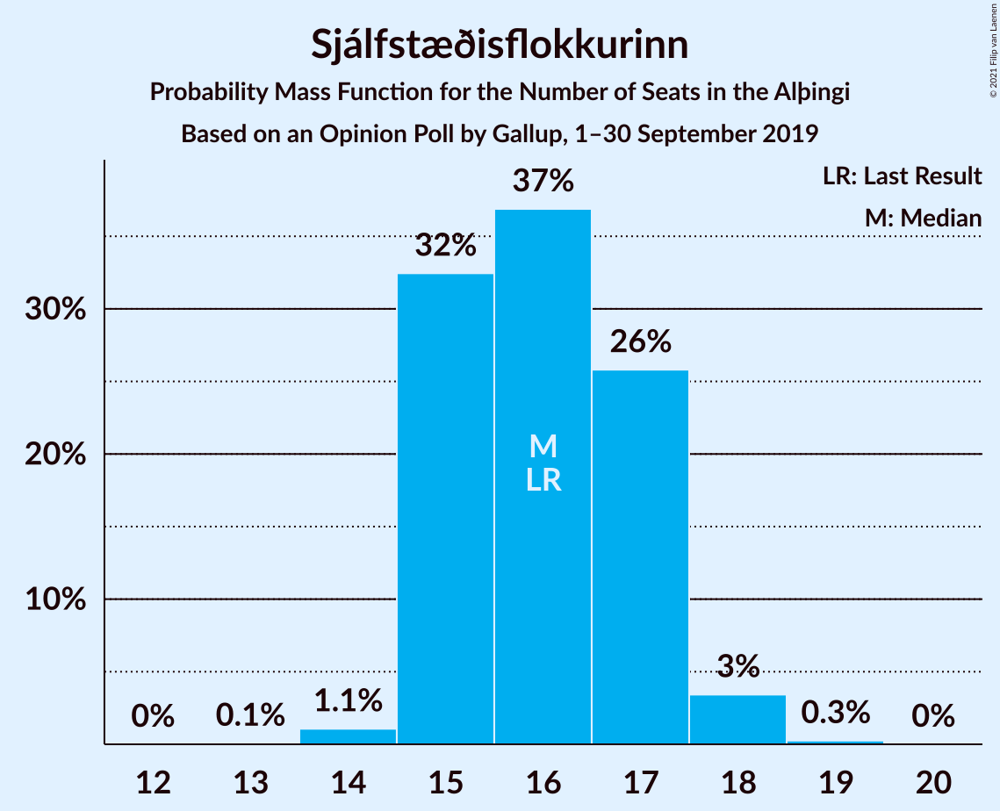
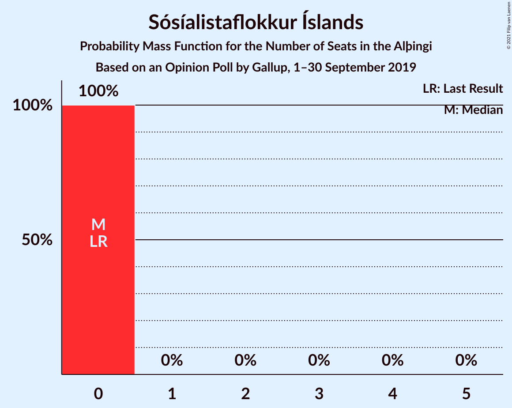

# Opinion Poll by Gallup, 1–30 September 2019

<a href="#voting-intentions">Voting Intentions</a> | <a href="#seats">Seats</a> | <a href="#coalitions">Coalitions</a> | <a href="#technical-information">Technical Information</a>

## Voting Intentions

### Confidence Intervals

| Party | Last Result | Poll Result | 80% Confidence Interval | 90% Confidence Interval | 95% Confidence Interval | 99% Confidence Interval |
|:-----:|:-----------:|:-----------:|:-----------------------:|:-----------------------:|:-----------------------:|:-----------------------:|
| Sjálfstæðisflokkurinn | 25.2% | 23.6% | 22.3–24.9% |22.0–25.2% |21.7–25.5% |21.1–26.2% |
| Samfylkingin | 12.1% | 16.1% | 15.1–17.3% |14.8–17.6% |14.5–17.9% |14.1–18.4% |
| Miðflokkurinn | 10.9% | 12.3% | 11.4–13.3% |11.1–13.6% |10.9–13.9% |10.5–14.4% |
| Vinstrihreyfingin – grænt framboð | 16.9% | 12.0% | 11.1–13.1% |10.9–13.4% |10.7–13.6% |10.2–14.1% |
| Viðreisn | 6.7% | 11.3% | 10.4–12.2% |10.1–12.5% |9.9–12.8% |9.5–13.2% |
| Píratar | 9.2% | 9.7% | 8.9–10.6% |8.7–10.9% |8.5–11.1% |8.1–11.6% |
| Framsóknarflokkurinn | 10.7% | 7.9% | 7.2–8.8% |7.0–9.0% |6.8–9.2% |6.4–9.6% |
| Flokkur fólksins | 6.9% | 4.3% | 3.7–5.0% |3.6–5.2% |3.5–5.3% |3.2–5.7% |
| Sósíalistaflokkur Íslands | 0.0% | 2.7% | 2.3–3.3% |2.2–3.4% |2.1–3.6% |1.9–3.8% |

*Note:* The poll result column reflects the actual value used in the calculations. Published results may vary slightly, and in addition be rounded to fewer digits.

## Seats

### Confidence Intervals

| Party | Last Result | Median | 80% Confidence Interval | 90% Confidence Interval | 95% Confidence Interval | 99% Confidence Interval |
|:-----:|:-----------:|:------:|:-----------------------:|:-----------------------:|:-----------------------:|:-----------------------:|
| <a href="#sjálfstæðisflokkurinn">Sjálfstæðisflokkurinn</a> | 16 | 16 | 15–17 |15–17 |15–18 |14–18 |
| <a href="#samfylkingin">Samfylkingin</a> | 7 | 11 | 10–12 |10–12 |10–12 |9–12 |
| <a href="#miðflokkurinn">Miðflokkurinn</a> | 7 | 9 | 8–10 |8–10 |7–10 |7–10 |
| <a href="#vinstrihreyfingin-–-grænt-framboð">Vinstrihreyfingin – grænt framboð</a> | 11 | 8 | 7–9 |7–10 |7–10 |6–10 |
| <a href="#viðreisn">Viðreisn</a> | 4 | 7 | 7–8 |6–9 |6–9 |6–9 |
| <a href="#píratar">Píratar</a> | 6 | 6 | 6–7 |5–7 |5–7 |5–8 |
| <a href="#framsóknarflokkurinn">Framsóknarflokkurinn</a> | 8 | 5 | 5–6 |4–6 |4–6 |4–6 |
| <a href="#flokkur-fólksins">Flokkur fólksins</a> | 4 | 0 | 0 |0–3 |0–3 |0–3 |
| <a href="#sósíalistaflokkur-íslands">Sósíalistaflokkur Íslands</a> | 0 | 0 | 0 |0 |0 |0 |

### Sjálfstæðisflokkurinn

*For a full overview of the results for this party, see the [Sjálfstæðisflokkurinn](party-sjálfstæðisflokkurinn.html) page.*

| Number of Seats | Probability | Accumulated | Special Marks |
|:---------------:|:-----------:|:-----------:|:-------------:|
| 13 | 0.1% | 100% |  |
| 14 | 1.1% | 99.9% |  |
| 15 | 32% | 98.9% |  |
| 16 | 37% | 66% | Last Result, Median |
| 17 | 26% | 30% |  |
| 18 | 3% | 4% |  |
| 19 | 0.3% | 0.3% |  |
| 20 | 0% | 0% |  |

### Samfylkingin

*For a full overview of the results for this party, see the [Samfylkingin](party-samfylkingin.html) page.*

| Number of Seats | Probability | Accumulated | Special Marks |
|:---------------:|:-----------:|:-----------:|:-------------:|
| 7 | 0% | 100% | Last Result |
| 8 | 0% | 100% |  |
| 9 | 2% | 100% |  |
| 10 | 25% | 98% |  |
| 11 | 56% | 73% | Median |
| 12 | 16% | 16% |  |
| 13 | 0.4% | 0.4% |  |
| 14 | 0% | 0% |  |

### Miðflokkurinn

*For a full overview of the results for this party, see the [Miðflokkurinn](party-miðflokkurinn.html) page.*

| Number of Seats | Probability | Accumulated | Special Marks |
|:---------------:|:-----------:|:-----------:|:-------------:|
| 6 | 0.2% | 100% |  |
| 7 | 4% | 99.8% | Last Result |
| 8 | 14% | 96% |  |
| 9 | 43% | 82% | Median |
| 10 | 39% | 39% |  |
| 11 | 0% | 0% |  |

### Vinstrihreyfingin – grænt framboð

*For a full overview of the results for this party, see the [Vinstrihreyfingin – grænt framboð](party-vinstrihreyfingin–græntframboð.html) page.*

| Number of Seats | Probability | Accumulated | Special Marks |
|:---------------:|:-----------:|:-----------:|:-------------:|
| 6 | 0.9% | 100% |  |
| 7 | 24% | 99.1% |  |
| 8 | 54% | 75% | Median |
| 9 | 14% | 21% |  |
| 10 | 7% | 7% |  |
| 11 | 0% | 0% | Last Result |

### Viðreisn

*For a full overview of the results for this party, see the [Viðreisn](party-viðreisn.html) page.*

| Number of Seats | Probability | Accumulated | Special Marks |
|:---------------:|:-----------:|:-----------:|:-------------:|
| 4 | 0% | 100% | Last Result |
| 5 | 0% | 100% |  |
| 6 | 5% | 100% |  |
| 7 | 59% | 94% | Median |
| 8 | 30% | 36% |  |
| 9 | 6% | 6% |  |
| 10 | 0% | 0% |  |

### Píratar

*For a full overview of the results for this party, see the [Píratar](party-píratar.html) page.*

| Number of Seats | Probability | Accumulated | Special Marks |
|:---------------:|:-----------:|:-----------:|:-------------:|
| 5 | 7% | 100% |  |
| 6 | 58% | 93% | Last Result, Median |
| 7 | 34% | 35% |  |
| 8 | 1.0% | 1.0% |  |
| 9 | 0% | 0% |  |

### Framsóknarflokkurinn

*For a full overview of the results for this party, see the [Framsóknarflokkurinn](party-framsóknarflokkurinn.html) page.*

| Number of Seats | Probability | Accumulated | Special Marks |
|:---------------:|:-----------:|:-----------:|:-------------:|
| 4 | 6% | 100% |  |
| 5 | 77% | 94% | Median |
| 6 | 17% | 17% |  |
| 7 | 0.2% | 0.2% |  |
| 8 | 0% | 0% | Last Result |

### Flokkur fólksins

*For a full overview of the results for this party, see the [Flokkur fólksins](party-flokkurfólksins.html) page.*

| Number of Seats | Probability | Accumulated | Special Marks |
|:---------------:|:-----------:|:-----------:|:-------------:|
| 0 | 94% | 100% | Median |
| 1 | 0% | 6% |  |
| 2 | 0% | 6% |  |
| 3 | 6% | 6% |  |
| 4 | 0% | 0% | Last Result |

### Sósíalistaflokkur Íslands

*For a full overview of the results for this party, see the [Sósíalistaflokkur Íslands](party-sósíalistaflokkuríslands.html) page.*

| Number of Seats | Probability | Accumulated | Special Marks |
|:---------------:|:-----------:|:-----------:|:-------------:|
| 0 | 100% | 100% | Last Result, Median |

## Coalitions

### Confidence Intervals

| Coalition | Last Result | Median | Majority? | 80% Confidence Interval | 90% Confidence Interval | 95% Confidence Interval | 99% Confidence Interval |
|:---------:|:-----------:|:------:|:---------:|:-----------------------:|:-----------------------:|:-----------------------:|:-----------------------:|
| Samfylkingin – Miðflokkurinn – Vinstrihreyfingin – grænt framboð – Framsóknarflokkurinn | 33 | 33 | 96% | 32–34 | 32–35 | 31–35 | 30–35 |
| Samfylkingin – Vinstrihreyfingin – grænt framboð – Viðreisn – Píratar | 28 | 32 | 81% | 31–34 | 30–34 | 30–35 | 29–35 |
| Sjálfstæðisflokkurinn – Miðflokkurinn – Framsóknarflokkurinn | 31 | 30 | 15% | 29–32 | 28–32 | 28–32 | 27–33 |
| Sjálfstæðisflokkurinn – Vinstrihreyfingin – grænt framboð – Framsóknarflokkurinn | 35 | 29 | 0.5% | 28–30 | 28–31 | 27–31 | 26–32 |
| Samfylkingin – Miðflokkurinn – Vinstrihreyfingin – grænt framboð | 25 | 28 | 0% | 27–29 | 27–29 | 26–30 | 25–30 |
| Sjálfstæðisflokkurinn – Samfylkingin | 23 | 27 | 0% | 26–28 | 25–28 | 25–29 | 24–29 |
| Sjálfstæðisflokkurinn – Miðflokkurinn | 23 | 25 | 0% | 23–27 | 23–27 | 23–27 | 22–28 |
| Samfylkingin – Vinstrihreyfingin – grænt framboð – Píratar | 24 | 25 | 0% | 24–27 | 23–27 | 23–27 | 22–28 |
| Samfylkingin – Vinstrihreyfingin – grænt framboð – Framsóknarflokkurinn | 26 | 24 | 0% | 23–25 | 22–26 | 22–26 | 21–27 |
| Sjálfstæðisflokkurinn – Vinstrihreyfingin – grænt framboð | 27 | 24 | 0% | 23–25 | 22–26 | 22–26 | 21–26 |
| Sjálfstæðisflokkurinn – Viðreisn | 20 | 23 | 0% | 22–24 | 22–25 | 22–25 | 21–26 |
| Miðflokkurinn – Vinstrihreyfingin – grænt framboð – Framsóknarflokkurinn | 26 | 22 | 0% | 21–23 | 21–24 | 20–24 | 20–24 |
| Sjálfstæðisflokkurinn – Framsóknarflokkurinn | 24 | 21 | 0% | 20–22 | 20–22 | 20–23 | 19–23 |
| Samfylkingin – Vinstrihreyfingin – grænt framboð | 18 | 19 | 0% | 17–20 | 17–21 | 17–21 | 16–22 |
| Miðflokkurinn – Vinstrihreyfingin – grænt framboð | 18 | 17 | 0% | 16–18 | 16–19 | 15–19 | 15–19 |
| Vinstrihreyfingin – grænt framboð – Píratar | 17 | 14 | 0% | 13–16 | 13–16 | 12–16 | 12–17 |
| Vinstrihreyfingin – grænt framboð – Framsóknarflokkurinn | 19 | 13 | 0% | 12–14 | 12–15 | 12–15 | 11–15 |

### Samfylkingin – Miðflokkurinn – Vinstrihreyfingin – grænt framboð – Framsóknarflokkurinn

| Number of Seats | Probability | Accumulated | Special Marks |
|:---------------:|:-----------:|:-----------:|:-------------:|
| 30 | 0.8% | 100% |  |
| 31 | 4% | 99.2% |  |
| 32 | 16% | 96% | Majority |
| 33 | 43% | 80% | Last Result, Median |
| 34 | 31% | 37% |  |
| 35 | 6% | 6% |  |
| 36 | 0.2% | 0.2% |  |
| 37 | 0% | 0% |  |

### Samfylkingin – Vinstrihreyfingin – grænt framboð – Viðreisn – Píratar

| Number of Seats | Probability | Accumulated | Special Marks |
|:---------------:|:-----------:|:-----------:|:-------------:|
| 27 | 0.1% | 100% |  |
| 28 | 0.2% | 99.9% | Last Result |
| 29 | 1.1% | 99.8% |  |
| 30 | 4% | 98.7% |  |
| 31 | 14% | 95% |  |
| 32 | 32% | 81% | Median, Majority |
| 33 | 22% | 49% |  |
| 34 | 22% | 27% |  |
| 35 | 4% | 5% |  |
| 36 | 0.5% | 0.5% |  |
| 37 | 0% | 0% |  |

### Sjálfstæðisflokkurinn – Miðflokkurinn – Framsóknarflokkurinn

| Number of Seats | Probability | Accumulated | Special Marks |
|:---------------:|:-----------:|:-----------:|:-------------:|
| 26 | 0.4% | 100% |  |
| 27 | 0.6% | 99.6% |  |
| 28 | 5% | 99.0% |  |
| 29 | 23% | 94% |  |
| 30 | 23% | 70% | Median |
| 31 | 32% | 47% | Last Result |
| 32 | 12% | 15% | Majority |
| 33 | 2% | 2% |  |
| 34 | 0.1% | 0.1% |  |
| 35 | 0% | 0% |  |

### Sjálfstæðisflokkurinn – Vinstrihreyfingin – grænt framboð – Framsóknarflokkurinn

| Number of Seats | Probability | Accumulated | Special Marks |
|:---------------:|:-----------:|:-----------:|:-------------:|
| 26 | 0.7% | 100% |  |
| 27 | 3% | 99.2% |  |
| 28 | 21% | 96% |  |
| 29 | 40% | 75% | Median |
| 30 | 26% | 34% |  |
| 31 | 7% | 8% |  |
| 32 | 0.5% | 0.5% | Majority |
| 33 | 0% | 0% |  |
| 34 | 0% | 0% |  |
| 35 | 0% | 0% | Last Result |

### Samfylkingin – Miðflokkurinn – Vinstrihreyfingin – grænt framboð

| Number of Seats | Probability | Accumulated | Special Marks |
|:---------------:|:-----------:|:-----------:|:-------------:|
| 24 | 0.1% | 100% |  |
| 25 | 0.8% | 99.9% | Last Result |
| 26 | 4% | 99.1% |  |
| 27 | 23% | 95% |  |
| 28 | 38% | 72% | Median |
| 29 | 30% | 35% |  |
| 30 | 4% | 4% |  |
| 31 | 0.1% | 0.1% |  |
| 32 | 0% | 0% | Majority |

### Sjálfstæðisflokkurinn – Samfylkingin

| Number of Seats | Probability | Accumulated | Special Marks |
|:---------------:|:-----------:|:-----------:|:-------------:|
| 23 | 0% | 100% | Last Result |
| 24 | 0.6% | 100% |  |
| 25 | 7% | 99.3% |  |
| 26 | 34% | 93% |  |
| 27 | 27% | 59% | Median |
| 28 | 28% | 32% |  |
| 29 | 3% | 4% |  |
| 30 | 0.4% | 0.4% |  |
| 31 | 0% | 0% |  |

### Sjálfstæðisflokkurinn – Miðflokkurinn

| Number of Seats | Probability | Accumulated | Special Marks |
|:---------------:|:-----------:|:-----------:|:-------------:|
| 21 | 0.4% | 100% |  |
| 22 | 0.6% | 99.6% |  |
| 23 | 10% | 99.0% | Last Result |
| 24 | 16% | 89% |  |
| 25 | 30% | 72% | Median |
| 26 | 30% | 42% |  |
| 27 | 11% | 12% |  |
| 28 | 1.4% | 1.4% |  |
| 29 | 0% | 0% |  |

### Samfylkingin – Vinstrihreyfingin – grænt framboð – Píratar

| Number of Seats | Probability | Accumulated | Special Marks |
|:---------------:|:-----------:|:-----------:|:-------------:|
| 21 | 0.1% | 100% |  |
| 22 | 0.8% | 99.9% |  |
| 23 | 6% | 99.0% |  |
| 24 | 24% | 93% | Last Result |
| 25 | 25% | 69% | Median |
| 26 | 34% | 44% |  |
| 27 | 8% | 10% |  |
| 28 | 2% | 2% |  |
| 29 | 0.5% | 0.5% |  |
| 30 | 0% | 0% |  |

### Samfylkingin – Vinstrihreyfingin – grænt framboð – Framsóknarflokkurinn

| Number of Seats | Probability | Accumulated | Special Marks |
|:---------------:|:-----------:|:-----------:|:-------------:|
| 20 | 0.1% | 100% |  |
| 21 | 0.7% | 99.9% |  |
| 22 | 7% | 99.2% |  |
| 23 | 23% | 92% |  |
| 24 | 36% | 69% | Median |
| 25 | 26% | 33% |  |
| 26 | 7% | 7% | Last Result |
| 27 | 0.6% | 0.6% |  |
| 28 | 0% | 0% |  |

### Sjálfstæðisflokkurinn – Vinstrihreyfingin – grænt framboð

| Number of Seats | Probability | Accumulated | Special Marks |
|:---------------:|:-----------:|:-----------:|:-------------:|
| 21 | 0.5% | 100% |  |
| 22 | 5% | 99.5% |  |
| 23 | 28% | 94% |  |
| 24 | 34% | 66% | Median |
| 25 | 25% | 32% |  |
| 26 | 7% | 8% |  |
| 27 | 0.4% | 0.4% | Last Result |
| 28 | 0% | 0% |  |

### Sjálfstæðisflokkurinn – Viðreisn

| Number of Seats | Probability | Accumulated | Special Marks |
|:---------------:|:-----------:|:-----------:|:-------------:|
| 20 | 0.1% | 100% | Last Result |
| 21 | 1.0% | 99.9% |  |
| 22 | 16% | 98.8% |  |
| 23 | 39% | 82% | Median |
| 24 | 34% | 43% |  |
| 25 | 8% | 9% |  |
| 26 | 1.1% | 1.2% |  |
| 27 | 0% | 0% |  |

### Miðflokkurinn – Vinstrihreyfingin – grænt framboð – Framsóknarflokkurinn

| Number of Seats | Probability | Accumulated | Special Marks |
|:---------------:|:-----------:|:-----------:|:-------------:|
| 19 | 0.2% | 100% |  |
| 20 | 3% | 99.8% |  |
| 21 | 9% | 97% |  |
| 22 | 52% | 88% | Median |
| 23 | 26% | 36% |  |
| 24 | 10% | 10% |  |
| 25 | 0.1% | 0.1% |  |
| 26 | 0% | 0% | Last Result |

### Sjálfstæðisflokkurinn – Framsóknarflokkurinn

| Number of Seats | Probability | Accumulated | Special Marks |
|:---------------:|:-----------:|:-----------:|:-------------:|
| 18 | 0.1% | 100% |  |
| 19 | 2% | 99.9% |  |
| 20 | 25% | 98% |  |
| 21 | 39% | 73% | Median |
| 22 | 29% | 34% |  |
| 23 | 4% | 5% |  |
| 24 | 0.3% | 0.4% | Last Result |
| 25 | 0.1% | 0.1% |  |
| 26 | 0% | 0% |  |

### Samfylkingin – Vinstrihreyfingin – grænt framboð

| Number of Seats | Probability | Accumulated | Special Marks |
|:---------------:|:-----------:|:-----------:|:-------------:|
| 15 | 0.1% | 100% |  |
| 16 | 0.6% | 99.9% |  |
| 17 | 10% | 99.4% |  |
| 18 | 25% | 90% | Last Result |
| 19 | 36% | 65% | Median |
| 20 | 24% | 29% |  |
| 21 | 5% | 5% |  |
| 22 | 0.6% | 0.6% |  |
| 23 | 0% | 0% |  |

### Miðflokkurinn – Vinstrihreyfingin – grænt framboð

| Number of Seats | Probability | Accumulated | Special Marks |
|:---------------:|:-----------:|:-----------:|:-------------:|
| 14 | 0.3% | 100% |  |
| 15 | 4% | 99.7% |  |
| 16 | 10% | 96% |  |
| 17 | 55% | 85% | Median |
| 18 | 23% | 30% | Last Result |
| 19 | 7% | 7% |  |
| 20 | 0% | 0% |  |

### Vinstrihreyfingin – grænt framboð – Píratar

| Number of Seats | Probability | Accumulated | Special Marks |
|:---------------:|:-----------:|:-----------:|:-------------:|
| 11 | 0.1% | 100% |  |
| 12 | 4% | 99.9% |  |
| 13 | 14% | 96% |  |
| 14 | 42% | 82% | Median |
| 15 | 28% | 40% |  |
| 16 | 11% | 12% |  |
| 17 | 0.8% | 0.8% | Last Result |
| 18 | 0% | 0% |  |

### Vinstrihreyfingin – grænt framboð – Framsóknarflokkurinn

| Number of Seats | Probability | Accumulated | Special Marks |
|:---------------:|:-----------:|:-----------:|:-------------:|
| 10 | 0.1% | 100% |  |
| 11 | 2% | 99.9% |  |
| 12 | 18% | 98% |  |
| 13 | 52% | 80% | Median |
| 14 | 20% | 28% |  |
| 15 | 8% | 8% |  |
| 16 | 0% | 0% |  |
| 17 | 0% | 0% |  |
| 18 | 0% | 0% |  |
| 19 | 0% | 0% | Last Result |

## Technical Information

### Opinion Poll

+ **Polling firm:** Gallup
+ **Commissioner(s):** —
+ **Fieldwork period:** 1–30 September 2019

### Calculations

+ **Sample size:** 1884
+ **Simulations done:** 1,048,576
+ **Error estimate:** 1.36%

