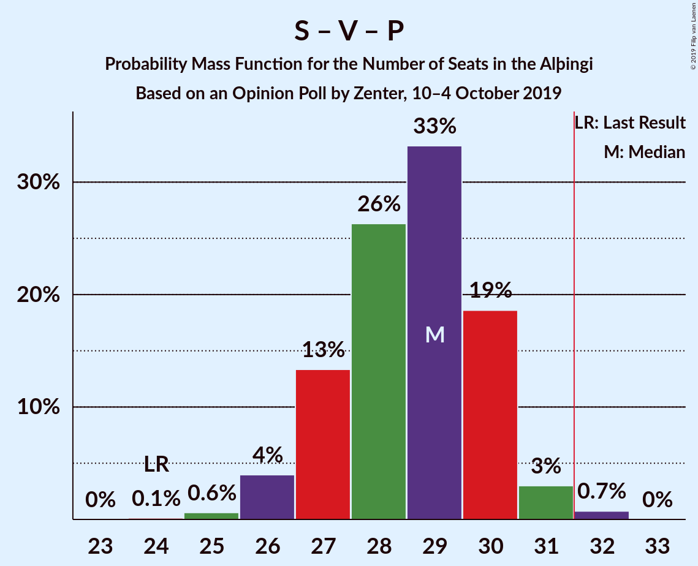

# Opinion Poll by Zenter, 10–4 October 2019

<a href="#voting-intentions">Voting Intentions</a> | <a href="#seats">Seats</a> | <a href="#coalitions">Coalitions</a> | <a href="#technical-information">Technical Information</a>

## Voting Intentions

### Confidence Intervals

| Party | Last Result | Poll Result | 80% Confidence Interval | 90% Confidence Interval | 95% Confidence Interval | 99% Confidence Interval |
|:-----:|:-----------:|:-----------:|:-----------------------:|:-----------------------:|:-----------------------:|:-----------------------:|
| Sjálfstæðisflokkurinn | 25.2% | 19.7% | 18.3–21.2% |17.9–21.6% |17.6–22.0% |16.9–22.8% |
| Samfylkingin | 12.1% | 18.5% | 17.2–20.0% |16.8–20.5% |16.5–20.8% |15.8–21.6% |
| Vinstrihreyfingin – grænt framboð | 16.9% | 12.6% | 11.4–13.8% |11.1–14.2% |10.8–14.5% |10.3–15.2% |
| Miðflokkurinn | 10.9% | 11.6% | 10.5–12.9% |10.2–13.3% |10.0–13.6% |9.5–14.2% |
| Viðreisn | 6.7% | 11.3% | 10.2–12.6% |9.9–12.9% |9.7–13.2% |9.2–13.8% |
| Píratar | 9.2% | 10.9% | 9.8–12.1% |9.5–12.5% |9.3–12.8% |8.8–13.4% |
| Framsóknarflokkurinn | 10.7% | 7.3% | 6.4–8.4% |6.2–8.6% |6.0–8.9% |5.6–9.4% |
| Flokkur fólksins | 6.9% | 4.0% | 3.4–4.8% |3.2–5.1% |3.0–5.3% |2.8–5.7% |

*Note:* The poll result column reflects the actual value used in the calculations. Published results may vary slightly, and in addition be rounded to fewer digits.

## Seats

### Confidence Intervals

| Party | Last Result | Median | 80% Confidence Interval | 90% Confidence Interval | 95% Confidence Interval | 99% Confidence Interval |
|:-----:|:-----------:|:------:|:-----------------------:|:-----------------------:|:-----------------------:|:-----------------------:|
| <a href="#sjálfstæðisflokkurinn">Sjálfstæðisflokkurinn</a> | 16 | 14 | 12–15 |12–15 |12–15 |11–16 |
| <a href="#samfylkingin">Samfylkingin</a> | 7 | 13 | 12–14 |11–14 |11–15 |11–15 |
| <a href="#vinstrihreyfingin-–-grænt-framboð">Vinstrihreyfingin – grænt framboð</a> | 11 | 9 | 7–10 |7–10 |7–10 |7–10 |
| <a href="#miðflokkurinn">Miðflokkurinn</a> | 7 | 8 | 7–10 |7–10 |7–10 |6–10 |
| <a href="#viðreisn">Viðreisn</a> | 4 | 8 | 7–8 |6–9 |6–9 |6–9 |
| <a href="#píratar">Píratar</a> | 6 | 7 | 6–8 |6–8 |6–9 |6–9 |
| <a href="#framsóknarflokkurinn">Framsóknarflokkurinn</a> | 8 | 5 | 4–5 |4–6 |4–6 |3–6 |
| <a href="#flokkur-fólksins">Flokkur fólksins</a> | 4 | 0 | 0 |0–3 |0–3 |0–3 |

### Sjálfstæðisflokkurinn

*For a full overview of the results for this party, see the [Sjálfstæðisflokkurinn](party-sjálfstæðisflokkurinn.html) page.*

| Number of Seats | Probability | Accumulated | Special Marks |
|:---------------:|:-----------:|:-----------:|:-------------:|
| 11 | 0.9% | 100% |  |
| 12 | 10% | 99.0% |  |
| 13 | 38% | 89% |  |
| 14 | 39% | 50% | Median |
| 15 | 11% | 12% |  |
| 16 | 1.1% | 1.1% | Last Result |
| 17 | 0% | 0% |  |

### Samfylkingin

*For a full overview of the results for this party, see the [Samfylkingin](party-samfylkingin.html) page.*

| Number of Seats | Probability | Accumulated | Special Marks |
|:---------------:|:-----------:|:-----------:|:-------------:|
| 7 | 0% | 100% | Last Result |
| 8 | 0% | 100% |  |
| 9 | 0% | 100% |  |
| 10 | 0.4% | 100% |  |
| 11 | 5% | 99.6% |  |
| 12 | 36% | 94% |  |
| 13 | 38% | 58% | Median |
| 14 | 18% | 20% |  |
| 15 | 3% | 3% |  |
| 16 | 0.1% | 0.1% |  |
| 17 | 0% | 0% |  |

### Vinstrihreyfingin – grænt framboð

*For a full overview of the results for this party, see the [Vinstrihreyfingin – grænt framboð](party-vinstrihreyfingin–græntframboð.html) page.*

| Number of Seats | Probability | Accumulated | Special Marks |
|:---------------:|:-----------:|:-----------:|:-------------:|
| 6 | 0.2% | 100% |  |
| 7 | 10% | 99.8% |  |
| 8 | 38% | 90% |  |
| 9 | 35% | 52% | Median |
| 10 | 17% | 17% |  |
| 11 | 0.2% | 0.2% | Last Result |
| 12 | 0% | 0% |  |

### Miðflokkurinn

*For a full overview of the results for this party, see the [Miðflokkurinn](party-miðflokkurinn.html) page.*

| Number of Seats | Probability | Accumulated | Special Marks |
|:---------------:|:-----------:|:-----------:|:-------------:|
| 6 | 2% | 100% |  |
| 7 | 15% | 98% | Last Result |
| 8 | 42% | 83% | Median |
| 9 | 29% | 41% |  |
| 10 | 12% | 12% |  |
| 11 | 0% | 0% |  |

### Viðreisn

*For a full overview of the results for this party, see the [Viðreisn](party-viðreisn.html) page.*

| Number of Seats | Probability | Accumulated | Special Marks |
|:---------------:|:-----------:|:-----------:|:-------------:|
| 4 | 0% | 100% | Last Result |
| 5 | 0.1% | 100% |  |
| 6 | 5% | 99.9% |  |
| 7 | 42% | 95% |  |
| 8 | 46% | 53% | Median |
| 9 | 7% | 7% |  |
| 10 | 0.3% | 0.3% |  |
| 11 | 0% | 0% |  |

### Píratar

*For a full overview of the results for this party, see the [Píratar](party-píratar.html) page.*

| Number of Seats | Probability | Accumulated | Special Marks |
|:---------------:|:-----------:|:-----------:|:-------------:|
| 5 | 0.3% | 100% |  |
| 6 | 12% | 99.7% | Last Result |
| 7 | 53% | 87% | Median |
| 8 | 32% | 35% |  |
| 9 | 3% | 3% |  |
| 10 | 0.1% | 0.1% |  |
| 11 | 0% | 0% |  |

### Framsóknarflokkurinn

*For a full overview of the results for this party, see the [Framsóknarflokkurinn](party-framsóknarflokkurinn.html) page.*

| Number of Seats | Probability | Accumulated | Special Marks |
|:---------------:|:-----------:|:-----------:|:-------------:|
| 3 | 0.8% | 100% |  |
| 4 | 37% | 99.2% |  |
| 5 | 54% | 62% | Median |
| 6 | 8% | 8% |  |
| 7 | 0.1% | 0.1% |  |
| 8 | 0% | 0% | Last Result |

### Flokkur fólksins

*For a full overview of the results for this party, see the [Flokkur fólksins](party-flokkurfólksins.html) page.*

| Number of Seats | Probability | Accumulated | Special Marks |
|:---------------:|:-----------:|:-----------:|:-------------:|
| 0 | 94% | 100% | Median |
| 1 | 0% | 6% |  |
| 2 | 0% | 6% |  |
| 3 | 5% | 6% |  |
| 4 | 0.3% | 0.3% | Last Result |
| 5 | 0% | 0% |  |

## Coalitions

### Confidence Intervals

| Coalition | Last Result | Median | Majority? | 80% Confidence Interval | 90% Confidence Interval | 95% Confidence Interval | 99% Confidence Interval |
|:---------:|:-----------:|:------:|:---------:|:-----------------------:|:-----------------------:|:-----------------------:|:-----------------------:|
| Samfylkingin – Vinstrihreyfingin – grænt framboð – Viðreisn – Píratar | 28 | 36 | 99.8% | 34–38 | 34–38 | 33–38 | 32–39 |
| Samfylkingin – Vinstrihreyfingin – grænt framboð – Miðflokkurinn – Framsóknarflokkurinn | 33 | 34 | 99.0% | 33–36 | 32–36 | 32–37 | 31–37 |
| Samfylkingin – Vinstrihreyfingin – grænt framboð – Miðflokkurinn | 25 | 30 | 4% | 28–31 | 28–31 | 27–32 | 27–33 |
| Samfylkingin – Vinstrihreyfingin – grænt framboð – Píratar | 24 | 29 | 0.8% | 27–30 | 27–30 | 26–31 | 25–32 |
| Sjálfstæðisflokkurinn – Miðflokkurinn – Framsóknarflokkurinn | 31 | 26 | 0% | 25–28 | 25–29 | 24–29 | 23–30 |
| Sjálfstæðisflokkurinn – Vinstrihreyfingin – grænt framboð – Framsóknarflokkurinn | 35 | 27 | 0% | 25–28 | 25–29 | 24–29 | 23–30 |
| Samfylkingin – Vinstrihreyfingin – grænt framboð – Framsóknarflokkurinn | 26 | 26 | 0% | 25–28 | 24–28 | 24–28 | 23–29 |
| Sjálfstæðisflokkurinn – Samfylkingin | 23 | 26 | 0% | 25–28 | 24–28 | 24–28 | 23–29 |
| Sjálfstæðisflokkurinn – Miðflokkurinn | 23 | 22 | 0% | 20–23 | 20–24 | 20–24 | 19–25 |
| Sjálfstæðisflokkurinn – Vinstrihreyfingin – grænt framboð | 27 | 22 | 0% | 20–24 | 20–24 | 20–24 | 19–25 |
| Vinstrihreyfingin – grænt framboð – Miðflokkurinn – Framsóknarflokkurinn | 26 | 22 | 0% | 20–23 | 20–24 | 19–24 | 19–24 |
| Samfylkingin – Vinstrihreyfingin – grænt framboð | 18 | 21 | 0% | 20–23 | 20–23 | 19–23 | 18–24 |
| Sjálfstæðisflokkurinn – Viðreisn | 20 | 21 | 0% | 20–22 | 19–23 | 19–23 | 18–24 |
| Sjálfstæðisflokkurinn – Framsóknarflokkurinn | 24 | 18 | 0% | 17–19 | 17–20 | 16–20 | 16–21 |
| Vinstrihreyfingin – grænt framboð – Miðflokkurinn | 18 | 17 | 0% | 16–18 | 15–19 | 15–19 | 14–19 |
| Vinstrihreyfingin – grænt framboð – Píratar | 17 | 16 | 0% | 14–17 | 14–18 | 14–18 | 13–18 |
| Vinstrihreyfingin – grænt framboð – Framsóknarflokkurinn | 19 | 13 | 0% | 12–15 | 12–15 | 11–15 | 11–16 |

### Samfylkingin – Vinstrihreyfingin – grænt framboð – Viðreisn – Píratar

| Number of Seats | Probability | Accumulated | Special Marks |
|:---------------:|:-----------:|:-----------:|:-------------:|
| 28 | 0% | 100% | Last Result |
| 29 | 0% | 100% |  |
| 30 | 0% | 100% |  |
| 31 | 0.1% | 100% |  |
| 32 | 0.6% | 99.8% | Majority |
| 33 | 2% | 99.2% |  |
| 34 | 8% | 97% |  |
| 35 | 17% | 89% |  |
| 36 | 29% | 71% |  |
| 37 | 30% | 42% | Median |
| 38 | 10% | 12% |  |
| 39 | 2% | 2% |  |
| 40 | 0.2% | 0.2% |  |
| 41 | 0% | 0% |  |

### Samfylkingin – Vinstrihreyfingin – grænt framboð – Miðflokkurinn – Framsóknarflokkurinn

| Number of Seats | Probability | Accumulated | Special Marks |
|:---------------:|:-----------:|:-----------:|:-------------:|
| 30 | 0.2% | 100% |  |
| 31 | 0.8% | 99.8% |  |
| 32 | 4% | 99.0% | Majority |
| 33 | 16% | 95% | Last Result |
| 34 | 31% | 78% |  |
| 35 | 33% | 47% | Median |
| 36 | 11% | 14% |  |
| 37 | 3% | 4% |  |
| 38 | 0.1% | 0.1% |  |
| 39 | 0% | 0% |  |

### Samfylkingin – Vinstrihreyfingin – grænt framboð – Miðflokkurinn

| Number of Seats | Probability | Accumulated | Special Marks |
|:---------------:|:-----------:|:-----------:|:-------------:|
| 25 | 0% | 100% | Last Result |
| 26 | 0.4% | 100% |  |
| 27 | 2% | 99.5% |  |
| 28 | 9% | 97% |  |
| 29 | 32% | 88% |  |
| 30 | 34% | 56% | Median |
| 31 | 17% | 22% |  |
| 32 | 4% | 4% | Majority |
| 33 | 0.5% | 0.5% |  |
| 34 | 0% | 0% |  |

### Samfylkingin – Vinstrihreyfingin – grænt framboð – Píratar

| Number of Seats | Probability | Accumulated | Special Marks |
|:---------------:|:-----------:|:-----------:|:-------------:|
| 24 | 0.1% | 100% | Last Result |
| 25 | 0.6% | 99.8% |  |
| 26 | 4% | 99.2% |  |
| 27 | 13% | 95% |  |
| 28 | 26% | 82% |  |
| 29 | 33% | 56% | Median |
| 30 | 19% | 22% |  |
| 31 | 3% | 4% |  |
| 32 | 0.7% | 0.8% | Majority |
| 33 | 0% | 0% |  |

### Sjálfstæðisflokkurinn – Miðflokkurinn – Framsóknarflokkurinn

| Number of Seats | Probability | Accumulated | Special Marks |
|:---------------:|:-----------:|:-----------:|:-------------:|
| 22 | 0.1% | 100% |  |
| 23 | 0.7% | 99.9% |  |
| 24 | 4% | 99.2% |  |
| 25 | 13% | 95% |  |
| 26 | 33% | 82% |  |
| 27 | 29% | 50% | Median |
| 28 | 15% | 21% |  |
| 29 | 5% | 6% |  |
| 30 | 0.5% | 0.5% |  |
| 31 | 0.1% | 0.1% | Last Result |
| 32 | 0% | 0% | Majority |

### Sjálfstæðisflokkurinn – Vinstrihreyfingin – grænt framboð – Framsóknarflokkurinn

| Number of Seats | Probability | Accumulated | Special Marks |
|:---------------:|:-----------:|:-----------:|:-------------:|
| 22 | 0% | 100% |  |
| 23 | 0.5% | 99.9% |  |
| 24 | 4% | 99.5% |  |
| 25 | 12% | 96% |  |
| 26 | 23% | 84% |  |
| 27 | 33% | 62% |  |
| 28 | 20% | 29% | Median |
| 29 | 8% | 9% |  |
| 30 | 1.0% | 1.0% |  |
| 31 | 0% | 0% |  |
| 32 | 0% | 0% | Majority |
| 33 | 0% | 0% |  |
| 34 | 0% | 0% |  |
| 35 | 0% | 0% | Last Result |

### Samfylkingin – Vinstrihreyfingin – grænt framboð – Framsóknarflokkurinn

| Number of Seats | Probability | Accumulated | Special Marks |
|:---------------:|:-----------:|:-----------:|:-------------:|
| 22 | 0.2% | 100% |  |
| 23 | 1.5% | 99.8% |  |
| 24 | 7% | 98% |  |
| 25 | 23% | 91% |  |
| 26 | 35% | 69% | Last Result |
| 27 | 22% | 33% | Median |
| 28 | 10% | 11% |  |
| 29 | 1.1% | 1.1% |  |
| 30 | 0.1% | 0.1% |  |
| 31 | 0% | 0% |  |

### Sjálfstæðisflokkurinn – Samfylkingin

| Number of Seats | Probability | Accumulated | Special Marks |
|:---------------:|:-----------:|:-----------:|:-------------:|
| 22 | 0.1% | 100% |  |
| 23 | 0.5% | 99.9% | Last Result |
| 24 | 5% | 99.4% |  |
| 25 | 19% | 94% |  |
| 26 | 33% | 75% |  |
| 27 | 28% | 42% | Median |
| 28 | 12% | 14% |  |
| 29 | 2% | 2% |  |
| 30 | 0.2% | 0.2% |  |
| 31 | 0% | 0% |  |

### Sjálfstæðisflokkurinn – Miðflokkurinn

| Number of Seats | Probability | Accumulated | Special Marks |
|:---------------:|:-----------:|:-----------:|:-------------:|
| 18 | 0.2% | 100% |  |
| 19 | 2% | 99.8% |  |
| 20 | 10% | 98% |  |
| 21 | 25% | 87% |  |
| 22 | 34% | 63% | Median |
| 23 | 22% | 29% | Last Result |
| 24 | 6% | 7% |  |
| 25 | 0.6% | 0.7% |  |
| 26 | 0.1% | 0.1% |  |
| 27 | 0% | 0% |  |

### Sjálfstæðisflokkurinn – Vinstrihreyfingin – grænt framboð

| Number of Seats | Probability | Accumulated | Special Marks |
|:---------------:|:-----------:|:-----------:|:-------------:|
| 18 | 0.1% | 100% |  |
| 19 | 1.1% | 99.9% |  |
| 20 | 9% | 98.8% |  |
| 21 | 21% | 89% |  |
| 22 | 30% | 69% |  |
| 23 | 26% | 39% | Median |
| 24 | 11% | 13% |  |
| 25 | 1.3% | 1.4% |  |
| 26 | 0% | 0% |  |
| 27 | 0% | 0% | Last Result |

### Vinstrihreyfingin – grænt framboð – Miðflokkurinn – Framsóknarflokkurinn

| Number of Seats | Probability | Accumulated | Special Marks |
|:---------------:|:-----------:|:-----------:|:-------------:|
| 17 | 0.1% | 100% |  |
| 18 | 0.4% | 99.9% |  |
| 19 | 3% | 99.6% |  |
| 20 | 11% | 96% |  |
| 21 | 31% | 85% |  |
| 22 | 34% | 54% | Median |
| 23 | 15% | 20% |  |
| 24 | 5% | 5% |  |
| 25 | 0.3% | 0.3% |  |
| 26 | 0% | 0% | Last Result |

### Samfylkingin – Vinstrihreyfingin – grænt framboð

| Number of Seats | Probability | Accumulated | Special Marks |
|:---------------:|:-----------:|:-----------:|:-------------:|
| 17 | 0.1% | 100% |  |
| 18 | 0.5% | 99.9% | Last Result |
| 19 | 4% | 99.4% |  |
| 20 | 16% | 95% |  |
| 21 | 36% | 80% |  |
| 22 | 30% | 44% | Median |
| 23 | 12% | 14% |  |
| 24 | 2% | 2% |  |
| 25 | 0.1% | 0.1% |  |
| 26 | 0% | 0% |  |

### Sjálfstæðisflokkurinn – Viðreisn

| Number of Seats | Probability | Accumulated | Special Marks |
|:---------------:|:-----------:|:-----------:|:-------------:|
| 17 | 0% | 100% |  |
| 18 | 0.7% | 99.9% |  |
| 19 | 6% | 99.2% |  |
| 20 | 20% | 93% | Last Result |
| 21 | 41% | 72% |  |
| 22 | 24% | 32% | Median |
| 23 | 7% | 8% |  |
| 24 | 0.8% | 0.8% |  |
| 25 | 0% | 0% |  |

### Sjálfstæðisflokkurinn – Framsóknarflokkurinn

| Number of Seats | Probability | Accumulated | Special Marks |
|:---------------:|:-----------:|:-----------:|:-------------:|
| 15 | 0.4% | 100% |  |
| 16 | 4% | 99.6% |  |
| 17 | 17% | 96% |  |
| 18 | 42% | 78% |  |
| 19 | 28% | 37% | Median |
| 20 | 8% | 9% |  |
| 21 | 0.9% | 0.9% |  |
| 22 | 0% | 0% |  |
| 23 | 0% | 0% |  |
| 24 | 0% | 0% | Last Result |

### Vinstrihreyfingin – grænt framboð – Miðflokkurinn

| Number of Seats | Probability | Accumulated | Special Marks |
|:---------------:|:-----------:|:-----------:|:-------------:|
| 13 | 0.1% | 100% |  |
| 14 | 1.2% | 99.9% |  |
| 15 | 7% | 98.6% |  |
| 16 | 21% | 92% |  |
| 17 | 45% | 70% | Median |
| 18 | 19% | 25% | Last Result |
| 19 | 6% | 6% |  |
| 20 | 0.3% | 0.3% |  |
| 21 | 0% | 0% |  |

### Vinstrihreyfingin – grænt framboð – Píratar

| Number of Seats | Probability | Accumulated | Special Marks |
|:---------------:|:-----------:|:-----------:|:-------------:|
| 12 | 0.1% | 100% |  |
| 13 | 1.2% | 99.9% |  |
| 14 | 10% | 98.7% |  |
| 15 | 27% | 89% |  |
| 16 | 33% | 62% | Median |
| 17 | 23% | 29% | Last Result |
| 18 | 5% | 6% |  |
| 19 | 0.2% | 0.3% |  |
| 20 | 0% | 0% |  |

### Vinstrihreyfingin – grænt framboð – Framsóknarflokkurinn

| Number of Seats | Probability | Accumulated | Special Marks |
|:---------------:|:-----------:|:-----------:|:-------------:|
| 10 | 0.2% | 100% |  |
| 11 | 3% | 99.8% |  |
| 12 | 19% | 96% |  |
| 13 | 38% | 78% |  |
| 14 | 25% | 39% | Median |
| 15 | 14% | 14% |  |
| 16 | 0.7% | 0.7% |  |
| 17 | 0% | 0% |  |
| 18 | 0% | 0% |  |
| 19 | 0% | 0% | Last Result |

## Technical Information

### Opinion Poll

+ **Polling firm:** Zenter
+ **Commissioner(s):** —
+ **Fieldwork period:** 10–4 October 2019

### Calculations

+ **Sample size:** 1219
+ **Simulations done:** 1,048,576
+ **Error estimate:** 1.39%

