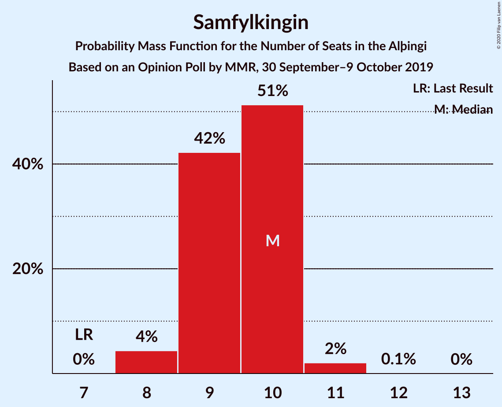
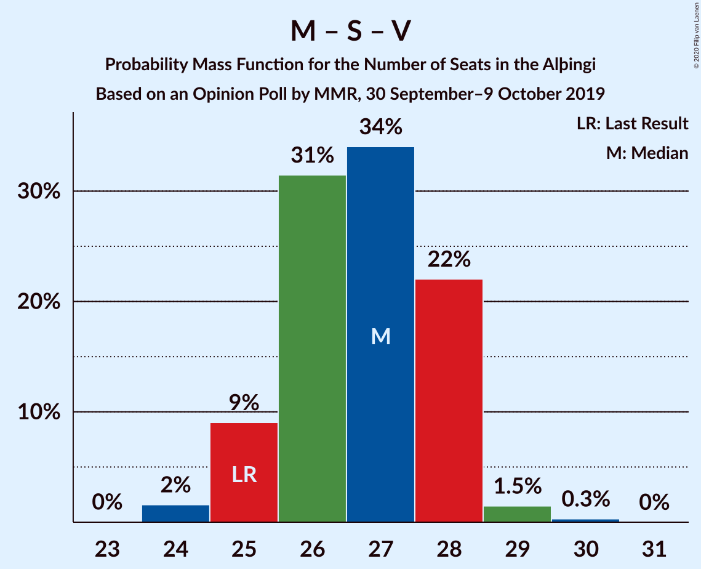
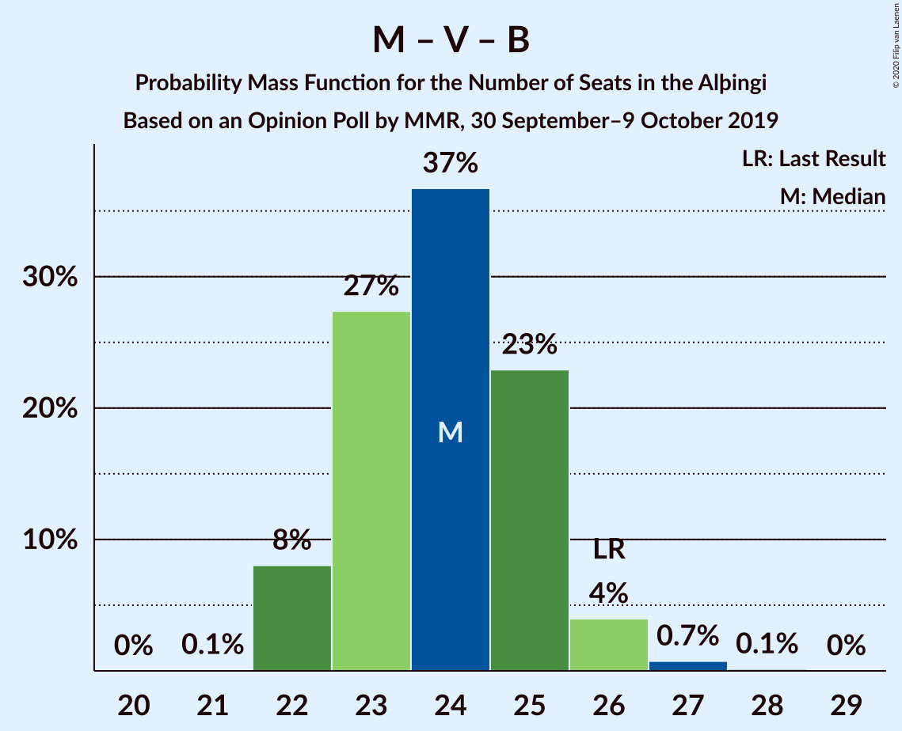
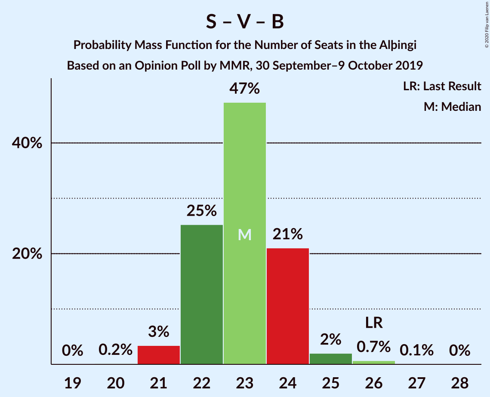
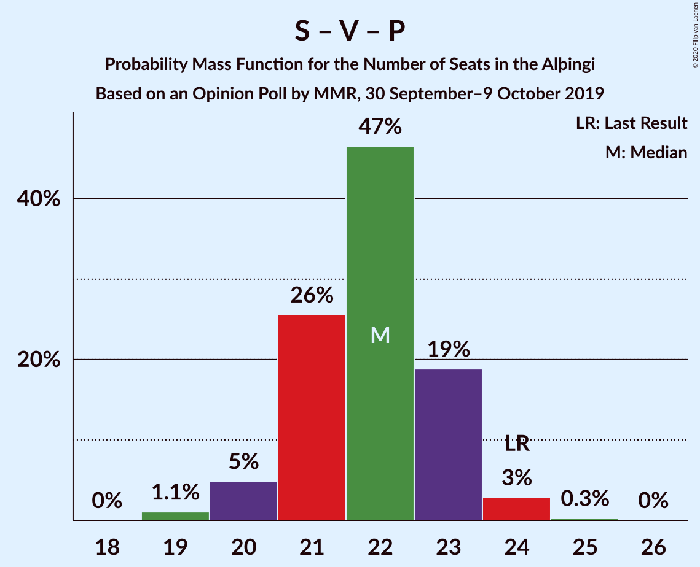

# Opinion Poll by MMR, 30 September–9 October 2019

<a href="#voting-intentions">Voting Intentions</a> | <a href="#seats">Seats</a> | <a href="#coalitions">Coalitions</a> | <a href="#technical-information">Technical Information</a>

## Voting Intentions

### Confidence Intervals

| Party | Last Result | Poll Result | 80% Confidence Interval | 90% Confidence Interval | 95% Confidence Interval | 99% Confidence Interval |
|:-----:|:-----------:|:-----------:|:-----------------------:|:-----------------------:|:-----------------------:|:-----------------------:|
| Sjálfstæðisflokkurinn | 25.2% | 19.8% | 18.7–21.0% |18.4–21.3% |18.2–21.6% |17.7–22.1% |
| Miðflokkurinn | 10.9% | 14.8% | 13.8–15.8% |13.6–16.1% |13.3–16.4% |12.9–16.9% |
| Samfylkingin | 12.1% | 14.1% | 13.2–15.1% |12.9–15.4% |12.7–15.6% |12.2–16.1% |
| Viðreisn | 6.7% | 11.0% | 10.2–11.9% |10.0–12.2% |9.8–12.4% |9.4–12.9% |
| Vinstrihreyfingin – grænt framboð | 16.9% | 10.3% | 9.5–11.2% |9.3–11.5% |9.1–11.7% |8.7–12.1% |
| Framsóknarflokkurinn | 10.7% | 10.1% | 9.3–11.0% |9.1–11.3% |8.9–11.5% |8.6–11.9% |
| Píratar | 9.2% | 8.8% | 8.1–9.6% |7.8–9.9% |7.7–10.1% |7.3–10.5% |
| Flokkur fólksins | 6.9% | 5.6% | 5.0–6.3% |4.8–6.5% |4.7–6.7% |4.4–7.0% |
| Sósíalistaflokkur Íslands | 0.0% | 3.1% | 2.7–3.6% |2.5–3.8% |2.5–3.9% |2.3–4.2% |

*Note:* The poll result column reflects the actual value used in the calculations. Published results may vary slightly, and in addition be rounded to fewer digits.

## Seats

### Confidence Intervals

| Party | Last Result | Median | 80% Confidence Interval | 90% Confidence Interval | 95% Confidence Interval | 99% Confidence Interval |
|:-----:|:-----------:|:------:|:-----------------------:|:-----------------------:|:-----------------------:|:-----------------------:|
| <a href="#sjálfstæðisflokkurinn">Sjálfstæðisflokkurinn</a> | 16 | 13 | 13–15 |13–15 |12–15 |11–17 |
| <a href="#miðflokkurinn">Miðflokkurinn</a> | 7 | 10 | 9–12 |9–12 |9–12 |9–12 |
| <a href="#samfylkingin">Samfylkingin</a> | 7 | 9 | 8–10 |8–10 |8–11 |8–11 |
| <a href="#viðreisn">Viðreisn</a> | 4 | 7 | 6–8 |6–8 |6–8 |5–8 |
| <a href="#vinstrihreyfingin-–-grænt-framboð">Vinstrihreyfingin – grænt framboð</a> | 11 | 7 | 6–8 |6–9 |5–9 |5–9 |
| <a href="#framsóknarflokkurinn">Framsóknarflokkurinn</a> | 8 | 6 | 6–8 |6–8 |6–8 |6–8 |
| <a href="#píratar">Píratar</a> | 6 | 6 | 5–6 |5–6 |5–6 |5–7 |
| <a href="#flokkur-fólksins">Flokkur fólksins</a> | 4 | 4 | 0–4 |0–4 |0–5 |0–5 |
| <a href="#sósíalistaflokkur-íslands">Sósíalistaflokkur Íslands</a> | 0 | 0 | 0 |0 |0 |0 |

### Sjálfstæðisflokkurinn

*For a full overview of the results for this party, see the [Sjálfstæðisflokkurinn](party-sjálfstæðisflokkurinn.html) page.*

| Number of Seats | Probability | Accumulated | Special Marks |
|:---------------:|:-----------:|:-----------:|:-------------:|
| 11 | 1.1% | 100% |  |
| 12 | 3% | 98.9% |  |
| 13 | 58% | 96% | Median |
| 14 | 26% | 37% |  |
| 15 | 11% | 12% |  |
| 16 | 0.5% | 1.1% | Last Result |
| 17 | 0.5% | 0.5% |  |
| 18 | 0% | 0% |  |

### Miðflokkurinn

*For a full overview of the results for this party, see the [Miðflokkurinn](party-miðflokkurinn.html) page.*

| Number of Seats | Probability | Accumulated | Special Marks |
|:---------------:|:-----------:|:-----------:|:-------------:|
| 7 | 0% | 100% | Last Result |
| 8 | 0% | 100% |  |
| 9 | 10% | 100% |  |
| 10 | 41% | 90% | Median |
| 11 | 35% | 48% |  |
| 12 | 13% | 13% |  |
| 13 | 0% | 0% |  |

### Samfylkingin

*For a full overview of the results for this party, see the [Samfylkingin](party-samfylkingin.html) page.*

| Number of Seats | Probability | Accumulated | Special Marks |
|:---------------:|:-----------:|:-----------:|:-------------:|
| 7 | 0% | 100% | Last Result |
| 8 | 14% | 100% |  |
| 9 | 38% | 86% | Median |
| 10 | 44% | 48% |  |
| 11 | 4% | 4% |  |
| 12 | 0% | 0% |  |

### Viðreisn

*For a full overview of the results for this party, see the [Viðreisn](party-viðreisn.html) page.*

| Number of Seats | Probability | Accumulated | Special Marks |
|:---------------:|:-----------:|:-----------:|:-------------:|
| 4 | 0% | 100% | Last Result |
| 5 | 0.6% | 100% |  |
| 6 | 36% | 99.4% |  |
| 7 | 20% | 63% | Median |
| 8 | 43% | 43% |  |
| 9 | 0% | 0% |  |

### Vinstrihreyfingin – grænt framboð

*For a full overview of the results for this party, see the [Vinstrihreyfingin – grænt framboð](party-vinstrihreyfingin–græntframboð.html) page.*

| Number of Seats | Probability | Accumulated | Special Marks |
|:---------------:|:-----------:|:-----------:|:-------------:|
| 5 | 3% | 100% |  |
| 6 | 45% | 97% |  |
| 7 | 18% | 52% | Median |
| 8 | 25% | 34% |  |
| 9 | 9% | 9% |  |
| 10 | 0% | 0% |  |
| 11 | 0% | 0% | Last Result |

### Framsóknarflokkurinn

*For a full overview of the results for this party, see the [Framsóknarflokkurinn](party-framsóknarflokkurinn.html) page.*

| Number of Seats | Probability | Accumulated | Special Marks |
|:---------------:|:-----------:|:-----------:|:-------------:|
| 5 | 0.1% | 100% |  |
| 6 | 60% | 99.9% | Median |
| 7 | 25% | 40% |  |
| 8 | 15% | 15% | Last Result |
| 9 | 0% | 0.2% |  |
| 10 | 0.2% | 0.2% |  |
| 11 | 0% | 0% |  |

### Píratar

*For a full overview of the results for this party, see the [Píratar](party-píratar.html) page.*

| Number of Seats | Probability | Accumulated | Special Marks |
|:---------------:|:-----------:|:-----------:|:-------------:|
| 4 | 0.1% | 100% |  |
| 5 | 48% | 99.9% |  |
| 6 | 50% | 52% | Last Result, Median |
| 7 | 2% | 2% |  |
| 8 | 0% | 0% |  |

### Flokkur fólksins

*For a full overview of the results for this party, see the [Flokkur fólksins](party-flokkurfólksins.html) page.*

| Number of Seats | Probability | Accumulated | Special Marks |
|:---------------:|:-----------:|:-----------:|:-------------:|
| 0 | 11% | 100% |  |
| 1 | 0% | 89% |  |
| 2 | 0% | 89% |  |
| 3 | 0.7% | 89% |  |
| 4 | 84% | 88% | Last Result, Median |
| 5 | 4% | 4% |  |
| 6 | 0% | 0% |  |

### Sósíalistaflokkur Íslands

*For a full overview of the results for this party, see the [Sósíalistaflokkur Íslands](party-sósíalistaflokkuríslands.html) page.*

| Number of Seats | Probability | Accumulated | Special Marks |
|:---------------:|:-----------:|:-----------:|:-------------:|
| 0 | 100% | 100% | Last Result, Median |

## Coalitions

### Confidence Intervals

| Coalition | Last Result | Median | Majority? | 80% Confidence Interval | 90% Confidence Interval | 95% Confidence Interval | 99% Confidence Interval |
|:---------:|:-----------:|:------:|:---------:|:-----------------------:|:-----------------------:|:-----------------------:|:-----------------------:|
| Miðflokkurinn – Samfylkingin – Vinstrihreyfingin – grænt framboð – Framsóknarflokkurinn | 33 | 33 | 100% | 32–35 | 32–35 | 32–35 | 32–36 |
| Samfylkingin – Viðreisn – Vinstrihreyfingin – grænt framboð – Píratar | 28 | 29 | 10% | 27–30 | 27–33 | 27–33 | 25–33 |
| Sjálfstæðisflokkurinn – Miðflokkurinn – Framsóknarflokkurinn | 31 | 30 | 25% | 30–32 | 30–32 | 30–32 | 29–35 |
| Sjálfstæðisflokkurinn – Vinstrihreyfingin – grænt framboð – Framsóknarflokkurinn | 35 | 27 | 0% | 25–29 | 25–29 | 25–29 | 25–31 |
| Miðflokkurinn – Samfylkingin – Vinstrihreyfingin – grænt framboð | 25 | 27 | 0% | 24–28 | 24–29 | 24–29 | 24–29 |
| Sjálfstæðisflokkurinn – Miðflokkurinn | 23 | 24 | 0% | 23–26 | 23–26 | 22–26 | 22–27 |
| Miðflokkurinn – Vinstrihreyfingin – grænt framboð – Framsóknarflokkurinn | 26 | 23 | 0% | 23–25 | 23–25 | 23–25 | 23–26 |
| Samfylkingin – Vinstrihreyfingin – grænt framboð – Framsóknarflokkurinn | 26 | 22 | 0% | 21–25 | 21–25 | 21–25 | 21–26 |
| Samfylkingin – Vinstrihreyfingin – grænt framboð – Píratar | 24 | 21 | 0% | 20–23 | 20–25 | 20–25 | 20–26 |
| Sjálfstæðisflokkurinn – Samfylkingin | 23 | 23 | 0% | 22–24 | 22–24 | 22–24 | 21–25 |
| Sjálfstæðisflokkurinn – Framsóknarflokkurinn | 24 | 20 | 0% | 19–23 | 19–23 | 19–23 | 19–25 |
| Sjálfstæðisflokkurinn – Vinstrihreyfingin – grænt framboð | 27 | 21 | 0% | 19–21 | 19–23 | 17–23 | 17–23 |
| Sjálfstæðisflokkurinn – Viðreisn | 20 | 21 | 0% | 19–22 | 19–22 | 19–22 | 18–23 |
| Miðflokkurinn – Vinstrihreyfingin – grænt framboð | 18 | 17 | 0% | 15–19 | 15–19 | 15–19 | 15–19 |
| Samfylkingin – Vinstrihreyfingin – grænt framboð | 18 | 16 | 0% | 15–17 | 15–19 | 15–19 | 14–19 |
| Vinstrihreyfingin – grænt framboð – Framsóknarflokkurinn | 19 | 13 | 0% | 12–15 | 12–15 | 12–15 | 12–15 |
| Vinstrihreyfingin – grænt framboð – Píratar | 17 | 12 | 0% | 11–14 | 11–15 | 11–15 | 11–15 |

### Miðflokkurinn – Samfylkingin – Vinstrihreyfingin – grænt framboð – Framsóknarflokkurinn

| Number of Seats | Probability | Accumulated | Special Marks |
|:---------------:|:-----------:|:-----------:|:-------------:|
| 32 | 15% | 100% | Median, Majority |
| 33 | 46% | 85% | Last Result |
| 34 | 28% | 39% |  |
| 35 | 9% | 11% |  |
| 36 | 2% | 2% |  |
| 37 | 0% | 0% |  |

### Samfylkingin – Viðreisn – Vinstrihreyfingin – grænt framboð – Píratar

| Number of Seats | Probability | Accumulated | Special Marks |
|:---------------:|:-----------:|:-----------:|:-------------:|
| 25 | 0.5% | 100% |  |
| 26 | 0% | 99.5% |  |
| 27 | 23% | 99.4% |  |
| 28 | 4% | 77% | Last Result |
| 29 | 62% | 73% | Median |
| 30 | 1.4% | 11% |  |
| 31 | 0% | 10% |  |
| 32 | 0.1% | 10% | Majority |
| 33 | 10% | 10% |  |
| 34 | 0% | 0% |  |

### Sjálfstæðisflokkurinn – Miðflokkurinn – Framsóknarflokkurinn

| Number of Seats | Probability | Accumulated | Special Marks |
|:---------------:|:-----------:|:-----------:|:-------------:|
| 29 | 0.6% | 100% | Median |
| 30 | 75% | 99.4% |  |
| 31 | 0.2% | 25% | Last Result |
| 32 | 23% | 25% | Majority |
| 33 | 1.0% | 2% |  |
| 34 | 0.5% | 1.1% |  |
| 35 | 0.6% | 0.6% |  |
| 36 | 0% | 0% |  |

### Sjálfstæðisflokkurinn – Vinstrihreyfingin – grænt framboð – Framsóknarflokkurinn

| Number of Seats | Probability | Accumulated | Special Marks |
|:---------------:|:-----------:|:-----------:|:-------------:|
| 25 | 36% | 100% |  |
| 26 | 1.3% | 64% | Median |
| 27 | 18% | 62% |  |
| 28 | 25% | 45% |  |
| 29 | 19% | 20% |  |
| 30 | 0.1% | 0.8% |  |
| 31 | 0.7% | 0.7% |  |
| 32 | 0% | 0% | Majority |
| 33 | 0% | 0% |  |
| 34 | 0% | 0% |  |
| 35 | 0% | 0% | Last Result |

### Miðflokkurinn – Samfylkingin – Vinstrihreyfingin – grænt framboð

| Number of Seats | Probability | Accumulated | Special Marks |
|:---------------:|:-----------:|:-----------:|:-------------:|
| 24 | 11% | 100% |  |
| 25 | 0.2% | 89% | Last Result |
| 26 | 8% | 89% | Median |
| 27 | 70% | 81% |  |
| 28 | 2% | 11% |  |
| 29 | 10% | 10% |  |
| 30 | 0% | 0% |  |

### Sjálfstæðisflokkurinn – Miðflokkurinn

| Number of Seats | Probability | Accumulated | Special Marks |
|:---------------:|:-----------:|:-----------:|:-------------:|
| 22 | 4% | 100% |  |
| 23 | 25% | 96% | Last Result, Median |
| 24 | 56% | 71% |  |
| 25 | 0% | 15% |  |
| 26 | 13% | 15% |  |
| 27 | 2% | 2% |  |
| 28 | 0% | 0% |  |

### Miðflokkurinn – Vinstrihreyfingin – grænt framboð – Framsóknarflokkurinn

| Number of Seats | Probability | Accumulated | Special Marks |
|:---------------:|:-----------:|:-----------:|:-------------:|
| 23 | 50% | 100% | Median |
| 24 | 3% | 50% |  |
| 25 | 46% | 47% |  |
| 26 | 1.3% | 1.4% | Last Result |
| 27 | 0% | 0% |  |

### Samfylkingin – Vinstrihreyfingin – grænt framboð – Framsóknarflokkurinn

| Number of Seats | Probability | Accumulated | Special Marks |
|:---------------:|:-----------:|:-----------:|:-------------:|
| 21 | 13% | 100% |  |
| 22 | 40% | 87% | Median |
| 23 | 10% | 48% |  |
| 24 | 27% | 38% |  |
| 25 | 10% | 11% |  |
| 26 | 0.9% | 0.9% | Last Result |
| 27 | 0% | 0% |  |

### Samfylkingin – Vinstrihreyfingin – grænt framboð – Píratar

| Number of Seats | Probability | Accumulated | Special Marks |
|:---------------:|:-----------:|:-----------:|:-------------:|
| 20 | 11% | 100% |  |
| 21 | 50% | 89% |  |
| 22 | 6% | 40% | Median |
| 23 | 24% | 34% |  |
| 24 | 0.1% | 10% | Last Result |
| 25 | 9% | 10% |  |
| 26 | 0.7% | 0.7% |  |
| 27 | 0% | 0% |  |

### Sjálfstæðisflokkurinn – Samfylkingin

| Number of Seats | Probability | Accumulated | Special Marks |
|:---------------:|:-----------:|:-----------:|:-------------:|
| 21 | 2% | 100% |  |
| 22 | 36% | 98% | Median |
| 23 | 40% | 62% | Last Result |
| 24 | 20% | 21% |  |
| 25 | 2% | 2% |  |
| 26 | 0% | 0% |  |

### Sjálfstæðisflokkurinn – Framsóknarflokkurinn

| Number of Seats | Probability | Accumulated | Special Marks |
|:---------------:|:-----------:|:-----------:|:-------------:|
| 18 | 0.1% | 100% |  |
| 19 | 35% | 99.9% | Median |
| 20 | 53% | 65% |  |
| 21 | 0.9% | 12% |  |
| 22 | 0.1% | 11% |  |
| 23 | 10% | 11% |  |
| 24 | 0.2% | 0.7% | Last Result |
| 25 | 0.5% | 0.5% |  |
| 26 | 0% | 0% |  |

### Sjálfstæðisflokkurinn – Vinstrihreyfingin – grænt framboð

| Number of Seats | Probability | Accumulated | Special Marks |
|:---------------:|:-----------:|:-----------:|:-------------:|
| 17 | 3% | 100% |  |
| 18 | 1.1% | 97% |  |
| 19 | 33% | 96% |  |
| 20 | 0.1% | 62% | Median |
| 21 | 52% | 62% |  |
| 22 | 0.6% | 10% |  |
| 23 | 9% | 9% |  |
| 24 | 0% | 0% |  |
| 25 | 0% | 0% |  |
| 26 | 0% | 0% |  |
| 27 | 0% | 0% | Last Result |

### Sjálfstæðisflokkurinn – Viðreisn

| Number of Seats | Probability | Accumulated | Special Marks |
|:---------------:|:-----------:|:-----------:|:-------------:|
| 18 | 1.1% | 100% |  |
| 19 | 27% | 98.9% |  |
| 20 | 13% | 72% | Last Result, Median |
| 21 | 38% | 59% |  |
| 22 | 20% | 21% |  |
| 23 | 0.6% | 0.6% |  |
| 24 | 0% | 0% |  |

### Miðflokkurinn – Vinstrihreyfingin – grænt framboð

| Number of Seats | Probability | Accumulated | Special Marks |
|:---------------:|:-----------:|:-----------:|:-------------:|
| 15 | 13% | 100% |  |
| 16 | 0.7% | 87% |  |
| 17 | 38% | 86% | Median |
| 18 | 27% | 48% | Last Result |
| 19 | 21% | 21% |  |
| 20 | 0% | 0% |  |

### Samfylkingin – Vinstrihreyfingin – grænt framboð

| Number of Seats | Probability | Accumulated | Special Marks |
|:---------------:|:-----------:|:-----------:|:-------------:|
| 14 | 0.5% | 100% |  |
| 15 | 23% | 99.4% |  |
| 16 | 42% | 76% | Median |
| 17 | 25% | 35% |  |
| 18 | 0.1% | 10% | Last Result |
| 19 | 10% | 10% |  |
| 20 | 0% | 0% |  |

### Vinstrihreyfingin – grænt framboð – Framsóknarflokkurinn

| Number of Seats | Probability | Accumulated | Special Marks |
|:---------------:|:-----------:|:-----------:|:-------------:|
| 12 | 34% | 100% |  |
| 13 | 20% | 66% | Median |
| 14 | 11% | 46% |  |
| 15 | 34% | 35% |  |
| 16 | 0% | 0.2% |  |
| 17 | 0.1% | 0.1% |  |
| 18 | 0% | 0% |  |
| 19 | 0% | 0% | Last Result |

### Vinstrihreyfingin – grænt framboð – Píratar

| Number of Seats | Probability | Accumulated | Special Marks |
|:---------------:|:-----------:|:-----------:|:-------------:|
| 10 | 0.2% | 100% |  |
| 11 | 46% | 99.8% |  |
| 12 | 6% | 53% |  |
| 13 | 14% | 48% | Median |
| 14 | 24% | 34% |  |
| 15 | 10% | 10% |  |
| 16 | 0% | 0% |  |
| 17 | 0% | 0% | Last Result |

## Technical Information

### Opinion Poll

+ **Polling firm:** MMR
+ **Commissioner(s):** —
+ **Fieldwork period:** 30 September–9 October 2019

### Calculations

+ **Sample size:** 2124
+ **Simulations done:** 1,024
+ **Error estimate:** 2.33%

