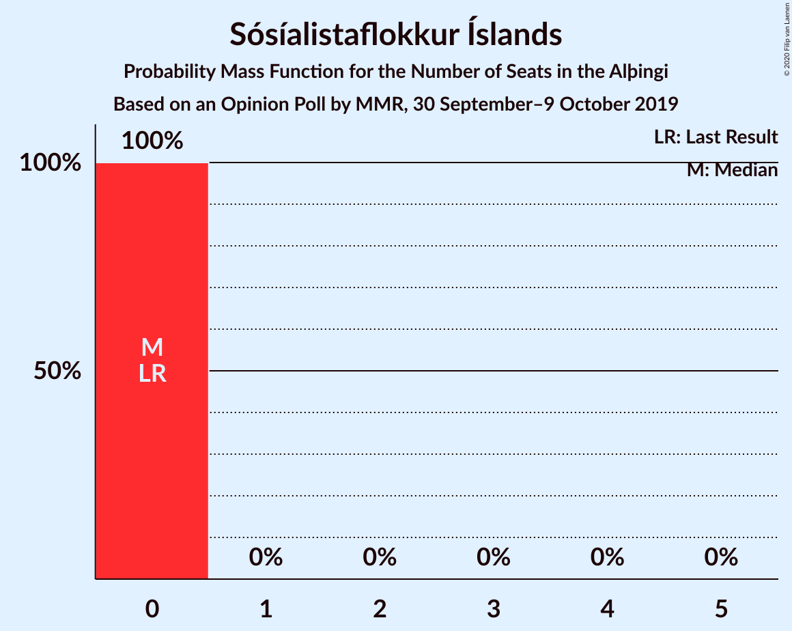
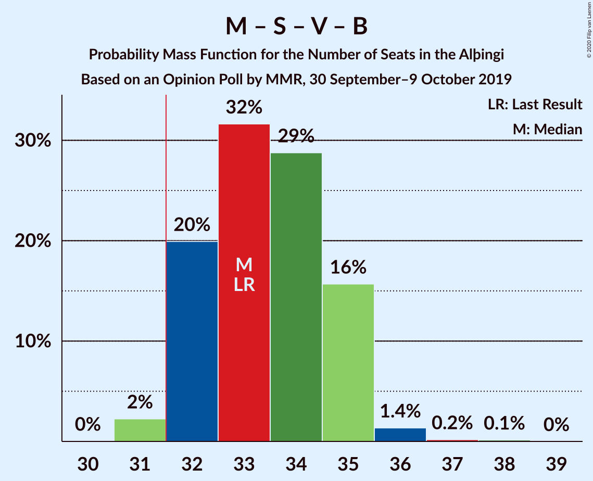

# Opinion Poll by MMR, 30 September–9 October 2019

<a href="#voting-intentions">Voting Intentions</a> | <a href="#seats">Seats</a> | <a href="#coalitions">Coalitions</a> | <a href="#technical-information">Technical Information</a>

## Voting Intentions

### Confidence Intervals

| Party | Last Result | Poll Result | 80% Confidence Interval | 90% Confidence Interval | 95% Confidence Interval | 99% Confidence Interval |
|:-----:|:-----------:|:-----------:|:-----------------------:|:-----------------------:|:-----------------------:|:-----------------------:|
| Sjálfstæðisflokkurinn | 25.2% | 19.8% | 18.7–21.0% |18.4–21.3% |18.2–21.6% |17.7–22.1% |
| Miðflokkurinn | 10.9% | 14.8% | 13.8–15.8% |13.6–16.1% |13.3–16.4% |12.9–16.9% |
| Samfylkingin | 12.1% | 14.1% | 13.2–15.1% |12.9–15.4% |12.7–15.6% |12.2–16.1% |
| Viðreisn | 6.7% | 11.0% | 10.2–11.9% |10.0–12.2% |9.8–12.4% |9.4–12.9% |
| Vinstrihreyfingin – grænt framboð | 16.9% | 10.3% | 9.5–11.2% |9.3–11.5% |9.1–11.7% |8.7–12.1% |
| Framsóknarflokkurinn | 10.7% | 10.1% | 9.3–11.0% |9.1–11.3% |8.9–11.5% |8.6–11.9% |
| Píratar | 9.2% | 8.8% | 8.1–9.6% |7.8–9.9% |7.7–10.1% |7.3–10.5% |
| Flokkur fólksins | 6.9% | 5.6% | 5.0–6.3% |4.8–6.5% |4.7–6.7% |4.4–7.0% |
| Sósíalistaflokkur Íslands | 0.0% | 3.1% | 2.7–3.6% |2.5–3.8% |2.5–3.9% |2.3–4.2% |

*Note:* The poll result column reflects the actual value used in the calculations. Published results may vary slightly, and in addition be rounded to fewer digits.

## Seats

### Confidence Intervals

| Party | Last Result | Median | 80% Confidence Interval | 90% Confidence Interval | 95% Confidence Interval | 99% Confidence Interval |
|:-----:|:-----------:|:------:|:-----------------------:|:-----------------------:|:-----------------------:|:-----------------------:|
| <a href="#sjálfstæðisflokkurinn">Sjálfstæðisflokkurinn</a> | 16 | 14 | 13–15 |13–15 |12–15 |12–15 |
| <a href="#miðflokkurinn">Miðflokkurinn</a> | 7 | 10 | 10 |10–11 |10–12 |10–12 |
| <a href="#samfylkingin">Samfylkingin</a> | 7 | 10 | 9–10 |9–10 |8–10 |8–11 |
| <a href="#viðreisn">Viðreisn</a> | 4 | 7 | 7–8 |7–8 |7–8 |6–9 |
| <a href="#vinstrihreyfingin-–-grænt-framboð">Vinstrihreyfingin – grænt framboð</a> | 11 | 7 | 6–8 |6–8 |6–8 |6–8 |
| <a href="#framsóknarflokkurinn">Framsóknarflokkurinn</a> | 8 | 6 | 6–7 |6–8 |6–8 |6–9 |
| <a href="#píratar">Píratar</a> | 6 | 6 | 5–7 |5–7 |5–7 |5–7 |
| <a href="#flokkur-fólksins">Flokkur fólksins</a> | 4 | 3 | 3–4 |3–4 |0–4 |0–4 |
| <a href="#sósíalistaflokkur-íslands">Sósíalistaflokkur Íslands</a> | 0 | 0 | 0 |0 |0 |0 |

### Sjálfstæðisflokkurinn

*For a full overview of the results for this party, see the [Sjálfstæðisflokkurinn](party-sjálfstæðisflokkurinn.html) page.*

| Number of Seats | Probability | Accumulated | Special Marks |
|:---------------:|:-----------:|:-----------:|:-------------:|
| 11 | 0.1% | 100% |  |
| 12 | 4% | 99.9% |  |
| 13 | 19% | 96% |  |
| 14 | 49% | 76% | Median |
| 15 | 28% | 28% |  |
| 16 | 0.2% | 0.3% | Last Result |
| 17 | 0% | 0% |  |

### Miðflokkurinn

*For a full overview of the results for this party, see the [Miðflokkurinn](party-miðflokkurinn.html) page.*

| Number of Seats | Probability | Accumulated | Special Marks |
|:---------------:|:-----------:|:-----------:|:-------------:|
| 7 | 0% | 100% | Last Result |
| 8 | 0% | 100% |  |
| 9 | 0.3% | 100% |  |
| 10 | 91% | 99.7% | Median |
| 11 | 6% | 9% |  |
| 12 | 3% | 3% |  |
| 13 | 0.5% | 0.5% |  |
| 14 | 0% | 0% |  |

### Samfylkingin

*For a full overview of the results for this party, see the [Samfylkingin](party-samfylkingin.html) page.*

| Number of Seats | Probability | Accumulated | Special Marks |
|:---------------:|:-----------:|:-----------:|:-------------:|
| 7 | 0% | 100% | Last Result |
| 8 | 4% | 100% |  |
| 9 | 42% | 96% |  |
| 10 | 52% | 54% | Median |
| 11 | 2% | 2% |  |
| 12 | 0% | 0% |  |

### Viðreisn

*For a full overview of the results for this party, see the [Viðreisn](party-viðreisn.html) page.*

| Number of Seats | Probability | Accumulated | Special Marks |
|:---------------:|:-----------:|:-----------:|:-------------:|
| 4 | 0% | 100% | Last Result |
| 5 | 0% | 100% |  |
| 6 | 2% | 100% |  |
| 7 | 81% | 98% | Median |
| 8 | 16% | 17% |  |
| 9 | 0.8% | 0.8% |  |
| 10 | 0% | 0% |  |

### Vinstrihreyfingin – grænt framboð

*For a full overview of the results for this party, see the [Vinstrihreyfingin – grænt framboð](party-vinstrihreyfingin–græntframboð.html) page.*

| Number of Seats | Probability | Accumulated | Special Marks |
|:---------------:|:-----------:|:-----------:|:-------------:|
| 5 | 0.2% | 100% |  |
| 6 | 17% | 99.8% |  |
| 7 | 68% | 83% | Median |
| 8 | 15% | 15% |  |
| 9 | 0.1% | 0.1% |  |
| 10 | 0% | 0% |  |
| 11 | 0% | 0% | Last Result |

### Framsóknarflokkurinn

*For a full overview of the results for this party, see the [Framsóknarflokkurinn](party-framsóknarflokkurinn.html) page.*

| Number of Seats | Probability | Accumulated | Special Marks |
|:---------------:|:-----------:|:-----------:|:-------------:|
| 5 | 0.1% | 100% |  |
| 6 | 76% | 99.9% | Median |
| 7 | 18% | 24% |  |
| 8 | 5% | 6% | Last Result |
| 9 | 0.6% | 0.9% |  |
| 10 | 0.3% | 0.3% |  |
| 11 | 0% | 0% |  |

### Píratar

*For a full overview of the results for this party, see the [Píratar](party-píratar.html) page.*

| Number of Seats | Probability | Accumulated | Special Marks |
|:---------------:|:-----------:|:-----------:|:-------------:|
| 4 | 0.2% | 100% |  |
| 5 | 43% | 99.8% |  |
| 6 | 35% | 57% | Last Result, Median |
| 7 | 22% | 22% |  |
| 8 | 0% | 0% |  |

### Flokkur fólksins

*For a full overview of the results for this party, see the [Flokkur fólksins](party-flokkurfólksins.html) page.*

| Number of Seats | Probability | Accumulated | Special Marks |
|:---------------:|:-----------:|:-----------:|:-------------:|
| 0 | 4% | 100% |  |
| 1 | 0% | 96% |  |
| 2 | 0% | 96% |  |
| 3 | 71% | 96% | Median |
| 4 | 24% | 24% | Last Result |
| 5 | 0.2% | 0.2% |  |
| 6 | 0% | 0% |  |

### Sósíalistaflokkur Íslands

*For a full overview of the results for this party, see the [Sósíalistaflokkur Íslands](party-sósíalistaflokkuríslands.html) page.*

| Number of Seats | Probability | Accumulated | Special Marks |
|:---------------:|:-----------:|:-----------:|:-------------:|
| 0 | 100% | 100% | Last Result, Median |

## Coalitions

### Confidence Intervals

| Coalition | Last Result | Median | Majority? | 80% Confidence Interval | 90% Confidence Interval | 95% Confidence Interval | 99% Confidence Interval |
|:---------:|:-----------:|:------:|:---------:|:-----------------------:|:-----------------------:|:-----------------------:|:-----------------------:|
| Miðflokkurinn – Samfylkingin – Vinstrihreyfingin – grænt framboð – Framsóknarflokkurinn | 33 | 33 | 98.9% | 32–34 | 32–34 | 32–35 | 31–38 |
| Sjálfstæðisflokkurinn – Miðflokkurinn – Framsóknarflokkurinn | 31 | 30 | 9% | 29–31 | 29–32 | 29–32 | 29–33 |
| Samfylkingin – Viðreisn – Vinstrihreyfingin – grænt framboð – Píratar | 28 | 30 | 0.6% | 29–30 | 28–31 | 27–31 | 27–32 |
| Sjálfstæðisflokkurinn – Vinstrihreyfingin – grænt framboð – Framsóknarflokkurinn | 35 | 27 | 0% | 26–28 | 26–28 | 26–29 | 25–30 |
| Miðflokkurinn – Samfylkingin – Vinstrihreyfingin – grænt framboð | 25 | 27 | 0% | 26–28 | 25–28 | 25–28 | 24–30 |
| Miðflokkurinn – Vinstrihreyfingin – grænt framboð – Framsóknarflokkurinn | 26 | 23 | 0% | 23–24 | 23–25 | 22–26 | 22–28 |
| Sjálfstæðisflokkurinn – Miðflokkurinn | 23 | 24 | 0% | 23–25 | 23–25 | 23–25 | 22–26 |
| Sjálfstæðisflokkurinn – Samfylkingin | 23 | 23 | 0% | 22–25 | 22–25 | 21–25 | 21–26 |
| Samfylkingin – Vinstrihreyfingin – grænt framboð – Framsóknarflokkurinn | 26 | 23 | 0% | 22–24 | 22–24 | 22–24 | 21–26 |
| Samfylkingin – Vinstrihreyfingin – grænt framboð – Píratar | 24 | 22 | 0% | 21–23 | 21–23 | 20–23 | 20–24 |
| Sjálfstæðisflokkurinn – Framsóknarflokkurinn | 24 | 20 | 0% | 19–21 | 19–22 | 19–22 | 19–23 |
| Sjálfstæðisflokkurinn – Vinstrihreyfingin – grænt framboð | 27 | 21 | 0% | 20–22 | 19–22 | 19–22 | 18–23 |
| Sjálfstæðisflokkurinn – Viðreisn | 20 | 21 | 0% | 20–22 | 20–22 | 19–22 | 19–23 |
| Miðflokkurinn – Vinstrihreyfingin – grænt framboð | 18 | 17 | 0% | 16–18 | 16–18 | 16–18 | 16–20 |
| Samfylkingin – Vinstrihreyfingin – grænt framboð | 18 | 17 | 0% | 15–18 | 15–18 | 15–18 | 14–18 |
| Vinstrihreyfingin – grænt framboð – Framsóknarflokkurinn | 19 | 13 | 0% | 13–14 | 12–15 | 12–15 | 12–16 |
| Vinstrihreyfingin – grænt framboð – Píratar | 17 | 13 | 0% | 12–14 | 12–14 | 12–14 | 11–14 |

### Miðflokkurinn – Samfylkingin – Vinstrihreyfingin – grænt framboð – Framsóknarflokkurinn

| Number of Seats | Probability | Accumulated | Special Marks |
|:---------------:|:-----------:|:-----------:|:-------------:|
| 31 | 1.1% | 100% |  |
| 32 | 32% | 98.9% | Majority |
| 33 | 46% | 67% | Last Result, Median |
| 34 | 16% | 21% |  |
| 35 | 3% | 5% |  |
| 36 | 0.8% | 2% |  |
| 37 | 0.1% | 0.9% |  |
| 38 | 0.8% | 0.8% |  |
| 39 | 0% | 0% |  |

### Sjálfstæðisflokkurinn – Miðflokkurinn – Framsóknarflokkurinn

| Number of Seats | Probability | Accumulated | Special Marks |
|:---------------:|:-----------:|:-----------:|:-------------:|
| 29 | 11% | 100% |  |
| 30 | 46% | 89% | Median |
| 31 | 35% | 44% | Last Result |
| 32 | 7% | 9% | Majority |
| 33 | 1.4% | 2% |  |
| 34 | 0.4% | 0.4% |  |
| 35 | 0% | 0% |  |

### Samfylkingin – Viðreisn – Vinstrihreyfingin – grænt framboð – Píratar

| Number of Seats | Probability | Accumulated | Special Marks |
|:---------------:|:-----------:|:-----------:|:-------------:|
| 26 | 0.1% | 100% |  |
| 27 | 4% | 99.9% |  |
| 28 | 6% | 96% | Last Result |
| 29 | 40% | 90% |  |
| 30 | 43% | 50% | Median |
| 31 | 7% | 7% |  |
| 32 | 0.5% | 0.6% | Majority |
| 33 | 0.1% | 0.1% |  |
| 34 | 0% | 0% |  |

### Sjálfstæðisflokkurinn – Vinstrihreyfingin – grænt framboð – Framsóknarflokkurinn

| Number of Seats | Probability | Accumulated | Special Marks |
|:---------------:|:-----------:|:-----------:|:-------------:|
| 25 | 1.2% | 100% |  |
| 26 | 21% | 98.8% |  |
| 27 | 29% | 77% | Median |
| 28 | 44% | 48% |  |
| 29 | 3% | 4% |  |
| 30 | 1.1% | 1.1% |  |
| 31 | 0% | 0.1% |  |
| 32 | 0% | 0% | Majority |
| 33 | 0% | 0% |  |
| 34 | 0% | 0% |  |
| 35 | 0% | 0% | Last Result |

### Miðflokkurinn – Samfylkingin – Vinstrihreyfingin – grænt framboð

| Number of Seats | Probability | Accumulated | Special Marks |
|:---------------:|:-----------:|:-----------:|:-------------:|
| 24 | 0.8% | 100% |  |
| 25 | 8% | 99.2% | Last Result |
| 26 | 35% | 91% |  |
| 27 | 42% | 56% | Median |
| 28 | 13% | 15% |  |
| 29 | 0.8% | 2% |  |
| 30 | 0.9% | 0.9% |  |
| 31 | 0% | 0% |  |

### Miðflokkurinn – Vinstrihreyfingin – grænt framboð – Framsóknarflokkurinn

| Number of Seats | Probability | Accumulated | Special Marks |
|:---------------:|:-----------:|:-----------:|:-------------:|
| 22 | 5% | 100% |  |
| 23 | 63% | 95% | Median |
| 24 | 24% | 33% |  |
| 25 | 6% | 9% |  |
| 26 | 2% | 3% | Last Result |
| 27 | 0.5% | 1.3% |  |
| 28 | 0.8% | 0.8% |  |
| 29 | 0% | 0% |  |

### Sjálfstæðisflokkurinn – Miðflokkurinn

| Number of Seats | Probability | Accumulated | Special Marks |
|:---------------:|:-----------:|:-----------:|:-------------:|
| 21 | 0.1% | 100% |  |
| 22 | 2% | 99.9% |  |
| 23 | 17% | 98% | Last Result |
| 24 | 51% | 82% | Median |
| 25 | 30% | 31% |  |
| 26 | 0.9% | 1.2% |  |
| 27 | 0.1% | 0.4% |  |
| 28 | 0.3% | 0.3% |  |
| 29 | 0% | 0% |  |

### Sjálfstæðisflokkurinn – Samfylkingin

| Number of Seats | Probability | Accumulated | Special Marks |
|:---------------:|:-----------:|:-----------:|:-------------:|
| 20 | 0% | 100% |  |
| 21 | 3% | 99.9% |  |
| 22 | 8% | 97% |  |
| 23 | 48% | 89% | Last Result |
| 24 | 16% | 41% | Median |
| 25 | 24% | 25% |  |
| 26 | 0.8% | 0.8% |  |
| 27 | 0% | 0% |  |

### Samfylkingin – Vinstrihreyfingin – grænt framboð – Framsóknarflokkurinn

| Number of Seats | Probability | Accumulated | Special Marks |
|:---------------:|:-----------:|:-----------:|:-------------:|
| 21 | 2% | 100% |  |
| 22 | 35% | 98% |  |
| 23 | 45% | 63% | Median |
| 24 | 15% | 18% |  |
| 25 | 1.4% | 2% |  |
| 26 | 1.1% | 1.1% | Last Result |
| 27 | 0% | 0% |  |

### Samfylkingin – Vinstrihreyfingin – grænt framboð – Píratar

| Number of Seats | Probability | Accumulated | Special Marks |
|:---------------:|:-----------:|:-----------:|:-------------:|
| 19 | 0.1% | 100% |  |
| 20 | 3% | 99.9% |  |
| 21 | 15% | 97% |  |
| 22 | 33% | 82% |  |
| 23 | 47% | 49% | Median |
| 24 | 2% | 2% | Last Result |
| 25 | 0.1% | 0.1% |  |
| 26 | 0% | 0% |  |

### Sjálfstæðisflokkurinn – Framsóknarflokkurinn

| Number of Seats | Probability | Accumulated | Special Marks |
|:---------------:|:-----------:|:-----------:|:-------------:|
| 18 | 0.1% | 100% |  |
| 19 | 14% | 99.9% |  |
| 20 | 47% | 86% | Median |
| 21 | 34% | 39% |  |
| 22 | 5% | 6% |  |
| 23 | 0.8% | 0.9% |  |
| 24 | 0.1% | 0.1% | Last Result |
| 25 | 0% | 0% |  |

### Sjálfstæðisflokkurinn – Vinstrihreyfingin – grænt framboð

| Number of Seats | Probability | Accumulated | Special Marks |
|:---------------:|:-----------:|:-----------:|:-------------:|
| 18 | 2% | 100% |  |
| 19 | 6% | 98% |  |
| 20 | 25% | 92% |  |
| 21 | 27% | 67% | Median |
| 22 | 39% | 40% |  |
| 23 | 0.7% | 0.7% |  |
| 24 | 0% | 0% |  |
| 25 | 0% | 0% |  |
| 26 | 0% | 0% |  |
| 27 | 0% | 0% | Last Result |

### Sjálfstæðisflokkurinn – Viðreisn

| Number of Seats | Probability | Accumulated | Special Marks |
|:---------------:|:-----------:|:-----------:|:-------------:|
| 18 | 0.4% | 100% |  |
| 19 | 4% | 99.6% |  |
| 20 | 12% | 96% | Last Result |
| 21 | 49% | 84% | Median |
| 22 | 33% | 35% |  |
| 23 | 2% | 2% |  |
| 24 | 0.2% | 0.2% |  |
| 25 | 0% | 0% |  |

### Miðflokkurinn – Vinstrihreyfingin – grænt framboð

| Number of Seats | Probability | Accumulated | Special Marks |
|:---------------:|:-----------:|:-----------:|:-------------:|
| 15 | 0.2% | 100% |  |
| 16 | 14% | 99.8% |  |
| 17 | 65% | 86% | Median |
| 18 | 19% | 21% | Last Result |
| 19 | 1.1% | 2% |  |
| 20 | 1.1% | 1.1% |  |
| 21 | 0% | 0% |  |

### Samfylkingin – Vinstrihreyfingin – grænt framboð

| Number of Seats | Probability | Accumulated | Special Marks |
|:---------------:|:-----------:|:-----------:|:-------------:|
| 13 | 0% | 100% |  |
| 14 | 0.7% | 99.9% |  |
| 15 | 11% | 99.2% |  |
| 16 | 37% | 89% |  |
| 17 | 40% | 51% | Median |
| 18 | 12% | 12% | Last Result |
| 19 | 0.1% | 0.1% |  |
| 20 | 0% | 0% |  |

### Vinstrihreyfingin – grænt framboð – Framsóknarflokkurinn

| Number of Seats | Probability | Accumulated | Special Marks |
|:---------------:|:-----------:|:-----------:|:-------------:|
| 11 | 0.1% | 100% |  |
| 12 | 5% | 99.9% |  |
| 13 | 67% | 95% | Median |
| 14 | 23% | 28% |  |
| 15 | 4% | 5% |  |
| 16 | 1.2% | 1.5% |  |
| 17 | 0.3% | 0.3% |  |
| 18 | 0% | 0% |  |
| 19 | 0% | 0% | Last Result |

### Vinstrihreyfingin – grænt framboð – Píratar

| Number of Seats | Probability | Accumulated | Special Marks |
|:---------------:|:-----------:|:-----------:|:-------------:|
| 10 | 0.2% | 100% |  |
| 11 | 2% | 99.8% |  |
| 12 | 45% | 98% |  |
| 13 | 26% | 52% | Median |
| 14 | 27% | 27% |  |
| 15 | 0.2% | 0.2% |  |
| 16 | 0% | 0% |  |
| 17 | 0% | 0% | Last Result |

## Technical Information

### Opinion Poll

+ **Polling firm:** MMR
+ **Commissioner(s):** —
+ **Fieldwork period:** 30 September–9 October 2019

### Calculations

+ **Sample size:** 2124
+ **Simulations done:** 131,072
+ **Error estimate:** 1.92%

