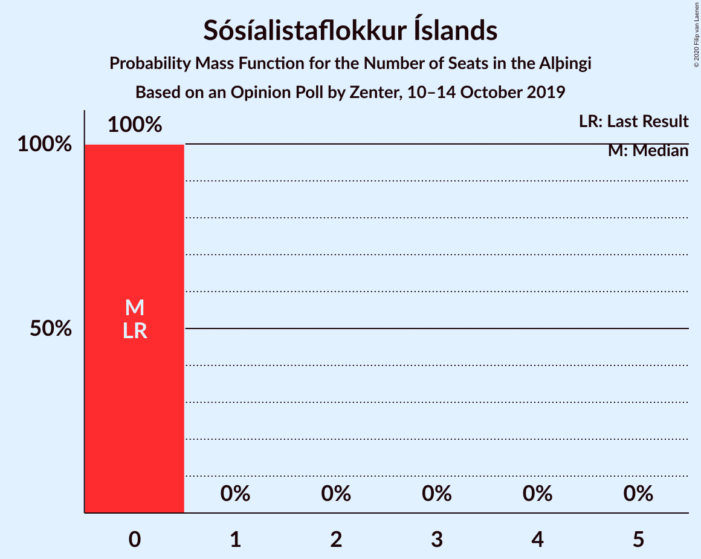

# Opinion Poll by Zenter, 10–14 October 2019

<a href="#voting-intentions">Voting Intentions</a> | <a href="#seats">Seats</a> | <a href="#coalitions">Coalitions</a> | <a href="#technical-information">Technical Information</a>

## Voting Intentions

### Confidence Intervals

| Party | Last Result | Poll Result | 80% Confidence Interval | 90% Confidence Interval | 95% Confidence Interval | 99% Confidence Interval |
|:-----:|:-----------:|:-----------:|:-----------------------:|:-----------------------:|:-----------------------:|:-----------------------:|
| Sjálfstæðisflokkurinn | 25.2% | 19.7% | 18.3–21.2% |17.9–21.6% |17.6–22.0% |16.9–22.8% |
| Samfylkingin | 12.1% | 18.5% | 17.2–20.0% |16.8–20.5% |16.5–20.8% |15.8–21.6% |
| Vinstrihreyfingin – grænt framboð | 16.9% | 12.6% | 11.4–13.8% |11.1–14.2% |10.8–14.5% |10.3–15.2% |
| Miðflokkurinn | 10.9% | 11.6% | 10.5–12.9% |10.2–13.3% |10.0–13.6% |9.5–14.2% |
| Viðreisn | 6.7% | 11.3% | 10.2–12.6% |9.9–12.9% |9.7–13.2% |9.2–13.8% |
| Píratar | 9.2% | 10.9% | 9.8–12.1% |9.5–12.5% |9.3–12.8% |8.8–13.4% |
| Framsóknarflokkurinn | 10.7% | 7.3% | 6.4–8.4% |6.2–8.6% |6.0–8.9% |5.6–9.4% |
| Flokkur fólksins | 6.9% | 4.0% | 3.4–4.8% |3.2–5.1% |3.0–5.3% |2.8–5.7% |
| Sósíalistaflokkur Íslands | 0.0% | 2.9% | 2.3–3.6% |2.2–3.8% |2.1–4.0% |1.8–4.3% |

*Note:* The poll result column reflects the actual value used in the calculations. Published results may vary slightly, and in addition be rounded to fewer digits.

## Seats

### Confidence Intervals

| Party | Last Result | Median | 80% Confidence Interval | 90% Confidence Interval | 95% Confidence Interval | 99% Confidence Interval |
|:-----:|:-----------:|:------:|:-----------------------:|:-----------------------:|:-----------------------:|:-----------------------:|
| <a href="#sjálfstæðisflokkurinn">Sjálfstæðisflokkurinn</a> | 16 | 12 | 12–15 |12–15 |12–15 |11–15 |
| <a href="#samfylkingin">Samfylkingin</a> | 7 | 13 | 11–13 |11–14 |11–14 |10–14 |
| <a href="#vinstrihreyfingin-–-grænt-framboð">Vinstrihreyfingin – grænt framboð</a> | 11 | 9 | 9–10 |9–10 |9–10 |9–11 |
| <a href="#miðflokkurinn">Miðflokkurinn</a> | 7 | 10 | 9–10 |8–10 |8–10 |8–10 |
| <a href="#viðreisn">Viðreisn</a> | 4 | 7 | 6–10 |6–10 |6–10 |6–10 |
| <a href="#píratar">Píratar</a> | 6 | 6 | 6–8 |6–8 |6–8 |6–8 |
| <a href="#framsóknarflokkurinn">Framsóknarflokkurinn</a> | 8 | 4 | 4–5 |4–5 |4–5 |4–5 |
| <a href="#flokkur-fólksins">Flokkur fólksins</a> | 4 | 0 | 0–3 |0–3 |0–3 |0–3 |
| <a href="#sósíalistaflokkur-íslands">Sósíalistaflokkur Íslands</a> | 0 | 0 | 0 |0 |0 |0 |

### Sjálfstæðisflokkurinn

*For a full overview of the results for this party, see the [Sjálfstæðisflokkurinn](party-sjálfstæðisflokkurinn.html) page.*

| Number of Seats | Probability | Accumulated | Special Marks |
|:---------------:|:-----------:|:-----------:|:-------------:|
| 11 | 0.7% | 100% |  |
| 12 | 78% | 99.3% | Median |
| 13 | 0.1% | 22% |  |
| 14 | 2% | 22% |  |
| 15 | 19% | 19% |  |
| 16 | 0% | 0% | Last Result |

### Samfylkingin

*For a full overview of the results for this party, see the [Samfylkingin](party-samfylkingin.html) page.*

| Number of Seats | Probability | Accumulated | Special Marks |
|:---------------:|:-----------:|:-----------:|:-------------:|
| 7 | 0% | 100% | Last Result |
| 8 | 0% | 100% |  |
| 9 | 0% | 100% |  |
| 10 | 2% | 100% |  |
| 11 | 44% | 98% |  |
| 12 | 1.3% | 53% |  |
| 13 | 47% | 52% | Median |
| 14 | 5% | 5% |  |
| 15 | 0% | 0% |  |

### Vinstrihreyfingin – grænt framboð

*For a full overview of the results for this party, see the [Vinstrihreyfingin – grænt framboð](party-vinstrihreyfingin–græntframboð.html) page.*

| Number of Seats | Probability | Accumulated | Special Marks |
|:---------------:|:-----------:|:-----------:|:-------------:|
| 7 | 0.1% | 100% |  |
| 8 | 0.3% | 99.9% |  |
| 9 | 79% | 99.6% | Median |
| 10 | 20% | 21% |  |
| 11 | 0.9% | 0.9% | Last Result |
| 12 | 0% | 0% |  |

### Miðflokkurinn

*For a full overview of the results for this party, see the [Miðflokkurinn](party-miðflokkurinn.html) page.*

| Number of Seats | Probability | Accumulated | Special Marks |
|:---------------:|:-----------:|:-----------:|:-------------:|
| 6 | 0.1% | 100% |  |
| 7 | 0% | 99.9% | Last Result |
| 8 | 8% | 99.9% |  |
| 9 | 20% | 92% |  |
| 10 | 72% | 72% | Median |
| 11 | 0% | 0% |  |

### Viðreisn

*For a full overview of the results for this party, see the [Viðreisn](party-viðreisn.html) page.*

| Number of Seats | Probability | Accumulated | Special Marks |
|:---------------:|:-----------:|:-----------:|:-------------:|
| 4 | 0% | 100% | Last Result |
| 5 | 0% | 100% |  |
| 6 | 50% | 100% |  |
| 7 | 17% | 50% | Median |
| 8 | 6% | 34% |  |
| 9 | 3% | 27% |  |
| 10 | 25% | 25% |  |
| 11 | 0% | 0% |  |

### Píratar

*For a full overview of the results for this party, see the [Píratar](party-píratar.html) page.*

| Number of Seats | Probability | Accumulated | Special Marks |
|:---------------:|:-----------:|:-----------:|:-------------:|
| 6 | 64% | 100% | Last Result, Median |
| 7 | 26% | 36% |  |
| 8 | 10% | 10% |  |
| 9 | 0.1% | 0.1% |  |
| 10 | 0% | 0% |  |

### Framsóknarflokkurinn

*For a full overview of the results for this party, see the [Framsóknarflokkurinn](party-framsóknarflokkurinn.html) page.*

| Number of Seats | Probability | Accumulated | Special Marks |
|:---------------:|:-----------:|:-----------:|:-------------:|
| 4 | 80% | 100% | Median |
| 5 | 20% | 20% |  |
| 6 | 0.3% | 0.4% |  |
| 7 | 0% | 0% |  |
| 8 | 0% | 0% | Last Result |

### Flokkur fólksins

*For a full overview of the results for this party, see the [Flokkur fólksins](party-flokkurfólksins.html) page.*

| Number of Seats | Probability | Accumulated | Special Marks |
|:---------------:|:-----------:|:-----------:|:-------------:|
| 0 | 53% | 100% | Median |
| 1 | 0% | 47% |  |
| 2 | 0% | 47% |  |
| 3 | 47% | 47% |  |
| 4 | 0.1% | 0.1% | Last Result |
| 5 | 0% | 0% |  |

### Sósíalistaflokkur Íslands

*For a full overview of the results for this party, see the [Sósíalistaflokkur Íslands](party-sósíalistaflokkuríslands.html) page.*

| Number of Seats | Probability | Accumulated | Special Marks |
|:---------------:|:-----------:|:-----------:|:-------------:|
| 0 | 99.9% | 100% | Last Result, Median |
| 1 | 0% | 0.1% |  |
| 2 | 0% | 0.1% |  |
| 3 | 0.1% | 0.1% |  |
| 4 | 0% | 0% |  |

## Coalitions

### Confidence Intervals

| Coalition | Last Result | Median | Majority? | 80% Confidence Interval | 90% Confidence Interval | 95% Confidence Interval | 99% Confidence Interval |
|:---------:|:-----------:|:------:|:---------:|:-----------------------:|:-----------------------:|:-----------------------:|:-----------------------:|
| Samfylkingin – Vinstrihreyfingin – grænt framboð – Viðreisn – Píratar | 28 | 34 | 100% | 34–37 | 34–39 | 34–39 | 34–39 |
| Samfylkingin – Vinstrihreyfingin – grænt framboð – Miðflokkurinn – Framsóknarflokkurinn | 33 | 35 | 99.9% | 34–36 | 34–36 | 34–36 | 32–37 |
| Samfylkingin – Vinstrihreyfingin – grænt framboð – Miðflokkurinn | 25 | 31 | 48% | 30–32 | 29–32 | 29–32 | 28–32 |
| Samfylkingin – Vinstrihreyfingin – grænt framboð – Píratar | 24 | 28 | 0% | 27–28 | 27–31 | 27–31 | 27–31 |
| Sjálfstæðisflokkurinn – Vinstrihreyfingin – grænt framboð – Framsóknarflokkurinn | 35 | 25 | 0% | 25–30 | 25–30 | 25–30 | 25–30 |
| Sjálfstæðisflokkurinn – Miðflokkurinn – Framsóknarflokkurinn | 31 | 26 | 0% | 26–29 | 24–29 | 24–29 | 24–29 |
| Samfylkingin – Vinstrihreyfingin – grænt framboð – Framsóknarflokkurinn | 26 | 26 | 0% | 24–26 | 24–27 | 24–27 | 23–27 |
| Sjálfstæðisflokkurinn – Samfylkingin | 23 | 25 | 0% | 23–26 | 23–26 | 23–26 | 23–26 |
| Sjálfstæðisflokkurinn – Vinstrihreyfingin – grænt framboð | 27 | 21 | 0% | 21–25 | 21–25 | 21–25 | 21–25 |
| Vinstrihreyfingin – grænt framboð – Miðflokkurinn – Framsóknarflokkurinn | 26 | 23 | 0% | 23–24 | 21–24 | 21–24 | 21–24 |
| Sjálfstæðisflokkurinn – Miðflokkurinn | 23 | 22 | 0% | 22–24 | 20–24 | 20–24 | 20–24 |
| Samfylkingin – Vinstrihreyfingin – grænt framboð | 18 | 22 | 0% | 20–22 | 20–23 | 20–23 | 19–23 |
| Sjálfstæðisflokkurinn – Viðreisn | 20 | 20 | 0% | 18–22 | 18–22 | 18–22 | 18–23 |
| Sjálfstæðisflokkurinn – Framsóknarflokkurinn | 24 | 16 | 0% | 16–20 | 16–20 | 16–20 | 16–20 |
| Vinstrihreyfingin – grænt framboð – Miðflokkurinn | 18 | 19 | 0% | 18–19 | 17–19 | 17–19 | 17–20 |
| Vinstrihreyfingin – grænt framboð – Píratar | 17 | 16 | 0% | 15–17 | 15–17 | 15–18 | 15–18 |
| Vinstrihreyfingin – grænt framboð – Framsóknarflokkurinn | 19 | 13 | 0% | 13–15 | 13–15 | 13–15 | 13–15 |

### Samfylkingin – Vinstrihreyfingin – grænt framboð – Viðreisn – Píratar

| Number of Seats | Probability | Accumulated | Special Marks |
|:---------------:|:-----------:|:-----------:|:-------------:|
| 28 | 0% | 100% | Last Result |
| 29 | 0% | 100% |  |
| 30 | 0% | 100% |  |
| 31 | 0% | 100% |  |
| 32 | 0% | 100% | Majority |
| 33 | 0.1% | 100% |  |
| 34 | 63% | 99.9% |  |
| 35 | 3% | 37% | Median |
| 36 | 2% | 34% |  |
| 37 | 26% | 31% |  |
| 38 | 0.9% | 6% |  |
| 39 | 5% | 5% |  |
| 40 | 0% | 0% |  |

### Samfylkingin – Vinstrihreyfingin – grænt framboð – Miðflokkurinn – Framsóknarflokkurinn

| Number of Seats | Probability | Accumulated | Special Marks |
|:---------------:|:-----------:|:-----------:|:-------------:|
| 31 | 0.1% | 100% |  |
| 32 | 2% | 99.9% | Majority |
| 33 | 0.1% | 98% | Last Result |
| 34 | 28% | 98% |  |
| 35 | 22% | 70% |  |
| 36 | 48% | 48% | Median |
| 37 | 0.6% | 0.6% |  |
| 38 | 0% | 0% |  |

### Samfylkingin – Vinstrihreyfingin – grænt framboð – Miðflokkurinn

| Number of Seats | Probability | Accumulated | Special Marks |
|:---------------:|:-----------:|:-----------:|:-------------:|
| 25 | 0.1% | 100% | Last Result |
| 26 | 0% | 99.9% |  |
| 27 | 0% | 99.9% |  |
| 28 | 2% | 99.9% |  |
| 29 | 3% | 98% |  |
| 30 | 41% | 95% |  |
| 31 | 5% | 53% |  |
| 32 | 48% | 48% | Median, Majority |
| 33 | 0% | 0% |  |

### Samfylkingin – Vinstrihreyfingin – grænt framboð – Píratar

| Number of Seats | Probability | Accumulated | Special Marks |
|:---------------:|:-----------:|:-----------:|:-------------:|
| 24 | 0% | 100% | Last Result |
| 25 | 0% | 100% |  |
| 26 | 0.1% | 100% |  |
| 27 | 44% | 99.9% |  |
| 28 | 47% | 56% | Median |
| 29 | 3% | 9% |  |
| 30 | 0.9% | 6% |  |
| 31 | 5% | 5% |  |
| 32 | 0% | 0% | Majority |

### Sjálfstæðisflokkurinn – Vinstrihreyfingin – grænt framboð – Framsóknarflokkurinn

| Number of Seats | Probability | Accumulated | Special Marks |
|:---------------:|:-----------:|:-----------:|:-------------:|
| 25 | 77% | 100% | Median |
| 26 | 0.4% | 23% |  |
| 27 | 3% | 23% |  |
| 28 | 0.1% | 19% |  |
| 29 | 0% | 19% |  |
| 30 | 19% | 19% |  |
| 31 | 0% | 0% |  |
| 32 | 0% | 0% | Majority |
| 33 | 0% | 0% |  |
| 34 | 0% | 0% |  |
| 35 | 0% | 0% | Last Result |

### Sjálfstæðisflokkurinn – Miðflokkurinn – Framsóknarflokkurinn

| Number of Seats | Probability | Accumulated | Special Marks |
|:---------------:|:-----------:|:-----------:|:-------------:|
| 23 | 0.1% | 100% |  |
| 24 | 5% | 99.9% |  |
| 25 | 0.9% | 95% |  |
| 26 | 72% | 94% | Median |
| 27 | 2% | 22% |  |
| 28 | 3% | 19% |  |
| 29 | 16% | 17% |  |
| 30 | 0% | 0% |  |
| 31 | 0% | 0% | Last Result |

### Samfylkingin – Vinstrihreyfingin – grænt framboð – Framsóknarflokkurinn

| Number of Seats | Probability | Accumulated | Special Marks |
|:---------------:|:-----------:|:-----------:|:-------------:|
| 23 | 2% | 100% |  |
| 24 | 25% | 98% |  |
| 25 | 0.1% | 73% |  |
| 26 | 66% | 73% | Last Result, Median |
| 27 | 6% | 7% |  |
| 28 | 0.3% | 0.3% |  |
| 29 | 0% | 0% |  |

### Sjálfstæðisflokkurinn – Samfylkingin

| Number of Seats | Probability | Accumulated | Special Marks |
|:---------------:|:-----------:|:-----------:|:-------------:|
| 22 | 0.1% | 100% |  |
| 23 | 25% | 99.9% | Last Result |
| 24 | 3% | 75% |  |
| 25 | 47% | 72% | Median |
| 26 | 24% | 25% |  |
| 27 | 0.1% | 0.1% |  |
| 28 | 0% | 0% |  |

### Sjálfstæðisflokkurinn – Vinstrihreyfingin – grænt framboð

| Number of Seats | Probability | Accumulated | Special Marks |
|:---------------:|:-----------:|:-----------:|:-------------:|
| 19 | 0.3% | 100% |  |
| 20 | 0% | 99.7% |  |
| 21 | 77% | 99.7% | Median |
| 22 | 0% | 23% |  |
| 23 | 3% | 23% |  |
| 24 | 0.1% | 19% |  |
| 25 | 19% | 19% |  |
| 26 | 0% | 0% |  |
| 27 | 0% | 0% | Last Result |

### Vinstrihreyfingin – grænt framboð – Miðflokkurinn – Framsóknarflokkurinn

| Number of Seats | Probability | Accumulated | Special Marks |
|:---------------:|:-----------:|:-----------:|:-------------:|
| 20 | 0.1% | 100% |  |
| 21 | 5% | 99.9% |  |
| 22 | 2% | 95% |  |
| 23 | 75% | 93% | Median |
| 24 | 17% | 18% |  |
| 25 | 0.4% | 0.4% |  |
| 26 | 0% | 0% | Last Result |

### Sjálfstæðisflokkurinn – Miðflokkurinn

| Number of Seats | Probability | Accumulated | Special Marks |
|:---------------:|:-----------:|:-----------:|:-------------:|
| 19 | 0.1% | 100% |  |
| 20 | 5% | 99.9% |  |
| 21 | 1.3% | 95% |  |
| 22 | 72% | 93% | Median |
| 23 | 5% | 22% | Last Result |
| 24 | 17% | 17% |  |
| 25 | 0% | 0% |  |

### Samfylkingin – Vinstrihreyfingin – grænt framboð

| Number of Seats | Probability | Accumulated | Special Marks |
|:---------------:|:-----------:|:-----------:|:-------------:|
| 18 | 0% | 100% | Last Result |
| 19 | 2% | 100% |  |
| 20 | 25% | 98% |  |
| 21 | 19% | 73% |  |
| 22 | 47% | 53% | Median |
| 23 | 6% | 6% |  |
| 24 | 0% | 0% |  |

### Sjálfstæðisflokkurinn – Viðreisn

| Number of Seats | Probability | Accumulated | Special Marks |
|:---------------:|:-----------:|:-----------:|:-------------:|
| 18 | 47% | 100% |  |
| 19 | 0.4% | 53% | Median |
| 20 | 6% | 53% | Last Result |
| 21 | 3% | 47% |  |
| 22 | 41% | 44% |  |
| 23 | 2% | 2% |  |
| 24 | 0% | 0% |  |

### Sjálfstæðisflokkurinn – Framsóknarflokkurinn

| Number of Seats | Probability | Accumulated | Special Marks |
|:---------------:|:-----------:|:-----------:|:-------------:|
| 15 | 0.1% | 100% |  |
| 16 | 78% | 99.9% | Median |
| 17 | 0.3% | 22% |  |
| 18 | 2% | 22% |  |
| 19 | 0% | 20% |  |
| 20 | 19% | 19% |  |
| 21 | 0.1% | 0.1% |  |
| 22 | 0% | 0% |  |
| 23 | 0% | 0% |  |
| 24 | 0% | 0% | Last Result |

### Vinstrihreyfingin – grænt framboð – Miðflokkurinn

| Number of Seats | Probability | Accumulated | Special Marks |
|:---------------:|:-----------:|:-----------:|:-------------:|
| 15 | 0.1% | 100% |  |
| 16 | 0.1% | 99.9% |  |
| 17 | 5% | 99.8% |  |
| 18 | 5% | 95% | Last Result |
| 19 | 88% | 89% | Median |
| 20 | 1.2% | 1.2% |  |
| 21 | 0% | 0% |  |

### Vinstrihreyfingin – grænt framboð – Píratar

| Number of Seats | Probability | Accumulated | Special Marks |
|:---------------:|:-----------:|:-----------:|:-------------:|
| 14 | 0% | 100% |  |
| 15 | 47% | 99.9% | Median |
| 16 | 42% | 53% |  |
| 17 | 7% | 11% | Last Result |
| 18 | 4% | 4% |  |
| 19 | 0% | 0% |  |

### Vinstrihreyfingin – grænt framboð – Framsóknarflokkurinn

| Number of Seats | Probability | Accumulated | Special Marks |
|:---------------:|:-----------:|:-----------:|:-------------:|
| 12 | 0.1% | 100% |  |
| 13 | 79% | 99.9% | Median |
| 14 | 0.4% | 21% |  |
| 15 | 21% | 21% |  |
| 16 | 0% | 0% |  |
| 17 | 0% | 0% |  |
| 18 | 0% | 0% |  |
| 19 | 0% | 0% | Last Result |

## Technical Information

### Opinion Poll

+ **Polling firm:** Zenter
+ **Commissioner(s):** —
+ **Fieldwork period:** 10–14 October 2019

### Calculations

+ **Sample size:** 1219
+ **Simulations done:** 1,024
+ **Error estimate:** 2.48%

