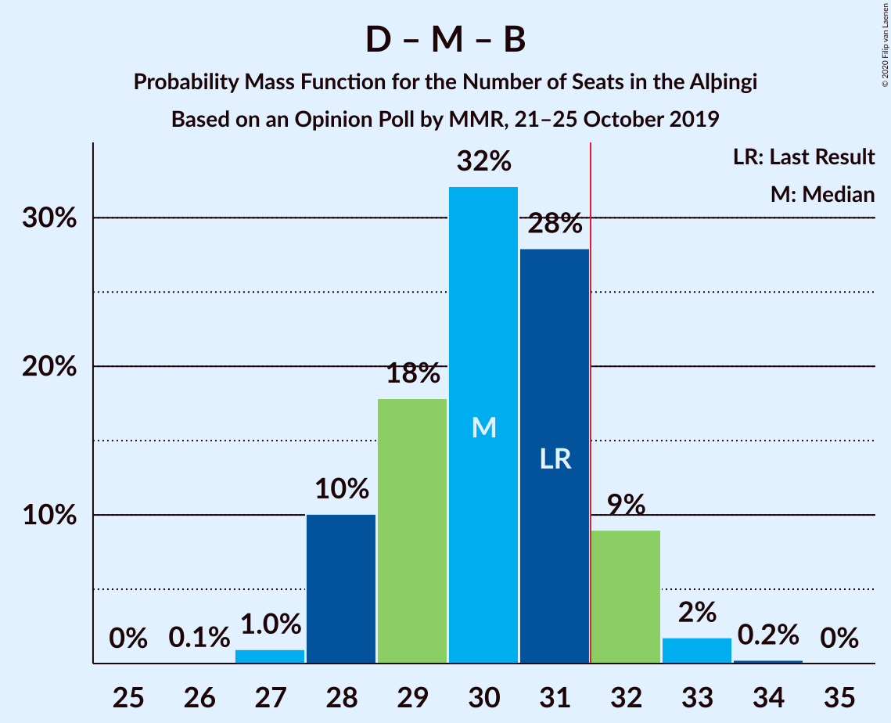

# Opinion Poll by MMR, 21–25 October 2019

<a href="#voting-intentions">Voting Intentions</a> | <a href="#seats">Seats</a> | <a href="#coalitions">Coalitions</a> | <a href="#technical-information">Technical Information</a>

## Voting Intentions

### Confidence Intervals

| Party | Last Result | Poll Result | 80% Confidence Interval | 90% Confidence Interval | 95% Confidence Interval | 99% Confidence Interval |
|:-----:|:-----------:|:-----------:|:-----------------------:|:-----------------------:|:-----------------------:|:-----------------------:|
| Sjálfstæðisflokkurinn | 25.2% | 21.1% | 19.5–22.8% |19.0–23.3% |18.6–23.8% |17.9–24.6% |
| Samfylkingin | 12.1% | 15.3% | 13.9–16.9% |13.5–17.3% |13.2–17.7% |12.6–18.5% |
| Miðflokkurinn | 10.9% | 13.5% | 12.2–15.0% |11.8–15.4% |11.5–15.8% |10.9–16.5% |
| Framsóknarflokkurinn | 10.7% | 10.0% | 8.8–11.3% |8.5–11.7% |8.2–12.0% |7.7–12.7% |
| Viðreisn | 6.7% | 10.0% | 8.8–11.3% |8.5–11.7% |8.2–12.0% |7.7–12.7% |
| Vinstrihreyfingin – grænt framboð | 16.9% | 9.7% | 8.6–11.0% |8.2–11.4% |8.0–11.7% |7.5–12.4% |
| Píratar | 9.2% | 9.0% | 7.9–10.2% |7.6–10.6% |7.3–10.9% |6.8–11.6% |
| Flokkur fólksins | 6.9% | 8.0% | 7.0–9.3% |6.7–9.6% |6.5–9.9% |6.0–10.5% |
| Sósíalistaflokkur Íslands | 0.0% | 2.6% | 2.0–3.4% |1.9–3.6% |1.8–3.8% |1.5–4.2% |

*Note:* The poll result column reflects the actual value used in the calculations. Published results may vary slightly, and in addition be rounded to fewer digits.

## Seats

### Confidence Intervals

| Party | Last Result | Median | 80% Confidence Interval | 90% Confidence Interval | 95% Confidence Interval | 99% Confidence Interval |
|:-----:|:-----------:|:------:|:-----------------------:|:-----------------------:|:-----------------------:|:-----------------------:|
| <a href="#sjálfstæðisflokkurinn">Sjálfstæðisflokkurinn</a> | 16 | 14 | 13–15 |13–15 |13–16 |12–16 |
| <a href="#samfylkingin">Samfylkingin</a> | 7 | 10 | 9–11 |9–11 |9–11 |8–12 |
| <a href="#miðflokkurinn">Miðflokkurinn</a> | 7 | 10 | 9–10 |9–10 |9–10 |7–11 |
| <a href="#framsóknarflokkurinn">Framsóknarflokkurinn</a> | 8 | 6 | 6–8 |5–9 |5–9 |5–10 |
| <a href="#viðreisn">Viðreisn</a> | 4 | 6 | 6–7 |6–7 |5–7 |5–8 |
| <a href="#vinstrihreyfingin-–-grænt-framboð">Vinstrihreyfingin – grænt framboð</a> | 11 | 6 | 6–7 |5–7 |5–7 |5–8 |
| <a href="#píratar">Píratar</a> | 6 | 6 | 5–6 |5–6 |5–7 |4–7 |
| <a href="#flokkur-fólksins">Flokkur fólksins</a> | 4 | 5 | 4–6 |4–6 |4–6 |4–7 |
| <a href="#sósíalistaflokkur-íslands">Sósíalistaflokkur Íslands</a> | 0 | 0 | 0 |0 |0 |0 |

### Sjálfstæðisflokkurinn

*For a full overview of the results for this party, see the [Sjálfstæðisflokkurinn](party-sjálfstæðisflokkurinn.html) page.*

| Number of Seats | Probability | Accumulated | Special Marks |
|:---------------:|:-----------:|:-----------:|:-------------:|
| 11 | 0.4% | 100% |  |
| 12 | 2% | 99.6% |  |
| 13 | 28% | 98% |  |
| 14 | 43% | 70% | Median |
| 15 | 22% | 26% |  |
| 16 | 4% | 5% | Last Result |
| 17 | 0.2% | 0.3% |  |
| 18 | 0.1% | 0.1% |  |
| 19 | 0% | 0% |  |

### Samfylkingin

*For a full overview of the results for this party, see the [Samfylkingin](party-samfylkingin.html) page.*

| Number of Seats | Probability | Accumulated | Special Marks |
|:---------------:|:-----------:|:-----------:|:-------------:|
| 7 | 0% | 100% | Last Result |
| 8 | 2% | 100% |  |
| 9 | 30% | 98% |  |
| 10 | 56% | 68% | Median |
| 11 | 11% | 13% |  |
| 12 | 2% | 2% |  |
| 13 | 0.1% | 0.1% |  |
| 14 | 0% | 0% |  |

### Miðflokkurinn

*For a full overview of the results for this party, see the [Miðflokkurinn](party-miðflokkurinn.html) page.*

| Number of Seats | Probability | Accumulated | Special Marks |
|:---------------:|:-----------:|:-----------:|:-------------:|
| 6 | 0.3% | 100% |  |
| 7 | 0.4% | 99.7% | Last Result |
| 8 | 1.1% | 99.3% |  |
| 9 | 12% | 98% |  |
| 10 | 85% | 86% | Median |
| 11 | 0.7% | 0.9% |  |
| 12 | 0.1% | 0.2% |  |
| 13 | 0.1% | 0.1% |  |
| 14 | 0% | 0% |  |

### Framsóknarflokkurinn

*For a full overview of the results for this party, see the [Framsóknarflokkurinn](party-framsóknarflokkurinn.html) page.*

| Number of Seats | Probability | Accumulated | Special Marks |
|:---------------:|:-----------:|:-----------:|:-------------:|
| 4 | 0.2% | 100% |  |
| 5 | 7% | 99.8% |  |
| 6 | 60% | 93% | Median |
| 7 | 20% | 33% |  |
| 8 | 4% | 13% | Last Result |
| 9 | 6% | 9% |  |
| 10 | 2% | 2% |  |
| 11 | 0% | 0% |  |

### Viðreisn

*For a full overview of the results for this party, see the [Viðreisn](party-viðreisn.html) page.*

| Number of Seats | Probability | Accumulated | Special Marks |
|:---------------:|:-----------:|:-----------:|:-------------:|
| 4 | 0.1% | 100% | Last Result |
| 5 | 5% | 99.9% |  |
| 6 | 61% | 95% | Median |
| 7 | 33% | 34% |  |
| 8 | 1.2% | 1.2% |  |
| 9 | 0% | 0% |  |

### Vinstrihreyfingin – grænt framboð

*For a full overview of the results for this party, see the [Vinstrihreyfingin – grænt framboð](party-vinstrihreyfingin–græntframboð.html) page.*

| Number of Seats | Probability | Accumulated | Special Marks |
|:---------------:|:-----------:|:-----------:|:-------------:|
| 4 | 0.3% | 100% |  |
| 5 | 8% | 99.7% |  |
| 6 | 80% | 92% | Median |
| 7 | 10% | 12% |  |
| 8 | 2% | 2% |  |
| 9 | 0.5% | 0.5% |  |
| 10 | 0% | 0% |  |
| 11 | 0% | 0% | Last Result |

### Píratar

*For a full overview of the results for this party, see the [Píratar](party-píratar.html) page.*

| Number of Seats | Probability | Accumulated | Special Marks |
|:---------------:|:-----------:|:-----------:|:-------------:|
| 4 | 1.0% | 100% |  |
| 5 | 30% | 99.0% |  |
| 6 | 64% | 69% | Last Result, Median |
| 7 | 5% | 5% |  |
| 8 | 0.3% | 0.3% |  |
| 9 | 0% | 0% |  |

### Flokkur fólksins

*For a full overview of the results for this party, see the [Flokkur fólksins](party-flokkurfólksins.html) page.*

| Number of Seats | Probability | Accumulated | Special Marks |
|:---------------:|:-----------:|:-----------:|:-------------:|
| 3 | 0.3% | 100% |  |
| 4 | 39% | 99.7% | Last Result |
| 5 | 46% | 60% | Median |
| 6 | 13% | 14% |  |
| 7 | 1.0% | 1.0% |  |
| 8 | 0% | 0% |  |

### Sósíalistaflokkur Íslands

*For a full overview of the results for this party, see the [Sósíalistaflokkur Íslands](party-sósíalistaflokkuríslands.html) page.*

| Number of Seats | Probability | Accumulated | Special Marks |
|:---------------:|:-----------:|:-----------:|:-------------:|
| 0 | 100% | 100% | Last Result, Median |

## Coalitions

### Confidence Intervals

| Coalition | Last Result | Median | Majority? | 80% Confidence Interval | 90% Confidence Interval | 95% Confidence Interval | 99% Confidence Interval |
|:---------:|:-----------:|:------:|:---------:|:-----------------------:|:-----------------------:|:-----------------------:|:-----------------------:|
| Samfylkingin – Miðflokkurinn – Framsóknarflokkurinn – Vinstrihreyfingin – grænt framboð | 33 | 32 | 85% | 31–34 | 31–34 | 31–35 | 29–35 |
| Sjálfstæðisflokkurinn – Miðflokkurinn – Framsóknarflokkurinn | 31 | 30 | 8% | 29–31 | 29–32 | 28–32 | 28–33 |
| Samfylkingin – Viðreisn – Vinstrihreyfingin – grænt framboð – Píratar | 28 | 28 | 0.1% | 27–29 | 27–30 | 26–30 | 25–30 |
| Sjálfstæðisflokkurinn – Framsóknarflokkurinn – Vinstrihreyfingin – grænt framboð | 35 | 26 | 0% | 25–28 | 25–28 | 24–29 | 24–29 |
| Samfylkingin – Miðflokkurinn – Vinstrihreyfingin – grænt framboð | 25 | 26 | 0% | 25–27 | 25–27 | 24–28 | 23–29 |
| Sjálfstæðisflokkurinn – Miðflokkurinn | 23 | 24 | 0% | 22–25 | 22–25 | 22–26 | 21–26 |
| Sjálfstæðisflokkurinn – Samfylkingin | 23 | 24 | 0% | 22–25 | 22–26 | 22–26 | 21–27 |
| Miðflokkurinn – Framsóknarflokkurinn – Vinstrihreyfingin – grænt framboð | 26 | 22 | 0% | 21–24 | 21–24 | 21–25 | 19–26 |
| Samfylkingin – Framsóknarflokkurinn – Vinstrihreyfingin – grænt framboð | 26 | 22 | 0% | 21–24 | 21–25 | 21–25 | 19–26 |
| Samfylkingin – Vinstrihreyfingin – grænt framboð – Píratar | 24 | 21 | 0% | 21–23 | 21–24 | 20–24 | 19–24 |
| Sjálfstæðisflokkurinn – Framsóknarflokkurinn | 24 | 20 | 0% | 19–22 | 19–22 | 19–23 | 18–23 |
| Sjálfstæðisflokkurinn – Vinstrihreyfingin – grænt framboð | 27 | 20 | 0% | 19–21 | 18–22 | 18–22 | 18–23 |
| Sjálfstæðisflokkurinn – Viðreisn | 20 | 20 | 0% | 19–21 | 19–22 | 18–22 | 18–23 |
| Samfylkingin – Vinstrihreyfingin – grænt framboð | 18 | 16 | 0% | 15–17 | 15–17 | 15–18 | 14–19 |
| Miðflokkurinn – Vinstrihreyfingin – grænt framboð | 18 | 16 | 0% | 15–17 | 15–17 | 15–17 | 13–18 |
| Framsóknarflokkurinn – Vinstrihreyfingin – grænt framboð | 19 | 12 | 0% | 12–15 | 11–15 | 11–16 | 10–16 |
| Vinstrihreyfingin – grænt framboð – Píratar | 17 | 12 | 0% | 11–12 | 11–13 | 11–13 | 10–14 |

### Samfylkingin – Miðflokkurinn – Framsóknarflokkurinn – Vinstrihreyfingin – grænt framboð

| Number of Seats | Probability | Accumulated | Special Marks |
|:---------------:|:-----------:|:-----------:|:-------------:|
| 29 | 0.8% | 100% |  |
| 30 | 1.2% | 99.1% |  |
| 31 | 13% | 98% |  |
| 32 | 61% | 85% | Median, Majority |
| 33 | 11% | 24% | Last Result |
| 34 | 10% | 13% |  |
| 35 | 2% | 3% |  |
| 36 | 0.2% | 0.3% |  |
| 37 | 0% | 0% |  |

### Sjálfstæðisflokkurinn – Miðflokkurinn – Framsóknarflokkurinn

| Number of Seats | Probability | Accumulated | Special Marks |
|:---------------:|:-----------:|:-----------:|:-------------:|
| 26 | 0.1% | 100% |  |
| 27 | 0.2% | 99.9% |  |
| 28 | 2% | 99.7% |  |
| 29 | 16% | 97% |  |
| 30 | 35% | 81% | Median |
| 31 | 38% | 46% | Last Result |
| 32 | 7% | 8% | Majority |
| 33 | 1.0% | 1.2% |  |
| 34 | 0.1% | 0.1% |  |
| 35 | 0% | 0% |  |

### Samfylkingin – Viðreisn – Vinstrihreyfingin – grænt framboð – Píratar

| Number of Seats | Probability | Accumulated | Special Marks |
|:---------------:|:-----------:|:-----------:|:-------------:|
| 24 | 0.2% | 100% |  |
| 25 | 0.8% | 99.8% |  |
| 26 | 2% | 99.0% |  |
| 27 | 24% | 97% |  |
| 28 | 56% | 73% | Last Result, Median |
| 29 | 10% | 16% |  |
| 30 | 6% | 6% |  |
| 31 | 0.3% | 0.5% |  |
| 32 | 0.1% | 0.1% | Majority |
| 33 | 0% | 0% |  |

### Sjálfstæðisflokkurinn – Framsóknarflokkurinn – Vinstrihreyfingin – grænt framboð

| Number of Seats | Probability | Accumulated | Special Marks |
|:---------------:|:-----------:|:-----------:|:-------------:|
| 23 | 0.2% | 100% |  |
| 24 | 5% | 99.8% |  |
| 25 | 10% | 95% |  |
| 26 | 35% | 85% | Median |
| 27 | 30% | 50% |  |
| 28 | 15% | 20% |  |
| 29 | 5% | 5% |  |
| 30 | 0.3% | 0.3% |  |
| 31 | 0% | 0% |  |
| 32 | 0% | 0% | Majority |
| 33 | 0% | 0% |  |
| 34 | 0% | 0% |  |
| 35 | 0% | 0% | Last Result |

### Samfylkingin – Miðflokkurinn – Vinstrihreyfingin – grænt framboð

| Number of Seats | Probability | Accumulated | Special Marks |
|:---------------:|:-----------:|:-----------:|:-------------:|
| 22 | 0.3% | 100% |  |
| 23 | 1.1% | 99.7% |  |
| 24 | 3% | 98.6% |  |
| 25 | 36% | 96% | Last Result |
| 26 | 48% | 60% | Median |
| 27 | 9% | 12% |  |
| 28 | 2% | 4% |  |
| 29 | 1.2% | 1.2% |  |
| 30 | 0% | 0% |  |

### Sjálfstæðisflokkurinn – Miðflokkurinn

| Number of Seats | Probability | Accumulated | Special Marks |
|:---------------:|:-----------:|:-----------:|:-------------:|
| 20 | 0.2% | 100% |  |
| 21 | 1.3% | 99.8% |  |
| 22 | 11% | 98% |  |
| 23 | 20% | 88% | Last Result |
| 24 | 43% | 68% | Median |
| 25 | 21% | 25% |  |
| 26 | 4% | 4% |  |
| 27 | 0.1% | 0.2% |  |
| 28 | 0.1% | 0.1% |  |
| 29 | 0% | 0% |  |

### Sjálfstæðisflokkurinn – Samfylkingin

| Number of Seats | Probability | Accumulated | Special Marks |
|:---------------:|:-----------:|:-----------:|:-------------:|
| 20 | 0.1% | 100% |  |
| 21 | 1.0% | 99.9% |  |
| 22 | 11% | 98.9% |  |
| 23 | 30% | 88% | Last Result |
| 24 | 31% | 59% | Median |
| 25 | 21% | 27% |  |
| 26 | 5% | 6% |  |
| 27 | 0.6% | 0.6% |  |
| 28 | 0% | 0.1% |  |
| 29 | 0% | 0% |  |

### Miðflokkurinn – Framsóknarflokkurinn – Vinstrihreyfingin – grænt framboð

| Number of Seats | Probability | Accumulated | Special Marks |
|:---------------:|:-----------:|:-----------:|:-------------:|
| 19 | 0.5% | 100% |  |
| 20 | 1.1% | 99.5% |  |
| 21 | 9% | 98% |  |
| 22 | 52% | 89% | Median |
| 23 | 24% | 37% |  |
| 24 | 10% | 13% |  |
| 25 | 2% | 3% |  |
| 26 | 0.7% | 0.7% | Last Result |
| 27 | 0% | 0% |  |

### Samfylkingin – Framsóknarflokkurinn – Vinstrihreyfingin – grænt framboð

| Number of Seats | Probability | Accumulated | Special Marks |
|:---------------:|:-----------:|:-----------:|:-------------:|
| 19 | 0.5% | 100% |  |
| 20 | 0.8% | 99.5% |  |
| 21 | 12% | 98.7% |  |
| 22 | 61% | 86% | Median |
| 23 | 10% | 26% |  |
| 24 | 6% | 15% |  |
| 25 | 8% | 10% |  |
| 26 | 2% | 2% | Last Result |
| 27 | 0% | 0% |  |

### Samfylkingin – Vinstrihreyfingin – grænt framboð – Píratar

| Number of Seats | Probability | Accumulated | Special Marks |
|:---------------:|:-----------:|:-----------:|:-------------:|
| 18 | 0.2% | 100% |  |
| 19 | 1.0% | 99.8% |  |
| 20 | 3% | 98.8% |  |
| 21 | 46% | 96% |  |
| 22 | 39% | 50% | Median |
| 23 | 6% | 11% |  |
| 24 | 5% | 5% | Last Result |
| 25 | 0.2% | 0.2% |  |
| 26 | 0% | 0% |  |

### Sjálfstæðisflokkurinn – Framsóknarflokkurinn

| Number of Seats | Probability | Accumulated | Special Marks |
|:---------------:|:-----------:|:-----------:|:-------------:|
| 17 | 0.1% | 100% |  |
| 18 | 2% | 99.9% |  |
| 19 | 15% | 98% |  |
| 20 | 35% | 83% | Median |
| 21 | 33% | 48% |  |
| 22 | 11% | 15% |  |
| 23 | 4% | 4% |  |
| 24 | 0.4% | 0.4% | Last Result |
| 25 | 0% | 0% |  |

### Sjálfstæðisflokkurinn – Vinstrihreyfingin – grænt framboð

| Number of Seats | Probability | Accumulated | Special Marks |
|:---------------:|:-----------:|:-----------:|:-------------:|
| 17 | 0.3% | 100% |  |
| 18 | 6% | 99.7% |  |
| 19 | 23% | 94% |  |
| 20 | 40% | 71% | Median |
| 21 | 23% | 31% |  |
| 22 | 7% | 8% |  |
| 23 | 0.7% | 0.9% |  |
| 24 | 0.2% | 0.2% |  |
| 25 | 0% | 0% |  |
| 26 | 0% | 0% |  |
| 27 | 0% | 0% | Last Result |

### Sjálfstæðisflokkurinn – Viðreisn

| Number of Seats | Probability | Accumulated | Special Marks |
|:---------------:|:-----------:|:-----------:|:-------------:|
| 17 | 0.4% | 100% |  |
| 18 | 3% | 99.5% |  |
| 19 | 15% | 97% |  |
| 20 | 41% | 82% | Last Result, Median |
| 21 | 32% | 41% |  |
| 22 | 6% | 8% |  |
| 23 | 2% | 2% |  |
| 24 | 0.1% | 0.1% |  |
| 25 | 0% | 0% |  |

### Samfylkingin – Vinstrihreyfingin – grænt framboð

| Number of Seats | Probability | Accumulated | Special Marks |
|:---------------:|:-----------:|:-----------:|:-------------:|
| 13 | 0.3% | 100% |  |
| 14 | 2% | 99.7% |  |
| 15 | 28% | 98% |  |
| 16 | 56% | 70% | Median |
| 17 | 9% | 14% |  |
| 18 | 3% | 5% | Last Result |
| 19 | 1.2% | 1.3% |  |
| 20 | 0% | 0% |  |

### Miðflokkurinn – Vinstrihreyfingin – grænt framboð

| Number of Seats | Probability | Accumulated | Special Marks |
|:---------------:|:-----------:|:-----------:|:-------------:|
| 12 | 0.3% | 100% |  |
| 13 | 0.3% | 99.7% |  |
| 14 | 1.2% | 99.3% |  |
| 15 | 17% | 98% |  |
| 16 | 70% | 81% | Median |
| 17 | 10% | 11% |  |
| 18 | 1.2% | 1.2% | Last Result |
| 19 | 0.1% | 0.1% |  |
| 20 | 0% | 0% |  |

### Framsóknarflokkurinn – Vinstrihreyfingin – grænt framboð

| Number of Seats | Probability | Accumulated | Special Marks |
|:---------------:|:-----------:|:-----------:|:-------------:|
| 10 | 0.7% | 100% |  |
| 11 | 9% | 99.3% |  |
| 12 | 52% | 90% | Median |
| 13 | 23% | 38% |  |
| 14 | 5% | 15% |  |
| 15 | 7% | 10% |  |
| 16 | 3% | 3% |  |
| 17 | 0% | 0% |  |
| 18 | 0% | 0% |  |
| 19 | 0% | 0% | Last Result |

### Vinstrihreyfingin – grænt framboð – Píratar

| Number of Seats | Probability | Accumulated | Special Marks |
|:---------------:|:-----------:|:-----------:|:-------------:|
| 9 | 0.3% | 100% |  |
| 10 | 2% | 99.7% |  |
| 11 | 27% | 98% |  |
| 12 | 62% | 71% | Median |
| 13 | 8% | 9% |  |
| 14 | 1.5% | 2% |  |
| 15 | 0% | 0% |  |
| 16 | 0% | 0% |  |
| 17 | 0% | 0% | Last Result |

## Technical Information

### Opinion Poll

+ **Polling firm:** MMR
+ **Commissioner(s):** —
+ **Fieldwork period:** 21–25 October 2019

### Calculations

+ **Sample size:** 972
+ **Simulations done:** 131,072
+ **Error estimate:** 2.15%

