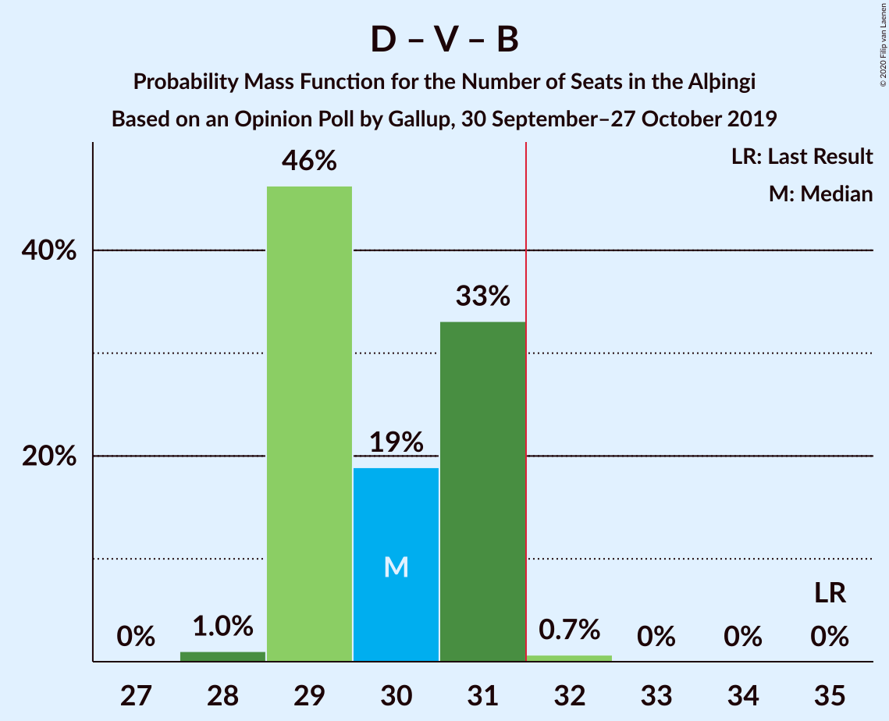

# Opinion Poll by Gallup, 30 September–27 October 2019

<a href="#voting-intentions">Voting Intentions</a> | <a href="#seats">Seats</a> | <a href="#coalitions">Coalitions</a> | <a href="#technical-information">Technical Information</a>

## Voting Intentions

### Confidence Intervals

| Party | Last Result | Poll Result | 80% Confidence Interval | 90% Confidence Interval | 95% Confidence Interval | 99% Confidence Interval |
|:-----:|:-----------:|:-----------:|:-----------------------:|:-----------------------:|:-----------------------:|:-----------------------:|
| Sjálfstæðisflokkurinn | 25.2% | 22.8% | 22.1–23.5% |21.8–23.7% |21.7–23.9% |21.3–24.3% |
| Samfylkingin | 12.1% | 17.4% | 16.7–18.0% |16.5–18.2% |16.4–18.4% |16.1–18.7% |
| Vinstrihreyfingin – grænt framboð | 16.9% | 13.4% | 12.9–14.1% |12.7–14.2% |12.6–14.4% |12.3–14.7% |
| Miðflokkurinn | 10.9% | 11.5% | 11.0–12.1% |10.8–12.3% |10.7–12.4% |10.5–12.7% |
| Viðreisn | 6.7% | 10.3% | 9.8–10.9% |9.7–11.1% |9.5–11.2% |9.3–11.5% |
| Píratar | 9.2% | 9.0% | 8.6–9.6% |8.4–9.7% |8.3–9.8% |8.1–10.1% |
| Framsóknarflokkurinn | 10.7% | 8.2% | 7.8–8.7% |7.6–8.9% |7.5–9.0% |7.3–9.2% |
| Flokkur fólksins | 6.9% | 4.6% | 4.3–5.0% |4.2–5.1% |4.1–5.2% |3.9–5.4% |
| Sósíalistaflokkur Íslands | 0.0% | 2.6% | 2.3–2.9% |2.3–3.0% |2.2–3.1% |2.1–3.2% |

*Note:* The poll result column reflects the actual value used in the calculations. Published results may vary slightly, and in addition be rounded to fewer digits.

## Seats

### Confidence Intervals

| Party | Last Result | Median | 80% Confidence Interval | 90% Confidence Interval | 95% Confidence Interval | 99% Confidence Interval |
|:-----:|:-----------:|:------:|:-----------------------:|:-----------------------:|:-----------------------:|:-----------------------:|
| <a href="#sjálfstæðisflokkurinn">Sjálfstæðisflokkurinn</a> | 16 | 15 | 15–16 |15–16 |14–16 |14–17 |
| <a href="#samfylkingin">Samfylkingin</a> | 7 | 12 | 11–12 |11–12 |10–12 |10–13 |
| <a href="#vinstrihreyfingin-–-grænt-framboð">Vinstrihreyfingin – grænt framboð</a> | 11 | 9 | 9–10 |9–10 |9–10 |8–10 |
| <a href="#miðflokkurinn">Miðflokkurinn</a> | 7 | 9 | 8–9 |8–9 |7–9 |7–9 |
| <a href="#viðreisn">Viðreisn</a> | 4 | 7 | 6–7 |6–7 |6–7 |6–7 |
| <a href="#píratar">Píratar</a> | 6 | 6 | 5–6 |5–6 |5–6 |5–7 |
| <a href="#framsóknarflokkurinn">Framsóknarflokkurinn</a> | 8 | 5 | 5–6 |5–6 |5–6 |4–6 |
| <a href="#flokkur-fólksins">Flokkur fólksins</a> | 4 | 0 | 0–3 |0–3 |0–3 |0–3 |
| <a href="#sósíalistaflokkur-íslands">Sósíalistaflokkur Íslands</a> | 0 | 0 | 0 |0 |0 |0 |

### Sjálfstæðisflokkurinn

*For a full overview of the results for this party, see the [Sjálfstæðisflokkurinn](party-sjálfstæðisflokkurinn.html) page.*

| Number of Seats | Probability | Accumulated | Special Marks |
|:---------------:|:-----------:|:-----------:|:-------------:|
| 14 | 4% | 100% |  |
| 15 | 66% | 96% | Median |
| 16 | 30% | 30% | Last Result |
| 17 | 0.8% | 0.8% |  |
| 18 | 0% | 0% |  |

### Samfylkingin

*For a full overview of the results for this party, see the [Samfylkingin](party-samfylkingin.html) page.*

| Number of Seats | Probability | Accumulated | Special Marks |
|:---------------:|:-----------:|:-----------:|:-------------:|
| 7 | 0% | 100% | Last Result |
| 8 | 0% | 100% |  |
| 9 | 0% | 100% |  |
| 10 | 4% | 100% |  |
| 11 | 45% | 96% |  |
| 12 | 50% | 50% | Median |
| 13 | 0.5% | 0.5% |  |
| 14 | 0% | 0% |  |

### Vinstrihreyfingin – grænt framboð

*For a full overview of the results for this party, see the [Vinstrihreyfingin – grænt framboð](party-vinstrihreyfingin–græntframboð.html) page.*

| Number of Seats | Probability | Accumulated | Special Marks |
|:---------------:|:-----------:|:-----------:|:-------------:|
| 8 | 2% | 100% |  |
| 9 | 56% | 98% | Median |
| 10 | 41% | 41% |  |
| 11 | 0% | 0% | Last Result |

### Miðflokkurinn

*For a full overview of the results for this party, see the [Miðflokkurinn](party-miðflokkurinn.html) page.*

| Number of Seats | Probability | Accumulated | Special Marks |
|:---------------:|:-----------:|:-----------:|:-------------:|
| 6 | 0.2% | 100% |  |
| 7 | 3% | 99.8% | Last Result |
| 8 | 12% | 97% |  |
| 9 | 85% | 85% | Median |
| 10 | 0% | 0% |  |

### Viðreisn

*For a full overview of the results for this party, see the [Viðreisn](party-viðreisn.html) page.*

| Number of Seats | Probability | Accumulated | Special Marks |
|:---------------:|:-----------:|:-----------:|:-------------:|
| 4 | 0% | 100% | Last Result |
| 5 | 0% | 100% |  |
| 6 | 24% | 100% |  |
| 7 | 76% | 76% | Median |
| 8 | 0.3% | 0.3% |  |
| 9 | 0% | 0% |  |

### Píratar

*For a full overview of the results for this party, see the [Píratar](party-píratar.html) page.*

| Number of Seats | Probability | Accumulated | Special Marks |
|:---------------:|:-----------:|:-----------:|:-------------:|
| 5 | 24% | 100% |  |
| 6 | 75% | 76% | Last Result, Median |
| 7 | 1.2% | 1.2% |  |
| 8 | 0% | 0% |  |

### Framsóknarflokkurinn

*For a full overview of the results for this party, see the [Framsóknarflokkurinn](party-framsóknarflokkurinn.html) page.*

| Number of Seats | Probability | Accumulated | Special Marks |
|:---------------:|:-----------:|:-----------:|:-------------:|
| 4 | 2% | 100% |  |
| 5 | 78% | 98% | Median |
| 6 | 21% | 21% |  |
| 7 | 0% | 0% |  |
| 8 | 0% | 0% | Last Result |

### Flokkur fólksins

*For a full overview of the results for this party, see the [Flokkur fólksins](party-flokkurfólksins.html) page.*

| Number of Seats | Probability | Accumulated | Special Marks |
|:---------------:|:-----------:|:-----------:|:-------------:|
| 0 | 90% | 100% | Median |
| 1 | 0% | 10% |  |
| 2 | 0% | 10% |  |
| 3 | 10% | 10% |  |
| 4 | 0% | 0% | Last Result |

### Sósíalistaflokkur Íslands

*For a full overview of the results for this party, see the [Sósíalistaflokkur Íslands](party-sósíalistaflokkuríslands.html) page.*

| Number of Seats | Probability | Accumulated | Special Marks |
|:---------------:|:-----------:|:-----------:|:-------------:|
| 0 | 100% | 100% | Last Result, Median |

## Coalitions

### Confidence Intervals

| Coalition | Last Result | Median | Majority? | 80% Confidence Interval | 90% Confidence Interval | 95% Confidence Interval | 99% Confidence Interval |
|:---------:|:-----------:|:------:|:---------:|:-----------------------:|:-----------------------:|:-----------------------:|:-----------------------:|
| Samfylkingin – Vinstrihreyfingin – grænt framboð – Miðflokkurinn – Framsóknarflokkurinn | 33 | 35 | 100% | 34–35 | 33–36 | 33–36 | 33–37 |
| Samfylkingin – Vinstrihreyfingin – grænt framboð – Viðreisn – Píratar | 28 | 34 | 94% | 32–34 | 31–34 | 31–34 | 31–35 |
| Sjálfstæðisflokkurinn – Vinstrihreyfingin – grænt framboð – Framsóknarflokkurinn | 35 | 30 | 0.7% | 29–31 | 29–31 | 29–31 | 28–32 |
| Sjálfstæðisflokkurinn – Miðflokkurinn – Framsóknarflokkurinn | 31 | 29 | 0.1% | 29–30 | 28–30 | 28–31 | 28–31 |
| Samfylkingin – Vinstrihreyfingin – grænt framboð – Miðflokkurinn | 25 | 30 | 0% | 29–30 | 28–30 | 28–31 | 27–31 |
| Sjálfstæðisflokkurinn – Samfylkingin | 23 | 27 | 0% | 26–27 | 25–28 | 25–28 | 25–29 |
| Samfylkingin – Vinstrihreyfingin – grænt framboð – Framsóknarflokkurinn | 26 | 26 | 0% | 25–27 | 25–27 | 24–28 | 24–28 |
| Samfylkingin – Vinstrihreyfingin – grænt framboð – Píratar | 24 | 27 | 0% | 26–27 | 25–27 | 24–28 | 24–28 |
| Sjálfstæðisflokkurinn – Vinstrihreyfingin – grænt framboð | 27 | 24 | 0% | 24–26 | 24–26 | 24–26 | 23–26 |
| Sjálfstæðisflokkurinn – Miðflokkurinn | 23 | 24 | 0% | 23–25 | 23–25 | 23–25 | 22–25 |
| Vinstrihreyfingin – grænt framboð – Miðflokkurinn – Framsóknarflokkurinn | 26 | 23 | 0% | 23–24 | 22–24 | 22–25 | 21–25 |
| Sjálfstæðisflokkurinn – Viðreisn | 20 | 22 | 0% | 22–23 | 21–23 | 21–23 | 20–24 |
| Sjálfstæðisflokkurinn – Framsóknarflokkurinn | 24 | 20 | 0% | 20–21 | 20–22 | 20–22 | 19–22 |
| Samfylkingin – Vinstrihreyfingin – grænt framboð | 18 | 21 | 0% | 20–21 | 20–22 | 19–22 | 19–22 |
| Vinstrihreyfingin – grænt framboð – Miðflokkurinn | 18 | 18 | 0% | 18–19 | 17–19 | 17–19 | 16–19 |
| Vinstrihreyfingin – grænt framboð – Píratar | 17 | 15 | 0% | 14–16 | 14–16 | 14–16 | 13–16 |
| Vinstrihreyfingin – grænt framboð – Framsóknarflokkurinn | 19 | 14 | 0% | 14–16 | 14–16 | 13–16 | 13–16 |

### Samfylkingin – Vinstrihreyfingin – grænt framboð – Miðflokkurinn – Framsóknarflokkurinn

| Number of Seats | Probability | Accumulated | Special Marks |
|:---------------:|:-----------:|:-----------:|:-------------:|
| 32 | 0.3% | 100% | Majority |
| 33 | 8% | 99.7% | Last Result |
| 34 | 6% | 92% |  |
| 35 | 76% | 85% | Median |
| 36 | 8% | 10% |  |
| 37 | 1.5% | 1.5% |  |
| 38 | 0% | 0% |  |

### Samfylkingin – Vinstrihreyfingin – grænt framboð – Viðreisn – Píratar

| Number of Seats | Probability | Accumulated | Special Marks |
|:---------------:|:-----------:|:-----------:|:-------------:|
| 28 | 0% | 100% | Last Result |
| 29 | 0% | 100% |  |
| 30 | 0.3% | 100% |  |
| 31 | 5% | 99.7% |  |
| 32 | 7% | 94% | Majority |
| 33 | 30% | 87% |  |
| 34 | 54% | 57% | Median |
| 35 | 2% | 2% |  |
| 36 | 0% | 0% |  |

### Sjálfstæðisflokkurinn – Vinstrihreyfingin – grænt framboð – Framsóknarflokkurinn

| Number of Seats | Probability | Accumulated | Special Marks |
|:---------------:|:-----------:|:-----------:|:-------------:|
| 28 | 1.0% | 100% |  |
| 29 | 46% | 99.0% | Median |
| 30 | 19% | 53% |  |
| 31 | 33% | 34% |  |
| 32 | 0.7% | 0.7% | Majority |
| 33 | 0% | 0% |  |
| 34 | 0% | 0% |  |
| 35 | 0% | 0% | Last Result |

### Sjálfstæðisflokkurinn – Miðflokkurinn – Framsóknarflokkurinn

| Number of Seats | Probability | Accumulated | Special Marks |
|:---------------:|:-----------:|:-----------:|:-------------:|
| 26 | 0.1% | 100% |  |
| 27 | 0.4% | 99.9% |  |
| 28 | 6% | 99.5% |  |
| 29 | 60% | 93% | Median |
| 30 | 30% | 34% |  |
| 31 | 3% | 3% | Last Result |
| 32 | 0.1% | 0.1% | Majority |
| 33 | 0% | 0% |  |

### Samfylkingin – Vinstrihreyfingin – grænt framboð – Miðflokkurinn

| Number of Seats | Probability | Accumulated | Special Marks |
|:---------------:|:-----------:|:-----------:|:-------------:|
| 25 | 0% | 100% | Last Result |
| 26 | 0% | 100% |  |
| 27 | 0.6% | 100% |  |
| 28 | 9% | 99.4% |  |
| 29 | 15% | 91% |  |
| 30 | 72% | 75% | Median |
| 31 | 3% | 3% |  |
| 32 | 0% | 0% | Majority |

### Sjálfstæðisflokkurinn – Samfylkingin

| Number of Seats | Probability | Accumulated | Special Marks |
|:---------------:|:-----------:|:-----------:|:-------------:|
| 23 | 0% | 100% | Last Result |
| 24 | 0% | 100% |  |
| 25 | 5% | 100% |  |
| 26 | 25% | 95% |  |
| 27 | 61% | 70% | Median |
| 28 | 9% | 9% |  |
| 29 | 0.6% | 0.6% |  |
| 30 | 0% | 0% |  |

### Samfylkingin – Vinstrihreyfingin – grænt framboð – Framsóknarflokkurinn

| Number of Seats | Probability | Accumulated | Special Marks |
|:---------------:|:-----------:|:-----------:|:-------------:|
| 24 | 4% | 100% |  |
| 25 | 8% | 96% |  |
| 26 | 69% | 88% | Last Result, Median |
| 27 | 16% | 19% |  |
| 28 | 3% | 3% |  |
| 29 | 0% | 0% |  |

### Samfylkingin – Vinstrihreyfingin – grænt framboð – Píratar

| Number of Seats | Probability | Accumulated | Special Marks |
|:---------------:|:-----------:|:-----------:|:-------------:|
| 24 | 4% | 100% | Last Result |
| 25 | 6% | 96% |  |
| 26 | 19% | 91% |  |
| 27 | 67% | 71% | Median |
| 28 | 5% | 5% |  |
| 29 | 0.1% | 0.1% |  |
| 30 | 0% | 0% |  |

### Sjálfstæðisflokkurinn – Vinstrihreyfingin – grænt framboð

| Number of Seats | Probability | Accumulated | Special Marks |
|:---------------:|:-----------:|:-----------:|:-------------:|
| 23 | 1.1% | 100% |  |
| 24 | 52% | 98.9% | Median |
| 25 | 25% | 47% |  |
| 26 | 21% | 21% |  |
| 27 | 0.1% | 0.1% | Last Result |
| 28 | 0% | 0% |  |

### Sjálfstæðisflokkurinn – Miðflokkurinn

| Number of Seats | Probability | Accumulated | Special Marks |
|:---------------:|:-----------:|:-----------:|:-------------:|
| 21 | 0.1% | 100% |  |
| 22 | 1.2% | 99.9% |  |
| 23 | 15% | 98.8% | Last Result |
| 24 | 56% | 84% | Median |
| 25 | 27% | 28% |  |
| 26 | 0.3% | 0.3% |  |
| 27 | 0% | 0% |  |

### Vinstrihreyfingin – grænt framboð – Miðflokkurinn – Framsóknarflokkurinn

| Number of Seats | Probability | Accumulated | Special Marks |
|:---------------:|:-----------:|:-----------:|:-------------:|
| 20 | 0.3% | 100% |  |
| 21 | 0.2% | 99.7% |  |
| 22 | 8% | 99.5% |  |
| 23 | 45% | 92% | Median |
| 24 | 43% | 46% |  |
| 25 | 3% | 3% |  |
| 26 | 0% | 0% | Last Result |

### Sjálfstæðisflokkurinn – Viðreisn

| Number of Seats | Probability | Accumulated | Special Marks |
|:---------------:|:-----------:|:-----------:|:-------------:|
| 20 | 2% | 100% | Last Result |
| 21 | 7% | 98% |  |
| 22 | 77% | 91% | Median |
| 23 | 14% | 14% |  |
| 24 | 0.6% | 0.6% |  |
| 25 | 0% | 0% |  |

### Sjálfstæðisflokkurinn – Framsóknarflokkurinn

| Number of Seats | Probability | Accumulated | Special Marks |
|:---------------:|:-----------:|:-----------:|:-------------:|
| 19 | 2% | 100% |  |
| 20 | 55% | 98% | Median |
| 21 | 39% | 44% |  |
| 22 | 5% | 5% |  |
| 23 | 0.3% | 0.3% |  |
| 24 | 0% | 0% | Last Result |

### Samfylkingin – Vinstrihreyfingin – grænt framboð

| Number of Seats | Probability | Accumulated | Special Marks |
|:---------------:|:-----------:|:-----------:|:-------------:|
| 18 | 0% | 100% | Last Result |
| 19 | 4% | 100% |  |
| 20 | 11% | 96% |  |
| 21 | 80% | 85% | Median |
| 22 | 5% | 5% |  |
| 23 | 0.1% | 0.1% |  |
| 24 | 0% | 0% |  |

### Vinstrihreyfingin – grænt framboð – Miðflokkurinn

| Number of Seats | Probability | Accumulated | Special Marks |
|:---------------:|:-----------:|:-----------:|:-------------:|
| 15 | 0.3% | 100% |  |
| 16 | 1.2% | 99.7% |  |
| 17 | 7% | 98% |  |
| 18 | 59% | 91% | Last Result, Median |
| 19 | 32% | 32% |  |
| 20 | 0% | 0% |  |

### Vinstrihreyfingin – grænt framboð – Píratar

| Number of Seats | Probability | Accumulated | Special Marks |
|:---------------:|:-----------:|:-----------:|:-------------:|
| 13 | 0.7% | 100% |  |
| 14 | 15% | 99.3% |  |
| 15 | 52% | 84% | Median |
| 16 | 33% | 33% |  |
| 17 | 0% | 0% | Last Result |

### Vinstrihreyfingin – grænt framboð – Framsóknarflokkurinn

| Number of Seats | Probability | Accumulated | Special Marks |
|:---------------:|:-----------:|:-----------:|:-------------:|
| 13 | 3% | 100% |  |
| 14 | 48% | 97% | Median |
| 15 | 38% | 50% |  |
| 16 | 12% | 12% |  |
| 17 | 0% | 0% |  |
| 18 | 0% | 0% |  |
| 19 | 0% | 0% | Last Result |

## Technical Information

### Opinion Poll

+ **Polling firm:** Gallup
+ **Commissioner(s):** —
+ **Fieldwork period:** 30 September–27 October 2019

### Calculations

+ **Sample size:** 5242
+ **Simulations done:** 1,048,576
+ **Error estimate:** 0.53%

