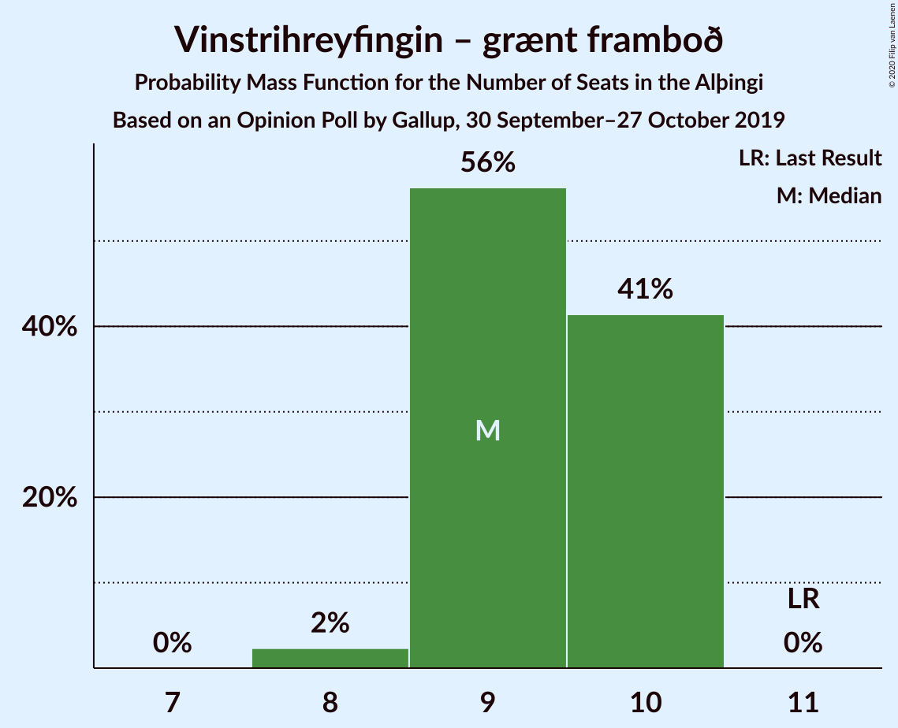
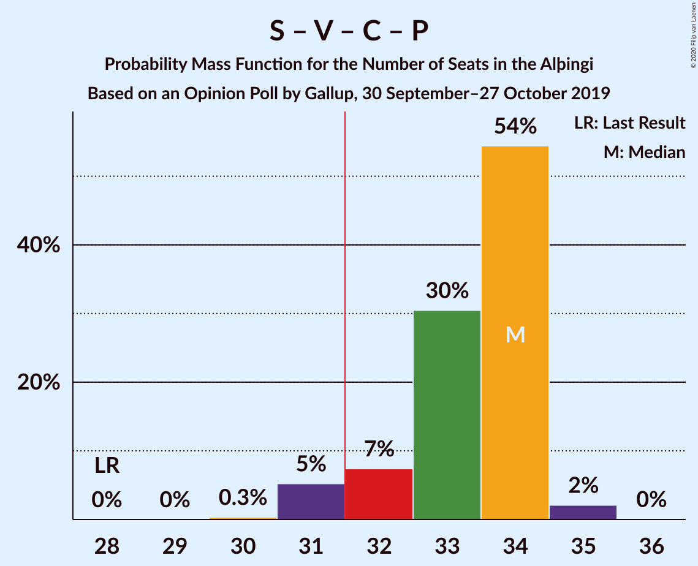
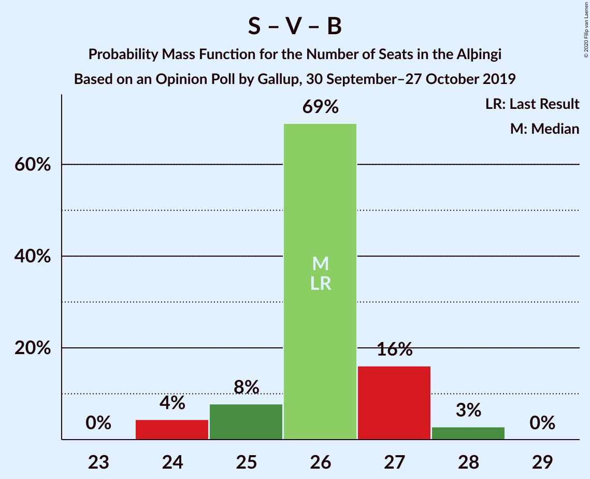

# Opinion Poll by Gallup, 30 September–27 October 2019

<a href="#voting-intentions">Voting Intentions</a> | <a href="#seats">Seats</a> | <a href="#coalitions">Coalitions</a> | <a href="#technical-information">Technical Information</a>

## Voting Intentions

### Confidence Intervals

| Party | Last Result | Poll Result | 80% Confidence Interval | 90% Confidence Interval | 95% Confidence Interval | 99% Confidence Interval |
|:-----:|:-----------:|:-----------:|:-----------------------:|:-----------------------:|:-----------------------:|:-----------------------:|
| Sjálfstæðisflokkurinn | 25.2% | 22.8% | 22.1–23.5% |21.8–23.7% |21.7–23.9% |21.3–24.3% |
| Samfylkingin | 12.1% | 17.4% | 16.7–18.0% |16.5–18.2% |16.4–18.4% |16.1–18.7% |
| Vinstrihreyfingin – grænt framboð | 16.9% | 13.4% | 12.9–14.1% |12.7–14.2% |12.6–14.4% |12.3–14.7% |
| Miðflokkurinn | 10.9% | 11.5% | 11.0–12.1% |10.8–12.3% |10.7–12.4% |10.5–12.7% |
| Viðreisn | 6.7% | 10.3% | 9.8–10.9% |9.7–11.1% |9.5–11.2% |9.3–11.5% |
| Píratar | 9.2% | 9.0% | 8.6–9.6% |8.4–9.7% |8.3–9.8% |8.1–10.1% |
| Framsóknarflokkurinn | 10.7% | 8.2% | 7.8–8.7% |7.6–8.9% |7.5–9.0% |7.3–9.2% |
| Flokkur fólksins | 6.9% | 4.6% | 4.3–5.0% |4.2–5.1% |4.1–5.2% |3.9–5.4% |
| Sósíalistaflokkur Íslands | 0.0% | 2.6% | 2.3–2.9% |2.3–3.0% |2.2–3.1% |2.1–3.2% |

*Note:* The poll result column reflects the actual value used in the calculations. Published results may vary slightly, and in addition be rounded to fewer digits.

## Seats

### Confidence Intervals

| Party | Last Result | Median | 80% Confidence Interval | 90% Confidence Interval | 95% Confidence Interval | 99% Confidence Interval |
|:-----:|:-----------:|:------:|:-----------------------:|:-----------------------:|:-----------------------:|:-----------------------:|
| <a href="#sjálfstæðisflokkurinn">Sjálfstæðisflokkurinn</a> | 16 | 15 | 15–17 |15–17 |14–17 |14–17 |
| <a href="#samfylkingin">Samfylkingin</a> | 7 | 13 | 11–13 |11–13 |11–14 |11–14 |
| <a href="#vinstrihreyfingin-–-grænt-framboð">Vinstrihreyfingin – grænt framboð</a> | 11 | 9 | 9–10 |9–10 |9–10 |8–10 |
| <a href="#miðflokkurinn">Miðflokkurinn</a> | 7 | 7 | 7–9 |7–9 |7–9 |7–10 |
| <a href="#viðreisn">Viðreisn</a> | 4 | 6 | 6–7 |6–7 |6–7 |6–7 |
| <a href="#píratar">Píratar</a> | 6 | 7 | 5–7 |5–7 |5–7 |5–7 |
| <a href="#framsóknarflokkurinn">Framsóknarflokkurinn</a> | 8 | 6 | 5–6 |5–6 |4–6 |4–6 |
| <a href="#flokkur-fólksins">Flokkur fólksins</a> | 4 | 0 | 0 |0 |0–3 |0–3 |
| <a href="#sósíalistaflokkur-íslands">Sósíalistaflokkur Íslands</a> | 0 | 0 | 0 |0 |0 |0 |

### Sjálfstæðisflokkurinn

*For a full overview of the results for this party, see the [Sjálfstæðisflokkurinn](party-sjálfstæðisflokkurinn.html) page.*

| Number of Seats | Probability | Accumulated | Special Marks |
|:---------------:|:-----------:|:-----------:|:-------------:|
| 13 | 0.3% | 100% |  |
| 14 | 3% | 99.7% |  |
| 15 | 58% | 97% | Median |
| 16 | 21% | 40% | Last Result |
| 17 | 19% | 19% |  |
| 18 | 0% | 0% |  |

### Samfylkingin

*For a full overview of the results for this party, see the [Samfylkingin](party-samfylkingin.html) page.*

| Number of Seats | Probability | Accumulated | Special Marks |
|:---------------:|:-----------:|:-----------:|:-------------:|
| 7 | 0% | 100% | Last Result |
| 8 | 0% | 100% |  |
| 9 | 0% | 100% |  |
| 10 | 0% | 100% |  |
| 11 | 25% | 100% |  |
| 12 | 2% | 75% |  |
| 13 | 69% | 73% | Median |
| 14 | 4% | 4% |  |
| 15 | 0% | 0% |  |

### Vinstrihreyfingin – grænt framboð

*For a full overview of the results for this party, see the [Vinstrihreyfingin – grænt framboð](party-vinstrihreyfingin–græntframboð.html) page.*

| Number of Seats | Probability | Accumulated | Special Marks |
|:---------------:|:-----------:|:-----------:|:-------------:|
| 8 | 2% | 100% |  |
| 9 | 74% | 98% | Median |
| 10 | 24% | 24% |  |
| 11 | 0% | 0% | Last Result |

### Miðflokkurinn

*For a full overview of the results for this party, see the [Miðflokkurinn](party-miðflokkurinn.html) page.*

| Number of Seats | Probability | Accumulated | Special Marks |
|:---------------:|:-----------:|:-----------:|:-------------:|
| 7 | 78% | 100% | Last Result, Median |
| 8 | 2% | 22% |  |
| 9 | 18% | 20% |  |
| 10 | 2% | 2% |  |
| 11 | 0% | 0% |  |

### Viðreisn

*For a full overview of the results for this party, see the [Viðreisn](party-viðreisn.html) page.*

| Number of Seats | Probability | Accumulated | Special Marks |
|:---------------:|:-----------:|:-----------:|:-------------:|
| 4 | 0% | 100% | Last Result |
| 5 | 0% | 100% |  |
| 6 | 88% | 100% | Median |
| 7 | 11% | 12% |  |
| 8 | 0.4% | 0.4% |  |
| 9 | 0% | 0% |  |

### Píratar

*For a full overview of the results for this party, see the [Píratar](party-píratar.html) page.*

| Number of Seats | Probability | Accumulated | Special Marks |
|:---------------:|:-----------:|:-----------:|:-------------:|
| 5 | 22% | 100% |  |
| 6 | 26% | 78% | Last Result |
| 7 | 52% | 52% | Median |
| 8 | 0% | 0% |  |

### Framsóknarflokkurinn

*For a full overview of the results for this party, see the [Framsóknarflokkurinn](party-framsóknarflokkurinn.html) page.*

| Number of Seats | Probability | Accumulated | Special Marks |
|:---------------:|:-----------:|:-----------:|:-------------:|
| 4 | 3% | 100% |  |
| 5 | 19% | 97% |  |
| 6 | 78% | 78% | Median |
| 7 | 0% | 0% |  |
| 8 | 0% | 0% | Last Result |

### Flokkur fólksins

*For a full overview of the results for this party, see the [Flokkur fólksins](party-flokkurfólksins.html) page.*

| Number of Seats | Probability | Accumulated | Special Marks |
|:---------------:|:-----------:|:-----------:|:-------------:|
| 0 | 97% | 100% | Median |
| 1 | 0% | 3% |  |
| 2 | 0% | 3% |  |
| 3 | 3% | 3% |  |
| 4 | 0% | 0% | Last Result |

### Sósíalistaflokkur Íslands

*For a full overview of the results for this party, see the [Sósíalistaflokkur Íslands](party-sósíalistaflokkuríslands.html) page.*

| Number of Seats | Probability | Accumulated | Special Marks |
|:---------------:|:-----------:|:-----------:|:-------------:|
| 0 | 100% | 100% | Last Result, Median |

## Coalitions

### Confidence Intervals

| Coalition | Last Result | Median | Majority? | 80% Confidence Interval | 90% Confidence Interval | 95% Confidence Interval | 99% Confidence Interval |
|:---------:|:-----------:|:------:|:---------:|:-----------------------:|:-----------------------:|:-----------------------:|:-----------------------:|
| Samfylkingin – Vinstrihreyfingin – grænt framboð – Miðflokkurinn – Framsóknarflokkurinn | 33 | 35 | 100% | 34–36 | 34–36 | 34–36 | 33–36 |
| Samfylkingin – Vinstrihreyfingin – grænt framboð – Viðreisn – Píratar | 28 | 35 | 100% | 33–35 | 33–35 | 33–35 | 32–35 |
| Sjálfstæðisflokkurinn – Vinstrihreyfingin – grænt framboð – Framsóknarflokkurinn | 35 | 30 | 22% | 30–33 | 29–33 | 28–33 | 28–33 |
| Samfylkingin – Vinstrihreyfingin – grænt framboð – Miðflokkurinn | 25 | 29 | 0% | 28–31 | 28–31 | 28–31 | 28–31 |
| Sjálfstæðisflokkurinn – Miðflokkurinn – Framsóknarflokkurinn | 31 | 28 | 0% | 28–30 | 28–30 | 27–30 | 26–31 |
| Samfylkingin – Vinstrihreyfingin – grænt framboð – Píratar | 24 | 29 | 0% | 27–29 | 27–29 | 26–29 | 25–29 |
| Samfylkingin – Vinstrihreyfingin – grænt framboð – Framsóknarflokkurinn | 26 | 28 | 0% | 27–28 | 26–28 | 25–29 | 24–29 |
| Sjálfstæðisflokkurinn – Samfylkingin | 23 | 28 | 0% | 28–29 | 27–29 | 25–29 | 25–29 |
| Sjálfstæðisflokkurinn – Vinstrihreyfingin – grænt framboð | 27 | 24 | 0% | 24–27 | 24–27 | 24–27 | 23–27 |
| Sjálfstæðisflokkurinn – Miðflokkurinn | 23 | 22 | 0% | 22–25 | 22–25 | 22–25 | 22–26 |
| Vinstrihreyfingin – grænt framboð – Miðflokkurinn – Framsóknarflokkurinn | 26 | 22 | 0% | 22–23 | 22–23 | 22–23 | 22–23 |
| Samfylkingin – Vinstrihreyfingin – grænt framboð | 18 | 22 | 0% | 21–22 | 21–22 | 21–23 | 19–23 |
| Sjálfstæðisflokkurinn – Viðreisn | 20 | 21 | 0% | 21–23 | 21–23 | 21–23 | 21–23 |
| Sjálfstæðisflokkurinn – Framsóknarflokkurinn | 24 | 21 | 0% | 21–23 | 21–23 | 18–23 | 18–23 |
| Vinstrihreyfingin – grænt framboð – Miðflokkurinn | 18 | 16 | 0% | 16–18 | 16–18 | 16–18 | 16–19 |
| Vinstrihreyfingin – grænt framboð – Framsóknarflokkurinn | 19 | 15 | 0% | 14–16 | 14–16 | 14–16 | 13–16 |
| Vinstrihreyfingin – grænt framboð – Píratar | 17 | 16 | 0% | 14–16 | 14–16 | 14–16 | 14–16 |

### Samfylkingin – Vinstrihreyfingin – grænt framboð – Miðflokkurinn – Framsóknarflokkurinn

| Number of Seats | Probability | Accumulated | Special Marks |
|:---------------:|:-----------:|:-----------:|:-------------:|
| 33 | 2% | 100% | Last Result |
| 34 | 24% | 98% |  |
| 35 | 53% | 74% | Median |
| 36 | 21% | 21% |  |
| 37 | 0.1% | 0.1% |  |
| 38 | 0% | 0% |  |

### Samfylkingin – Vinstrihreyfingin – grænt framboð – Viðreisn – Píratar

| Number of Seats | Probability | Accumulated | Special Marks |
|:---------------:|:-----------:|:-----------:|:-------------:|
| 28 | 0% | 100% | Last Result |
| 29 | 0% | 100% |  |
| 30 | 0% | 100% |  |
| 31 | 0% | 100% |  |
| 32 | 2% | 100% | Majority |
| 33 | 37% | 98% |  |
| 34 | 5% | 62% |  |
| 35 | 56% | 56% | Median |
| 36 | 0% | 0% |  |

### Sjálfstæðisflokkurinn – Vinstrihreyfingin – grænt framboð – Framsóknarflokkurinn

| Number of Seats | Probability | Accumulated | Special Marks |
|:---------------:|:-----------:|:-----------:|:-------------:|
| 27 | 0.3% | 100% |  |
| 28 | 3% | 99.7% |  |
| 29 | 2% | 96% |  |
| 30 | 73% | 95% | Median |
| 31 | 0.1% | 22% |  |
| 32 | 4% | 22% | Majority |
| 33 | 18% | 18% |  |
| 34 | 0% | 0% |  |
| 35 | 0% | 0% | Last Result |

### Samfylkingin – Vinstrihreyfingin – grænt framboð – Miðflokkurinn

| Number of Seats | Probability | Accumulated | Special Marks |
|:---------------:|:-----------:|:-----------:|:-------------:|
| 25 | 0% | 100% | Last Result |
| 26 | 0% | 100% |  |
| 27 | 0% | 100% |  |
| 28 | 22% | 100% |  |
| 29 | 56% | 78% | Median |
| 30 | 6% | 22% |  |
| 31 | 17% | 17% |  |
| 32 | 0% | 0% | Majority |

### Sjálfstæðisflokkurinn – Miðflokkurinn – Framsóknarflokkurinn

| Number of Seats | Probability | Accumulated | Special Marks |
|:---------------:|:-----------:|:-----------:|:-------------:|
| 26 | 2% | 100% |  |
| 27 | 0.3% | 98% |  |
| 28 | 57% | 97% | Median |
| 29 | 3% | 41% |  |
| 30 | 37% | 38% |  |
| 31 | 1.0% | 1.0% | Last Result |
| 32 | 0% | 0% | Majority |

### Samfylkingin – Vinstrihreyfingin – grænt framboð – Píratar

| Number of Seats | Probability | Accumulated | Special Marks |
|:---------------:|:-----------:|:-----------:|:-------------:|
| 24 | 0% | 100% | Last Result |
| 25 | 1.5% | 100% |  |
| 26 | 1.3% | 98.5% |  |
| 27 | 41% | 97% |  |
| 28 | 4% | 56% |  |
| 29 | 52% | 52% | Median |
| 30 | 0% | 0% |  |

### Samfylkingin – Vinstrihreyfingin – grænt framboð – Framsóknarflokkurinn

| Number of Seats | Probability | Accumulated | Special Marks |
|:---------------:|:-----------:|:-----------:|:-------------:|
| 24 | 1.4% | 100% |  |
| 25 | 3% | 98.6% |  |
| 26 | 0.5% | 95% | Last Result |
| 27 | 38% | 95% |  |
| 28 | 52% | 56% | Median |
| 29 | 4% | 4% |  |
| 30 | 0% | 0% |  |

### Sjálfstæðisflokkurinn – Samfylkingin

| Number of Seats | Probability | Accumulated | Special Marks |
|:---------------:|:-----------:|:-----------:|:-------------:|
| 23 | 0% | 100% | Last Result |
| 24 | 0% | 100% |  |
| 25 | 3% | 100% |  |
| 26 | 0.9% | 97% |  |
| 27 | 5% | 96% |  |
| 28 | 70% | 92% | Median |
| 29 | 22% | 22% |  |
| 30 | 0% | 0% |  |

### Sjálfstæðisflokkurinn – Vinstrihreyfingin – grænt framboð

| Number of Seats | Probability | Accumulated | Special Marks |
|:---------------:|:-----------:|:-----------:|:-------------:|
| 22 | 0.3% | 100% |  |
| 23 | 1.0% | 99.7% |  |
| 24 | 60% | 98.6% | Median |
| 25 | 17% | 39% |  |
| 26 | 4% | 22% |  |
| 27 | 18% | 18% | Last Result |
| 28 | 0% | 0% |  |

### Sjálfstæðisflokkurinn – Miðflokkurinn

| Number of Seats | Probability | Accumulated | Special Marks |
|:---------------:|:-----------:|:-----------:|:-------------:|
| 22 | 59% | 100% | Median |
| 23 | 3% | 41% | Last Result |
| 24 | 20% | 38% |  |
| 25 | 18% | 19% |  |
| 26 | 1.0% | 1.0% |  |
| 27 | 0% | 0% |  |

### Vinstrihreyfingin – grænt framboð – Miðflokkurinn – Framsóknarflokkurinn

| Number of Seats | Probability | Accumulated | Special Marks |
|:---------------:|:-----------:|:-----------:|:-------------:|
| 22 | 59% | 100% | Median |
| 23 | 40% | 41% |  |
| 24 | 0.3% | 0.3% |  |
| 25 | 0% | 0% |  |
| 26 | 0% | 0% | Last Result |

### Samfylkingin – Vinstrihreyfingin – grænt framboð

| Number of Seats | Probability | Accumulated | Special Marks |
|:---------------:|:-----------:|:-----------:|:-------------:|
| 18 | 0% | 100% | Last Result |
| 19 | 1.4% | 100% |  |
| 20 | 0.5% | 98.6% |  |
| 21 | 25% | 98% |  |
| 22 | 69% | 73% | Median |
| 23 | 4% | 4% |  |
| 24 | 0% | 0% |  |

### Sjálfstæðisflokkurinn – Viðreisn

| Number of Seats | Probability | Accumulated | Special Marks |
|:---------------:|:-----------:|:-----------:|:-------------:|
| 20 | 0.5% | 100% | Last Result |
| 21 | 55% | 99.5% | Median |
| 22 | 22% | 45% |  |
| 23 | 23% | 23% |  |
| 24 | 0% | 0% |  |

### Sjálfstæðisflokkurinn – Framsóknarflokkurinn

| Number of Seats | Probability | Accumulated | Special Marks |
|:---------------:|:-----------:|:-----------:|:-------------:|
| 18 | 3% | 100% |  |
| 19 | 0.5% | 97% |  |
| 20 | 1.1% | 97% |  |
| 21 | 74% | 96% | Median |
| 22 | 3% | 22% |  |
| 23 | 19% | 19% |  |
| 24 | 0% | 0% | Last Result |

### Vinstrihreyfingin – grænt framboð – Miðflokkurinn

| Number of Seats | Probability | Accumulated | Special Marks |
|:---------------:|:-----------:|:-----------:|:-------------:|
| 16 | 57% | 100% | Median |
| 17 | 21% | 43% |  |
| 18 | 21% | 22% | Last Result |
| 19 | 0.6% | 0.6% |  |
| 20 | 0% | 0% |  |

### Vinstrihreyfingin – grænt framboð – Framsóknarflokkurinn

| Number of Seats | Probability | Accumulated | Special Marks |
|:---------------:|:-----------:|:-----------:|:-------------:|
| 13 | 2% | 100% |  |
| 14 | 20% | 98% |  |
| 15 | 57% | 78% | Median |
| 16 | 21% | 21% |  |
| 17 | 0% | 0% |  |
| 18 | 0% | 0% |  |
| 19 | 0% | 0% | Last Result |

### Vinstrihreyfingin – grænt framboð – Píratar

| Number of Seats | Probability | Accumulated | Special Marks |
|:---------------:|:-----------:|:-----------:|:-------------:|
| 14 | 23% | 100% |  |
| 15 | 1.4% | 77% |  |
| 16 | 75% | 75% | Median |
| 17 | 0% | 0% | Last Result |

## Technical Information

### Opinion Poll

+ **Polling firm:** Gallup
+ **Commissioner(s):** —
+ **Fieldwork period:** 30 September–27 October 2019

### Calculations

+ **Sample size:** 5242
+ **Simulations done:** 1,024
+ **Error estimate:** 2.13%

