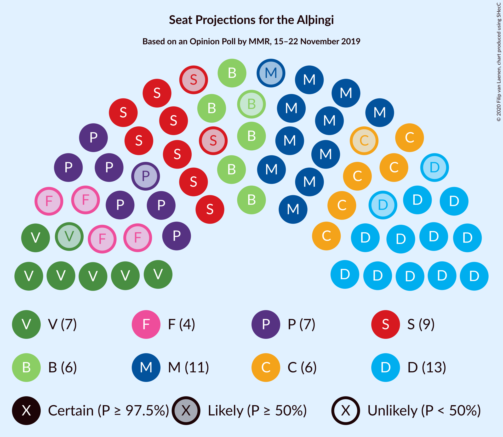
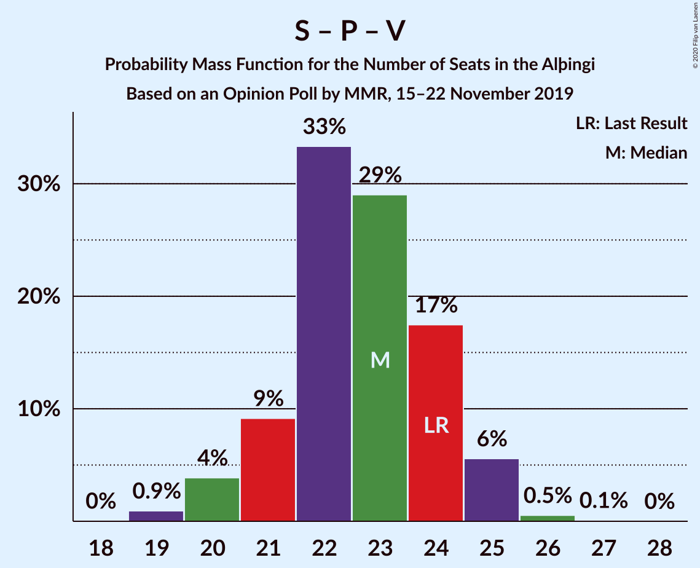

# Opinion Poll by MMR, 15–22 November 2019

<a href="#voting-intentions">Voting Intentions</a> | <a href="#seats">Seats</a> | <a href="#coalitions">Coalitions</a> | <a href="#technical-information">Technical Information</a>

## Voting Intentions

### Confidence Intervals

| Party | Last Result | Poll Result | 80% Confidence Interval | 90% Confidence Interval | 95% Confidence Interval | 99% Confidence Interval |
|:-----:|:-----------:|:-----------:|:-----------------------:|:-----------------------:|:-----------------------:|:-----------------------:|
| Sjálfstæðisflokkurinn | 25.2% | 18.1% | 16.6–19.7% |16.2–20.1% |15.9–20.5% |15.2–21.3% |
| Miðflokkurinn | 10.9% | 16.8% | 15.4–18.3% |15.0–18.8% |14.6–19.1% |14.0–19.9% |
| Samfylkingin | 12.1% | 13.2% | 11.9–14.6% |11.6–15.0% |11.3–15.4% |10.7–16.1% |
| Píratar | 9.2% | 10.7% | 9.6–12.1% |9.3–12.4% |9.0–12.8% |8.5–13.4% |
| Vinstrihreyfingin – grænt framboð | 16.9% | 10.6% | 9.4–11.9% |9.1–12.2% |8.8–12.6% |8.3–13.2% |
| Viðreisn | 6.7% | 9.7% | 8.6–11.0% |8.3–11.3% |8.1–11.6% |7.6–12.3% |
| Framsóknarflokkurinn | 10.7% | 9.4% | 8.4–10.7% |8.1–11.0% |7.8–11.3% |7.3–12.0% |
| Flokkur fólksins | 6.9% | 6.3% | 5.5–7.4% |5.2–7.7% |5.0–7.9% |4.6–8.5% |
| Sósíalistaflokkur Íslands | 0.0% | 3.0% | 2.4–3.8% |2.3–4.0% |2.1–4.2% |1.9–4.6% |

*Note:* The poll result column reflects the actual value used in the calculations. Published results may vary slightly, and in addition be rounded to fewer digits.

## Seats

### Confidence Intervals

| Party | Last Result | Median | 80% Confidence Interval | 90% Confidence Interval | 95% Confidence Interval | 99% Confidence Interval |
|:-----:|:-----------:|:------:|:-----------------------:|:-----------------------:|:-----------------------:|:-----------------------:|
| <a href="#sjálfstæðisflokkurinn">Sjálfstæðisflokkurinn</a> | 16 | 13 | 11–13 |11–13 |11–14 |10–14 |
| <a href="#miðflokkurinn">Miðflokkurinn</a> | 7 | 11 | 10–14 |10–14 |10–15 |10–15 |
| <a href="#samfylkingin">Samfylkingin</a> | 7 | 9 | 8–10 |7–10 |7–10 |7–11 |
| <a href="#píratar">Píratar</a> | 6 | 7 | 6–8 |6–8 |6–8 |5–9 |
| <a href="#vinstrihreyfingin-–-grænt-framboð">Vinstrihreyfingin – grænt framboð</a> | 11 | 7 | 6–7 |6–8 |6–8 |5–9 |
| <a href="#viðreisn">Viðreisn</a> | 4 | 6 | 6–7 |5–7 |5–8 |5–8 |
| <a href="#framsóknarflokkurinn">Framsóknarflokkurinn</a> | 8 | 6 | 6–8 |5–8 |5–8 |5–8 |
| <a href="#flokkur-fólksins">Flokkur fólksins</a> | 4 | 4 | 3–5 |3–5 |0–5 |0–5 |
| <a href="#sósíalistaflokkur-íslands">Sósíalistaflokkur Íslands</a> | 0 | 0 | 0 |0 |0 |0 |

### Sjálfstæðisflokkurinn

*For a full overview of the results for this party, see the [Sjálfstæðisflokkurinn](party-sjálfstæðisflokkurinn.html) page.*

| Number of Seats | Probability | Accumulated | Special Marks |
|:---------------:|:-----------:|:-----------:|:-------------:|
| 10 | 2% | 100% |  |
| 11 | 24% | 98% |  |
| 12 | 15% | 73% |  |
| 13 | 54% | 58% | Median |
| 14 | 4% | 4% |  |
| 15 | 0.2% | 0.2% |  |
| 16 | 0% | 0% | Last Result |

### Miðflokkurinn

*For a full overview of the results for this party, see the [Miðflokkurinn](party-miðflokkurinn.html) page.*

| Number of Seats | Probability | Accumulated | Special Marks |
|:---------------:|:-----------:|:-----------:|:-------------:|
| 7 | 0% | 100% | Last Result |
| 8 | 0% | 100% |  |
| 9 | 0% | 100% |  |
| 10 | 15% | 100% |  |
| 11 | 49% | 85% | Median |
| 12 | 6% | 35% |  |
| 13 | 14% | 29% |  |
| 14 | 12% | 15% |  |
| 15 | 3% | 3% |  |
| 16 | 0% | 0% |  |

### Samfylkingin

*For a full overview of the results for this party, see the [Samfylkingin](party-samfylkingin.html) page.*

| Number of Seats | Probability | Accumulated | Special Marks |
|:---------------:|:-----------:|:-----------:|:-------------:|
| 7 | 7% | 100% | Last Result |
| 8 | 27% | 93% |  |
| 9 | 39% | 66% | Median |
| 10 | 26% | 27% |  |
| 11 | 0.9% | 0.9% |  |
| 12 | 0% | 0% |  |

### Píratar

*For a full overview of the results for this party, see the [Píratar](party-píratar.html) page.*

| Number of Seats | Probability | Accumulated | Special Marks |
|:---------------:|:-----------:|:-----------:|:-------------:|
| 5 | 0.5% | 100% |  |
| 6 | 24% | 99.5% | Last Result |
| 7 | 55% | 76% | Median |
| 8 | 18% | 21% |  |
| 9 | 2% | 2% |  |
| 10 | 0% | 0% |  |

### Vinstrihreyfingin – grænt framboð

*For a full overview of the results for this party, see the [Vinstrihreyfingin – grænt framboð](party-vinstrihreyfingin–græntframboð.html) page.*

| Number of Seats | Probability | Accumulated | Special Marks |
|:---------------:|:-----------:|:-----------:|:-------------:|
| 5 | 0.7% | 100% |  |
| 6 | 47% | 99.3% |  |
| 7 | 43% | 53% | Median |
| 8 | 9% | 9% |  |
| 9 | 0.6% | 0.8% |  |
| 10 | 0.1% | 0.1% |  |
| 11 | 0% | 0% | Last Result |

### Viðreisn

*For a full overview of the results for this party, see the [Viðreisn](party-viðreisn.html) page.*

| Number of Seats | Probability | Accumulated | Special Marks |
|:---------------:|:-----------:|:-----------:|:-------------:|
| 4 | 0.2% | 100% | Last Result |
| 5 | 7% | 99.8% |  |
| 6 | 71% | 93% | Median |
| 7 | 19% | 22% |  |
| 8 | 3% | 3% |  |
| 9 | 0% | 0% |  |

### Framsóknarflokkurinn

*For a full overview of the results for this party, see the [Framsóknarflokkurinn](party-framsóknarflokkurinn.html) page.*

| Number of Seats | Probability | Accumulated | Special Marks |
|:---------------:|:-----------:|:-----------:|:-------------:|
| 4 | 0.4% | 100% |  |
| 5 | 7% | 99.6% |  |
| 6 | 43% | 93% | Median |
| 7 | 32% | 50% |  |
| 8 | 17% | 17% | Last Result |
| 9 | 0% | 0% |  |

### Flokkur fólksins

*For a full overview of the results for this party, see the [Flokkur fólksins](party-flokkurfólksins.html) page.*

| Number of Seats | Probability | Accumulated | Special Marks |
|:---------------:|:-----------:|:-----------:|:-------------:|
| 0 | 4% | 100% |  |
| 1 | 0% | 96% |  |
| 2 | 0% | 96% |  |
| 3 | 18% | 96% |  |
| 4 | 68% | 78% | Last Result, Median |
| 5 | 10% | 11% |  |
| 6 | 0.3% | 0.3% |  |
| 7 | 0% | 0% |  |

### Sósíalistaflokkur Íslands

*For a full overview of the results for this party, see the [Sósíalistaflokkur Íslands](party-sósíalistaflokkuríslands.html) page.*

| Number of Seats | Probability | Accumulated | Special Marks |
|:---------------:|:-----------:|:-----------:|:-------------:|
| 0 | 99.9% | 100% | Last Result, Median |
| 1 | 0% | 0.1% |  |
| 2 | 0% | 0.1% |  |
| 3 | 0.1% | 0.1% |  |
| 4 | 0% | 0% |  |

## Coalitions

### Confidence Intervals

| Coalition | Last Result | Median | Majority? | 80% Confidence Interval | 90% Confidence Interval | 95% Confidence Interval | 99% Confidence Interval |
|:---------:|:-----------:|:------:|:---------:|:-----------------------:|:-----------------------:|:-----------------------:|:-----------------------:|
| Miðflokkurinn – Samfylkingin – Vinstrihreyfingin – grænt framboð – Framsóknarflokkurinn | 33 | 33 | 94% | 32–36 | 31–36 | 31–37 | 31–38 |
| Sjálfstæðisflokkurinn – Miðflokkurinn – Framsóknarflokkurinn | 31 | 30 | 24% | 29–32 | 29–33 | 28–33 | 27–34 |
| Samfylkingin – Píratar – Vinstrihreyfingin – grænt framboð – Viðreisn | 28 | 29 | 2% | 27–31 | 26–31 | 26–31 | 25–33 |
| Miðflokkurinn – Samfylkingin – Vinstrihreyfingin – grænt framboð | 25 | 27 | 0.1% | 25–29 | 25–30 | 25–31 | 25–31 |
| Miðflokkurinn – Vinstrihreyfingin – grænt framboð – Framsóknarflokkurinn | 26 | 25 | 0% | 23–27 | 23–28 | 23–29 | 22–29 |
| Sjálfstæðisflokkurinn – Vinstrihreyfingin – grænt framboð – Framsóknarflokkurinn | 35 | 26 | 0% | 24–26 | 24–28 | 23–28 | 23–29 |
| Sjálfstæðisflokkurinn – Miðflokkurinn | 23 | 24 | 0% | 22–26 | 22–26 | 22–27 | 21–27 |
| Samfylkingin – Píratar – Vinstrihreyfingin – grænt framboð | 24 | 23 | 0% | 21–24 | 20–25 | 20–25 | 19–26 |
| Samfylkingin – Vinstrihreyfingin – grænt framboð – Framsóknarflokkurinn | 26 | 22 | 0% | 20–24 | 20–24 | 20–24 | 19–24 |
| Sjálfstæðisflokkurinn – Samfylkingin | 23 | 21 | 0% | 20–23 | 19–23 | 18–23 | 18–24 |
| Miðflokkurinn – Vinstrihreyfingin – grænt framboð | 18 | 18 | 0% | 17–21 | 17–21 | 17–22 | 16–22 |
| Sjálfstæðisflokkurinn – Vinstrihreyfingin – grænt framboð | 27 | 19 | 0% | 18–20 | 17–21 | 17–21 | 16–22 |
| Sjálfstæðisflokkurinn – Viðreisn | 20 | 19 | 0% | 17–20 | 17–20 | 17–21 | 16–21 |
| Sjálfstæðisflokkurinn – Framsóknarflokkurinn | 24 | 19 | 0% | 17–20 | 17–20 | 17–20 | 16–21 |
| Samfylkingin – Vinstrihreyfingin – grænt framboð | 18 | 16 | 0% | 14–17 | 14–17 | 14–17 | 13–18 |
| Píratar – Vinstrihreyfingin – grænt framboð | 17 | 13 | 0% | 12–15 | 12–15 | 12–16 | 12–16 |
| Vinstrihreyfingin – grænt framboð – Framsóknarflokkurinn | 19 | 13 | 0% | 12–15 | 12–15 | 12–15 | 11–16 |

### Miðflokkurinn – Samfylkingin – Vinstrihreyfingin – grænt framboð – Framsóknarflokkurinn

| Number of Seats | Probability | Accumulated | Special Marks |
|:---------------:|:-----------:|:-----------:|:-------------:|
| 30 | 0.2% | 100% |  |
| 31 | 6% | 99.8% |  |
| 32 | 6% | 94% | Majority |
| 33 | 44% | 87% | Last Result, Median |
| 34 | 10% | 43% |  |
| 35 | 21% | 33% |  |
| 36 | 8% | 13% |  |
| 37 | 4% | 5% |  |
| 38 | 1.0% | 1.0% |  |
| 39 | 0% | 0% |  |

### Sjálfstæðisflokkurinn – Miðflokkurinn – Framsóknarflokkurinn

| Number of Seats | Probability | Accumulated | Special Marks |
|:---------------:|:-----------:|:-----------:|:-------------:|
| 26 | 0.1% | 100% |  |
| 27 | 0.6% | 99.9% |  |
| 28 | 4% | 99.3% |  |
| 29 | 8% | 95% |  |
| 30 | 42% | 87% | Median |
| 31 | 22% | 45% | Last Result |
| 32 | 15% | 24% | Majority |
| 33 | 8% | 9% |  |
| 34 | 0.4% | 0.6% |  |
| 35 | 0.2% | 0.2% |  |
| 36 | 0% | 0% |  |

### Samfylkingin – Píratar – Vinstrihreyfingin – grænt framboð – Viðreisn

| Number of Seats | Probability | Accumulated | Special Marks |
|:---------------:|:-----------:|:-----------:|:-------------:|
| 25 | 0.7% | 100% |  |
| 26 | 7% | 99.3% |  |
| 27 | 12% | 92% |  |
| 28 | 22% | 81% | Last Result |
| 29 | 41% | 59% | Median |
| 30 | 6% | 18% |  |
| 31 | 9% | 11% |  |
| 32 | 0.7% | 2% | Majority |
| 33 | 1.4% | 1.4% |  |
| 34 | 0% | 0% |  |

### Miðflokkurinn – Samfylkingin – Vinstrihreyfingin – grænt framboð

| Number of Seats | Probability | Accumulated | Special Marks |
|:---------------:|:-----------:|:-----------:|:-------------:|
| 24 | 0.4% | 100% |  |
| 25 | 10% | 99.6% | Last Result |
| 26 | 20% | 90% |  |
| 27 | 42% | 70% | Median |
| 28 | 10% | 28% |  |
| 29 | 9% | 18% |  |
| 30 | 6% | 9% |  |
| 31 | 2% | 3% |  |
| 32 | 0.1% | 0.1% | Majority |
| 33 | 0% | 0% |  |

### Miðflokkurinn – Vinstrihreyfingin – grænt framboð – Framsóknarflokkurinn

| Number of Seats | Probability | Accumulated | Special Marks |
|:---------------:|:-----------:|:-----------:|:-------------:|
| 21 | 0.1% | 100% |  |
| 22 | 1.4% | 99.9% |  |
| 23 | 20% | 98.6% |  |
| 24 | 24% | 78% | Median |
| 25 | 20% | 54% |  |
| 26 | 19% | 34% | Last Result |
| 27 | 9% | 15% |  |
| 28 | 3% | 6% |  |
| 29 | 3% | 3% |  |
| 30 | 0% | 0% |  |

### Sjálfstæðisflokkurinn – Vinstrihreyfingin – grænt framboð – Framsóknarflokkurinn

| Number of Seats | Probability | Accumulated | Special Marks |
|:---------------:|:-----------:|:-----------:|:-------------:|
| 21 | 0.1% | 100% |  |
| 22 | 0.4% | 99.9% |  |
| 23 | 2% | 99.5% |  |
| 24 | 9% | 97% |  |
| 25 | 36% | 88% |  |
| 26 | 43% | 53% | Median |
| 27 | 3% | 9% |  |
| 28 | 5% | 6% |  |
| 29 | 0.9% | 0.9% |  |
| 30 | 0.1% | 0.1% |  |
| 31 | 0% | 0% |  |
| 32 | 0% | 0% | Majority |
| 33 | 0% | 0% |  |
| 34 | 0% | 0% |  |
| 35 | 0% | 0% | Last Result |

### Sjálfstæðisflokkurinn – Miðflokkurinn

| Number of Seats | Probability | Accumulated | Special Marks |
|:---------------:|:-----------:|:-----------:|:-------------:|
| 21 | 1.2% | 100% |  |
| 22 | 16% | 98.8% |  |
| 23 | 16% | 82% | Last Result |
| 24 | 38% | 67% | Median |
| 25 | 9% | 29% |  |
| 26 | 17% | 20% |  |
| 27 | 3% | 3% |  |
| 28 | 0.3% | 0.3% |  |
| 29 | 0% | 0% |  |

### Samfylkingin – Píratar – Vinstrihreyfingin – grænt framboð

| Number of Seats | Probability | Accumulated | Special Marks |
|:---------------:|:-----------:|:-----------:|:-------------:|
| 19 | 0.8% | 100% |  |
| 20 | 7% | 99.1% |  |
| 21 | 11% | 93% |  |
| 22 | 31% | 82% |  |
| 23 | 37% | 51% | Median |
| 24 | 6% | 14% | Last Result |
| 25 | 7% | 8% |  |
| 26 | 0.6% | 0.7% |  |
| 27 | 0% | 0% |  |

### Samfylkingin – Vinstrihreyfingin – grænt framboð – Framsóknarflokkurinn

| Number of Seats | Probability | Accumulated | Special Marks |
|:---------------:|:-----------:|:-----------:|:-------------:|
| 18 | 0.2% | 100% |  |
| 19 | 0.9% | 99.8% |  |
| 20 | 13% | 98.9% |  |
| 21 | 14% | 86% |  |
| 22 | 36% | 72% | Median |
| 23 | 20% | 35% |  |
| 24 | 15% | 15% |  |
| 25 | 0.3% | 0.4% |  |
| 26 | 0.1% | 0.1% | Last Result |
| 27 | 0% | 0% |  |

### Sjálfstæðisflokkurinn – Samfylkingin

| Number of Seats | Probability | Accumulated | Special Marks |
|:---------------:|:-----------:|:-----------:|:-------------:|
| 17 | 0.1% | 100% |  |
| 18 | 3% | 99.9% |  |
| 19 | 5% | 97% |  |
| 20 | 27% | 92% |  |
| 21 | 26% | 65% |  |
| 22 | 16% | 39% | Median |
| 23 | 21% | 23% | Last Result |
| 24 | 2% | 2% |  |
| 25 | 0.1% | 0.1% |  |
| 26 | 0% | 0% |  |

### Miðflokkurinn – Vinstrihreyfingin – grænt framboð

| Number of Seats | Probability | Accumulated | Special Marks |
|:---------------:|:-----------:|:-----------:|:-------------:|
| 15 | 0.1% | 100% |  |
| 16 | 1.3% | 99.9% |  |
| 17 | 36% | 98.6% |  |
| 18 | 29% | 63% | Last Result, Median |
| 19 | 15% | 34% |  |
| 20 | 5% | 18% |  |
| 21 | 10% | 13% |  |
| 22 | 3% | 3% |  |
| 23 | 0.1% | 0.1% |  |
| 24 | 0% | 0% |  |

### Sjálfstæðisflokkurinn – Vinstrihreyfingin – grænt framboð

| Number of Seats | Probability | Accumulated | Special Marks |
|:---------------:|:-----------:|:-----------:|:-------------:|
| 16 | 0.5% | 100% |  |
| 17 | 5% | 99.5% |  |
| 18 | 26% | 95% |  |
| 19 | 45% | 69% |  |
| 20 | 16% | 23% | Median |
| 21 | 7% | 7% |  |
| 22 | 0.5% | 0.7% |  |
| 23 | 0.1% | 0.2% |  |
| 24 | 0% | 0% |  |
| 25 | 0% | 0% |  |
| 26 | 0% | 0% |  |
| 27 | 0% | 0% | Last Result |

### Sjálfstæðisflokkurinn – Viðreisn

| Number of Seats | Probability | Accumulated | Special Marks |
|:---------------:|:-----------:|:-----------:|:-------------:|
| 15 | 0.1% | 100% |  |
| 16 | 2% | 99.9% |  |
| 17 | 24% | 98% |  |
| 18 | 11% | 74% |  |
| 19 | 49% | 62% | Median |
| 20 | 11% | 13% | Last Result |
| 21 | 2% | 3% |  |
| 22 | 0.1% | 0.1% |  |
| 23 | 0% | 0% |  |

### Sjálfstæðisflokkurinn – Framsóknarflokkurinn

| Number of Seats | Probability | Accumulated | Special Marks |
|:---------------:|:-----------:|:-----------:|:-------------:|
| 15 | 0.2% | 100% |  |
| 16 | 2% | 99.8% |  |
| 17 | 8% | 98% |  |
| 18 | 14% | 90% |  |
| 19 | 50% | 76% | Median |
| 20 | 25% | 26% |  |
| 21 | 1.5% | 2% |  |
| 22 | 0.2% | 0.2% |  |
| 23 | 0% | 0% |  |
| 24 | 0% | 0% | Last Result |

### Samfylkingin – Vinstrihreyfingin – grænt framboð

| Number of Seats | Probability | Accumulated | Special Marks |
|:---------------:|:-----------:|:-----------:|:-------------:|
| 12 | 0.1% | 100% |  |
| 13 | 1.3% | 99.9% |  |
| 14 | 17% | 98.6% |  |
| 15 | 26% | 81% |  |
| 16 | 44% | 55% | Median |
| 17 | 10% | 11% |  |
| 18 | 1.3% | 2% | Last Result |
| 19 | 0.2% | 0.2% |  |
| 20 | 0% | 0% |  |

### Píratar – Vinstrihreyfingin – grænt framboð

| Number of Seats | Probability | Accumulated | Special Marks |
|:---------------:|:-----------:|:-----------:|:-------------:|
| 11 | 0.3% | 100% |  |
| 12 | 13% | 99.7% |  |
| 13 | 38% | 86% |  |
| 14 | 25% | 48% | Median |
| 15 | 20% | 23% |  |
| 16 | 3% | 3% |  |
| 17 | 0.1% | 0.1% | Last Result |
| 18 | 0% | 0% |  |

### Vinstrihreyfingin – grænt framboð – Framsóknarflokkurinn

| Number of Seats | Probability | Accumulated | Special Marks |
|:---------------:|:-----------:|:-----------:|:-------------:|
| 10 | 0.1% | 100% |  |
| 11 | 2% | 99.9% |  |
| 12 | 28% | 98% |  |
| 13 | 39% | 71% | Median |
| 14 | 11% | 31% |  |
| 15 | 19% | 20% |  |
| 16 | 1.0% | 1.1% |  |
| 17 | 0.1% | 0.2% |  |
| 18 | 0% | 0% |  |
| 19 | 0% | 0% | Last Result |

## Technical Information

### Opinion Poll

+ **Polling firm:** MMR
+ **Commissioner(s):** —
+ **Fieldwork period:** 15–22 November 2019

### Calculations

+ **Sample size:** 1061
+ **Simulations done:** 131,072
+ **Error estimate:** 1.91%

