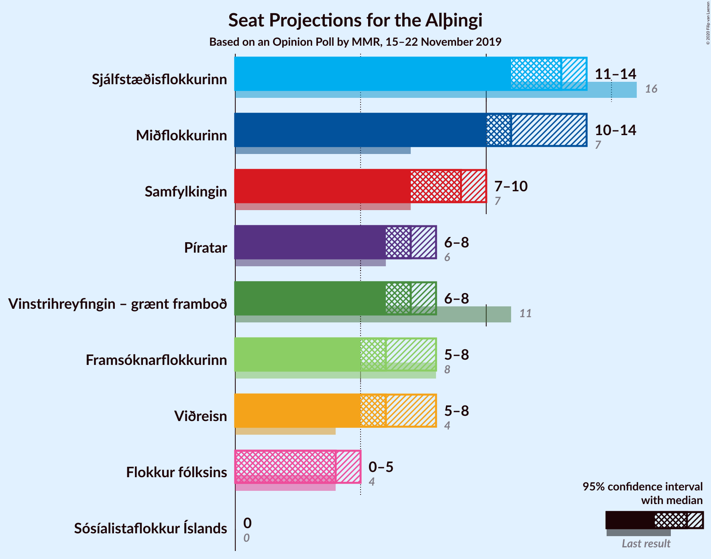
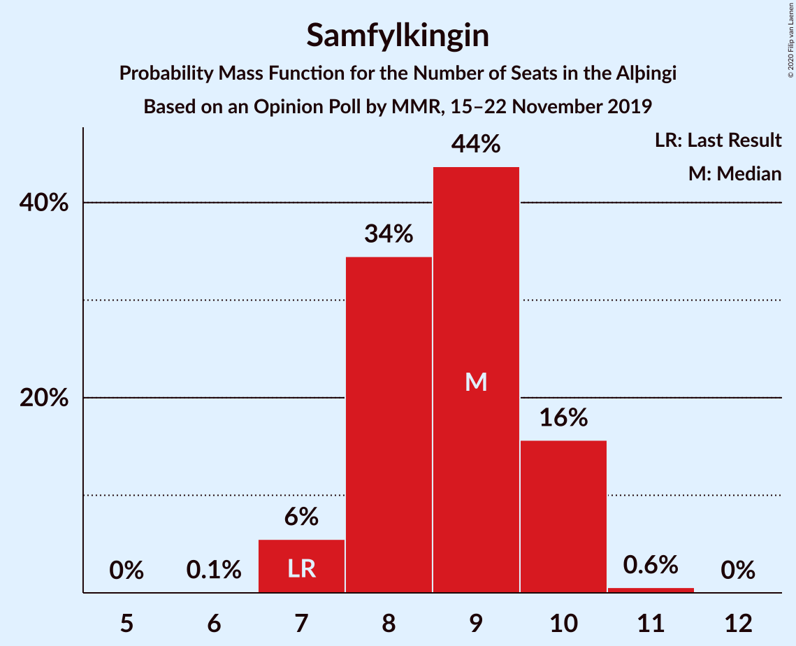
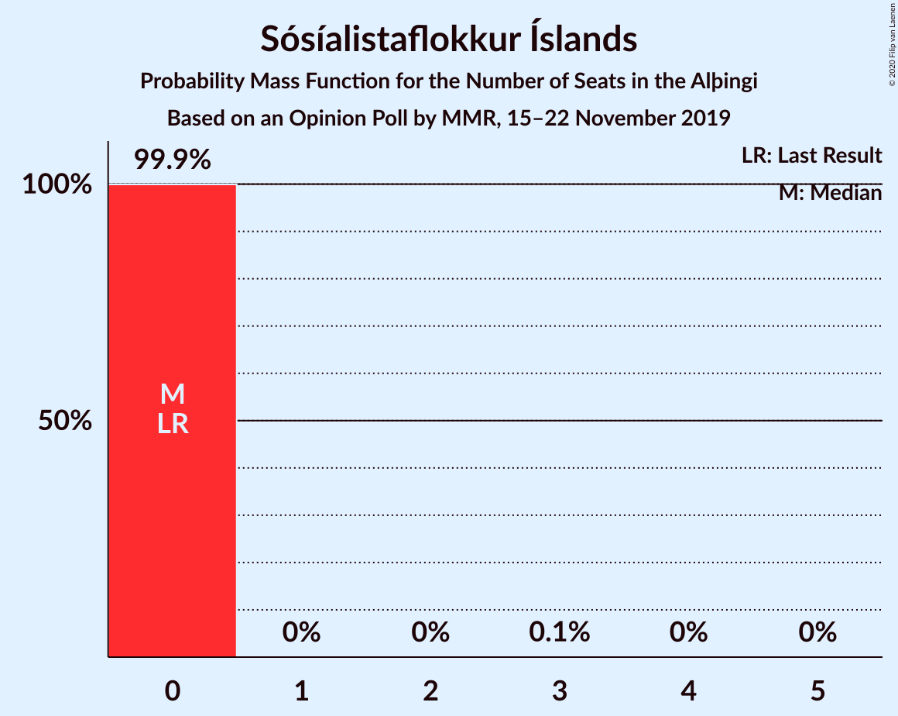

# Opinion Poll by MMR, 15–22 November 2019

<a href="#voting-intentions">Voting Intentions</a> | <a href="#seats">Seats</a> | <a href="#coalitions">Coalitions</a> | <a href="#technical-information">Technical Information</a>

## Voting Intentions

### Confidence Intervals

| Party | Last Result | Poll Result | 80% Confidence Interval | 90% Confidence Interval | 95% Confidence Interval | 99% Confidence Interval |
|:-----:|:-----------:|:-----------:|:-----------------------:|:-----------------------:|:-----------------------:|:-----------------------:|
| Sjálfstæðisflokkurinn | 25.2% | 18.1% | 16.6–19.7% |16.2–20.1% |15.9–20.5% |15.2–21.3% |
| Miðflokkurinn | 10.9% | 16.8% | 15.4–18.3% |15.0–18.8% |14.6–19.1% |14.0–19.9% |
| Samfylkingin | 12.1% | 13.2% | 11.9–14.6% |11.6–15.0% |11.3–15.4% |10.7–16.1% |
| Píratar | 9.2% | 10.7% | 9.6–12.1% |9.3–12.4% |9.0–12.8% |8.5–13.4% |
| Vinstrihreyfingin – grænt framboð | 16.9% | 10.6% | 9.4–11.9% |9.1–12.2% |8.8–12.6% |8.3–13.2% |
| Viðreisn | 6.7% | 9.7% | 8.6–11.0% |8.3–11.3% |8.1–11.6% |7.6–12.3% |
| Framsóknarflokkurinn | 10.7% | 9.4% | 8.4–10.7% |8.1–11.0% |7.8–11.3% |7.3–12.0% |
| Flokkur fólksins | 6.9% | 6.3% | 5.5–7.4% |5.2–7.7% |5.0–7.9% |4.6–8.5% |
| Sósíalistaflokkur Íslands | 0.0% | 3.0% | 2.4–3.8% |2.3–4.0% |2.1–4.2% |1.9–4.6% |

*Note:* The poll result column reflects the actual value used in the calculations. Published results may vary slightly, and in addition be rounded to fewer digits.

## Seats

### Confidence Intervals

| Party | Last Result | Median | 80% Confidence Interval | 90% Confidence Interval | 95% Confidence Interval | 99% Confidence Interval |
|:-----:|:-----------:|:------:|:-----------------------:|:-----------------------:|:-----------------------:|:-----------------------:|
| <a href="#sjálfstæðisflokkurinn">Sjálfstæðisflokkurinn</a> | 16 | 13 | 11–13 |11–14 |11–14 |10–14 |
| <a href="#miðflokkurinn">Miðflokkurinn</a> | 7 | 11 | 10–14 |10–14 |10–14 |10–15 |
| <a href="#samfylkingin">Samfylkingin</a> | 7 | 9 | 8–10 |7–10 |7–10 |7–11 |
| <a href="#píratar">Píratar</a> | 6 | 7 | 6–8 |6–8 |6–8 |5–9 |
| <a href="#vinstrihreyfingin-–-grænt-framboð">Vinstrihreyfingin – grænt framboð</a> | 11 | 7 | 6–8 |6–8 |6–8 |5–9 |
| <a href="#viðreisn">Viðreisn</a> | 4 | 6 | 6–7 |5–7 |5–8 |5–8 |
| <a href="#framsóknarflokkurinn">Framsóknarflokkurinn</a> | 8 | 6 | 5–7 |5–8 |5–8 |5–8 |
| <a href="#flokkur-fólksins">Flokkur fólksins</a> | 4 | 4 | 3–5 |3–5 |0–5 |0–5 |
| <a href="#sósíalistaflokkur-íslands">Sósíalistaflokkur Íslands</a> | 0 | 0 | 0 |0 |0 |0 |

### Sjálfstæðisflokkurinn

*For a full overview of the results for this party, see the [Sjálfstæðisflokkurinn](party-sjálfstæðisflokkurinn.html) page.*

| Number of Seats | Probability | Accumulated | Special Marks |
|:---------------:|:-----------:|:-----------:|:-------------:|
| 9 | 0.1% | 100% |  |
| 10 | 2% | 99.9% |  |
| 11 | 23% | 98% |  |
| 12 | 20% | 75% |  |
| 13 | 50% | 55% | Median |
| 14 | 5% | 5% |  |
| 15 | 0.2% | 0.2% |  |
| 16 | 0% | 0% | Last Result |

### Miðflokkurinn

*For a full overview of the results for this party, see the [Miðflokkurinn](party-miðflokkurinn.html) page.*

| Number of Seats | Probability | Accumulated | Special Marks |
|:---------------:|:-----------:|:-----------:|:-------------:|
| 7 | 0% | 100% | Last Result |
| 8 | 0% | 100% |  |
| 9 | 0% | 100% |  |
| 10 | 21% | 100% |  |
| 11 | 33% | 79% | Median |
| 12 | 24% | 47% |  |
| 13 | 8% | 22% |  |
| 14 | 13% | 14% |  |
| 15 | 1.0% | 1.1% |  |
| 16 | 0.1% | 0.1% |  |
| 17 | 0% | 0% |  |

### Samfylkingin

*For a full overview of the results for this party, see the [Samfylkingin](party-samfylkingin.html) page.*

| Number of Seats | Probability | Accumulated | Special Marks |
|:---------------:|:-----------:|:-----------:|:-------------:|
| 6 | 0.1% | 100% |  |
| 7 | 6% | 99.9% | Last Result |
| 8 | 34% | 94% |  |
| 9 | 44% | 60% | Median |
| 10 | 16% | 16% |  |
| 11 | 0.6% | 0.6% |  |
| 12 | 0% | 0% |  |

### Píratar

*For a full overview of the results for this party, see the [Píratar](party-píratar.html) page.*

| Number of Seats | Probability | Accumulated | Special Marks |
|:---------------:|:-----------:|:-----------:|:-------------:|
| 5 | 2% | 100% |  |
| 6 | 18% | 98% | Last Result |
| 7 | 53% | 80% | Median |
| 8 | 26% | 28% |  |
| 9 | 1.4% | 1.5% |  |
| 10 | 0% | 0% |  |

### Vinstrihreyfingin – grænt framboð

*For a full overview of the results for this party, see the [Vinstrihreyfingin – grænt framboð](party-vinstrihreyfingin–græntframboð.html) page.*

| Number of Seats | Probability | Accumulated | Special Marks |
|:---------------:|:-----------:|:-----------:|:-------------:|
| 5 | 2% | 100% |  |
| 6 | 27% | 98% |  |
| 7 | 57% | 71% | Median |
| 8 | 12% | 14% |  |
| 9 | 2% | 2% |  |
| 10 | 0.1% | 0.1% |  |
| 11 | 0% | 0% | Last Result |

### Viðreisn

*For a full overview of the results for this party, see the [Viðreisn](party-viðreisn.html) page.*

| Number of Seats | Probability | Accumulated | Special Marks |
|:---------------:|:-----------:|:-----------:|:-------------:|
| 4 | 0.1% | 100% | Last Result |
| 5 | 10% | 99.9% |  |
| 6 | 56% | 90% | Median |
| 7 | 32% | 35% |  |
| 8 | 3% | 3% |  |
| 9 | 0.1% | 0.1% |  |
| 10 | 0% | 0% |  |

### Framsóknarflokkurinn

*For a full overview of the results for this party, see the [Framsóknarflokkurinn](party-framsóknarflokkurinn.html) page.*

| Number of Seats | Probability | Accumulated | Special Marks |
|:---------------:|:-----------:|:-----------:|:-------------:|
| 4 | 0.5% | 100% |  |
| 5 | 15% | 99.5% |  |
| 6 | 49% | 84% | Median |
| 7 | 26% | 35% |  |
| 8 | 9% | 9% | Last Result |
| 9 | 0.1% | 0.1% |  |
| 10 | 0% | 0% |  |

### Flokkur fólksins

*For a full overview of the results for this party, see the [Flokkur fólksins](party-flokkurfólksins.html) page.*

| Number of Seats | Probability | Accumulated | Special Marks |
|:---------------:|:-----------:|:-----------:|:-------------:|
| 0 | 3% | 100% |  |
| 1 | 0% | 97% |  |
| 2 | 0% | 97% |  |
| 3 | 20% | 97% |  |
| 4 | 64% | 77% | Last Result, Median |
| 5 | 13% | 13% |  |
| 6 | 0.2% | 0.2% |  |
| 7 | 0% | 0% |  |

### Sósíalistaflokkur Íslands

*For a full overview of the results for this party, see the [Sósíalistaflokkur Íslands](party-sósíalistaflokkuríslands.html) page.*

| Number of Seats | Probability | Accumulated | Special Marks |
|:---------------:|:-----------:|:-----------:|:-------------:|
| 0 | 99.9% | 100% | Last Result, Median |
| 1 | 0% | 0.1% |  |
| 2 | 0% | 0.1% |  |
| 3 | 0.1% | 0.1% |  |
| 4 | 0% | 0% |  |

## Coalitions

### Confidence Intervals

| Coalition | Last Result | Median | Majority? | 80% Confidence Interval | 90% Confidence Interval | 95% Confidence Interval | 99% Confidence Interval |
|:---------:|:-----------:|:------:|:---------:|:-----------------------:|:-----------------------:|:-----------------------:|:-----------------------:|
| Miðflokkurinn – Samfylkingin – Vinstrihreyfingin – grænt framboð – Framsóknarflokkurinn | 33 | 33 | 96% | 32–35 | 32–36 | 31–36 | 30–37 |
| Sjálfstæðisflokkurinn – Miðflokkurinn – Framsóknarflokkurinn | 31 | 30 | 14% | 29–32 | 29–33 | 28–33 | 27–34 |
| Samfylkingin – Píratar – Vinstrihreyfingin – grænt framboð – Viðreisn | 28 | 29 | 2% | 27–30 | 27–31 | 26–31 | 25–32 |
| Miðflokkurinn – Samfylkingin – Vinstrihreyfingin – grænt framboð | 25 | 27 | 0.2% | 26–29 | 25–30 | 25–31 | 24–31 |
| Miðflokkurinn – Vinstrihreyfingin – grænt framboð – Framsóknarflokkurinn | 26 | 25 | 0% | 23–27 | 23–27 | 23–28 | 22–29 |
| Sjálfstæðisflokkurinn – Vinstrihreyfingin – grænt framboð – Framsóknarflokkurinn | 35 | 26 | 0% | 24–27 | 23–28 | 23–28 | 22–29 |
| Sjálfstæðisflokkurinn – Miðflokkurinn | 23 | 24 | 0% | 22–26 | 22–26 | 22–27 | 21–28 |
| Samfylkingin – Píratar – Vinstrihreyfingin – grænt framboð | 24 | 23 | 0% | 21–24 | 21–25 | 20–25 | 19–26 |
| Samfylkingin – Vinstrihreyfingin – grænt framboð – Framsóknarflokkurinn | 26 | 22 | 0% | 20–23 | 20–24 | 19–24 | 18–25 |
| Sjálfstæðisflokkurinn – Samfylkingin | 23 | 21 | 0% | 19–23 | 19–23 | 19–23 | 18–24 |
| Miðflokkurinn – Vinstrihreyfingin – grænt framboð | 18 | 18 | 0% | 17–21 | 17–21 | 17–22 | 16–22 |
| Sjálfstæðisflokkurinn – Vinstrihreyfingin – grænt framboð | 27 | 19 | 0% | 18–20 | 17–21 | 17–21 | 16–22 |
| Sjálfstæðisflokkurinn – Viðreisn | 20 | 19 | 0% | 17–20 | 17–20 | 16–21 | 16–21 |
| Sjálfstæðisflokkurinn – Framsóknarflokkurinn | 24 | 19 | 0% | 17–20 | 17–20 | 16–20 | 16–21 |
| Samfylkingin – Vinstrihreyfingin – grænt framboð | 18 | 16 | 0% | 14–17 | 14–17 | 14–17 | 13–18 |
| Píratar – Vinstrihreyfingin – grænt framboð | 17 | 14 | 0% | 13–15 | 12–15 | 12–16 | 11–16 |
| Vinstrihreyfingin – grænt framboð – Framsóknarflokkurinn | 19 | 13 | 0% | 12–15 | 12–15 | 11–15 | 10–16 |

### Miðflokkurinn – Samfylkingin – Vinstrihreyfingin – grænt framboð – Framsóknarflokkurinn

| Number of Seats | Probability | Accumulated | Special Marks |
|:---------------:|:-----------:|:-----------:|:-------------:|
| 30 | 0.5% | 100% |  |
| 31 | 3% | 99.4% |  |
| 32 | 21% | 96% | Majority |
| 33 | 32% | 75% | Last Result, Median |
| 34 | 20% | 43% |  |
| 35 | 14% | 23% |  |
| 36 | 7% | 9% |  |
| 37 | 2% | 2% |  |
| 38 | 0.3% | 0.3% |  |
| 39 | 0% | 0% |  |

### Sjálfstæðisflokkurinn – Miðflokkurinn – Framsóknarflokkurinn

| Number of Seats | Probability | Accumulated | Special Marks |
|:---------------:|:-----------:|:-----------:|:-------------:|
| 26 | 0.1% | 100% |  |
| 27 | 0.8% | 99.9% |  |
| 28 | 4% | 99.1% |  |
| 29 | 28% | 95% |  |
| 30 | 24% | 68% | Median |
| 31 | 29% | 43% | Last Result |
| 32 | 8% | 14% | Majority |
| 33 | 5% | 6% |  |
| 34 | 0.9% | 1.0% |  |
| 35 | 0.1% | 0.1% |  |
| 36 | 0% | 0% |  |

### Samfylkingin – Píratar – Vinstrihreyfingin – grænt framboð – Viðreisn

| Number of Seats | Probability | Accumulated | Special Marks |
|:---------------:|:-----------:|:-----------:|:-------------:|
| 25 | 0.7% | 100% |  |
| 26 | 4% | 99.2% |  |
| 27 | 9% | 95% |  |
| 28 | 20% | 87% | Last Result |
| 29 | 34% | 67% | Median |
| 30 | 24% | 33% |  |
| 31 | 7% | 9% |  |
| 32 | 1.3% | 2% | Majority |
| 33 | 0.3% | 0.4% |  |
| 34 | 0% | 0% |  |

### Miðflokkurinn – Samfylkingin – Vinstrihreyfingin – grænt framboð

| Number of Seats | Probability | Accumulated | Special Marks |
|:---------------:|:-----------:|:-----------:|:-------------:|
| 23 | 0.1% | 100% |  |
| 24 | 1.2% | 99.9% |  |
| 25 | 4% | 98.7% | Last Result |
| 26 | 30% | 95% |  |
| 27 | 31% | 64% | Median |
| 28 | 17% | 34% |  |
| 29 | 9% | 16% |  |
| 30 | 4% | 8% |  |
| 31 | 3% | 3% |  |
| 32 | 0.2% | 0.2% | Majority |
| 33 | 0% | 0% |  |

### Miðflokkurinn – Vinstrihreyfingin – grænt framboð – Framsóknarflokkurinn

| Number of Seats | Probability | Accumulated | Special Marks |
|:---------------:|:-----------:|:-----------:|:-------------:|
| 21 | 0.2% | 100% |  |
| 22 | 2% | 99.8% |  |
| 23 | 18% | 98% |  |
| 24 | 24% | 80% | Median |
| 25 | 26% | 55% |  |
| 26 | 19% | 30% | Last Result |
| 27 | 8% | 11% |  |
| 28 | 2% | 3% |  |
| 29 | 0.9% | 1.0% |  |
| 30 | 0% | 0% |  |

### Sjálfstæðisflokkurinn – Vinstrihreyfingin – grænt framboð – Framsóknarflokkurinn

| Number of Seats | Probability | Accumulated | Special Marks |
|:---------------:|:-----------:|:-----------:|:-------------:|
| 21 | 0.1% | 100% |  |
| 22 | 1.0% | 99.9% |  |
| 23 | 5% | 98.9% |  |
| 24 | 16% | 94% |  |
| 25 | 28% | 78% |  |
| 26 | 30% | 50% | Median |
| 27 | 15% | 20% |  |
| 28 | 4% | 5% |  |
| 29 | 0.6% | 0.7% |  |
| 30 | 0.1% | 0.1% |  |
| 31 | 0% | 0% |  |
| 32 | 0% | 0% | Majority |
| 33 | 0% | 0% |  |
| 34 | 0% | 0% |  |
| 35 | 0% | 0% | Last Result |

### Sjálfstæðisflokkurinn – Miðflokkurinn

| Number of Seats | Probability | Accumulated | Special Marks |
|:---------------:|:-----------:|:-----------:|:-------------:|
| 20 | 0.1% | 100% |  |
| 21 | 2% | 99.9% |  |
| 22 | 10% | 98% |  |
| 23 | 29% | 89% | Last Result |
| 24 | 28% | 60% | Median |
| 25 | 19% | 32% |  |
| 26 | 9% | 13% |  |
| 27 | 3% | 4% |  |
| 28 | 0.7% | 0.8% |  |
| 29 | 0% | 0% |  |

### Samfylkingin – Píratar – Vinstrihreyfingin – grænt framboð

| Number of Seats | Probability | Accumulated | Special Marks |
|:---------------:|:-----------:|:-----------:|:-------------:|
| 19 | 0.9% | 100% |  |
| 20 | 4% | 99.0% |  |
| 21 | 9% | 95% |  |
| 22 | 33% | 86% |  |
| 23 | 29% | 53% | Median |
| 24 | 17% | 24% | Last Result |
| 25 | 6% | 6% |  |
| 26 | 0.5% | 0.6% |  |
| 27 | 0.1% | 0.1% |  |
| 28 | 0% | 0% |  |

### Samfylkingin – Vinstrihreyfingin – grænt framboð – Framsóknarflokkurinn

| Number of Seats | Probability | Accumulated | Special Marks |
|:---------------:|:-----------:|:-----------:|:-------------:|
| 18 | 0.6% | 100% |  |
| 19 | 2% | 99.4% |  |
| 20 | 8% | 97% |  |
| 21 | 29% | 89% |  |
| 22 | 35% | 61% | Median |
| 23 | 16% | 26% |  |
| 24 | 8% | 10% |  |
| 25 | 1.4% | 1.5% |  |
| 26 | 0.1% | 0.1% | Last Result |
| 27 | 0% | 0% |  |

### Sjálfstæðisflokkurinn – Samfylkingin

| Number of Seats | Probability | Accumulated | Special Marks |
|:---------------:|:-----------:|:-----------:|:-------------:|
| 17 | 0.1% | 100% |  |
| 18 | 1.2% | 99.9% |  |
| 19 | 9% | 98.7% |  |
| 20 | 20% | 90% |  |
| 21 | 35% | 70% |  |
| 22 | 25% | 35% | Median |
| 23 | 9% | 10% | Last Result |
| 24 | 1.0% | 1.1% |  |
| 25 | 0% | 0.1% |  |
| 26 | 0% | 0% |  |

### Miðflokkurinn – Vinstrihreyfingin – grænt framboð

| Number of Seats | Probability | Accumulated | Special Marks |
|:---------------:|:-----------:|:-----------:|:-------------:|
| 15 | 0.2% | 100% |  |
| 16 | 2% | 99.8% |  |
| 17 | 20% | 98% |  |
| 18 | 39% | 78% | Last Result, Median |
| 19 | 19% | 39% |  |
| 20 | 9% | 20% |  |
| 21 | 7% | 10% |  |
| 22 | 3% | 3% |  |
| 23 | 0.2% | 0.2% |  |
| 24 | 0% | 0% |  |

### Sjálfstæðisflokkurinn – Vinstrihreyfingin – grænt framboð

| Number of Seats | Probability | Accumulated | Special Marks |
|:---------------:|:-----------:|:-----------:|:-------------:|
| 15 | 0.1% | 100% |  |
| 16 | 0.8% | 99.9% |  |
| 17 | 6% | 99.2% |  |
| 18 | 23% | 93% |  |
| 19 | 25% | 70% |  |
| 20 | 36% | 45% | Median |
| 21 | 8% | 9% |  |
| 22 | 1.1% | 1.3% |  |
| 23 | 0.2% | 0.2% |  |
| 24 | 0% | 0% |  |
| 25 | 0% | 0% |  |
| 26 | 0% | 0% |  |
| 27 | 0% | 0% | Last Result |

### Sjálfstæðisflokkurinn – Viðreisn

| Number of Seats | Probability | Accumulated | Special Marks |
|:---------------:|:-----------:|:-----------:|:-------------:|
| 15 | 0.1% | 100% |  |
| 16 | 3% | 99.9% |  |
| 17 | 16% | 97% |  |
| 18 | 23% | 81% |  |
| 19 | 35% | 58% | Median |
| 20 | 19% | 23% | Last Result |
| 21 | 3% | 3% |  |
| 22 | 0.2% | 0.2% |  |
| 23 | 0% | 0% |  |

### Sjálfstæðisflokkurinn – Framsóknarflokkurinn

| Number of Seats | Probability | Accumulated | Special Marks |
|:---------------:|:-----------:|:-----------:|:-------------:|
| 15 | 0.3% | 100% |  |
| 16 | 4% | 99.7% |  |
| 17 | 13% | 96% |  |
| 18 | 23% | 83% |  |
| 19 | 38% | 60% | Median |
| 20 | 19% | 22% |  |
| 21 | 2% | 2% |  |
| 22 | 0.2% | 0.3% |  |
| 23 | 0% | 0% |  |
| 24 | 0% | 0% | Last Result |

### Samfylkingin – Vinstrihreyfingin – grænt framboð

| Number of Seats | Probability | Accumulated | Special Marks |
|:---------------:|:-----------:|:-----------:|:-------------:|
| 12 | 0.1% | 100% |  |
| 13 | 2% | 99.9% |  |
| 14 | 10% | 98% |  |
| 15 | 37% | 88% |  |
| 16 | 34% | 50% | Median |
| 17 | 14% | 17% |  |
| 18 | 2% | 2% | Last Result |
| 19 | 0.3% | 0.3% |  |
| 20 | 0% | 0% |  |

### Píratar – Vinstrihreyfingin – grænt framboð

| Number of Seats | Probability | Accumulated | Special Marks |
|:---------------:|:-----------:|:-----------:|:-------------:|
| 11 | 2% | 100% |  |
| 12 | 8% | 98% |  |
| 13 | 23% | 91% |  |
| 14 | 37% | 68% | Median |
| 15 | 27% | 31% |  |
| 16 | 3% | 4% |  |
| 17 | 0.3% | 0.3% | Last Result |
| 18 | 0% | 0% |  |

### Vinstrihreyfingin – grænt framboð – Framsóknarflokkurinn

| Number of Seats | Probability | Accumulated | Special Marks |
|:---------------:|:-----------:|:-----------:|:-------------:|
| 10 | 0.5% | 100% |  |
| 11 | 4% | 99.5% |  |
| 12 | 24% | 96% |  |
| 13 | 39% | 71% | Median |
| 14 | 19% | 32% |  |
| 15 | 12% | 13% |  |
| 16 | 2% | 2% |  |
| 17 | 0.1% | 0.1% |  |
| 18 | 0% | 0% |  |
| 19 | 0% | 0% | Last Result |

## Technical Information

### Opinion Poll

+ **Polling firm:** MMR
+ **Commissioner(s):** —
+ **Fieldwork period:** 15–22 November 2019

### Calculations

+ **Sample size:** 1061
+ **Simulations done:** 1,048,576
+ **Error estimate:** 1.34%

