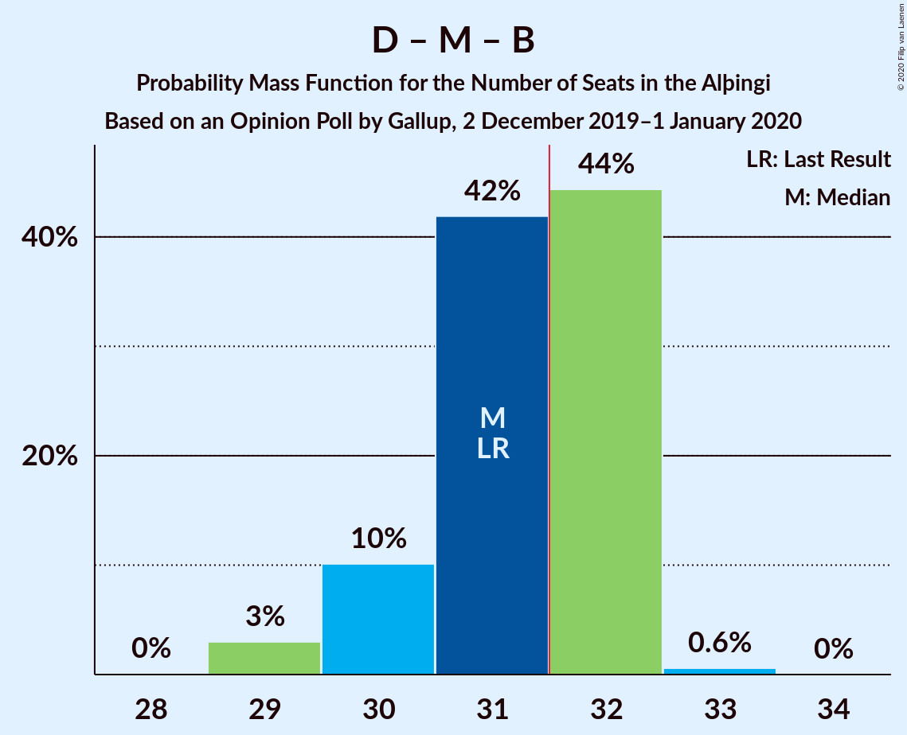

# Opinion Poll by Gallup, 2 December 2019–1 January 2020

<a href="#voting-intentions">Voting Intentions</a> | <a href="#seats">Seats</a> | <a href="#coalitions">Coalitions</a> | <a href="#technical-information">Technical Information</a>

## Voting Intentions

### Confidence Intervals

| Party | Last Result | Poll Result | 80% Confidence Interval | 90% Confidence Interval | 95% Confidence Interval | 99% Confidence Interval |
|:-----:|:-----------:|:-----------:|:-----------------------:|:-----------------------:|:-----------------------:|:-----------------------:|
| Sjálfstæðisflokkurinn | 25.2% | 22.8% | 22.0–23.6% |21.8–23.9% |21.6–24.1% |21.2–24.4% |
| Samfylkingin | 12.1% | 14.0% | 13.3–14.7% |13.2–14.8% |13.0–15.0% |12.7–15.3% |
| Miðflokkurinn | 10.9% | 12.8% | 12.1–13.4% |12.0–13.6% |11.8–13.7% |11.5–14.1% |
| Viðreisn | 6.7% | 12.1% | 11.5–12.7% |11.3–12.9% |11.1–13.0% |10.9–13.4% |
| Píratar | 9.2% | 11.3% | 10.8–12.0% |10.6–12.1% |10.5–12.3% |10.2–12.6% |
| Vinstrihreyfingin – grænt framboð | 16.9% | 10.7% | 10.2–11.4% |10.0–11.5% |9.9–11.7% |9.6–12.0% |
| Framsóknarflokkurinn | 10.7% | 8.6% | 8.1–9.2% |8.0–9.4% |7.8–9.5% |7.6–9.8% |
| Flokkur fólksins | 6.9% | 4.3% | 3.9–4.7% |3.8–4.8% |3.8–5.0% |3.6–5.2% |
| Sósíalistaflokkur Íslands | 0.0% | 3.3% | 3.0–3.7% |2.9–3.8% |2.8–3.9% |2.7–4.1% |

*Note:* The poll result column reflects the actual value used in the calculations. Published results may vary slightly, and in addition be rounded to fewer digits.

## Seats

### Confidence Intervals

| Party | Last Result | Median | 80% Confidence Interval | 90% Confidence Interval | 95% Confidence Interval | 99% Confidence Interval |
|:-----:|:-----------:|:------:|:-----------------------:|:-----------------------:|:-----------------------:|:-----------------------:|
| <a href="#sjálfstæðisflokkurinn">Sjálfstæðisflokkurinn</a> | 16 | 16 | 15–16 |15–17 |15–17 |14–17 |
| <a href="#samfylkingin">Samfylkingin</a> | 7 | 9 | 9–10 |9–10 |8–10 |8–10 |
| <a href="#miðflokkurinn">Miðflokkurinn</a> | 7 | 10 | 9–10 |9–10 |8–10 |8–10 |
| <a href="#viðreisn">Viðreisn</a> | 4 | 8 | 8 |7–9 |7–9 |7–9 |
| <a href="#píratar">Píratar</a> | 6 | 8 | 7–8 |7–8 |7–8 |7–9 |
| <a href="#vinstrihreyfingin-–-grænt-framboð">Vinstrihreyfingin – grænt framboð</a> | 11 | 7 | 6–8 |6–8 |6–8 |6–8 |
| <a href="#framsóknarflokkurinn">Framsóknarflokkurinn</a> | 8 | 6 | 5–6 |5–6 |5–6 |5–6 |
| <a href="#flokkur-fólksins">Flokkur fólksins</a> | 4 | 0 | 0 |0 |0 |0–3 |
| <a href="#sósíalistaflokkur-íslands">Sósíalistaflokkur Íslands</a> | 0 | 0 | 0 |0 |0 |0 |

### Sjálfstæðisflokkurinn

*For a full overview of the results for this party, see the [Sjálfstæðisflokkurinn](party-sjálfstæðisflokkurinn.html) page.*

| Number of Seats | Probability | Accumulated | Special Marks |
|:---------------:|:-----------:|:-----------:|:-------------:|
| 14 | 1.4% | 100% |  |
| 15 | 30% | 98.6% |  |
| 16 | 59% | 69% | Last Result, Median |
| 17 | 9% | 9% |  |
| 18 | 0% | 0% |  |

### Samfylkingin

*For a full overview of the results for this party, see the [Samfylkingin](party-samfylkingin.html) page.*

| Number of Seats | Probability | Accumulated | Special Marks |
|:---------------:|:-----------:|:-----------:|:-------------:|
| 7 | 0% | 100% | Last Result |
| 8 | 4% | 100% |  |
| 9 | 72% | 96% | Median |
| 10 | 24% | 24% |  |
| 11 | 0.3% | 0.3% |  |
| 12 | 0% | 0% |  |

### Miðflokkurinn

*For a full overview of the results for this party, see the [Miðflokkurinn](party-miðflokkurinn.html) page.*

| Number of Seats | Probability | Accumulated | Special Marks |
|:---------------:|:-----------:|:-----------:|:-------------:|
| 7 | 0.1% | 100% | Last Result |
| 8 | 3% | 99.9% |  |
| 9 | 8% | 97% |  |
| 10 | 89% | 89% | Median |
| 11 | 0% | 0% |  |

### Viðreisn

*For a full overview of the results for this party, see the [Viðreisn](party-viðreisn.html) page.*

| Number of Seats | Probability | Accumulated | Special Marks |
|:---------------:|:-----------:|:-----------:|:-------------:|
| 4 | 0% | 100% | Last Result |
| 5 | 0% | 100% |  |
| 6 | 0% | 100% |  |
| 7 | 7% | 100% |  |
| 8 | 83% | 93% | Median |
| 9 | 10% | 10% |  |
| 10 | 0% | 0% |  |

### Píratar

*For a full overview of the results for this party, see the [Píratar](party-píratar.html) page.*

| Number of Seats | Probability | Accumulated | Special Marks |
|:---------------:|:-----------:|:-----------:|:-------------:|
| 6 | 0.1% | 100% | Last Result |
| 7 | 44% | 99.9% |  |
| 8 | 56% | 56% | Median |
| 9 | 0.5% | 0.5% |  |
| 10 | 0% | 0% |  |

### Vinstrihreyfingin – grænt framboð

*For a full overview of the results for this party, see the [Vinstrihreyfingin – grænt framboð](party-vinstrihreyfingin–græntframboð.html) page.*

| Number of Seats | Probability | Accumulated | Special Marks |
|:---------------:|:-----------:|:-----------:|:-------------:|
| 6 | 27% | 100% |  |
| 7 | 61% | 73% | Median |
| 8 | 11% | 11% |  |
| 9 | 0% | 0% |  |
| 10 | 0% | 0% |  |
| 11 | 0% | 0% | Last Result |

### Framsóknarflokkurinn

*For a full overview of the results for this party, see the [Framsóknarflokkurinn](party-framsóknarflokkurinn.html) page.*

| Number of Seats | Probability | Accumulated | Special Marks |
|:---------------:|:-----------:|:-----------:|:-------------:|
| 5 | 34% | 100% |  |
| 6 | 66% | 66% | Median |
| 7 | 0.1% | 0.1% |  |
| 8 | 0% | 0% | Last Result |

### Flokkur fólksins

*For a full overview of the results for this party, see the [Flokkur fólksins](party-flokkurfólksins.html) page.*

| Number of Seats | Probability | Accumulated | Special Marks |
|:---------------:|:-----------:|:-----------:|:-------------:|
| 0 | 98% | 100% | Median |
| 1 | 0% | 2% |  |
| 2 | 0% | 2% |  |
| 3 | 2% | 2% |  |
| 4 | 0% | 0% | Last Result |

### Sósíalistaflokkur Íslands

*For a full overview of the results for this party, see the [Sósíalistaflokkur Íslands](party-sósíalistaflokkuríslands.html) page.*

| Number of Seats | Probability | Accumulated | Special Marks |
|:---------------:|:-----------:|:-----------:|:-------------:|
| 0 | 100% | 100% | Last Result, Median |

## Coalitions

### Confidence Intervals

| Coalition | Last Result | Median | Majority? | 80% Confidence Interval | 90% Confidence Interval | 95% Confidence Interval | 99% Confidence Interval |
|:---------:|:-----------:|:------:|:---------:|:-----------------------:|:-----------------------:|:-----------------------:|:-----------------------:|
| Samfylkingin – Viðreisn – Píratar – Vinstrihreyfingin – grænt framboð | 28 | 32 | 53% | 31–33 | 31–33 | 30–34 | 30–34 |
| Samfylkingin – Miðflokkurinn – Vinstrihreyfingin – grænt framboð – Framsóknarflokkurinn | 33 | 31 | 48% | 31–33 | 31–33 | 30–33 | 30–34 |
| Sjálfstæðisflokkurinn – Miðflokkurinn – Framsóknarflokkurinn | 31 | 31 | 45% | 30–32 | 30–32 | 29–32 | 29–33 |
| Sjálfstæðisflokkurinn – Vinstrihreyfingin – grænt framboð – Framsóknarflokkurinn | 35 | 28 | 0% | 28–29 | 27–29 | 27–29 | 27–30 |
| Samfylkingin – Miðflokkurinn – Vinstrihreyfingin – grænt framboð | 25 | 26 | 0% | 25–27 | 25–27 | 25–27 | 25–28 |
| Sjálfstæðisflokkurinn – Miðflokkurinn | 23 | 26 | 0% | 25–26 | 24–27 | 24–27 | 23–27 |
| Sjálfstæðisflokkurinn – Samfylkingin | 23 | 25 | 0% | 24–26 | 24–26 | 24–26 | 23–26 |
| Samfylkingin – Píratar – Vinstrihreyfingin – grænt framboð | 24 | 23 | 0% | 23–25 | 23–25 | 23–25 | 22–25 |
| Sjálfstæðisflokkurinn – Viðreisn | 20 | 24 | 0% | 23–25 | 23–25 | 22–25 | 22–25 |
| Sjálfstæðisflokkurinn – Vinstrihreyfingin – grænt framboð | 27 | 23 | 0% | 22–24 | 22–24 | 22–24 | 21–24 |
| Miðflokkurinn – Vinstrihreyfingin – grænt framboð – Framsóknarflokkurinn | 26 | 22 | 0% | 22–23 | 21–24 | 21–24 | 20–24 |
| Samfylkingin – Vinstrihreyfingin – grænt framboð – Framsóknarflokkurinn | 26 | 22 | 0% | 21–23 | 21–23 | 21–23 | 20–24 |
| Sjálfstæðisflokkurinn – Framsóknarflokkurinn | 24 | 21 | 0% | 21–22 | 20–22 | 20–22 | 20–23 |
| Miðflokkurinn – Vinstrihreyfingin – grænt framboð | 18 | 17 | 0% | 16–17 | 16–18 | 15–18 | 15–18 |
| Samfylkingin – Vinstrihreyfingin – grænt framboð | 18 | 16 | 0% | 15–17 | 15–17 | 15–18 | 15–18 |
| Píratar – Vinstrihreyfingin – grænt framboð | 17 | 14 | 0% | 14–15 | 14–15 | 14–16 | 13–16 |
| Vinstrihreyfingin – grænt framboð – Framsóknarflokkurinn | 19 | 12 | 0% | 12–13 | 12–14 | 12–14 | 11–14 |

### Samfylkingin – Viðreisn – Píratar – Vinstrihreyfingin – grænt framboð

| Number of Seats | Probability | Accumulated | Special Marks |
|:---------------:|:-----------:|:-----------:|:-------------:|
| 28 | 0% | 100% | Last Result |
| 29 | 0% | 100% |  |
| 30 | 2% | 100% |  |
| 31 | 45% | 97% |  |
| 32 | 42% | 53% | Median, Majority |
| 33 | 8% | 11% |  |
| 34 | 3% | 3% |  |
| 35 | 0% | 0% |  |

### Samfylkingin – Miðflokkurinn – Vinstrihreyfingin – grænt framboð – Framsóknarflokkurinn

| Number of Seats | Probability | Accumulated | Special Marks |
|:---------------:|:-----------:|:-----------:|:-------------:|
| 29 | 0.1% | 100% |  |
| 30 | 3% | 99.9% |  |
| 31 | 48% | 97% |  |
| 32 | 37% | 48% | Median, Majority |
| 33 | 10% | 11% | Last Result |
| 34 | 0.8% | 0.8% |  |
| 35 | 0% | 0% |  |

### Sjálfstæðisflokkurinn – Miðflokkurinn – Framsóknarflokkurinn

| Number of Seats | Probability | Accumulated | Special Marks |
|:---------------:|:-----------:|:-----------:|:-------------:|
| 29 | 3% | 100% |  |
| 30 | 10% | 97% |  |
| 31 | 42% | 87% | Last Result |
| 32 | 44% | 45% | Median, Majority |
| 33 | 0.6% | 0.6% |  |
| 34 | 0% | 0% |  |

### Sjálfstæðisflokkurinn – Vinstrihreyfingin – grænt framboð – Framsóknarflokkurinn

| Number of Seats | Probability | Accumulated | Special Marks |
|:---------------:|:-----------:|:-----------:|:-------------:|
| 25 | 0.2% | 100% |  |
| 26 | 0.3% | 99.8% |  |
| 27 | 6% | 99.5% |  |
| 28 | 62% | 94% |  |
| 29 | 30% | 31% | Median |
| 30 | 2% | 2% |  |
| 31 | 0.1% | 0.1% |  |
| 32 | 0% | 0% | Majority |
| 33 | 0% | 0% |  |
| 34 | 0% | 0% |  |
| 35 | 0% | 0% | Last Result |

### Samfylkingin – Miðflokkurinn – Vinstrihreyfingin – grænt framboð

| Number of Seats | Probability | Accumulated | Special Marks |
|:---------------:|:-----------:|:-----------:|:-------------:|
| 24 | 0.2% | 100% |  |
| 25 | 34% | 99.7% | Last Result |
| 26 | 41% | 65% | Median |
| 27 | 23% | 24% |  |
| 28 | 2% | 2% |  |
| 29 | 0% | 0% |  |

### Sjálfstæðisflokkurinn – Miðflokkurinn

| Number of Seats | Probability | Accumulated | Special Marks |
|:---------------:|:-----------:|:-----------:|:-------------:|
| 23 | 0.6% | 100% | Last Result |
| 24 | 6% | 99.4% |  |
| 25 | 33% | 94% |  |
| 26 | 52% | 61% | Median |
| 27 | 9% | 9% |  |
| 28 | 0% | 0% |  |

### Sjálfstæðisflokkurinn – Samfylkingin

| Number of Seats | Probability | Accumulated | Special Marks |
|:---------------:|:-----------:|:-----------:|:-------------:|
| 23 | 1.3% | 100% | Last Result |
| 24 | 24% | 98.7% |  |
| 25 | 50% | 75% | Median |
| 26 | 25% | 25% |  |
| 27 | 0.1% | 0.1% |  |
| 28 | 0% | 0% |  |

### Samfylkingin – Píratar – Vinstrihreyfingin – grænt framboð

| Number of Seats | Probability | Accumulated | Special Marks |
|:---------------:|:-----------:|:-----------:|:-------------:|
| 22 | 2% | 100% |  |
| 23 | 48% | 98% |  |
| 24 | 37% | 50% | Last Result, Median |
| 25 | 12% | 13% |  |
| 26 | 0.4% | 0.4% |  |
| 27 | 0% | 0% |  |

### Sjálfstæðisflokkurinn – Viðreisn

| Number of Seats | Probability | Accumulated | Special Marks |
|:---------------:|:-----------:|:-----------:|:-------------:|
| 20 | 0% | 100% | Last Result |
| 21 | 0.1% | 100% |  |
| 22 | 3% | 99.9% |  |
| 23 | 29% | 97% |  |
| 24 | 54% | 68% | Median |
| 25 | 14% | 14% |  |
| 26 | 0% | 0% |  |

### Sjálfstæðisflokkurinn – Vinstrihreyfingin – grænt framboð

| Number of Seats | Probability | Accumulated | Special Marks |
|:---------------:|:-----------:|:-----------:|:-------------:|
| 20 | 0.2% | 100% |  |
| 21 | 2% | 99.8% |  |
| 22 | 47% | 98% |  |
| 23 | 38% | 51% | Median |
| 24 | 12% | 12% |  |
| 25 | 0.2% | 0.2% |  |
| 26 | 0% | 0% |  |
| 27 | 0% | 0% | Last Result |

### Miðflokkurinn – Vinstrihreyfingin – grænt framboð – Framsóknarflokkurinn

| Number of Seats | Probability | Accumulated | Special Marks |
|:---------------:|:-----------:|:-----------:|:-------------:|
| 20 | 2% | 100% |  |
| 21 | 4% | 98% |  |
| 22 | 57% | 94% |  |
| 23 | 30% | 37% | Median |
| 24 | 7% | 7% |  |
| 25 | 0% | 0% |  |
| 26 | 0% | 0% | Last Result |

### Samfylkingin – Vinstrihreyfingin – grænt framboð – Framsóknarflokkurinn

| Number of Seats | Probability | Accumulated | Special Marks |
|:---------------:|:-----------:|:-----------:|:-------------:|
| 20 | 1.0% | 100% |  |
| 21 | 43% | 99.0% |  |
| 22 | 40% | 55% | Median |
| 23 | 14% | 15% |  |
| 24 | 0.9% | 0.9% |  |
| 25 | 0% | 0% |  |
| 26 | 0% | 0% | Last Result |

### Sjálfstæðisflokkurinn – Framsóknarflokkurinn

| Number of Seats | Probability | Accumulated | Special Marks |
|:---------------:|:-----------:|:-----------:|:-------------:|
| 19 | 0.3% | 100% |  |
| 20 | 7% | 99.7% |  |
| 21 | 43% | 93% |  |
| 22 | 49% | 50% | Median |
| 23 | 0.8% | 0.8% |  |
| 24 | 0% | 0% | Last Result |

### Miðflokkurinn – Vinstrihreyfingin – grænt framboð

| Number of Seats | Probability | Accumulated | Special Marks |
|:---------------:|:-----------:|:-----------:|:-------------:|
| 14 | 0.1% | 100% |  |
| 15 | 4% | 99.9% |  |
| 16 | 31% | 96% |  |
| 17 | 56% | 65% | Median |
| 18 | 9% | 9% | Last Result |
| 19 | 0% | 0% |  |

### Samfylkingin – Vinstrihreyfingin – grænt framboð

| Number of Seats | Probability | Accumulated | Special Marks |
|:---------------:|:-----------:|:-----------:|:-------------:|
| 15 | 28% | 100% |  |
| 16 | 42% | 72% | Median |
| 17 | 27% | 30% |  |
| 18 | 3% | 3% | Last Result |
| 19 | 0% | 0% |  |

### Píratar – Vinstrihreyfingin – grænt framboð

| Number of Seats | Probability | Accumulated | Special Marks |
|:---------------:|:-----------:|:-----------:|:-------------:|
| 13 | 2% | 100% |  |
| 14 | 59% | 98% |  |
| 15 | 36% | 39% | Median |
| 16 | 3% | 3% |  |
| 17 | 0% | 0% | Last Result |

### Vinstrihreyfingin – grænt framboð – Framsóknarflokkurinn

| Number of Seats | Probability | Accumulated | Special Marks |
|:---------------:|:-----------:|:-----------:|:-------------:|
| 11 | 0.7% | 100% |  |
| 12 | 57% | 99.3% |  |
| 13 | 35% | 43% | Median |
| 14 | 7% | 7% |  |
| 15 | 0% | 0% |  |
| 16 | 0% | 0% |  |
| 17 | 0% | 0% |  |
| 18 | 0% | 0% |  |
| 19 | 0% | 0% | Last Result |

## Technical Information

### Opinion Poll

+ **Polling firm:** Gallup
+ **Commissioner(s):** —
+ **Fieldwork period:** 2 December 2019–1 January 2020

### Calculations

+ **Sample size:** 4494
+ **Simulations done:** 1,048,576
+ **Error estimate:** 0.67%

