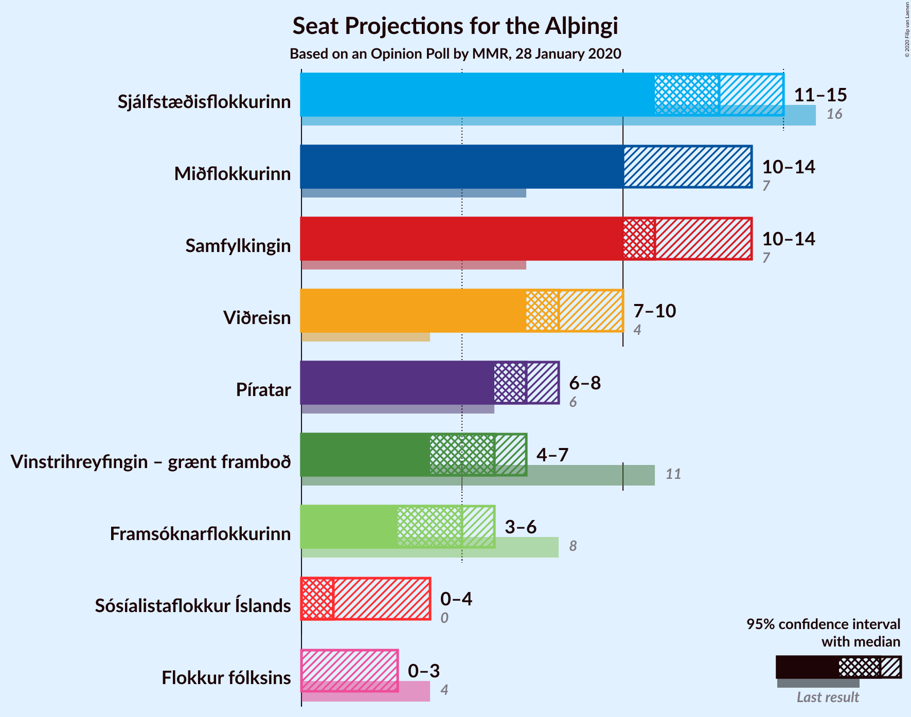
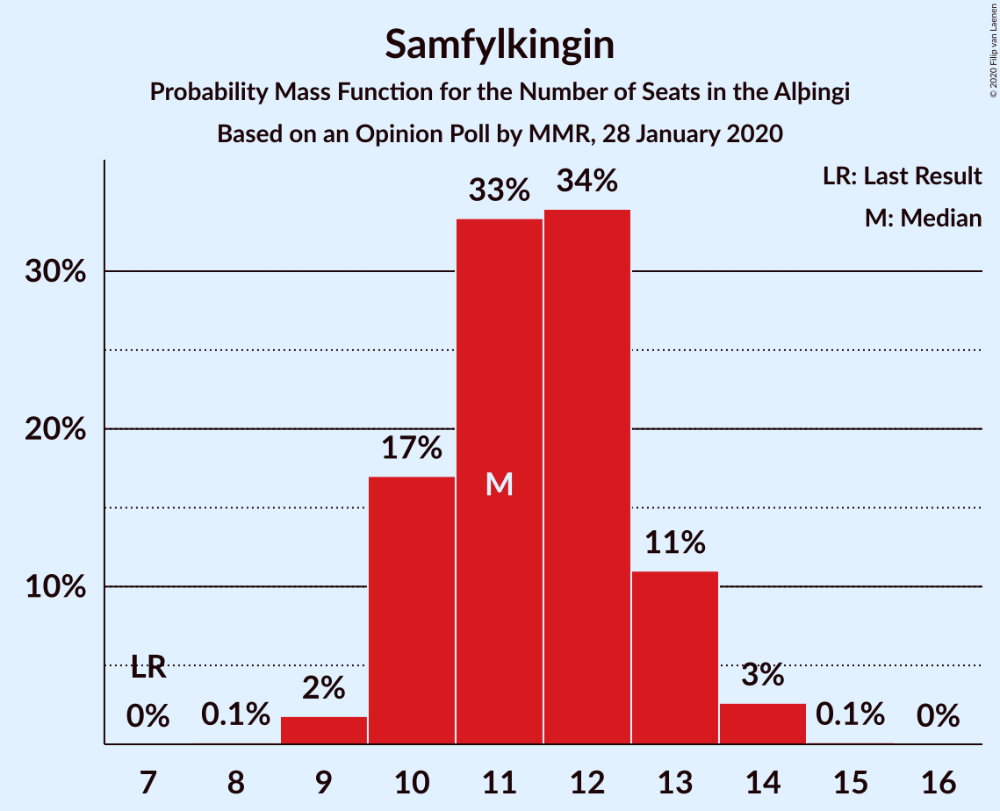
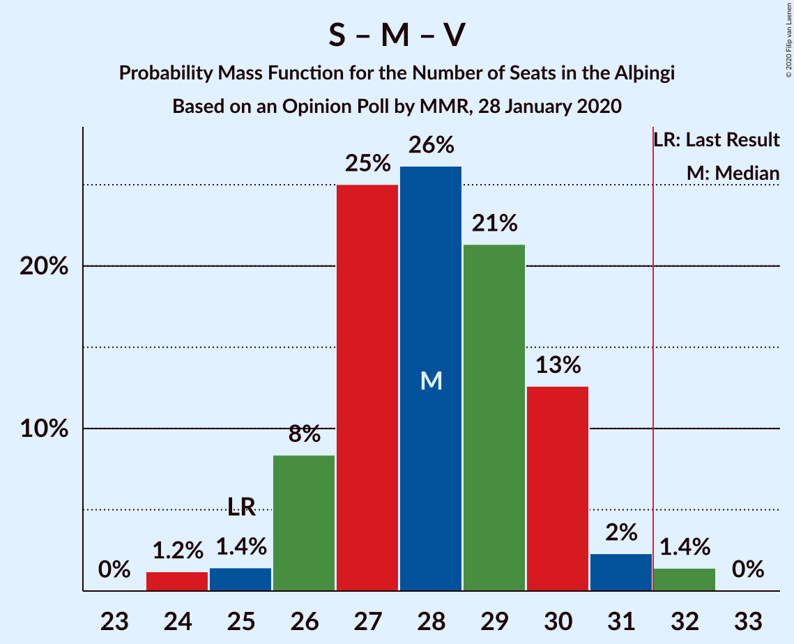
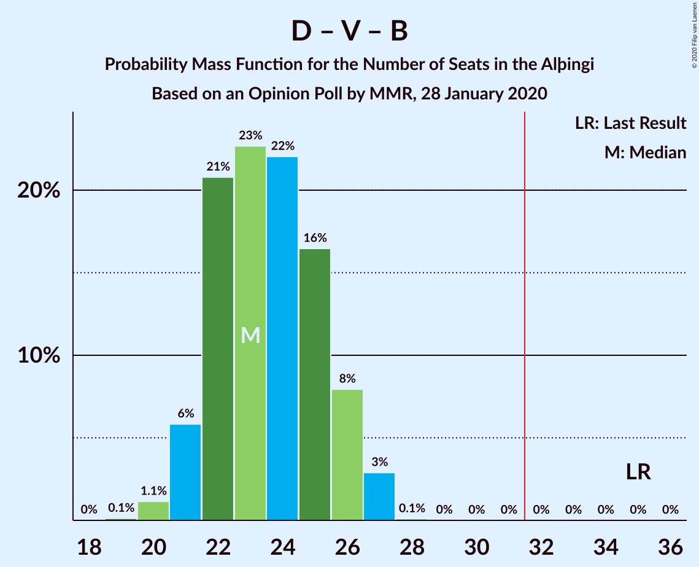
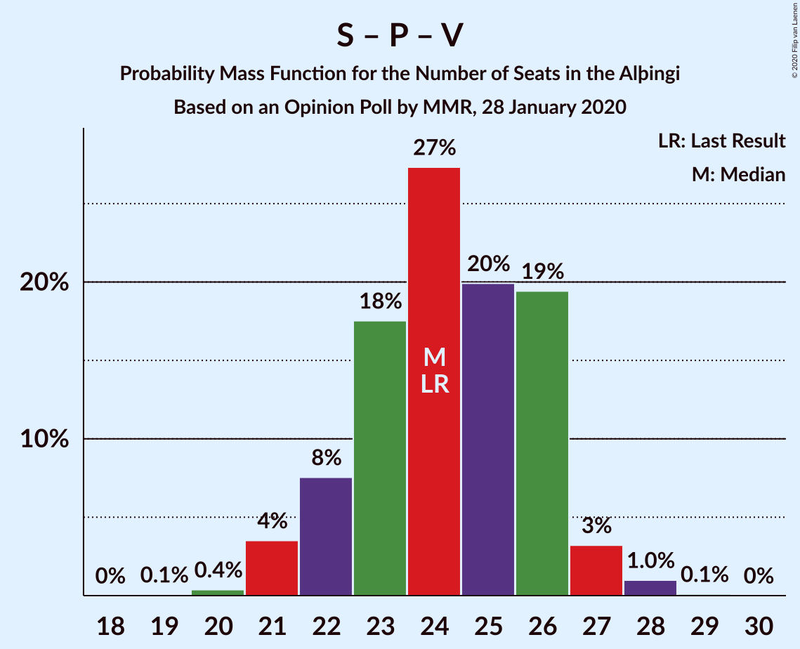

# Opinion Poll by MMR, 28 January 2020

<a href="#voting-intentions">Voting Intentions</a> | <a href="#seats">Seats</a> | <a href="#coalitions">Coalitions</a> | <a href="#technical-information">Technical Information</a>

## Voting Intentions

### Confidence Intervals

| Party | Last Result | Poll Result | 80% Confidence Interval | 90% Confidence Interval | 95% Confidence Interval | 99% Confidence Interval |
|:-----:|:-----------:|:-----------:|:-----------------------:|:-----------------------:|:-----------------------:|:-----------------------:|
| Sjálfstæðisflokkurinn | 25.2% | 19.0% | 17.4–20.8% |17.0–21.3% |16.6–21.7% |15.9–22.6% |
| Samfylkingin | 12.1% | 16.6% | 15.1–18.3% |14.7–18.7% |14.3–19.2% |13.6–20.0% |
| Miðflokkurinn | 10.9% | 15.1% | 13.6–16.7% |13.2–17.1% |12.9–17.5% |12.2–18.3% |
| Viðreisn | 6.7% | 12.4% | 11.1–13.9% |10.7–14.3% |10.4–14.7% |9.8–15.5% |
| Píratar | 9.2% | 10.5% | 9.3–12.0% |9.0–12.4% |8.7–12.7% |8.2–13.4% |
| Vinstrihreyfingin – grænt framboð | 16.9% | 8.7% | 7.6–10.0% |7.3–10.4% |7.0–10.7% |6.5–11.4% |
| Framsóknarflokkurinn | 10.7% | 7.1% | 6.2–8.4% |5.9–8.7% |5.6–9.0% |5.2–9.6% |
| Sósíalistaflokkur Íslands | 0.0% | 4.9% | 4.1–6.0% |3.9–6.3% |3.7–6.6% |3.4–7.1% |
| Flokkur fólksins | 6.9% | 3.8% | 3.1–4.8% |2.9–5.1% |2.8–5.3% |2.5–5.8% |

*Note:* The poll result column reflects the actual value used in the calculations. Published results may vary slightly, and in addition be rounded to fewer digits.

## Seats

### Confidence Intervals

| Party | Last Result | Median | 80% Confidence Interval | 90% Confidence Interval | 95% Confidence Interval | 99% Confidence Interval |
|:-----:|:-----------:|:------:|:-----------------------:|:-----------------------:|:-----------------------:|:-----------------------:|
| <a href="#sjálfstæðisflokkurinn">Sjálfstæðisflokkurinn</a> | 16 | 13 | 12–15 |11–15 |11–15 |11–16 |
| <a href="#samfylkingin">Samfylkingin</a> | 7 | 11 | 10–13 |10–13 |10–14 |9–14 |
| <a href="#miðflokkurinn">Miðflokkurinn</a> | 7 | 10 | 10–12 |10–13 |10–14 |9–14 |
| <a href="#viðreisn">Viðreisn</a> | 4 | 8 | 7–9 |7–10 |7–10 |6–11 |
| <a href="#píratar">Píratar</a> | 6 | 7 | 6–8 |6–8 |6–8 |5–9 |
| <a href="#vinstrihreyfingin-–-grænt-framboð">Vinstrihreyfingin – grænt framboð</a> | 11 | 6 | 5–7 |5–7 |4–7 |4–8 |
| <a href="#framsóknarflokkurinn">Framsóknarflokkurinn</a> | 8 | 5 | 4–6 |4–6 |3–6 |3–7 |
| <a href="#sósíalistaflokkur-íslands">Sósíalistaflokkur Íslands</a> | 0 | 1 | 0–4 |0–4 |0–4 |0–4 |
| <a href="#flokkur-fólksins">Flokkur fólksins</a> | 4 | 0 | 0 |0–1 |0–3 |0–3 |

### Sjálfstæðisflokkurinn

*For a full overview of the results for this party, see the [Sjálfstæðisflokkurinn](party-sjálfstæðisflokkurinn.html) page.*

| Number of Seats | Probability | Accumulated | Special Marks |
|:---------------:|:-----------:|:-----------:|:-------------:|
| 10 | 0.4% | 100% |  |
| 11 | 5% | 99.6% |  |
| 12 | 19% | 94% |  |
| 13 | 44% | 75% | Median |
| 14 | 21% | 31% |  |
| 15 | 9% | 10% |  |
| 16 | 0.8% | 0.9% | Last Result |
| 17 | 0% | 0% |  |

### Samfylkingin

*For a full overview of the results for this party, see the [Samfylkingin](party-samfylkingin.html) page.*

| Number of Seats | Probability | Accumulated | Special Marks |
|:---------------:|:-----------:|:-----------:|:-------------:|
| 7 | 0% | 100% | Last Result |
| 8 | 0.1% | 100% |  |
| 9 | 2% | 99.9% |  |
| 10 | 17% | 98% |  |
| 11 | 33% | 81% | Median |
| 12 | 34% | 48% |  |
| 13 | 11% | 14% |  |
| 14 | 3% | 3% |  |
| 15 | 0.1% | 0.1% |  |
| 16 | 0% | 0% |  |

### Miðflokkurinn

*For a full overview of the results for this party, see the [Miðflokkurinn](party-miðflokkurinn.html) page.*

| Number of Seats | Probability | Accumulated | Special Marks |
|:---------------:|:-----------:|:-----------:|:-------------:|
| 7 | 0% | 100% | Last Result |
| 8 | 0.4% | 100% |  |
| 9 | 1.2% | 99.6% |  |
| 10 | 49% | 98% | Median |
| 11 | 22% | 49% |  |
| 12 | 20% | 28% |  |
| 13 | 4% | 8% |  |
| 14 | 4% | 4% |  |
| 15 | 0% | 0% |  |

### Viðreisn

*For a full overview of the results for this party, see the [Viðreisn](party-viðreisn.html) page.*

| Number of Seats | Probability | Accumulated | Special Marks |
|:---------------:|:-----------:|:-----------:|:-------------:|
| 4 | 0% | 100% | Last Result |
| 5 | 0.1% | 100% |  |
| 6 | 1.0% | 99.9% |  |
| 7 | 11% | 98.9% |  |
| 8 | 47% | 87% | Median |
| 9 | 34% | 41% |  |
| 10 | 6% | 7% |  |
| 11 | 1.3% | 1.3% |  |
| 12 | 0% | 0% |  |

### Píratar

*For a full overview of the results for this party, see the [Píratar](party-píratar.html) page.*

| Number of Seats | Probability | Accumulated | Special Marks |
|:---------------:|:-----------:|:-----------:|:-------------:|
| 5 | 2% | 100% |  |
| 6 | 22% | 98% | Last Result |
| 7 | 47% | 77% | Median |
| 8 | 28% | 30% |  |
| 9 | 2% | 2% |  |
| 10 | 0.1% | 0.1% |  |
| 11 | 0% | 0% |  |

### Vinstrihreyfingin – grænt framboð

*For a full overview of the results for this party, see the [Vinstrihreyfingin – grænt framboð](party-vinstrihreyfingin–græntframboð.html) page.*

| Number of Seats | Probability | Accumulated | Special Marks |
|:---------------:|:-----------:|:-----------:|:-------------:|
| 4 | 4% | 100% |  |
| 5 | 32% | 96% |  |
| 6 | 48% | 64% | Median |
| 7 | 16% | 16% |  |
| 8 | 0.5% | 0.5% |  |
| 9 | 0% | 0% |  |
| 10 | 0% | 0% |  |
| 11 | 0% | 0% | Last Result |

### Framsóknarflokkurinn

*For a full overview of the results for this party, see the [Framsóknarflokkurinn](party-framsóknarflokkurinn.html) page.*

| Number of Seats | Probability | Accumulated | Special Marks |
|:---------------:|:-----------:|:-----------:|:-------------:|
| 2 | 0.2% | 100% |  |
| 3 | 4% | 99.8% |  |
| 4 | 39% | 96% |  |
| 5 | 44% | 57% | Median |
| 6 | 12% | 13% |  |
| 7 | 0.7% | 0.7% |  |
| 8 | 0% | 0% | Last Result |

### Sósíalistaflokkur Íslands

*For a full overview of the results for this party, see the [Sósíalistaflokkur Íslands](party-sósíalistaflokkuríslands.html) page.*

| Number of Seats | Probability | Accumulated | Special Marks |
|:---------------:|:-----------:|:-----------:|:-------------:|
| 0 | 50% | 100% | Last Result |
| 1 | 4% | 50% | Median |
| 2 | 0% | 46% |  |
| 3 | 33% | 46% |  |
| 4 | 13% | 13% |  |
| 5 | 0.2% | 0.2% |  |
| 6 | 0% | 0% |  |

### Flokkur fólksins

*For a full overview of the results for this party, see the [Flokkur fólksins](party-flokkurfólksins.html) page.*

| Number of Seats | Probability | Accumulated | Special Marks |
|:---------------:|:-----------:|:-----------:|:-------------:|
| 0 | 95% | 100% | Median |
| 1 | 0.2% | 5% |  |
| 2 | 0% | 5% |  |
| 3 | 5% | 5% |  |
| 4 | 0.3% | 0.3% | Last Result |
| 5 | 0% | 0% |  |

## Coalitions

### Confidence Intervals

| Coalition | Last Result | Median | Majority? | 80% Confidence Interval | 90% Confidence Interval | 95% Confidence Interval | 99% Confidence Interval |
|:---------:|:-----------:|:------:|:---------:|:-----------------------:|:-----------------------:|:-----------------------:|:-----------------------:|
| Samfylkingin – Miðflokkurinn – Vinstrihreyfingin – grænt framboð – Framsóknarflokkurinn | 33 | 33 | 80% | 31–35 | 30–35 | 30–35 | 28–37 |
| Samfylkingin – Viðreisn – Píratar – Vinstrihreyfingin – grænt framboð | 28 | 33 | 76% | 30–35 | 30–35 | 29–35 | 28–36 |
| Sjálfstæðisflokkurinn – Miðflokkurinn – Framsóknarflokkurinn | 31 | 29 | 2% | 26–31 | 26–31 | 26–31 | 25–32 |
| Samfylkingin – Miðflokkurinn – Vinstrihreyfingin – grænt framboð | 25 | 28 | 1.5% | 26–30 | 26–30 | 25–31 | 24–32 |
| Sjálfstæðisflokkurinn – Samfylkingin | 23 | 25 | 0% | 23–26 | 22–27 | 22–27 | 21–28 |
| Sjálfstæðisflokkurinn – Vinstrihreyfingin – grænt framboð – Framsóknarflokkurinn | 35 | 23 | 0% | 22–26 | 21–26 | 21–27 | 20–27 |
| Samfylkingin – Píratar – Vinstrihreyfingin – grænt framboð | 24 | 24 | 0% | 22–26 | 22–26 | 21–27 | 21–28 |
| Sjálfstæðisflokkurinn – Miðflokkurinn | 23 | 24 | 0% | 22–26 | 22–26 | 22–26 | 21–27 |
| Samfylkingin – Vinstrihreyfingin – grænt framboð – Framsóknarflokkurinn | 26 | 22 | 0% | 20–23 | 19–24 | 19–25 | 18–25 |
| Miðflokkurinn – Vinstrihreyfingin – grænt framboð – Framsóknarflokkurinn | 26 | 21 | 0% | 20–23 | 19–24 | 19–24 | 18–25 |
| Sjálfstæðisflokkurinn – Viðreisn | 20 | 22 | 0% | 20–23 | 19–23 | 19–24 | 18–25 |
| Sjálfstæðisflokkurinn – Vinstrihreyfingin – grænt framboð | 27 | 19 | 0% | 17–21 | 17–21 | 16–21 | 16–22 |
| Sjálfstæðisflokkurinn – Framsóknarflokkurinn | 24 | 18 | 0% | 16–19 | 16–20 | 15–20 | 14–21 |
| Samfylkingin – Vinstrihreyfingin – grænt framboð | 18 | 17 | 0% | 16–19 | 15–19 | 14–20 | 14–20 |
| Miðflokkurinn – Vinstrihreyfingin – grænt framboð | 18 | 16 | 0% | 15–19 | 15–19 | 15–19 | 14–20 |
| Píratar – Vinstrihreyfingin – grænt framboð | 17 | 13 | 0% | 11–14 | 11–15 | 11–15 | 10–15 |
| Vinstrihreyfingin – grænt framboð – Framsóknarflokkurinn | 19 | 10 | 0% | 9–12 | 9–12 | 8–12 | 8–13 |

### Samfylkingin – Miðflokkurinn – Vinstrihreyfingin – grænt framboð – Framsóknarflokkurinn

| Number of Seats | Probability | Accumulated | Special Marks |
|:---------------:|:-----------:|:-----------:|:-------------:|
| 28 | 1.1% | 100% |  |
| 29 | 0.7% | 98.9% |  |
| 30 | 4% | 98% |  |
| 31 | 14% | 94% |  |
| 32 | 27% | 80% | Median, Majority |
| 33 | 17% | 53% | Last Result |
| 34 | 25% | 36% |  |
| 35 | 9% | 11% |  |
| 36 | 2% | 2% |  |
| 37 | 0.5% | 0.5% |  |
| 38 | 0.1% | 0.1% |  |
| 39 | 0% | 0% |  |

### Samfylkingin – Viðreisn – Píratar – Vinstrihreyfingin – grænt framboð

| Number of Seats | Probability | Accumulated | Special Marks |
|:---------------:|:-----------:|:-----------:|:-------------:|
| 27 | 0.1% | 100% |  |
| 28 | 2% | 99.9% | Last Result |
| 29 | 1.3% | 98% |  |
| 30 | 7% | 97% |  |
| 31 | 13% | 89% |  |
| 32 | 21% | 76% | Median, Majority |
| 33 | 22% | 56% |  |
| 34 | 22% | 33% |  |
| 35 | 9% | 11% |  |
| 36 | 2% | 2% |  |
| 37 | 0.4% | 0.4% |  |
| 38 | 0% | 0% |  |

### Sjálfstæðisflokkurinn – Miðflokkurinn – Framsóknarflokkurinn

| Number of Seats | Probability | Accumulated | Special Marks |
|:---------------:|:-----------:|:-----------:|:-------------:|
| 24 | 0.2% | 100% |  |
| 25 | 0.5% | 99.8% |  |
| 26 | 11% | 99.3% |  |
| 27 | 9% | 89% |  |
| 28 | 23% | 80% | Median |
| 29 | 28% | 56% |  |
| 30 | 18% | 29% |  |
| 31 | 9% | 11% | Last Result |
| 32 | 1.3% | 2% | Majority |
| 33 | 0.2% | 0.3% |  |
| 34 | 0% | 0% |  |

### Samfylkingin – Miðflokkurinn – Vinstrihreyfingin – grænt framboð

| Number of Seats | Probability | Accumulated | Special Marks |
|:---------------:|:-----------:|:-----------:|:-------------:|
| 24 | 1.2% | 100% |  |
| 25 | 1.4% | 98.8% | Last Result |
| 26 | 8% | 97% |  |
| 27 | 25% | 89% | Median |
| 28 | 26% | 64% |  |
| 29 | 21% | 38% |  |
| 30 | 13% | 16% |  |
| 31 | 2% | 4% |  |
| 32 | 1.4% | 1.5% | Majority |
| 33 | 0% | 0% |  |

### Sjálfstæðisflokkurinn – Samfylkingin

| Number of Seats | Probability | Accumulated | Special Marks |
|:---------------:|:-----------:|:-----------:|:-------------:|
| 20 | 0.2% | 100% |  |
| 21 | 2% | 99.8% |  |
| 22 | 5% | 98% |  |
| 23 | 14% | 93% | Last Result |
| 24 | 27% | 79% | Median |
| 25 | 27% | 52% |  |
| 26 | 17% | 25% |  |
| 27 | 6% | 7% |  |
| 28 | 1.4% | 1.5% |  |
| 29 | 0.1% | 0.1% |  |
| 30 | 0% | 0% |  |

### Sjálfstæðisflokkurinn – Vinstrihreyfingin – grænt framboð – Framsóknarflokkurinn

| Number of Seats | Probability | Accumulated | Special Marks |
|:---------------:|:-----------:|:-----------:|:-------------:|
| 19 | 0.1% | 100% |  |
| 20 | 1.1% | 99.9% |  |
| 21 | 6% | 98.7% |  |
| 22 | 21% | 93% |  |
| 23 | 23% | 72% |  |
| 24 | 22% | 49% | Median |
| 25 | 16% | 27% |  |
| 26 | 8% | 11% |  |
| 27 | 3% | 3% |  |
| 28 | 0.1% | 0.1% |  |
| 29 | 0% | 0% |  |
| 30 | 0% | 0% |  |
| 31 | 0% | 0% |  |
| 32 | 0% | 0% | Majority |
| 33 | 0% | 0% |  |
| 34 | 0% | 0% |  |
| 35 | 0% | 0% | Last Result |

### Samfylkingin – Píratar – Vinstrihreyfingin – grænt framboð

| Number of Seats | Probability | Accumulated | Special Marks |
|:---------------:|:-----------:|:-----------:|:-------------:|
| 19 | 0.1% | 100% |  |
| 20 | 0.4% | 99.9% |  |
| 21 | 4% | 99.6% |  |
| 22 | 8% | 96% |  |
| 23 | 18% | 88% |  |
| 24 | 27% | 71% | Last Result, Median |
| 25 | 20% | 44% |  |
| 26 | 19% | 24% |  |
| 27 | 3% | 4% |  |
| 28 | 1.0% | 1.1% |  |
| 29 | 0.1% | 0.1% |  |
| 30 | 0% | 0% |  |

### Sjálfstæðisflokkurinn – Miðflokkurinn

| Number of Seats | Probability | Accumulated | Special Marks |
|:---------------:|:-----------:|:-----------:|:-------------:|
| 20 | 0.1% | 100% |  |
| 21 | 2% | 99.9% |  |
| 22 | 14% | 98% |  |
| 23 | 22% | 84% | Last Result, Median |
| 24 | 24% | 63% |  |
| 25 | 26% | 38% |  |
| 26 | 10% | 12% |  |
| 27 | 2% | 2% |  |
| 28 | 0.3% | 0.4% |  |
| 29 | 0% | 0.1% |  |
| 30 | 0% | 0% |  |

### Samfylkingin – Vinstrihreyfingin – grænt framboð – Framsóknarflokkurinn

| Number of Seats | Probability | Accumulated | Special Marks |
|:---------------:|:-----------:|:-----------:|:-------------:|
| 17 | 0.1% | 100% |  |
| 18 | 2% | 99.9% |  |
| 19 | 5% | 98% |  |
| 20 | 11% | 94% |  |
| 21 | 17% | 82% |  |
| 22 | 30% | 65% | Median |
| 23 | 25% | 35% |  |
| 24 | 7% | 10% |  |
| 25 | 3% | 3% |  |
| 26 | 0.2% | 0.2% | Last Result |
| 27 | 0% | 0% |  |

### Miðflokkurinn – Vinstrihreyfingin – grænt framboð – Framsóknarflokkurinn

| Number of Seats | Probability | Accumulated | Special Marks |
|:---------------:|:-----------:|:-----------:|:-------------:|
| 17 | 0.1% | 100% |  |
| 18 | 2% | 99.9% |  |
| 19 | 7% | 98% |  |
| 20 | 23% | 92% |  |
| 21 | 24% | 69% | Median |
| 22 | 26% | 45% |  |
| 23 | 12% | 19% |  |
| 24 | 7% | 7% |  |
| 25 | 0.6% | 0.8% |  |
| 26 | 0.1% | 0.1% | Last Result |
| 27 | 0% | 0% |  |

### Sjálfstæðisflokkurinn – Viðreisn

| Number of Seats | Probability | Accumulated | Special Marks |
|:---------------:|:-----------:|:-----------:|:-------------:|
| 17 | 0.1% | 100% |  |
| 18 | 2% | 99.9% |  |
| 19 | 3% | 98% |  |
| 20 | 20% | 95% | Last Result |
| 21 | 24% | 75% | Median |
| 22 | 31% | 52% |  |
| 23 | 16% | 20% |  |
| 24 | 2% | 4% |  |
| 25 | 2% | 2% |  |
| 26 | 0.1% | 0.1% |  |
| 27 | 0% | 0% |  |

### Sjálfstæðisflokkurinn – Vinstrihreyfingin – grænt framboð

| Number of Seats | Probability | Accumulated | Special Marks |
|:---------------:|:-----------:|:-----------:|:-------------:|
| 15 | 0.3% | 100% |  |
| 16 | 3% | 99.7% |  |
| 17 | 7% | 97% |  |
| 18 | 33% | 90% |  |
| 19 | 26% | 57% | Median |
| 20 | 20% | 31% |  |
| 21 | 9% | 11% |  |
| 22 | 2% | 2% |  |
| 23 | 0.1% | 0.2% |  |
| 24 | 0% | 0% |  |
| 25 | 0% | 0% |  |
| 26 | 0% | 0% |  |
| 27 | 0% | 0% | Last Result |

### Sjálfstæðisflokkurinn – Framsóknarflokkurinn

| Number of Seats | Probability | Accumulated | Special Marks |
|:---------------:|:-----------:|:-----------:|:-------------:|
| 14 | 0.5% | 100% |  |
| 15 | 2% | 99.5% |  |
| 16 | 17% | 97% |  |
| 17 | 19% | 80% |  |
| 18 | 34% | 61% | Median |
| 19 | 18% | 27% |  |
| 20 | 8% | 10% |  |
| 21 | 2% | 2% |  |
| 22 | 0% | 0% |  |
| 23 | 0% | 0% |  |
| 24 | 0% | 0% | Last Result |

### Samfylkingin – Vinstrihreyfingin – grænt framboð

| Number of Seats | Probability | Accumulated | Special Marks |
|:---------------:|:-----------:|:-----------:|:-------------:|
| 13 | 0.1% | 100% |  |
| 14 | 3% | 99.9% |  |
| 15 | 6% | 97% |  |
| 16 | 17% | 91% |  |
| 17 | 32% | 75% | Median |
| 18 | 31% | 43% | Last Result |
| 19 | 9% | 12% |  |
| 20 | 3% | 3% |  |
| 21 | 0.2% | 0.2% |  |
| 22 | 0% | 0% |  |

### Miðflokkurinn – Vinstrihreyfingin – grænt framboð

| Number of Seats | Probability | Accumulated | Special Marks |
|:---------------:|:-----------:|:-----------:|:-------------:|
| 13 | 0.1% | 100% |  |
| 14 | 2% | 99.9% |  |
| 15 | 15% | 98% |  |
| 16 | 36% | 83% | Median |
| 17 | 23% | 47% |  |
| 18 | 14% | 24% | Last Result |
| 19 | 8% | 10% |  |
| 20 | 2% | 2% |  |
| 21 | 0.2% | 0.2% |  |
| 22 | 0% | 0% |  |

### Píratar – Vinstrihreyfingin – grænt framboð

| Number of Seats | Probability | Accumulated | Special Marks |
|:---------------:|:-----------:|:-----------:|:-------------:|
| 9 | 0.1% | 100% |  |
| 10 | 1.0% | 99.9% |  |
| 11 | 10% | 98.9% |  |
| 12 | 29% | 89% |  |
| 13 | 29% | 60% | Median |
| 14 | 25% | 31% |  |
| 15 | 5% | 6% |  |
| 16 | 0.4% | 0.4% |  |
| 17 | 0% | 0% | Last Result |

### Vinstrihreyfingin – grænt framboð – Framsóknarflokkurinn

| Number of Seats | Probability | Accumulated | Special Marks |
|:---------------:|:-----------:|:-----------:|:-------------:|
| 7 | 0.1% | 100% |  |
| 8 | 3% | 99.9% |  |
| 9 | 16% | 97% |  |
| 10 | 37% | 81% |  |
| 11 | 25% | 44% | Median |
| 12 | 18% | 20% |  |
| 13 | 1.0% | 1.2% |  |
| 14 | 0.1% | 0.1% |  |
| 15 | 0% | 0% |  |
| 16 | 0% | 0% |  |
| 17 | 0% | 0% |  |
| 18 | 0% | 0% |  |
| 19 | 0% | 0% | Last Result |

## Technical Information

### Opinion Poll

+ **Polling firm:** MMR
+ **Commissioner(s):** —
+ **Fieldwork period:** 28 January 2020

### Calculations

+ **Sample size:** 910
+ **Simulations done:** 1,048,576
+ **Error estimate:** 1.51%

