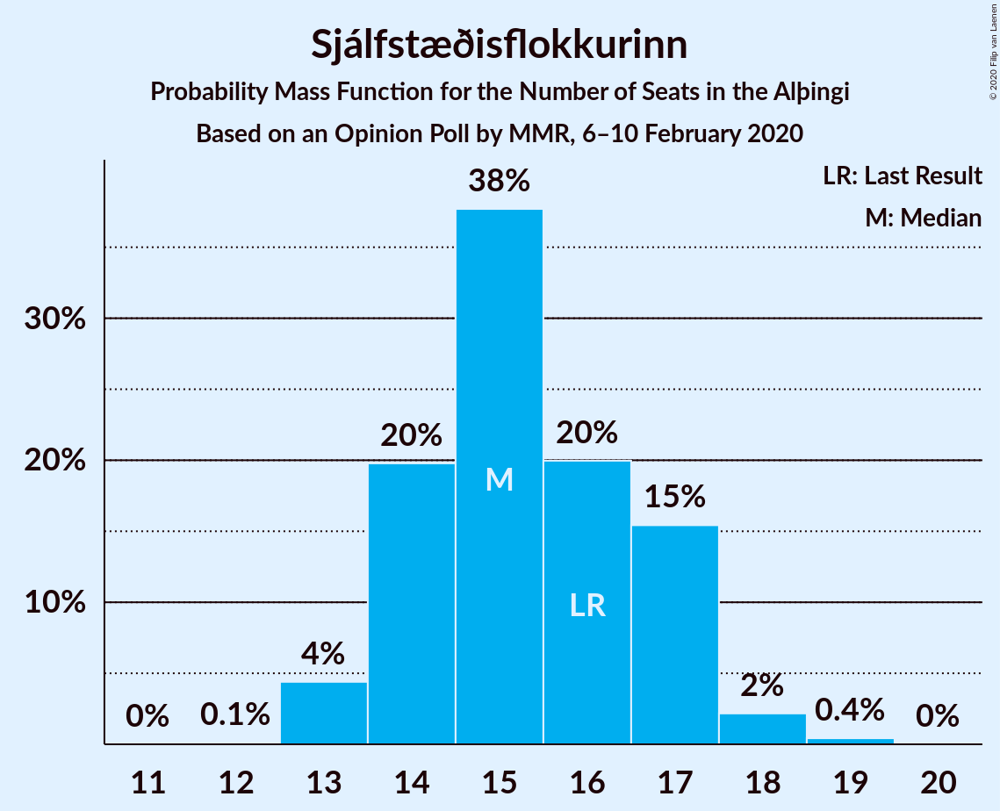
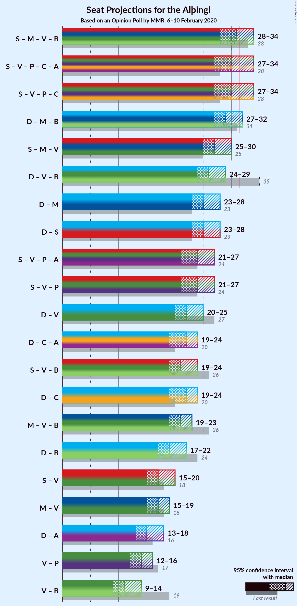

# Opinion Poll by MMR, 6–10 February 2020

<a href="#voting-intentions">Voting Intentions</a> | <a href="#seats">Seats</a> | <a href="#coalitions">Coalitions</a> | <a href="#technical-information">Technical Information</a>

## Voting Intentions

### Confidence Intervals

| Party | Last Result | Poll Result | 80% Confidence Interval | 90% Confidence Interval | 95% Confidence Interval | 99% Confidence Interval |
|:-----:|:-----------:|:-----------:|:-----------------------:|:-----------------------:|:-----------------------:|:-----------------------:|
| Sjálfstæðisflokkurinn | 25.2% | 22.0% | 20.4–23.8% |20.0–24.3% |19.6–24.7% |18.8–25.6% |
| Samfylkingin | 12.1% | 15.1% | 13.7–16.6% |13.3–17.0% |13.0–17.4% |12.3–18.2% |
| Miðflokkurinn | 10.9% | 13.3% | 12.0–14.7% |11.6–15.1% |11.3–15.5% |10.7–16.2% |
| Vinstrihreyfingin – grænt framboð | 16.9% | 10.7% | 9.5–12.0% |9.2–12.4% |8.9–12.7% |8.4–13.4% |
| Píratar | 9.2% | 10.4% | 9.2–11.7% |8.9–12.1% |8.6–12.4% |8.1–13.1% |
| Viðreisn | 6.7% | 9.7% | 8.6–11.0% |8.3–11.3% |8.0–11.7% |7.5–12.3% |
| Framsóknarflokkurinn | 10.7% | 6.8% | 5.9–7.9% |5.6–8.2% |5.4–8.5% |5.0–9.1% |
| Sósíalistaflokkur Íslands | 0.0% | 5.3% | 4.5–6.3% |4.3–6.6% |4.1–6.9% |3.7–7.4% |
| Flokkur fólksins | 6.9% | 4.6% | 3.8–5.5% |3.6–5.8% |3.5–6.1% |3.1–6.6% |

*Note:* The poll result column reflects the actual value used in the calculations. Published results may vary slightly, and in addition be rounded to fewer digits.

## Seats

### Confidence Intervals

| Party | Last Result | Median | 80% Confidence Interval | 90% Confidence Interval | 95% Confidence Interval | 99% Confidence Interval |
|:-----:|:-----------:|:------:|:-----------------------:|:-----------------------:|:-----------------------:|:-----------------------:|
| <a href="#sjálfstæðisflokkurinn">Sjálfstæðisflokkurinn</a> | 16 | 15 | 14–17 |14–17 |13–17 |13–18 |
| <a href="#samfylkingin">Samfylkingin</a> | 7 | 10 | 8–12 |8–12 |8–12 |8–13 |
| <a href="#miðflokkurinn">Miðflokkurinn</a> | 7 | 10 | 8–10 |8–11 |7–11 |7–12 |
| <a href="#vinstrihreyfingin-–-grænt-framboð">Vinstrihreyfingin – grænt framboð</a> | 11 | 7 | 6–9 |5–9 |5–9 |5–10 |
| <a href="#píratar">Píratar</a> | 6 | 6 | 6–8 |6–8 |5–8 |4–9 |
| <a href="#viðreisn">Viðreisn</a> | 4 | 6 | 5–7 |5–7 |5–8 |5–9 |
| <a href="#framsóknarflokkurinn">Framsóknarflokkurinn</a> | 8 | 4 | 3–5 |3–5 |2–6 |2–6 |
| <a href="#sósíalistaflokkur-íslands">Sósíalistaflokkur Íslands</a> | 0 | 3 | 0–4 |0–5 |0–5 |0–5 |
| <a href="#flokkur-fólksins">Flokkur fólksins</a> | 4 | 0 | 0–4 |0–4 |0–4 |0–4 |

### Sjálfstæðisflokkurinn

*For a full overview of the results for this party, see the [Sjálfstæðisflokkurinn](party-sjálfstæðisflokkurinn.html) page.*

| Number of Seats | Probability | Accumulated | Special Marks |
|:---------------:|:-----------:|:-----------:|:-------------:|
| 12 | 0.1% | 100% |  |
| 13 | 2% | 99.9% |  |
| 14 | 24% | 97% |  |
| 15 | 41% | 73% | Median |
| 16 | 20% | 32% | Last Result |
| 17 | 10% | 12% |  |
| 18 | 2% | 2% |  |
| 19 | 0.1% | 0.1% |  |
| 20 | 0% | 0% |  |

### Samfylkingin

*For a full overview of the results for this party, see the [Samfylkingin](party-samfylkingin.html) page.*

| Number of Seats | Probability | Accumulated | Special Marks |
|:---------------:|:-----------:|:-----------:|:-------------:|
| 7 | 0.1% | 100% | Last Result |
| 8 | 11% | 99.9% |  |
| 9 | 6% | 89% |  |
| 10 | 49% | 83% | Median |
| 11 | 14% | 34% |  |
| 12 | 18% | 20% |  |
| 13 | 1.5% | 2% |  |
| 14 | 0% | 0% |  |

### Miðflokkurinn

*For a full overview of the results for this party, see the [Miðflokkurinn](party-miðflokkurinn.html) page.*

| Number of Seats | Probability | Accumulated | Special Marks |
|:---------------:|:-----------:|:-----------:|:-------------:|
| 7 | 3% | 100% | Last Result |
| 8 | 11% | 97% |  |
| 9 | 14% | 86% |  |
| 10 | 67% | 72% | Median |
| 11 | 4% | 5% |  |
| 12 | 0.8% | 1.1% |  |
| 13 | 0.3% | 0.4% |  |
| 14 | 0% | 0% |  |

### Vinstrihreyfingin – grænt framboð

*For a full overview of the results for this party, see the [Vinstrihreyfingin – grænt framboð](party-vinstrihreyfingin–græntframboð.html) page.*

| Number of Seats | Probability | Accumulated | Special Marks |
|:---------------:|:-----------:|:-----------:|:-------------:|
| 5 | 7% | 100% |  |
| 6 | 29% | 93% |  |
| 7 | 27% | 64% | Median |
| 8 | 16% | 37% |  |
| 9 | 20% | 21% |  |
| 10 | 1.2% | 1.2% |  |
| 11 | 0% | 0% | Last Result |

### Píratar

*For a full overview of the results for this party, see the [Píratar](party-píratar.html) page.*

| Number of Seats | Probability | Accumulated | Special Marks |
|:---------------:|:-----------:|:-----------:|:-------------:|
| 4 | 0.6% | 100% |  |
| 5 | 3% | 99.4% |  |
| 6 | 51% | 97% | Last Result, Median |
| 7 | 28% | 45% |  |
| 8 | 17% | 17% |  |
| 9 | 0.9% | 0.9% |  |
| 10 | 0% | 0% |  |

### Viðreisn

*For a full overview of the results for this party, see the [Viðreisn](party-viðreisn.html) page.*

| Number of Seats | Probability | Accumulated | Special Marks |
|:---------------:|:-----------:|:-----------:|:-------------:|
| 4 | 0.2% | 100% | Last Result |
| 5 | 23% | 99.8% |  |
| 6 | 38% | 77% | Median |
| 7 | 35% | 39% |  |
| 8 | 3% | 4% |  |
| 9 | 1.2% | 1.2% |  |
| 10 | 0% | 0% |  |

### Framsóknarflokkurinn

*For a full overview of the results for this party, see the [Framsóknarflokkurinn](party-framsóknarflokkurinn.html) page.*

| Number of Seats | Probability | Accumulated | Special Marks |
|:---------------:|:-----------:|:-----------:|:-------------:|
| 2 | 4% | 100% |  |
| 3 | 6% | 96% |  |
| 4 | 51% | 90% | Median |
| 5 | 35% | 39% |  |
| 6 | 3% | 3% |  |
| 7 | 0% | 0% |  |
| 8 | 0% | 0% | Last Result |

### Sósíalistaflokkur Íslands

*For a full overview of the results for this party, see the [Sósíalistaflokkur Íslands](party-sósíalistaflokkuríslands.html) page.*

| Number of Seats | Probability | Accumulated | Special Marks |
|:---------------:|:-----------:|:-----------:|:-------------:|
| 0 | 43% | 100% | Last Result |
| 1 | 0% | 57% |  |
| 2 | 0% | 57% |  |
| 3 | 29% | 57% | Median |
| 4 | 22% | 29% |  |
| 5 | 6% | 6% |  |
| 6 | 0% | 0% |  |

### Flokkur fólksins

*For a full overview of the results for this party, see the [Flokkur fólksins](party-flokkurfólksins.html) page.*

| Number of Seats | Probability | Accumulated | Special Marks |
|:---------------:|:-----------:|:-----------:|:-------------:|
| 0 | 51% | 100% | Median |
| 1 | 0% | 49% |  |
| 2 | 0% | 49% |  |
| 3 | 33% | 49% |  |
| 4 | 16% | 16% | Last Result |
| 5 | 0% | 0% |  |

## Coalitions

### Confidence Intervals

| Coalition | Last Result | Median | Majority? | 80% Confidence Interval | 90% Confidence Interval | 95% Confidence Interval | 99% Confidence Interval |
|:---------:|:-----------:|:------:|:---------:|:-----------------------:|:-----------------------:|:-----------------------:|:-----------------------:|
| Samfylkingin – Miðflokkurinn – Vinstrihreyfingin – grænt framboð – Framsóknarflokkurinn | 33 | 31 | 45% | 28–34 | 28–35 | 28–35 | 28–35 |
| Samfylkingin – Vinstrihreyfingin – grænt framboð – Píratar – Viðreisn | 28 | 30 | 29% | 27–34 | 27–34 | 27–34 | 25–36 |
| Sjálfstæðisflokkurinn – Miðflokkurinn – Framsóknarflokkurinn | 31 | 29 | 4% | 27–31 | 27–31 | 27–32 | 26–34 |
| Samfylkingin – Miðflokkurinn – Vinstrihreyfingin – grænt framboð | 25 | 27 | 0.1% | 24–30 | 24–30 | 24–31 | 24–31 |
| Sjálfstæðisflokkurinn – Vinstrihreyfingin – grænt framboð – Framsóknarflokkurinn | 35 | 27 | 0% | 25–28 | 24–29 | 23–29 | 23–30 |
| Sjálfstæðisflokkurinn – Samfylkingin | 23 | 25 | 0% | 23–28 | 23–28 | 23–29 | 22–29 |
| Sjálfstæðisflokkurinn – Miðflokkurinn | 23 | 25 | 0% | 22–26 | 22–27 | 22–28 | 22–29 |
| Samfylkingin – Vinstrihreyfingin – grænt framboð – Píratar | 24 | 24 | 0% | 21–28 | 20–28 | 20–28 | 20–28 |
| Sjálfstæðisflokkurinn – Vinstrihreyfingin – grænt framboð | 27 | 22 | 0% | 21–24 | 20–25 | 20–25 | 19–25 |
| Samfylkingin – Vinstrihreyfingin – grænt framboð – Framsóknarflokkurinn | 26 | 21 | 0% | 18–25 | 18–25 | 18–25 | 18–25 |
| Sjálfstæðisflokkurinn – Viðreisn | 20 | 22 | 0% | 19–23 | 19–23 | 19–24 | 18–25 |
| Miðflokkurinn – Vinstrihreyfingin – grænt framboð – Framsóknarflokkurinn | 26 | 21 | 0% | 19–23 | 19–23 | 18–23 | 18–24 |
| Sjálfstæðisflokkurinn – Framsóknarflokkurinn | 24 | 19 | 0% | 18–21 | 17–21 | 17–22 | 17–23 |
| Samfylkingin – Vinstrihreyfingin – grænt framboð | 18 | 17 | 0% | 15–20 | 14–21 | 14–21 | 14–21 |
| Miðflokkurinn – Vinstrihreyfingin – grænt framboð | 18 | 17 | 0% | 15–18 | 15–19 | 15–19 | 15–20 |
| Vinstrihreyfingin – grænt framboð – Píratar | 17 | 13 | 0% | 12–16 | 12–16 | 11–16 | 10–17 |
| Vinstrihreyfingin – grænt framboð – Framsóknarflokkurinn | 19 | 11 | 0% | 10–14 | 9–14 | 8–14 | 8–14 |

### Samfylkingin – Miðflokkurinn – Vinstrihreyfingin – grænt framboð – Framsóknarflokkurinn

| Number of Seats | Probability | Accumulated | Special Marks |
|:---------------:|:-----------:|:-----------:|:-------------:|
| 27 | 0.1% | 100% |  |
| 28 | 15% | 99.8% |  |
| 29 | 2% | 85% |  |
| 30 | 15% | 83% |  |
| 31 | 23% | 68% | Median |
| 32 | 21% | 45% | Majority |
| 33 | 6% | 24% | Last Result |
| 34 | 9% | 18% |  |
| 35 | 9% | 9% |  |
| 36 | 0.1% | 0.1% |  |
| 37 | 0% | 0% |  |

### Samfylkingin – Vinstrihreyfingin – grænt framboð – Píratar – Viðreisn

| Number of Seats | Probability | Accumulated | Special Marks |
|:---------------:|:-----------:|:-----------:|:-------------:|
| 24 | 0.2% | 100% |  |
| 25 | 0.6% | 99.8% |  |
| 26 | 0.6% | 99.2% |  |
| 27 | 13% | 98.5% |  |
| 28 | 12% | 85% | Last Result |
| 29 | 10% | 73% | Median |
| 30 | 29% | 63% |  |
| 31 | 5% | 34% |  |
| 32 | 6% | 29% | Majority |
| 33 | 8% | 24% |  |
| 34 | 15% | 16% |  |
| 35 | 0.1% | 1.0% |  |
| 36 | 0.9% | 0.9% |  |
| 37 | 0% | 0% |  |

### Sjálfstæðisflokkurinn – Miðflokkurinn – Framsóknarflokkurinn

| Number of Seats | Probability | Accumulated | Special Marks |
|:---------------:|:-----------:|:-----------:|:-------------:|
| 25 | 0.1% | 100% |  |
| 26 | 0.5% | 99.9% |  |
| 27 | 19% | 99.4% |  |
| 28 | 9% | 81% |  |
| 29 | 40% | 72% | Median |
| 30 | 16% | 32% |  |
| 31 | 12% | 16% | Last Result |
| 32 | 2% | 4% | Majority |
| 33 | 1.1% | 2% |  |
| 34 | 0.3% | 0.5% |  |
| 35 | 0.2% | 0.2% |  |
| 36 | 0% | 0% |  |

### Samfylkingin – Miðflokkurinn – Vinstrihreyfingin – grænt framboð

| Number of Seats | Probability | Accumulated | Special Marks |
|:---------------:|:-----------:|:-----------:|:-------------:|
| 23 | 0.1% | 100% |  |
| 24 | 11% | 99.9% |  |
| 25 | 11% | 89% | Last Result |
| 26 | 12% | 78% |  |
| 27 | 34% | 65% | Median |
| 28 | 11% | 32% |  |
| 29 | 3% | 21% |  |
| 30 | 15% | 18% |  |
| 31 | 3% | 3% |  |
| 32 | 0.1% | 0.1% | Majority |
| 33 | 0% | 0% |  |

### Sjálfstæðisflokkurinn – Vinstrihreyfingin – grænt framboð – Framsóknarflokkurinn

| Number of Seats | Probability | Accumulated | Special Marks |
|:---------------:|:-----------:|:-----------:|:-------------:|
| 22 | 0% | 100% |  |
| 23 | 4% | 99.9% |  |
| 24 | 5% | 96% |  |
| 25 | 14% | 91% |  |
| 26 | 23% | 77% | Median |
| 27 | 23% | 54% |  |
| 28 | 22% | 32% |  |
| 29 | 9% | 10% |  |
| 30 | 0.5% | 0.6% |  |
| 31 | 0.1% | 0.1% |  |
| 32 | 0% | 0% | Majority |
| 33 | 0% | 0% |  |
| 34 | 0% | 0% |  |
| 35 | 0% | 0% | Last Result |

### Sjálfstæðisflokkurinn – Samfylkingin

| Number of Seats | Probability | Accumulated | Special Marks |
|:---------------:|:-----------:|:-----------:|:-------------:|
| 21 | 0.1% | 100% |  |
| 22 | 1.0% | 99.9% |  |
| 23 | 12% | 98.9% | Last Result |
| 24 | 16% | 87% |  |
| 25 | 22% | 71% | Median |
| 26 | 27% | 49% |  |
| 27 | 10% | 22% |  |
| 28 | 8% | 12% |  |
| 29 | 4% | 4% |  |
| 30 | 0.1% | 0.1% |  |
| 31 | 0% | 0% |  |

### Sjálfstæðisflokkurinn – Miðflokkurinn

| Number of Seats | Probability | Accumulated | Special Marks |
|:---------------:|:-----------:|:-----------:|:-------------:|
| 21 | 0.1% | 100% |  |
| 22 | 14% | 99.9% |  |
| 23 | 3% | 86% | Last Result |
| 24 | 14% | 83% |  |
| 25 | 42% | 69% | Median |
| 26 | 17% | 26% |  |
| 27 | 7% | 10% |  |
| 28 | 2% | 3% |  |
| 29 | 0.5% | 0.7% |  |
| 30 | 0.2% | 0.2% |  |
| 31 | 0% | 0% |  |

### Samfylkingin – Vinstrihreyfingin – grænt framboð – Píratar

| Number of Seats | Probability | Accumulated | Special Marks |
|:---------------:|:-----------:|:-----------:|:-------------:|
| 19 | 0.2% | 100% |  |
| 20 | 8% | 99.8% |  |
| 21 | 4% | 92% |  |
| 22 | 13% | 88% |  |
| 23 | 25% | 75% | Median |
| 24 | 7% | 50% | Last Result |
| 25 | 17% | 44% |  |
| 26 | 8% | 26% |  |
| 27 | 8% | 18% |  |
| 28 | 10% | 10% |  |
| 29 | 0.1% | 0.1% |  |
| 30 | 0% | 0% |  |

### Sjálfstæðisflokkurinn – Vinstrihreyfingin – grænt framboð

| Number of Seats | Probability | Accumulated | Special Marks |
|:---------------:|:-----------:|:-----------:|:-------------:|
| 18 | 0.1% | 100% |  |
| 19 | 0.4% | 99.9% |  |
| 20 | 9% | 99.5% |  |
| 21 | 12% | 91% |  |
| 22 | 39% | 79% | Median |
| 23 | 25% | 40% |  |
| 24 | 6% | 15% |  |
| 25 | 8% | 9% |  |
| 26 | 0.1% | 0.2% |  |
| 27 | 0% | 0.1% | Last Result |
| 28 | 0% | 0% |  |

### Samfylkingin – Vinstrihreyfingin – grænt framboð – Framsóknarflokkurinn

| Number of Seats | Probability | Accumulated | Special Marks |
|:---------------:|:-----------:|:-----------:|:-------------:|
| 17 | 0.1% | 100% |  |
| 18 | 11% | 99.9% |  |
| 19 | 5% | 89% |  |
| 20 | 16% | 83% |  |
| 21 | 20% | 67% | Median |
| 22 | 9% | 48% |  |
| 23 | 7% | 39% |  |
| 24 | 18% | 32% |  |
| 25 | 14% | 14% |  |
| 26 | 0% | 0.1% | Last Result |
| 27 | 0% | 0% |  |

### Sjálfstæðisflokkurinn – Viðreisn

| Number of Seats | Probability | Accumulated | Special Marks |
|:---------------:|:-----------:|:-----------:|:-------------:|
| 18 | 1.4% | 100% |  |
| 19 | 13% | 98.5% |  |
| 20 | 7% | 85% | Last Result |
| 21 | 19% | 79% | Median |
| 22 | 49% | 59% |  |
| 23 | 6% | 10% |  |
| 24 | 3% | 4% |  |
| 25 | 1.2% | 1.2% |  |
| 26 | 0% | 0% |  |

### Miðflokkurinn – Vinstrihreyfingin – grænt framboð – Framsóknarflokkurinn

| Number of Seats | Probability | Accumulated | Special Marks |
|:---------------:|:-----------:|:-----------:|:-------------:|
| 17 | 0.1% | 100% |  |
| 18 | 4% | 99.9% |  |
| 19 | 8% | 96% |  |
| 20 | 25% | 87% |  |
| 21 | 20% | 62% | Median |
| 22 | 25% | 42% |  |
| 23 | 16% | 17% |  |
| 24 | 1.4% | 1.4% |  |
| 25 | 0% | 0% |  |
| 26 | 0% | 0% | Last Result |

### Sjálfstæðisflokkurinn – Framsóknarflokkurinn

| Number of Seats | Probability | Accumulated | Special Marks |
|:---------------:|:-----------:|:-----------:|:-------------:|
| 15 | 0.1% | 100% |  |
| 16 | 0.2% | 99.9% |  |
| 17 | 5% | 99.8% |  |
| 18 | 7% | 95% |  |
| 19 | 47% | 88% | Median |
| 20 | 23% | 40% |  |
| 21 | 14% | 18% |  |
| 22 | 2% | 3% |  |
| 23 | 0.8% | 1.1% |  |
| 24 | 0.4% | 0.4% | Last Result |
| 25 | 0% | 0% |  |

### Samfylkingin – Vinstrihreyfingin – grænt framboð

| Number of Seats | Probability | Accumulated | Special Marks |
|:---------------:|:-----------:|:-----------:|:-------------:|
| 13 | 0.1% | 100% |  |
| 14 | 8% | 99.9% |  |
| 15 | 13% | 92% |  |
| 16 | 11% | 79% |  |
| 17 | 23% | 68% | Median |
| 18 | 9% | 45% | Last Result |
| 19 | 18% | 35% |  |
| 20 | 9% | 17% |  |
| 21 | 8% | 8% |  |
| 22 | 0% | 0% |  |

### Miðflokkurinn – Vinstrihreyfingin – grænt framboð

| Number of Seats | Probability | Accumulated | Special Marks |
|:---------------:|:-----------:|:-----------:|:-------------:|
| 14 | 0.2% | 100% |  |
| 15 | 14% | 99.8% |  |
| 16 | 25% | 86% |  |
| 17 | 37% | 61% | Median |
| 18 | 19% | 24% | Last Result |
| 19 | 4% | 5% |  |
| 20 | 1.0% | 1.1% |  |
| 21 | 0.1% | 0.1% |  |
| 22 | 0% | 0% |  |

### Vinstrihreyfingin – grænt framboð – Píratar

| Number of Seats | Probability | Accumulated | Special Marks |
|:---------------:|:-----------:|:-----------:|:-------------:|
| 10 | 0.8% | 100% |  |
| 11 | 4% | 99.2% |  |
| 12 | 19% | 95% |  |
| 13 | 27% | 77% | Median |
| 14 | 8% | 50% |  |
| 15 | 30% | 42% |  |
| 16 | 11% | 12% |  |
| 17 | 1.0% | 1.2% | Last Result |
| 18 | 0.2% | 0.2% |  |
| 19 | 0% | 0% |  |

### Vinstrihreyfingin – grænt framboð – Framsóknarflokkurinn

| Number of Seats | Probability | Accumulated | Special Marks |
|:---------------:|:-----------:|:-----------:|:-------------:|
| 8 | 4% | 100% |  |
| 9 | 5% | 96% |  |
| 10 | 27% | 91% |  |
| 11 | 20% | 64% | Median |
| 12 | 7% | 44% |  |
| 13 | 26% | 37% |  |
| 14 | 11% | 11% |  |
| 15 | 0.1% | 0.1% |  |
| 16 | 0% | 0% |  |
| 17 | 0% | 0% |  |
| 18 | 0% | 0% |  |
| 19 | 0% | 0% | Last Result |

## Technical Information

### Opinion Poll

+ **Polling firm:** MMR
+ **Commissioner(s):** —
+ **Fieldwork period:** 6–10 February 2020

### Calculations

+ **Sample size:** 1003
+ **Simulations done:** 32,768
+ **Error estimate:** 2.55%

