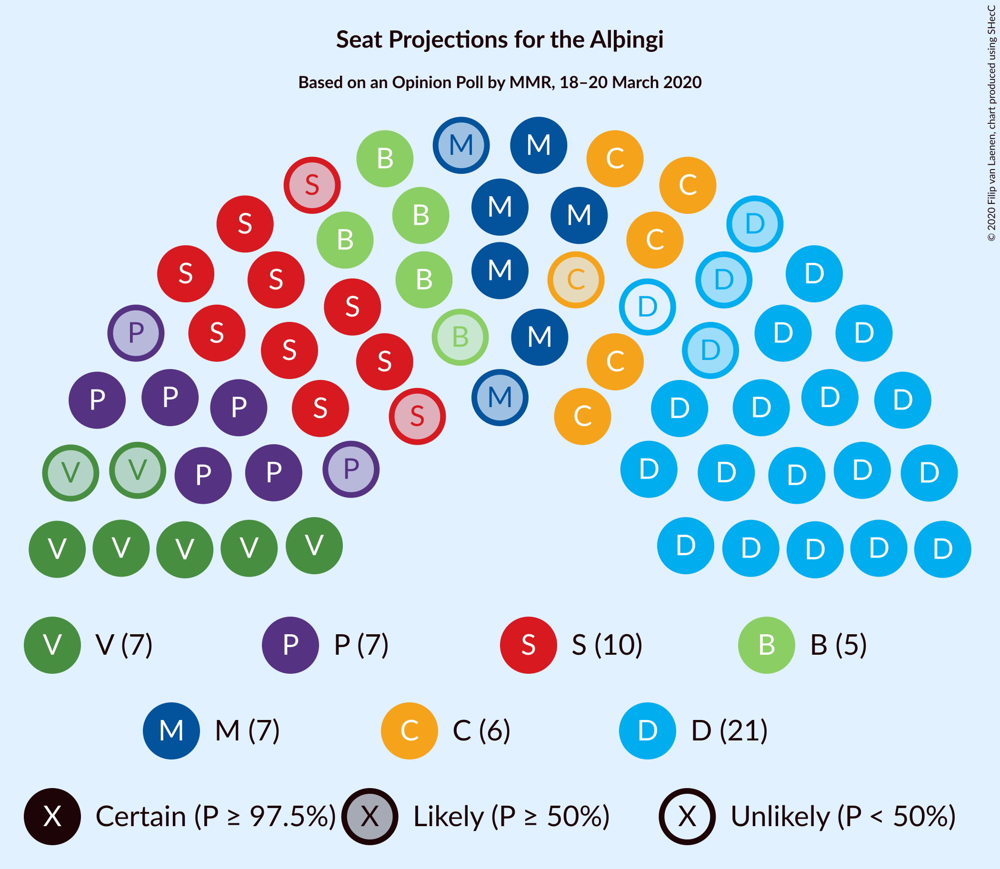

# Opinion Poll by MMR, 18–20 March 2020

<a href="#voting-intentions">Voting Intentions</a> | <a href="#seats">Seats</a> | <a href="#coalitions">Coalitions</a> | <a href="#technical-information">Technical Information</a>

## Voting Intentions

### Confidence Intervals

| Party | Last Result | Poll Result | 80% Confidence Interval | 90% Confidence Interval | 95% Confidence Interval | 99% Confidence Interval |
|:-----:|:-----------:|:-----------:|:-----------------------:|:-----------------------:|:-----------------------:|:-----------------------:|
| Sjálfstæðisflokkurinn | 25.2% | 27.8% | 26.0–29.6% |25.5–30.1% |25.1–30.6% |24.3–31.5% |
| Samfylkingin | 12.1% | 14.9% | 13.6–16.4% |13.2–16.8% |12.8–17.2% |12.2–17.9% |
| Píratar | 9.2% | 10.3% | 9.2–11.7% |8.9–12.0% |8.6–12.4% |8.1–13.0% |
| Miðflokkurinn | 10.9% | 10.2% | 9.0–11.5% |8.7–11.8% |8.5–12.1% |8.0–12.8% |
| Vinstrihreyfingin – grænt framboð | 16.9% | 10.0% | 8.9–11.2% |8.6–11.6% |8.3–11.9% |7.8–12.6% |
| Viðreisn | 6.7% | 9.9% | 8.8–11.2% |8.5–11.5% |8.2–11.8% |7.7–12.5% |
| Framsóknarflokkurinn | 10.7% | 8.2% | 7.2–9.4% |6.9–9.8% |6.7–10.1% |6.2–10.7% |
| Sósíalistaflokkur Íslands | 0.0% | 4.7% | 4.0–5.7% |3.8–6.0% |3.6–6.2% |3.3–6.7% |
| Flokkur fólksins | 6.9% | 3.8% | 3.1–4.6% |2.9–4.9% |2.8–5.1% |2.5–5.6% |

*Note:* The poll result column reflects the actual value used in the calculations. Published results may vary slightly, and in addition be rounded to fewer digits.

## Seats

### Confidence Intervals

| Party | Last Result | Median | 80% Confidence Interval | 90% Confidence Interval | 95% Confidence Interval | 99% Confidence Interval |
|:-----:|:-----------:|:------:|:-----------------------:|:-----------------------:|:-----------------------:|:-----------------------:|
| <a href="#sjálfstæðisflokkurinn">Sjálfstæðisflokkurinn</a> | 16 | 19 | 18–21 |18–22 |17–22 |16–23 |
| <a href="#samfylkingin">Samfylkingin</a> | 7 | 10 | 9–11 |9–12 |8–12 |8–12 |
| <a href="#píratar">Píratar</a> | 6 | 7 | 6–8 |6–8 |5–9 |5–9 |
| <a href="#miðflokkurinn">Miðflokkurinn</a> | 7 | 7 | 6–9 |6–9 |5–10 |5–10 |
| <a href="#vinstrihreyfingin-–-grænt-framboð">Vinstrihreyfingin – grænt framboð</a> | 11 | 6 | 5–7 |5–8 |5–8 |5–9 |
| <a href="#viðreisn">Viðreisn</a> | 4 | 6 | 5–8 |5–8 |5–8 |5–9 |
| <a href="#framsóknarflokkurinn">Framsóknarflokkurinn</a> | 8 | 5 | 4–6 |4–7 |4–7 |4–8 |
| <a href="#sósíalistaflokkur-íslands">Sósíalistaflokkur Íslands</a> | 0 | 0 | 0–3 |0–3 |0–4 |0–4 |
| <a href="#flokkur-fólksins">Flokkur fólksins</a> | 4 | 0 | 0 |0 |0–3 |0–3 |

### Sjálfstæðisflokkurinn

*For a full overview of the results for this party, see the [Sjálfstæðisflokkurinn](party-sjálfstæðisflokkurinn.html) page.*

| Number of Seats | Probability | Accumulated | Special Marks |
|:---------------:|:-----------:|:-----------:|:-------------:|
| 15 | 0.1% | 100% |  |
| 16 | 0.7% | 99.9% | Last Result |
| 17 | 3% | 99.2% |  |
| 18 | 8% | 96% |  |
| 19 | 43% | 88% | Median |
| 20 | 22% | 46% |  |
| 21 | 16% | 23% |  |
| 22 | 6% | 7% |  |
| 23 | 0.5% | 0.8% |  |
| 24 | 0.3% | 0.3% |  |
| 25 | 0% | 0% |  |

### Samfylkingin

*For a full overview of the results for this party, see the [Samfylkingin](party-samfylkingin.html) page.*

| Number of Seats | Probability | Accumulated | Special Marks |
|:---------------:|:-----------:|:-----------:|:-------------:|
| 7 | 0.1% | 100% | Last Result |
| 8 | 3% | 99.9% |  |
| 9 | 25% | 97% |  |
| 10 | 43% | 73% | Median |
| 11 | 22% | 29% |  |
| 12 | 7% | 7% |  |
| 13 | 0.3% | 0.4% |  |
| 14 | 0% | 0.1% |  |
| 15 | 0% | 0% |  |

### Píratar

*For a full overview of the results for this party, see the [Píratar](party-píratar.html) page.*

| Number of Seats | Probability | Accumulated | Special Marks |
|:---------------:|:-----------:|:-----------:|:-------------:|
| 4 | 0.1% | 100% |  |
| 5 | 4% | 99.9% |  |
| 6 | 32% | 96% | Last Result |
| 7 | 37% | 64% | Median |
| 8 | 23% | 27% |  |
| 9 | 4% | 4% |  |
| 10 | 0% | 0% |  |

### Miðflokkurinn

*For a full overview of the results for this party, see the [Miðflokkurinn](party-miðflokkurinn.html) page.*

| Number of Seats | Probability | Accumulated | Special Marks |
|:---------------:|:-----------:|:-----------:|:-------------:|
| 4 | 0.2% | 100% |  |
| 5 | 3% | 99.8% |  |
| 6 | 38% | 97% |  |
| 7 | 27% | 58% | Last Result, Median |
| 8 | 20% | 32% |  |
| 9 | 9% | 12% |  |
| 10 | 3% | 3% |  |
| 11 | 0% | 0% |  |

### Vinstrihreyfingin – grænt framboð

*For a full overview of the results for this party, see the [Vinstrihreyfingin – grænt framboð](party-vinstrihreyfingin–græntframboð.html) page.*

| Number of Seats | Probability | Accumulated | Special Marks |
|:---------------:|:-----------:|:-----------:|:-------------:|
| 4 | 0.1% | 100% |  |
| 5 | 10% | 99.9% |  |
| 6 | 47% | 90% | Median |
| 7 | 37% | 43% |  |
| 8 | 5% | 6% |  |
| 9 | 0.3% | 0.6% |  |
| 10 | 0.3% | 0.3% |  |
| 11 | 0% | 0% | Last Result |

### Viðreisn

*For a full overview of the results for this party, see the [Viðreisn](party-viðreisn.html) page.*

| Number of Seats | Probability | Accumulated | Special Marks |
|:---------------:|:-----------:|:-----------:|:-------------:|
| 4 | 0.2% | 100% | Last Result |
| 5 | 11% | 99.8% |  |
| 6 | 44% | 89% | Median |
| 7 | 30% | 45% |  |
| 8 | 14% | 15% |  |
| 9 | 0.9% | 0.9% |  |
| 10 | 0% | 0% |  |

### Framsóknarflokkurinn

*For a full overview of the results for this party, see the [Framsóknarflokkurinn](party-framsóknarflokkurinn.html) page.*

| Number of Seats | Probability | Accumulated | Special Marks |
|:---------------:|:-----------:|:-----------:|:-------------:|
| 3 | 0.1% | 100% |  |
| 4 | 18% | 99.9% |  |
| 5 | 43% | 82% | Median |
| 6 | 33% | 39% |  |
| 7 | 5% | 6% |  |
| 8 | 0.7% | 0.7% | Last Result |
| 9 | 0% | 0% |  |

### Sósíalistaflokkur Íslands

*For a full overview of the results for this party, see the [Sósíalistaflokkur Íslands](party-sósíalistaflokkuríslands.html) page.*

| Number of Seats | Probability | Accumulated | Special Marks |
|:---------------:|:-----------:|:-----------:|:-------------:|
| 0 | 63% | 100% | Last Result, Median |
| 1 | 0% | 37% |  |
| 2 | 0% | 37% |  |
| 3 | 32% | 37% |  |
| 4 | 5% | 5% |  |
| 5 | 0.1% | 0.1% |  |
| 6 | 0% | 0% |  |

### Flokkur fólksins

*For a full overview of the results for this party, see the [Flokkur fólksins](party-flokkurfólksins.html) page.*

| Number of Seats | Probability | Accumulated | Special Marks |
|:---------------:|:-----------:|:-----------:|:-------------:|
| 0 | 97% | 100% | Median |
| 1 | 0% | 3% |  |
| 2 | 0% | 3% |  |
| 3 | 3% | 3% |  |
| 4 | 0.2% | 0.2% | Last Result |
| 5 | 0% | 0% |  |

## Coalitions

### Confidence Intervals

| Coalition | Last Result | Median | Majority? | 80% Confidence Interval | 90% Confidence Interval | 95% Confidence Interval | 99% Confidence Interval |
|:---------:|:-----------:|:------:|:---------:|:-----------------------:|:-----------------------:|:-----------------------:|:-----------------------:|
| Sjálfstæðisflokkurinn – Miðflokkurinn – Framsóknarflokkurinn | 31 | 32 | 60% | 30–34 | 29–35 | 29–35 | 28–35 |
| Sjálfstæðisflokkurinn – Vinstrihreyfingin – grænt framboð – Framsóknarflokkurinn | 35 | 31 | 41% | 29–33 | 29–34 | 29–34 | 28–35 |
| Samfylkingin – Píratar – Vinstrihreyfingin – grænt framboð – Viðreisn | 28 | 30 | 12% | 28–32 | 27–33 | 26–33 | 25–34 |
| Sjálfstæðisflokkurinn – Samfylkingin | 23 | 30 | 8% | 28–31 | 27–32 | 27–32 | 26–33 |
| Samfylkingin – Miðflokkurinn – Vinstrihreyfingin – grænt framboð – Framsóknarflokkurinn | 33 | 28 | 4% | 27–31 | 26–31 | 26–32 | 25–33 |
| Sjálfstæðisflokkurinn – Miðflokkurinn | 23 | 27 | 0.1% | 25–29 | 24–29 | 24–30 | 23–30 |
| Sjálfstæðisflokkurinn – Viðreisn | 20 | 26 | 0% | 24–28 | 24–28 | 24–29 | 23–29 |
| Sjálfstæðisflokkurinn – Vinstrihreyfingin – grænt framboð | 27 | 26 | 0% | 25–28 | 24–28 | 23–29 | 23–30 |
| Sjálfstæðisflokkurinn – Framsóknarflokkurinn | 24 | 25 | 0% | 23–27 | 23–27 | 22–28 | 22–28 |
| Samfylkingin – Miðflokkurinn – Vinstrihreyfingin – grænt framboð | 25 | 23 | 0% | 22–25 | 21–26 | 21–27 | 20–27 |
| Samfylkingin – Píratar – Vinstrihreyfingin – grænt framboð | 24 | 23 | 0% | 22–25 | 21–25 | 20–26 | 20–27 |
| Samfylkingin – Vinstrihreyfingin – grænt framboð – Framsóknarflokkurinn | 26 | 22 | 0% | 20–24 | 20–25 | 19–25 | 18–25 |
| Miðflokkurinn – Vinstrihreyfingin – grænt framboð – Framsóknarflokkurinn | 26 | 19 | 0% | 17–20 | 16–21 | 16–21 | 16–23 |
| Samfylkingin – Vinstrihreyfingin – grænt framboð | 18 | 16 | 0% | 15–18 | 15–19 | 14–19 | 13–20 |
| Miðflokkurinn – Vinstrihreyfingin – grænt framboð | 18 | 13 | 0% | 12–15 | 12–16 | 11–16 | 11–17 |
| Píratar – Vinstrihreyfingin – grænt framboð | 17 | 13 | 0% | 12–15 | 11–15 | 11–16 | 10–16 |
| Vinstrihreyfingin – grænt framboð – Framsóknarflokkurinn | 19 | 12 | 0% | 10–13 | 10–14 | 10–14 | 9–14 |

### Sjálfstæðisflokkurinn – Miðflokkurinn – Framsóknarflokkurinn

| Number of Seats | Probability | Accumulated | Special Marks |
|:---------------:|:-----------:|:-----------:|:-------------:|
| 27 | 0.1% | 100% |  |
| 28 | 1.1% | 99.9% |  |
| 29 | 5% | 98.8% |  |
| 30 | 8% | 94% |  |
| 31 | 26% | 86% | Last Result, Median |
| 32 | 31% | 60% | Majority |
| 33 | 15% | 29% |  |
| 34 | 8% | 14% |  |
| 35 | 6% | 6% |  |
| 36 | 0.4% | 0.4% |  |
| 37 | 0.1% | 0.1% |  |
| 38 | 0% | 0% |  |

### Sjálfstæðisflokkurinn – Vinstrihreyfingin – grænt framboð – Framsóknarflokkurinn

| Number of Seats | Probability | Accumulated | Special Marks |
|:---------------:|:-----------:|:-----------:|:-------------:|
| 27 | 0.1% | 100% |  |
| 28 | 2% | 99.9% |  |
| 29 | 11% | 98% |  |
| 30 | 17% | 87% | Median |
| 31 | 29% | 70% |  |
| 32 | 16% | 41% | Majority |
| 33 | 18% | 25% |  |
| 34 | 6% | 7% |  |
| 35 | 0.4% | 0.6% | Last Result |
| 36 | 0.1% | 0.2% |  |
| 37 | 0% | 0% |  |

### Samfylkingin – Píratar – Vinstrihreyfingin – grænt framboð – Viðreisn

| Number of Seats | Probability | Accumulated | Special Marks |
|:---------------:|:-----------:|:-----------:|:-------------:|
| 24 | 0.1% | 100% |  |
| 25 | 0.4% | 99.9% |  |
| 26 | 4% | 99.4% |  |
| 27 | 2% | 96% |  |
| 28 | 13% | 93% | Last Result |
| 29 | 24% | 81% | Median |
| 30 | 18% | 57% |  |
| 31 | 27% | 39% |  |
| 32 | 7% | 12% | Majority |
| 33 | 3% | 5% |  |
| 34 | 2% | 2% |  |
| 35 | 0% | 0% |  |

### Sjálfstæðisflokkurinn – Samfylkingin

| Number of Seats | Probability | Accumulated | Special Marks |
|:---------------:|:-----------:|:-----------:|:-------------:|
| 23 | 0% | 100% | Last Result |
| 24 | 0% | 100% |  |
| 25 | 0.1% | 100% |  |
| 26 | 1.3% | 99.9% |  |
| 27 | 4% | 98.5% |  |
| 28 | 13% | 94% |  |
| 29 | 26% | 81% | Median |
| 30 | 28% | 55% |  |
| 31 | 19% | 27% |  |
| 32 | 6% | 8% | Majority |
| 33 | 2% | 2% |  |
| 34 | 0.3% | 0.3% |  |
| 35 | 0% | 0% |  |

### Samfylkingin – Miðflokkurinn – Vinstrihreyfingin – grænt framboð – Framsóknarflokkurinn

| Number of Seats | Probability | Accumulated | Special Marks |
|:---------------:|:-----------:|:-----------:|:-------------:|
| 24 | 0.3% | 100% |  |
| 25 | 0.5% | 99.7% |  |
| 26 | 6% | 99.1% |  |
| 27 | 13% | 93% |  |
| 28 | 31% | 80% | Median |
| 29 | 13% | 48% |  |
| 30 | 21% | 35% |  |
| 31 | 10% | 14% |  |
| 32 | 3% | 4% | Majority |
| 33 | 1.0% | 1.0% | Last Result |
| 34 | 0% | 0.1% |  |
| 35 | 0% | 0% |  |

### Sjálfstæðisflokkurinn – Miðflokkurinn

| Number of Seats | Probability | Accumulated | Special Marks |
|:---------------:|:-----------:|:-----------:|:-------------:|
| 22 | 0.1% | 100% |  |
| 23 | 0.8% | 99.9% | Last Result |
| 24 | 6% | 99.1% |  |
| 25 | 20% | 93% |  |
| 26 | 18% | 73% | Median |
| 27 | 28% | 55% |  |
| 28 | 17% | 27% |  |
| 29 | 7% | 11% |  |
| 30 | 3% | 4% |  |
| 31 | 0.3% | 0.3% |  |
| 32 | 0% | 0.1% | Majority |
| 33 | 0% | 0% |  |

### Sjálfstæðisflokkurinn – Viðreisn

| Number of Seats | Probability | Accumulated | Special Marks |
|:---------------:|:-----------:|:-----------:|:-------------:|
| 20 | 0% | 100% | Last Result |
| 21 | 0% | 100% |  |
| 22 | 0.2% | 100% |  |
| 23 | 2% | 99.7% |  |
| 24 | 10% | 98% |  |
| 25 | 26% | 89% | Median |
| 26 | 26% | 63% |  |
| 27 | 18% | 37% |  |
| 28 | 15% | 19% |  |
| 29 | 4% | 4% |  |
| 30 | 0.4% | 0.4% |  |
| 31 | 0% | 0% |  |

### Sjálfstæðisflokkurinn – Vinstrihreyfingin – grænt framboð

| Number of Seats | Probability | Accumulated | Special Marks |
|:---------------:|:-----------:|:-----------:|:-------------:|
| 21 | 0.1% | 100% |  |
| 22 | 0.1% | 99.9% |  |
| 23 | 3% | 99.9% |  |
| 24 | 7% | 97% |  |
| 25 | 29% | 90% | Median |
| 26 | 29% | 61% |  |
| 27 | 18% | 32% | Last Result |
| 28 | 10% | 14% |  |
| 29 | 4% | 5% |  |
| 30 | 0.4% | 0.5% |  |
| 31 | 0.1% | 0.1% |  |
| 32 | 0% | 0% | Majority |

### Sjálfstæðisflokkurinn – Framsóknarflokkurinn

| Number of Seats | Probability | Accumulated | Special Marks |
|:---------------:|:-----------:|:-----------:|:-------------:|
| 21 | 0.3% | 100% |  |
| 22 | 4% | 99.7% |  |
| 23 | 12% | 96% |  |
| 24 | 20% | 84% | Last Result, Median |
| 25 | 34% | 64% |  |
| 26 | 20% | 30% |  |
| 27 | 7% | 11% |  |
| 28 | 3% | 3% |  |
| 29 | 0.3% | 0.3% |  |
| 30 | 0% | 0.1% |  |
| 31 | 0% | 0% |  |

### Samfylkingin – Miðflokkurinn – Vinstrihreyfingin – grænt framboð

| Number of Seats | Probability | Accumulated | Special Marks |
|:---------------:|:-----------:|:-----------:|:-------------:|
| 18 | 0% | 100% |  |
| 19 | 0.1% | 99.9% |  |
| 20 | 0.9% | 99.9% |  |
| 21 | 4% | 99.0% |  |
| 22 | 24% | 95% |  |
| 23 | 24% | 71% | Median |
| 24 | 21% | 47% |  |
| 25 | 19% | 25% | Last Result |
| 26 | 4% | 7% |  |
| 27 | 3% | 3% |  |
| 28 | 0.1% | 0.1% |  |
| 29 | 0% | 0% |  |

### Samfylkingin – Píratar – Vinstrihreyfingin – grænt framboð

| Number of Seats | Probability | Accumulated | Special Marks |
|:---------------:|:-----------:|:-----------:|:-------------:|
| 18 | 0.1% | 100% |  |
| 19 | 0.4% | 99.9% |  |
| 20 | 3% | 99.6% |  |
| 21 | 5% | 97% |  |
| 22 | 18% | 92% |  |
| 23 | 32% | 74% | Median |
| 24 | 18% | 43% | Last Result |
| 25 | 20% | 25% |  |
| 26 | 4% | 5% |  |
| 27 | 1.2% | 1.2% |  |
| 28 | 0.1% | 0.1% |  |
| 29 | 0% | 0% |  |

### Samfylkingin – Vinstrihreyfingin – grænt framboð – Framsóknarflokkurinn

| Number of Seats | Probability | Accumulated | Special Marks |
|:---------------:|:-----------:|:-----------:|:-------------:|
| 18 | 1.0% | 100% |  |
| 19 | 2% | 99.0% |  |
| 20 | 20% | 97% |  |
| 21 | 24% | 77% | Median |
| 22 | 27% | 53% |  |
| 23 | 13% | 26% |  |
| 24 | 6% | 13% |  |
| 25 | 7% | 7% |  |
| 26 | 0.4% | 0.4% | Last Result |
| 27 | 0% | 0% |  |

### Miðflokkurinn – Vinstrihreyfingin – grænt framboð – Framsóknarflokkurinn

| Number of Seats | Probability | Accumulated | Special Marks |
|:---------------:|:-----------:|:-----------:|:-------------:|
| 14 | 0.1% | 100% |  |
| 15 | 0.3% | 99.8% |  |
| 16 | 6% | 99.5% |  |
| 17 | 12% | 93% |  |
| 18 | 27% | 82% | Median |
| 19 | 29% | 55% |  |
| 20 | 17% | 26% |  |
| 21 | 6% | 9% |  |
| 22 | 1.1% | 2% |  |
| 23 | 1.1% | 1.1% |  |
| 24 | 0% | 0% |  |
| 25 | 0% | 0% |  |
| 26 | 0% | 0% | Last Result |

### Samfylkingin – Vinstrihreyfingin – grænt framboð

| Number of Seats | Probability | Accumulated | Special Marks |
|:---------------:|:-----------:|:-----------:|:-------------:|
| 13 | 0.9% | 100% |  |
| 14 | 2% | 99.1% |  |
| 15 | 14% | 97% |  |
| 16 | 44% | 83% | Median |
| 17 | 21% | 40% |  |
| 18 | 12% | 19% | Last Result |
| 19 | 6% | 7% |  |
| 20 | 0.5% | 0.7% |  |
| 21 | 0.1% | 0.1% |  |
| 22 | 0% | 0% |  |

### Miðflokkurinn – Vinstrihreyfingin – grænt framboð

| Number of Seats | Probability | Accumulated | Special Marks |
|:---------------:|:-----------:|:-----------:|:-------------:|
| 10 | 0.4% | 100% |  |
| 11 | 2% | 99.5% |  |
| 12 | 27% | 97% |  |
| 13 | 22% | 70% | Median |
| 14 | 32% | 49% |  |
| 15 | 11% | 16% |  |
| 16 | 4% | 6% |  |
| 17 | 2% | 2% |  |
| 18 | 0% | 0% | Last Result |

### Píratar – Vinstrihreyfingin – grænt framboð

| Number of Seats | Probability | Accumulated | Special Marks |
|:---------------:|:-----------:|:-----------:|:-------------:|
| 9 | 0.1% | 100% |  |
| 10 | 0.5% | 99.9% |  |
| 11 | 5% | 99.5% |  |
| 12 | 21% | 95% |  |
| 13 | 29% | 74% | Median |
| 14 | 31% | 45% |  |
| 15 | 11% | 14% |  |
| 16 | 3% | 3% |  |
| 17 | 0.1% | 0.2% | Last Result |
| 18 | 0% | 0% |  |

### Vinstrihreyfingin – grænt framboð – Framsóknarflokkurinn

| Number of Seats | Probability | Accumulated | Special Marks |
|:---------------:|:-----------:|:-----------:|:-------------:|
| 9 | 0.8% | 100% |  |
| 10 | 18% | 99.1% |  |
| 11 | 25% | 81% | Median |
| 12 | 33% | 56% |  |
| 13 | 16% | 23% |  |
| 14 | 6% | 7% |  |
| 15 | 0.3% | 0.5% |  |
| 16 | 0.2% | 0.2% |  |
| 17 | 0% | 0% |  |
| 18 | 0% | 0% |  |
| 19 | 0% | 0% | Last Result |

## Technical Information

### Opinion Poll

+ **Polling firm:** MMR
+ **Commissioner(s):** —
+ **Fieldwork period:** 18–20 March 2020

### Calculations

+ **Sample size:** 1034
+ **Simulations done:** 524,288
+ **Error estimate:** 3.17%

