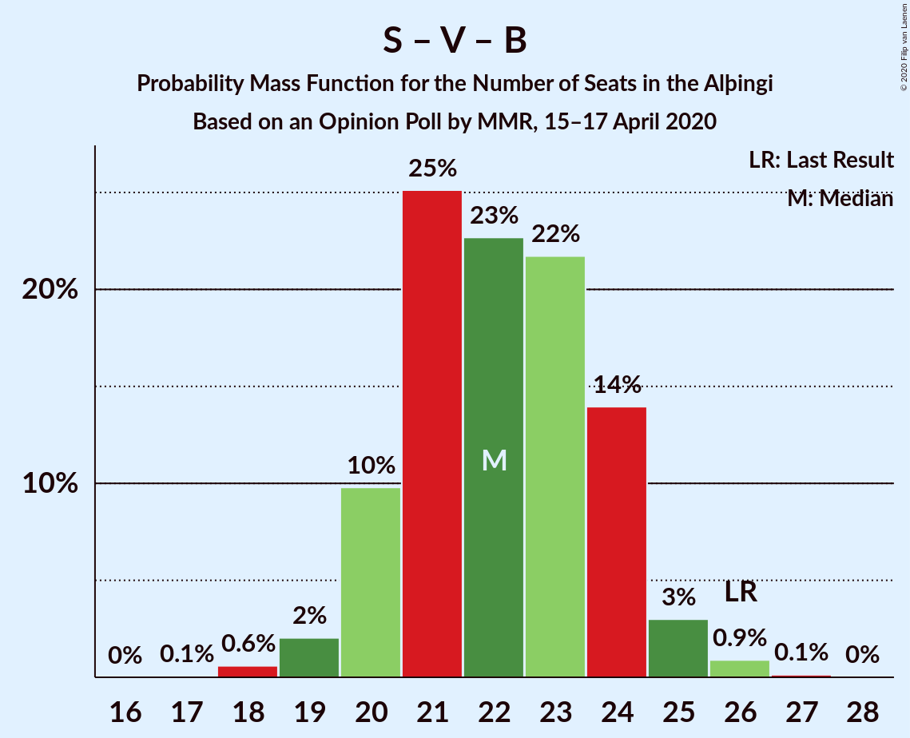

# Opinion Poll by MMR, 15–17 April 2020

<a href="#voting-intentions">Voting Intentions</a> | <a href="#seats">Seats</a> | <a href="#coalitions">Coalitions</a> | <a href="#technical-information">Technical Information</a>

## Voting Intentions

### Confidence Intervals

| Party | Last Result | Poll Result | 80% Confidence Interval | 90% Confidence Interval | 95% Confidence Interval | 99% Confidence Interval |
|:-----:|:-----------:|:-----------:|:-----------------------:|:-----------------------:|:-----------------------:|:-----------------------:|
| Sjálfstæðisflokkurinn | 25.2% | 22.6% | 21.0–24.4% |20.6–24.8% |20.2–25.3% |19.5–26.1% |
| Samfylkingin | 12.1% | 13.1% | 11.9–14.6% |11.5–15.0% |11.2–15.3% |10.7–16.0% |
| Píratar | 9.2% | 12.3% | 11.1–13.7% |10.7–14.1% |10.4–14.4% |9.9–15.1% |
| Vinstrihreyfingin – grænt framboð | 16.9% | 10.4% | 9.3–11.7% |8.9–12.0% |8.7–12.4% |8.2–13.0% |
| Viðreisn | 6.7% | 10.0% | 8.9–11.3% |8.6–11.6% |8.3–11.9% |7.8–12.6% |
| Framsóknarflokkurinn | 10.7% | 9.8% | 8.7–11.1% |8.4–11.4% |8.1–11.8% |7.7–12.4% |
| Miðflokkurinn | 10.9% | 9.5% | 8.4–10.8% |8.1–11.1% |7.9–11.4% |7.4–12.1% |
| Sósíalistaflokkur Íslands | 0.0% | 5.6% | 4.8–6.6% |4.6–6.9% |4.4–7.2% |4.0–7.7% |
| Flokkur fólksins | 6.9% | 4.7% | 3.9–5.6% |3.7–5.9% |3.5–6.1% |3.2–6.6% |

*Note:* The poll result column reflects the actual value used in the calculations. Published results may vary slightly, and in addition be rounded to fewer digits.

## Seats

### Confidence Intervals

| Party | Last Result | Median | 80% Confidence Interval | 90% Confidence Interval | 95% Confidence Interval | 99% Confidence Interval |
|:-----:|:-----------:|:------:|:-----------------------:|:-----------------------:|:-----------------------:|:-----------------------:|
| <a href="#sjálfstæðisflokkurinn">Sjálfstæðisflokkurinn</a> | 16 | 16 | 14–18 |14–18 |14–18 |13–19 |
| <a href="#samfylkingin">Samfylkingin</a> | 7 | 9 | 8–10 |7–10 |7–10 |7–11 |
| <a href="#píratar">Píratar</a> | 6 | 8 | 7–9 |7–9 |7–10 |6–10 |
| <a href="#vinstrihreyfingin-–-grænt-framboð">Vinstrihreyfingin – grænt framboð</a> | 11 | 7 | 6–8 |5–8 |5–8 |5–9 |
| <a href="#viðreisn">Viðreisn</a> | 4 | 7 | 6–7 |5–8 |5–8 |5–8 |
| <a href="#framsóknarflokkurinn">Framsóknarflokkurinn</a> | 8 | 6 | 6–8 |5–8 |5–8 |5–9 |
| <a href="#miðflokkurinn">Miðflokkurinn</a> | 7 | 6 | 5–7 |5–8 |5–9 |5–9 |
| <a href="#sósíalistaflokkur-íslands">Sósíalistaflokkur Íslands</a> | 0 | 3 | 0–4 |0–4 |0–4 |0–5 |
| <a href="#flokkur-fólksins">Flokkur fólksins</a> | 4 | 0 | 0–3 |0–3 |0–4 |0–4 |

### Sjálfstæðisflokkurinn

*For a full overview of the results for this party, see the [Sjálfstæðisflokkurinn](party-sjálfstæðisflokkurinn.html) page.*

| Number of Seats | Probability | Accumulated | Special Marks |
|:---------------:|:-----------:|:-----------:|:-------------:|
| 13 | 2% | 100% |  |
| 14 | 10% | 98% |  |
| 15 | 23% | 88% |  |
| 16 | 31% | 65% | Last Result, Median |
| 17 | 14% | 34% |  |
| 18 | 19% | 20% |  |
| 19 | 0.9% | 0.9% |  |
| 20 | 0% | 0% |  |

### Samfylkingin

*For a full overview of the results for this party, see the [Samfylkingin](party-samfylkingin.html) page.*

| Number of Seats | Probability | Accumulated | Special Marks |
|:---------------:|:-----------:|:-----------:|:-------------:|
| 6 | 0.2% | 100% |  |
| 7 | 7% | 99.8% | Last Result |
| 8 | 30% | 92% |  |
| 9 | 42% | 62% | Median |
| 10 | 19% | 20% |  |
| 11 | 2% | 2% |  |
| 12 | 0.1% | 0.1% |  |
| 13 | 0% | 0% |  |

### Píratar

*For a full overview of the results for this party, see the [Píratar](party-píratar.html) page.*

| Number of Seats | Probability | Accumulated | Special Marks |
|:---------------:|:-----------:|:-----------:|:-------------:|
| 6 | 2% | 100% | Last Result |
| 7 | 12% | 98% |  |
| 8 | 63% | 85% | Median |
| 9 | 17% | 22% |  |
| 10 | 5% | 5% |  |
| 11 | 0.2% | 0.2% |  |
| 12 | 0% | 0% |  |

### Vinstrihreyfingin – grænt framboð

*For a full overview of the results for this party, see the [Vinstrihreyfingin – grænt framboð](party-vinstrihreyfingin–græntframboð.html) page.*

| Number of Seats | Probability | Accumulated | Special Marks |
|:---------------:|:-----------:|:-----------:|:-------------:|
| 5 | 7% | 100% |  |
| 6 | 29% | 93% |  |
| 7 | 51% | 65% | Median |
| 8 | 12% | 14% |  |
| 9 | 1.5% | 2% |  |
| 10 | 0.2% | 0.2% |  |
| 11 | 0% | 0% | Last Result |

### Viðreisn

*For a full overview of the results for this party, see the [Viðreisn](party-viðreisn.html) page.*

| Number of Seats | Probability | Accumulated | Special Marks |
|:---------------:|:-----------:|:-----------:|:-------------:|
| 4 | 0.1% | 100% | Last Result |
| 5 | 5% | 99.9% |  |
| 6 | 42% | 94% |  |
| 7 | 44% | 53% | Median |
| 8 | 8% | 9% |  |
| 9 | 0.5% | 0.5% |  |
| 10 | 0% | 0% |  |

### Framsóknarflokkurinn

*For a full overview of the results for this party, see the [Framsóknarflokkurinn](party-framsóknarflokkurinn.html) page.*

| Number of Seats | Probability | Accumulated | Special Marks |
|:---------------:|:-----------:|:-----------:|:-------------:|
| 4 | 0.3% | 100% |  |
| 5 | 9% | 99.7% |  |
| 6 | 43% | 91% | Median |
| 7 | 29% | 48% |  |
| 8 | 18% | 19% | Last Result |
| 9 | 1.1% | 1.4% |  |
| 10 | 0.4% | 0.4% |  |
| 11 | 0% | 0% |  |

### Miðflokkurinn

*For a full overview of the results for this party, see the [Miðflokkurinn](party-miðflokkurinn.html) page.*

| Number of Seats | Probability | Accumulated | Special Marks |
|:---------------:|:-----------:|:-----------:|:-------------:|
| 4 | 0.5% | 100% |  |
| 5 | 17% | 99.5% |  |
| 6 | 45% | 83% | Median |
| 7 | 30% | 38% | Last Result |
| 8 | 3% | 8% |  |
| 9 | 4% | 4% |  |
| 10 | 0.4% | 0.4% |  |
| 11 | 0% | 0% |  |

### Sósíalistaflokkur Íslands

*For a full overview of the results for this party, see the [Sósíalistaflokkur Íslands](party-sósíalistaflokkuríslands.html) page.*

| Number of Seats | Probability | Accumulated | Special Marks |
|:---------------:|:-----------:|:-----------:|:-------------:|
| 0 | 20% | 100% | Last Result |
| 1 | 0% | 80% |  |
| 2 | 0% | 80% |  |
| 3 | 41% | 80% | Median |
| 4 | 37% | 39% |  |
| 5 | 2% | 2% |  |
| 6 | 0% | 0% |  |

### Flokkur fólksins

*For a full overview of the results for this party, see the [Flokkur fólksins](party-flokkurfólksins.html) page.*

| Number of Seats | Probability | Accumulated | Special Marks |
|:---------------:|:-----------:|:-----------:|:-------------:|
| 0 | 67% | 100% | Median |
| 1 | 0.1% | 33% |  |
| 2 | 0% | 33% |  |
| 3 | 30% | 33% |  |
| 4 | 3% | 3% | Last Result |
| 5 | 0% | 0% |  |

## Coalitions

### Confidence Intervals

| Coalition | Last Result | Median | Majority? | 80% Confidence Interval | 90% Confidence Interval | 95% Confidence Interval | 99% Confidence Interval |
|:---------:|:-----------:|:------:|:---------:|:-----------------------:|:-----------------------:|:-----------------------:|:-----------------------:|
| Samfylkingin – Píratar – Vinstrihreyfingin – grænt framboð – Viðreisn | 28 | 30 | 22% | 28–32 | 28–33 | 27–33 | 26–35 |
| Sjálfstæðisflokkurinn – Vinstrihreyfingin – grænt framboð – Framsóknarflokkurinn | 35 | 29 | 7% | 27–31 | 27–32 | 27–32 | 26–33 |
| Sjálfstæðisflokkurinn – Framsóknarflokkurinn – Miðflokkurinn | 31 | 29 | 5% | 27–31 | 27–32 | 26–32 | 25–33 |
| Samfylkingin – Vinstrihreyfingin – grænt framboð – Framsóknarflokkurinn – Miðflokkurinn | 33 | 29 | 3% | 26–31 | 26–31 | 25–32 | 24–33 |
| Sjálfstæðisflokkurinn – Samfylkingin | 23 | 25 | 0% | 23–27 | 22–27 | 22–28 | 21–28 |
| Samfylkingin – Píratar – Vinstrihreyfingin – grænt framboð | 24 | 23 | 0% | 22–26 | 21–26 | 21–27 | 20–27 |
| Sjálfstæðisflokkurinn – Framsóknarflokkurinn | 24 | 23 | 0% | 21–24 | 20–25 | 20–25 | 19–26 |
| Sjálfstæðisflokkurinn – Miðflokkurinn | 23 | 23 | 0% | 20–24 | 20–25 | 20–25 | 19–26 |
| Sjálfstæðisflokkurinn – Vinstrihreyfingin – grænt framboð | 27 | 23 | 0% | 21–25 | 21–25 | 20–25 | 19–26 |
| Sjálfstæðisflokkurinn – Viðreisn | 20 | 23 | 0% | 21–24 | 20–25 | 20–25 | 19–26 |
| Samfylkingin – Vinstrihreyfingin – grænt framboð – Framsóknarflokkurinn | 26 | 22 | 0% | 20–24 | 20–24 | 19–25 | 18–26 |
| Samfylkingin – Vinstrihreyfingin – grænt framboð – Miðflokkurinn | 25 | 22 | 0% | 20–24 | 20–24 | 19–25 | 18–26 |
| Vinstrihreyfingin – grænt framboð – Framsóknarflokkurinn – Miðflokkurinn | 26 | 20 | 0% | 18–21 | 17–22 | 16–23 | 16–24 |
| Samfylkingin – Vinstrihreyfingin – grænt framboð | 18 | 15 | 0% | 14–17 | 14–17 | 13–18 | 12–19 |
| Píratar – Vinstrihreyfingin – grænt framboð | 17 | 15 | 0% | 13–16 | 13–17 | 13–17 | 12–18 |
| Vinstrihreyfingin – grænt framboð – Framsóknarflokkurinn | 19 | 13 | 0% | 12–15 | 11–15 | 11–16 | 10–17 |
| Vinstrihreyfingin – grænt framboð – Miðflokkurinn | 18 | 13 | 0% | 11–15 | 11–15 | 11–16 | 10–17 |

### Samfylkingin – Píratar – Vinstrihreyfingin – grænt framboð – Viðreisn

| Number of Seats | Probability | Accumulated | Special Marks |
|:---------------:|:-----------:|:-----------:|:-------------:|
| 25 | 0.3% | 100% |  |
| 26 | 2% | 99.6% |  |
| 27 | 2% | 98% |  |
| 28 | 6% | 96% | Last Result |
| 29 | 26% | 90% |  |
| 30 | 25% | 64% |  |
| 31 | 17% | 39% | Median |
| 32 | 15% | 22% | Majority |
| 33 | 5% | 7% |  |
| 34 | 1.3% | 2% |  |
| 35 | 0.6% | 0.7% |  |
| 36 | 0.1% | 0.1% |  |
| 37 | 0% | 0% |  |

### Sjálfstæðisflokkurinn – Vinstrihreyfingin – grænt framboð – Framsóknarflokkurinn

| Number of Seats | Probability | Accumulated | Special Marks |
|:---------------:|:-----------:|:-----------:|:-------------:|
| 24 | 0.1% | 100% |  |
| 25 | 0.3% | 99.9% |  |
| 26 | 2% | 99.7% |  |
| 27 | 13% | 98% |  |
| 28 | 13% | 85% |  |
| 29 | 22% | 72% | Median |
| 30 | 23% | 50% |  |
| 31 | 20% | 26% |  |
| 32 | 5% | 7% | Majority |
| 33 | 1.5% | 2% |  |
| 34 | 0.3% | 0.3% |  |
| 35 | 0% | 0% | Last Result |

### Sjálfstæðisflokkurinn – Framsóknarflokkurinn – Miðflokkurinn

| Number of Seats | Probability | Accumulated | Special Marks |
|:---------------:|:-----------:|:-----------:|:-------------:|
| 24 | 0.2% | 100% |  |
| 25 | 1.2% | 99.8% |  |
| 26 | 3% | 98.6% |  |
| 27 | 17% | 96% |  |
| 28 | 17% | 79% | Median |
| 29 | 19% | 61% |  |
| 30 | 27% | 43% |  |
| 31 | 10% | 15% | Last Result |
| 32 | 5% | 5% | Majority |
| 33 | 0.7% | 0.7% |  |
| 34 | 0% | 0% |  |

### Samfylkingin – Vinstrihreyfingin – grænt framboð – Framsóknarflokkurinn – Miðflokkurinn

| Number of Seats | Probability | Accumulated | Special Marks |
|:---------------:|:-----------:|:-----------:|:-------------:|
| 23 | 0.1% | 100% |  |
| 24 | 0.7% | 99.9% |  |
| 25 | 4% | 99.3% |  |
| 26 | 9% | 96% |  |
| 27 | 21% | 87% |  |
| 28 | 16% | 66% | Median |
| 29 | 22% | 50% |  |
| 30 | 17% | 29% |  |
| 31 | 8% | 12% |  |
| 32 | 3% | 3% | Majority |
| 33 | 0.4% | 0.6% | Last Result |
| 34 | 0.1% | 0.1% |  |
| 35 | 0% | 0% |  |

### Sjálfstæðisflokkurinn – Samfylkingin

| Number of Seats | Probability | Accumulated | Special Marks |
|:---------------:|:-----------:|:-----------:|:-------------:|
| 20 | 0.1% | 100% |  |
| 21 | 1.4% | 99.9% |  |
| 22 | 5% | 98% |  |
| 23 | 14% | 94% | Last Result |
| 24 | 20% | 80% |  |
| 25 | 27% | 60% | Median |
| 26 | 18% | 33% |  |
| 27 | 12% | 15% |  |
| 28 | 3% | 3% |  |
| 29 | 0.2% | 0.2% |  |
| 30 | 0% | 0% |  |

### Samfylkingin – Píratar – Vinstrihreyfingin – grænt framboð

| Number of Seats | Probability | Accumulated | Special Marks |
|:---------------:|:-----------:|:-----------:|:-------------:|
| 19 | 0.1% | 100% |  |
| 20 | 1.1% | 99.9% |  |
| 21 | 4% | 98.8% |  |
| 22 | 14% | 95% |  |
| 23 | 32% | 80% |  |
| 24 | 24% | 49% | Last Result, Median |
| 25 | 14% | 24% |  |
| 26 | 8% | 11% |  |
| 27 | 2% | 3% |  |
| 28 | 0.3% | 0.4% |  |
| 29 | 0.1% | 0.1% |  |
| 30 | 0% | 0% |  |

### Sjálfstæðisflokkurinn – Framsóknarflokkurinn

| Number of Seats | Probability | Accumulated | Special Marks |
|:---------------:|:-----------:|:-----------:|:-------------:|
| 18 | 0.2% | 100% |  |
| 19 | 1.1% | 99.8% |  |
| 20 | 6% | 98.7% |  |
| 21 | 14% | 93% |  |
| 22 | 24% | 79% | Median |
| 23 | 24% | 55% |  |
| 24 | 23% | 31% | Last Result |
| 25 | 6% | 8% |  |
| 26 | 2% | 2% |  |
| 27 | 0.2% | 0.2% |  |
| 28 | 0% | 0% |  |

### Sjálfstæðisflokkurinn – Miðflokkurinn

| Number of Seats | Probability | Accumulated | Special Marks |
|:---------------:|:-----------:|:-----------:|:-------------:|
| 18 | 0.2% | 100% |  |
| 19 | 2% | 99.8% |  |
| 20 | 10% | 98% |  |
| 21 | 18% | 88% |  |
| 22 | 18% | 70% | Median |
| 23 | 28% | 52% | Last Result |
| 24 | 17% | 24% |  |
| 25 | 6% | 7% |  |
| 26 | 0.9% | 1.0% |  |
| 27 | 0.1% | 0.2% |  |
| 28 | 0% | 0% |  |

### Sjálfstæðisflokkurinn – Vinstrihreyfingin – grænt framboð

| Number of Seats | Probability | Accumulated | Special Marks |
|:---------------:|:-----------:|:-----------:|:-------------:|
| 18 | 0.1% | 100% |  |
| 19 | 0.9% | 99.9% |  |
| 20 | 3% | 99.0% |  |
| 21 | 18% | 96% |  |
| 22 | 18% | 77% |  |
| 23 | 27% | 59% | Median |
| 24 | 18% | 32% |  |
| 25 | 13% | 14% |  |
| 26 | 2% | 2% |  |
| 27 | 0.3% | 0.3% | Last Result |
| 28 | 0% | 0% |  |

### Sjálfstæðisflokkurinn – Viðreisn

| Number of Seats | Probability | Accumulated | Special Marks |
|:---------------:|:-----------:|:-----------:|:-------------:|
| 18 | 0.1% | 100% |  |
| 19 | 2% | 99.9% |  |
| 20 | 6% | 98% | Last Result |
| 21 | 14% | 92% |  |
| 22 | 26% | 78% |  |
| 23 | 22% | 53% | Median |
| 24 | 21% | 30% |  |
| 25 | 9% | 10% |  |
| 26 | 0.7% | 0.7% |  |
| 27 | 0% | 0.1% |  |
| 28 | 0% | 0% |  |

### Samfylkingin – Vinstrihreyfingin – grænt framboð – Framsóknarflokkurinn

| Number of Seats | Probability | Accumulated | Special Marks |
|:---------------:|:-----------:|:-----------:|:-------------:|
| 17 | 0.1% | 100% |  |
| 18 | 0.6% | 99.9% |  |
| 19 | 2% | 99.3% |  |
| 20 | 10% | 97% |  |
| 21 | 25% | 88% |  |
| 22 | 23% | 62% | Median |
| 23 | 22% | 40% |  |
| 24 | 14% | 18% |  |
| 25 | 3% | 4% |  |
| 26 | 0.9% | 1.0% | Last Result |
| 27 | 0.1% | 0.2% |  |
| 28 | 0% | 0% |  |

### Samfylkingin – Vinstrihreyfingin – grænt framboð – Miðflokkurinn

| Number of Seats | Probability | Accumulated | Special Marks |
|:---------------:|:-----------:|:-----------:|:-------------:|
| 17 | 0.1% | 100% |  |
| 18 | 1.1% | 99.9% |  |
| 19 | 3% | 98.8% |  |
| 20 | 16% | 96% |  |
| 21 | 24% | 80% |  |
| 22 | 19% | 56% | Median |
| 23 | 25% | 37% |  |
| 24 | 8% | 12% |  |
| 25 | 3% | 4% | Last Result |
| 26 | 0.7% | 0.9% |  |
| 27 | 0.2% | 0.2% |  |
| 28 | 0% | 0% |  |

### Vinstrihreyfingin – grænt framboð – Framsóknarflokkurinn – Miðflokkurinn

| Number of Seats | Probability | Accumulated | Special Marks |
|:---------------:|:-----------:|:-----------:|:-------------:|
| 15 | 0.1% | 100% |  |
| 16 | 3% | 99.9% |  |
| 17 | 4% | 97% |  |
| 18 | 15% | 93% |  |
| 19 | 25% | 77% | Median |
| 20 | 20% | 52% |  |
| 21 | 23% | 32% |  |
| 22 | 5% | 10% |  |
| 23 | 3% | 4% |  |
| 24 | 1.1% | 1.2% |  |
| 25 | 0.1% | 0.1% |  |
| 26 | 0% | 0% | Last Result |

### Samfylkingin – Vinstrihreyfingin – grænt framboð

| Number of Seats | Probability | Accumulated | Special Marks |
|:---------------:|:-----------:|:-----------:|:-------------:|
| 12 | 0.8% | 100% |  |
| 13 | 2% | 99.2% |  |
| 14 | 17% | 97% |  |
| 15 | 32% | 81% |  |
| 16 | 29% | 49% | Median |
| 17 | 15% | 20% |  |
| 18 | 4% | 4% | Last Result |
| 19 | 0.4% | 0.5% |  |
| 20 | 0.1% | 0.1% |  |
| 21 | 0% | 0% |  |

### Píratar – Vinstrihreyfingin – grænt framboð

| Number of Seats | Probability | Accumulated | Special Marks |
|:---------------:|:-----------:|:-----------:|:-------------:|
| 11 | 0.2% | 100% |  |
| 12 | 1.4% | 99.8% |  |
| 13 | 9% | 98% |  |
| 14 | 22% | 89% |  |
| 15 | 45% | 67% | Median |
| 16 | 15% | 22% |  |
| 17 | 6% | 7% | Last Result |
| 18 | 1.1% | 1.2% |  |
| 19 | 0.1% | 0.1% |  |
| 20 | 0% | 0% |  |

### Vinstrihreyfingin – grænt framboð – Framsóknarflokkurinn

| Number of Seats | Probability | Accumulated | Special Marks |
|:---------------:|:-----------:|:-----------:|:-------------:|
| 10 | 0.6% | 100% |  |
| 11 | 8% | 99.4% |  |
| 12 | 16% | 91% |  |
| 13 | 30% | 76% | Median |
| 14 | 29% | 46% |  |
| 15 | 13% | 17% |  |
| 16 | 3% | 3% |  |
| 17 | 0.6% | 0.6% |  |
| 18 | 0% | 0% |  |
| 19 | 0% | 0% | Last Result |

### Vinstrihreyfingin – grænt framboð – Miðflokkurinn

| Number of Seats | Probability | Accumulated | Special Marks |
|:---------------:|:-----------:|:-----------:|:-------------:|
| 10 | 0.9% | 100% |  |
| 11 | 10% | 99.0% |  |
| 12 | 24% | 89% |  |
| 13 | 26% | 65% | Median |
| 14 | 28% | 39% |  |
| 15 | 7% | 10% |  |
| 16 | 3% | 3% |  |
| 17 | 0.7% | 0.8% |  |
| 18 | 0% | 0.1% | Last Result |
| 19 | 0% | 0% |  |

## Technical Information

### Opinion Poll

+ **Polling firm:** MMR
+ **Commissioner(s):** —
+ **Fieldwork period:** 15–17 April 2020

### Calculations

+ **Sample size:** 1051
+ **Simulations done:** 1,048,576
+ **Error estimate:** 2.24%

