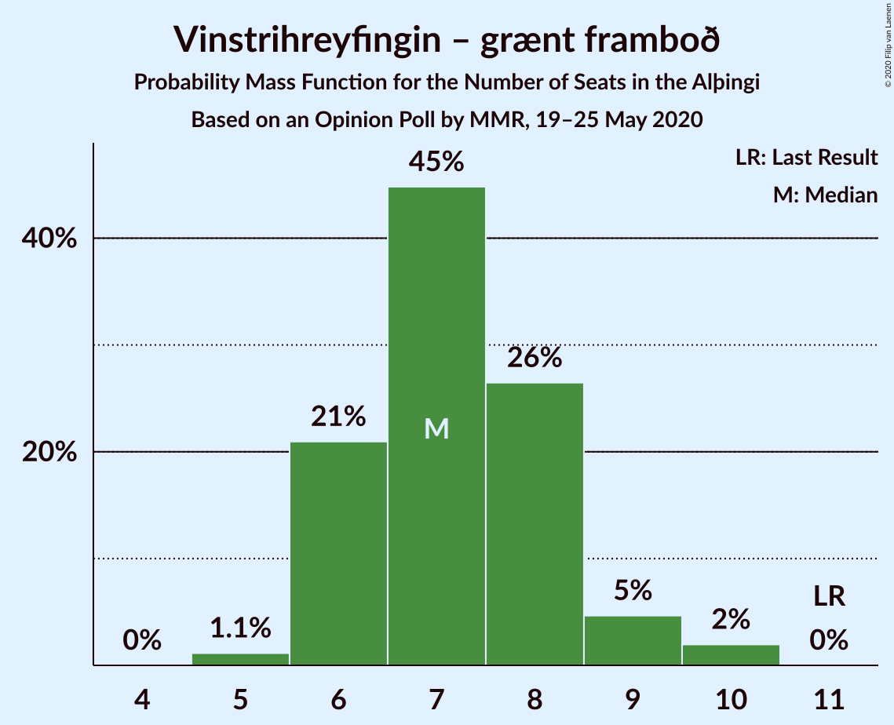
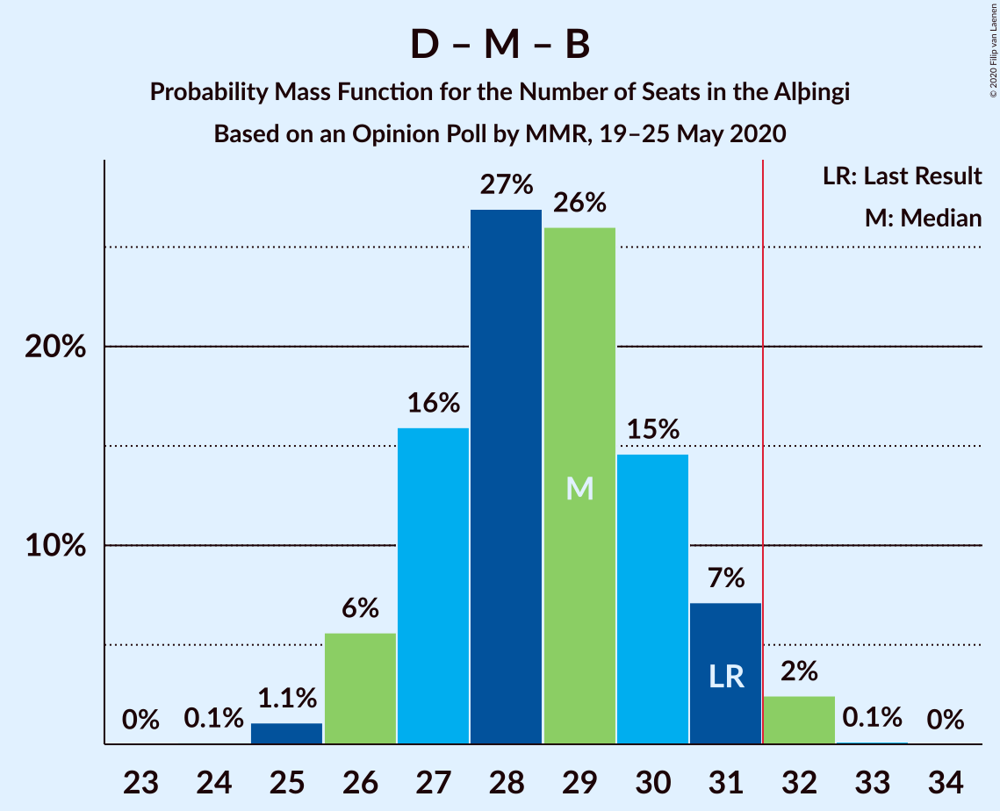
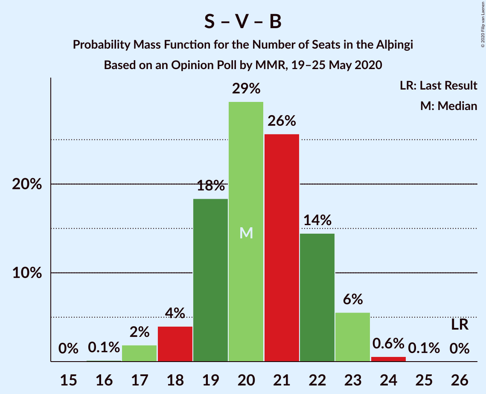

# Opinion Poll by MMR, 19–25 May 2020

<a href="#voting-intentions">Voting Intentions</a> | <a href="#seats">Seats</a> | <a href="#coalitions">Coalitions</a> | <a href="#technical-information">Technical Information</a>

## Voting Intentions

### Confidence Intervals

| Party | Last Result | Poll Result | 80% Confidence Interval | 90% Confidence Interval | 95% Confidence Interval | 99% Confidence Interval |
|:-----:|:-----------:|:-----------:|:-----------------------:|:-----------------------:|:-----------------------:|:-----------------------:|
| Sjálfstæðisflokkurinn | 25.2% | 23.5% | 21.9–25.3% |21.4–25.8% |21.0–26.3% |20.2–27.1% |
| Píratar | 9.2% | 14.6% | 13.2–16.1% |12.8–16.5% |12.5–16.9% |11.9–17.7% |
| Samfylkingin | 12.1% | 13.3% | 12.0–14.8% |11.6–15.2% |11.3–15.5% |10.7–16.3% |
| Viðreisn | 6.7% | 11.3% | 10.1–12.7% |9.7–13.0% |9.4–13.4% |8.9–14.1% |
| Miðflokkurinn | 10.9% | 10.8% | 9.6–12.1% |9.3–12.5% |9.0–12.8% |8.5–13.5% |
| Vinstrihreyfingin – grænt framboð | 16.9% | 10.6% | 9.4–11.9% |9.1–12.3% |8.8–12.6% |8.3–13.3% |
| Framsóknarflokkurinn | 10.7% | 6.4% | 5.5–7.5% |5.3–7.9% |5.1–8.1% |4.7–8.7% |
| Sósíalistaflokkur Íslands | 0.0% | 4.1% | 3.4–5.1% |3.2–5.3% |3.0–5.5% |2.7–6.0% |
| Flokkur fólksins | 6.9% | 3.6% | 3.0–4.5% |2.8–4.8% |2.6–5.0% |2.3–5.4% |

*Note:* The poll result column reflects the actual value used in the calculations. Published results may vary slightly, and in addition be rounded to fewer digits.

## Seats

### Confidence Intervals

| Party | Last Result | Median | 80% Confidence Interval | 90% Confidence Interval | 95% Confidence Interval | 99% Confidence Interval |
|:-----:|:-----------:|:------:|:-----------------------:|:-----------------------:|:-----------------------:|:-----------------------:|
| <a href="#sjálfstæðisflokkurinn">Sjálfstæðisflokkurinn</a> | 16 | 17 | 15–19 |15–19 |15–19 |15–20 |
| <a href="#píratar">Píratar</a> | 6 | 10 | 9–11 |9–11 |9–11 |8–12 |
| <a href="#samfylkingin">Samfylkingin</a> | 7 | 9 | 8–11 |8–11 |8–11 |7–11 |
| <a href="#viðreisn">Viðreisn</a> | 4 | 8 | 7–8 |6–9 |6–10 |6–10 |
| <a href="#miðflokkurinn">Miðflokkurinn</a> | 7 | 8 | 6–9 |6–9 |6–10 |6–10 |
| <a href="#vinstrihreyfingin-–-grænt-framboð">Vinstrihreyfingin – grænt framboð</a> | 11 | 7 | 6–8 |6–8 |6–9 |5–10 |
| <a href="#framsóknarflokkurinn">Framsóknarflokkurinn</a> | 8 | 4 | 3–5 |3–5 |2–5 |2–6 |
| <a href="#sósíalistaflokkur-íslands">Sósíalistaflokkur Íslands</a> | 0 | 0 | 0–3 |0–3 |0–3 |0–4 |
| <a href="#flokkur-fólksins">Flokkur fólksins</a> | 4 | 0 | 0 |0 |0–3 |0–4 |

### Sjálfstæðisflokkurinn

*For a full overview of the results for this party, see the [Sjálfstæðisflokkurinn](party-sjálfstæðisflokkurinn.html) page.*

| Number of Seats | Probability | Accumulated | Special Marks |
|:---------------:|:-----------:|:-----------:|:-------------:|
| 14 | 0.5% | 100% |  |
| 15 | 12% | 99.5% |  |
| 16 | 28% | 88% | Last Result |
| 17 | 24% | 60% | Median |
| 18 | 23% | 36% |  |
| 19 | 11% | 13% |  |
| 20 | 1.4% | 2% |  |
| 21 | 0.4% | 0.4% |  |
| 22 | 0% | 0% |  |

### Píratar

*For a full overview of the results for this party, see the [Píratar](party-píratar.html) page.*

| Number of Seats | Probability | Accumulated | Special Marks |
|:---------------:|:-----------:|:-----------:|:-------------:|
| 6 | 0% | 100% | Last Result |
| 7 | 0.2% | 100% |  |
| 8 | 2% | 99.8% |  |
| 9 | 41% | 98% |  |
| 10 | 36% | 57% | Median |
| 11 | 18% | 21% |  |
| 12 | 2% | 2% |  |
| 13 | 0.3% | 0.3% |  |
| 14 | 0% | 0% |  |

### Samfylkingin

*For a full overview of the results for this party, see the [Samfylkingin](party-samfylkingin.html) page.*

| Number of Seats | Probability | Accumulated | Special Marks |
|:---------------:|:-----------:|:-----------:|:-------------:|
| 6 | 0.1% | 100% |  |
| 7 | 2% | 99.9% | Last Result |
| 8 | 18% | 98% |  |
| 9 | 44% | 80% | Median |
| 10 | 22% | 36% |  |
| 11 | 13% | 13% |  |
| 12 | 0.1% | 0.1% |  |
| 13 | 0% | 0% |  |

### Viðreisn

*For a full overview of the results for this party, see the [Viðreisn](party-viðreisn.html) page.*

| Number of Seats | Probability | Accumulated | Special Marks |
|:---------------:|:-----------:|:-----------:|:-------------:|
| 4 | 0% | 100% | Last Result |
| 5 | 0.1% | 100% |  |
| 6 | 6% | 99.9% |  |
| 7 | 27% | 94% |  |
| 8 | 59% | 68% | Median |
| 9 | 5% | 9% |  |
| 10 | 4% | 4% |  |
| 11 | 0% | 0% |  |

### Miðflokkurinn

*For a full overview of the results for this party, see the [Miðflokkurinn](party-miðflokkurinn.html) page.*

| Number of Seats | Probability | Accumulated | Special Marks |
|:---------------:|:-----------:|:-----------:|:-------------:|
| 5 | 0.1% | 100% |  |
| 6 | 27% | 99.9% |  |
| 7 | 14% | 72% | Last Result |
| 8 | 21% | 59% | Median |
| 9 | 35% | 38% |  |
| 10 | 3% | 3% |  |
| 11 | 0% | 0% |  |

### Vinstrihreyfingin – grænt framboð

*For a full overview of the results for this party, see the [Vinstrihreyfingin – grænt framboð](party-vinstrihreyfingin–græntframboð.html) page.*

| Number of Seats | Probability | Accumulated | Special Marks |
|:---------------:|:-----------:|:-----------:|:-------------:|
| 5 | 0.7% | 100% |  |
| 6 | 19% | 99.3% |  |
| 7 | 66% | 81% | Median |
| 8 | 11% | 14% |  |
| 9 | 2% | 3% |  |
| 10 | 1.0% | 1.0% |  |
| 11 | 0% | 0% | Last Result |

### Framsóknarflokkurinn

*For a full overview of the results for this party, see the [Framsóknarflokkurinn](party-framsóknarflokkurinn.html) page.*

| Number of Seats | Probability | Accumulated | Special Marks |
|:---------------:|:-----------:|:-----------:|:-------------:|
| 2 | 3% | 100% |  |
| 3 | 12% | 97% |  |
| 4 | 62% | 84% | Median |
| 5 | 21% | 22% |  |
| 6 | 0.8% | 0.8% |  |
| 7 | 0% | 0% |  |
| 8 | 0% | 0% | Last Result |

### Sósíalistaflokkur Íslands

*For a full overview of the results for this party, see the [Sósíalistaflokkur Íslands](party-sósíalistaflokkuríslands.html) page.*

| Number of Seats | Probability | Accumulated | Special Marks |
|:---------------:|:-----------:|:-----------:|:-------------:|
| 0 | 88% | 100% | Last Result, Median |
| 1 | 0.1% | 12% |  |
| 2 | 0% | 11% |  |
| 3 | 11% | 11% |  |
| 4 | 0.7% | 0.7% |  |
| 5 | 0% | 0% |  |

### Flokkur fólksins

*For a full overview of the results for this party, see the [Flokkur fólksins](party-flokkurfólksins.html) page.*

| Number of Seats | Probability | Accumulated | Special Marks |
|:---------------:|:-----------:|:-----------:|:-------------:|
| 0 | 95% | 100% | Median |
| 1 | 1.0% | 5% |  |
| 2 | 0% | 4% |  |
| 3 | 3% | 4% |  |
| 4 | 0.8% | 0.8% | Last Result |
| 5 | 0% | 0% |  |

## Coalitions

### Confidence Intervals

| Coalition | Last Result | Median | Majority? | 80% Confidence Interval | 90% Confidence Interval | 95% Confidence Interval | 99% Confidence Interval |
|:---------:|:-----------:|:------:|:---------:|:-----------------------:|:-----------------------:|:-----------------------:|:-----------------------:|
| Píratar – Samfylkingin – Viðreisn – Vinstrihreyfingin – grænt framboð | 28 | 34 | 93% | 32–36 | 31–36 | 31–37 | 30–37 |
| Sjálfstæðisflokkurinn – Miðflokkurinn – Framsóknarflokkurinn | 31 | 29 | 4% | 27–31 | 26–31 | 26–32 | 25–32 |
| Samfylkingin – Miðflokkurinn – Vinstrihreyfingin – grænt framboð – Framsóknarflokkurinn | 33 | 28 | 0.4% | 26–30 | 26–30 | 25–30 | 25–31 |
| Sjálfstæðisflokkurinn – Vinstrihreyfingin – grænt framboð – Framsóknarflokkurinn | 35 | 28 | 0.4% | 26–30 | 26–30 | 25–30 | 25–31 |
| Píratar – Samfylkingin – Vinstrihreyfingin – grænt framboð | 24 | 26 | 0% | 24–28 | 24–28 | 24–29 | 22–30 |
| Sjálfstæðisflokkurinn – Samfylkingin | 23 | 26 | 0% | 25–28 | 24–28 | 24–29 | 23–29 |
| Sjálfstæðisflokkurinn – Miðflokkurinn | 23 | 25 | 0% | 22–27 | 22–28 | 22–28 | 22–28 |
| Sjálfstæðisflokkurinn – Viðreisn | 20 | 24 | 0% | 23–26 | 23–27 | 22–27 | 22–28 |
| Samfylkingin – Miðflokkurinn – Vinstrihreyfingin – grænt framboð | 25 | 24 | 0% | 22–26 | 22–26 | 21–26 | 20–27 |
| Sjálfstæðisflokkurinn – Vinstrihreyfingin – grænt framboð | 27 | 24 | 0% | 22–25 | 22–26 | 21–26 | 21–27 |
| Samfylkingin – Vinstrihreyfingin – grænt framboð – Framsóknarflokkurinn | 26 | 20 | 0% | 19–22 | 18–22 | 18–23 | 17–24 |
| Sjálfstæðisflokkurinn – Framsóknarflokkurinn | 24 | 21 | 0% | 19–23 | 19–23 | 18–23 | 18–24 |
| Miðflokkurinn – Vinstrihreyfingin – grænt framboð – Framsóknarflokkurinn | 26 | 19 | 0% | 17–20 | 17–21 | 16–21 | 16–22 |
| Píratar – Vinstrihreyfingin – grænt framboð | 17 | 17 | 0% | 15–18 | 15–19 | 15–19 | 14–21 |
| Samfylkingin – Vinstrihreyfingin – grænt framboð | 18 | 16 | 0% | 15–18 | 14–18 | 14–18 | 13–19 |
| Miðflokkurinn – Vinstrihreyfingin – grænt framboð | 18 | 15 | 0% | 13–16 | 13–17 | 13–17 | 12–18 |
| Vinstrihreyfingin – grænt framboð – Framsóknarflokkurinn | 19 | 11 | 0% | 10–12 | 10–13 | 9–13 | 9–15 |

### Píratar – Samfylkingin – Viðreisn – Vinstrihreyfingin – grænt framboð

| Number of Seats | Probability | Accumulated | Special Marks |
|:---------------:|:-----------:|:-----------:|:-------------:|
| 28 | 0% | 100% | Last Result |
| 29 | 0.2% | 99.9% |  |
| 30 | 0.8% | 99.8% |  |
| 31 | 6% | 99.0% |  |
| 32 | 18% | 93% | Majority |
| 33 | 12% | 76% |  |
| 34 | 34% | 64% | Median |
| 35 | 19% | 30% |  |
| 36 | 7% | 11% |  |
| 37 | 4% | 4% |  |
| 38 | 0.4% | 0.4% |  |
| 39 | 0% | 0% |  |

### Sjálfstæðisflokkurinn – Miðflokkurinn – Framsóknarflokkurinn

| Number of Seats | Probability | Accumulated | Special Marks |
|:---------------:|:-----------:|:-----------:|:-------------:|
| 25 | 2% | 100% |  |
| 26 | 6% | 98% |  |
| 27 | 16% | 91% |  |
| 28 | 17% | 75% |  |
| 29 | 32% | 59% | Median |
| 30 | 6% | 26% |  |
| 31 | 16% | 21% | Last Result |
| 32 | 4% | 4% | Majority |
| 33 | 0.1% | 0.1% |  |
| 34 | 0% | 0% |  |

### Samfylkingin – Miðflokkurinn – Vinstrihreyfingin – grænt framboð – Framsóknarflokkurinn

| Number of Seats | Probability | Accumulated | Special Marks |
|:---------------:|:-----------:|:-----------:|:-------------:|
| 23 | 0.1% | 100% |  |
| 24 | 0.4% | 99.9% |  |
| 25 | 2% | 99.5% |  |
| 26 | 18% | 97% |  |
| 27 | 15% | 79% |  |
| 28 | 26% | 65% | Median |
| 29 | 18% | 38% |  |
| 30 | 18% | 20% |  |
| 31 | 2% | 2% |  |
| 32 | 0.4% | 0.4% | Majority |
| 33 | 0% | 0% | Last Result |

### Sjálfstæðisflokkurinn – Vinstrihreyfingin – grænt framboð – Framsóknarflokkurinn

| Number of Seats | Probability | Accumulated | Special Marks |
|:---------------:|:-----------:|:-----------:|:-------------:|
| 24 | 0.3% | 100% |  |
| 25 | 3% | 99.7% |  |
| 26 | 9% | 96% |  |
| 27 | 29% | 88% |  |
| 28 | 19% | 58% | Median |
| 29 | 24% | 40% |  |
| 30 | 14% | 16% |  |
| 31 | 1.3% | 2% |  |
| 32 | 0.4% | 0.4% | Majority |
| 33 | 0.1% | 0.1% |  |
| 34 | 0% | 0% |  |
| 35 | 0% | 0% | Last Result |

### Píratar – Samfylkingin – Vinstrihreyfingin – grænt framboð

| Number of Seats | Probability | Accumulated | Special Marks |
|:---------------:|:-----------:|:-----------:|:-------------:|
| 22 | 0.5% | 100% |  |
| 23 | 1.1% | 99.5% |  |
| 24 | 22% | 98% | Last Result |
| 25 | 5% | 77% |  |
| 26 | 35% | 72% | Median |
| 27 | 22% | 37% |  |
| 28 | 11% | 15% |  |
| 29 | 3% | 4% |  |
| 30 | 0.9% | 0.9% |  |
| 31 | 0% | 0% |  |

### Sjálfstæðisflokkurinn – Samfylkingin

| Number of Seats | Probability | Accumulated | Special Marks |
|:---------------:|:-----------:|:-----------:|:-------------:|
| 22 | 0.5% | 100% |  |
| 23 | 2% | 99.5% | Last Result |
| 24 | 7% | 98% |  |
| 25 | 15% | 91% |  |
| 26 | 40% | 76% | Median |
| 27 | 16% | 36% |  |
| 28 | 16% | 20% |  |
| 29 | 4% | 4% |  |
| 30 | 0.4% | 0.4% |  |
| 31 | 0% | 0% |  |

### Sjálfstæðisflokkurinn – Miðflokkurinn

| Number of Seats | Probability | Accumulated | Special Marks |
|:---------------:|:-----------:|:-----------:|:-------------:|
| 21 | 0.4% | 100% |  |
| 22 | 11% | 99.6% |  |
| 23 | 13% | 88% | Last Result |
| 24 | 19% | 75% |  |
| 25 | 29% | 56% | Median |
| 26 | 8% | 27% |  |
| 27 | 13% | 19% |  |
| 28 | 6% | 6% |  |
| 29 | 0% | 0% |  |

### Sjálfstæðisflokkurinn – Viðreisn

| Number of Seats | Probability | Accumulated | Special Marks |
|:---------------:|:-----------:|:-----------:|:-------------:|
| 20 | 0.1% | 100% | Last Result |
| 21 | 0.3% | 99.9% |  |
| 22 | 4% | 99.6% |  |
| 23 | 13% | 96% |  |
| 24 | 33% | 83% |  |
| 25 | 14% | 50% | Median |
| 26 | 28% | 36% |  |
| 27 | 7% | 8% |  |
| 28 | 1.0% | 1.1% |  |
| 29 | 0.1% | 0.1% |  |
| 30 | 0% | 0% |  |

### Samfylkingin – Miðflokkurinn – Vinstrihreyfingin – grænt framboð

| Number of Seats | Probability | Accumulated | Special Marks |
|:---------------:|:-----------:|:-----------:|:-------------:|
| 19 | 0.1% | 100% |  |
| 20 | 0.5% | 99.9% |  |
| 21 | 2% | 99.4% |  |
| 22 | 23% | 97% |  |
| 23 | 9% | 74% |  |
| 24 | 29% | 65% | Median |
| 25 | 13% | 37% | Last Result |
| 26 | 22% | 23% |  |
| 27 | 1.5% | 2% |  |
| 28 | 0.1% | 0.1% |  |
| 29 | 0% | 0% |  |

### Sjálfstæðisflokkurinn – Vinstrihreyfingin – grænt framboð

| Number of Seats | Probability | Accumulated | Special Marks |
|:---------------:|:-----------:|:-----------:|:-------------:|
| 20 | 0.2% | 100% |  |
| 21 | 2% | 99.8% |  |
| 22 | 9% | 97% |  |
| 23 | 28% | 88% |  |
| 24 | 19% | 60% | Median |
| 25 | 31% | 40% |  |
| 26 | 8% | 9% |  |
| 27 | 0.5% | 0.9% | Last Result |
| 28 | 0.4% | 0.4% |  |
| 29 | 0% | 0% |  |

### Samfylkingin – Vinstrihreyfingin – grænt framboð – Framsóknarflokkurinn

| Number of Seats | Probability | Accumulated | Special Marks |
|:---------------:|:-----------:|:-----------:|:-------------:|
| 16 | 0.1% | 100% |  |
| 17 | 2% | 99.9% |  |
| 18 | 5% | 98% |  |
| 19 | 20% | 93% |  |
| 20 | 26% | 73% | Median |
| 21 | 31% | 47% |  |
| 22 | 14% | 16% |  |
| 23 | 2% | 3% |  |
| 24 | 0.8% | 0.9% |  |
| 25 | 0.1% | 0.1% |  |
| 26 | 0% | 0% | Last Result |

### Sjálfstæðisflokkurinn – Framsóknarflokkurinn

| Number of Seats | Probability | Accumulated | Special Marks |
|:---------------:|:-----------:|:-----------:|:-------------:|
| 17 | 0.5% | 100% |  |
| 18 | 3% | 99.5% |  |
| 19 | 8% | 97% |  |
| 20 | 32% | 89% |  |
| 21 | 19% | 57% | Median |
| 22 | 19% | 39% |  |
| 23 | 18% | 20% |  |
| 24 | 1.1% | 2% | Last Result |
| 25 | 0.4% | 0.4% |  |
| 26 | 0% | 0% |  |

### Miðflokkurinn – Vinstrihreyfingin – grænt framboð – Framsóknarflokkurinn

| Number of Seats | Probability | Accumulated | Special Marks |
|:---------------:|:-----------:|:-----------:|:-------------:|
| 15 | 0.1% | 100% |  |
| 16 | 3% | 99.9% |  |
| 17 | 18% | 97% |  |
| 18 | 25% | 79% |  |
| 19 | 19% | 54% | Median |
| 20 | 29% | 36% |  |
| 21 | 5% | 7% |  |
| 22 | 1.1% | 1.3% |  |
| 23 | 0.2% | 0.3% |  |
| 24 | 0% | 0% |  |
| 25 | 0% | 0% |  |
| 26 | 0% | 0% | Last Result |

### Píratar – Vinstrihreyfingin – grænt framboð

| Number of Seats | Probability | Accumulated | Special Marks |
|:---------------:|:-----------:|:-----------:|:-------------:|
| 13 | 0.1% | 100% |  |
| 14 | 0.9% | 99.9% |  |
| 15 | 9% | 99.0% |  |
| 16 | 34% | 90% |  |
| 17 | 34% | 56% | Last Result, Median |
| 18 | 16% | 22% |  |
| 19 | 5% | 6% |  |
| 20 | 1.1% | 2% |  |
| 21 | 0.7% | 0.7% |  |
| 22 | 0% | 0% |  |

### Samfylkingin – Vinstrihreyfingin – grænt framboð

| Number of Seats | Probability | Accumulated | Special Marks |
|:---------------:|:-----------:|:-----------:|:-------------:|
| 12 | 0.1% | 100% |  |
| 13 | 0.9% | 99.9% |  |
| 14 | 5% | 99.1% |  |
| 15 | 22% | 94% |  |
| 16 | 33% | 73% | Median |
| 17 | 22% | 40% |  |
| 18 | 16% | 18% | Last Result |
| 19 | 2% | 2% |  |
| 20 | 0.2% | 0.2% |  |
| 21 | 0% | 0% |  |

### Miðflokkurinn – Vinstrihreyfingin – grænt framboð

| Number of Seats | Probability | Accumulated | Special Marks |
|:---------------:|:-----------:|:-----------:|:-------------:|
| 12 | 2% | 100% |  |
| 13 | 25% | 98% |  |
| 14 | 15% | 73% |  |
| 15 | 25% | 58% | Median |
| 16 | 29% | 34% |  |
| 17 | 4% | 5% |  |
| 18 | 1.1% | 1.2% | Last Result |
| 19 | 0% | 0% |  |

### Vinstrihreyfingin – grænt framboð – Framsóknarflokkurinn

| Number of Seats | Probability | Accumulated | Special Marks |
|:---------------:|:-----------:|:-----------:|:-------------:|
| 8 | 0.4% | 100% |  |
| 9 | 4% | 99.6% |  |
| 10 | 20% | 95% |  |
| 11 | 51% | 75% | Median |
| 12 | 19% | 25% |  |
| 13 | 4% | 5% |  |
| 14 | 0.6% | 1.4% |  |
| 15 | 0.7% | 0.7% |  |
| 16 | 0% | 0% |  |
| 17 | 0% | 0% |  |
| 18 | 0% | 0% |  |
| 19 | 0% | 0% | Last Result |

## Technical Information

### Opinion Poll

+ **Polling firm:** MMR
+ **Commissioner(s):** —
+ **Fieldwork period:** 19–25 May 2020

### Calculations

+ **Sample size:** 994
+ **Simulations done:** 131,072
+ **Error estimate:** 2.62%

