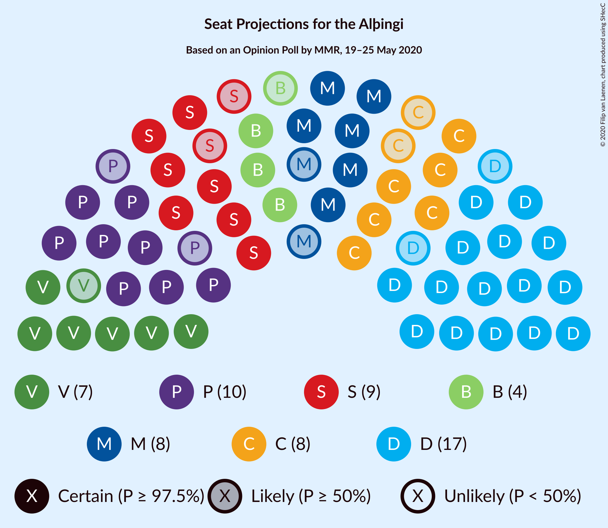
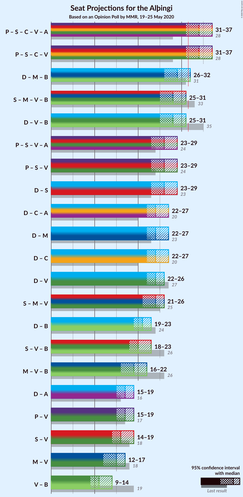
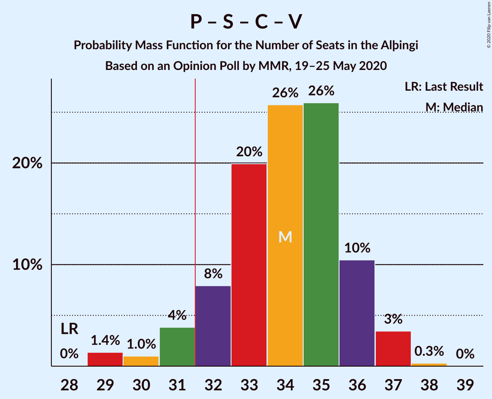
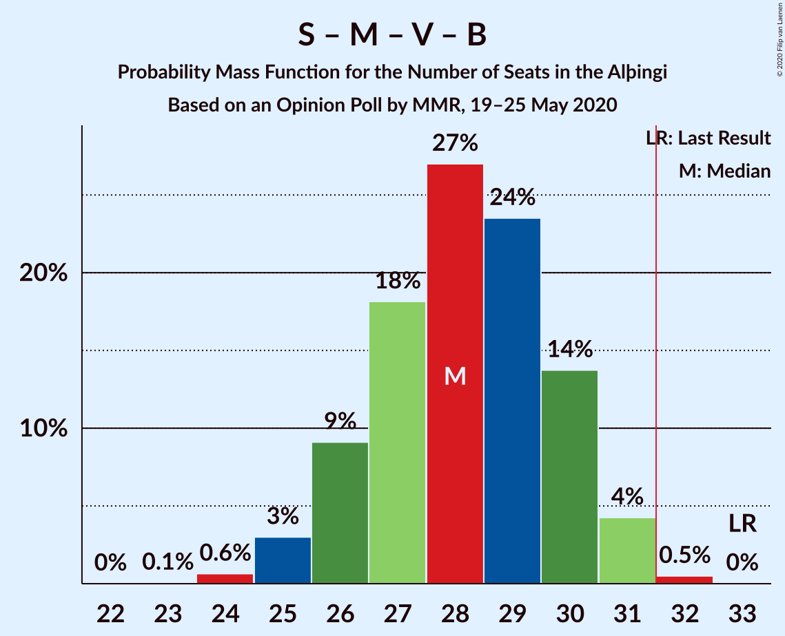
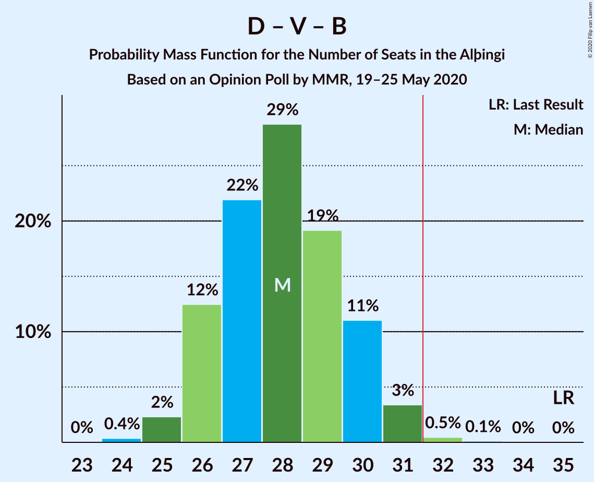
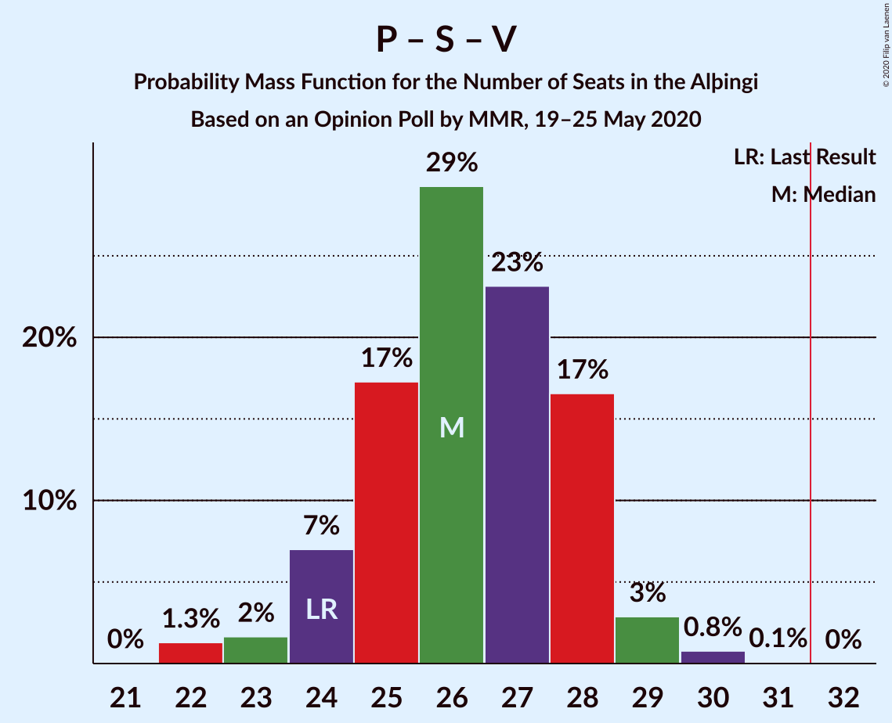
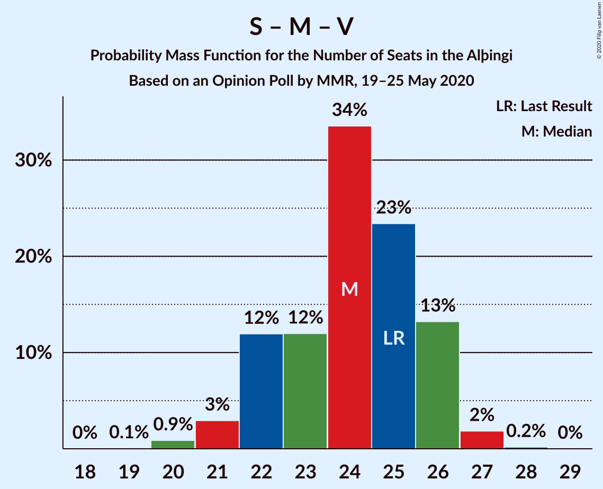

# Opinion Poll by MMR, 19–25 May 2020

<a href="#voting-intentions">Voting Intentions</a> | <a href="#seats">Seats</a> | <a href="#coalitions">Coalitions</a> | <a href="#technical-information">Technical Information</a>

## Voting Intentions

### Confidence Intervals

| Party | Last Result | Poll Result | 80% Confidence Interval | 90% Confidence Interval | 95% Confidence Interval | 99% Confidence Interval |
|:-----:|:-----------:|:-----------:|:-----------------------:|:-----------------------:|:-----------------------:|:-----------------------:|
| Sjálfstæðisflokkurinn | 25.2% | 23.5% | 21.9–25.3% |21.4–25.8% |21.0–26.3% |20.2–27.1% |
| Píratar | 9.2% | 14.6% | 13.2–16.1% |12.8–16.5% |12.5–16.9% |11.9–17.7% |
| Samfylkingin | 12.1% | 13.3% | 12.0–14.8% |11.6–15.2% |11.3–15.5% |10.7–16.3% |
| Viðreisn | 6.7% | 11.3% | 10.1–12.7% |9.7–13.0% |9.4–13.4% |8.9–14.1% |
| Miðflokkurinn | 10.9% | 10.8% | 9.6–12.1% |9.3–12.5% |9.0–12.8% |8.5–13.5% |
| Vinstrihreyfingin – grænt framboð | 16.9% | 10.6% | 9.4–11.9% |9.1–12.3% |8.8–12.6% |8.3–13.3% |
| Framsóknarflokkurinn | 10.7% | 6.4% | 5.5–7.5% |5.3–7.9% |5.1–8.1% |4.7–8.7% |
| Sósíalistaflokkur Íslands | 0.0% | 4.1% | 3.4–5.1% |3.2–5.3% |3.0–5.5% |2.7–6.0% |
| Flokkur fólksins | 6.9% | 3.6% | 3.0–4.5% |2.8–4.8% |2.6–5.0% |2.3–5.4% |

*Note:* The poll result column reflects the actual value used in the calculations. Published results may vary slightly, and in addition be rounded to fewer digits.

## Seats

### Confidence Intervals

| Party | Last Result | Median | 80% Confidence Interval | 90% Confidence Interval | 95% Confidence Interval | 99% Confidence Interval |
|:-----:|:-----------:|:------:|:-----------------------:|:-----------------------:|:-----------------------:|:-----------------------:|
| <a href="#sjálfstæðisflokkurinn">Sjálfstæðisflokkurinn</a> | 16 | 17 | 15–18 |15–19 |15–19 |14–20 |
| <a href="#píratar">Píratar</a> | 6 | 10 | 9–11 |9–11 |8–12 |8–12 |
| <a href="#samfylkingin">Samfylkingin</a> | 7 | 9 | 8–10 |8–11 |7–11 |7–11 |
| <a href="#viðreisn">Viðreisn</a> | 4 | 8 | 7–9 |6–9 |6–9 |6–10 |
| <a href="#miðflokkurinn">Miðflokkurinn</a> | 7 | 8 | 6–9 |6–9 |6–10 |6–10 |
| <a href="#vinstrihreyfingin-–-grænt-framboð">Vinstrihreyfingin – grænt framboð</a> | 11 | 7 | 6–8 |6–9 |6–9 |5–10 |
| <a href="#framsóknarflokkurinn">Framsóknarflokkurinn</a> | 8 | 4 | 3–5 |3–5 |3–5 |2–6 |
| <a href="#sósíalistaflokkur-íslands">Sósíalistaflokkur Íslands</a> | 0 | 0 | 0–3 |0–3 |0–3 |0–4 |
| <a href="#flokkur-fólksins">Flokkur fólksins</a> | 4 | 0 | 0 |0 |0–1 |0–3 |

### Sjálfstæðisflokkurinn

*For a full overview of the results for this party, see the [Sjálfstæðisflokkurinn](party-sjálfstæðisflokkurinn.html) page.*

| Number of Seats | Probability | Accumulated | Special Marks |
|:---------------:|:-----------:|:-----------:|:-------------:|
| 13 | 0.1% | 100% |  |
| 14 | 0.5% | 99.9% |  |
| 15 | 16% | 99.5% |  |
| 16 | 34% | 84% | Last Result |
| 17 | 24% | 50% | Median |
| 18 | 18% | 26% |  |
| 19 | 7% | 8% |  |
| 20 | 2% | 2% |  |
| 21 | 0.2% | 0.2% |  |
| 22 | 0% | 0% |  |

### Píratar

*For a full overview of the results for this party, see the [Píratar](party-píratar.html) page.*

| Number of Seats | Probability | Accumulated | Special Marks |
|:---------------:|:-----------:|:-----------:|:-------------:|
| 6 | 0% | 100% | Last Result |
| 7 | 0.1% | 100% |  |
| 8 | 3% | 99.9% |  |
| 9 | 29% | 97% |  |
| 10 | 42% | 68% | Median |
| 11 | 22% | 26% |  |
| 12 | 4% | 4% |  |
| 13 | 0.3% | 0.3% |  |
| 14 | 0% | 0% |  |

### Samfylkingin

*For a full overview of the results for this party, see the [Samfylkingin](party-samfylkingin.html) page.*

| Number of Seats | Probability | Accumulated | Special Marks |
|:---------------:|:-----------:|:-----------:|:-------------:|
| 7 | 3% | 100% | Last Result |
| 8 | 18% | 97% |  |
| 9 | 46% | 78% | Median |
| 10 | 27% | 32% |  |
| 11 | 5% | 5% |  |
| 12 | 0.4% | 0.4% |  |
| 13 | 0% | 0% |  |

### Viðreisn

*For a full overview of the results for this party, see the [Viðreisn](party-viðreisn.html) page.*

| Number of Seats | Probability | Accumulated | Special Marks |
|:---------------:|:-----------:|:-----------:|:-------------:|
| 4 | 0% | 100% | Last Result |
| 5 | 0.1% | 100% |  |
| 6 | 6% | 99.9% |  |
| 7 | 32% | 94% |  |
| 8 | 46% | 62% | Median |
| 9 | 15% | 16% |  |
| 10 | 1.4% | 1.4% |  |
| 11 | 0% | 0% |  |

### Miðflokkurinn

*For a full overview of the results for this party, see the [Miðflokkurinn](party-miðflokkurinn.html) page.*

| Number of Seats | Probability | Accumulated | Special Marks |
|:---------------:|:-----------:|:-----------:|:-------------:|
| 5 | 0.4% | 100% |  |
| 6 | 14% | 99.6% |  |
| 7 | 25% | 86% | Last Result |
| 8 | 35% | 61% | Median |
| 9 | 21% | 25% |  |
| 10 | 4% | 4% |  |
| 11 | 0% | 0% |  |

### Vinstrihreyfingin – grænt framboð

*For a full overview of the results for this party, see the [Vinstrihreyfingin – grænt framboð](party-vinstrihreyfingin–græntframboð.html) page.*

| Number of Seats | Probability | Accumulated | Special Marks |
|:---------------:|:-----------:|:-----------:|:-------------:|
| 5 | 1.1% | 100% |  |
| 6 | 21% | 98.9% |  |
| 7 | 45% | 78% | Median |
| 8 | 26% | 33% |  |
| 9 | 5% | 7% |  |
| 10 | 2% | 2% |  |
| 11 | 0% | 0% | Last Result |

### Framsóknarflokkurinn

*For a full overview of the results for this party, see the [Framsóknarflokkurinn](party-framsóknarflokkurinn.html) page.*

| Number of Seats | Probability | Accumulated | Special Marks |
|:---------------:|:-----------:|:-----------:|:-------------:|
| 2 | 2% | 100% |  |
| 3 | 13% | 98% |  |
| 4 | 61% | 85% | Median |
| 5 | 23% | 25% |  |
| 6 | 2% | 2% |  |
| 7 | 0% | 0% |  |
| 8 | 0% | 0% | Last Result |

### Sósíalistaflokkur Íslands

*For a full overview of the results for this party, see the [Sósíalistaflokkur Íslands](party-sósíalistaflokkuríslands.html) page.*

| Number of Seats | Probability | Accumulated | Special Marks |
|:---------------:|:-----------:|:-----------:|:-------------:|
| 0 | 87% | 100% | Last Result, Median |
| 1 | 1.2% | 13% |  |
| 2 | 0% | 11% |  |
| 3 | 10% | 11% |  |
| 4 | 1.4% | 1.4% |  |
| 5 | 0% | 0% |  |

### Flokkur fólksins

*For a full overview of the results for this party, see the [Flokkur fólksins](party-flokkurfólksins.html) page.*

| Number of Seats | Probability | Accumulated | Special Marks |
|:---------------:|:-----------:|:-----------:|:-------------:|
| 0 | 97% | 100% | Median |
| 1 | 0.4% | 3% |  |
| 2 | 0% | 2% |  |
| 3 | 2% | 2% |  |
| 4 | 0.2% | 0.2% | Last Result |
| 5 | 0% | 0% |  |

## Coalitions

### Confidence Intervals

| Coalition | Last Result | Median | Majority? | 80% Confidence Interval | 90% Confidence Interval | 95% Confidence Interval | 99% Confidence Interval |
|:---------:|:-----------:|:------:|:---------:|:-----------------------:|:-----------------------:|:-----------------------:|:-----------------------:|
| Píratar – Samfylkingin – Viðreisn – Vinstrihreyfingin – grænt framboð | 28 | 34 | 94% | 32–36 | 31–36 | 31–37 | 29–37 |
| Sjálfstæðisflokkurinn – Miðflokkurinn – Framsóknarflokkurinn | 31 | 29 | 3% | 27–30 | 26–31 | 26–32 | 25–32 |
| Samfylkingin – Miðflokkurinn – Vinstrihreyfingin – grænt framboð – Framsóknarflokkurinn | 33 | 28 | 0.5% | 26–30 | 26–30 | 25–31 | 24–32 |
| Sjálfstæðisflokkurinn – Vinstrihreyfingin – grænt framboð – Framsóknarflokkurinn | 35 | 28 | 0.6% | 26–30 | 26–30 | 25–31 | 25–32 |
| Píratar – Samfylkingin – Vinstrihreyfingin – grænt framboð | 24 | 26 | 0% | 25–28 | 24–28 | 23–29 | 22–30 |
| Sjálfstæðisflokkurinn – Samfylkingin | 23 | 26 | 0% | 24–28 | 24–28 | 23–29 | 23–29 |
| Sjálfstæðisflokkurinn – Miðflokkurinn | 23 | 24 | 0% | 23–26 | 22–27 | 22–27 | 21–28 |
| Sjálfstæðisflokkurinn – Viðreisn | 20 | 24 | 0% | 23–26 | 22–27 | 22–27 | 21–28 |
| Sjálfstæðisflokkurinn – Vinstrihreyfingin – grænt framboð | 27 | 24 | 0% | 22–26 | 22–26 | 22–26 | 21–27 |
| Samfylkingin – Miðflokkurinn – Vinstrihreyfingin – grænt framboð | 25 | 24 | 0% | 22–26 | 22–26 | 21–26 | 20–27 |
| Sjálfstæðisflokkurinn – Framsóknarflokkurinn | 24 | 21 | 0% | 19–23 | 19–23 | 19–23 | 18–24 |
| Samfylkingin – Vinstrihreyfingin – grænt framboð – Framsóknarflokkurinn | 26 | 20 | 0% | 19–22 | 18–23 | 18–23 | 17–24 |
| Miðflokkurinn – Vinstrihreyfingin – grænt framboð – Framsóknarflokkurinn | 26 | 19 | 0% | 17–21 | 17–21 | 16–22 | 16–22 |
| Píratar – Vinstrihreyfingin – grænt framboð | 17 | 17 | 0% | 16–19 | 15–19 | 15–19 | 14–20 |
| Samfylkingin – Vinstrihreyfingin – grænt framboð | 18 | 16 | 0% | 15–18 | 14–18 | 14–19 | 13–19 |
| Miðflokkurinn – Vinstrihreyfingin – grænt framboð | 18 | 15 | 0% | 13–16 | 13–17 | 12–17 | 12–18 |
| Vinstrihreyfingin – grænt framboð – Framsóknarflokkurinn | 19 | 11 | 0% | 10–13 | 10–13 | 9–14 | 9–15 |

### Píratar – Samfylkingin – Viðreisn – Vinstrihreyfingin – grænt framboð

| Number of Seats | Probability | Accumulated | Special Marks |
|:---------------:|:-----------:|:-----------:|:-------------:|
| 28 | 0% | 100% | Last Result |
| 29 | 1.4% | 99.9% |  |
| 30 | 1.0% | 98.6% |  |
| 31 | 4% | 98% |  |
| 32 | 8% | 94% | Majority |
| 33 | 20% | 86% |  |
| 34 | 26% | 66% | Median |
| 35 | 26% | 40% |  |
| 36 | 10% | 14% |  |
| 37 | 3% | 4% |  |
| 38 | 0.3% | 0.3% |  |
| 39 | 0% | 0% |  |

### Sjálfstæðisflokkurinn – Miðflokkurinn – Framsóknarflokkurinn

| Number of Seats | Probability | Accumulated | Special Marks |
|:---------------:|:-----------:|:-----------:|:-------------:|
| 24 | 0.1% | 100% |  |
| 25 | 1.1% | 99.9% |  |
| 26 | 6% | 98.8% |  |
| 27 | 16% | 93% |  |
| 28 | 27% | 77% |  |
| 29 | 26% | 50% | Median |
| 30 | 15% | 24% |  |
| 31 | 7% | 10% | Last Result |
| 32 | 2% | 3% | Majority |
| 33 | 0.1% | 0.1% |  |
| 34 | 0% | 0% |  |

### Samfylkingin – Miðflokkurinn – Vinstrihreyfingin – grænt framboð – Framsóknarflokkurinn

| Number of Seats | Probability | Accumulated | Special Marks |
|:---------------:|:-----------:|:-----------:|:-------------:|
| 23 | 0.1% | 100% |  |
| 24 | 0.6% | 99.9% |  |
| 25 | 3% | 99.3% |  |
| 26 | 9% | 96% |  |
| 27 | 18% | 87% |  |
| 28 | 27% | 69% | Median |
| 29 | 24% | 42% |  |
| 30 | 14% | 19% |  |
| 31 | 4% | 5% |  |
| 32 | 0.5% | 0.5% | Majority |
| 33 | 0% | 0% | Last Result |

### Sjálfstæðisflokkurinn – Vinstrihreyfingin – grænt framboð – Framsóknarflokkurinn

| Number of Seats | Probability | Accumulated | Special Marks |
|:---------------:|:-----------:|:-----------:|:-------------:|
| 24 | 0.4% | 100% |  |
| 25 | 2% | 99.6% |  |
| 26 | 12% | 97% |  |
| 27 | 22% | 85% |  |
| 28 | 29% | 63% | Median |
| 29 | 19% | 34% |  |
| 30 | 11% | 15% |  |
| 31 | 3% | 4% |  |
| 32 | 0.5% | 0.6% | Majority |
| 33 | 0.1% | 0.1% |  |
| 34 | 0% | 0% |  |
| 35 | 0% | 0% | Last Result |

### Píratar – Samfylkingin – Vinstrihreyfingin – grænt framboð

| Number of Seats | Probability | Accumulated | Special Marks |
|:---------------:|:-----------:|:-----------:|:-------------:|
| 22 | 1.3% | 100% |  |
| 23 | 2% | 98.7% |  |
| 24 | 7% | 97% | Last Result |
| 25 | 17% | 90% |  |
| 26 | 29% | 73% | Median |
| 27 | 23% | 43% |  |
| 28 | 17% | 20% |  |
| 29 | 3% | 4% |  |
| 30 | 0.8% | 0.9% |  |
| 31 | 0.1% | 0.1% |  |
| 32 | 0% | 0% | Majority |

### Sjálfstæðisflokkurinn – Samfylkingin

| Number of Seats | Probability | Accumulated | Special Marks |
|:---------------:|:-----------:|:-----------:|:-------------:|
| 22 | 0.4% | 100% |  |
| 23 | 3% | 99.6% | Last Result |
| 24 | 13% | 96% |  |
| 25 | 25% | 83% |  |
| 26 | 27% | 58% | Median |
| 27 | 20% | 31% |  |
| 28 | 8% | 11% |  |
| 29 | 3% | 3% |  |
| 30 | 0.4% | 0.5% |  |
| 31 | 0% | 0% |  |

### Sjálfstæðisflokkurinn – Miðflokkurinn

| Number of Seats | Probability | Accumulated | Special Marks |
|:---------------:|:-----------:|:-----------:|:-------------:|
| 21 | 1.2% | 100% |  |
| 22 | 7% | 98.7% |  |
| 23 | 16% | 92% | Last Result |
| 24 | 30% | 76% |  |
| 25 | 22% | 46% | Median |
| 26 | 15% | 24% |  |
| 27 | 7% | 9% |  |
| 28 | 1.5% | 2% |  |
| 29 | 0% | 0% |  |

### Sjálfstæðisflokkurinn – Viðreisn

| Number of Seats | Probability | Accumulated | Special Marks |
|:---------------:|:-----------:|:-----------:|:-------------:|
| 20 | 0% | 100% | Last Result |
| 21 | 0.8% | 99.9% |  |
| 22 | 6% | 99.1% |  |
| 23 | 19% | 93% |  |
| 24 | 29% | 75% |  |
| 25 | 25% | 46% | Median |
| 26 | 15% | 22% |  |
| 27 | 5% | 7% |  |
| 28 | 1.3% | 1.4% |  |
| 29 | 0.1% | 0.1% |  |
| 30 | 0% | 0% |  |

### Sjálfstæðisflokkurinn – Vinstrihreyfingin – grænt framboð

| Number of Seats | Probability | Accumulated | Special Marks |
|:---------------:|:-----------:|:-----------:|:-------------:|
| 20 | 0.2% | 100% |  |
| 21 | 2% | 99.8% |  |
| 22 | 15% | 98% |  |
| 23 | 25% | 83% |  |
| 24 | 24% | 58% | Median |
| 25 | 21% | 34% |  |
| 26 | 11% | 13% |  |
| 27 | 2% | 2% | Last Result |
| 28 | 0.3% | 0.4% |  |
| 29 | 0.1% | 0.1% |  |
| 30 | 0% | 0% |  |

### Samfylkingin – Miðflokkurinn – Vinstrihreyfingin – grænt framboð

| Number of Seats | Probability | Accumulated | Special Marks |
|:---------------:|:-----------:|:-----------:|:-------------:|
| 19 | 0.1% | 100% |  |
| 20 | 0.9% | 99.9% |  |
| 21 | 3% | 99.1% |  |
| 22 | 12% | 96% |  |
| 23 | 12% | 84% |  |
| 24 | 34% | 72% | Median |
| 25 | 23% | 39% | Last Result |
| 26 | 13% | 15% |  |
| 27 | 2% | 2% |  |
| 28 | 0.2% | 0.2% |  |
| 29 | 0% | 0% |  |

### Sjálfstæðisflokkurinn – Framsóknarflokkurinn

| Number of Seats | Probability | Accumulated | Special Marks |
|:---------------:|:-----------:|:-----------:|:-------------:|
| 17 | 0.2% | 100% |  |
| 18 | 1.5% | 99.7% |  |
| 19 | 12% | 98% |  |
| 20 | 33% | 86% |  |
| 21 | 24% | 53% | Median |
| 22 | 18% | 29% |  |
| 23 | 9% | 11% |  |
| 24 | 2% | 2% | Last Result |
| 25 | 0.4% | 0.4% |  |
| 26 | 0.1% | 0.1% |  |
| 27 | 0% | 0% |  |

### Samfylkingin – Vinstrihreyfingin – grænt framboð – Framsóknarflokkurinn

| Number of Seats | Probability | Accumulated | Special Marks |
|:---------------:|:-----------:|:-----------:|:-------------:|
| 16 | 0.1% | 100% |  |
| 17 | 2% | 99.8% |  |
| 18 | 4% | 98% |  |
| 19 | 18% | 94% |  |
| 20 | 29% | 76% | Median |
| 21 | 26% | 46% |  |
| 22 | 14% | 21% |  |
| 23 | 6% | 6% |  |
| 24 | 0.6% | 0.6% |  |
| 25 | 0.1% | 0.1% |  |
| 26 | 0% | 0% | Last Result |

### Miðflokkurinn – Vinstrihreyfingin – grænt framboð – Framsóknarflokkurinn

| Number of Seats | Probability | Accumulated | Special Marks |
|:---------------:|:-----------:|:-----------:|:-------------:|
| 15 | 0.2% | 100% |  |
| 16 | 3% | 99.8% |  |
| 17 | 10% | 97% |  |
| 18 | 21% | 86% |  |
| 19 | 26% | 65% | Median |
| 20 | 27% | 40% |  |
| 21 | 8% | 12% |  |
| 22 | 4% | 4% |  |
| 23 | 0.3% | 0.3% |  |
| 24 | 0% | 0% |  |
| 25 | 0% | 0% |  |
| 26 | 0% | 0% | Last Result |

### Píratar – Vinstrihreyfingin – grænt framboð

| Number of Seats | Probability | Accumulated | Special Marks |
|:---------------:|:-----------:|:-----------:|:-------------:|
| 13 | 0.1% | 100% |  |
| 14 | 0.7% | 99.9% |  |
| 15 | 7% | 99.2% |  |
| 16 | 21% | 93% |  |
| 17 | 36% | 71% | Last Result, Median |
| 18 | 22% | 35% |  |
| 19 | 11% | 14% |  |
| 20 | 2% | 2% |  |
| 21 | 0.4% | 0.4% |  |
| 22 | 0% | 0% |  |

### Samfylkingin – Vinstrihreyfingin – grænt framboð

| Number of Seats | Probability | Accumulated | Special Marks |
|:---------------:|:-----------:|:-----------:|:-------------:|
| 12 | 0.1% | 100% |  |
| 13 | 2% | 99.9% |  |
| 14 | 4% | 98% |  |
| 15 | 18% | 94% |  |
| 16 | 33% | 76% | Median |
| 17 | 25% | 43% |  |
| 18 | 15% | 17% | Last Result |
| 19 | 3% | 3% |  |
| 20 | 0.2% | 0.2% |  |
| 21 | 0% | 0% |  |

### Miðflokkurinn – Vinstrihreyfingin – grænt framboð

| Number of Seats | Probability | Accumulated | Special Marks |
|:---------------:|:-----------:|:-----------:|:-------------:|
| 11 | 0.1% | 100% |  |
| 12 | 3% | 99.9% |  |
| 13 | 11% | 97% |  |
| 14 | 18% | 85% |  |
| 15 | 31% | 67% | Median |
| 16 | 27% | 36% |  |
| 17 | 8% | 9% |  |
| 18 | 1.5% | 1.5% | Last Result |
| 19 | 0% | 0% |  |

### Vinstrihreyfingin – grænt framboð – Framsóknarflokkurinn

| Number of Seats | Probability | Accumulated | Special Marks |
|:---------------:|:-----------:|:-----------:|:-------------:|
| 8 | 0.3% | 100% |  |
| 9 | 2% | 99.7% |  |
| 10 | 23% | 97% |  |
| 11 | 33% | 74% | Median |
| 12 | 28% | 41% |  |
| 13 | 10% | 13% |  |
| 14 | 1.3% | 3% |  |
| 15 | 1.2% | 1.2% |  |
| 16 | 0% | 0% |  |
| 17 | 0% | 0% |  |
| 18 | 0% | 0% |  |
| 19 | 0% | 0% | Last Result |

## Technical Information

### Opinion Poll

+ **Polling firm:** MMR
+ **Commissioner(s):** —
+ **Fieldwork period:** 19–25 May 2020

### Calculations

+ **Sample size:** 994
+ **Simulations done:** 1,048,576
+ **Error estimate:** 3.03%

