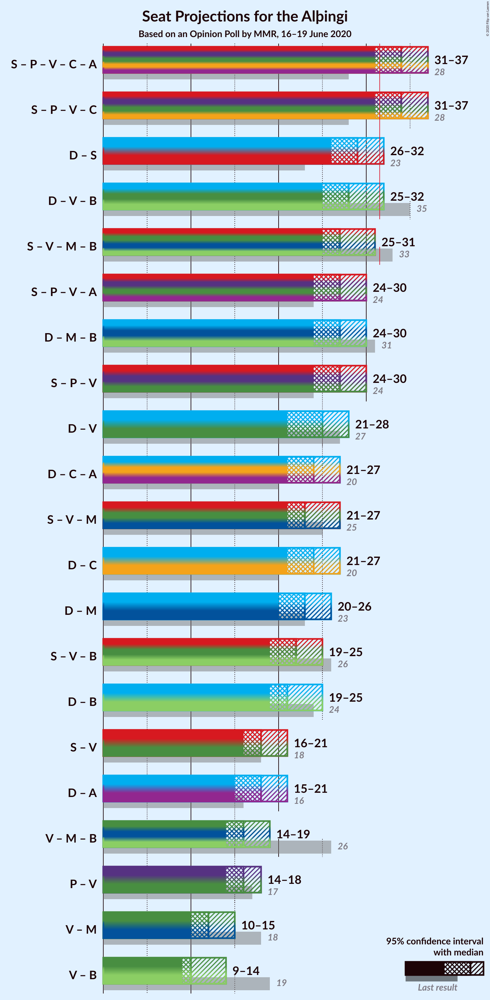
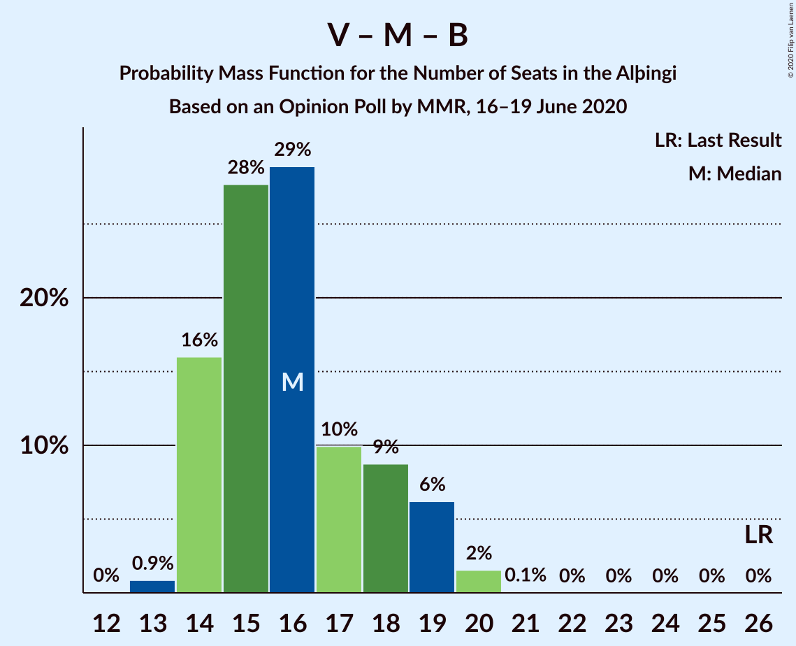

# Opinion Poll by MMR, 16–19 June 2020

<a href="#voting-intentions">Voting Intentions</a> | <a href="#seats">Seats</a> | <a href="#coalitions">Coalitions</a> | <a href="#technical-information">Technical Information</a>

## Voting Intentions

### Confidence Intervals

| Party | Last Result | Poll Result | 80% Confidence Interval | 90% Confidence Interval | 95% Confidence Interval | 99% Confidence Interval |
|:-----:|:-----------:|:-----------:|:-----------------------:|:-----------------------:|:-----------------------:|:-----------------------:|
| Sjálfstæðisflokkurinn | 25.2% | 24.3% | 22.7–26.1% |22.2–26.6% |21.8–27.0% |21.0–27.9% |
| Samfylkingin | 12.1% | 16.4% | 15.0–17.9% |14.6–18.4% |14.3–18.7% |13.6–19.5% |
| Píratar | 9.2% | 13.2% | 11.9–14.6% |11.6–15.0% |11.3–15.4% |10.7–16.1% |
| Vinstrihreyfingin – grænt framboð | 16.9% | 10.7% | 9.6–12.0% |9.3–12.4% |9.0–12.7% |8.5–13.4% |
| Viðreisn | 6.7% | 10.0% | 8.9–11.3% |8.6–11.7% |8.4–12.0% |7.9–12.7% |
| Miðflokkurinn | 10.9% | 8.0% | 7.1–9.2% |6.8–9.6% |6.5–9.8% |6.1–10.4% |
| Framsóknarflokkurinn | 10.7% | 6.1% | 5.3–7.2% |5.0–7.5% |4.8–7.7% |4.5–8.3% |
| Flokkur fólksins | 6.9% | 5.4% | 4.6–6.4% |4.3–6.6% |4.1–6.9% |3.8–7.4% |
| Sósíalistaflokkur Íslands | 0.0% | 3.5% | 2.9–4.4% |2.7–4.6% |2.6–4.8% |2.3–5.3% |

*Note:* The poll result column reflects the actual value used in the calculations. Published results may vary slightly, and in addition be rounded to fewer digits.

## Seats

### Confidence Intervals

| Party | Last Result | Median | 80% Confidence Interval | 90% Confidence Interval | 95% Confidence Interval | 99% Confidence Interval |
|:-----:|:-----------:|:------:|:-----------------------:|:-----------------------:|:-----------------------:|:-----------------------:|
| <a href="#sjálfstæðisflokkurinn">Sjálfstæðisflokkurinn</a> | 16 | 18 | 16–19 |15–20 |15–21 |15–21 |
| <a href="#samfylkingin">Samfylkingin</a> | 7 | 11 | 10–13 |10–13 |10–13 |9–14 |
| <a href="#píratar">Píratar</a> | 6 | 9 | 8–10 |8–10 |7–11 |7–11 |
| <a href="#vinstrihreyfingin-–-grænt-framboð">Vinstrihreyfingin – grænt framboð</a> | 11 | 7 | 6–8 |6–9 |6–10 |5–10 |
| <a href="#viðreisn">Viðreisn</a> | 4 | 7 | 6–7 |6–8 |5–8 |5–9 |
| <a href="#miðflokkurinn">Miðflokkurinn</a> | 7 | 5 | 4–6 |4–6 |4–7 |4–7 |
| <a href="#framsóknarflokkurinn">Framsóknarflokkurinn</a> | 8 | 4 | 3–5 |2–5 |2–5 |2–6 |
| <a href="#flokkur-fólksins">Flokkur fólksins</a> | 4 | 3 | 0–4 |0–4 |0–4 |0–5 |
| <a href="#sósíalistaflokkur-íslands">Sósíalistaflokkur Íslands</a> | 0 | 0 | 0 |0 |0 |0–3 |

### Sjálfstæðisflokkurinn

*For a full overview of the results for this party, see the [Sjálfstæðisflokkurinn](party-sjálfstæðisflokkurinn.html) page.*

| Number of Seats | Probability | Accumulated | Special Marks |
|:---------------:|:-----------:|:-----------:|:-------------:|
| 14 | 0.2% | 100% |  |
| 15 | 8% | 99.8% |  |
| 16 | 20% | 92% | Last Result |
| 17 | 20% | 72% |  |
| 18 | 24% | 51% | Median |
| 19 | 19% | 27% |  |
| 20 | 6% | 9% |  |
| 21 | 3% | 3% |  |
| 22 | 0% | 0% |  |

### Samfylkingin

*For a full overview of the results for this party, see the [Samfylkingin](party-samfylkingin.html) page.*

| Number of Seats | Probability | Accumulated | Special Marks |
|:---------------:|:-----------:|:-----------:|:-------------:|
| 7 | 0% | 100% | Last Result |
| 8 | 0.2% | 100% |  |
| 9 | 2% | 99.8% |  |
| 10 | 15% | 98% |  |
| 11 | 46% | 82% | Median |
| 12 | 26% | 36% |  |
| 13 | 10% | 11% |  |
| 14 | 0.7% | 0.8% |  |
| 15 | 0.1% | 0.1% |  |
| 16 | 0% | 0% |  |

### Píratar

*For a full overview of the results for this party, see the [Píratar](party-píratar.html) page.*

| Number of Seats | Probability | Accumulated | Special Marks |
|:---------------:|:-----------:|:-----------:|:-------------:|
| 6 | 0.1% | 100% | Last Result |
| 7 | 3% | 99.9% |  |
| 8 | 29% | 97% |  |
| 9 | 45% | 68% | Median |
| 10 | 18% | 23% |  |
| 11 | 4% | 4% |  |
| 12 | 0.1% | 0.2% |  |
| 13 | 0% | 0% |  |

### Vinstrihreyfingin – grænt framboð

*For a full overview of the results for this party, see the [Vinstrihreyfingin – grænt framboð](party-vinstrihreyfingin–græntframboð.html) page.*

| Number of Seats | Probability | Accumulated | Special Marks |
|:---------------:|:-----------:|:-----------:|:-------------:|
| 5 | 2% | 100% |  |
| 6 | 37% | 98% |  |
| 7 | 43% | 62% | Median |
| 8 | 10% | 19% |  |
| 9 | 6% | 9% |  |
| 10 | 3% | 3% |  |
| 11 | 0% | 0% | Last Result |

### Viðreisn

*For a full overview of the results for this party, see the [Viðreisn](party-viðreisn.html) page.*

| Number of Seats | Probability | Accumulated | Special Marks |
|:---------------:|:-----------:|:-----------:|:-------------:|
| 4 | 0% | 100% | Last Result |
| 5 | 4% | 100% |  |
| 6 | 45% | 96% |  |
| 7 | 41% | 51% | Median |
| 8 | 9% | 10% |  |
| 9 | 0.6% | 0.7% |  |
| 10 | 0% | 0% |  |

### Miðflokkurinn

*For a full overview of the results for this party, see the [Miðflokkurinn](party-miðflokkurinn.html) page.*

| Number of Seats | Probability | Accumulated | Special Marks |
|:---------------:|:-----------:|:-----------:|:-------------:|
| 3 | 0.1% | 100% |  |
| 4 | 16% | 99.9% |  |
| 5 | 47% | 84% | Median |
| 6 | 34% | 37% |  |
| 7 | 2% | 3% | Last Result |
| 8 | 0.3% | 0.3% |  |
| 9 | 0% | 0% |  |

### Framsóknarflokkurinn

*For a full overview of the results for this party, see the [Framsóknarflokkurinn](party-framsóknarflokkurinn.html) page.*

| Number of Seats | Probability | Accumulated | Special Marks |
|:---------------:|:-----------:|:-----------:|:-------------:|
| 1 | 0.1% | 100% |  |
| 2 | 6% | 99.9% |  |
| 3 | 24% | 94% |  |
| 4 | 59% | 70% | Median |
| 5 | 10% | 11% |  |
| 6 | 0.5% | 0.6% |  |
| 7 | 0% | 0% |  |
| 8 | 0% | 0% | Last Result |

### Flokkur fólksins

*For a full overview of the results for this party, see the [Flokkur fólksins](party-flokkurfólksins.html) page.*

| Number of Seats | Probability | Accumulated | Special Marks |
|:---------------:|:-----------:|:-----------:|:-------------:|
| 0 | 21% | 100% |  |
| 1 | 2% | 79% |  |
| 2 | 0% | 77% |  |
| 3 | 39% | 77% | Median |
| 4 | 36% | 38% | Last Result |
| 5 | 2% | 2% |  |
| 6 | 0% | 0% |  |

### Sósíalistaflokkur Íslands

*For a full overview of the results for this party, see the [Sósíalistaflokkur Íslands](party-sósíalistaflokkuríslands.html) page.*

| Number of Seats | Probability | Accumulated | Special Marks |
|:---------------:|:-----------:|:-----------:|:-------------:|
| 0 | 98% | 100% | Last Result, Median |
| 1 | 0.4% | 2% |  |
| 2 | 0% | 1.2% |  |
| 3 | 1.1% | 1.2% |  |
| 4 | 0% | 0% |  |

## Coalitions

### Confidence Intervals

| Coalition | Last Result | Median | Majority? | 80% Confidence Interval | 90% Confidence Interval | 95% Confidence Interval | 99% Confidence Interval |
|:---------:|:-----------:|:------:|:---------:|:-----------------------:|:-----------------------:|:-----------------------:|:-----------------------:|
| Samfylkingin – Píratar – Vinstrihreyfingin – grænt framboð – Viðreisn | 28 | 34 | 87% | 31–36 | 31–37 | 31–37 | 30–38 |
| Sjálfstæðisflokkurinn – Samfylkingin | 23 | 29 | 3% | 27–31 | 26–31 | 26–32 | 25–32 |
| Sjálfstæðisflokkurinn – Vinstrihreyfingin – grænt framboð – Framsóknarflokkurinn | 35 | 28 | 3% | 26–30 | 26–31 | 25–32 | 25–32 |
| Samfylkingin – Vinstrihreyfingin – grænt framboð – Miðflokkurinn – Framsóknarflokkurinn | 33 | 27 | 1.4% | 25–30 | 25–30 | 25–31 | 24–32 |
| Sjálfstæðisflokkurinn – Miðflokkurinn – Framsóknarflokkurinn | 31 | 27 | 0% | 24–29 | 24–29 | 24–30 | 23–30 |
| Samfylkingin – Píratar – Vinstrihreyfingin – grænt framboð | 24 | 27 | 0.3% | 25–29 | 25–30 | 24–30 | 24–31 |
| Sjálfstæðisflokkurinn – Vinstrihreyfingin – grænt framboð | 27 | 25 | 0% | 23–26 | 22–27 | 21–28 | 21–28 |
| Samfylkingin – Vinstrihreyfingin – grænt framboð – Miðflokkurinn | 25 | 23 | 0% | 22–26 | 21–26 | 21–27 | 20–27 |
| Sjálfstæðisflokkurinn – Viðreisn | 20 | 24 | 0% | 22–26 | 22–27 | 21–27 | 21–28 |
| Sjálfstæðisflokkurinn – Miðflokkurinn | 23 | 23 | 0% | 21–25 | 20–25 | 20–26 | 19–26 |
| Samfylkingin – Vinstrihreyfingin – grænt framboð – Framsóknarflokkurinn | 26 | 22 | 0% | 20–24 | 20–25 | 19–25 | 19–26 |
| Sjálfstæðisflokkurinn – Framsóknarflokkurinn | 24 | 21 | 0% | 19–23 | 19–24 | 19–25 | 18–25 |
| Samfylkingin – Vinstrihreyfingin – grænt framboð | 18 | 18 | 0% | 17–20 | 16–21 | 16–21 | 15–22 |
| Vinstrihreyfingin – grænt framboð – Miðflokkurinn – Framsóknarflokkurinn | 26 | 16 | 0% | 14–18 | 14–19 | 14–19 | 13–20 |
| Píratar – Vinstrihreyfingin – grænt framboð | 17 | 16 | 0% | 14–18 | 14–18 | 14–18 | 13–20 |
| Vinstrihreyfingin – grænt framboð – Miðflokkurinn | 18 | 12 | 0% | 11–14 | 10–15 | 10–15 | 10–16 |
| Vinstrihreyfingin – grænt framboð – Framsóknarflokkurinn | 19 | 10 | 0% | 9–13 | 9–13 | 9–14 | 8–14 |

### Samfylkingin – Píratar – Vinstrihreyfingin – grænt framboð – Viðreisn

| Number of Seats | Probability | Accumulated | Special Marks |
|:---------------:|:-----------:|:-----------:|:-------------:|
| 28 | 0% | 100% | Last Result |
| 29 | 0.1% | 100% |  |
| 30 | 0.8% | 99.8% |  |
| 31 | 12% | 99.0% |  |
| 32 | 15% | 87% | Majority |
| 33 | 16% | 72% |  |
| 34 | 23% | 56% | Median |
| 35 | 18% | 33% |  |
| 36 | 9% | 15% |  |
| 37 | 4% | 6% |  |
| 38 | 1.0% | 1.3% |  |
| 39 | 0.3% | 0.3% |  |
| 40 | 0% | 0% |  |

### Sjálfstæðisflokkurinn – Samfylkingin

| Number of Seats | Probability | Accumulated | Special Marks |
|:---------------:|:-----------:|:-----------:|:-------------:|
| 23 | 0% | 100% | Last Result |
| 24 | 0.1% | 100% |  |
| 25 | 1.2% | 99.9% |  |
| 26 | 5% | 98.7% |  |
| 27 | 15% | 94% |  |
| 28 | 18% | 78% |  |
| 29 | 25% | 60% | Median |
| 30 | 22% | 35% |  |
| 31 | 10% | 13% |  |
| 32 | 3% | 3% | Majority |
| 33 | 0.1% | 0.2% |  |
| 34 | 0% | 0% |  |

### Sjálfstæðisflokkurinn – Vinstrihreyfingin – grænt framboð – Framsóknarflokkurinn

| Number of Seats | Probability | Accumulated | Special Marks |
|:---------------:|:-----------:|:-----------:|:-------------:|
| 24 | 0.3% | 100% |  |
| 25 | 4% | 99.7% |  |
| 26 | 10% | 96% |  |
| 27 | 19% | 86% |  |
| 28 | 24% | 66% |  |
| 29 | 23% | 43% | Median |
| 30 | 13% | 20% |  |
| 31 | 4% | 7% |  |
| 32 | 3% | 3% | Majority |
| 33 | 0.2% | 0.2% |  |
| 34 | 0% | 0% |  |
| 35 | 0% | 0% | Last Result |

### Samfylkingin – Vinstrihreyfingin – grænt framboð – Miðflokkurinn – Framsóknarflokkurinn

| Number of Seats | Probability | Accumulated | Special Marks |
|:---------------:|:-----------:|:-----------:|:-------------:|
| 23 | 0.3% | 100% |  |
| 24 | 2% | 99.7% |  |
| 25 | 12% | 98% |  |
| 26 | 20% | 86% |  |
| 27 | 33% | 65% | Median |
| 28 | 14% | 33% |  |
| 29 | 7% | 19% |  |
| 30 | 8% | 12% |  |
| 31 | 3% | 4% |  |
| 32 | 1.4% | 1.4% | Majority |
| 33 | 0% | 0% | Last Result |

### Sjálfstæðisflokkurinn – Miðflokkurinn – Framsóknarflokkurinn

| Number of Seats | Probability | Accumulated | Special Marks |
|:---------------:|:-----------:|:-----------:|:-------------:|
| 22 | 0.1% | 100% |  |
| 23 | 1.5% | 99.9% |  |
| 24 | 10% | 98% |  |
| 25 | 17% | 89% |  |
| 26 | 21% | 72% |  |
| 27 | 24% | 51% | Median |
| 28 | 15% | 27% |  |
| 29 | 9% | 12% |  |
| 30 | 3% | 3% |  |
| 31 | 0.3% | 0.3% | Last Result |
| 32 | 0% | 0% | Majority |

### Samfylkingin – Píratar – Vinstrihreyfingin – grænt framboð

| Number of Seats | Probability | Accumulated | Special Marks |
|:---------------:|:-----------:|:-----------:|:-------------:|
| 22 | 0.1% | 100% |  |
| 23 | 0.2% | 99.9% |  |
| 24 | 3% | 99.7% | Last Result |
| 25 | 15% | 97% |  |
| 26 | 14% | 82% |  |
| 27 | 26% | 68% | Median |
| 28 | 23% | 41% |  |
| 29 | 13% | 19% |  |
| 30 | 5% | 6% |  |
| 31 | 0.8% | 1.1% |  |
| 32 | 0.3% | 0.3% | Majority |
| 33 | 0% | 0% |  |

### Sjálfstæðisflokkurinn – Vinstrihreyfingin – grænt framboð

| Number of Seats | Probability | Accumulated | Special Marks |
|:---------------:|:-----------:|:-----------:|:-------------:|
| 21 | 3% | 100% |  |
| 22 | 5% | 97% |  |
| 23 | 19% | 92% |  |
| 24 | 22% | 72% |  |
| 25 | 27% | 50% | Median |
| 26 | 14% | 23% |  |
| 27 | 6% | 9% | Last Result |
| 28 | 3% | 3% |  |
| 29 | 0.2% | 0.2% |  |
| 30 | 0% | 0% |  |

### Samfylkingin – Vinstrihreyfingin – grænt framboð – Miðflokkurinn

| Number of Seats | Probability | Accumulated | Special Marks |
|:---------------:|:-----------:|:-----------:|:-------------:|
| 19 | 0.1% | 100% |  |
| 20 | 2% | 99.9% |  |
| 21 | 4% | 98% |  |
| 22 | 21% | 95% |  |
| 23 | 31% | 73% | Median |
| 24 | 22% | 43% |  |
| 25 | 10% | 20% | Last Result |
| 26 | 7% | 10% |  |
| 27 | 3% | 4% |  |
| 28 | 0.4% | 0.4% |  |
| 29 | 0% | 0% |  |

### Sjálfstæðisflokkurinn – Viðreisn

| Number of Seats | Probability | Accumulated | Special Marks |
|:---------------:|:-----------:|:-----------:|:-------------:|
| 20 | 0.2% | 100% | Last Result |
| 21 | 3% | 99.8% |  |
| 22 | 13% | 97% |  |
| 23 | 18% | 84% |  |
| 24 | 27% | 66% |  |
| 25 | 23% | 39% | Median |
| 26 | 9% | 16% |  |
| 27 | 5% | 7% |  |
| 28 | 2% | 2% |  |
| 29 | 0.1% | 0.1% |  |
| 30 | 0% | 0% |  |

### Sjálfstæðisflokkurinn – Miðflokkurinn

| Number of Seats | Probability | Accumulated | Special Marks |
|:---------------:|:-----------:|:-----------:|:-------------:|
| 19 | 0.9% | 100% |  |
| 20 | 5% | 99.1% |  |
| 21 | 16% | 94% |  |
| 22 | 23% | 78% |  |
| 23 | 24% | 56% | Last Result, Median |
| 24 | 17% | 31% |  |
| 25 | 11% | 15% |  |
| 26 | 4% | 4% |  |
| 27 | 0.2% | 0.2% |  |
| 28 | 0% | 0% |  |

### Samfylkingin – Vinstrihreyfingin – grænt framboð – Framsóknarflokkurinn

| Number of Seats | Probability | Accumulated | Special Marks |
|:---------------:|:-----------:|:-----------:|:-------------:|
| 18 | 0.2% | 100% |  |
| 19 | 2% | 99.8% |  |
| 20 | 13% | 97% |  |
| 21 | 27% | 85% |  |
| 22 | 30% | 57% | Median |
| 23 | 12% | 28% |  |
| 24 | 7% | 16% |  |
| 25 | 6% | 9% |  |
| 26 | 2% | 2% | Last Result |
| 27 | 0.1% | 0.1% |  |
| 28 | 0% | 0% |  |

### Sjálfstæðisflokkurinn – Framsóknarflokkurinn

| Number of Seats | Probability | Accumulated | Special Marks |
|:---------------:|:-----------:|:-----------:|:-------------:|
| 17 | 0.1% | 100% |  |
| 18 | 2% | 99.9% |  |
| 19 | 13% | 98% |  |
| 20 | 18% | 86% |  |
| 21 | 22% | 67% |  |
| 22 | 23% | 45% | Median |
| 23 | 15% | 22% |  |
| 24 | 4% | 7% | Last Result |
| 25 | 3% | 3% |  |
| 26 | 0.1% | 0.1% |  |
| 27 | 0% | 0% |  |

### Samfylkingin – Vinstrihreyfingin – grænt framboð

| Number of Seats | Probability | Accumulated | Special Marks |
|:---------------:|:-----------:|:-----------:|:-------------:|
| 15 | 1.1% | 100% |  |
| 16 | 8% | 98.9% |  |
| 17 | 21% | 91% |  |
| 18 | 35% | 71% | Last Result, Median |
| 19 | 20% | 36% |  |
| 20 | 9% | 16% |  |
| 21 | 6% | 7% |  |
| 22 | 0.8% | 0.9% |  |
| 23 | 0.1% | 0.1% |  |
| 24 | 0% | 0% |  |

### Vinstrihreyfingin – grænt framboð – Miðflokkurinn – Framsóknarflokkurinn

| Number of Seats | Probability | Accumulated | Special Marks |
|:---------------:|:-----------:|:-----------:|:-------------:|
| 13 | 0.9% | 100% |  |
| 14 | 16% | 99.1% |  |
| 15 | 28% | 83% |  |
| 16 | 29% | 55% | Median |
| 17 | 10% | 27% |  |
| 18 | 9% | 17% |  |
| 19 | 6% | 8% |  |
| 20 | 2% | 2% |  |
| 21 | 0.1% | 0.1% |  |
| 22 | 0% | 0% |  |
| 23 | 0% | 0% |  |
| 24 | 0% | 0% |  |
| 25 | 0% | 0% |  |
| 26 | 0% | 0% | Last Result |

### Píratar – Vinstrihreyfingin – grænt framboð

| Number of Seats | Probability | Accumulated | Special Marks |
|:---------------:|:-----------:|:-----------:|:-------------:|
| 12 | 0.1% | 100% |  |
| 13 | 2% | 99.9% |  |
| 14 | 13% | 98% |  |
| 15 | 25% | 85% |  |
| 16 | 31% | 60% | Median |
| 17 | 19% | 29% | Last Result |
| 18 | 8% | 10% |  |
| 19 | 1.2% | 2% |  |
| 20 | 0.6% | 0.6% |  |
| 21 | 0% | 0% |  |

### Vinstrihreyfingin – grænt framboð – Miðflokkurinn

| Number of Seats | Probability | Accumulated | Special Marks |
|:---------------:|:-----------:|:-----------:|:-------------:|
| 9 | 0.2% | 100% |  |
| 10 | 6% | 99.8% |  |
| 11 | 27% | 94% |  |
| 12 | 34% | 67% | Median |
| 13 | 19% | 33% |  |
| 14 | 9% | 14% |  |
| 15 | 4% | 5% |  |
| 16 | 1.4% | 1.5% |  |
| 17 | 0.1% | 0.1% |  |
| 18 | 0% | 0% | Last Result |

### Vinstrihreyfingin – grænt framboð – Framsóknarflokkurinn

| Number of Seats | Probability | Accumulated | Special Marks |
|:---------------:|:-----------:|:-----------:|:-------------:|
| 8 | 0.7% | 100% |  |
| 9 | 10% | 99.3% |  |
| 10 | 49% | 89% |  |
| 11 | 22% | 41% | Median |
| 12 | 4% | 19% |  |
| 13 | 11% | 15% |  |
| 14 | 4% | 4% |  |
| 15 | 0.1% | 0.1% |  |
| 16 | 0% | 0% |  |
| 17 | 0% | 0% |  |
| 18 | 0% | 0% |  |
| 19 | 0% | 0% | Last Result |

## Technical Information

### Opinion Poll

+ **Polling firm:** MMR
+ **Commissioner(s):** —
+ **Fieldwork period:** 16–19 June 2020

### Calculations

+ **Sample size:** 1045
+ **Simulations done:** 1,048,576
+ **Error estimate:** 1.51%

