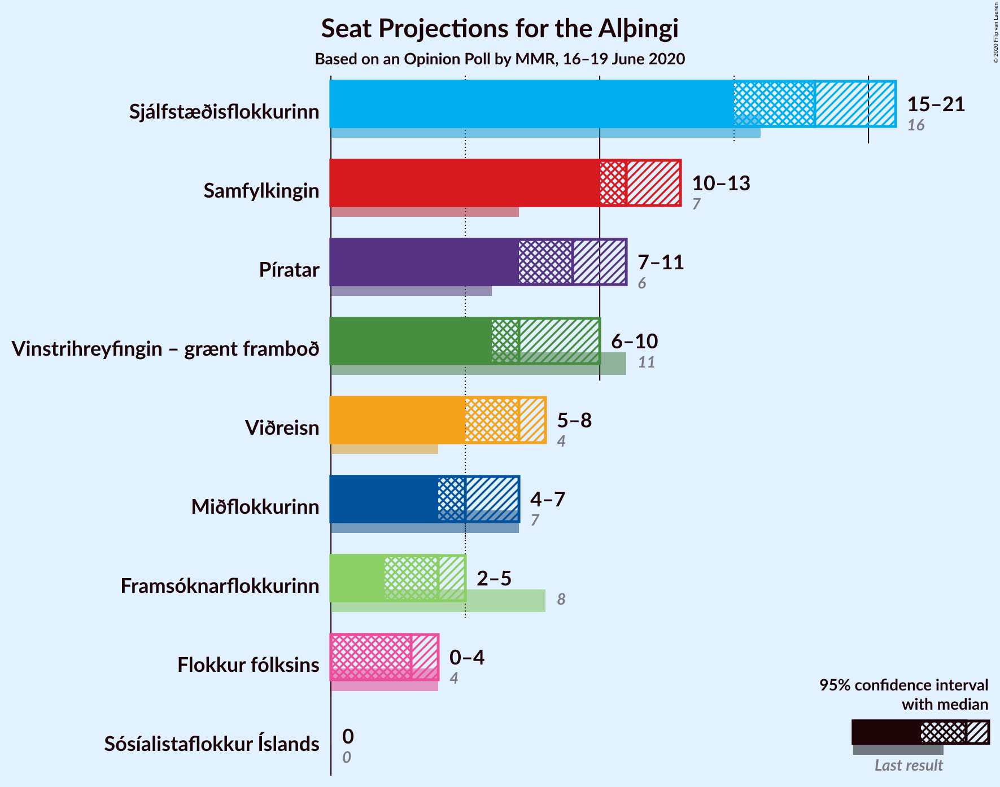
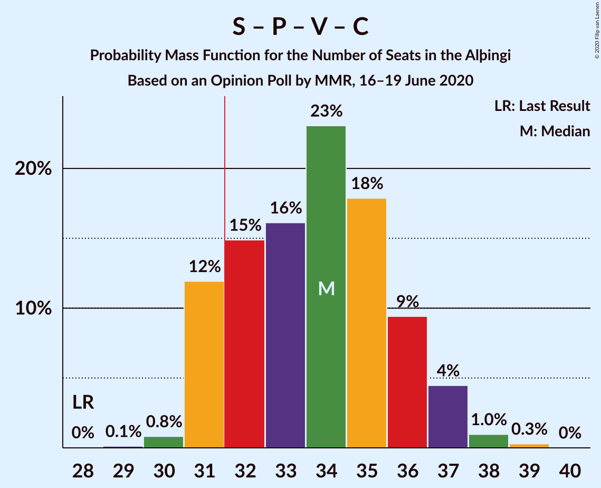
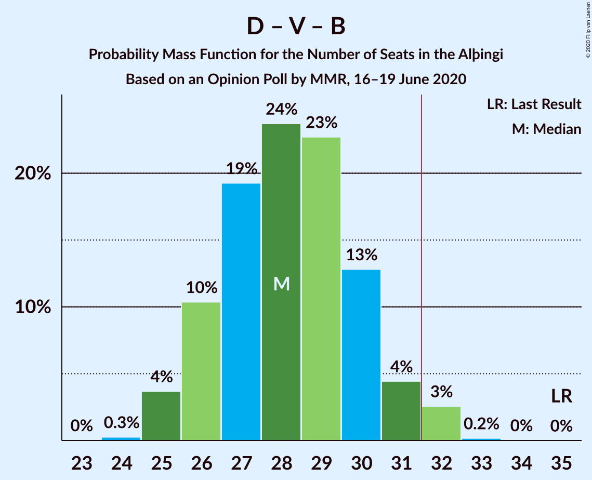
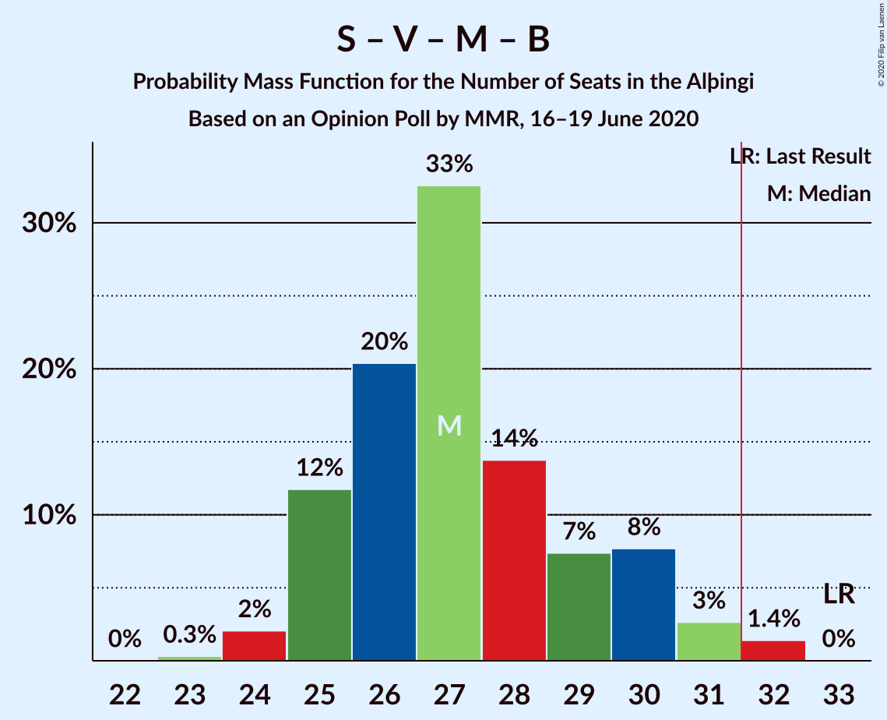
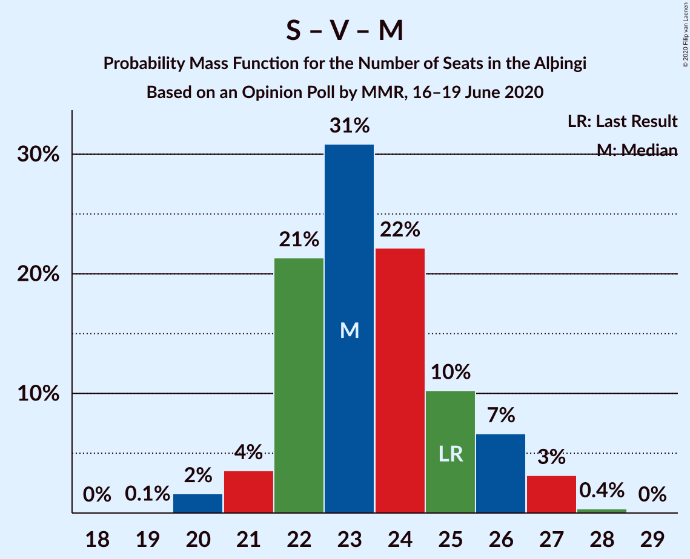

# Opinion Poll by MMR, 16–19 June 2020

<a href="#voting-intentions">Voting Intentions</a> | <a href="#seats">Seats</a> | <a href="#coalitions">Coalitions</a> | <a href="#technical-information">Technical Information</a>

## Voting Intentions

### Confidence Intervals

| Party | Last Result | Poll Result | 80% Confidence Interval | 90% Confidence Interval | 95% Confidence Interval | 99% Confidence Interval |
|:-----:|:-----------:|:-----------:|:-----------------------:|:-----------------------:|:-----------------------:|:-----------------------:|
| Sjálfstæðisflokkurinn | 25.2% | 24.3% | 22.7–26.1% |22.2–26.6% |21.8–27.0% |21.0–27.9% |
| Samfylkingin | 12.1% | 16.4% | 15.0–17.9% |14.6–18.4% |14.3–18.7% |13.6–19.5% |
| Píratar | 9.2% | 13.2% | 11.9–14.6% |11.6–15.0% |11.3–15.4% |10.7–16.1% |
| Vinstrihreyfingin – grænt framboð | 16.9% | 10.7% | 9.6–12.0% |9.3–12.4% |9.0–12.7% |8.5–13.4% |
| Viðreisn | 6.7% | 10.0% | 8.9–11.3% |8.6–11.7% |8.4–12.0% |7.9–12.7% |
| Miðflokkurinn | 10.9% | 8.0% | 7.1–9.2% |6.8–9.6% |6.5–9.8% |6.1–10.4% |
| Framsóknarflokkurinn | 10.7% | 6.1% | 5.3–7.2% |5.0–7.5% |4.8–7.7% |4.5–8.3% |
| Flokkur fólksins | 6.9% | 5.4% | 4.6–6.4% |4.3–6.6% |4.1–6.9% |3.8–7.4% |
| Sósíalistaflokkur Íslands | 0.0% | 3.5% | 2.9–4.4% |2.7–4.6% |2.6–4.8% |2.3–5.3% |

*Note:* The poll result column reflects the actual value used in the calculations. Published results may vary slightly, and in addition be rounded to fewer digits.

## Seats

### Confidence Intervals

| Party | Last Result | Median | 80% Confidence Interval | 90% Confidence Interval | 95% Confidence Interval | 99% Confidence Interval |
|:-----:|:-----------:|:------:|:-----------------------:|:-----------------------:|:-----------------------:|:-----------------------:|
| <a href="#sjálfstæðisflokkurinn">Sjálfstæðisflokkurinn</a> | 16 | 18 | 15–20 |15–21 |15–21 |15–21 |
| <a href="#samfylkingin">Samfylkingin</a> | 7 | 11 | 10–13 |10–13 |9–13 |9–14 |
| <a href="#píratar">Píratar</a> | 6 | 9 | 8–10 |8–10 |7–10 |7–11 |
| <a href="#vinstrihreyfingin-–-grænt-framboð">Vinstrihreyfingin – grænt framboð</a> | 11 | 7 | 6–8 |6–9 |6–10 |5–10 |
| <a href="#viðreisn">Viðreisn</a> | 4 | 6 | 5–8 |5–8 |5–8 |5–9 |
| <a href="#miðflokkurinn">Miðflokkurinn</a> | 7 | 5 | 4–6 |4–7 |4–7 |4–8 |
| <a href="#framsóknarflokkurinn">Framsóknarflokkurinn</a> | 8 | 4 | 3–5 |3–5 |3–5 |2–6 |
| <a href="#flokkur-fólksins">Flokkur fólksins</a> | 4 | 3 | 0–4 |0–4 |0–5 |0–5 |
| <a href="#sósíalistaflokkur-íslands">Sósíalistaflokkur Íslands</a> | 0 | 0 | 0 |0 |0 |0–3 |

### Sjálfstæðisflokkurinn

*For a full overview of the results for this party, see the [Sjálfstæðisflokkurinn](party-sjálfstæðisflokkurinn.html) page.*

| Number of Seats | Probability | Accumulated | Special Marks |
|:---------------:|:-----------:|:-----------:|:-------------:|
| 14 | 0.4% | 100% |  |
| 15 | 12% | 99.6% |  |
| 16 | 10% | 88% | Last Result |
| 17 | 21% | 77% |  |
| 18 | 15% | 56% | Median |
| 19 | 21% | 41% |  |
| 20 | 10% | 20% |  |
| 21 | 10% | 10% |  |
| 22 | 0% | 0% |  |

### Samfylkingin

*For a full overview of the results for this party, see the [Samfylkingin](party-samfylkingin.html) page.*

| Number of Seats | Probability | Accumulated | Special Marks |
|:---------------:|:-----------:|:-----------:|:-------------:|
| 7 | 0% | 100% | Last Result |
| 8 | 0.1% | 100% |  |
| 9 | 3% | 99.9% |  |
| 10 | 27% | 97% |  |
| 11 | 39% | 70% | Median |
| 12 | 16% | 31% |  |
| 13 | 14% | 15% |  |
| 14 | 0.8% | 1.1% |  |
| 15 | 0.4% | 0.4% |  |
| 16 | 0% | 0% |  |

### Píratar

*For a full overview of the results for this party, see the [Píratar](party-píratar.html) page.*

| Number of Seats | Probability | Accumulated | Special Marks |
|:---------------:|:-----------:|:-----------:|:-------------:|
| 6 | 0.1% | 100% | Last Result |
| 7 | 4% | 99.9% |  |
| 8 | 33% | 96% |  |
| 9 | 42% | 63% | Median |
| 10 | 20% | 21% |  |
| 11 | 2% | 2% |  |
| 12 | 0% | 0.1% |  |
| 13 | 0% | 0% |  |

### Vinstrihreyfingin – grænt framboð

*For a full overview of the results for this party, see the [Vinstrihreyfingin – grænt framboð](party-vinstrihreyfingin–græntframboð.html) page.*

| Number of Seats | Probability | Accumulated | Special Marks |
|:---------------:|:-----------:|:-----------:|:-------------:|
| 5 | 0.7% | 100% |  |
| 6 | 30% | 99.3% |  |
| 7 | 49% | 69% | Median |
| 8 | 10% | 20% |  |
| 9 | 6% | 10% |  |
| 10 | 4% | 4% |  |
| 11 | 0% | 0% | Last Result |

### Viðreisn

*For a full overview of the results for this party, see the [Viðreisn](party-viðreisn.html) page.*

| Number of Seats | Probability | Accumulated | Special Marks |
|:---------------:|:-----------:|:-----------:|:-------------:|
| 4 | 0% | 100% | Last Result |
| 5 | 11% | 100% |  |
| 6 | 42% | 89% | Median |
| 7 | 36% | 47% |  |
| 8 | 10% | 10% |  |
| 9 | 0.6% | 0.6% |  |
| 10 | 0% | 0% |  |

### Miðflokkurinn

*For a full overview of the results for this party, see the [Miðflokkurinn](party-miðflokkurinn.html) page.*

| Number of Seats | Probability | Accumulated | Special Marks |
|:---------------:|:-----------:|:-----------:|:-------------:|
| 3 | 0.3% | 100% |  |
| 4 | 25% | 99.7% |  |
| 5 | 41% | 74% | Median |
| 6 | 26% | 34% |  |
| 7 | 7% | 8% | Last Result |
| 8 | 0.5% | 0.6% |  |
| 9 | 0.1% | 0.1% |  |
| 10 | 0% | 0% |  |

### Framsóknarflokkurinn

*For a full overview of the results for this party, see the [Framsóknarflokkurinn](party-framsóknarflokkurinn.html) page.*

| Number of Seats | Probability | Accumulated | Special Marks |
|:---------------:|:-----------:|:-----------:|:-------------:|
| 2 | 2% | 100% |  |
| 3 | 25% | 98% |  |
| 4 | 62% | 73% | Median |
| 5 | 10% | 11% |  |
| 6 | 1.1% | 1.1% |  |
| 7 | 0% | 0% |  |
| 8 | 0% | 0% | Last Result |

### Flokkur fólksins

*For a full overview of the results for this party, see the [Flokkur fólksins](party-flokkurfólksins.html) page.*

| Number of Seats | Probability | Accumulated | Special Marks |
|:---------------:|:-----------:|:-----------:|:-------------:|
| 0 | 25% | 100% |  |
| 1 | 1.5% | 75% |  |
| 2 | 0% | 74% |  |
| 3 | 41% | 74% | Median |
| 4 | 28% | 33% | Last Result |
| 5 | 5% | 5% |  |
| 6 | 0% | 0% |  |

### Sósíalistaflokkur Íslands

*For a full overview of the results for this party, see the [Sósíalistaflokkur Íslands](party-sósíalistaflokkuríslands.html) page.*

| Number of Seats | Probability | Accumulated | Special Marks |
|:---------------:|:-----------:|:-----------:|:-------------:|
| 0 | 99.0% | 100% | Last Result, Median |
| 1 | 0.2% | 1.0% |  |
| 2 | 0% | 0.8% |  |
| 3 | 0.8% | 0.8% |  |
| 4 | 0% | 0% |  |

## Coalitions

### Confidence Intervals

| Coalition | Last Result | Median | Majority? | 80% Confidence Interval | 90% Confidence Interval | 95% Confidence Interval | 99% Confidence Interval |
|:---------:|:-----------:|:------:|:---------:|:-----------------------:|:-----------------------:|:-----------------------:|:-----------------------:|
| Samfylkingin – Píratar – Vinstrihreyfingin – grænt framboð – Viðreisn | 28 | 33 | 88% | 31–36 | 31–36 | 31–37 | 30–39 |
| Sjálfstæðisflokkurinn – Vinstrihreyfingin – grænt framboð – Framsóknarflokkurinn | 35 | 29 | 9% | 26–31 | 26–32 | 25–32 | 25–33 |
| Sjálfstæðisflokkurinn – Samfylkingin | 23 | 29 | 3% | 26–31 | 26–31 | 25–32 | 25–32 |
| Samfylkingin – Vinstrihreyfingin – grænt framboð – Miðflokkurinn – Framsóknarflokkurinn | 33 | 27 | 2% | 25–29 | 25–30 | 25–31 | 24–32 |
| Samfylkingin – Píratar – Vinstrihreyfingin – grænt framboð | 24 | 27 | 0.7% | 25–29 | 25–30 | 25–30 | 24–32 |
| Sjálfstæðisflokkurinn – Miðflokkurinn – Framsóknarflokkurinn | 31 | 27 | 0% | 24–30 | 24–30 | 23–30 | 23–30 |
| Sjálfstæðisflokkurinn – Vinstrihreyfingin – grænt framboð | 27 | 25 | 0% | 23–28 | 22–28 | 22–28 | 21–28 |
| Sjálfstæðisflokkurinn – Viðreisn | 20 | 24 | 0% | 22–27 | 22–28 | 21–28 | 21–28 |
| Samfylkingin – Vinstrihreyfingin – grænt framboð – Miðflokkurinn | 25 | 23 | 0% | 22–26 | 22–26 | 21–27 | 20–28 |
| Sjálfstæðisflokkurinn – Miðflokkurinn | 23 | 23 | 0% | 20–26 | 20–26 | 20–26 | 19–26 |
| Samfylkingin – Vinstrihreyfingin – grænt framboð – Framsóknarflokkurinn | 26 | 22 | 0% | 20–24 | 20–25 | 19–26 | 19–26 |
| Sjálfstæðisflokkurinn – Framsóknarflokkurinn | 24 | 22 | 0% | 19–24 | 19–25 | 18–25 | 18–25 |
| Samfylkingin – Vinstrihreyfingin – grænt framboð | 18 | 18 | 0% | 17–20 | 16–21 | 16–22 | 15–22 |
| Vinstrihreyfingin – grænt framboð – Miðflokkurinn – Framsóknarflokkurinn | 26 | 16 | 0% | 14–18 | 14–19 | 14–19 | 13–20 |
| Píratar – Vinstrihreyfingin – grænt framboð | 17 | 16 | 0% | 14–17 | 14–18 | 14–18 | 13–20 |
| Vinstrihreyfingin – grænt framboð – Miðflokkurinn | 18 | 12 | 0% | 11–14 | 10–15 | 10–15 | 10–16 |
| Vinstrihreyfingin – grænt framboð – Framsóknarflokkurinn | 19 | 11 | 0% | 10–13 | 9–13 | 9–14 | 9–15 |

### Samfylkingin – Píratar – Vinstrihreyfingin – grænt framboð – Viðreisn

| Number of Seats | Probability | Accumulated | Special Marks |
|:---------------:|:-----------:|:-----------:|:-------------:|
| 28 | 0% | 100% | Last Result |
| 29 | 0.2% | 100% |  |
| 30 | 0.6% | 99.8% |  |
| 31 | 11% | 99.2% |  |
| 32 | 19% | 88% | Majority |
| 33 | 31% | 70% | Median |
| 34 | 13% | 39% |  |
| 35 | 9% | 26% |  |
| 36 | 13% | 17% |  |
| 37 | 2% | 4% |  |
| 38 | 2% | 2% |  |
| 39 | 0.7% | 0.7% |  |
| 40 | 0% | 0% |  |

### Sjálfstæðisflokkurinn – Vinstrihreyfingin – grænt framboð – Framsóknarflokkurinn

| Number of Seats | Probability | Accumulated | Special Marks |
|:---------------:|:-----------:|:-----------:|:-------------:|
| 24 | 0.1% | 100% |  |
| 25 | 4% | 99.9% |  |
| 26 | 6% | 96% |  |
| 27 | 14% | 90% |  |
| 28 | 20% | 75% |  |
| 29 | 21% | 56% | Median |
| 30 | 21% | 35% |  |
| 31 | 5% | 14% |  |
| 32 | 9% | 9% | Majority |
| 33 | 0.7% | 0.7% |  |
| 34 | 0% | 0% |  |
| 35 | 0% | 0% | Last Result |

### Sjálfstæðisflokkurinn – Samfylkingin

| Number of Seats | Probability | Accumulated | Special Marks |
|:---------------:|:-----------:|:-----------:|:-------------:|
| 23 | 0% | 100% | Last Result |
| 24 | 0.3% | 100% |  |
| 25 | 4% | 99.7% |  |
| 26 | 6% | 96% |  |
| 27 | 10% | 90% |  |
| 28 | 15% | 80% |  |
| 29 | 18% | 64% | Median |
| 30 | 19% | 47% |  |
| 31 | 25% | 27% |  |
| 32 | 2% | 3% | Majority |
| 33 | 0.1% | 0.1% |  |
| 34 | 0% | 0% |  |

### Samfylkingin – Vinstrihreyfingin – grænt framboð – Miðflokkurinn – Framsóknarflokkurinn

| Number of Seats | Probability | Accumulated | Special Marks |
|:---------------:|:-----------:|:-----------:|:-------------:|
| 23 | 0.3% | 100% |  |
| 24 | 1.1% | 99.7% |  |
| 25 | 11% | 98.6% |  |
| 26 | 26% | 87% |  |
| 27 | 31% | 62% | Median |
| 28 | 9% | 31% |  |
| 29 | 12% | 22% |  |
| 30 | 5% | 10% |  |
| 31 | 3% | 5% |  |
| 32 | 2% | 2% | Majority |
| 33 | 0.1% | 0.1% | Last Result |
| 34 | 0% | 0% |  |

### Samfylkingin – Píratar – Vinstrihreyfingin – grænt framboð

| Number of Seats | Probability | Accumulated | Special Marks |
|:---------------:|:-----------:|:-----------:|:-------------:|
| 23 | 0.4% | 100% |  |
| 24 | 1.1% | 99.5% | Last Result |
| 25 | 18% | 98% |  |
| 26 | 24% | 81% |  |
| 27 | 19% | 56% | Median |
| 28 | 19% | 37% |  |
| 29 | 11% | 18% |  |
| 30 | 4% | 6% |  |
| 31 | 2% | 2% |  |
| 32 | 0.7% | 0.7% | Majority |
| 33 | 0% | 0% |  |

### Sjálfstæðisflokkurinn – Miðflokkurinn – Framsóknarflokkurinn

| Number of Seats | Probability | Accumulated | Special Marks |
|:---------------:|:-----------:|:-----------:|:-------------:|
| 22 | 0.3% | 100% |  |
| 23 | 3% | 99.6% |  |
| 24 | 8% | 97% |  |
| 25 | 10% | 89% |  |
| 26 | 18% | 79% |  |
| 27 | 24% | 61% | Median |
| 28 | 17% | 36% |  |
| 29 | 9% | 19% |  |
| 30 | 10% | 10% |  |
| 31 | 0.3% | 0.3% | Last Result |
| 32 | 0% | 0% | Majority |

### Sjálfstæðisflokkurinn – Vinstrihreyfingin – grænt framboð

| Number of Seats | Probability | Accumulated | Special Marks |
|:---------------:|:-----------:|:-----------:|:-------------:|
| 20 | 0.1% | 100% |  |
| 21 | 2% | 99.9% |  |
| 22 | 8% | 98% |  |
| 23 | 9% | 90% |  |
| 24 | 26% | 82% |  |
| 25 | 13% | 56% | Median |
| 26 | 28% | 42% |  |
| 27 | 3% | 14% | Last Result |
| 28 | 10% | 11% |  |
| 29 | 0.4% | 0.4% |  |
| 30 | 0% | 0% |  |

### Sjálfstæðisflokkurinn – Viðreisn

| Number of Seats | Probability | Accumulated | Special Marks |
|:---------------:|:-----------:|:-----------:|:-------------:|
| 20 | 0.2% | 100% | Last Result |
| 21 | 4% | 99.8% |  |
| 22 | 14% | 96% |  |
| 23 | 19% | 82% |  |
| 24 | 14% | 62% | Median |
| 25 | 26% | 48% |  |
| 26 | 4% | 22% |  |
| 27 | 10% | 19% |  |
| 28 | 9% | 9% |  |
| 29 | 0.1% | 0.1% |  |
| 30 | 0% | 0% |  |

### Samfylkingin – Vinstrihreyfingin – grænt framboð – Miðflokkurinn

| Number of Seats | Probability | Accumulated | Special Marks |
|:---------------:|:-----------:|:-----------:|:-------------:|
| 19 | 0.1% | 100% |  |
| 20 | 1.0% | 99.9% |  |
| 21 | 3% | 98.9% |  |
| 22 | 33% | 96% |  |
| 23 | 30% | 64% | Median |
| 24 | 11% | 34% |  |
| 25 | 9% | 23% | Last Result |
| 26 | 10% | 14% |  |
| 27 | 2% | 3% |  |
| 28 | 1.5% | 1.5% |  |
| 29 | 0% | 0% |  |

### Sjálfstæðisflokkurinn – Miðflokkurinn

| Number of Seats | Probability | Accumulated | Special Marks |
|:---------------:|:-----------:|:-----------:|:-------------:|
| 19 | 0.7% | 100% |  |
| 20 | 9% | 99.3% |  |
| 21 | 10% | 90% |  |
| 22 | 22% | 80% |  |
| 23 | 18% | 58% | Last Result, Median |
| 24 | 11% | 41% |  |
| 25 | 19% | 29% |  |
| 26 | 10% | 11% |  |
| 27 | 0.2% | 0.2% |  |
| 28 | 0% | 0% |  |

### Samfylkingin – Vinstrihreyfingin – grænt framboð – Framsóknarflokkurinn

| Number of Seats | Probability | Accumulated | Special Marks |
|:---------------:|:-----------:|:-----------:|:-------------:|
| 18 | 0.3% | 100% |  |
| 19 | 3% | 99.7% |  |
| 20 | 9% | 97% |  |
| 21 | 29% | 88% |  |
| 22 | 27% | 58% | Median |
| 23 | 16% | 31% |  |
| 24 | 9% | 15% |  |
| 25 | 3% | 6% |  |
| 26 | 4% | 4% | Last Result |
| 27 | 0.2% | 0.2% |  |
| 28 | 0% | 0% |  |

### Sjálfstæðisflokkurinn – Framsóknarflokkurinn

| Number of Seats | Probability | Accumulated | Special Marks |
|:---------------:|:-----------:|:-----------:|:-------------:|
| 17 | 0.1% | 100% |  |
| 18 | 3% | 99.9% |  |
| 19 | 10% | 97% |  |
| 20 | 14% | 87% |  |
| 21 | 15% | 72% |  |
| 22 | 17% | 57% | Median |
| 23 | 26% | 40% |  |
| 24 | 4% | 13% | Last Result |
| 25 | 9% | 9% |  |
| 26 | 0% | 0% |  |

### Samfylkingin – Vinstrihreyfingin – grænt framboð

| Number of Seats | Probability | Accumulated | Special Marks |
|:---------------:|:-----------:|:-----------:|:-------------:|
| 15 | 2% | 100% |  |
| 16 | 4% | 98% |  |
| 17 | 32% | 94% |  |
| 18 | 24% | 63% | Last Result, Median |
| 19 | 24% | 39% |  |
| 20 | 9% | 15% |  |
| 21 | 3% | 5% |  |
| 22 | 2% | 3% |  |
| 23 | 0.2% | 0.2% |  |
| 24 | 0% | 0% |  |

### Vinstrihreyfingin – grænt framboð – Miðflokkurinn – Framsóknarflokkurinn

| Number of Seats | Probability | Accumulated | Special Marks |
|:---------------:|:-----------:|:-----------:|:-------------:|
| 13 | 0.5% | 100% |  |
| 14 | 18% | 99.5% |  |
| 15 | 24% | 82% |  |
| 16 | 23% | 58% | Median |
| 17 | 21% | 35% |  |
| 18 | 6% | 15% |  |
| 19 | 6% | 9% |  |
| 20 | 2% | 2% |  |
| 21 | 0.3% | 0.3% |  |
| 22 | 0% | 0% |  |
| 23 | 0% | 0% |  |
| 24 | 0% | 0% |  |
| 25 | 0% | 0% |  |
| 26 | 0% | 0% | Last Result |

### Píratar – Vinstrihreyfingin – grænt framboð

| Number of Seats | Probability | Accumulated | Special Marks |
|:---------------:|:-----------:|:-----------:|:-------------:|
| 12 | 0.4% | 100% |  |
| 13 | 0.9% | 99.6% |  |
| 14 | 12% | 98.8% |  |
| 15 | 29% | 87% |  |
| 16 | 29% | 58% | Median |
| 17 | 20% | 29% | Last Result |
| 18 | 7% | 9% |  |
| 19 | 1.3% | 2% |  |
| 20 | 0.6% | 0.6% |  |
| 21 | 0% | 0% |  |

### Vinstrihreyfingin – grænt framboð – Miðflokkurinn

| Number of Seats | Probability | Accumulated | Special Marks |
|:---------------:|:-----------:|:-----------:|:-------------:|
| 9 | 0.2% | 100% |  |
| 10 | 9% | 99.8% |  |
| 11 | 27% | 91% |  |
| 12 | 26% | 64% | Median |
| 13 | 22% | 38% |  |
| 14 | 11% | 17% |  |
| 15 | 4% | 6% |  |
| 16 | 2% | 2% |  |
| 17 | 0.3% | 0.3% |  |
| 18 | 0% | 0% | Last Result |

### Vinstrihreyfingin – grænt framboð – Framsóknarflokkurinn

| Number of Seats | Probability | Accumulated | Special Marks |
|:---------------:|:-----------:|:-----------:|:-------------:|
| 8 | 0.2% | 100% |  |
| 9 | 9% | 99.8% |  |
| 10 | 36% | 90% |  |
| 11 | 35% | 54% | Median |
| 12 | 3% | 19% |  |
| 13 | 12% | 16% |  |
| 14 | 3% | 4% |  |
| 15 | 0.6% | 0.6% |  |
| 16 | 0% | 0% |  |
| 17 | 0% | 0% |  |
| 18 | 0% | 0% |  |
| 19 | 0% | 0% | Last Result |

## Technical Information

### Opinion Poll

+ **Polling firm:** MMR
+ **Commissioner(s):** —
+ **Fieldwork period:** 16–19 June 2020

### Calculations

+ **Sample size:** 1045
+ **Simulations done:** 131,072
+ **Error estimate:** 2.19%

