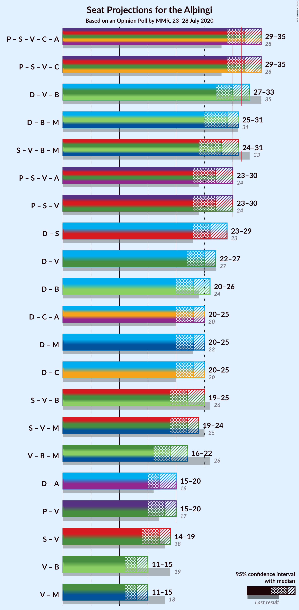
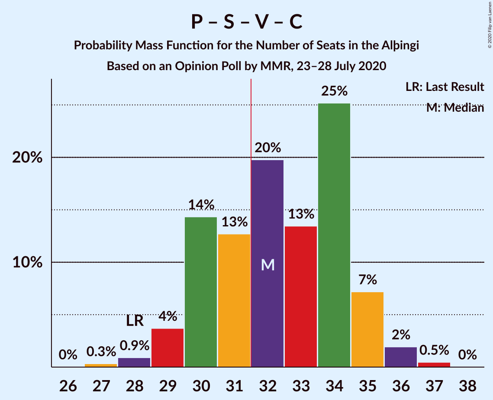
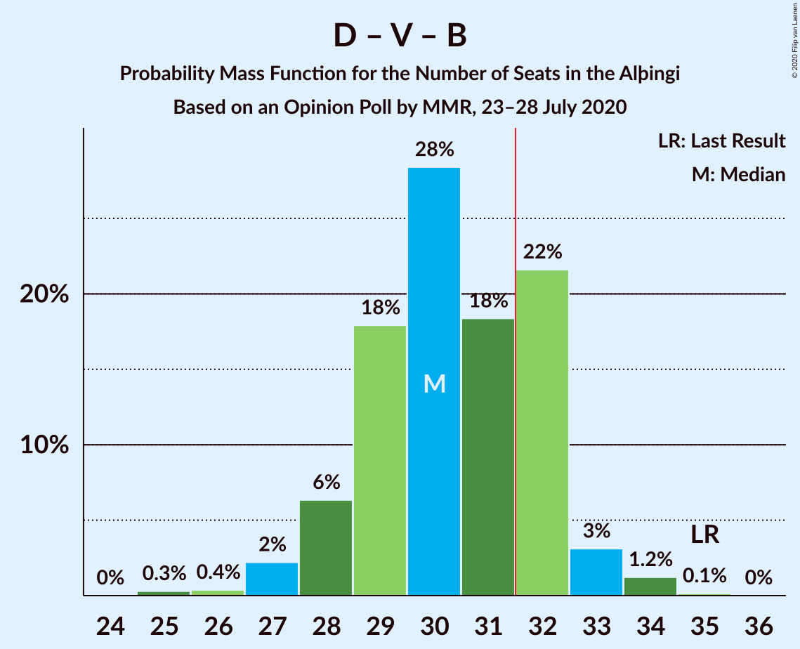
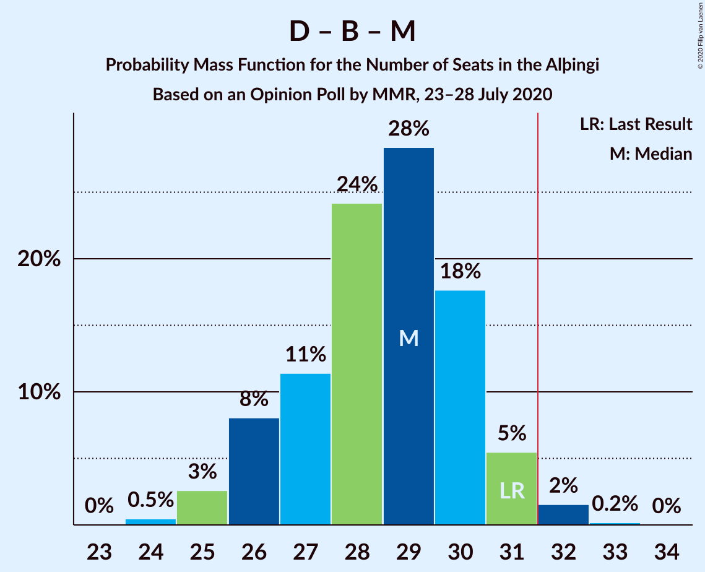
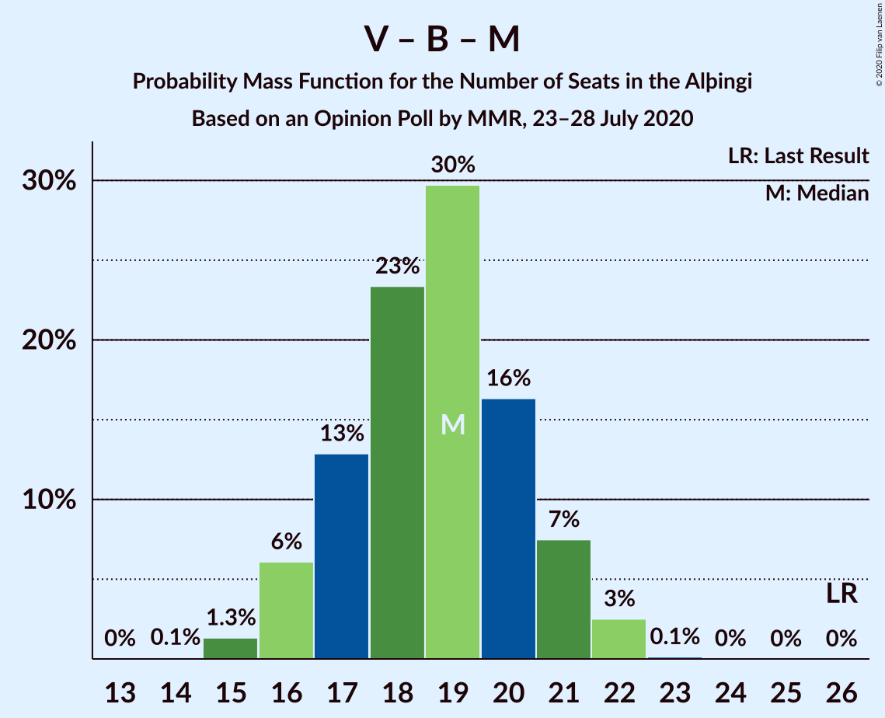

# Opinion Poll by MMR, 23–28 July 2020

<a href="#voting-intentions">Voting Intentions</a> | <a href="#seats">Seats</a> | <a href="#coalitions">Coalitions</a> | <a href="#technical-information">Technical Information</a>

## Voting Intentions

### Confidence Intervals

| Party | Last Result | Poll Result | 80% Confidence Interval | 90% Confidence Interval | 95% Confidence Interval | 99% Confidence Interval |
|:-----:|:-----------:|:-----------:|:-----------------------:|:-----------------------:|:-----------------------:|:-----------------------:|
| Sjálfstæðisflokkurinn | 25.2% | 24.0% | 22.3–25.8% |21.8–26.3% |21.4–26.8% |20.6–27.7% |
| Píratar | 9.2% | 15.5% | 14.0–17.1% |13.6–17.5% |13.3–17.9% |12.7–18.7% |
| Samfylkingin | 12.1% | 13.1% | 11.8–14.6% |11.5–15.1% |11.1–15.4% |10.5–16.2% |
| Vinstrihreyfingin – grænt framboð | 16.9% | 10.8% | 9.6–12.2% |9.3–12.6% |9.0–13.0% |8.5–13.7% |
| Framsóknarflokkurinn | 10.7% | 8.6% | 7.6–9.9% |7.3–10.3% |7.0–10.6% |6.5–11.2% |
| Miðflokkurinn | 10.9% | 8.4% | 7.4–9.7% |7.1–10.0% |6.8–10.3% |6.3–11.0% |
| Viðreisn | 6.7% | 8.4% | 7.4–9.7% |7.1–10.0% |6.8–10.3% |6.3–11.0% |
| Sósíalistaflokkur Íslands | 0.0% | 5.2% | 4.3–6.2% |4.1–6.5% |3.9–6.8% |3.6–7.3% |
| Flokkur fólksins | 6.9% | 4.0% | 3.3–4.9% |3.1–5.2% |2.9–5.4% |2.6–5.9% |

*Note:* The poll result column reflects the actual value used in the calculations. Published results may vary slightly, and in addition be rounded to fewer digits.

## Seats

### Confidence Intervals

| Party | Last Result | Median | 80% Confidence Interval | 90% Confidence Interval | 95% Confidence Interval | 99% Confidence Interval |
|:-----:|:-----------:|:------:|:-----------------------:|:-----------------------:|:-----------------------:|:-----------------------:|
| <a href="#sjálfstæðisflokkurinn">Sjálfstæðisflokkurinn</a> | 16 | 17 | 16–19 |15–19 |15–20 |14–21 |
| <a href="#píratar">Píratar</a> | 6 | 10 | 9–12 |9–12 |9–12 |8–13 |
| <a href="#samfylkingin">Samfylkingin</a> | 7 | 9 | 8–10 |7–10 |7–11 |7–11 |
| <a href="#vinstrihreyfingin-–-grænt-framboð">Vinstrihreyfingin – grænt framboð</a> | 11 | 7 | 6–8 |6–9 |6–9 |5–10 |
| <a href="#framsóknarflokkurinn">Framsóknarflokkurinn</a> | 8 | 6 | 5–7 |4–7 |4–8 |4–8 |
| <a href="#miðflokkurinn">Miðflokkurinn</a> | 7 | 5 | 5–7 |4–7 |4–7 |4–8 |
| <a href="#viðreisn">Viðreisn</a> | 4 | 6 | 5–6 |4–7 |4–7 |4–7 |
| <a href="#sósíalistaflokkur-íslands">Sósíalistaflokkur Íslands</a> | 0 | 3 | 0–4 |0–4 |0–4 |0–5 |
| <a href="#flokkur-fólksins">Flokkur fólksins</a> | 4 | 0 | 0 |0–3 |0–3 |0–4 |

### Sjálfstæðisflokkurinn

*For a full overview of the results for this party, see the [Sjálfstæðisflokkurinn](party-sjálfstæðisflokkurinn.html) page.*

| Number of Seats | Probability | Accumulated | Special Marks |
|:---------------:|:-----------:|:-----------:|:-------------:|
| 14 | 1.3% | 100% |  |
| 15 | 9% | 98.7% |  |
| 16 | 25% | 90% | Last Result |
| 17 | 16% | 65% | Median |
| 18 | 34% | 49% |  |
| 19 | 12% | 15% |  |
| 20 | 2% | 3% |  |
| 21 | 0.4% | 0.5% |  |
| 22 | 0.1% | 0.1% |  |
| 23 | 0% | 0% |  |

### Píratar

*For a full overview of the results for this party, see the [Píratar](party-píratar.html) page.*

| Number of Seats | Probability | Accumulated | Special Marks |
|:---------------:|:-----------:|:-----------:|:-------------:|
| 6 | 0% | 100% | Last Result |
| 7 | 0% | 100% |  |
| 8 | 0.8% | 100% |  |
| 9 | 13% | 99.2% |  |
| 10 | 38% | 86% | Median |
| 11 | 35% | 49% |  |
| 12 | 12% | 14% |  |
| 13 | 1.4% | 2% |  |
| 14 | 0.1% | 0.1% |  |
| 15 | 0% | 0% |  |

### Samfylkingin

*For a full overview of the results for this party, see the [Samfylkingin](party-samfylkingin.html) page.*

| Number of Seats | Probability | Accumulated | Special Marks |
|:---------------:|:-----------:|:-----------:|:-------------:|
| 6 | 0.3% | 100% |  |
| 7 | 6% | 99.7% | Last Result |
| 8 | 27% | 93% |  |
| 9 | 39% | 67% | Median |
| 10 | 25% | 27% |  |
| 11 | 2% | 3% |  |
| 12 | 0.5% | 0.5% |  |
| 13 | 0% | 0% |  |

### Vinstrihreyfingin – grænt framboð

*For a full overview of the results for this party, see the [Vinstrihreyfingin – grænt framboð](party-vinstrihreyfingin–græntframboð.html) page.*

| Number of Seats | Probability | Accumulated | Special Marks |
|:---------------:|:-----------:|:-----------:|:-------------:|
| 5 | 0.7% | 100% |  |
| 6 | 18% | 99.3% |  |
| 7 | 34% | 81% | Median |
| 8 | 38% | 47% |  |
| 9 | 8% | 9% |  |
| 10 | 0.9% | 0.9% |  |
| 11 | 0% | 0% | Last Result |

### Framsóknarflokkurinn

*For a full overview of the results for this party, see the [Framsóknarflokkurinn](party-framsóknarflokkurinn.html) page.*

| Number of Seats | Probability | Accumulated | Special Marks |
|:---------------:|:-----------:|:-----------:|:-------------:|
| 4 | 5% | 100% |  |
| 5 | 31% | 95% |  |
| 6 | 47% | 63% | Median |
| 7 | 13% | 17% |  |
| 8 | 4% | 4% | Last Result |
| 9 | 0% | 0% |  |

### Miðflokkurinn

*For a full overview of the results for this party, see the [Miðflokkurinn](party-miðflokkurinn.html) page.*

| Number of Seats | Probability | Accumulated | Special Marks |
|:---------------:|:-----------:|:-----------:|:-------------:|
| 3 | 0.1% | 100% |  |
| 4 | 6% | 99.9% |  |
| 5 | 48% | 93% | Median |
| 6 | 35% | 45% |  |
| 7 | 9% | 11% | Last Result |
| 8 | 1.1% | 1.3% |  |
| 9 | 0.1% | 0.2% |  |
| 10 | 0% | 0% |  |

### Viðreisn

*For a full overview of the results for this party, see the [Viðreisn](party-viðreisn.html) page.*

| Number of Seats | Probability | Accumulated | Special Marks |
|:---------------:|:-----------:|:-----------:|:-------------:|
| 4 | 6% | 100% | Last Result |
| 5 | 36% | 94% |  |
| 6 | 51% | 58% | Median |
| 7 | 7% | 7% |  |
| 8 | 0.2% | 0.2% |  |
| 9 | 0% | 0% |  |

### Sósíalistaflokkur Íslands

*For a full overview of the results for this party, see the [Sósíalistaflokkur Íslands](party-sósíalistaflokkuríslands.html) page.*

| Number of Seats | Probability | Accumulated | Special Marks |
|:---------------:|:-----------:|:-----------:|:-------------:|
| 0 | 45% | 100% | Last Result |
| 1 | 0.4% | 55% |  |
| 2 | 0% | 55% |  |
| 3 | 35% | 55% | Median |
| 4 | 19% | 20% |  |
| 5 | 1.0% | 1.0% |  |
| 6 | 0% | 0% |  |

### Flokkur fólksins

*For a full overview of the results for this party, see the [Flokkur fólksins](party-flokkurfólksins.html) page.*

| Number of Seats | Probability | Accumulated | Special Marks |
|:---------------:|:-----------:|:-----------:|:-------------:|
| 0 | 91% | 100% | Median |
| 1 | 0.1% | 9% |  |
| 2 | 0% | 9% |  |
| 3 | 8% | 9% |  |
| 4 | 0.6% | 0.6% | Last Result |
| 5 | 0% | 0% |  |

## Coalitions

### Confidence Intervals

| Coalition | Last Result | Median | Majority? | 80% Confidence Interval | 90% Confidence Interval | 95% Confidence Interval | 99% Confidence Interval |
|:---------:|:-----------:|:------:|:---------:|:-----------------------:|:-----------------------:|:-----------------------:|:-----------------------:|
| Píratar – Samfylkingin – Vinstrihreyfingin – grænt framboð – Viðreisn | 28 | 32 | 68% | 30–34 | 30–35 | 29–35 | 28–36 |
| Sjálfstæðisflokkurinn – Vinstrihreyfingin – grænt framboð – Framsóknarflokkurinn | 35 | 30 | 26% | 29–32 | 28–32 | 27–33 | 26–34 |
| Sjálfstæðisflokkurinn – Framsóknarflokkurinn – Miðflokkurinn | 31 | 29 | 2% | 26–30 | 26–31 | 25–31 | 24–32 |
| Samfylkingin – Vinstrihreyfingin – grænt framboð – Framsóknarflokkurinn – Miðflokkurinn | 33 | 28 | 0.5% | 25–30 | 25–30 | 24–31 | 23–32 |
| Píratar – Samfylkingin – Vinstrihreyfingin – grænt framboð | 24 | 27 | 0% | 24–29 | 24–29 | 23–30 | 23–31 |
| Sjálfstæðisflokkurinn – Samfylkingin | 23 | 26 | 0% | 24–28 | 24–28 | 23–29 | 22–30 |
| Sjálfstæðisflokkurinn – Vinstrihreyfingin – grænt framboð | 27 | 25 | 0% | 23–26 | 22–27 | 22–27 | 21–28 |
| Sjálfstæðisflokkurinn – Framsóknarflokkurinn | 24 | 23 | 0% | 21–25 | 21–25 | 20–26 | 19–26 |
| Sjálfstæðisflokkurinn – Miðflokkurinn | 23 | 23 | 0% | 21–24 | 20–25 | 20–25 | 19–27 |
| Sjálfstæðisflokkurinn – Viðreisn | 20 | 23 | 0% | 21–25 | 20–25 | 20–25 | 19–26 |
| Samfylkingin – Vinstrihreyfingin – grænt framboð – Framsóknarflokkurinn | 26 | 22 | 0% | 20–24 | 19–24 | 19–25 | 18–26 |
| Samfylkingin – Vinstrihreyfingin – grænt framboð – Miðflokkurinn | 25 | 22 | 0% | 20–24 | 19–24 | 19–24 | 18–25 |
| Vinstrihreyfingin – grænt framboð – Framsóknarflokkurinn – Miðflokkurinn | 26 | 19 | 0% | 17–21 | 16–21 | 16–22 | 15–22 |
| Píratar – Vinstrihreyfingin – grænt framboð | 17 | 18 | 0% | 16–19 | 16–20 | 15–20 | 15–21 |
| Samfylkingin – Vinstrihreyfingin – grænt framboð | 18 | 17 | 0% | 14–18 | 14–18 | 14–19 | 13–19 |
| Vinstrihreyfingin – grænt framboð – Framsóknarflokkurinn | 19 | 13 | 0% | 12–15 | 11–15 | 11–15 | 10–16 |
| Vinstrihreyfingin – grænt framboð – Miðflokkurinn | 18 | 13 | 0% | 11–14 | 11–15 | 11–15 | 10–16 |

### Píratar – Samfylkingin – Vinstrihreyfingin – grænt framboð – Viðreisn

| Number of Seats | Probability | Accumulated | Special Marks |
|:---------------:|:-----------:|:-----------:|:-------------:|
| 27 | 0.3% | 100% |  |
| 28 | 0.9% | 99.6% | Last Result |
| 29 | 4% | 98.7% |  |
| 30 | 14% | 95% |  |
| 31 | 13% | 81% |  |
| 32 | 20% | 68% | Median, Majority |
| 33 | 13% | 48% |  |
| 34 | 25% | 35% |  |
| 35 | 7% | 10% |  |
| 36 | 2% | 2% |  |
| 37 | 0.5% | 0.5% |  |
| 38 | 0% | 0% |  |

### Sjálfstæðisflokkurinn – Vinstrihreyfingin – grænt framboð – Framsóknarflokkurinn

| Number of Seats | Probability | Accumulated | Special Marks |
|:---------------:|:-----------:|:-----------:|:-------------:|
| 25 | 0.3% | 100% |  |
| 26 | 0.4% | 99.7% |  |
| 27 | 2% | 99.3% |  |
| 28 | 6% | 97% |  |
| 29 | 18% | 91% |  |
| 30 | 28% | 73% | Median |
| 31 | 18% | 44% |  |
| 32 | 22% | 26% | Majority |
| 33 | 3% | 4% |  |
| 34 | 1.2% | 1.4% |  |
| 35 | 0.1% | 0.2% | Last Result |
| 36 | 0% | 0% |  |

### Sjálfstæðisflokkurinn – Framsóknarflokkurinn – Miðflokkurinn

| Number of Seats | Probability | Accumulated | Special Marks |
|:---------------:|:-----------:|:-----------:|:-------------:|
| 24 | 0.5% | 100% |  |
| 25 | 3% | 99.5% |  |
| 26 | 8% | 97% |  |
| 27 | 11% | 89% |  |
| 28 | 24% | 77% | Median |
| 29 | 28% | 53% |  |
| 30 | 18% | 25% |  |
| 31 | 5% | 7% | Last Result |
| 32 | 2% | 2% | Majority |
| 33 | 0.2% | 0.2% |  |
| 34 | 0% | 0% |  |

### Samfylkingin – Vinstrihreyfingin – grænt framboð – Framsóknarflokkurinn – Miðflokkurinn

| Number of Seats | Probability | Accumulated | Special Marks |
|:---------------:|:-----------:|:-----------:|:-------------:|
| 22 | 0.1% | 100% |  |
| 23 | 0.9% | 99.9% |  |
| 24 | 3% | 99.0% |  |
| 25 | 8% | 96% |  |
| 26 | 15% | 88% |  |
| 27 | 20% | 73% | Median |
| 28 | 22% | 53% |  |
| 29 | 17% | 31% |  |
| 30 | 11% | 14% |  |
| 31 | 3% | 3% |  |
| 32 | 0.5% | 0.5% | Majority |
| 33 | 0% | 0% | Last Result |

### Píratar – Samfylkingin – Vinstrihreyfingin – grænt framboð

| Number of Seats | Probability | Accumulated | Special Marks |
|:---------------:|:-----------:|:-----------:|:-------------:|
| 22 | 0.3% | 100% |  |
| 23 | 2% | 99.7% |  |
| 24 | 8% | 97% | Last Result |
| 25 | 13% | 89% |  |
| 26 | 18% | 76% | Median |
| 27 | 19% | 58% |  |
| 28 | 25% | 39% |  |
| 29 | 12% | 15% |  |
| 30 | 2% | 3% |  |
| 31 | 0.7% | 0.7% |  |
| 32 | 0% | 0% | Majority |

### Sjálfstæðisflokkurinn – Samfylkingin

| Number of Seats | Probability | Accumulated | Special Marks |
|:---------------:|:-----------:|:-----------:|:-------------:|
| 21 | 0.1% | 100% |  |
| 22 | 0.6% | 99.9% |  |
| 23 | 3% | 99.4% | Last Result |
| 24 | 8% | 96% |  |
| 25 | 23% | 88% |  |
| 26 | 21% | 65% | Median |
| 27 | 31% | 44% |  |
| 28 | 8% | 13% |  |
| 29 | 3% | 4% |  |
| 30 | 1.0% | 1.1% |  |
| 31 | 0.1% | 0.1% |  |
| 32 | 0% | 0% | Majority |

### Sjálfstæðisflokkurinn – Vinstrihreyfingin – grænt framboð

| Number of Seats | Probability | Accumulated | Special Marks |
|:---------------:|:-----------:|:-----------:|:-------------:|
| 20 | 0.1% | 100% |  |
| 21 | 2% | 99.9% |  |
| 22 | 5% | 98% |  |
| 23 | 14% | 93% |  |
| 24 | 28% | 79% | Median |
| 25 | 22% | 51% |  |
| 26 | 22% | 29% |  |
| 27 | 6% | 7% | Last Result |
| 28 | 1.0% | 1.3% |  |
| 29 | 0.3% | 0.3% |  |
| 30 | 0% | 0% |  |

### Sjálfstæðisflokkurinn – Framsóknarflokkurinn

| Number of Seats | Probability | Accumulated | Special Marks |
|:---------------:|:-----------:|:-----------:|:-------------:|
| 19 | 0.8% | 100% |  |
| 20 | 3% | 99.2% |  |
| 21 | 12% | 96% |  |
| 22 | 19% | 84% |  |
| 23 | 24% | 65% | Median |
| 24 | 30% | 41% | Last Result |
| 25 | 9% | 11% |  |
| 26 | 2% | 3% |  |
| 27 | 0.2% | 0.2% |  |
| 28 | 0% | 0% |  |

### Sjálfstæðisflokkurinn – Miðflokkurinn

| Number of Seats | Probability | Accumulated | Special Marks |
|:---------------:|:-----------:|:-----------:|:-------------:|
| 18 | 0.1% | 100% |  |
| 19 | 1.1% | 99.9% |  |
| 20 | 6% | 98.8% |  |
| 21 | 13% | 93% |  |
| 22 | 20% | 80% | Median |
| 23 | 31% | 60% | Last Result |
| 24 | 19% | 29% |  |
| 25 | 8% | 10% |  |
| 26 | 1.0% | 2% |  |
| 27 | 0.5% | 0.5% |  |
| 28 | 0% | 0% |  |

### Sjálfstæðisflokkurinn – Viðreisn

| Number of Seats | Probability | Accumulated | Special Marks |
|:---------------:|:-----------:|:-----------:|:-------------:|
| 18 | 0% | 100% |  |
| 19 | 0.9% | 99.9% |  |
| 20 | 7% | 99.0% | Last Result |
| 21 | 12% | 92% |  |
| 22 | 23% | 80% |  |
| 23 | 20% | 57% | Median |
| 24 | 25% | 37% |  |
| 25 | 10% | 12% |  |
| 26 | 2% | 2% |  |
| 27 | 0.3% | 0.4% |  |
| 28 | 0.1% | 0.1% |  |
| 29 | 0% | 0% |  |

### Samfylkingin – Vinstrihreyfingin – grænt framboð – Framsóknarflokkurinn

| Number of Seats | Probability | Accumulated | Special Marks |
|:---------------:|:-----------:|:-----------:|:-------------:|
| 17 | 0.1% | 100% |  |
| 18 | 0.9% | 99.9% |  |
| 19 | 5% | 99.0% |  |
| 20 | 12% | 94% |  |
| 21 | 20% | 82% |  |
| 22 | 17% | 63% | Median |
| 23 | 29% | 46% |  |
| 24 | 14% | 18% |  |
| 25 | 3% | 4% |  |
| 26 | 0.6% | 0.6% | Last Result |
| 27 | 0% | 0% |  |

### Samfylkingin – Vinstrihreyfingin – grænt framboð – Miðflokkurinn

| Number of Seats | Probability | Accumulated | Special Marks |
|:---------------:|:-----------:|:-----------:|:-------------:|
| 17 | 0.1% | 100% |  |
| 18 | 1.0% | 99.9% |  |
| 19 | 4% | 98.9% |  |
| 20 | 15% | 94% |  |
| 21 | 17% | 79% | Median |
| 22 | 34% | 62% |  |
| 23 | 15% | 28% |  |
| 24 | 11% | 13% |  |
| 25 | 2% | 2% | Last Result |
| 26 | 0.4% | 0.4% |  |
| 27 | 0% | 0% |  |

### Vinstrihreyfingin – grænt framboð – Framsóknarflokkurinn – Miðflokkurinn

| Number of Seats | Probability | Accumulated | Special Marks |
|:---------------:|:-----------:|:-----------:|:-------------:|
| 14 | 0.1% | 100% |  |
| 15 | 1.3% | 99.9% |  |
| 16 | 6% | 98.6% |  |
| 17 | 13% | 92% |  |
| 18 | 23% | 80% | Median |
| 19 | 30% | 56% |  |
| 20 | 16% | 26% |  |
| 21 | 7% | 10% |  |
| 22 | 3% | 3% |  |
| 23 | 0.1% | 0.2% |  |
| 24 | 0% | 0% |  |
| 25 | 0% | 0% |  |
| 26 | 0% | 0% | Last Result |

### Píratar – Vinstrihreyfingin – grænt framboð

| Number of Seats | Probability | Accumulated | Special Marks |
|:---------------:|:-----------:|:-----------:|:-------------:|
| 14 | 0.5% | 100% |  |
| 15 | 4% | 99.5% |  |
| 16 | 16% | 96% |  |
| 17 | 20% | 80% | Last Result, Median |
| 18 | 21% | 61% |  |
| 19 | 30% | 39% |  |
| 20 | 8% | 10% |  |
| 21 | 2% | 2% |  |
| 22 | 0.1% | 0.2% |  |
| 23 | 0% | 0% |  |

### Samfylkingin – Vinstrihreyfingin – grænt framboð

| Number of Seats | Probability | Accumulated | Special Marks |
|:---------------:|:-----------:|:-----------:|:-------------:|
| 12 | 0.1% | 100% |  |
| 13 | 1.3% | 99.9% |  |
| 14 | 9% | 98.7% |  |
| 15 | 17% | 90% |  |
| 16 | 23% | 73% | Median |
| 17 | 37% | 50% |  |
| 18 | 10% | 13% | Last Result |
| 19 | 2% | 3% |  |
| 20 | 0.4% | 0.4% |  |
| 21 | 0% | 0% |  |

### Vinstrihreyfingin – grænt framboð – Framsóknarflokkurinn

| Number of Seats | Probability | Accumulated | Special Marks |
|:---------------:|:-----------:|:-----------:|:-------------:|
| 9 | 0% | 100% |  |
| 10 | 1.5% | 99.9% |  |
| 11 | 6% | 98% |  |
| 12 | 26% | 92% |  |
| 13 | 24% | 66% | Median |
| 14 | 28% | 42% |  |
| 15 | 12% | 14% |  |
| 16 | 2% | 2% |  |
| 17 | 0.2% | 0.2% |  |
| 18 | 0% | 0% |  |
| 19 | 0% | 0% | Last Result |

### Vinstrihreyfingin – grænt framboð – Miðflokkurinn

| Number of Seats | Probability | Accumulated | Special Marks |
|:---------------:|:-----------:|:-----------:|:-------------:|
| 9 | 0.1% | 100% |  |
| 10 | 1.2% | 99.9% |  |
| 11 | 11% | 98.7% |  |
| 12 | 23% | 88% | Median |
| 13 | 39% | 65% |  |
| 14 | 16% | 26% |  |
| 15 | 8% | 10% |  |
| 16 | 1.3% | 1.3% |  |
| 17 | 0.1% | 0.1% |  |
| 18 | 0% | 0% | Last Result |

## Technical Information

### Opinion Poll

+ **Polling firm:** MMR
+ **Commissioner(s):** —
+ **Fieldwork period:** 23–28 July 2020

### Calculations

+ **Sample size:** 951
+ **Simulations done:** 1,048,576
+ **Error estimate:** 2.01%

