# Opinion Poll by MMR, 26 August–2 September 2020

<a href="#voting-intentions">Voting Intentions</a> | <a href="#seats">Seats</a> | <a href="#coalitions">Coalitions</a> | <a href="#technical-information">Technical Information</a>

## Voting Intentions

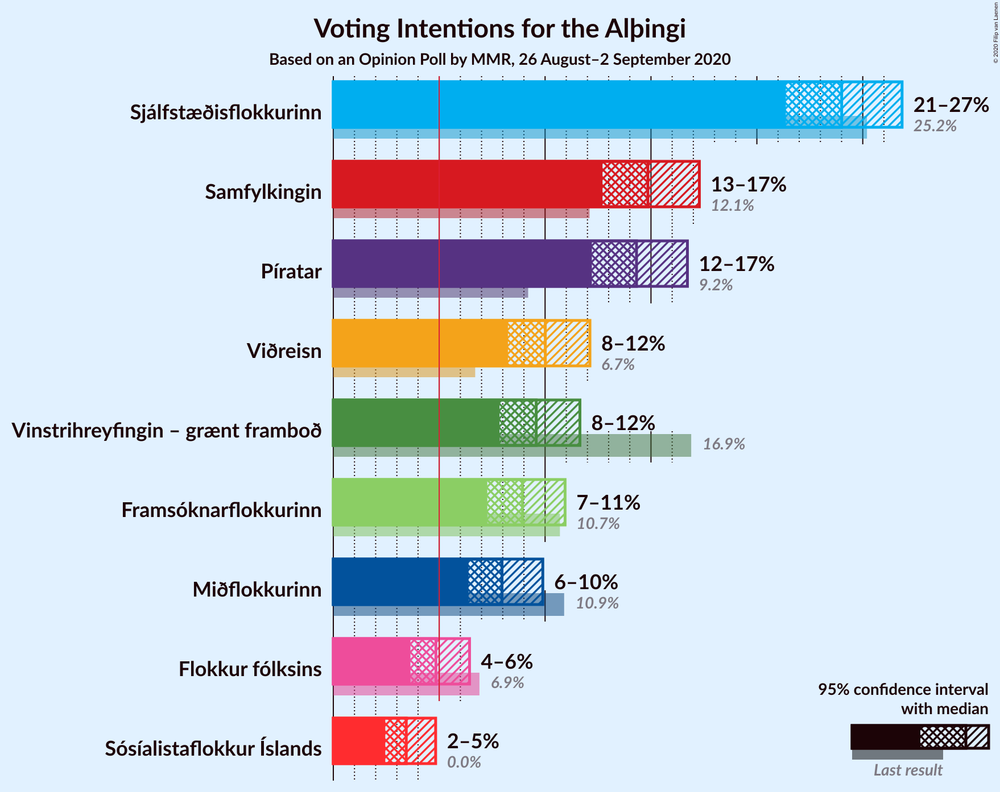

### Confidence Intervals

| Party | Last Result | Poll Result | 80% Confidence Interval | 90% Confidence Interval | 95% Confidence Interval | 99% Confidence Interval |
|:-----:|:-----------:|:-----------:|:-----------------------:|:-----------------------:|:-----------------------:|:-----------------------:|
| Sjálfstæðisflokkurinn | 25.2% | 24.0% | 22.3–25.9% |21.8–26.4% |21.4–26.9% |20.6–27.8% |
| Samfylkingin | 12.1% | 14.9% | 13.4–16.4% |13.0–16.9% |12.7–17.3% |12.1–18.1% |
| Píratar | 9.2% | 14.3% | 12.9–15.9% |12.5–16.3% |12.2–16.7% |11.6–17.5% |
| Viðreisn | 6.7% | 10.0% | 8.8–11.4% |8.5–11.8% |8.2–12.1% |7.7–12.8% |
| Vinstrihreyfingin – grænt framboð | 16.9% | 9.6% | 8.4–10.9% |8.1–11.3% |7.8–11.6% |7.3–12.3% |
| Framsóknarflokkurinn | 10.7% | 8.9% | 7.8–10.2% |7.5–10.6% |7.3–10.9% |6.8–11.6% |
| Miðflokkurinn | 10.9% | 8.0% | 6.9–9.2% |6.6–9.6% |6.4–9.9% |5.9–10.5% |
| Flokkur fólksins | 6.9% | 4.8% | 4.1–5.9% |3.8–6.2% |3.6–6.4% |3.3–7.0% |
| Sósíalistaflokkur Íslands | 0.0% | 3.4% | 2.8–4.3% |2.6–4.6% |2.5–4.8% |2.2–5.3% |

*Note:* The poll result column reflects the actual value used in the calculations. Published results may vary slightly, and in addition be rounded to fewer digits.

## Seats

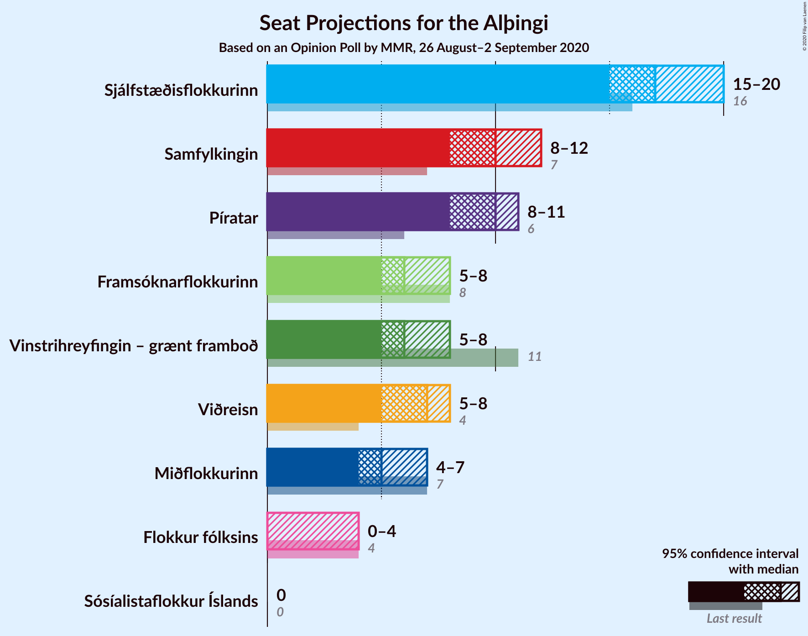

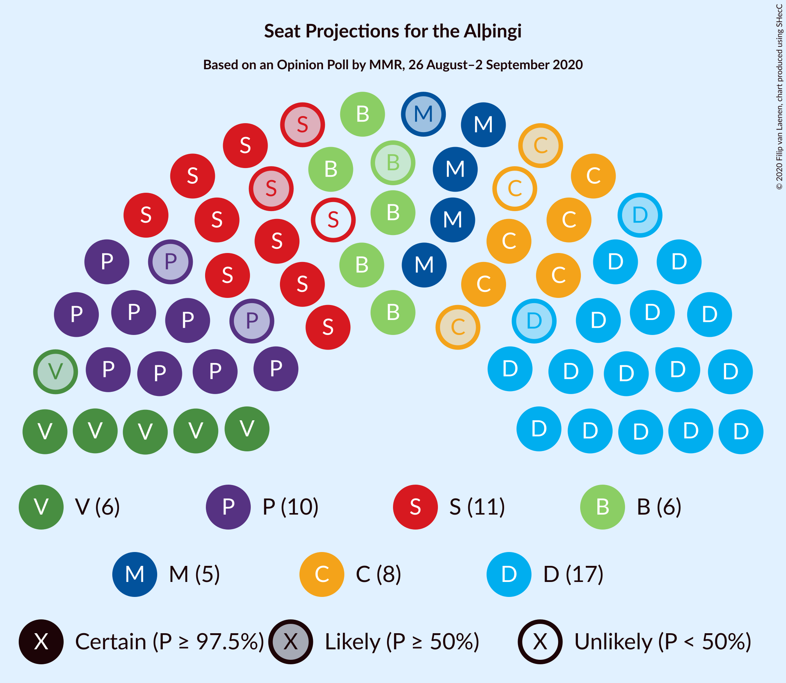

### Confidence Intervals

| Party | Last Result | Median | 80% Confidence Interval | 90% Confidence Interval | 95% Confidence Interval | 99% Confidence Interval |
|:-----:|:-----------:|:------:|:-----------------------:|:-----------------------:|:-----------------------:|:-----------------------:|
| <a href="#sjálfstæðisflokkurinn">Sjálfstæðisflokkurinn</a> | 16 | 17 | 16–19 |15–19 |15–20 |14–21 |
| <a href="#samfylkingin">Samfylkingin</a> | 7 | 10 | 9–12 |9–12 |8–12 |8–12 |
| <a href="#píratar">Píratar</a> | 6 | 10 | 9–11 |8–11 |8–11 |8–12 |
| <a href="#viðreisn">Viðreisn</a> | 4 | 7 | 6–8 |6–8 |5–8 |5–9 |
| <a href="#vinstrihreyfingin-–-grænt-framboð">Vinstrihreyfingin – grænt framboð</a> | 11 | 6 | 6–7 |5–8 |5–8 |5–9 |
| <a href="#framsóknarflokkurinn">Framsóknarflokkurinn</a> | 8 | 6 | 5–7 |5–8 |5–8 |4–9 |
| <a href="#miðflokkurinn">Miðflokkurinn</a> | 7 | 5 | 4–6 |4–6 |4–7 |4–7 |
| <a href="#flokkur-fólksins">Flokkur fólksins</a> | 4 | 0 | 0–4 |0–4 |0–4 |0–4 |
| <a href="#sósíalistaflokkur-íslands">Sósíalistaflokkur Íslands</a> | 0 | 0 | 0 |0 |0 |0–3 |

### Sjálfstæðisflokkurinn

*For a full overview of the results for this party, see the [Sjálfstæðisflokkurinn](party-sjálfstæðisflokkurinn.html) page.*

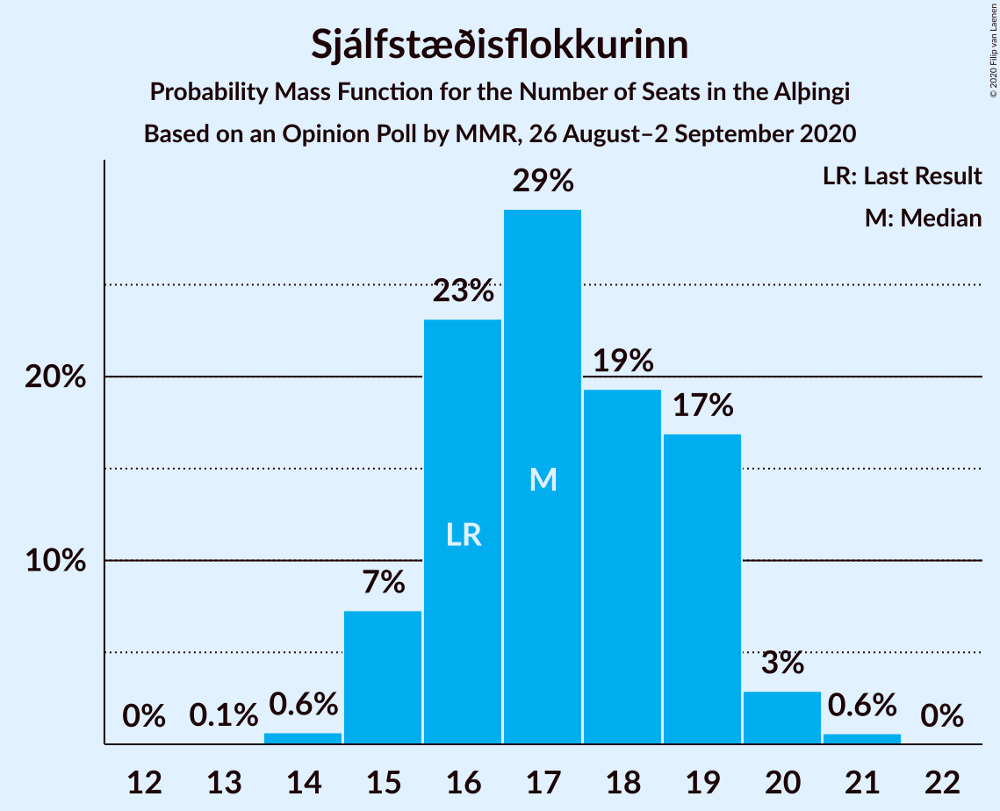

| Number of Seats | Probability | Accumulated | Special Marks |
|:---------------:|:-----------:|:-----------:|:-------------:|
| 13 | 0.1% | 100% |  |
| 14 | 0.6% | 99.9% |  |
| 15 | 7% | 99.3% |  |
| 16 | 23% | 92% | Last Result |
| 17 | 29% | 69% | Median |
| 18 | 19% | 40% |  |
| 19 | 17% | 20% |  |
| 20 | 3% | 4% |  |
| 21 | 0.6% | 0.6% |  |
| 22 | 0% | 0% |  |

### Samfylkingin

*For a full overview of the results for this party, see the [Samfylkingin](party-samfylkingin.html) page.*

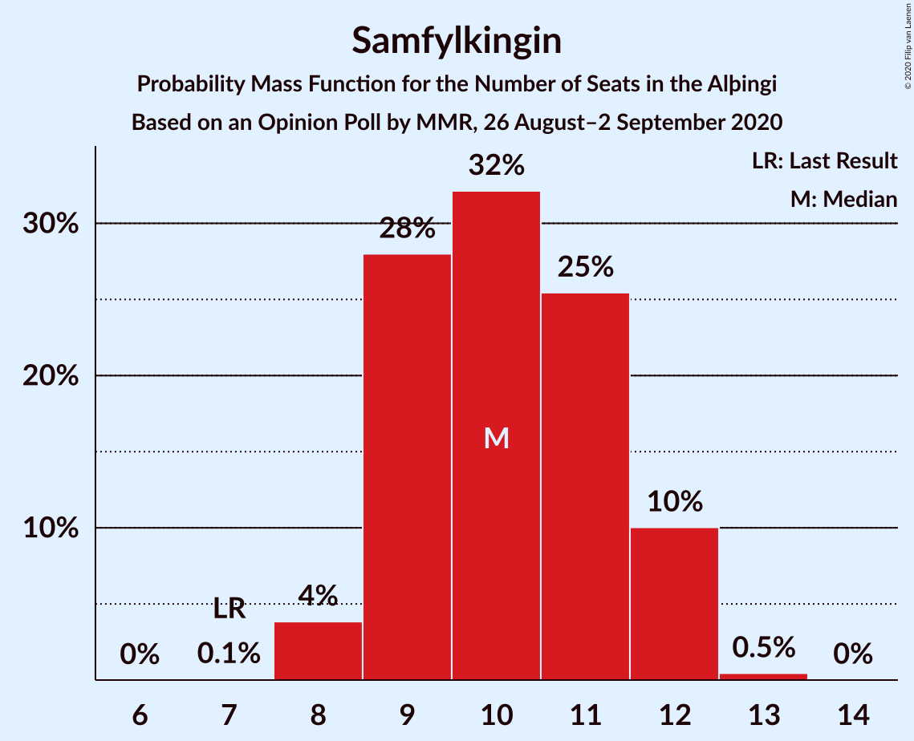

| Number of Seats | Probability | Accumulated | Special Marks |
|:---------------:|:-----------:|:-----------:|:-------------:|
| 7 | 0.1% | 100% | Last Result |
| 8 | 4% | 99.9% |  |
| 9 | 28% | 96% |  |
| 10 | 32% | 68% | Median |
| 11 | 25% | 36% |  |
| 12 | 10% | 11% |  |
| 13 | 0.5% | 0.5% |  |
| 14 | 0% | 0% |  |

### Píratar

*For a full overview of the results for this party, see the [Píratar](party-píratar.html) page.*

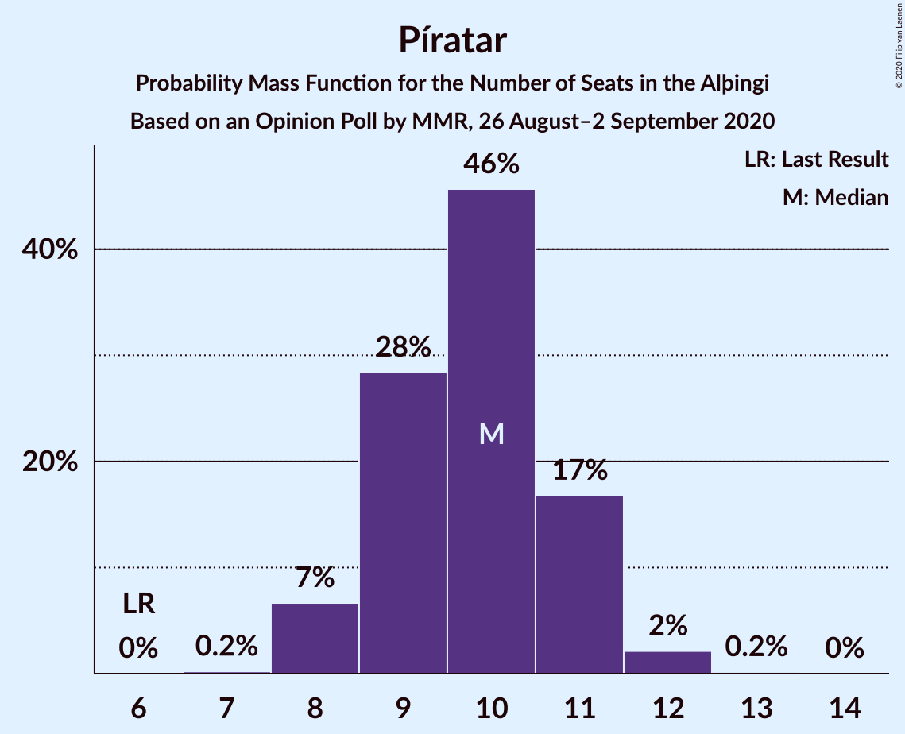

| Number of Seats | Probability | Accumulated | Special Marks |
|:---------------:|:-----------:|:-----------:|:-------------:|
| 6 | 0% | 100% | Last Result |
| 7 | 0.2% | 100% |  |
| 8 | 7% | 99.8% |  |
| 9 | 28% | 93% |  |
| 10 | 46% | 65% | Median |
| 11 | 17% | 19% |  |
| 12 | 2% | 2% |  |
| 13 | 0.2% | 0.2% |  |
| 14 | 0% | 0% |  |

### Viðreisn

*For a full overview of the results for this party, see the [Viðreisn](party-viðreisn.html) page.*

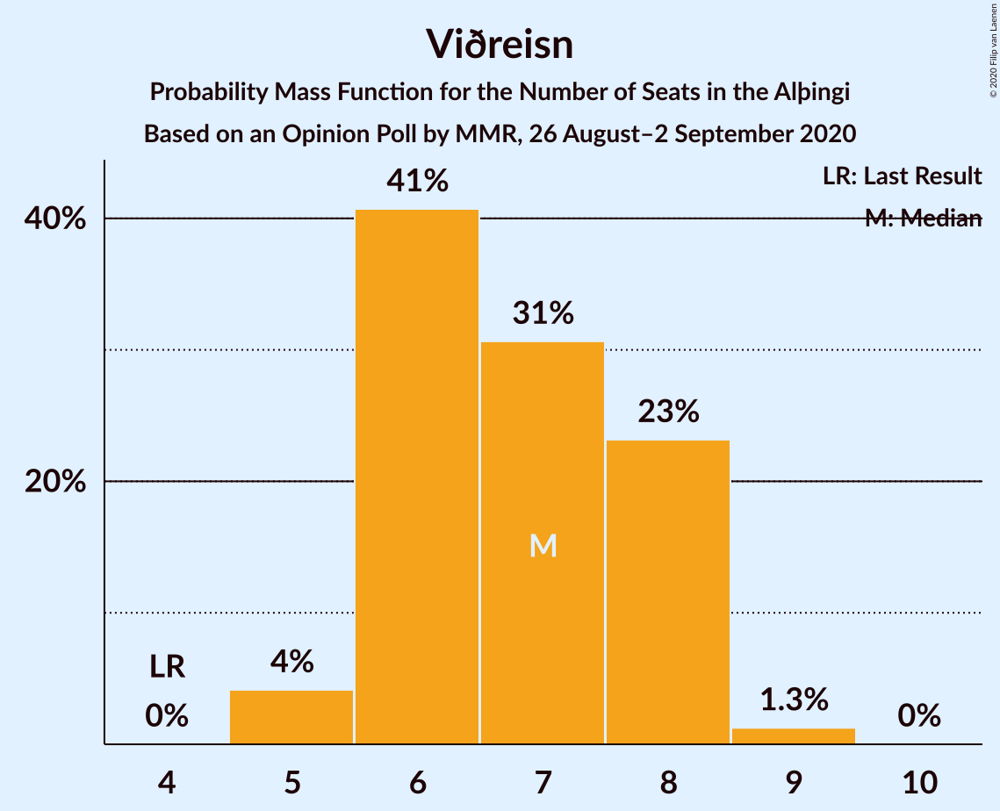

| Number of Seats | Probability | Accumulated | Special Marks |
|:---------------:|:-----------:|:-----------:|:-------------:|
| 4 | 0% | 100% | Last Result |
| 5 | 4% | 100% |  |
| 6 | 41% | 96% |  |
| 7 | 31% | 55% | Median |
| 8 | 23% | 24% |  |
| 9 | 1.3% | 1.3% |  |
| 10 | 0% | 0% |  |

### Vinstrihreyfingin – grænt framboð

*For a full overview of the results for this party, see the [Vinstrihreyfingin – grænt framboð](party-vinstrihreyfingin–græntframboð.html) page.*

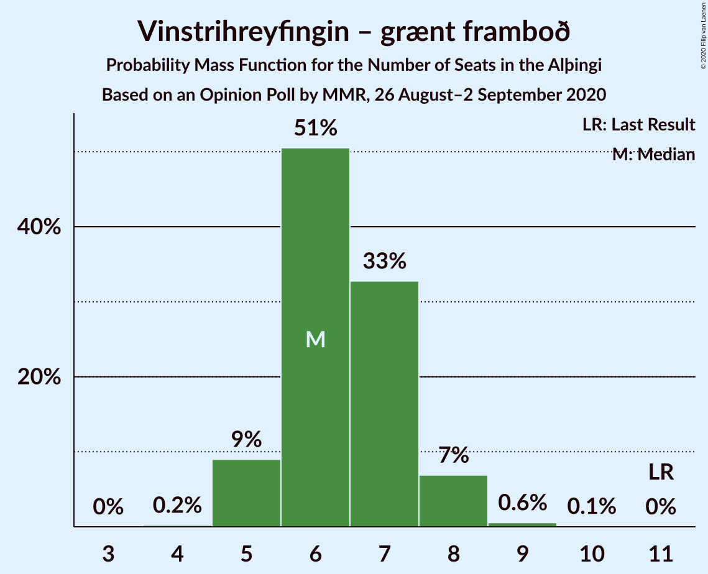

| Number of Seats | Probability | Accumulated | Special Marks |
|:---------------:|:-----------:|:-----------:|:-------------:|
| 4 | 0.2% | 100% |  |
| 5 | 9% | 99.8% |  |
| 6 | 51% | 91% | Median |
| 7 | 33% | 40% |  |
| 8 | 7% | 8% |  |
| 9 | 0.6% | 0.6% |  |
| 10 | 0.1% | 0.1% |  |
| 11 | 0% | 0% | Last Result |

### Framsóknarflokkurinn

*For a full overview of the results for this party, see the [Framsóknarflokkurinn](party-framsóknarflokkurinn.html) page.*

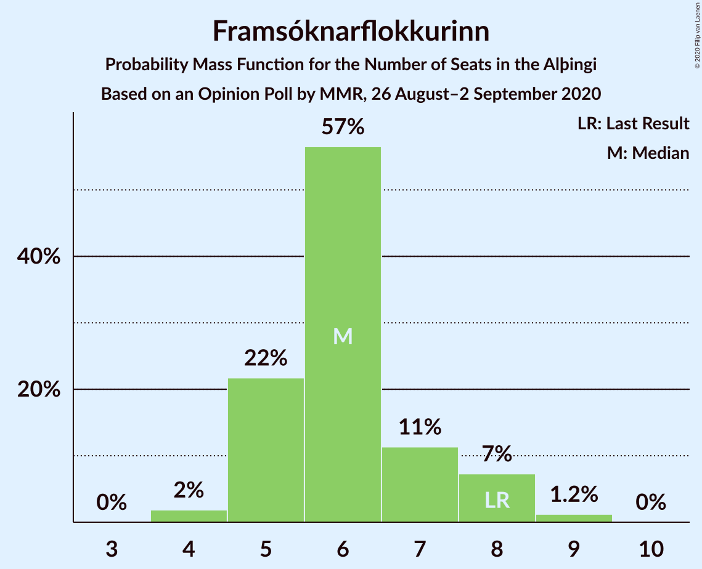

| Number of Seats | Probability | Accumulated | Special Marks |
|:---------------:|:-----------:|:-----------:|:-------------:|
| 4 | 2% | 100% |  |
| 5 | 22% | 98% |  |
| 6 | 57% | 76% | Median |
| 7 | 11% | 20% |  |
| 8 | 7% | 9% | Last Result |
| 9 | 1.2% | 1.2% |  |
| 10 | 0% | 0% |  |

### Miðflokkurinn

*For a full overview of the results for this party, see the [Miðflokkurinn](party-miðflokkurinn.html) page.*

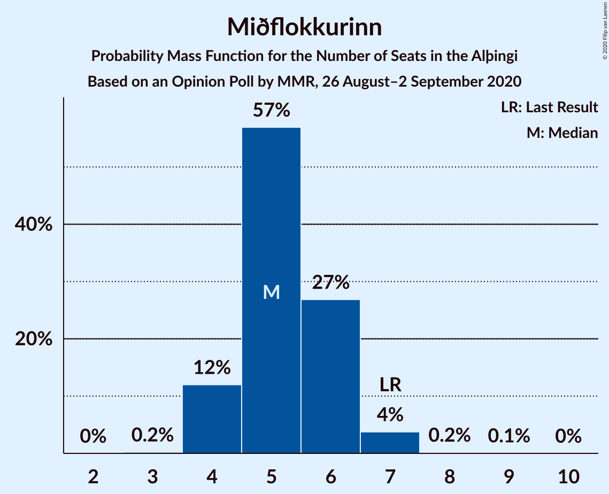

| Number of Seats | Probability | Accumulated | Special Marks |
|:---------------:|:-----------:|:-----------:|:-------------:|
| 3 | 0.2% | 100% |  |
| 4 | 12% | 99.8% |  |
| 5 | 57% | 88% | Median |
| 6 | 27% | 31% |  |
| 7 | 4% | 4% | Last Result |
| 8 | 0.2% | 0.2% |  |
| 9 | 0.1% | 0.1% |  |
| 10 | 0% | 0% |  |

### Flokkur fólksins

*For a full overview of the results for this party, see the [Flokkur fólksins](party-flokkurfólksins.html) page.*

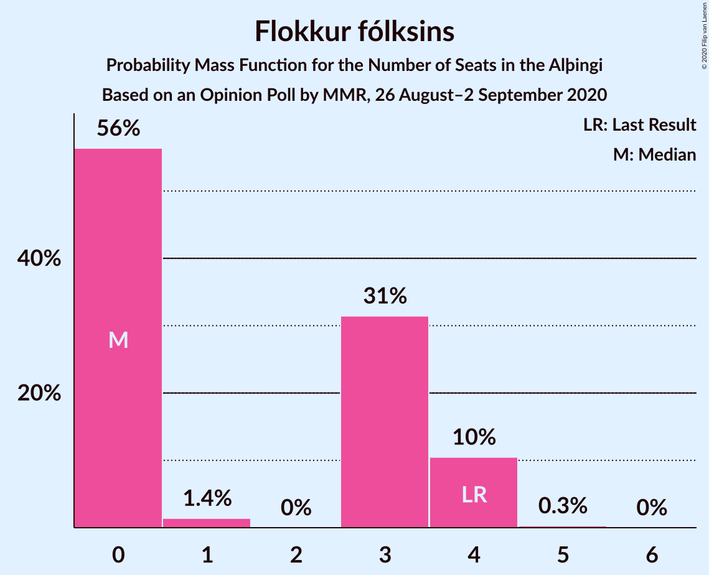

| Number of Seats | Probability | Accumulated | Special Marks |
|:---------------:|:-----------:|:-----------:|:-------------:|
| 0 | 56% | 100% | Median |
| 1 | 1.4% | 44% |  |
| 2 | 0% | 42% |  |
| 3 | 31% | 42% |  |
| 4 | 10% | 11% | Last Result |
| 5 | 0.3% | 0.3% |  |
| 6 | 0% | 0% |  |

### Sósíalistaflokkur Íslands

*For a full overview of the results for this party, see the [Sósíalistaflokkur Íslands](party-sósíalistaflokkuríslands.html) page.*

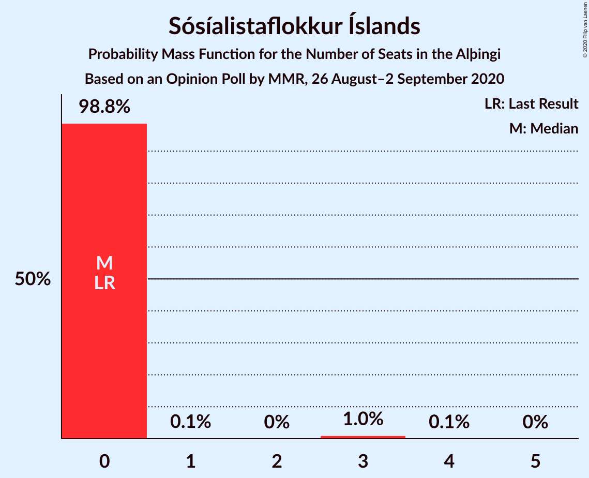

| Number of Seats | Probability | Accumulated | Special Marks |
|:---------------:|:-----------:|:-----------:|:-------------:|
| 0 | 98.8% | 100% | Last Result, Median |
| 1 | 0.1% | 1.2% |  |
| 2 | 0% | 1.1% |  |
| 3 | 1.0% | 1.1% |  |
| 4 | 0.1% | 0.1% |  |
| 5 | 0% | 0% |  |

## Coalitions

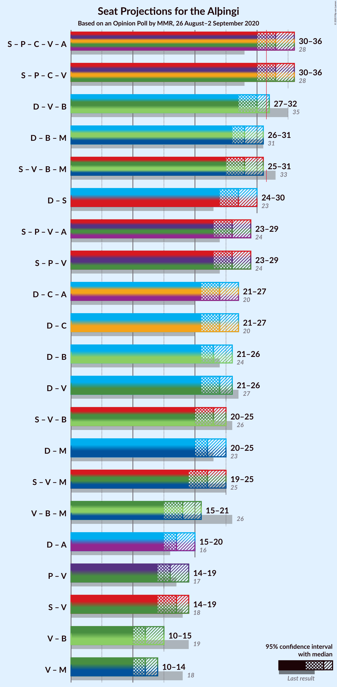

### Confidence Intervals

| Coalition | Last Result | Median | Majority? | 80% Confidence Interval | 90% Confidence Interval | 95% Confidence Interval | 99% Confidence Interval |
|:---------:|:-----------:|:------:|:---------:|:-----------------------:|:-----------------------:|:-----------------------:|:-----------------------:|
| Samfylkingin – Píratar – Viðreisn – Vinstrihreyfingin – grænt framboð | 28 | 33 | 84% | 31–35 | 30–36 | 30–36 | 29–37 |
| Sjálfstæðisflokkurinn – Vinstrihreyfingin – grænt framboð – Framsóknarflokkurinn | 35 | 30 | 10% | 28–32 | 27–32 | 27–32 | 26–33 |
| Sjálfstæðisflokkurinn – Framsóknarflokkurinn – Miðflokkurinn | 31 | 28 | 1.3% | 27–30 | 26–31 | 26–31 | 25–32 |
| Samfylkingin – Vinstrihreyfingin – grænt framboð – Framsóknarflokkurinn – Miðflokkurinn | 33 | 28 | 0.7% | 26–30 | 25–31 | 25–31 | 24–32 |
| Sjálfstæðisflokkurinn – Samfylkingin | 23 | 27 | 0.1% | 25–30 | 25–30 | 24–30 | 24–31 |
| Samfylkingin – Píratar – Vinstrihreyfingin – grænt framboð | 24 | 26 | 0% | 24–28 | 24–29 | 23–29 | 23–30 |
| Sjálfstæðisflokkurinn – Viðreisn | 20 | 24 | 0% | 22–26 | 22–26 | 21–27 | 20–27 |
| Sjálfstæðisflokkurinn – Framsóknarflokkurinn | 24 | 23 | 0% | 22–25 | 21–26 | 21–26 | 20–27 |
| Sjálfstæðisflokkurinn – Vinstrihreyfingin – grænt framboð | 27 | 24 | 0% | 22–25 | 21–26 | 21–26 | 20–27 |
| Samfylkingin – Vinstrihreyfingin – grænt framboð – Framsóknarflokkurinn | 26 | 23 | 0% | 21–25 | 20–25 | 20–25 | 19–26 |
| Sjálfstæðisflokkurinn – Miðflokkurinn | 23 | 22 | 0% | 21–24 | 20–25 | 20–25 | 19–26 |
| Samfylkingin – Vinstrihreyfingin – grænt framboð – Miðflokkurinn | 25 | 22 | 0% | 20–24 | 20–24 | 19–25 | 18–25 |
| Vinstrihreyfingin – grænt framboð – Framsóknarflokkurinn – Miðflokkurinn | 26 | 18 | 0% | 16–19 | 16–20 | 15–21 | 14–21 |
| Píratar – Vinstrihreyfingin – grænt framboð | 17 | 16 | 0% | 15–18 | 14–18 | 14–19 | 13–19 |
| Samfylkingin – Vinstrihreyfingin – grænt framboð | 18 | 17 | 0% | 15–18 | 15–19 | 14–19 | 13–20 |
| Vinstrihreyfingin – grænt framboð – Framsóknarflokkurinn | 19 | 12 | 0% | 11–14 | 11–14 | 10–15 | 10–15 |
| Vinstrihreyfingin – grænt framboð – Miðflokkurinn | 18 | 12 | 0% | 10–13 | 10–14 | 10–14 | 9–15 |

### Samfylkingin – Píratar – Viðreisn – Vinstrihreyfingin – grænt framboð

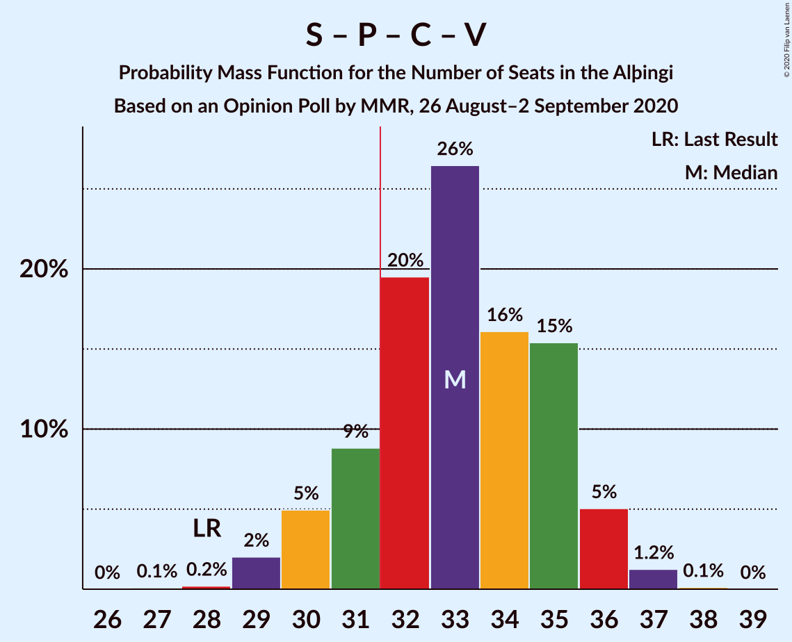

| Number of Seats | Probability | Accumulated | Special Marks |
|:---------------:|:-----------:|:-----------:|:-------------:|
| 27 | 0.1% | 100% |  |
| 28 | 0.2% | 99.9% | Last Result |
| 29 | 2% | 99.7% |  |
| 30 | 5% | 98% |  |
| 31 | 9% | 93% |  |
| 32 | 20% | 84% | Majority |
| 33 | 26% | 64% | Median |
| 34 | 16% | 38% |  |
| 35 | 15% | 22% |  |
| 36 | 5% | 6% |  |
| 37 | 1.2% | 1.4% |  |
| 38 | 0.1% | 0.1% |  |
| 39 | 0% | 0% |  |

### Sjálfstæðisflokkurinn – Vinstrihreyfingin – grænt framboð – Framsóknarflokkurinn

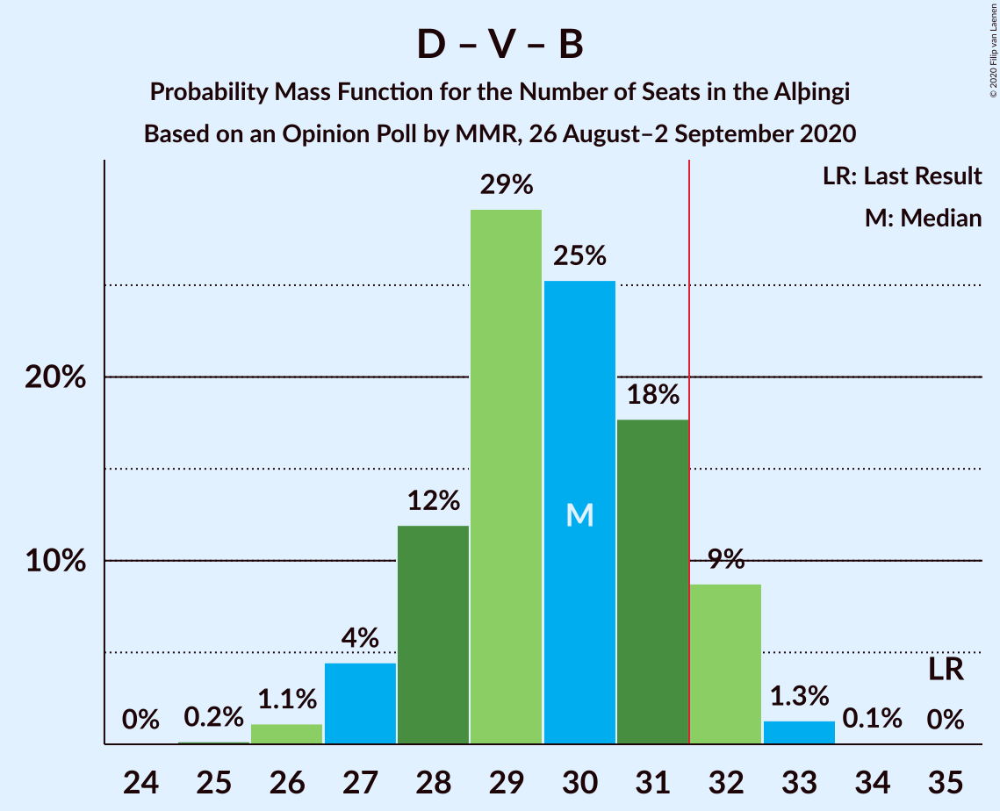

| Number of Seats | Probability | Accumulated | Special Marks |
|:---------------:|:-----------:|:-----------:|:-------------:|
| 25 | 0.2% | 100% |  |
| 26 | 1.1% | 99.8% |  |
| 27 | 4% | 98.7% |  |
| 28 | 12% | 94% |  |
| 29 | 29% | 82% | Median |
| 30 | 25% | 53% |  |
| 31 | 18% | 28% |  |
| 32 | 9% | 10% | Majority |
| 33 | 1.3% | 1.4% |  |
| 34 | 0.1% | 0.1% |  |
| 35 | 0% | 0% | Last Result |

### Sjálfstæðisflokkurinn – Framsóknarflokkurinn – Miðflokkurinn

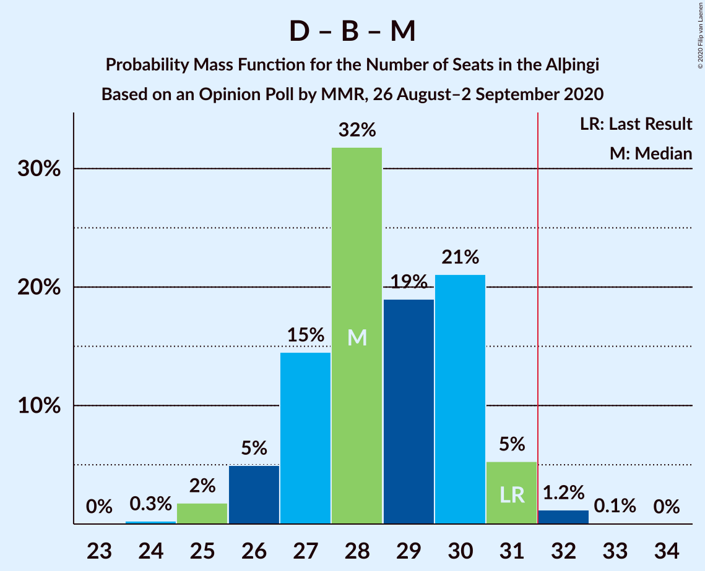

| Number of Seats | Probability | Accumulated | Special Marks |
|:---------------:|:-----------:|:-----------:|:-------------:|
| 24 | 0.3% | 100% |  |
| 25 | 2% | 99.7% |  |
| 26 | 5% | 98% |  |
| 27 | 15% | 93% |  |
| 28 | 32% | 78% | Median |
| 29 | 19% | 47% |  |
| 30 | 21% | 28% |  |
| 31 | 5% | 7% | Last Result |
| 32 | 1.2% | 1.3% | Majority |
| 33 | 0.1% | 0.1% |  |
| 34 | 0% | 0% |  |

### Samfylkingin – Vinstrihreyfingin – grænt framboð – Framsóknarflokkurinn – Miðflokkurinn

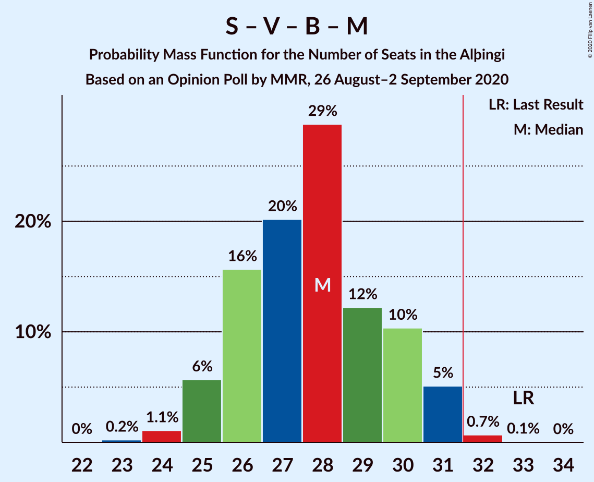

| Number of Seats | Probability | Accumulated | Special Marks |
|:---------------:|:-----------:|:-----------:|:-------------:|
| 23 | 0.2% | 100% |  |
| 24 | 1.1% | 99.8% |  |
| 25 | 6% | 98.7% |  |
| 26 | 16% | 93% |  |
| 27 | 20% | 77% | Median |
| 28 | 29% | 57% |  |
| 29 | 12% | 28% |  |
| 30 | 10% | 16% |  |
| 31 | 5% | 6% |  |
| 32 | 0.7% | 0.7% | Majority |
| 33 | 0.1% | 0.1% | Last Result |
| 34 | 0% | 0% |  |

### Sjálfstæðisflokkurinn – Samfylkingin

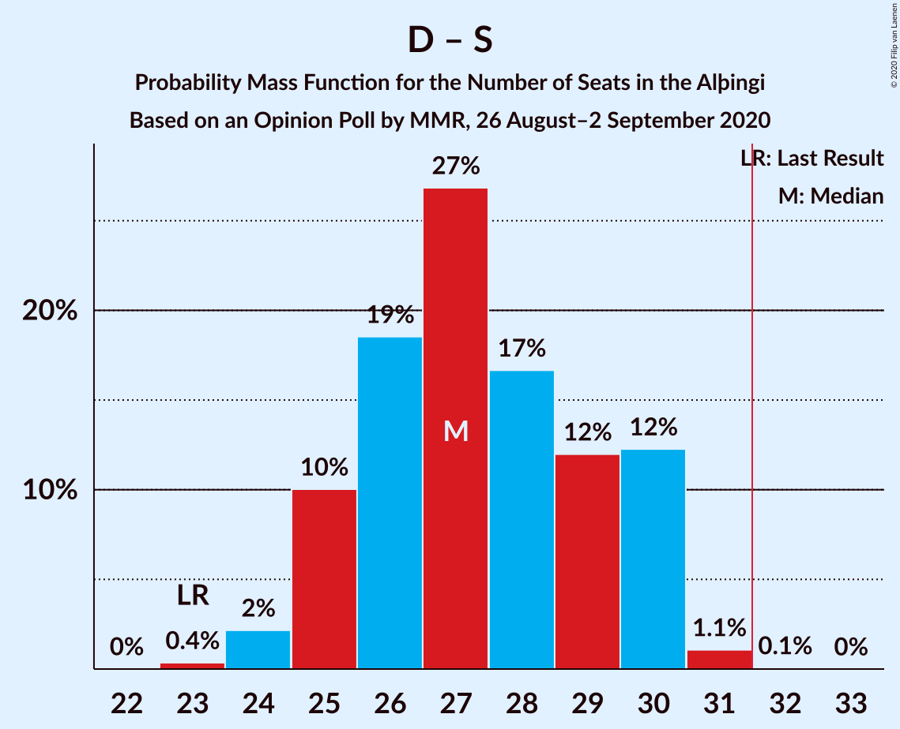

| Number of Seats | Probability | Accumulated | Special Marks |
|:---------------:|:-----------:|:-----------:|:-------------:|
| 23 | 0.4% | 100% | Last Result |
| 24 | 2% | 99.6% |  |
| 25 | 10% | 97% |  |
| 26 | 19% | 87% |  |
| 27 | 27% | 69% | Median |
| 28 | 17% | 42% |  |
| 29 | 12% | 25% |  |
| 30 | 12% | 13% |  |
| 31 | 1.1% | 1.1% |  |
| 32 | 0.1% | 0.1% | Majority |
| 33 | 0% | 0% |  |

### Samfylkingin – Píratar – Vinstrihreyfingin – grænt framboð

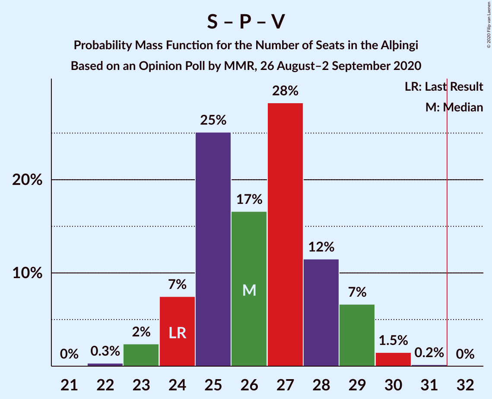

| Number of Seats | Probability | Accumulated | Special Marks |
|:---------------:|:-----------:|:-----------:|:-------------:|
| 22 | 0.3% | 100% |  |
| 23 | 2% | 99.6% |  |
| 24 | 7% | 97% | Last Result |
| 25 | 25% | 90% |  |
| 26 | 17% | 65% | Median |
| 27 | 28% | 48% |  |
| 28 | 12% | 20% |  |
| 29 | 7% | 8% |  |
| 30 | 1.5% | 2% |  |
| 31 | 0.2% | 0.2% |  |
| 32 | 0% | 0% | Majority |

### Sjálfstæðisflokkurinn – Viðreisn

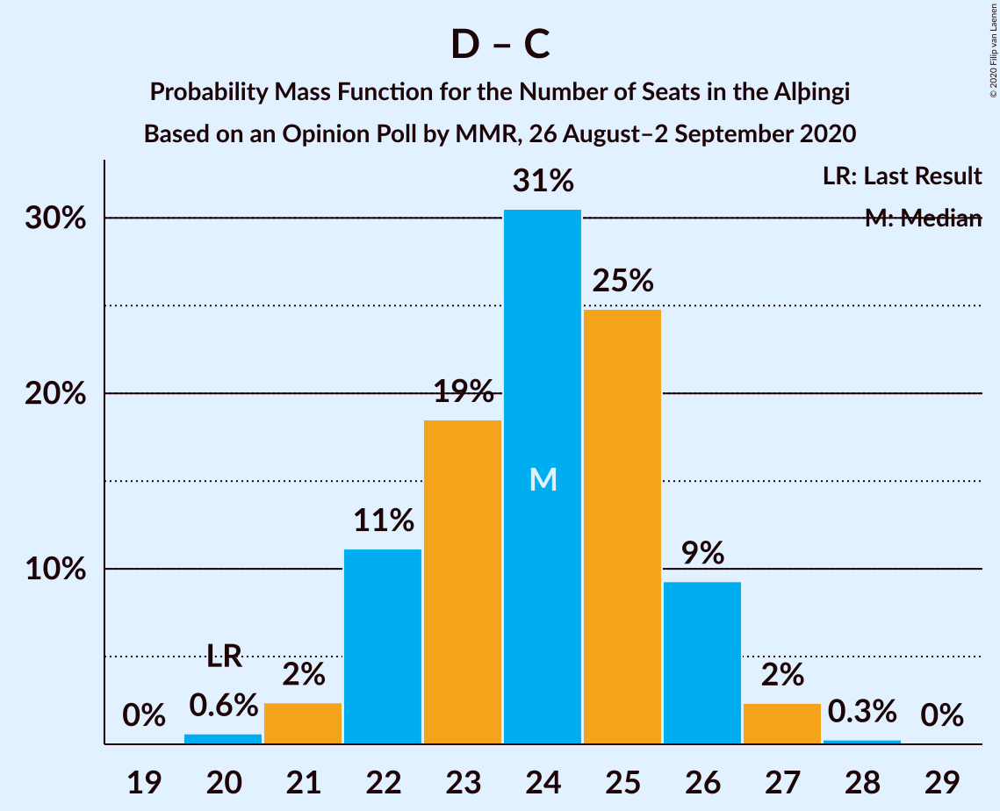

| Number of Seats | Probability | Accumulated | Special Marks |
|:---------------:|:-----------:|:-----------:|:-------------:|
| 20 | 0.6% | 100% | Last Result |
| 21 | 2% | 99.3% |  |
| 22 | 11% | 97% |  |
| 23 | 19% | 86% |  |
| 24 | 31% | 67% | Median |
| 25 | 25% | 37% |  |
| 26 | 9% | 12% |  |
| 27 | 2% | 3% |  |
| 28 | 0.3% | 0.3% |  |
| 29 | 0% | 0% |  |

### Sjálfstæðisflokkurinn – Framsóknarflokkurinn

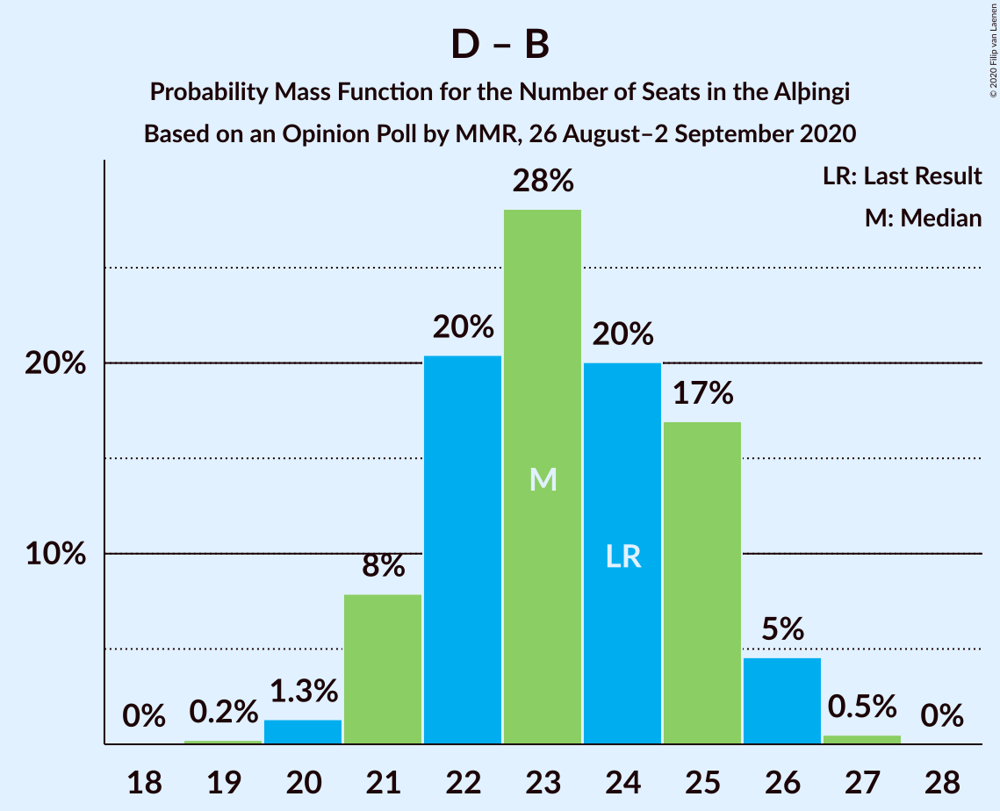

| Number of Seats | Probability | Accumulated | Special Marks |
|:---------------:|:-----------:|:-----------:|:-------------:|
| 19 | 0.2% | 100% |  |
| 20 | 1.3% | 99.8% |  |
| 21 | 8% | 98% |  |
| 22 | 20% | 91% |  |
| 23 | 28% | 70% | Median |
| 24 | 20% | 42% | Last Result |
| 25 | 17% | 22% |  |
| 26 | 5% | 5% |  |
| 27 | 0.5% | 0.5% |  |
| 28 | 0% | 0% |  |

### Sjálfstæðisflokkurinn – Vinstrihreyfingin – grænt framboð

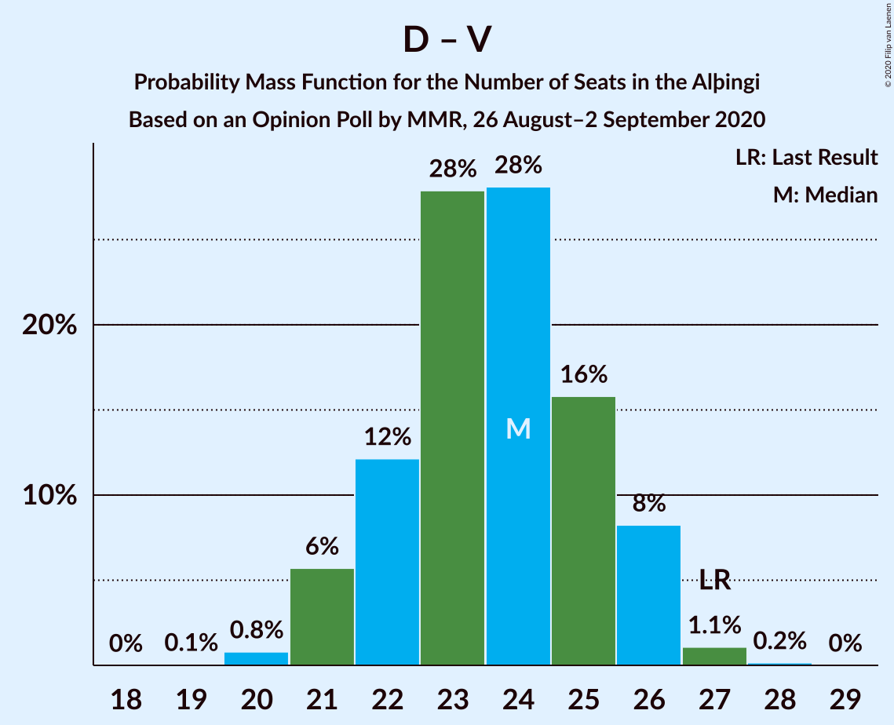

| Number of Seats | Probability | Accumulated | Special Marks |
|:---------------:|:-----------:|:-----------:|:-------------:|
| 19 | 0.1% | 100% |  |
| 20 | 0.8% | 99.9% |  |
| 21 | 6% | 99.1% |  |
| 22 | 12% | 93% |  |
| 23 | 28% | 81% | Median |
| 24 | 28% | 53% |  |
| 25 | 16% | 25% |  |
| 26 | 8% | 9% |  |
| 27 | 1.1% | 1.3% | Last Result |
| 28 | 0.2% | 0.2% |  |
| 29 | 0% | 0% |  |

### Samfylkingin – Vinstrihreyfingin – grænt framboð – Framsóknarflokkurinn

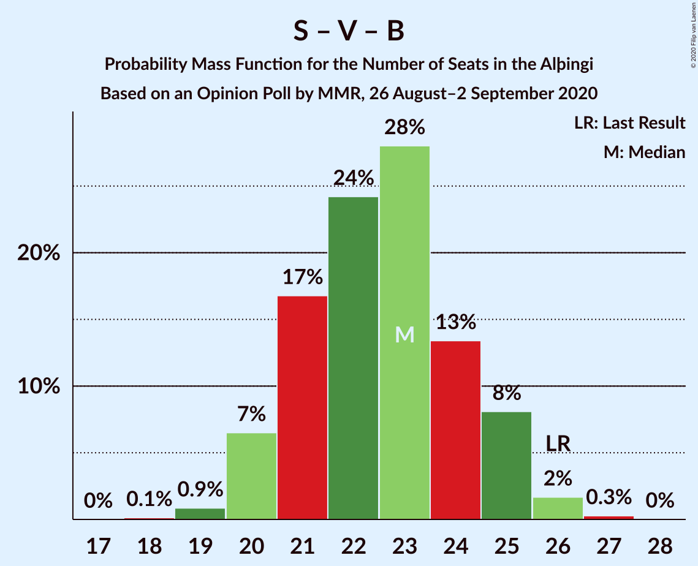

| Number of Seats | Probability | Accumulated | Special Marks |
|:---------------:|:-----------:|:-----------:|:-------------:|
| 18 | 0.1% | 100% |  |
| 19 | 0.9% | 99.9% |  |
| 20 | 7% | 99.0% |  |
| 21 | 17% | 92% |  |
| 22 | 24% | 76% | Median |
| 23 | 28% | 51% |  |
| 24 | 13% | 23% |  |
| 25 | 8% | 10% |  |
| 26 | 2% | 2% | Last Result |
| 27 | 0.3% | 0.3% |  |
| 28 | 0% | 0% |  |

### Sjálfstæðisflokkurinn – Miðflokkurinn

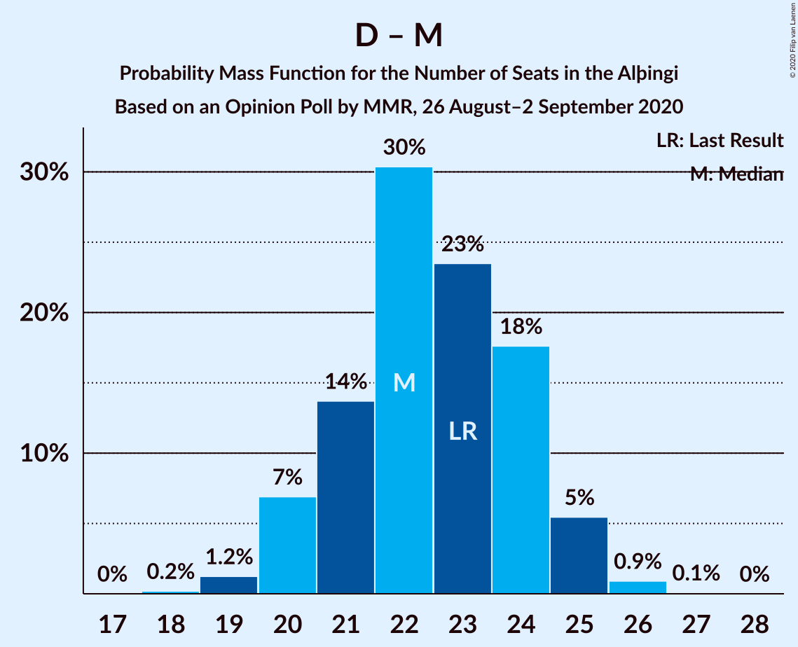

| Number of Seats | Probability | Accumulated | Special Marks |
|:---------------:|:-----------:|:-----------:|:-------------:|
| 18 | 0.2% | 100% |  |
| 19 | 1.2% | 99.8% |  |
| 20 | 7% | 98.6% |  |
| 21 | 14% | 92% |  |
| 22 | 30% | 78% | Median |
| 23 | 23% | 48% | Last Result |
| 24 | 18% | 24% |  |
| 25 | 5% | 6% |  |
| 26 | 0.9% | 1.0% |  |
| 27 | 0.1% | 0.1% |  |
| 28 | 0% | 0% |  |

### Samfylkingin – Vinstrihreyfingin – grænt framboð – Miðflokkurinn

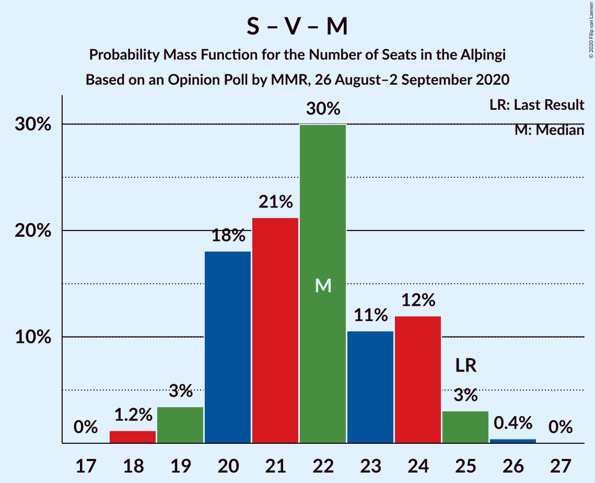

| Number of Seats | Probability | Accumulated | Special Marks |
|:---------------:|:-----------:|:-----------:|:-------------:|
| 18 | 1.2% | 100% |  |
| 19 | 3% | 98.8% |  |
| 20 | 18% | 95% |  |
| 21 | 21% | 77% | Median |
| 22 | 30% | 56% |  |
| 23 | 11% | 26% |  |
| 24 | 12% | 15% |  |
| 25 | 3% | 4% | Last Result |
| 26 | 0.4% | 0.5% |  |
| 27 | 0% | 0% |  |

### Vinstrihreyfingin – grænt framboð – Framsóknarflokkurinn – Miðflokkurinn

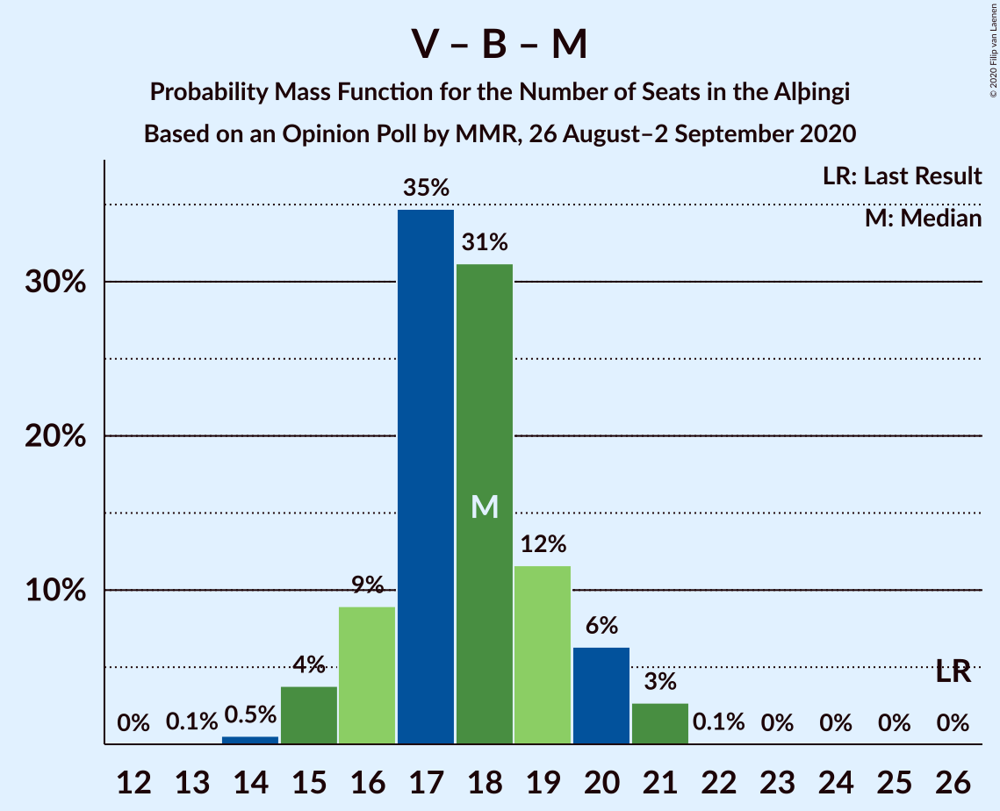

| Number of Seats | Probability | Accumulated | Special Marks |
|:---------------:|:-----------:|:-----------:|:-------------:|
| 13 | 0.1% | 100% |  |
| 14 | 0.5% | 99.9% |  |
| 15 | 4% | 99.4% |  |
| 16 | 9% | 96% |  |
| 17 | 35% | 87% | Median |
| 18 | 31% | 52% |  |
| 19 | 12% | 21% |  |
| 20 | 6% | 9% |  |
| 21 | 3% | 3% |  |
| 22 | 0.1% | 0.1% |  |
| 23 | 0% | 0% |  |
| 24 | 0% | 0% |  |
| 25 | 0% | 0% |  |
| 26 | 0% | 0% | Last Result |

### Píratar – Vinstrihreyfingin – grænt framboð

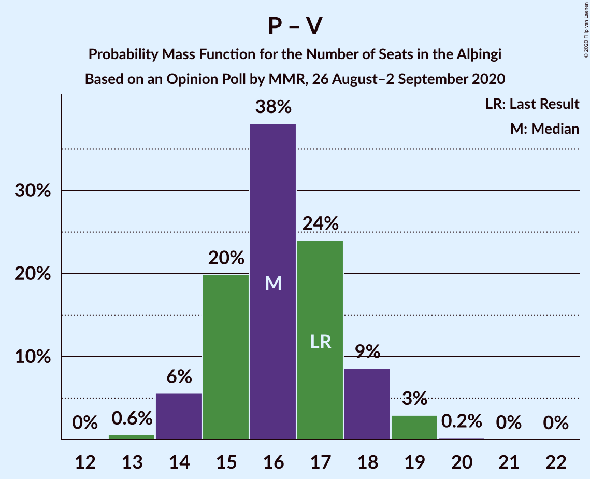

| Number of Seats | Probability | Accumulated | Special Marks |
|:---------------:|:-----------:|:-----------:|:-------------:|
| 13 | 0.6% | 100% |  |
| 14 | 6% | 99.4% |  |
| 15 | 20% | 94% |  |
| 16 | 38% | 74% | Median |
| 17 | 24% | 36% | Last Result |
| 18 | 9% | 12% |  |
| 19 | 3% | 3% |  |
| 20 | 0.2% | 0.3% |  |
| 21 | 0% | 0.1% |  |
| 22 | 0% | 0% |  |

### Samfylkingin – Vinstrihreyfingin – grænt framboð

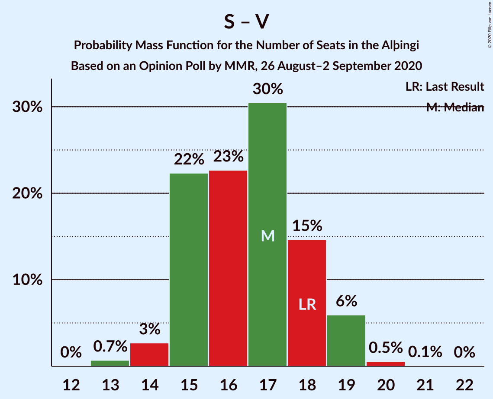

| Number of Seats | Probability | Accumulated | Special Marks |
|:---------------:|:-----------:|:-----------:|:-------------:|
| 13 | 0.7% | 100% |  |
| 14 | 3% | 99.3% |  |
| 15 | 22% | 97% |  |
| 16 | 23% | 74% | Median |
| 17 | 30% | 52% |  |
| 18 | 15% | 21% | Last Result |
| 19 | 6% | 7% |  |
| 20 | 0.5% | 0.6% |  |
| 21 | 0.1% | 0.1% |  |
| 22 | 0% | 0% |  |

### Vinstrihreyfingin – grænt framboð – Framsóknarflokkurinn

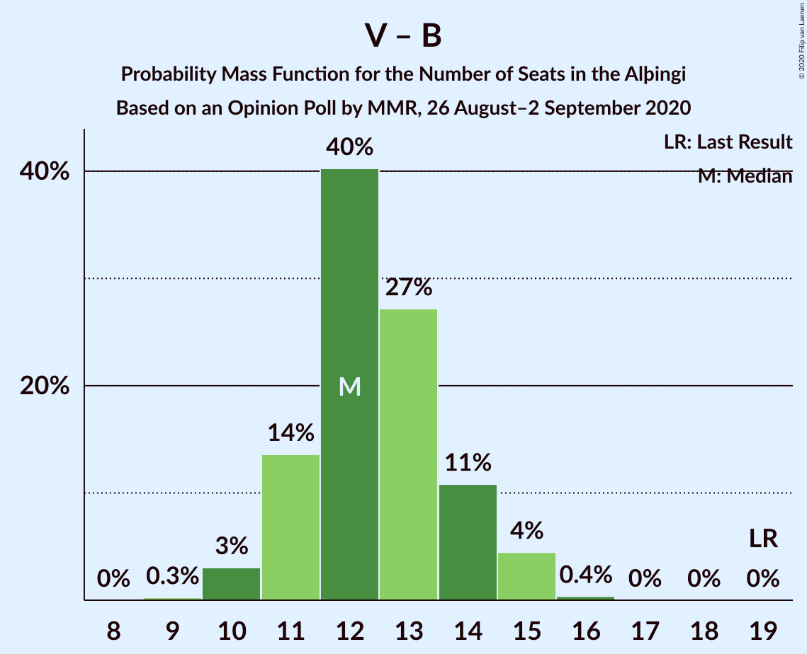

| Number of Seats | Probability | Accumulated | Special Marks |
|:---------------:|:-----------:|:-----------:|:-------------:|
| 9 | 0.3% | 100% |  |
| 10 | 3% | 99.7% |  |
| 11 | 14% | 97% |  |
| 12 | 40% | 83% | Median |
| 13 | 27% | 43% |  |
| 14 | 11% | 16% |  |
| 15 | 4% | 5% |  |
| 16 | 0.4% | 0.4% |  |
| 17 | 0% | 0% |  |
| 18 | 0% | 0% |  |
| 19 | 0% | 0% | Last Result |

### Vinstrihreyfingin – grænt framboð – Miðflokkurinn

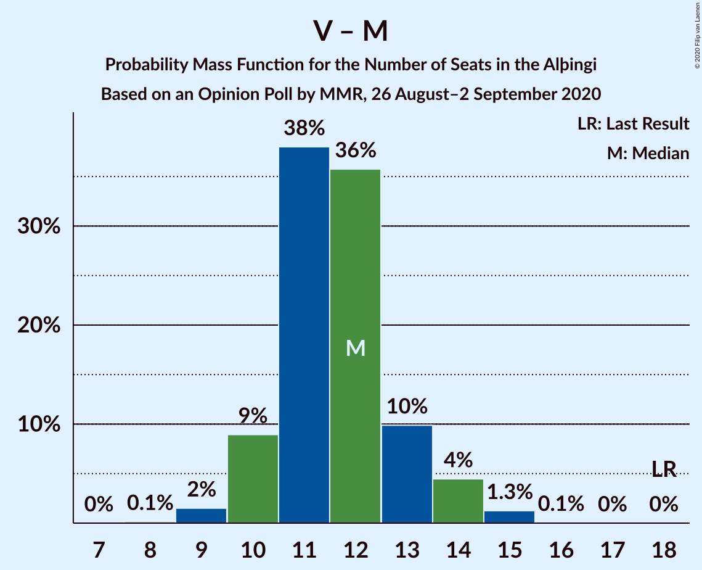

| Number of Seats | Probability | Accumulated | Special Marks |
|:---------------:|:-----------:|:-----------:|:-------------:|
| 8 | 0.1% | 100% |  |
| 9 | 2% | 99.9% |  |
| 10 | 9% | 98% |  |
| 11 | 38% | 89% | Median |
| 12 | 36% | 51% |  |
| 13 | 10% | 16% |  |
| 14 | 4% | 6% |  |
| 15 | 1.3% | 1.3% |  |
| 16 | 0.1% | 0.1% |  |
| 17 | 0% | 0% |  |
| 18 | 0% | 0% | Last Result |

## Technical Information

### Opinion Poll

+ **Polling firm:** MMR
+ **Commissioner(s):** —
+ **Fieldwork period:** 26 August–2 September 2020

### Calculations

+ **Sample size:** 929
+ **Simulations done:** 1,048,576
+ **Error estimate:** 2.09%

