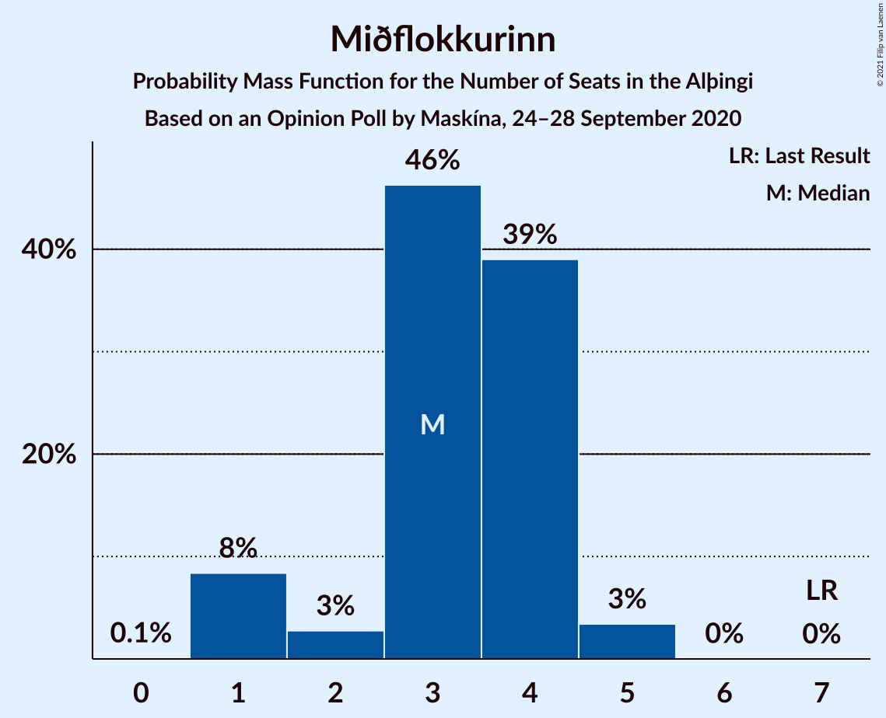
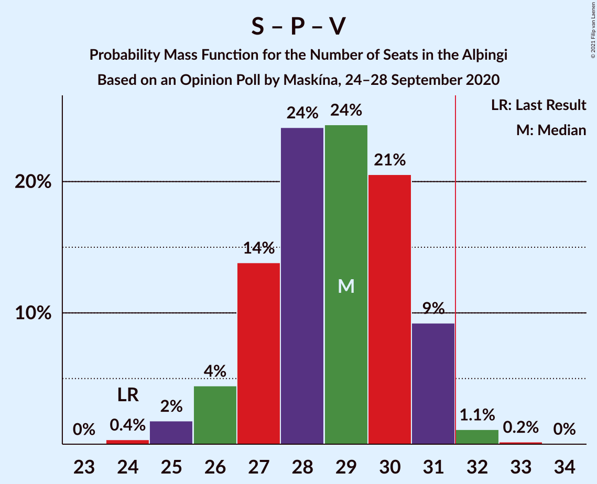
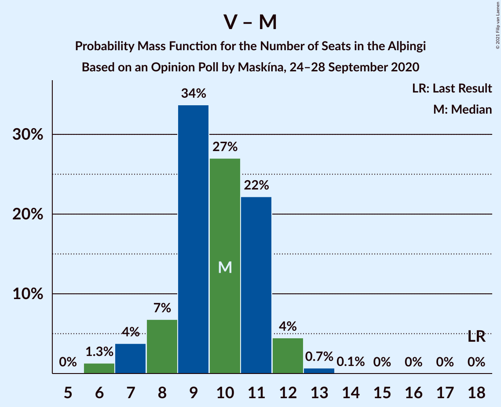

# Opinion Poll by Maskína, 24–28 September 2020

<a href="#voting-intentions">Voting Intentions</a> | <a href="#seats">Seats</a> | <a href="#coalitions">Coalitions</a> | <a href="#technical-information">Technical Information</a>

## Voting Intentions

### Confidence Intervals

| Party | Last Result | Poll Result | 80% Confidence Interval | 90% Confidence Interval | 95% Confidence Interval | 99% Confidence Interval |
|:-----:|:-----------:|:-----------:|:-----------------------:|:-----------------------:|:-----------------------:|:-----------------------:|
| Sjálfstæðisflokkurinn | 25.2% | 22.8% | 21.0–24.6% |20.5–25.2% |20.1–25.6% |19.3–26.6% |
| Samfylkingin | 12.1% | 17.9% | 16.3–19.6% |15.9–20.1% |15.5–20.5% |14.7–21.4% |
| Píratar | 9.2% | 15.7% | 14.2–17.4% |13.8–17.8% |13.4–18.3% |12.8–19.1% |
| Viðreisn | 6.7% | 14.0% | 12.6–15.6% |12.2–16.0% |11.9–16.4% |11.2–17.2% |
| Vinstrihreyfingin – grænt framboð | 16.9% | 10.4% | 9.1–11.8% |8.8–12.2% |8.5–12.5% |8.0–13.3% |
| Framsóknarflokkurinn | 10.7% | 7.8% | 6.8–9.1% |6.5–9.5% |6.2–9.8% |5.8–10.5% |
| Miðflokkurinn | 10.9% | 5.9% | 5.0–7.1% |4.8–7.4% |4.5–7.7% |4.1–8.3% |
| Flokkur fólksins | 6.9% | 5.5% | 4.6–6.6% |4.3–6.9% |4.1–7.2% |3.8–7.7% |

*Note:* The poll result column reflects the actual value used in the calculations. Published results may vary slightly, and in addition be rounded to fewer digits.

## Seats

### Confidence Intervals

| Party | Last Result | Median | 80% Confidence Interval | 90% Confidence Interval | 95% Confidence Interval | 99% Confidence Interval |
|:-----:|:-----------:|:------:|:-----------------------:|:-----------------------:|:-----------------------:|:-----------------------:|
| <a href="#sjálfstæðisflokkurinn">Sjálfstæðisflokkurinn</a> | 16 | 15 | 14–16 |14–16 |14–17 |13–17 |
| <a href="#samfylkingin">Samfylkingin</a> | 7 | 13 | 11–13 |11–13 |10–14 |10–14 |
| <a href="#píratar">Píratar</a> | 6 | 10 | 9–11 |9–11 |9–11 |8–12 |
| <a href="#viðreisn">Viðreisn</a> | 4 | 9 | 8–10 |8–10 |8–10 |7–11 |
| <a href="#vinstrihreyfingin-–-grænt-framboð">Vinstrihreyfingin – grænt framboð</a> | 11 | 6 | 6–7 |5–7 |5–8 |5–8 |
| <a href="#framsóknarflokkurinn">Framsóknarflokkurinn</a> | 8 | 4 | 4–5 |4–5 |4–6 |3–6 |
| <a href="#miðflokkurinn">Miðflokkurinn</a> | 7 | 4 | 1–4 |1–4 |1–5 |1–5 |
| <a href="#flokkur-fólksins">Flokkur fólksins</a> | 4 | 3 | 0–4 |0–4 |0–4 |0–4 |

### Sjálfstæðisflokkurinn

*For a full overview of the results for this party, see the [Sjálfstæðisflokkurinn](party-sjálfstæðisflokkurinn.html) page.*

| Number of Seats | Probability | Accumulated | Special Marks |
|:---------------:|:-----------:|:-----------:|:-------------:|
| 11 | 0.1% | 100% |  |
| 12 | 0.1% | 99.9% |  |
| 13 | 2% | 99.9% |  |
| 14 | 18% | 98% |  |
| 15 | 65% | 80% | Median |
| 16 | 11% | 15% | Last Result |
| 17 | 4% | 4% |  |
| 18 | 0.4% | 0.5% |  |
| 19 | 0.1% | 0.1% |  |
| 20 | 0% | 0% |  |

### Samfylkingin

*For a full overview of the results for this party, see the [Samfylkingin](party-samfylkingin.html) page.*

| Number of Seats | Probability | Accumulated | Special Marks |
|:---------------:|:-----------:|:-----------:|:-------------:|
| 7 | 0% | 100% | Last Result |
| 8 | 0% | 100% |  |
| 9 | 0.4% | 100% |  |
| 10 | 3% | 99.5% |  |
| 11 | 17% | 97% |  |
| 12 | 20% | 80% |  |
| 13 | 56% | 59% | Median |
| 14 | 3% | 3% |  |
| 15 | 0.2% | 0.2% |  |
| 16 | 0% | 0% |  |

### Píratar

*For a full overview of the results for this party, see the [Píratar](party-píratar.html) page.*

| Number of Seats | Probability | Accumulated | Special Marks |
|:---------------:|:-----------:|:-----------:|:-------------:|
| 6 | 0% | 100% | Last Result |
| 7 | 0% | 100% |  |
| 8 | 1.1% | 100% |  |
| 9 | 13% | 98.8% |  |
| 10 | 49% | 85% | Median |
| 11 | 35% | 37% |  |
| 12 | 2% | 2% |  |
| 13 | 0.2% | 0.2% |  |
| 14 | 0% | 0% |  |

### Viðreisn

*For a full overview of the results for this party, see the [Viðreisn](party-viðreisn.html) page.*

| Number of Seats | Probability | Accumulated | Special Marks |
|:---------------:|:-----------:|:-----------:|:-------------:|
| 4 | 0% | 100% | Last Result |
| 5 | 0% | 100% |  |
| 6 | 0% | 100% |  |
| 7 | 1.0% | 100% |  |
| 8 | 18% | 99.0% |  |
| 9 | 63% | 81% | Median |
| 10 | 15% | 17% |  |
| 11 | 2% | 2% |  |
| 12 | 0.1% | 0.1% |  |
| 13 | 0% | 0% |  |

### Vinstrihreyfingin – grænt framboð

*For a full overview of the results for this party, see the [Vinstrihreyfingin – grænt framboð](party-vinstrihreyfingin–græntframboð.html) page.*

| Number of Seats | Probability | Accumulated | Special Marks |
|:---------------:|:-----------:|:-----------:|:-------------:|
| 4 | 0.2% | 100% |  |
| 5 | 8% | 99.8% |  |
| 6 | 57% | 92% | Median |
| 7 | 30% | 34% |  |
| 8 | 4% | 5% |  |
| 9 | 0.3% | 0.3% |  |
| 10 | 0% | 0% |  |
| 11 | 0% | 0% | Last Result |

### Framsóknarflokkurinn

*For a full overview of the results for this party, see the [Framsóknarflokkurinn](party-framsóknarflokkurinn.html) page.*

| Number of Seats | Probability | Accumulated | Special Marks |
|:---------------:|:-----------:|:-----------:|:-------------:|
| 3 | 2% | 100% |  |
| 4 | 60% | 98% | Median |
| 5 | 35% | 38% |  |
| 6 | 3% | 3% |  |
| 7 | 0.3% | 0.3% |  |
| 8 | 0% | 0% | Last Result |

### Miðflokkurinn

*For a full overview of the results for this party, see the [Miðflokkurinn](party-miðflokkurinn.html) page.*

| Number of Seats | Probability | Accumulated | Special Marks |
|:---------------:|:-----------:|:-----------:|:-------------:|
| 0 | 0.2% | 100% |  |
| 1 | 11% | 99.8% |  |
| 2 | 0.8% | 89% |  |
| 3 | 34% | 88% |  |
| 4 | 49% | 54% | Median |
| 5 | 5% | 5% |  |
| 6 | 0% | 0% |  |
| 7 | 0% | 0% | Last Result |

### Flokkur fólksins

*For a full overview of the results for this party, see the [Flokkur fólksins](party-flokkurfólksins.html) page.*

| Number of Seats | Probability | Accumulated | Special Marks |
|:---------------:|:-----------:|:-----------:|:-------------:|
| 0 | 26% | 100% |  |
| 1 | 0% | 74% |  |
| 2 | 0% | 74% |  |
| 3 | 63% | 74% | Median |
| 4 | 11% | 12% | Last Result |
| 5 | 0.3% | 0.3% |  |
| 6 | 0% | 0% |  |

## Coalitions

### Confidence Intervals

| Coalition | Last Result | Median | Majority? | 80% Confidence Interval | 90% Confidence Interval | 95% Confidence Interval | 99% Confidence Interval |
|:---------:|:-----------:|:------:|:---------:|:-----------------------:|:-----------------------:|:-----------------------:|:-----------------------:|
| Samfylkingin – Píratar – Viðreisn – Vinstrihreyfingin – grænt framboð | 28 | 38 | 100% | 37–39 | 36–39 | 35–40 | 34–42 |
| Samfylkingin – Píratar – Vinstrihreyfingin – grænt framboð | 24 | 29 | 2% | 27–30 | 27–31 | 27–31 | 25–32 |
| Sjálfstæðisflokkurinn – Samfylkingin | 23 | 28 | 0% | 26–28 | 26–29 | 25–30 | 24–30 |
| Samfylkingin – Vinstrihreyfingin – grænt framboð – Framsóknarflokkurinn – Miðflokkurinn | 33 | 26 | 0% | 25–29 | 25–29 | 23–29 | 23–29 |
| Sjálfstæðisflokkurinn – Vinstrihreyfingin – grænt framboð – Framsóknarflokkurinn | 35 | 26 | 0% | 24–28 | 24–28 | 24–28 | 24–29 |
| Sjálfstæðisflokkurinn – Viðreisn | 20 | 24 | 0% | 23–25 | 23–26 | 22–26 | 21–27 |
| Sjálfstæðisflokkurinn – Framsóknarflokkurinn – Miðflokkurinn | 31 | 22 | 0% | 21–24 | 21–25 | 21–25 | 20–26 |
| Samfylkingin – Vinstrihreyfingin – grænt framboð – Framsóknarflokkurinn | 26 | 23 | 0% | 22–25 | 22–25 | 21–25 | 20–27 |
| Samfylkingin – Vinstrihreyfingin – grænt framboð – Miðflokkurinn | 25 | 22 | 0% | 20–24 | 20–24 | 19–24 | 19–25 |
| Sjálfstæðisflokkurinn – Vinstrihreyfingin – grænt framboð | 27 | 21 | 0% | 20–23 | 20–23 | 20–23 | 19–25 |
| Sjálfstæðisflokkurinn – Framsóknarflokkurinn | 24 | 19 | 0% | 18–21 | 18–21 | 18–21 | 18–23 |
| Samfylkingin – Vinstrihreyfingin – grænt framboð | 18 | 19 | 0% | 18–20 | 17–20 | 16–21 | 16–22 |
| Sjálfstæðisflokkurinn – Miðflokkurinn | 23 | 18 | 0% | 17–20 | 16–20 | 16–20 | 15–21 |
| Píratar – Vinstrihreyfingin – grænt framboð | 17 | 17 | 0% | 16–18 | 15–18 | 14–18 | 14–20 |
| Vinstrihreyfingin – grænt framboð – Framsóknarflokkurinn – Miðflokkurinn | 26 | 14 | 0% | 13–16 | 12–16 | 12–16 | 10–17 |
| Vinstrihreyfingin – grænt framboð – Framsóknarflokkurinn | 19 | 11 | 0% | 10–12 | 9–12 | 9–13 | 9–14 |
| Vinstrihreyfingin – grænt framboð – Miðflokkurinn | 18 | 10 | 0% | 8–11 | 7–11 | 7–11 | 6–12 |

### Samfylkingin – Píratar – Viðreisn – Vinstrihreyfingin – grænt framboð

| Number of Seats | Probability | Accumulated | Special Marks |
|:---------------:|:-----------:|:-----------:|:-------------:|
| 28 | 0% | 100% | Last Result |
| 29 | 0% | 100% |  |
| 30 | 0% | 100% |  |
| 31 | 0% | 100% |  |
| 32 | 0% | 100% | Majority |
| 33 | 0% | 100% |  |
| 34 | 0.7% | 99.9% |  |
| 35 | 3% | 99.2% |  |
| 36 | 6% | 97% |  |
| 37 | 19% | 91% |  |
| 38 | 48% | 72% | Median |
| 39 | 19% | 24% |  |
| 40 | 3% | 5% |  |
| 41 | 0.4% | 2% |  |
| 42 | 1.3% | 1.3% |  |
| 43 | 0% | 0% |  |

### Samfylkingin – Píratar – Vinstrihreyfingin – grænt framboð

| Number of Seats | Probability | Accumulated | Special Marks |
|:---------------:|:-----------:|:-----------:|:-------------:|
| 24 | 0.1% | 100% | Last Result |
| 25 | 0.8% | 99.9% |  |
| 26 | 2% | 99.1% |  |
| 27 | 13% | 98% |  |
| 28 | 7% | 84% |  |
| 29 | 49% | 77% | Median |
| 30 | 22% | 27% |  |
| 31 | 3% | 5% |  |
| 32 | 1.4% | 2% | Majority |
| 33 | 0.2% | 0.3% |  |
| 34 | 0% | 0% |  |

### Sjálfstæðisflokkurinn – Samfylkingin

| Number of Seats | Probability | Accumulated | Special Marks |
|:---------------:|:-----------:|:-----------:|:-------------:|
| 23 | 0.1% | 100% | Last Result |
| 24 | 0.6% | 99.9% |  |
| 25 | 3% | 99.3% |  |
| 26 | 27% | 96% |  |
| 27 | 10% | 69% |  |
| 28 | 49% | 59% | Median |
| 29 | 7% | 9% |  |
| 30 | 2% | 3% |  |
| 31 | 0.2% | 0.3% |  |
| 32 | 0% | 0% | Majority |

### Samfylkingin – Vinstrihreyfingin – grænt framboð – Framsóknarflokkurinn – Miðflokkurinn

| Number of Seats | Probability | Accumulated | Special Marks |
|:---------------:|:-----------:|:-----------:|:-------------:|
| 22 | 0.3% | 100% |  |
| 23 | 2% | 99.7% |  |
| 24 | 1.2% | 97% |  |
| 25 | 11% | 96% |  |
| 26 | 53% | 85% |  |
| 27 | 12% | 32% | Median |
| 28 | 6% | 20% |  |
| 29 | 14% | 15% |  |
| 30 | 0.2% | 0.3% |  |
| 31 | 0% | 0.1% |  |
| 32 | 0% | 0% | Majority |
| 33 | 0% | 0% | Last Result |

### Sjálfstæðisflokkurinn – Vinstrihreyfingin – grænt framboð – Framsóknarflokkurinn

| Number of Seats | Probability | Accumulated | Special Marks |
|:---------------:|:-----------:|:-----------:|:-------------:|
| 23 | 0.2% | 100% |  |
| 24 | 18% | 99.8% |  |
| 25 | 28% | 81% | Median |
| 26 | 31% | 53% |  |
| 27 | 12% | 22% |  |
| 28 | 9% | 11% |  |
| 29 | 1.2% | 2% |  |
| 30 | 0.2% | 0.3% |  |
| 31 | 0.1% | 0.1% |  |
| 32 | 0% | 0% | Majority |
| 33 | 0% | 0% |  |
| 34 | 0% | 0% |  |
| 35 | 0% | 0% | Last Result |

### Sjálfstæðisflokkurinn – Viðreisn

| Number of Seats | Probability | Accumulated | Special Marks |
|:---------------:|:-----------:|:-----------:|:-------------:|
| 20 | 0.1% | 100% | Last Result |
| 21 | 0.9% | 99.9% |  |
| 22 | 3% | 99.0% |  |
| 23 | 28% | 96% |  |
| 24 | 44% | 68% | Median |
| 25 | 17% | 24% |  |
| 26 | 5% | 7% |  |
| 27 | 2% | 2% |  |
| 28 | 0.2% | 0.2% |  |
| 29 | 0% | 0% |  |

### Sjálfstæðisflokkurinn – Framsóknarflokkurinn – Miðflokkurinn

| Number of Seats | Probability | Accumulated | Special Marks |
|:---------------:|:-----------:|:-----------:|:-------------:|
| 19 | 0% | 100% |  |
| 20 | 0.6% | 99.9% |  |
| 21 | 9% | 99.3% |  |
| 22 | 42% | 90% |  |
| 23 | 21% | 48% | Median |
| 24 | 18% | 26% |  |
| 25 | 7% | 9% |  |
| 26 | 2% | 2% |  |
| 27 | 0.2% | 0.3% |  |
| 28 | 0% | 0.1% |  |
| 29 | 0% | 0% |  |
| 30 | 0% | 0% |  |
| 31 | 0% | 0% | Last Result |

### Samfylkingin – Vinstrihreyfingin – grænt framboð – Framsóknarflokkurinn

| Number of Seats | Probability | Accumulated | Special Marks |
|:---------------:|:-----------:|:-----------:|:-------------:|
| 18 | 0.1% | 100% |  |
| 19 | 0.1% | 99.9% |  |
| 20 | 1.1% | 99.8% |  |
| 21 | 3% | 98.8% |  |
| 22 | 33% | 96% |  |
| 23 | 30% | 63% | Median |
| 24 | 17% | 33% |  |
| 25 | 14% | 16% |  |
| 26 | 0.6% | 2% | Last Result |
| 27 | 1.4% | 1.4% |  |
| 28 | 0% | 0% |  |

### Samfylkingin – Vinstrihreyfingin – grænt framboð – Miðflokkurinn

| Number of Seats | Probability | Accumulated | Special Marks |
|:---------------:|:-----------:|:-----------:|:-------------:|
| 17 | 0.1% | 100% |  |
| 18 | 0.3% | 99.9% |  |
| 19 | 3% | 99.5% |  |
| 20 | 8% | 96% |  |
| 21 | 7% | 88% |  |
| 22 | 59% | 81% |  |
| 23 | 7% | 22% | Median |
| 24 | 14% | 16% |  |
| 25 | 1.3% | 1.4% | Last Result |
| 26 | 0.1% | 0.1% |  |
| 27 | 0% | 0% |  |

### Sjálfstæðisflokkurinn – Vinstrihreyfingin – grænt framboð

| Number of Seats | Probability | Accumulated | Special Marks |
|:---------------:|:-----------:|:-----------:|:-------------:|
| 18 | 0.2% | 100% |  |
| 19 | 2% | 99.7% |  |
| 20 | 20% | 98% |  |
| 21 | 40% | 78% | Median |
| 22 | 27% | 38% |  |
| 23 | 9% | 11% |  |
| 24 | 1.4% | 2% |  |
| 25 | 0.4% | 0.5% |  |
| 26 | 0.1% | 0.1% |  |
| 27 | 0% | 0% | Last Result |

### Sjálfstæðisflokkurinn – Framsóknarflokkurinn

| Number of Seats | Probability | Accumulated | Special Marks |
|:---------------:|:-----------:|:-----------:|:-------------:|
| 16 | 0.1% | 100% |  |
| 17 | 0.3% | 99.9% |  |
| 18 | 17% | 99.6% |  |
| 19 | 40% | 82% | Median |
| 20 | 32% | 42% |  |
| 21 | 8% | 11% |  |
| 22 | 2% | 2% |  |
| 23 | 0.4% | 0.6% |  |
| 24 | 0.1% | 0.1% | Last Result |
| 25 | 0% | 0% |  |

### Samfylkingin – Vinstrihreyfingin – grænt framboð

| Number of Seats | Probability | Accumulated | Special Marks |
|:---------------:|:-----------:|:-----------:|:-------------:|
| 14 | 0.1% | 100% |  |
| 15 | 0.4% | 99.9% |  |
| 16 | 2% | 99.5% |  |
| 17 | 4% | 97% |  |
| 18 | 34% | 93% | Last Result |
| 19 | 42% | 59% | Median |
| 20 | 14% | 17% |  |
| 21 | 1.4% | 3% |  |
| 22 | 1.5% | 1.5% |  |
| 23 | 0% | 0% |  |

### Sjálfstæðisflokkurinn – Miðflokkurinn

| Number of Seats | Probability | Accumulated | Special Marks |
|:---------------:|:-----------:|:-----------:|:-------------:|
| 14 | 0% | 100% |  |
| 15 | 0.5% | 99.9% |  |
| 16 | 8% | 99.5% |  |
| 17 | 4% | 91% |  |
| 18 | 48% | 87% |  |
| 19 | 24% | 39% | Median |
| 20 | 13% | 15% |  |
| 21 | 1.2% | 2% |  |
| 22 | 0.3% | 0.3% |  |
| 23 | 0% | 0% | Last Result |

### Píratar – Vinstrihreyfingin – grænt framboð

| Number of Seats | Probability | Accumulated | Special Marks |
|:---------------:|:-----------:|:-----------:|:-------------:|
| 13 | 0.1% | 100% |  |
| 14 | 4% | 99.9% |  |
| 15 | 4% | 96% |  |
| 16 | 41% | 92% | Median |
| 17 | 39% | 51% | Last Result |
| 18 | 10% | 12% |  |
| 19 | 2% | 2% |  |
| 20 | 0.6% | 0.6% |  |
| 21 | 0% | 0% |  |

### Vinstrihreyfingin – grænt framboð – Framsóknarflokkurinn – Miðflokkurinn

| Number of Seats | Probability | Accumulated | Special Marks |
|:---------------:|:-----------:|:-----------:|:-------------:|
| 10 | 1.5% | 100% |  |
| 11 | 0.2% | 98.5% |  |
| 12 | 8% | 98% |  |
| 13 | 27% | 90% |  |
| 14 | 29% | 63% | Median |
| 15 | 14% | 35% |  |
| 16 | 19% | 21% |  |
| 17 | 1.4% | 2% |  |
| 18 | 0.1% | 0.2% |  |
| 19 | 0% | 0% |  |
| 20 | 0% | 0% |  |
| 21 | 0% | 0% |  |
| 22 | 0% | 0% |  |
| 23 | 0% | 0% |  |
| 24 | 0% | 0% |  |
| 25 | 0% | 0% |  |
| 26 | 0% | 0% | Last Result |

### Vinstrihreyfingin – grænt framboð – Framsóknarflokkurinn

| Number of Seats | Probability | Accumulated | Special Marks |
|:---------------:|:-----------:|:-----------:|:-------------:|
| 8 | 0.1% | 100% |  |
| 9 | 7% | 99.9% |  |
| 10 | 40% | 93% | Median |
| 11 | 32% | 53% |  |
| 12 | 16% | 20% |  |
| 13 | 4% | 5% |  |
| 14 | 0.8% | 0.8% |  |
| 15 | 0% | 0% |  |
| 16 | 0% | 0% |  |
| 17 | 0% | 0% |  |
| 18 | 0% | 0% |  |
| 19 | 0% | 0% | Last Result |

### Vinstrihreyfingin – grænt framboð – Miðflokkurinn

| Number of Seats | Probability | Accumulated | Special Marks |
|:---------------:|:-----------:|:-----------:|:-------------:|
| 6 | 2% | 100% |  |
| 7 | 6% | 98% |  |
| 8 | 3% | 92% |  |
| 9 | 33% | 89% |  |
| 10 | 25% | 56% | Median |
| 11 | 28% | 30% |  |
| 12 | 2% | 2% |  |
| 13 | 0.1% | 0.1% |  |
| 14 | 0% | 0% |  |
| 15 | 0% | 0% |  |
| 16 | 0% | 0% |  |
| 17 | 0% | 0% |  |
| 18 | 0% | 0% | Last Result |

## Technical Information

### Opinion Poll

+ **Polling firm:** Maskína
+ **Commissioner(s):** —
+ **Fieldwork period:** 24–28 September 2020

### Calculations

+ **Sample size:** 879
+ **Simulations done:** 131,072
+ **Error estimate:** 2.15%

