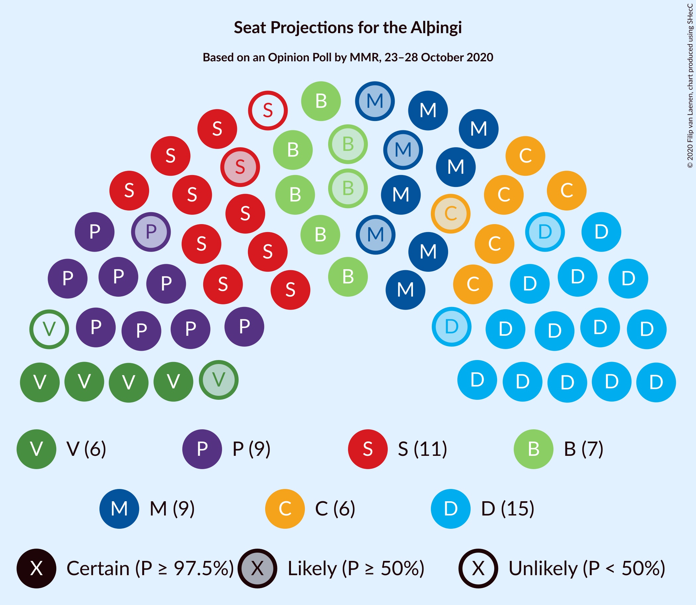
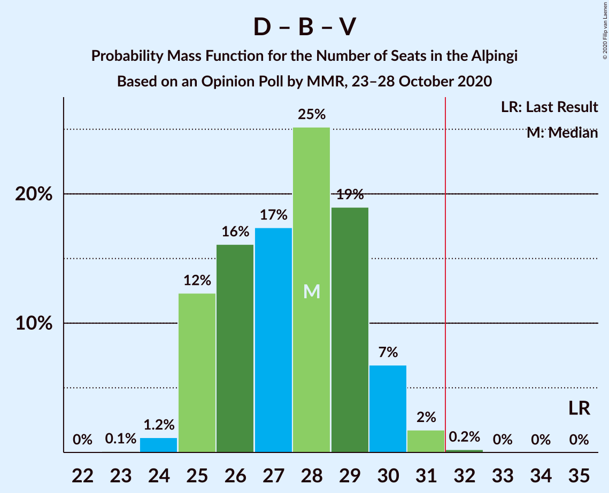

# Opinion Poll by MMR, 23–28 October 2020

<a href="#voting-intentions">Voting Intentions</a> | <a href="#seats">Seats</a> | <a href="#coalitions">Coalitions</a> | <a href="#technical-information">Technical Information</a>

## Voting Intentions

### Confidence Intervals

| Party | Last Result | Poll Result | 80% Confidence Interval | 90% Confidence Interval | 95% Confidence Interval | 99% Confidence Interval |
|:-----:|:-----------:|:-----------:|:-----------------------:|:-----------------------:|:-----------------------:|:-----------------------:|
| Sjálfstæðisflokkurinn | 25.2% | 21.9% | 20.2–23.7% |19.7–24.2% |19.3–24.6% |18.6–25.5% |
| Samfylkingin | 12.1% | 15.2% | 13.8–16.8% |13.4–17.3% |13.1–17.7% |12.4–18.5% |
| Píratar | 9.2% | 13.5% | 12.2–15.0% |11.8–15.5% |11.5–15.9% |10.9–16.6% |
| Miðflokkurinn | 10.9% | 11.6% | 10.3–13.0% |10.0–13.4% |9.7–13.8% |9.1–14.5% |
| Framsóknarflokkurinn | 10.7% | 10.2% | 9.0–11.6% |8.7–11.9% |8.4–12.3% |7.9–13.0% |
| Viðreisn | 6.7% | 9.6% | 8.5–11.0% |8.2–11.4% |7.9–11.7% |7.4–12.4% |
| Vinstrihreyfingin – grænt framboð | 16.9% | 8.3% | 7.2–9.5% |6.9–9.9% |6.6–10.2% |6.2–10.8% |
| Sósíalistaflokkur Íslands | 0.0% | 4.6% | 3.8–5.6% |3.6–5.9% |3.4–6.2% |3.1–6.7% |
| Flokkur fólksins | 6.9% | 3.8% | 3.1–4.7% |2.9–4.9% |2.7–5.2% |2.4–5.7% |

*Note:* The poll result column reflects the actual value used in the calculations. Published results may vary slightly, and in addition be rounded to fewer digits.

## Seats

### Confidence Intervals

| Party | Last Result | Median | 80% Confidence Interval | 90% Confidence Interval | 95% Confidence Interval | 99% Confidence Interval |
|:-----:|:-----------:|:------:|:-----------------------:|:-----------------------:|:-----------------------:|:-----------------------:|
| <a href="#sjálfstæðisflokkurinn">Sjálfstæðisflokkurinn</a> | 16 | 15 | 14–17 |13–17 |13–17 |13–18 |
| <a href="#samfylkingin">Samfylkingin</a> | 7 | 10 | 9–12 |9–12 |9–12 |8–13 |
| <a href="#píratar">Píratar</a> | 6 | 9 | 8–10 |8–11 |8–11 |7–11 |
| <a href="#miðflokkurinn">Miðflokkurinn</a> | 7 | 9 | 7–9 |7–10 |6–10 |6–10 |
| <a href="#framsóknarflokkurinn">Framsóknarflokkurinn</a> | 8 | 7 | 6–8 |6–8 |5–9 |5–10 |
| <a href="#viðreisn">Viðreisn</a> | 4 | 6 | 6–7 |5–8 |5–8 |5–8 |
| <a href="#vinstrihreyfingin-–-grænt-framboð">Vinstrihreyfingin – grænt framboð</a> | 11 | 5 | 5–6 |4–7 |4–7 |4–7 |
| <a href="#sósíalistaflokkur-íslands">Sósíalistaflokkur Íslands</a> | 0 | 0 | 0–3 |0–4 |0–4 |0–4 |
| <a href="#flokkur-fólksins">Flokkur fólksins</a> | 4 | 0 | 0 |0 |0–3 |0–3 |

### Sjálfstæðisflokkurinn

*For a full overview of the results for this party, see the [Sjálfstæðisflokkurinn](party-sjálfstæðisflokkurinn.html) page.*

| Number of Seats | Probability | Accumulated | Special Marks |
|:---------------:|:-----------:|:-----------:|:-------------:|
| 12 | 0.2% | 100% |  |
| 13 | 5% | 99.8% |  |
| 14 | 22% | 94% |  |
| 15 | 37% | 72% | Median |
| 16 | 23% | 35% | Last Result |
| 17 | 10% | 12% |  |
| 18 | 2% | 2% |  |
| 19 | 0.1% | 0.1% |  |
| 20 | 0% | 0% |  |

### Samfylkingin

*For a full overview of the results for this party, see the [Samfylkingin](party-samfylkingin.html) page.*

| Number of Seats | Probability | Accumulated | Special Marks |
|:---------------:|:-----------:|:-----------:|:-------------:|
| 7 | 0.1% | 100% | Last Result |
| 8 | 2% | 99.9% |  |
| 9 | 12% | 98% |  |
| 10 | 40% | 86% | Median |
| 11 | 36% | 47% |  |
| 12 | 9% | 11% |  |
| 13 | 2% | 2% |  |
| 14 | 0% | 0% |  |

### Píratar

*For a full overview of the results for this party, see the [Píratar](party-píratar.html) page.*

| Number of Seats | Probability | Accumulated | Special Marks |
|:---------------:|:-----------:|:-----------:|:-------------:|
| 6 | 0% | 100% | Last Result |
| 7 | 2% | 100% |  |
| 8 | 20% | 98% |  |
| 9 | 43% | 78% | Median |
| 10 | 28% | 34% |  |
| 11 | 6% | 7% |  |
| 12 | 0.4% | 0.4% |  |
| 13 | 0% | 0% |  |

### Miðflokkurinn

*For a full overview of the results for this party, see the [Miðflokkurinn](party-miðflokkurinn.html) page.*

| Number of Seats | Probability | Accumulated | Special Marks |
|:---------------:|:-----------:|:-----------:|:-------------:|
| 5 | 0.1% | 100% |  |
| 6 | 5% | 99.9% |  |
| 7 | 19% | 95% | Last Result |
| 8 | 16% | 76% |  |
| 9 | 53% | 60% | Median |
| 10 | 7% | 7% |  |
| 11 | 0.1% | 0.1% |  |
| 12 | 0% | 0% |  |

### Framsóknarflokkurinn

*For a full overview of the results for this party, see the [Framsóknarflokkurinn](party-framsóknarflokkurinn.html) page.*

| Number of Seats | Probability | Accumulated | Special Marks |
|:---------------:|:-----------:|:-----------:|:-------------:|
| 5 | 5% | 100% |  |
| 6 | 31% | 95% |  |
| 7 | 43% | 64% | Median |
| 8 | 18% | 21% | Last Result |
| 9 | 2% | 3% |  |
| 10 | 0.8% | 0.9% |  |
| 11 | 0% | 0% |  |

### Viðreisn

*For a full overview of the results for this party, see the [Viðreisn](party-viðreisn.html) page.*

| Number of Seats | Probability | Accumulated | Special Marks |
|:---------------:|:-----------:|:-----------:|:-------------:|
| 4 | 0.1% | 100% | Last Result |
| 5 | 10% | 99.9% |  |
| 6 | 49% | 90% | Median |
| 7 | 34% | 41% |  |
| 8 | 7% | 7% |  |
| 9 | 0.2% | 0.3% |  |
| 10 | 0% | 0% |  |

### Vinstrihreyfingin – grænt framboð

*For a full overview of the results for this party, see the [Vinstrihreyfingin – grænt framboð](party-vinstrihreyfingin–græntframboð.html) page.*

| Number of Seats | Probability | Accumulated | Special Marks |
|:---------------:|:-----------:|:-----------:|:-------------:|
| 3 | 0.1% | 100% |  |
| 4 | 7% | 99.9% |  |
| 5 | 47% | 93% | Median |
| 6 | 37% | 45% |  |
| 7 | 8% | 8% |  |
| 8 | 0.2% | 0.2% |  |
| 9 | 0% | 0% |  |
| 10 | 0% | 0% |  |
| 11 | 0% | 0% | Last Result |

### Sósíalistaflokkur Íslands

*For a full overview of the results for this party, see the [Sósíalistaflokkur Íslands](party-sósíalistaflokkuríslands.html) page.*

| Number of Seats | Probability | Accumulated | Special Marks |
|:---------------:|:-----------:|:-----------:|:-------------:|
| 0 | 67% | 100% | Last Result, Median |
| 1 | 0.2% | 33% |  |
| 2 | 0% | 33% |  |
| 3 | 27% | 33% |  |
| 4 | 5% | 6% |  |
| 5 | 0.1% | 0.1% |  |
| 6 | 0% | 0% |  |

### Flokkur fólksins

*For a full overview of the results for this party, see the [Flokkur fólksins](party-flokkurfólksins.html) page.*

| Number of Seats | Probability | Accumulated | Special Marks |
|:---------------:|:-----------:|:-----------:|:-------------:|
| 0 | 97% | 100% | Median |
| 1 | 0% | 3% |  |
| 2 | 0% | 3% |  |
| 3 | 3% | 3% |  |
| 4 | 0.3% | 0.3% | Last Result |
| 5 | 0% | 0% |  |

## Coalitions

### Confidence Intervals

| Coalition | Last Result | Median | Majority? | 80% Confidence Interval | 90% Confidence Interval | 95% Confidence Interval | 99% Confidence Interval |
|:---------:|:-----------:|:------:|:---------:|:-----------------------:|:-----------------------:|:-----------------------:|:-----------------------:|
| Samfylkingin – Miðflokkurinn – Framsóknarflokkurinn – Vinstrihreyfingin – grænt framboð | 33 | 31 | 39% | 29–33 | 29–34 | 28–34 | 27–35 |
| Samfylkingin – Píratar – Viðreisn – Vinstrihreyfingin – grænt framboð | 28 | 31 | 47% | 30–33 | 29–34 | 28–34 | 27–35 |
| Sjálfstæðisflokkurinn – Miðflokkurinn – Framsóknarflokkurinn | 31 | 30 | 25% | 29–32 | 28–33 | 28–33 | 27–34 |
| Sjálfstæðisflokkurinn – Framsóknarflokkurinn – Vinstrihreyfingin – grænt framboð | 35 | 28 | 0.2% | 25–29 | 25–30 | 25–30 | 24–31 |
| Sjálfstæðisflokkurinn – Samfylkingin | 23 | 26 | 0% | 24–27 | 23–28 | 23–28 | 22–29 |
| Samfylkingin – Píratar – Vinstrihreyfingin – grænt framboð | 24 | 25 | 0% | 23–27 | 23–27 | 22–28 | 21–28 |
| Samfylkingin – Miðflokkurinn – Vinstrihreyfingin – grænt framboð | 25 | 24 | 0% | 23–26 | 22–26 | 21–27 | 20–28 |
| Sjálfstæðisflokkurinn – Miðflokkurinn | 23 | 24 | 0% | 22–25 | 21–25 | 21–26 | 20–27 |
| Samfylkingin – Framsóknarflokkurinn – Vinstrihreyfingin – grænt framboð | 26 | 23 | 0% | 21–25 | 21–25 | 20–25 | 19–26 |
| Sjálfstæðisflokkurinn – Framsóknarflokkurinn | 24 | 22 | 0% | 20–24 | 20–24 | 20–25 | 19–26 |
| Sjálfstæðisflokkurinn – Viðreisn | 20 | 22 | 0% | 20–23 | 20–24 | 19–24 | 19–25 |
| Miðflokkurinn – Framsóknarflokkurinn – Vinstrihreyfingin – grænt framboð | 26 | 21 | 0% | 19–22 | 18–23 | 18–23 | 17–24 |
| Sjálfstæðisflokkurinn – Vinstrihreyfingin – grænt framboð | 27 | 21 | 0% | 19–22 | 19–23 | 18–23 | 18–24 |
| Samfylkingin – Vinstrihreyfingin – grænt framboð | 18 | 16 | 0% | 15–17 | 14–18 | 14–18 | 13–19 |
| Píratar – Vinstrihreyfingin – grænt framboð | 17 | 15 | 0% | 13–16 | 13–17 | 12–17 | 12–18 |
| Miðflokkurinn – Vinstrihreyfingin – grænt framboð | 18 | 14 | 0% | 12–15 | 12–16 | 11–16 | 11–17 |
| Framsóknarflokkurinn – Vinstrihreyfingin – grænt framboð | 19 | 13 | 0% | 11–14 | 11–14 | 10–14 | 10–15 |

### Samfylkingin – Miðflokkurinn – Framsóknarflokkurinn – Vinstrihreyfingin – grænt framboð

| Number of Seats | Probability | Accumulated | Special Marks |
|:---------------:|:-----------:|:-----------:|:-------------:|
| 25 | 0.1% | 100% |  |
| 26 | 0.1% | 99.9% |  |
| 27 | 1.0% | 99.8% |  |
| 28 | 4% | 98.8% |  |
| 29 | 8% | 95% |  |
| 30 | 18% | 87% |  |
| 31 | 29% | 69% | Median |
| 32 | 21% | 39% | Majority |
| 33 | 13% | 18% | Last Result |
| 34 | 4% | 5% |  |
| 35 | 0.6% | 0.7% |  |
| 36 | 0% | 0% |  |

### Samfylkingin – Píratar – Viðreisn – Vinstrihreyfingin – grænt framboð

| Number of Seats | Probability | Accumulated | Special Marks |
|:---------------:|:-----------:|:-----------:|:-------------:|
| 26 | 0.1% | 100% |  |
| 27 | 0.5% | 99.9% |  |
| 28 | 3% | 99.4% | Last Result |
| 29 | 6% | 96% |  |
| 30 | 12% | 90% | Median |
| 31 | 31% | 78% |  |
| 32 | 20% | 47% | Majority |
| 33 | 19% | 27% |  |
| 34 | 6% | 8% |  |
| 35 | 1.0% | 1.2% |  |
| 36 | 0.3% | 0.3% |  |
| 37 | 0% | 0% |  |

### Sjálfstæðisflokkurinn – Miðflokkurinn – Framsóknarflokkurinn

| Number of Seats | Probability | Accumulated | Special Marks |
|:---------------:|:-----------:|:-----------:|:-------------:|
| 26 | 0.2% | 100% |  |
| 27 | 2% | 99.7% |  |
| 28 | 6% | 98% |  |
| 29 | 22% | 92% |  |
| 30 | 26% | 71% |  |
| 31 | 20% | 45% | Last Result, Median |
| 32 | 18% | 25% | Majority |
| 33 | 6% | 7% |  |
| 34 | 0.8% | 0.9% |  |
| 35 | 0.1% | 0.1% |  |
| 36 | 0% | 0% |  |

### Sjálfstæðisflokkurinn – Framsóknarflokkurinn – Vinstrihreyfingin – grænt framboð

| Number of Seats | Probability | Accumulated | Special Marks |
|:---------------:|:-----------:|:-----------:|:-------------:|
| 23 | 0.1% | 100% |  |
| 24 | 1.2% | 99.9% |  |
| 25 | 12% | 98.7% |  |
| 26 | 16% | 86% |  |
| 27 | 17% | 70% | Median |
| 28 | 25% | 53% |  |
| 29 | 19% | 28% |  |
| 30 | 7% | 9% |  |
| 31 | 2% | 2% |  |
| 32 | 0.2% | 0.2% | Majority |
| 33 | 0% | 0% |  |
| 34 | 0% | 0% |  |
| 35 | 0% | 0% | Last Result |

### Sjálfstæðisflokkurinn – Samfylkingin

| Number of Seats | Probability | Accumulated | Special Marks |
|:---------------:|:-----------:|:-----------:|:-------------:|
| 21 | 0.1% | 100% |  |
| 22 | 2% | 99.9% |  |
| 23 | 5% | 98% | Last Result |
| 24 | 9% | 94% |  |
| 25 | 32% | 85% | Median |
| 26 | 31% | 53% |  |
| 27 | 12% | 21% |  |
| 28 | 8% | 9% |  |
| 29 | 1.0% | 1.2% |  |
| 30 | 0.1% | 0.1% |  |
| 31 | 0% | 0% |  |

### Samfylkingin – Píratar – Vinstrihreyfingin – grænt framboð

| Number of Seats | Probability | Accumulated | Special Marks |
|:---------------:|:-----------:|:-----------:|:-------------:|
| 20 | 0.1% | 100% |  |
| 21 | 1.0% | 99.9% |  |
| 22 | 3% | 98.9% |  |
| 23 | 11% | 96% |  |
| 24 | 15% | 85% | Last Result, Median |
| 25 | 32% | 70% |  |
| 26 | 23% | 38% |  |
| 27 | 11% | 15% |  |
| 28 | 4% | 4% |  |
| 29 | 0.4% | 0.4% |  |
| 30 | 0.1% | 0.1% |  |
| 31 | 0% | 0% |  |

### Samfylkingin – Miðflokkurinn – Vinstrihreyfingin – grænt framboð

| Number of Seats | Probability | Accumulated | Special Marks |
|:---------------:|:-----------:|:-----------:|:-------------:|
| 19 | 0.1% | 100% |  |
| 20 | 0.5% | 99.9% |  |
| 21 | 3% | 99.4% |  |
| 22 | 6% | 97% |  |
| 23 | 19% | 91% |  |
| 24 | 24% | 72% | Median |
| 25 | 31% | 48% | Last Result |
| 26 | 13% | 17% |  |
| 27 | 4% | 4% |  |
| 28 | 0.6% | 0.7% |  |
| 29 | 0% | 0% |  |

### Sjálfstæðisflokkurinn – Miðflokkurinn

| Number of Seats | Probability | Accumulated | Special Marks |
|:---------------:|:-----------:|:-----------:|:-------------:|
| 19 | 0.1% | 100% |  |
| 20 | 1.4% | 99.8% |  |
| 21 | 4% | 98% |  |
| 22 | 14% | 94% |  |
| 23 | 27% | 80% | Last Result |
| 24 | 29% | 53% | Median |
| 25 | 19% | 23% |  |
| 26 | 4% | 5% |  |
| 27 | 1.2% | 1.3% |  |
| 28 | 0.1% | 0.1% |  |
| 29 | 0% | 0% |  |

### Samfylkingin – Framsóknarflokkurinn – Vinstrihreyfingin – grænt framboð

| Number of Seats | Probability | Accumulated | Special Marks |
|:---------------:|:-----------:|:-----------:|:-------------:|
| 18 | 0.1% | 100% |  |
| 19 | 0.7% | 99.9% |  |
| 20 | 3% | 99.3% |  |
| 21 | 16% | 96% |  |
| 22 | 24% | 80% | Median |
| 23 | 27% | 56% |  |
| 24 | 18% | 29% |  |
| 25 | 9% | 11% |  |
| 26 | 2% | 2% | Last Result |
| 27 | 0.3% | 0.3% |  |
| 28 | 0% | 0% |  |

### Sjálfstæðisflokkurinn – Framsóknarflokkurinn

| Number of Seats | Probability | Accumulated | Special Marks |
|:---------------:|:-----------:|:-----------:|:-------------:|
| 18 | 0.1% | 100% |  |
| 19 | 2% | 99.9% |  |
| 20 | 15% | 98% |  |
| 21 | 20% | 83% |  |
| 22 | 24% | 63% | Median |
| 23 | 24% | 39% |  |
| 24 | 12% | 15% | Last Result |
| 25 | 2% | 3% |  |
| 26 | 0.6% | 0.7% |  |
| 27 | 0% | 0% |  |

### Sjálfstæðisflokkurinn – Viðreisn

| Number of Seats | Probability | Accumulated | Special Marks |
|:---------------:|:-----------:|:-----------:|:-------------:|
| 18 | 0.4% | 100% |  |
| 19 | 3% | 99.5% |  |
| 20 | 22% | 96% | Last Result |
| 21 | 20% | 74% | Median |
| 22 | 31% | 54% |  |
| 23 | 18% | 24% |  |
| 24 | 5% | 6% |  |
| 25 | 1.2% | 1.2% |  |
| 26 | 0% | 0.1% |  |
| 27 | 0% | 0% |  |

### Miðflokkurinn – Framsóknarflokkurinn – Vinstrihreyfingin – grænt framboð

| Number of Seats | Probability | Accumulated | Special Marks |
|:---------------:|:-----------:|:-----------:|:-------------:|
| 16 | 0.1% | 100% |  |
| 17 | 1.4% | 99.8% |  |
| 18 | 4% | 98% |  |
| 19 | 13% | 94% |  |
| 20 | 28% | 81% |  |
| 21 | 20% | 53% | Median |
| 22 | 25% | 33% |  |
| 23 | 7% | 8% |  |
| 24 | 0.7% | 0.9% |  |
| 25 | 0.1% | 0.1% |  |
| 26 | 0% | 0% | Last Result |

### Sjálfstæðisflokkurinn – Vinstrihreyfingin – grænt framboð

| Number of Seats | Probability | Accumulated | Special Marks |
|:---------------:|:-----------:|:-----------:|:-------------:|
| 16 | 0.1% | 100% |  |
| 17 | 0.3% | 99.9% |  |
| 18 | 3% | 99.7% |  |
| 19 | 18% | 97% |  |
| 20 | 27% | 79% | Median |
| 21 | 26% | 52% |  |
| 22 | 18% | 26% |  |
| 23 | 6% | 8% |  |
| 24 | 2% | 2% |  |
| 25 | 0.1% | 0.1% |  |
| 26 | 0% | 0% |  |
| 27 | 0% | 0% | Last Result |

### Samfylkingin – Vinstrihreyfingin – grænt framboð

| Number of Seats | Probability | Accumulated | Special Marks |
|:---------------:|:-----------:|:-----------:|:-------------:|
| 12 | 0.2% | 100% |  |
| 13 | 2% | 99.8% |  |
| 14 | 8% | 98% |  |
| 15 | 24% | 90% | Median |
| 16 | 40% | 66% |  |
| 17 | 16% | 26% |  |
| 18 | 8% | 9% | Last Result |
| 19 | 0.6% | 0.7% |  |
| 20 | 0.1% | 0.1% |  |
| 21 | 0% | 0% |  |

### Píratar – Vinstrihreyfingin – grænt framboð

| Number of Seats | Probability | Accumulated | Special Marks |
|:---------------:|:-----------:|:-----------:|:-------------:|
| 11 | 0.3% | 100% |  |
| 12 | 2% | 99.7% |  |
| 13 | 14% | 97% |  |
| 14 | 30% | 84% | Median |
| 15 | 31% | 53% |  |
| 16 | 16% | 22% |  |
| 17 | 5% | 6% | Last Result |
| 18 | 1.3% | 1.3% |  |
| 19 | 0% | 0% |  |

### Miðflokkurinn – Vinstrihreyfingin – grænt framboð

| Number of Seats | Probability | Accumulated | Special Marks |
|:---------------:|:-----------:|:-----------:|:-------------:|
| 10 | 0.4% | 100% |  |
| 11 | 4% | 99.6% |  |
| 12 | 8% | 95% |  |
| 13 | 23% | 88% |  |
| 14 | 34% | 64% | Median |
| 15 | 23% | 30% |  |
| 16 | 6% | 7% |  |
| 17 | 0.5% | 0.6% |  |
| 18 | 0% | 0% | Last Result |

### Framsóknarflokkurinn – Vinstrihreyfingin – grænt framboð

| Number of Seats | Probability | Accumulated | Special Marks |
|:---------------:|:-----------:|:-----------:|:-------------:|
| 9 | 0.3% | 100% |  |
| 10 | 5% | 99.7% |  |
| 11 | 26% | 95% |  |
| 12 | 19% | 69% | Median |
| 13 | 37% | 51% |  |
| 14 | 12% | 14% |  |
| 15 | 1.3% | 2% |  |
| 16 | 0.3% | 0.4% |  |
| 17 | 0.1% | 0.1% |  |
| 18 | 0% | 0% |  |
| 19 | 0% | 0% | Last Result |

## Technical Information

### Opinion Poll

+ **Polling firm:** MMR
+ **Commissioner(s):** —
+ **Fieldwork period:** 23–28 October 2020

### Calculations

+ **Sample size:** 933
+ **Simulations done:** 1,048,576
+ **Error estimate:** 1.62%

