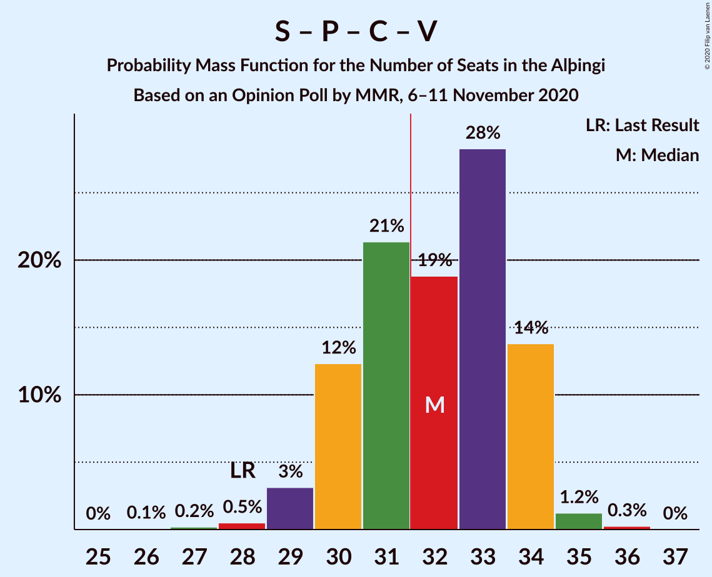

# Opinion Poll by MMR, 6–11 November 2020

<a href="#voting-intentions">Voting Intentions</a> | <a href="#seats">Seats</a> | <a href="#coalitions">Coalitions</a> | <a href="#technical-information">Technical Information</a>

## Voting Intentions

### Confidence Intervals

| Party | Last Result | Poll Result | 80% Confidence Interval | 90% Confidence Interval | 95% Confidence Interval | 99% Confidence Interval |
|:-----:|:-----------:|:-----------:|:-----------------------:|:-----------------------:|:-----------------------:|:-----------------------:|
| Sjálfstæðisflokkurinn | 25.2% | 25.0% | 23.2–26.9% |22.7–27.4% |22.3–27.9% |21.5–28.8% |
| Samfylkingin | 12.1% | 16.8% | 15.3–18.4% |14.8–18.9% |14.5–19.3% |13.8–20.1% |
| Píratar | 9.2% | 14.3% | 12.9–15.8% |12.5–16.3% |12.2–16.7% |11.5–17.5% |
| Framsóknarflokkurinn | 10.7% | 9.9% | 8.8–11.3% |8.5–11.7% |8.2–12.0% |7.7–12.7% |
| Miðflokkurinn | 10.9% | 9.1% | 8.0–10.4% |7.7–10.8% |7.4–11.1% |6.9–11.8% |
| Viðreisn | 6.7% | 8.4% | 7.4–9.7% |7.1–10.1% |6.8–10.4% |6.3–11.1% |
| Vinstrihreyfingin – grænt framboð | 16.9% | 7.5% | 6.5–8.7% |6.2–9.0% |5.9–9.3% |5.5–10.0% |
| Sósíalistaflokkur Íslands | 0.0% | 4.0% | 3.3–5.0% |3.1–5.2% |2.9–5.5% |2.6–6.0% |
| Flokkur fólksins | 6.9% | 3.9% | 3.2–4.8% |3.0–5.1% |2.8–5.3% |2.5–5.8% |

*Note:* The poll result column reflects the actual value used in the calculations. Published results may vary slightly, and in addition be rounded to fewer digits.

## Seats

### Confidence Intervals

| Party | Last Result | Median | 80% Confidence Interval | 90% Confidence Interval | 95% Confidence Interval | 99% Confidence Interval |
|:-----:|:-----------:|:------:|:-----------------------:|:-----------------------:|:-----------------------:|:-----------------------:|
| <a href="#sjálfstæðisflokkurinn">Sjálfstæðisflokkurinn</a> | 16 | 18 | 16–19 |16–20 |16–20 |15–21 |
| <a href="#samfylkingin">Samfylkingin</a> | 7 | 12 | 10–13 |10–13 |10–14 |9–14 |
| <a href="#píratar">Píratar</a> | 6 | 10 | 9–11 |9–11 |8–12 |8–12 |
| <a href="#framsóknarflokkurinn">Framsóknarflokkurinn</a> | 8 | 7 | 6–8 |5–8 |5–9 |5–10 |
| <a href="#miðflokkurinn">Miðflokkurinn</a> | 7 | 6 | 5–7 |5–7 |5–8 |4–9 |
| <a href="#viðreisn">Viðreisn</a> | 4 | 6 | 5–7 |5–7 |4–7 |4–8 |
| <a href="#vinstrihreyfingin-–-grænt-framboð">Vinstrihreyfingin – grænt framboð</a> | 11 | 5 | 4–6 |4–6 |4–6 |3–7 |
| <a href="#sósíalistaflokkur-íslands">Sósíalistaflokkur Íslands</a> | 0 | 0 | 0 |0–3 |0–3 |0–4 |
| <a href="#flokkur-fólksins">Flokkur fólksins</a> | 4 | 0 | 0 |0–3 |0–3 |0–4 |

### Sjálfstæðisflokkurinn

*For a full overview of the results for this party, see the [Sjálfstæðisflokkurinn](party-sjálfstæðisflokkurinn.html) page.*

| Number of Seats | Probability | Accumulated | Special Marks |
|:---------------:|:-----------:|:-----------:|:-------------:|
| 14 | 0.1% | 100% |  |
| 15 | 2% | 99.8% |  |
| 16 | 12% | 98% | Last Result |
| 17 | 28% | 85% |  |
| 18 | 33% | 57% | Median |
| 19 | 15% | 23% |  |
| 20 | 7% | 9% |  |
| 21 | 2% | 2% |  |
| 22 | 0.1% | 0.1% |  |
| 23 | 0% | 0% |  |

### Samfylkingin

*For a full overview of the results for this party, see the [Samfylkingin](party-samfylkingin.html) page.*

| Number of Seats | Probability | Accumulated | Special Marks |
|:---------------:|:-----------:|:-----------:|:-------------:|
| 7 | 0% | 100% | Last Result |
| 8 | 0% | 100% |  |
| 9 | 1.0% | 100% |  |
| 10 | 9% | 99.0% |  |
| 11 | 38% | 90% |  |
| 12 | 29% | 52% | Median |
| 13 | 21% | 23% |  |
| 14 | 2% | 3% |  |
| 15 | 0.1% | 0.2% |  |
| 16 | 0% | 0% |  |

### Píratar

*For a full overview of the results for this party, see the [Píratar](party-píratar.html) page.*

| Number of Seats | Probability | Accumulated | Special Marks |
|:---------------:|:-----------:|:-----------:|:-------------:|
| 6 | 0% | 100% | Last Result |
| 7 | 0.3% | 100% |  |
| 8 | 5% | 99.7% |  |
| 9 | 34% | 95% |  |
| 10 | 42% | 61% | Median |
| 11 | 17% | 19% |  |
| 12 | 2% | 3% |  |
| 13 | 0.2% | 0.2% |  |
| 14 | 0% | 0% |  |

### Framsóknarflokkurinn

*For a full overview of the results for this party, see the [Framsóknarflokkurinn](party-framsóknarflokkurinn.html) page.*

| Number of Seats | Probability | Accumulated | Special Marks |
|:---------------:|:-----------:|:-----------:|:-------------:|
| 4 | 0.1% | 100% |  |
| 5 | 9% | 99.9% |  |
| 6 | 38% | 91% |  |
| 7 | 32% | 53% | Median |
| 8 | 16% | 21% | Last Result |
| 9 | 4% | 5% |  |
| 10 | 0.7% | 0.7% |  |
| 11 | 0% | 0% |  |

### Miðflokkurinn

*For a full overview of the results for this party, see the [Miðflokkurinn](party-miðflokkurinn.html) page.*

| Number of Seats | Probability | Accumulated | Special Marks |
|:---------------:|:-----------:|:-----------:|:-------------:|
| 4 | 0.8% | 100% |  |
| 5 | 16% | 99.1% |  |
| 6 | 57% | 83% | Median |
| 7 | 23% | 26% | Last Result |
| 8 | 2% | 4% |  |
| 9 | 1.4% | 1.5% |  |
| 10 | 0% | 0% |  |

### Viðreisn

*For a full overview of the results for this party, see the [Viðreisn](party-viðreisn.html) page.*

| Number of Seats | Probability | Accumulated | Special Marks |
|:---------------:|:-----------:|:-----------:|:-------------:|
| 4 | 4% | 100% | Last Result |
| 5 | 35% | 96% |  |
| 6 | 51% | 61% | Median |
| 7 | 10% | 11% |  |
| 8 | 0.6% | 0.6% |  |
| 9 | 0% | 0% |  |

### Vinstrihreyfingin – grænt framboð

*For a full overview of the results for this party, see the [Vinstrihreyfingin – grænt framboð](party-vinstrihreyfingin–græntframboð.html) page.*

| Number of Seats | Probability | Accumulated | Special Marks |
|:---------------:|:-----------:|:-----------:|:-------------:|
| 3 | 1.4% | 100% |  |
| 4 | 28% | 98.5% |  |
| 5 | 53% | 71% | Median |
| 6 | 17% | 18% |  |
| 7 | 0.9% | 0.9% |  |
| 8 | 0% | 0% |  |
| 9 | 0% | 0% |  |
| 10 | 0% | 0% |  |
| 11 | 0% | 0% | Last Result |

### Sósíalistaflokkur Íslands

*For a full overview of the results for this party, see the [Sósíalistaflokkur Íslands](party-sósíalistaflokkuríslands.html) page.*

| Number of Seats | Probability | Accumulated | Special Marks |
|:---------------:|:-----------:|:-----------:|:-------------:|
| 0 | 92% | 100% | Last Result, Median |
| 1 | 0.7% | 8% |  |
| 2 | 0% | 7% |  |
| 3 | 7% | 7% |  |
| 4 | 0.5% | 0.5% |  |
| 5 | 0% | 0% |  |

### Flokkur fólksins

*For a full overview of the results for this party, see the [Flokkur fólksins](party-flokkurfólksins.html) page.*

| Number of Seats | Probability | Accumulated | Special Marks |
|:---------------:|:-----------:|:-----------:|:-------------:|
| 0 | 94% | 100% | Median |
| 1 | 0% | 6% |  |
| 2 | 0% | 6% |  |
| 3 | 5% | 6% |  |
| 4 | 0.7% | 0.7% | Last Result |
| 5 | 0% | 0% |  |

## Coalitions

### Confidence Intervals

| Coalition | Last Result | Median | Majority? | 80% Confidence Interval | 90% Confidence Interval | 95% Confidence Interval | 99% Confidence Interval |
|:---------:|:-----------:|:------:|:---------:|:-----------------------:|:-----------------------:|:-----------------------:|:-----------------------:|
| Samfylkingin – Píratar – Viðreisn – Vinstrihreyfingin – grænt framboð | 28 | 32 | 62% | 30–34 | 30–34 | 29–34 | 28–35 |
| Sjálfstæðisflokkurinn – Framsóknarflokkurinn – Miðflokkurinn | 31 | 30 | 27% | 29–32 | 29–33 | 28–33 | 27–34 |
| Samfylkingin – Framsóknarflokkurinn – Miðflokkurinn – Vinstrihreyfingin – grænt framboð | 33 | 29 | 7% | 27–31 | 27–32 | 27–32 | 26–33 |
| Sjálfstæðisflokkurinn – Framsóknarflokkurinn – Vinstrihreyfingin – grænt framboð | 35 | 29 | 6% | 28–31 | 27–32 | 27–32 | 26–33 |
| Sjálfstæðisflokkurinn – Samfylkingin | 23 | 29 | 6% | 28–31 | 27–32 | 27–32 | 26–33 |
| Samfylkingin – Píratar – Vinstrihreyfingin – grænt framboð | 24 | 26 | 0% | 25–28 | 24–28 | 24–29 | 23–29 |
| Sjálfstæðisflokkurinn – Framsóknarflokkurinn | 24 | 24 | 0% | 23–26 | 23–27 | 22–27 | 21–28 |
| Samfylkingin – Framsóknarflokkurinn – Vinstrihreyfingin – grænt framboð | 26 | 23 | 0% | 22–25 | 21–25 | 21–26 | 20–26 |
| Sjálfstæðisflokkurinn – Miðflokkurinn | 23 | 24 | 0% | 22–25 | 22–26 | 21–26 | 21–27 |
| Sjálfstæðisflokkurinn – Viðreisn | 20 | 23 | 0% | 22–25 | 21–26 | 21–26 | 20–27 |
| Samfylkingin – Miðflokkurinn – Vinstrihreyfingin – grænt framboð | 25 | 23 | 0% | 21–24 | 20–25 | 20–25 | 19–26 |
| Sjálfstæðisflokkurinn – Vinstrihreyfingin – grænt framboð | 27 | 23 | 0% | 21–24 | 20–25 | 20–25 | 19–26 |
| Framsóknarflokkurinn – Miðflokkurinn – Vinstrihreyfingin – grænt framboð | 26 | 18 | 0% | 16–19 | 16–20 | 15–20 | 14–21 |
| Samfylkingin – Vinstrihreyfingin – grænt framboð | 18 | 16 | 0% | 15–18 | 15–18 | 14–18 | 14–19 |
| Píratar – Vinstrihreyfingin – grænt framboð | 17 | 15 | 0% | 13–16 | 13–16 | 13–17 | 12–17 |
| Framsóknarflokkurinn – Vinstrihreyfingin – grænt framboð | 19 | 12 | 0% | 10–13 | 10–13 | 10–14 | 9–15 |
| Miðflokkurinn – Vinstrihreyfingin – grænt framboð | 18 | 11 | 0% | 10–12 | 9–13 | 9–13 | 8–14 |

### Samfylkingin – Píratar – Viðreisn – Vinstrihreyfingin – grænt framboð

| Number of Seats | Probability | Accumulated | Special Marks |
|:---------------:|:-----------:|:-----------:|:-------------:|
| 26 | 0.1% | 100% |  |
| 27 | 0.2% | 99.9% |  |
| 28 | 0.5% | 99.7% | Last Result |
| 29 | 3% | 99.2% |  |
| 30 | 12% | 96% |  |
| 31 | 21% | 84% |  |
| 32 | 19% | 62% | Majority |
| 33 | 28% | 44% | Median |
| 34 | 14% | 15% |  |
| 35 | 1.2% | 2% |  |
| 36 | 0.3% | 0.3% |  |
| 37 | 0% | 0% |  |

### Sjálfstæðisflokkurinn – Framsóknarflokkurinn – Miðflokkurinn

| Number of Seats | Probability | Accumulated | Special Marks |
|:---------------:|:-----------:|:-----------:|:-------------:|
| 26 | 0.2% | 100% |  |
| 27 | 0.8% | 99.8% |  |
| 28 | 3% | 99.0% |  |
| 29 | 17% | 96% |  |
| 30 | 32% | 78% |  |
| 31 | 19% | 46% | Last Result, Median |
| 32 | 18% | 27% | Majority |
| 33 | 8% | 9% |  |
| 34 | 1.5% | 2% |  |
| 35 | 0.1% | 0.1% |  |
| 36 | 0% | 0% |  |

### Samfylkingin – Framsóknarflokkurinn – Miðflokkurinn – Vinstrihreyfingin – grænt framboð

| Number of Seats | Probability | Accumulated | Special Marks |
|:---------------:|:-----------:|:-----------:|:-------------:|
| 24 | 0.1% | 100% |  |
| 25 | 0.3% | 99.9% |  |
| 26 | 2% | 99.5% |  |
| 27 | 10% | 98% |  |
| 28 | 12% | 88% |  |
| 29 | 29% | 76% |  |
| 30 | 24% | 46% | Median |
| 31 | 15% | 22% |  |
| 32 | 6% | 7% | Majority |
| 33 | 0.9% | 0.9% | Last Result |
| 34 | 0% | 0% |  |

### Sjálfstæðisflokkurinn – Framsóknarflokkurinn – Vinstrihreyfingin – grænt framboð

| Number of Seats | Probability | Accumulated | Special Marks |
|:---------------:|:-----------:|:-----------:|:-------------:|
| 25 | 0.2% | 100% |  |
| 26 | 2% | 99.7% |  |
| 27 | 6% | 98% |  |
| 28 | 18% | 92% |  |
| 29 | 33% | 74% |  |
| 30 | 22% | 41% | Median |
| 31 | 13% | 19% |  |
| 32 | 5% | 6% | Majority |
| 33 | 1.2% | 1.3% |  |
| 34 | 0% | 0% |  |
| 35 | 0% | 0% | Last Result |

### Sjálfstæðisflokkurinn – Samfylkingin

| Number of Seats | Probability | Accumulated | Special Marks |
|:---------------:|:-----------:|:-----------:|:-------------:|
| 23 | 0% | 100% | Last Result |
| 24 | 0% | 100% |  |
| 25 | 0.5% | 100% |  |
| 26 | 2% | 99.5% |  |
| 27 | 7% | 98% |  |
| 28 | 21% | 91% |  |
| 29 | 23% | 71% |  |
| 30 | 21% | 48% | Median |
| 31 | 21% | 27% |  |
| 32 | 5% | 6% | Majority |
| 33 | 0.5% | 0.6% |  |
| 34 | 0% | 0% |  |

### Samfylkingin – Píratar – Vinstrihreyfingin – grænt framboð

| Number of Seats | Probability | Accumulated | Special Marks |
|:---------------:|:-----------:|:-----------:|:-------------:|
| 21 | 0.1% | 100% |  |
| 22 | 0.3% | 99.9% |  |
| 23 | 1.4% | 99.6% |  |
| 24 | 7% | 98% | Last Result |
| 25 | 20% | 91% |  |
| 26 | 21% | 71% |  |
| 27 | 30% | 50% | Median |
| 28 | 17% | 19% |  |
| 29 | 2% | 3% |  |
| 30 | 0.3% | 0.4% |  |
| 31 | 0.1% | 0.1% |  |
| 32 | 0% | 0% | Majority |

### Sjálfstæðisflokkurinn – Framsóknarflokkurinn

| Number of Seats | Probability | Accumulated | Special Marks |
|:---------------:|:-----------:|:-----------:|:-------------:|
| 20 | 0.1% | 100% |  |
| 21 | 0.8% | 99.9% |  |
| 22 | 4% | 99.1% |  |
| 23 | 18% | 95% |  |
| 24 | 37% | 77% | Last Result |
| 25 | 19% | 40% | Median |
| 26 | 12% | 21% |  |
| 27 | 8% | 9% |  |
| 28 | 1.3% | 1.4% |  |
| 29 | 0.1% | 0.1% |  |
| 30 | 0% | 0% |  |

### Samfylkingin – Framsóknarflokkurinn – Vinstrihreyfingin – grænt framboð

| Number of Seats | Probability | Accumulated | Special Marks |
|:---------------:|:-----------:|:-----------:|:-------------:|
| 19 | 0.2% | 100% |  |
| 20 | 1.2% | 99.8% |  |
| 21 | 8% | 98.6% |  |
| 22 | 15% | 90% |  |
| 23 | 37% | 75% |  |
| 24 | 20% | 38% | Median |
| 25 | 15% | 19% |  |
| 26 | 3% | 3% | Last Result |
| 27 | 0.5% | 0.5% |  |
| 28 | 0% | 0% |  |

### Sjálfstæðisflokkurinn – Miðflokkurinn

| Number of Seats | Probability | Accumulated | Special Marks |
|:---------------:|:-----------:|:-----------:|:-------------:|
| 20 | 0.4% | 100% |  |
| 21 | 3% | 99.6% |  |
| 22 | 11% | 96% |  |
| 23 | 23% | 86% | Last Result |
| 24 | 30% | 62% | Median |
| 25 | 24% | 33% |  |
| 26 | 7% | 9% |  |
| 27 | 2% | 2% |  |
| 28 | 0.1% | 0.1% |  |
| 29 | 0% | 0% |  |

### Sjálfstæðisflokkurinn – Viðreisn

| Number of Seats | Probability | Accumulated | Special Marks |
|:---------------:|:-----------:|:-----------:|:-------------:|
| 19 | 0.1% | 100% |  |
| 20 | 1.2% | 99.8% | Last Result |
| 21 | 6% | 98.7% |  |
| 22 | 15% | 93% |  |
| 23 | 34% | 78% |  |
| 24 | 25% | 44% | Median |
| 25 | 11% | 19% |  |
| 26 | 7% | 8% |  |
| 27 | 1.3% | 1.5% |  |
| 28 | 0.1% | 0.1% |  |
| 29 | 0% | 0% |  |

### Samfylkingin – Miðflokkurinn – Vinstrihreyfingin – grænt framboð

| Number of Seats | Probability | Accumulated | Special Marks |
|:---------------:|:-----------:|:-----------:|:-------------:|
| 18 | 0.1% | 100% |  |
| 19 | 0.7% | 99.8% |  |
| 20 | 5% | 99.1% |  |
| 21 | 13% | 94% |  |
| 22 | 28% | 82% |  |
| 23 | 22% | 54% | Median |
| 24 | 25% | 32% |  |
| 25 | 5% | 7% | Last Result |
| 26 | 1.0% | 1.2% |  |
| 27 | 0.1% | 0.2% |  |
| 28 | 0% | 0% |  |

### Sjálfstæðisflokkurinn – Vinstrihreyfingin – grænt framboð

| Number of Seats | Probability | Accumulated | Special Marks |
|:---------------:|:-----------:|:-----------:|:-------------:|
| 18 | 0.1% | 100% |  |
| 19 | 1.0% | 99.9% |  |
| 20 | 5% | 98.9% |  |
| 21 | 15% | 94% |  |
| 22 | 28% | 80% |  |
| 23 | 25% | 52% | Median |
| 24 | 19% | 27% |  |
| 25 | 6% | 8% |  |
| 26 | 2% | 2% |  |
| 27 | 0.2% | 0.2% | Last Result |
| 28 | 0% | 0% |  |

### Framsóknarflokkurinn – Miðflokkurinn – Vinstrihreyfingin – grænt framboð

| Number of Seats | Probability | Accumulated | Special Marks |
|:---------------:|:-----------:|:-----------:|:-------------:|
| 13 | 0.1% | 100% |  |
| 14 | 0.7% | 99.9% |  |
| 15 | 2% | 99.2% |  |
| 16 | 15% | 97% |  |
| 17 | 23% | 82% |  |
| 18 | 37% | 59% | Median |
| 19 | 13% | 22% |  |
| 20 | 8% | 10% |  |
| 21 | 1.1% | 1.4% |  |
| 22 | 0.4% | 0.4% |  |
| 23 | 0% | 0% |  |
| 24 | 0% | 0% |  |
| 25 | 0% | 0% |  |
| 26 | 0% | 0% | Last Result |

### Samfylkingin – Vinstrihreyfingin – grænt framboð

| Number of Seats | Probability | Accumulated | Special Marks |
|:---------------:|:-----------:|:-----------:|:-------------:|
| 12 | 0% | 100% |  |
| 13 | 0.3% | 99.9% |  |
| 14 | 3% | 99.6% |  |
| 15 | 17% | 97% |  |
| 16 | 31% | 81% |  |
| 17 | 25% | 50% | Median |
| 18 | 23% | 25% | Last Result |
| 19 | 2% | 2% |  |
| 20 | 0.3% | 0.4% |  |
| 21 | 0% | 0% |  |

### Píratar – Vinstrihreyfingin – grænt framboð

| Number of Seats | Probability | Accumulated | Special Marks |
|:---------------:|:-----------:|:-----------:|:-------------:|
| 11 | 0.2% | 100% |  |
| 12 | 2% | 99.8% |  |
| 13 | 14% | 98% |  |
| 14 | 29% | 84% |  |
| 15 | 28% | 55% | Median |
| 16 | 23% | 26% |  |
| 17 | 3% | 3% | Last Result |
| 18 | 0.3% | 0.3% |  |
| 19 | 0% | 0% |  |

### Framsóknarflokkurinn – Vinstrihreyfingin – grænt framboð

| Number of Seats | Probability | Accumulated | Special Marks |
|:---------------:|:-----------:|:-----------:|:-------------:|
| 8 | 0.1% | 100% |  |
| 9 | 2% | 99.9% |  |
| 10 | 14% | 98% |  |
| 11 | 32% | 84% |  |
| 12 | 33% | 52% | Median |
| 13 | 14% | 18% |  |
| 14 | 4% | 5% |  |
| 15 | 0.9% | 0.9% |  |
| 16 | 0% | 0% |  |
| 17 | 0% | 0% |  |
| 18 | 0% | 0% |  |
| 19 | 0% | 0% | Last Result |

### Miðflokkurinn – Vinstrihreyfingin – grænt framboð

| Number of Seats | Probability | Accumulated | Special Marks |
|:---------------:|:-----------:|:-----------:|:-------------:|
| 7 | 0.1% | 100% |  |
| 8 | 0.6% | 99.9% |  |
| 9 | 6% | 99.3% |  |
| 10 | 19% | 94% |  |
| 11 | 47% | 74% | Median |
| 12 | 22% | 28% |  |
| 13 | 5% | 6% |  |
| 14 | 0.6% | 0.8% |  |
| 15 | 0.1% | 0.1% |  |
| 16 | 0% | 0% |  |
| 17 | 0% | 0% |  |
| 18 | 0% | 0% | Last Result |

## Technical Information

### Opinion Poll

+ **Polling firm:** MMR
+ **Commissioner(s):** —
+ **Fieldwork period:** 6–11 November 2020

### Calculations

+ **Sample size:** 925
+ **Simulations done:** 1,048,576
+ **Error estimate:** 1.51%

