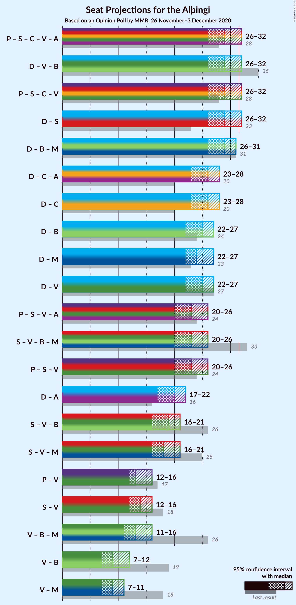
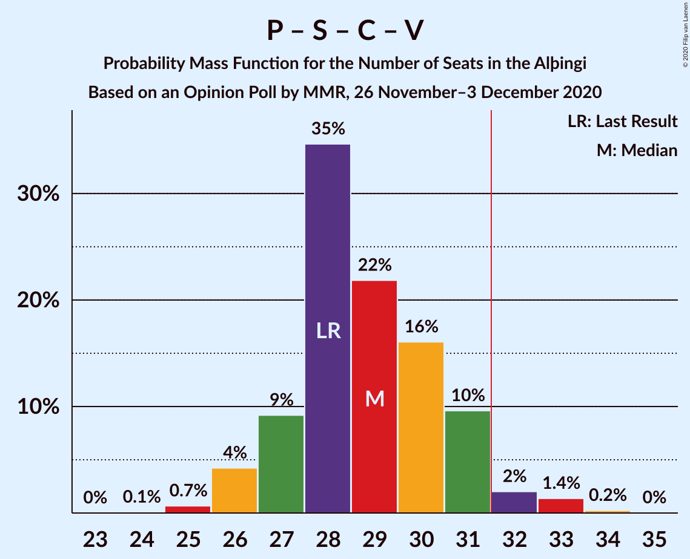

# Opinion Poll by MMR, 26 November–3 December 2020

<a href="#voting-intentions">Voting Intentions</a> | <a href="#seats">Seats</a> | <a href="#coalitions">Coalitions</a> | <a href="#technical-information">Technical Information</a>

## Voting Intentions

### Confidence Intervals

| Party | Last Result | Poll Result | 80% Confidence Interval | 90% Confidence Interval | 95% Confidence Interval | 99% Confidence Interval |
|:-----:|:-----------:|:-----------:|:-----------------------:|:-----------------------:|:-----------------------:|:-----------------------:|
| Sjálfstæðisflokkurinn | 25.2% | 27.1% | 25.3–29.0% |24.8–29.6% |24.4–30.0% |23.5–31.0% |
| Samfylkingin | 12.1% | 13.9% | 12.5–15.4% |12.1–15.9% |11.8–16.2% |11.2–17.0% |
| Píratar | 9.2% | 13.9% | 12.5–15.4% |12.1–15.9% |11.8–16.2% |11.2–17.0% |
| Viðreisn | 6.7% | 9.5% | 8.4–10.9% |8.1–11.2% |7.8–11.6% |7.3–12.2% |
| Vinstrihreyfingin – grænt framboð | 16.9% | 7.6% | 6.6–8.9% |6.3–9.2% |6.1–9.5% |5.7–10.1% |
| Framsóknarflokkurinn | 10.7% | 7.5% | 6.5–8.7% |6.2–9.1% |6.0–9.4% |5.6–10.0% |
| Miðflokkurinn | 10.9% | 7.0% | 6.0–8.2% |5.8–8.5% |5.5–8.8% |5.1–9.4% |
| Flokkur fólksins | 6.9% | 6.2% | 5.3–7.4% |5.1–7.7% |4.9–8.0% |4.5–8.6% |
| Sósíalistaflokkur Íslands | 0.0% | 5.0% | 4.2–6.0% |3.9–6.3% |3.8–6.6% |3.4–7.1% |

*Note:* The poll result column reflects the actual value used in the calculations. Published results may vary slightly, and in addition be rounded to fewer digits.

## Seats

### Confidence Intervals

| Party | Last Result | Median | 80% Confidence Interval | 90% Confidence Interval | 95% Confidence Interval | 99% Confidence Interval |
|:-----:|:-----------:|:------:|:-----------------------:|:-----------------------:|:-----------------------:|:-----------------------:|
| <a href="#sjálfstæðisflokkurinn">Sjálfstæðisflokkurinn</a> | 16 | 20 | 18–22 |18–22 |17–22 |17–23 |
| <a href="#samfylkingin">Samfylkingin</a> | 7 | 10 | 8–10 |8–11 |7–11 |7–12 |
| <a href="#píratar">Píratar</a> | 6 | 9 | 8–10 |8–10 |7–11 |7–11 |
| <a href="#viðreisn">Viðreisn</a> | 4 | 6 | 5–7 |5–7 |5–7 |4–8 |
| <a href="#vinstrihreyfingin-–-grænt-framboð">Vinstrihreyfingin – grænt framboð</a> | 11 | 5 | 4–6 |4–6 |4–6 |3–6 |
| <a href="#framsóknarflokkurinn">Framsóknarflokkurinn</a> | 8 | 5 | 4–6 |4–6 |3–6 |3–7 |
| <a href="#miðflokkurinn">Miðflokkurinn</a> | 7 | 4 | 4–5 |3–5 |3–6 |3–6 |
| <a href="#flokkur-fólksins">Flokkur fólksins</a> | 4 | 4 | 3–5 |1–5 |0–5 |0–5 |
| <a href="#sósíalistaflokkur-íslands">Sósíalistaflokkur Íslands</a> | 0 | 3 | 0–3 |0–4 |0–4 |0–4 |

### Sjálfstæðisflokkurinn

*For a full overview of the results for this party, see the [Sjálfstæðisflokkurinn](party-sjálfstæðisflokkurinn.html) page.*

| Number of Seats | Probability | Accumulated | Special Marks |
|:---------------:|:-----------:|:-----------:|:-------------:|
| 15 | 0.1% | 100% |  |
| 16 | 0.4% | 99.9% | Last Result |
| 17 | 3% | 99.5% |  |
| 18 | 10% | 97% |  |
| 19 | 22% | 87% |  |
| 20 | 28% | 65% | Median |
| 21 | 22% | 37% |  |
| 22 | 14% | 15% |  |
| 23 | 0.6% | 0.8% |  |
| 24 | 0.2% | 0.3% |  |
| 25 | 0% | 0% |  |

### Samfylkingin

*For a full overview of the results for this party, see the [Samfylkingin](party-samfylkingin.html) page.*

| Number of Seats | Probability | Accumulated | Special Marks |
|:---------------:|:-----------:|:-----------:|:-------------:|
| 7 | 4% | 100% | Last Result |
| 8 | 20% | 96% |  |
| 9 | 25% | 76% |  |
| 10 | 46% | 51% | Median |
| 11 | 4% | 5% |  |
| 12 | 0.9% | 1.0% |  |
| 13 | 0% | 0% |  |

### Píratar

*For a full overview of the results for this party, see the [Píratar](party-píratar.html) page.*

| Number of Seats | Probability | Accumulated | Special Marks |
|:---------------:|:-----------:|:-----------:|:-------------:|
| 6 | 0% | 100% | Last Result |
| 7 | 3% | 100% |  |
| 8 | 27% | 97% |  |
| 9 | 47% | 70% | Median |
| 10 | 20% | 24% |  |
| 11 | 3% | 3% |  |
| 12 | 0.3% | 0.4% |  |
| 13 | 0.1% | 0.1% |  |
| 14 | 0% | 0% |  |

### Viðreisn

*For a full overview of the results for this party, see the [Viðreisn](party-viðreisn.html) page.*

| Number of Seats | Probability | Accumulated | Special Marks |
|:---------------:|:-----------:|:-----------:|:-------------:|
| 4 | 1.0% | 100% | Last Result |
| 5 | 31% | 99.0% |  |
| 6 | 48% | 68% | Median |
| 7 | 18% | 20% |  |
| 8 | 2% | 2% |  |
| 9 | 0% | 0% |  |

### Vinstrihreyfingin – grænt framboð

*For a full overview of the results for this party, see the [Vinstrihreyfingin – grænt framboð](party-vinstrihreyfingin–græntframboð.html) page.*

| Number of Seats | Probability | Accumulated | Special Marks |
|:---------------:|:-----------:|:-----------:|:-------------:|
| 3 | 2% | 100% |  |
| 4 | 42% | 98% |  |
| 5 | 45% | 56% | Median |
| 6 | 10% | 11% |  |
| 7 | 0.4% | 0.4% |  |
| 8 | 0% | 0% |  |
| 9 | 0% | 0% |  |
| 10 | 0% | 0% |  |
| 11 | 0% | 0% | Last Result |

### Framsóknarflokkurinn

*For a full overview of the results for this party, see the [Framsóknarflokkurinn](party-framsóknarflokkurinn.html) page.*

| Number of Seats | Probability | Accumulated | Special Marks |
|:---------------:|:-----------:|:-----------:|:-------------:|
| 3 | 4% | 100% |  |
| 4 | 37% | 96% |  |
| 5 | 48% | 59% | Median |
| 6 | 9% | 11% |  |
| 7 | 0.9% | 1.2% |  |
| 8 | 0.3% | 0.3% | Last Result |
| 9 | 0% | 0% |  |

### Miðflokkurinn

*For a full overview of the results for this party, see the [Miðflokkurinn](party-miðflokkurinn.html) page.*

| Number of Seats | Probability | Accumulated | Special Marks |
|:---------------:|:-----------:|:-----------:|:-------------:|
| 1 | 0.2% | 100% |  |
| 2 | 0.1% | 99.8% |  |
| 3 | 9% | 99.7% |  |
| 4 | 61% | 91% | Median |
| 5 | 27% | 30% |  |
| 6 | 3% | 3% |  |
| 7 | 0.1% | 0.1% | Last Result |
| 8 | 0% | 0% |  |

### Flokkur fólksins

*For a full overview of the results for this party, see the [Flokkur fólksins](party-flokkurfólksins.html) page.*

| Number of Seats | Probability | Accumulated | Special Marks |
|:---------------:|:-----------:|:-----------:|:-------------:|
| 0 | 5% | 100% |  |
| 1 | 0.9% | 95% |  |
| 2 | 0% | 94% |  |
| 3 | 33% | 94% |  |
| 4 | 51% | 61% | Last Result, Median |
| 5 | 10% | 10% |  |
| 6 | 0.4% | 0.4% |  |
| 7 | 0% | 0% |  |

### Sósíalistaflokkur Íslands

*For a full overview of the results for this party, see the [Sósíalistaflokkur Íslands](party-sósíalistaflokkuríslands.html) page.*

| Number of Seats | Probability | Accumulated | Special Marks |
|:---------------:|:-----------:|:-----------:|:-------------:|
| 0 | 45% | 100% | Last Result |
| 1 | 0.4% | 55% |  |
| 2 | 0% | 55% |  |
| 3 | 45% | 55% | Median |
| 4 | 9% | 9% |  |
| 5 | 0.2% | 0.2% |  |
| 6 | 0% | 0% |  |

## Coalitions

### Confidence Intervals

| Coalition | Last Result | Median | Majority? | 80% Confidence Interval | 90% Confidence Interval | 95% Confidence Interval | 99% Confidence Interval |
|:---------:|:-----------:|:------:|:---------:|:-----------------------:|:-----------------------:|:-----------------------:|:-----------------------:|
| Sjálfstæðisflokkurinn – Vinstrihreyfingin – grænt framboð – Framsóknarflokkurinn | 35 | 29 | 4% | 28–31 | 27–31 | 26–32 | 26–33 |
| Píratar – Samfylkingin – Viðreisn – Vinstrihreyfingin – grænt framboð | 28 | 29 | 4% | 27–31 | 27–31 | 26–32 | 25–33 |
| Sjálfstæðisflokkurinn – Samfylkingin | 23 | 29 | 5% | 27–31 | 27–31 | 26–32 | 26–33 |
| Sjálfstæðisflokkurinn – Framsóknarflokkurinn – Miðflokkurinn | 31 | 29 | 2% | 27–31 | 27–31 | 26–31 | 25–32 |
| Sjálfstæðisflokkurinn – Viðreisn | 20 | 26 | 0% | 24–28 | 24–28 | 23–28 | 22–29 |
| Sjálfstæðisflokkurinn – Framsóknarflokkurinn | 24 | 25 | 0% | 23–26 | 23–27 | 22–27 | 21–28 |
| Sjálfstæðisflokkurinn – Miðflokkurinn | 23 | 24 | 0% | 23–26 | 22–26 | 22–27 | 21–28 |
| Sjálfstæðisflokkurinn – Vinstrihreyfingin – grænt framboð | 27 | 25 | 0% | 23–26 | 22–27 | 22–27 | 21–28 |
| Samfylkingin – Vinstrihreyfingin – grænt framboð – Framsóknarflokkurinn – Miðflokkurinn | 33 | 23 | 0% | 21–25 | 20–25 | 20–26 | 19–27 |
| Píratar – Samfylkingin – Vinstrihreyfingin – grænt framboð | 24 | 23 | 0% | 21–24 | 21–25 | 20–26 | 20–27 |
| Samfylkingin – Vinstrihreyfingin – grænt framboð – Framsóknarflokkurinn | 26 | 19 | 0% | 17–20 | 16–21 | 16–21 | 15–22 |
| Samfylkingin – Vinstrihreyfingin – grænt framboð – Miðflokkurinn | 25 | 18 | 0% | 17–20 | 16–20 | 16–21 | 15–22 |
| Píratar – Vinstrihreyfingin – grænt framboð | 17 | 13 | 0% | 12–15 | 12–15 | 12–16 | 11–17 |
| Samfylkingin – Vinstrihreyfingin – grænt framboð | 18 | 14 | 0% | 13–15 | 12–16 | 12–16 | 11–17 |
| Vinstrihreyfingin – grænt framboð – Framsóknarflokkurinn – Miðflokkurinn | 26 | 13 | 0% | 12–15 | 12–16 | 11–16 | 11–17 |
| Vinstrihreyfingin – grænt framboð – Framsóknarflokkurinn | 19 | 9 | 0% | 8–11 | 8–11 | 7–12 | 7–12 |
| Vinstrihreyfingin – grænt framboð – Miðflokkurinn | 18 | 9 | 0% | 8–10 | 8–11 | 7–11 | 7–11 |

### Sjálfstæðisflokkurinn – Vinstrihreyfingin – grænt framboð – Framsóknarflokkurinn

| Number of Seats | Probability | Accumulated | Special Marks |
|:---------------:|:-----------:|:-----------:|:-------------:|
| 24 | 0.1% | 100% |  |
| 25 | 0.4% | 99.9% |  |
| 26 | 3% | 99.5% |  |
| 27 | 4% | 97% |  |
| 28 | 17% | 93% |  |
| 29 | 32% | 76% |  |
| 30 | 24% | 43% | Median |
| 31 | 15% | 20% |  |
| 32 | 4% | 4% | Majority |
| 33 | 0.7% | 0.8% |  |
| 34 | 0.1% | 0.1% |  |
| 35 | 0% | 0% | Last Result |

### Píratar – Samfylkingin – Viðreisn – Vinstrihreyfingin – grænt framboð

| Number of Seats | Probability | Accumulated | Special Marks |
|:---------------:|:-----------:|:-----------:|:-------------:|
| 24 | 0.1% | 100% |  |
| 25 | 0.7% | 99.9% |  |
| 26 | 4% | 99.2% |  |
| 27 | 9% | 95% |  |
| 28 | 35% | 86% | Last Result |
| 29 | 22% | 51% |  |
| 30 | 16% | 29% | Median |
| 31 | 10% | 13% |  |
| 32 | 2% | 4% | Majority |
| 33 | 1.4% | 2% |  |
| 34 | 0.2% | 0.3% |  |
| 35 | 0% | 0% |  |

### Sjálfstæðisflokkurinn – Samfylkingin

| Number of Seats | Probability | Accumulated | Special Marks |
|:---------------:|:-----------:|:-----------:|:-------------:|
| 23 | 0% | 100% | Last Result |
| 24 | 0% | 100% |  |
| 25 | 0.4% | 100% |  |
| 26 | 3% | 99.6% |  |
| 27 | 9% | 97% |  |
| 28 | 22% | 88% |  |
| 29 | 16% | 66% |  |
| 30 | 25% | 50% | Median |
| 31 | 20% | 25% |  |
| 32 | 4% | 5% | Majority |
| 33 | 0.6% | 0.7% |  |
| 34 | 0.1% | 0.1% |  |
| 35 | 0% | 0% |  |

### Sjálfstæðisflokkurinn – Framsóknarflokkurinn – Miðflokkurinn

| Number of Seats | Probability | Accumulated | Special Marks |
|:---------------:|:-----------:|:-----------:|:-------------:|
| 24 | 0.1% | 100% |  |
| 25 | 1.0% | 99.9% |  |
| 26 | 2% | 98.9% |  |
| 27 | 8% | 97% |  |
| 28 | 28% | 89% |  |
| 29 | 30% | 61% | Median |
| 30 | 19% | 31% |  |
| 31 | 10% | 12% | Last Result |
| 32 | 2% | 2% | Majority |
| 33 | 0.3% | 0.3% |  |
| 34 | 0% | 0% |  |

### Sjálfstæðisflokkurinn – Viðreisn

| Number of Seats | Probability | Accumulated | Special Marks |
|:---------------:|:-----------:|:-----------:|:-------------:|
| 20 | 0% | 100% | Last Result |
| 21 | 0.1% | 100% |  |
| 22 | 1.1% | 99.9% |  |
| 23 | 4% | 98.8% |  |
| 24 | 9% | 95% |  |
| 25 | 29% | 86% |  |
| 26 | 23% | 57% | Median |
| 27 | 17% | 34% |  |
| 28 | 15% | 17% |  |
| 29 | 2% | 2% |  |
| 30 | 0.2% | 0.3% |  |
| 31 | 0% | 0% |  |

### Sjálfstæðisflokkurinn – Framsóknarflokkurinn

| Number of Seats | Probability | Accumulated | Special Marks |
|:---------------:|:-----------:|:-----------:|:-------------:|
| 20 | 0.1% | 100% |  |
| 21 | 1.4% | 99.8% |  |
| 22 | 3% | 98% |  |
| 23 | 11% | 95% |  |
| 24 | 24% | 85% | Last Result |
| 25 | 40% | 61% | Median |
| 26 | 12% | 20% |  |
| 27 | 8% | 9% |  |
| 28 | 0.6% | 0.7% |  |
| 29 | 0.1% | 0.1% |  |
| 30 | 0% | 0% |  |

### Sjálfstæðisflokkurinn – Miðflokkurinn

| Number of Seats | Probability | Accumulated | Special Marks |
|:---------------:|:-----------:|:-----------:|:-------------:|
| 19 | 0.1% | 100% |  |
| 20 | 0.3% | 99.9% |  |
| 21 | 2% | 99.6% |  |
| 22 | 7% | 98% |  |
| 23 | 22% | 91% | Last Result |
| 24 | 29% | 69% | Median |
| 25 | 19% | 41% |  |
| 26 | 19% | 21% |  |
| 27 | 2% | 3% |  |
| 28 | 0.5% | 0.5% |  |
| 29 | 0.1% | 0.1% |  |
| 30 | 0% | 0% |  |

### Sjálfstæðisflokkurinn – Vinstrihreyfingin – grænt framboð

| Number of Seats | Probability | Accumulated | Special Marks |
|:---------------:|:-----------:|:-----------:|:-------------:|
| 20 | 0.2% | 100% |  |
| 21 | 1.2% | 99.8% |  |
| 22 | 4% | 98.6% |  |
| 23 | 16% | 95% |  |
| 24 | 25% | 78% |  |
| 25 | 22% | 53% | Median |
| 26 | 21% | 31% |  |
| 27 | 8% | 9% | Last Result |
| 28 | 1.2% | 1.3% |  |
| 29 | 0.1% | 0.1% |  |
| 30 | 0% | 0% |  |

### Samfylkingin – Vinstrihreyfingin – grænt framboð – Framsóknarflokkurinn – Miðflokkurinn

| Number of Seats | Probability | Accumulated | Special Marks |
|:---------------:|:-----------:|:-----------:|:-------------:|
| 18 | 0.1% | 100% |  |
| 19 | 2% | 99.9% |  |
| 20 | 5% | 98% |  |
| 21 | 11% | 94% |  |
| 22 | 23% | 83% |  |
| 23 | 31% | 60% |  |
| 24 | 14% | 29% | Median |
| 25 | 10% | 15% |  |
| 26 | 4% | 5% |  |
| 27 | 1.0% | 1.1% |  |
| 28 | 0.1% | 0.1% |  |
| 29 | 0% | 0% |  |
| 30 | 0% | 0% |  |
| 31 | 0% | 0% |  |
| 32 | 0% | 0% | Majority |
| 33 | 0% | 0% | Last Result |

### Píratar – Samfylkingin – Vinstrihreyfingin – grænt framboð

| Number of Seats | Probability | Accumulated | Special Marks |
|:---------------:|:-----------:|:-----------:|:-------------:|
| 19 | 0.3% | 100% |  |
| 20 | 3% | 99.7% |  |
| 21 | 9% | 96% |  |
| 22 | 22% | 87% |  |
| 23 | 38% | 65% |  |
| 24 | 18% | 28% | Last Result, Median |
| 25 | 7% | 10% |  |
| 26 | 2% | 3% |  |
| 27 | 0.7% | 0.9% |  |
| 28 | 0.1% | 0.1% |  |
| 29 | 0% | 0% |  |

### Samfylkingin – Vinstrihreyfingin – grænt framboð – Framsóknarflokkurinn

| Number of Seats | Probability | Accumulated | Special Marks |
|:---------------:|:-----------:|:-----------:|:-------------:|
| 14 | 0% | 100% |  |
| 15 | 2% | 99.9% |  |
| 16 | 4% | 98% |  |
| 17 | 14% | 94% |  |
| 18 | 23% | 81% |  |
| 19 | 35% | 57% |  |
| 20 | 15% | 23% | Median |
| 21 | 6% | 8% |  |
| 22 | 1.4% | 2% |  |
| 23 | 0.2% | 0.2% |  |
| 24 | 0% | 0% |  |
| 25 | 0% | 0% |  |
| 26 | 0% | 0% | Last Result |

### Samfylkingin – Vinstrihreyfingin – grænt framboð – Miðflokkurinn

| Number of Seats | Probability | Accumulated | Special Marks |
|:---------------:|:-----------:|:-----------:|:-------------:|
| 14 | 0.1% | 100% |  |
| 15 | 2% | 99.9% |  |
| 16 | 7% | 98% |  |
| 17 | 19% | 91% |  |
| 18 | 36% | 72% |  |
| 19 | 18% | 36% | Median |
| 20 | 14% | 17% |  |
| 21 | 3% | 3% |  |
| 22 | 0.8% | 0.8% |  |
| 23 | 0.1% | 0.1% |  |
| 24 | 0% | 0% |  |
| 25 | 0% | 0% | Last Result |

### Píratar – Vinstrihreyfingin – grænt framboð

| Number of Seats | Probability | Accumulated | Special Marks |
|:---------------:|:-----------:|:-----------:|:-------------:|
| 11 | 1.2% | 100% |  |
| 12 | 11% | 98.7% |  |
| 13 | 39% | 88% |  |
| 14 | 30% | 49% | Median |
| 15 | 15% | 19% |  |
| 16 | 3% | 4% |  |
| 17 | 1.0% | 1.1% | Last Result |
| 18 | 0.1% | 0.1% |  |
| 19 | 0% | 0% |  |

### Samfylkingin – Vinstrihreyfingin – grænt framboð

| Number of Seats | Probability | Accumulated | Special Marks |
|:---------------:|:-----------:|:-----------:|:-------------:|
| 10 | 0.1% | 100% |  |
| 11 | 1.5% | 99.9% |  |
| 12 | 8% | 98% |  |
| 13 | 24% | 90% |  |
| 14 | 33% | 66% |  |
| 15 | 26% | 33% | Median |
| 16 | 5% | 7% |  |
| 17 | 1.2% | 1.3% |  |
| 18 | 0.1% | 0.1% | Last Result |
| 19 | 0% | 0% |  |

### Vinstrihreyfingin – grænt framboð – Framsóknarflokkurinn – Miðflokkurinn

| Number of Seats | Probability | Accumulated | Special Marks |
|:---------------:|:-----------:|:-----------:|:-------------:|
| 10 | 0.3% | 100% |  |
| 11 | 3% | 99.6% |  |
| 12 | 14% | 96% |  |
| 13 | 40% | 82% |  |
| 14 | 17% | 43% | Median |
| 15 | 17% | 25% |  |
| 16 | 7% | 8% |  |
| 17 | 1.1% | 1.3% |  |
| 18 | 0.2% | 0.2% |  |
| 19 | 0% | 0% |  |
| 20 | 0% | 0% |  |
| 21 | 0% | 0% |  |
| 22 | 0% | 0% |  |
| 23 | 0% | 0% |  |
| 24 | 0% | 0% |  |
| 25 | 0% | 0% |  |
| 26 | 0% | 0% | Last Result |

### Vinstrihreyfingin – grænt framboð – Framsóknarflokkurinn

| Number of Seats | Probability | Accumulated | Special Marks |
|:---------------:|:-----------:|:-----------:|:-------------:|
| 6 | 0.1% | 100% |  |
| 7 | 3% | 99.9% |  |
| 8 | 14% | 97% |  |
| 9 | 45% | 83% |  |
| 10 | 24% | 37% | Median |
| 11 | 11% | 13% |  |
| 12 | 2% | 3% |  |
| 13 | 0.2% | 0.3% |  |
| 14 | 0% | 0% |  |
| 15 | 0% | 0% |  |
| 16 | 0% | 0% |  |
| 17 | 0% | 0% |  |
| 18 | 0% | 0% |  |
| 19 | 0% | 0% | Last Result |

### Vinstrihreyfingin – grænt framboð – Miðflokkurinn

| Number of Seats | Probability | Accumulated | Special Marks |
|:---------------:|:-----------:|:-----------:|:-------------:|
| 6 | 0.3% | 100% |  |
| 7 | 3% | 99.6% |  |
| 8 | 38% | 96% |  |
| 9 | 32% | 59% | Median |
| 10 | 21% | 27% |  |
| 11 | 6% | 6% |  |
| 12 | 0.5% | 0.5% |  |
| 13 | 0% | 0% |  |
| 14 | 0% | 0% |  |
| 15 | 0% | 0% |  |
| 16 | 0% | 0% |  |
| 17 | 0% | 0% |  |
| 18 | 0% | 0% | Last Result |

## Technical Information

### Opinion Poll

+ **Polling firm:** MMR
+ **Commissioner(s):** —
+ **Fieldwork period:** 26 November–3 December 2020

### Calculations

+ **Sample size:** 944
+ **Simulations done:** 1,048,576
+ **Error estimate:** 1.34%

