# Opinion Poll by Zenter, 11–19 December 2020

<a href="#voting-intentions">Voting Intentions</a> | <a href="#seats">Seats</a> | <a href="#coalitions">Coalitions</a> | <a href="#technical-information">Technical Information</a>

## Voting Intentions

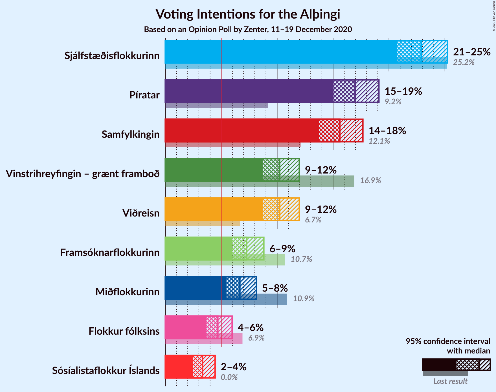

### Confidence Intervals

| Party | Last Result | Poll Result | 80% Confidence Interval | 90% Confidence Interval | 95% Confidence Interval | 99% Confidence Interval |
|:-----:|:-----------:|:-----------:|:-----------------------:|:-----------------------:|:-----------------------:|:-----------------------:|
| Sjálfstæðisflokkurinn | 25.2% | 22.9% | 21.4–24.4% |21.0–24.8% |20.7–25.2% |20.0–26.0% |
| Píratar | 9.2% | 17.0% | 15.7–18.4% |15.3–18.7% |15.0–19.1% |14.4–19.8% |
| Samfylkingin | 12.1% | 15.6% | 14.4–16.9% |14.0–17.3% |13.7–17.7% |13.2–18.3% |
| Vinstrihreyfingin – grænt framboð | 16.9% | 10.2% | 9.2–11.4% |8.9–11.7% |8.7–12.0% |8.2–12.5% |
| Viðreisn | 6.7% | 10.2% | 9.2–11.4% |8.9–11.7% |8.7–12.0% |8.2–12.5% |
| Framsóknarflokkurinn | 10.7% | 7.3% | 6.4–8.3% |6.2–8.6% |6.0–8.8% |5.6–9.3% |
| Miðflokkurinn | 10.9% | 6.7% | 5.9–7.6% |5.6–7.9% |5.4–8.1% |5.1–8.6% |
| Flokkur fólksins | 6.9% | 4.7% | 4.0–5.5% |3.8–5.8% |3.7–6.0% |3.4–6.4% |
| Sósíalistaflokkur Íslands | 0.0% | 3.3% | 2.8–4.1% |2.6–4.3% |2.5–4.5% |2.3–4.8% |

*Note:* The poll result column reflects the actual value used in the calculations. Published results may vary slightly, and in addition be rounded to fewer digits.

## Seats

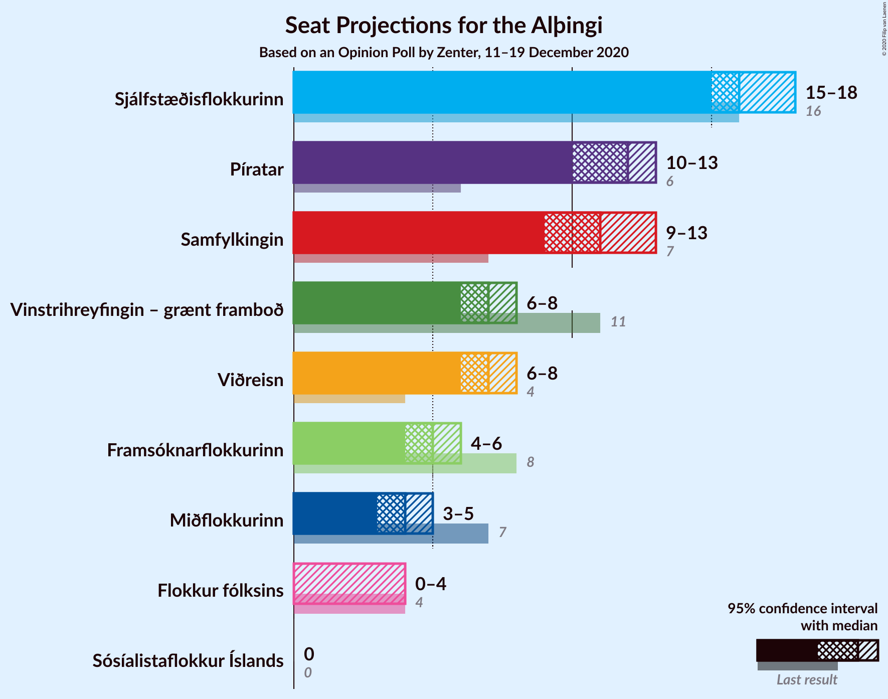

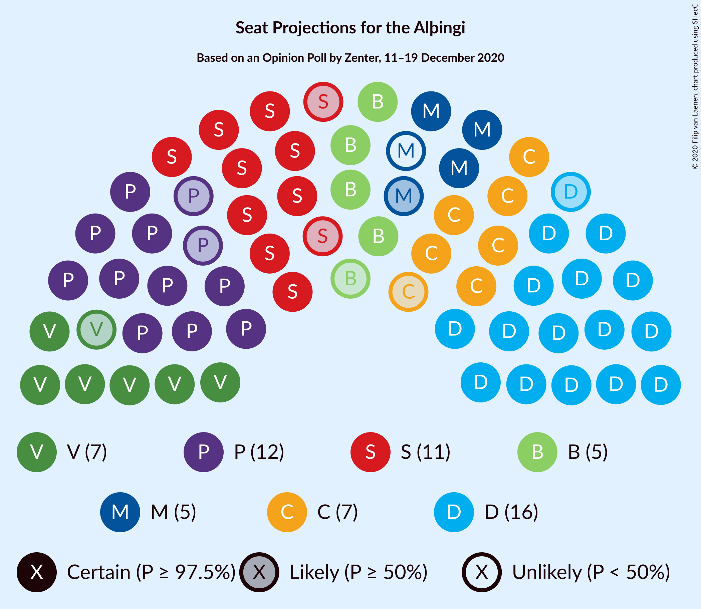

### Confidence Intervals

| Party | Last Result | Median | 80% Confidence Interval | 90% Confidence Interval | 95% Confidence Interval | 99% Confidence Interval |
|:-----:|:-----------:|:------:|:-----------------------:|:-----------------------:|:-----------------------:|:-----------------------:|
| <a href="#sjálfstæðisflokkurinn">Sjálfstæðisflokkurinn</a> | 16 | 16 | 15–18 |15–18 |15–18 |14–20 |
| <a href="#píratar">Píratar</a> | 6 | 12 | 11–13 |10–13 |10–13 |10–14 |
| <a href="#samfylkingin">Samfylkingin</a> | 7 | 11 | 10–13 |10–13 |9–13 |9–13 |
| <a href="#vinstrihreyfingin-–-grænt-framboð">Vinstrihreyfingin – grænt framboð</a> | 11 | 7 | 6–8 |6–8 |6–8 |5–9 |
| <a href="#viðreisn">Viðreisn</a> | 4 | 7 | 6–8 |6–8 |6–8 |5–9 |
| <a href="#framsóknarflokkurinn">Framsóknarflokkurinn</a> | 8 | 5 | 4–5 |4–6 |4–6 |4–6 |
| <a href="#miðflokkurinn">Miðflokkurinn</a> | 7 | 4 | 4–5 |3–5 |3–5 |3–6 |
| <a href="#flokkur-fólksins">Flokkur fólksins</a> | 4 | 0 | 0–3 |0–4 |0–4 |0–4 |
| <a href="#sósíalistaflokkur-íslands">Sósíalistaflokkur Íslands</a> | 0 | 0 | 0 |0 |0 |0 |

### Sjálfstæðisflokkurinn

*For a full overview of the results for this party, see the [Sjálfstæðisflokkurinn](party-sjálfstæðisflokkurinn.html) page.*

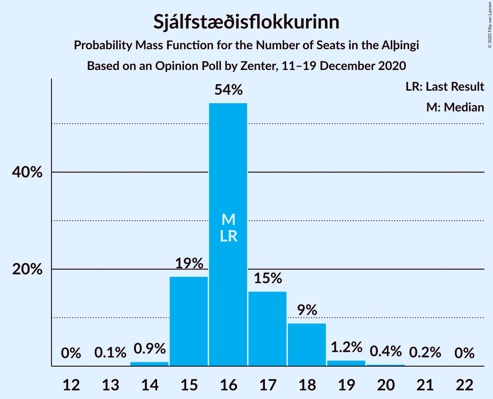

| Number of Seats | Probability | Accumulated | Special Marks |
|:---------------:|:-----------:|:-----------:|:-------------:|
| 13 | 0.1% | 100% |  |
| 14 | 0.9% | 99.9% |  |
| 15 | 19% | 98.9% |  |
| 16 | 54% | 80% | Last Result, Median |
| 17 | 15% | 26% |  |
| 18 | 9% | 11% |  |
| 19 | 1.2% | 2% |  |
| 20 | 0.4% | 0.5% |  |
| 21 | 0.2% | 0.2% |  |
| 22 | 0% | 0% |  |

### Píratar

*For a full overview of the results for this party, see the [Píratar](party-píratar.html) page.*

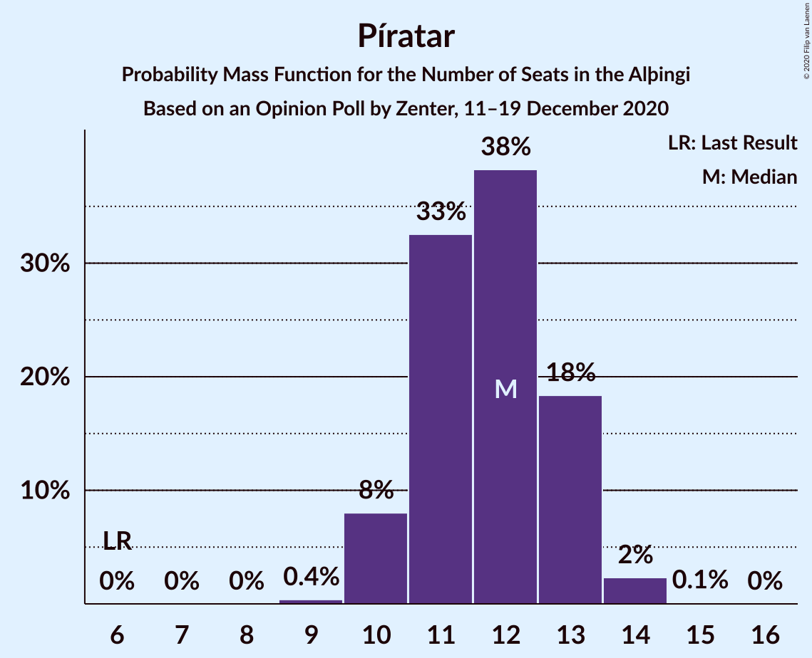

| Number of Seats | Probability | Accumulated | Special Marks |
|:---------------:|:-----------:|:-----------:|:-------------:|
| 6 | 0% | 100% | Last Result |
| 7 | 0% | 100% |  |
| 8 | 0% | 100% |  |
| 9 | 0.4% | 100% |  |
| 10 | 8% | 99.6% |  |
| 11 | 33% | 92% |  |
| 12 | 38% | 59% | Median |
| 13 | 18% | 21% |  |
| 14 | 2% | 2% |  |
| 15 | 0.1% | 0.1% |  |
| 16 | 0% | 0% |  |

### Samfylkingin

*For a full overview of the results for this party, see the [Samfylkingin](party-samfylkingin.html) page.*

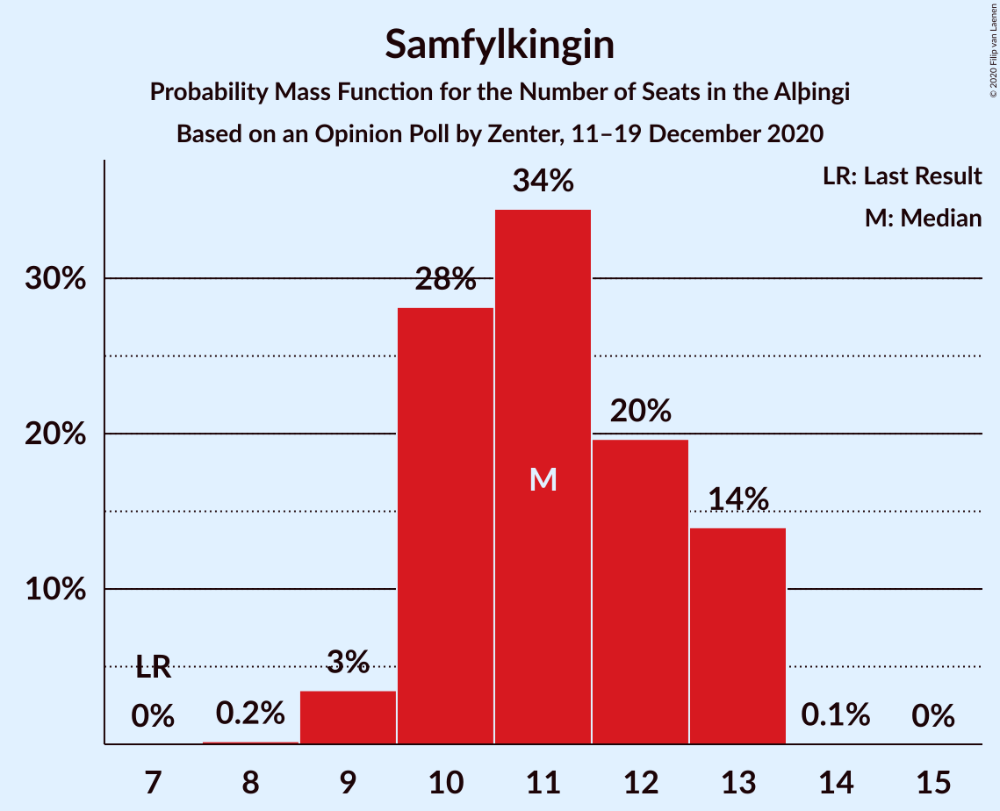

| Number of Seats | Probability | Accumulated | Special Marks |
|:---------------:|:-----------:|:-----------:|:-------------:|
| 7 | 0% | 100% | Last Result |
| 8 | 0.2% | 100% |  |
| 9 | 3% | 99.8% |  |
| 10 | 28% | 96% |  |
| 11 | 34% | 68% | Median |
| 12 | 20% | 34% |  |
| 13 | 14% | 14% |  |
| 14 | 0.1% | 0.1% |  |
| 15 | 0% | 0% |  |

### Vinstrihreyfingin – grænt framboð

*For a full overview of the results for this party, see the [Vinstrihreyfingin – grænt framboð](party-vinstrihreyfingin–græntframboð.html) page.*

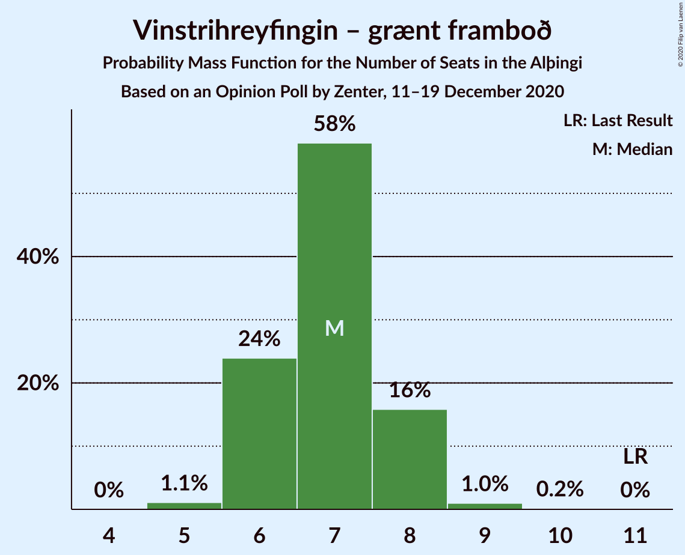

| Number of Seats | Probability | Accumulated | Special Marks |
|:---------------:|:-----------:|:-----------:|:-------------:|
| 5 | 1.1% | 100% |  |
| 6 | 24% | 98.9% |  |
| 7 | 58% | 75% | Median |
| 8 | 16% | 17% |  |
| 9 | 1.0% | 1.1% |  |
| 10 | 0.2% | 0.2% |  |
| 11 | 0% | 0% | Last Result |

### Viðreisn

*For a full overview of the results for this party, see the [Viðreisn](party-viðreisn.html) page.*

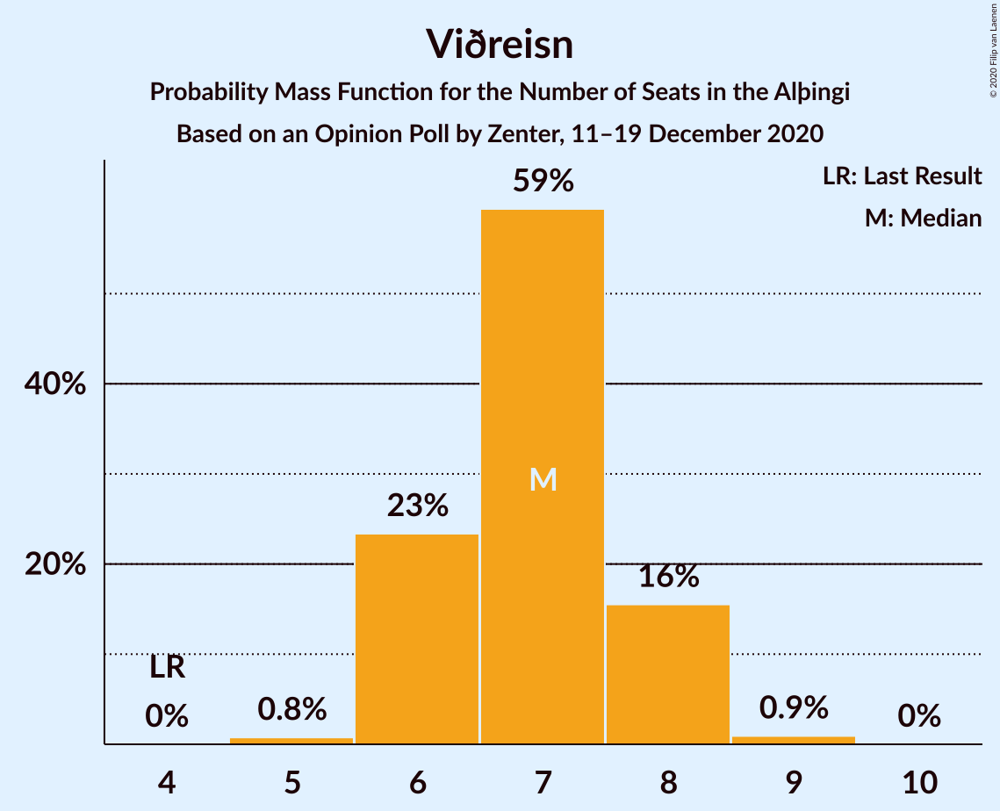

| Number of Seats | Probability | Accumulated | Special Marks |
|:---------------:|:-----------:|:-----------:|:-------------:|
| 4 | 0% | 100% | Last Result |
| 5 | 0.8% | 100% |  |
| 6 | 23% | 99.2% |  |
| 7 | 59% | 76% | Median |
| 8 | 16% | 16% |  |
| 9 | 0.9% | 0.9% |  |
| 10 | 0% | 0% |  |

### Framsóknarflokkurinn

*For a full overview of the results for this party, see the [Framsóknarflokkurinn](party-framsóknarflokkurinn.html) page.*

| Number of Seats | Probability | Accumulated | Special Marks |
|:---------------:|:-----------:|:-----------:|:-------------:|
| 3 | 0.4% | 100% |  |
| 4 | 38% | 99.6% |  |
| 5 | 54% | 62% | Median |
| 6 | 7% | 8% |  |
| 7 | 0.2% | 0.3% |  |
| 8 | 0% | 0% | Last Result |

### Miðflokkurinn

*For a full overview of the results for this party, see the [Miðflokkurinn](party-miðflokkurinn.html) page.*

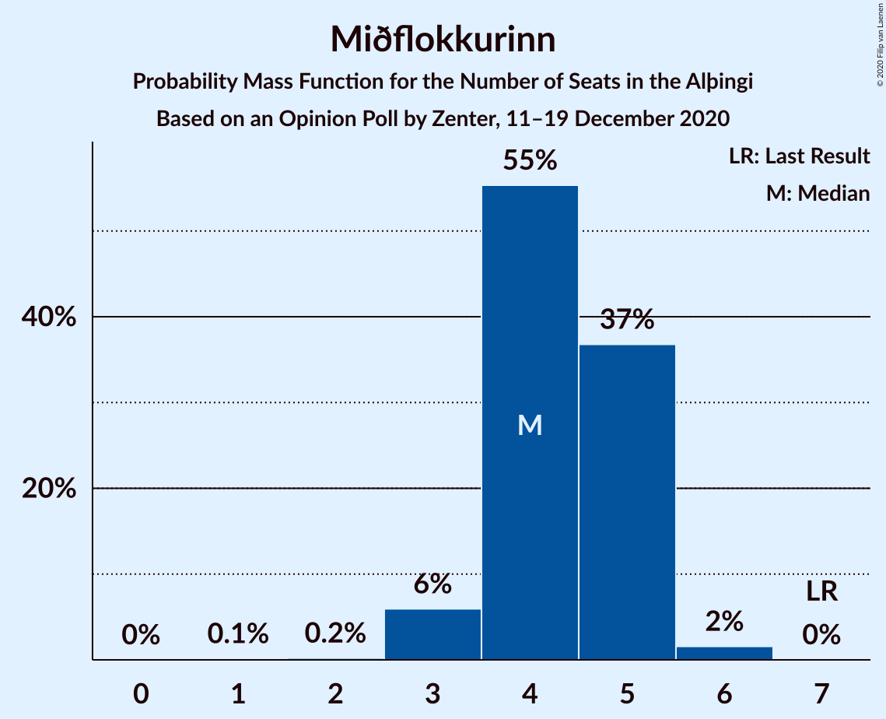

| Number of Seats | Probability | Accumulated | Special Marks |
|:---------------:|:-----------:|:-----------:|:-------------:|
| 1 | 0.1% | 100% |  |
| 2 | 0.2% | 99.9% |  |
| 3 | 6% | 99.7% |  |
| 4 | 55% | 94% | Median |
| 5 | 37% | 38% |  |
| 6 | 2% | 2% |  |
| 7 | 0% | 0% | Last Result |

### Flokkur fólksins

*For a full overview of the results for this party, see the [Flokkur fólksins](party-flokkurfólksins.html) page.*

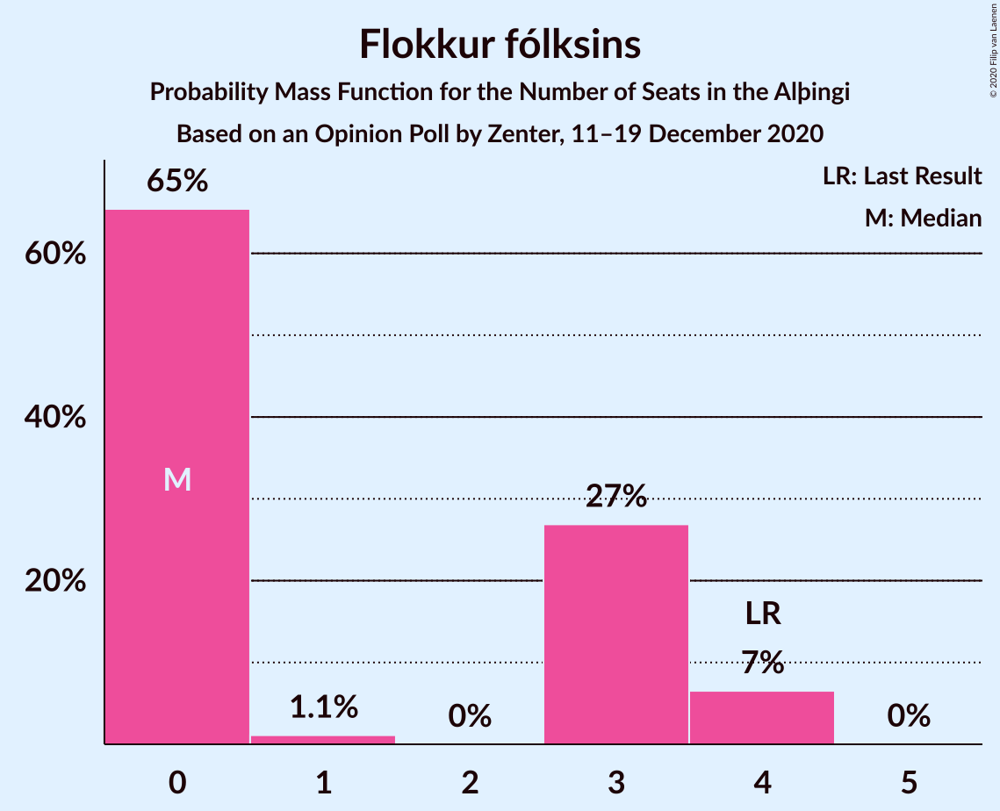

| Number of Seats | Probability | Accumulated | Special Marks |
|:---------------:|:-----------:|:-----------:|:-------------:|
| 0 | 65% | 100% | Median |
| 1 | 1.1% | 35% |  |
| 2 | 0% | 33% |  |
| 3 | 27% | 33% |  |
| 4 | 7% | 7% | Last Result |
| 5 | 0% | 0% |  |

### Sósíalistaflokkur Íslands

*For a full overview of the results for this party, see the [Sósíalistaflokkur Íslands](party-sósíalistaflokkuríslands.html) page.*

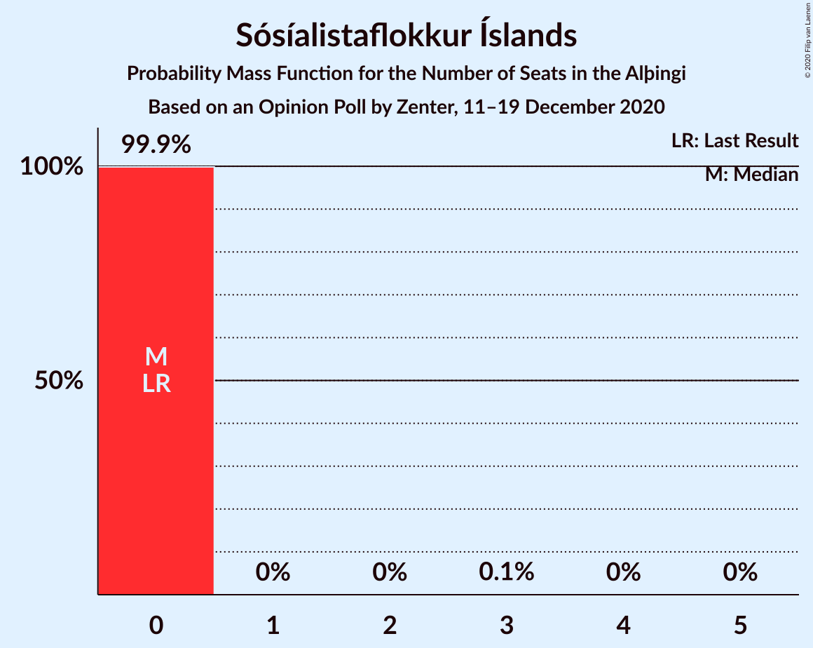

| Number of Seats | Probability | Accumulated | Special Marks |
|:---------------:|:-----------:|:-----------:|:-------------:|
| 0 | 99.9% | 100% | Last Result, Median |
| 1 | 0% | 0.1% |  |
| 2 | 0% | 0.1% |  |
| 3 | 0.1% | 0.1% |  |
| 4 | 0% | 0% |  |

## Coalitions

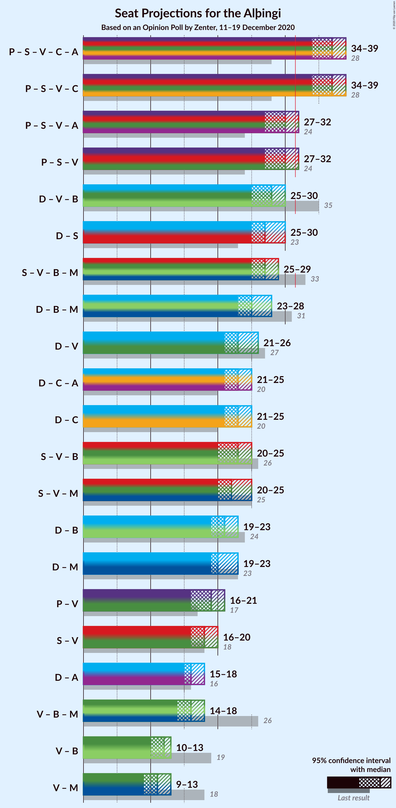

### Confidence Intervals

| Coalition | Last Result | Median | Majority? | 80% Confidence Interval | 90% Confidence Interval | 95% Confidence Interval | 99% Confidence Interval |
|:---------:|:-----------:|:------:|:---------:|:-----------------------:|:-----------------------:|:-----------------------:|:-----------------------:|
| Píratar – Samfylkingin – Vinstrihreyfingin – grænt framboð – Viðreisn | 28 | 37 | 99.9% | 35–38 | 34–39 | 34–39 | 32–39 |
| Píratar – Samfylkingin – Vinstrihreyfingin – grænt framboð | 24 | 30 | 5% | 28–31 | 27–32 | 27–32 | 26–33 |
| Sjálfstæðisflokkurinn – Vinstrihreyfingin – grænt framboð – Framsóknarflokkurinn | 35 | 28 | 0.3% | 26–30 | 26–30 | 25–30 | 25–31 |
| Sjálfstæðisflokkurinn – Samfylkingin | 23 | 27 | 0% | 26–29 | 25–29 | 25–30 | 24–30 |
| Samfylkingin – Vinstrihreyfingin – grænt framboð – Framsóknarflokkurinn – Miðflokkurinn | 33 | 27 | 0% | 25–29 | 25–29 | 25–29 | 24–30 |
| Sjálfstæðisflokkurinn – Framsóknarflokkurinn – Miðflokkurinn | 31 | 25 | 0% | 24–27 | 23–27 | 23–28 | 23–29 |
| Sjálfstæðisflokkurinn – Vinstrihreyfingin – grænt framboð | 27 | 23 | 0% | 22–25 | 21–25 | 21–26 | 20–26 |
| Sjálfstæðisflokkurinn – Viðreisn | 20 | 23 | 0% | 22–25 | 21–25 | 21–25 | 20–26 |
| Samfylkingin – Vinstrihreyfingin – grænt framboð – Framsóknarflokkurinn | 26 | 23 | 0% | 21–24 | 21–25 | 20–25 | 20–25 |
| Samfylkingin – Vinstrihreyfingin – grænt framboð – Miðflokkurinn | 25 | 22 | 0% | 20–24 | 20–25 | 20–25 | 19–25 |
| Sjálfstæðisflokkurinn – Framsóknarflokkurinn | 24 | 21 | 0% | 20–22 | 19–23 | 19–23 | 19–24 |
| Sjálfstæðisflokkurinn – Miðflokkurinn | 23 | 20 | 0% | 19–22 | 19–22 | 19–23 | 18–24 |
| Píratar – Vinstrihreyfingin – grænt framboð | 17 | 19 | 0% | 17–20 | 17–21 | 16–21 | 16–22 |
| Samfylkingin – Vinstrihreyfingin – grænt framboð | 18 | 18 | 0% | 16–20 | 16–20 | 16–20 | 15–20 |
| Vinstrihreyfingin – grænt framboð – Framsóknarflokkurinn – Miðflokkurinn | 26 | 16 | 0% | 15–17 | 14–18 | 14–18 | 13–19 |
| Vinstrihreyfingin – grænt framboð – Framsóknarflokkurinn | 19 | 12 | 0% | 11–13 | 10–13 | 10–13 | 10–14 |
| Vinstrihreyfingin – grænt framboð – Miðflokkurinn | 18 | 11 | 0% | 10–12 | 10–13 | 9–13 | 9–14 |

### Píratar – Samfylkingin – Vinstrihreyfingin – grænt framboð – Viðreisn

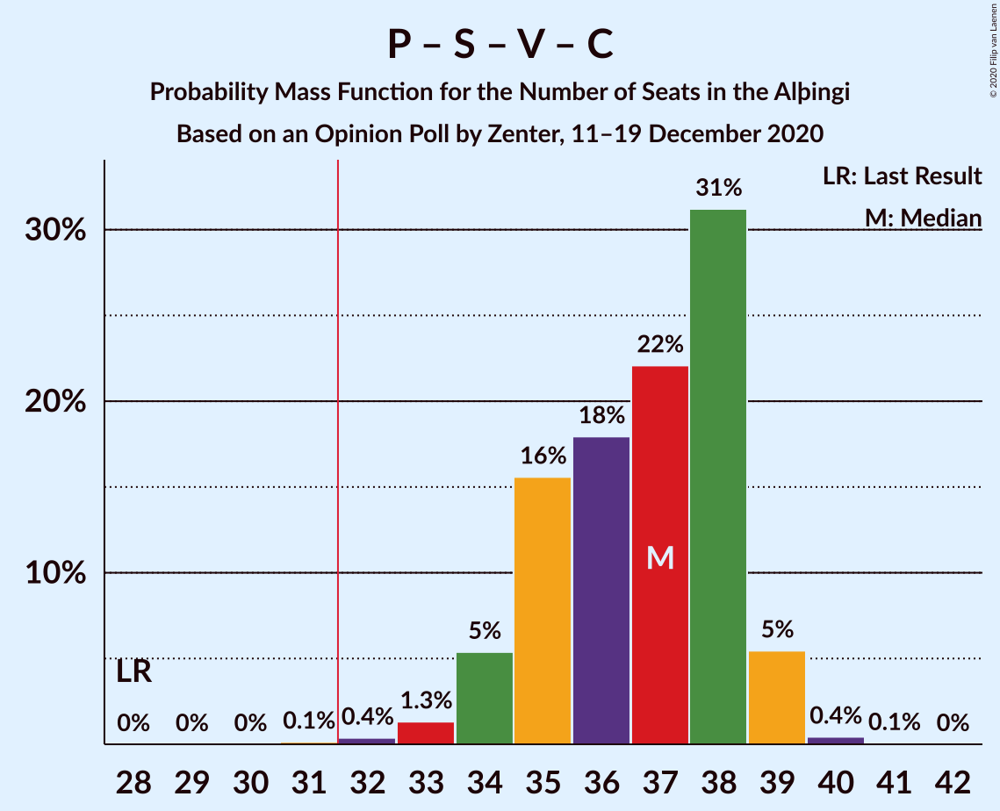

| Number of Seats | Probability | Accumulated | Special Marks |
|:---------------:|:-----------:|:-----------:|:-------------:|
| 28 | 0% | 100% | Last Result |
| 29 | 0% | 100% |  |
| 30 | 0% | 100% |  |
| 31 | 0.1% | 100% |  |
| 32 | 0.4% | 99.9% | Majority |
| 33 | 1.3% | 99.5% |  |
| 34 | 5% | 98% |  |
| 35 | 16% | 93% |  |
| 36 | 18% | 77% |  |
| 37 | 22% | 59% | Median |
| 38 | 31% | 37% |  |
| 39 | 5% | 6% |  |
| 40 | 0.4% | 0.5% |  |
| 41 | 0.1% | 0.1% |  |
| 42 | 0% | 0% |  |

### Píratar – Samfylkingin – Vinstrihreyfingin – grænt framboð

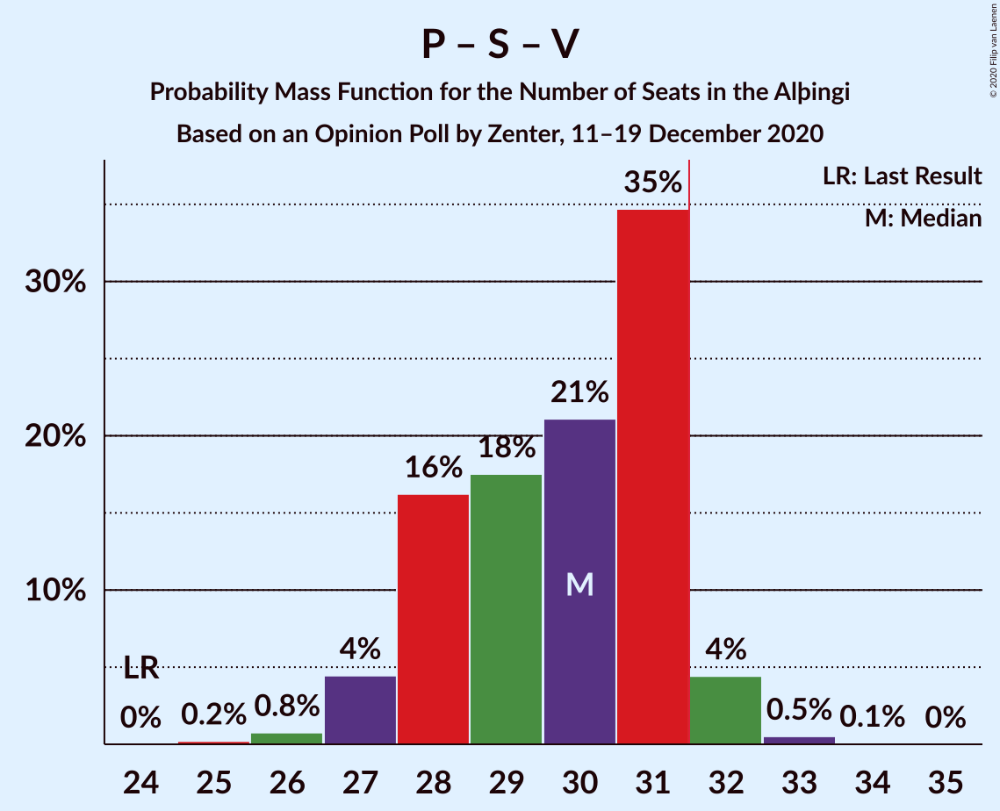

| Number of Seats | Probability | Accumulated | Special Marks |
|:---------------:|:-----------:|:-----------:|:-------------:|
| 24 | 0% | 100% | Last Result |
| 25 | 0.2% | 100% |  |
| 26 | 0.8% | 99.8% |  |
| 27 | 4% | 99.0% |  |
| 28 | 16% | 95% |  |
| 29 | 18% | 78% |  |
| 30 | 21% | 61% | Median |
| 31 | 35% | 40% |  |
| 32 | 4% | 5% | Majority |
| 33 | 0.5% | 0.6% |  |
| 34 | 0.1% | 0.1% |  |
| 35 | 0% | 0% |  |

### Sjálfstæðisflokkurinn – Vinstrihreyfingin – grænt framboð – Framsóknarflokkurinn

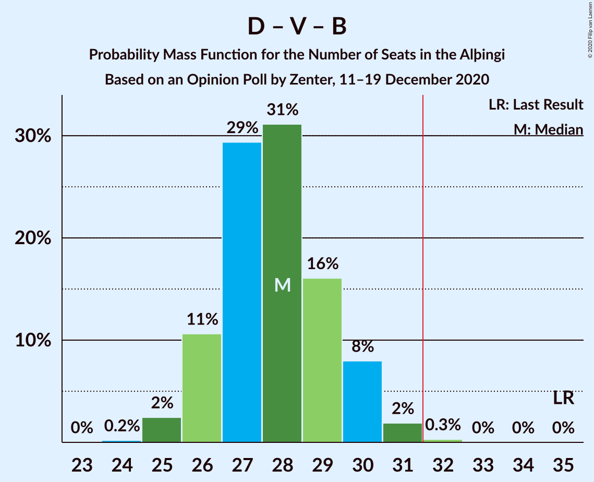

| Number of Seats | Probability | Accumulated | Special Marks |
|:---------------:|:-----------:|:-----------:|:-------------:|
| 24 | 0.2% | 100% |  |
| 25 | 2% | 99.8% |  |
| 26 | 11% | 97% |  |
| 27 | 29% | 87% |  |
| 28 | 31% | 57% | Median |
| 29 | 16% | 26% |  |
| 30 | 8% | 10% |  |
| 31 | 2% | 2% |  |
| 32 | 0.3% | 0.3% | Majority |
| 33 | 0% | 0% |  |
| 34 | 0% | 0% |  |
| 35 | 0% | 0% | Last Result |

### Sjálfstæðisflokkurinn – Samfylkingin

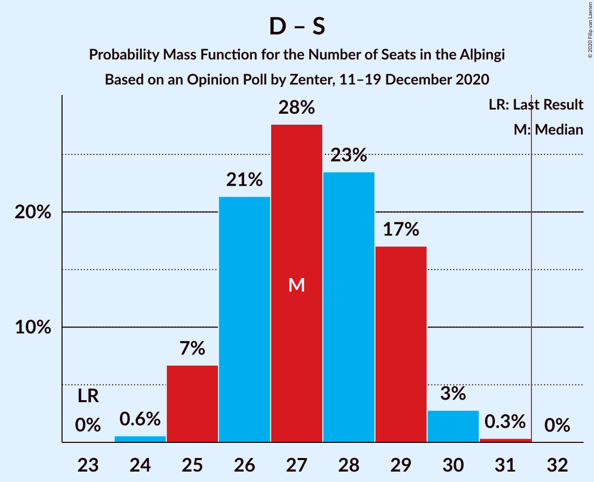

| Number of Seats | Probability | Accumulated | Special Marks |
|:---------------:|:-----------:|:-----------:|:-------------:|
| 23 | 0% | 100% | Last Result |
| 24 | 0.6% | 99.9% |  |
| 25 | 7% | 99.4% |  |
| 26 | 21% | 93% |  |
| 27 | 28% | 71% | Median |
| 28 | 23% | 44% |  |
| 29 | 17% | 20% |  |
| 30 | 3% | 3% |  |
| 31 | 0.3% | 0.4% |  |
| 32 | 0% | 0% | Majority |

### Samfylkingin – Vinstrihreyfingin – grænt framboð – Framsóknarflokkurinn – Miðflokkurinn

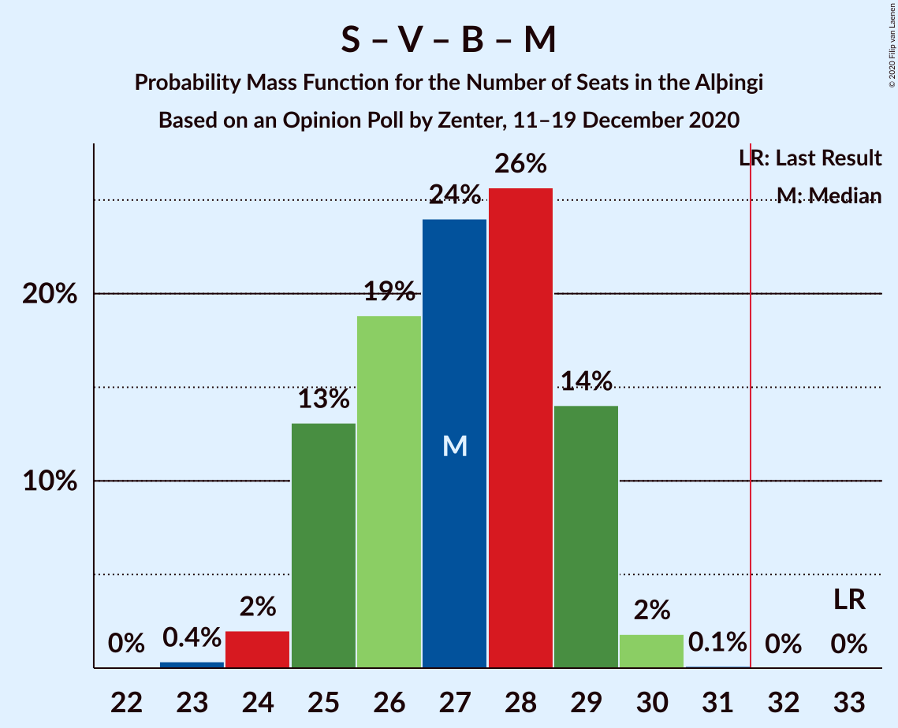

| Number of Seats | Probability | Accumulated | Special Marks |
|:---------------:|:-----------:|:-----------:|:-------------:|
| 22 | 0% | 100% |  |
| 23 | 0.4% | 99.9% |  |
| 24 | 2% | 99.6% |  |
| 25 | 13% | 98% |  |
| 26 | 19% | 84% |  |
| 27 | 24% | 66% | Median |
| 28 | 26% | 42% |  |
| 29 | 14% | 16% |  |
| 30 | 2% | 2% |  |
| 31 | 0.1% | 0.1% |  |
| 32 | 0% | 0% | Majority |
| 33 | 0% | 0% | Last Result |

### Sjálfstæðisflokkurinn – Framsóknarflokkurinn – Miðflokkurinn

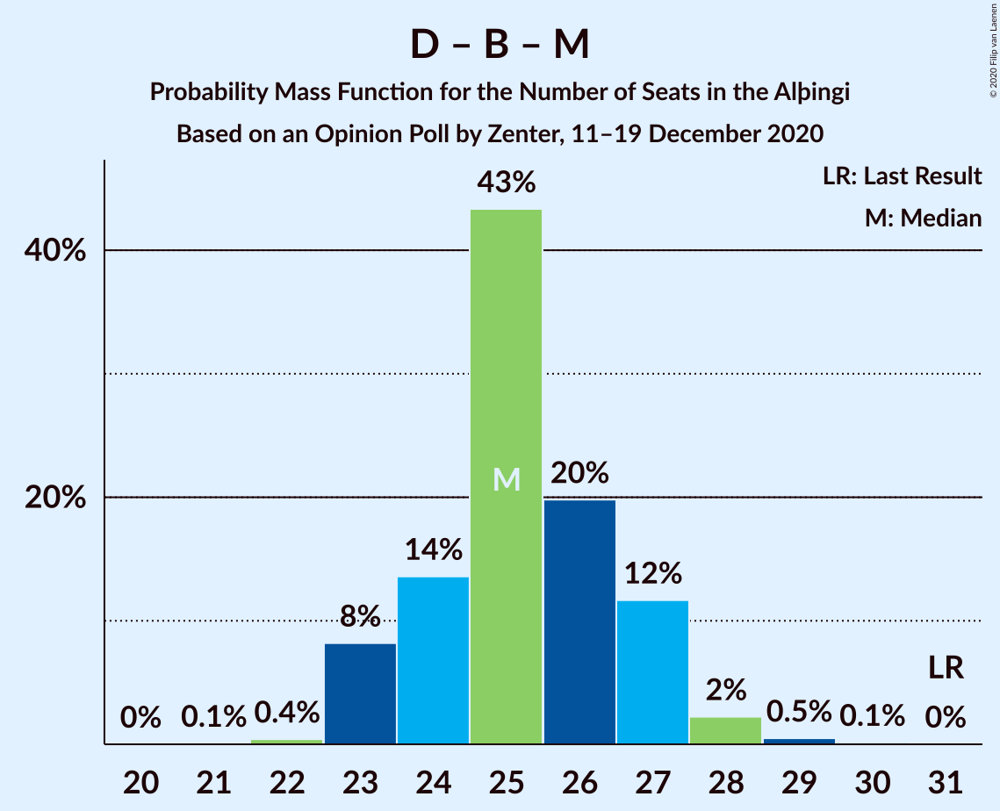

| Number of Seats | Probability | Accumulated | Special Marks |
|:---------------:|:-----------:|:-----------:|:-------------:|
| 21 | 0.1% | 100% |  |
| 22 | 0.4% | 99.9% |  |
| 23 | 8% | 99.5% |  |
| 24 | 14% | 91% |  |
| 25 | 43% | 78% | Median |
| 26 | 20% | 34% |  |
| 27 | 12% | 15% |  |
| 28 | 2% | 3% |  |
| 29 | 0.5% | 0.7% |  |
| 30 | 0.1% | 0.2% |  |
| 31 | 0% | 0% | Last Result |

### Sjálfstæðisflokkurinn – Vinstrihreyfingin – grænt framboð

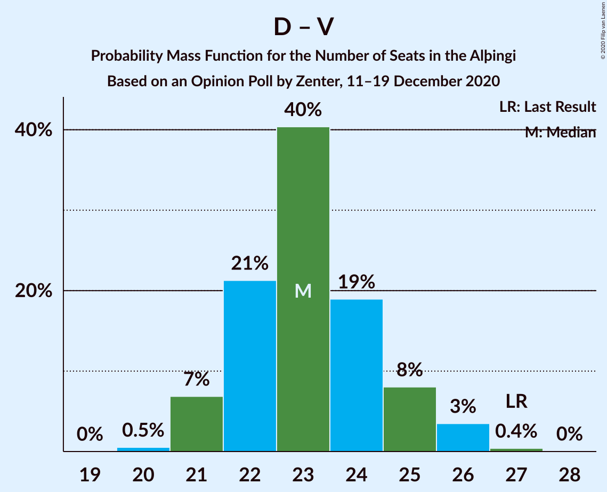

| Number of Seats | Probability | Accumulated | Special Marks |
|:---------------:|:-----------:|:-----------:|:-------------:|
| 20 | 0.5% | 100% |  |
| 21 | 7% | 99.4% |  |
| 22 | 21% | 93% |  |
| 23 | 40% | 71% | Median |
| 24 | 19% | 31% |  |
| 25 | 8% | 12% |  |
| 26 | 3% | 4% |  |
| 27 | 0.4% | 0.5% | Last Result |
| 28 | 0% | 0% |  |

### Sjálfstæðisflokkurinn – Viðreisn

| Number of Seats | Probability | Accumulated | Special Marks |
|:---------------:|:-----------:|:-----------:|:-------------:|
| 20 | 0.5% | 100% | Last Result |
| 21 | 7% | 99.4% |  |
| 22 | 18% | 92% |  |
| 23 | 42% | 74% | Median |
| 24 | 22% | 32% |  |
| 25 | 8% | 10% |  |
| 26 | 2% | 2% |  |
| 27 | 0.3% | 0.4% |  |
| 28 | 0.1% | 0.1% |  |
| 29 | 0% | 0% |  |

### Samfylkingin – Vinstrihreyfingin – grænt framboð – Framsóknarflokkurinn

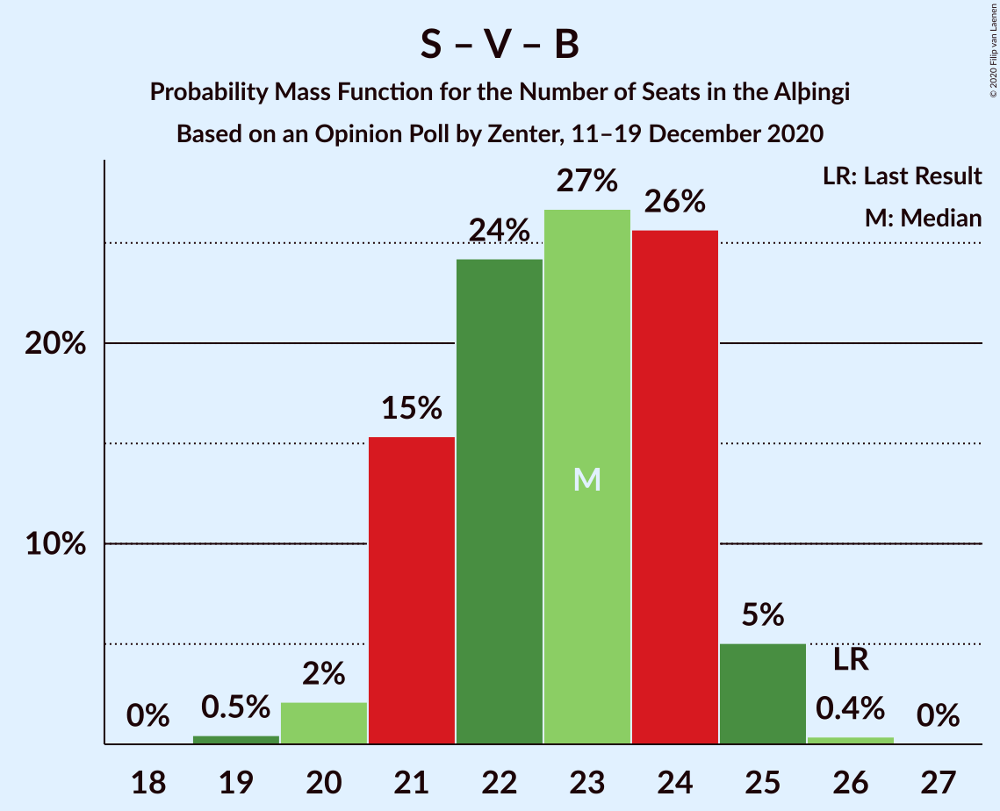

| Number of Seats | Probability | Accumulated | Special Marks |
|:---------------:|:-----------:|:-----------:|:-------------:|
| 19 | 0.5% | 100% |  |
| 20 | 2% | 99.5% |  |
| 21 | 15% | 97% |  |
| 22 | 24% | 82% |  |
| 23 | 27% | 58% | Median |
| 24 | 26% | 31% |  |
| 25 | 5% | 5% |  |
| 26 | 0.4% | 0.4% | Last Result |
| 27 | 0% | 0% |  |

### Samfylkingin – Vinstrihreyfingin – grænt framboð – Miðflokkurinn

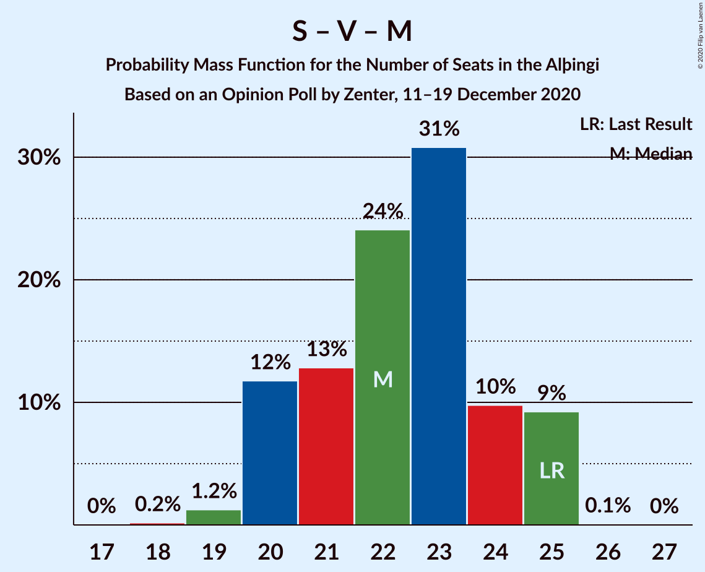

| Number of Seats | Probability | Accumulated | Special Marks |
|:---------------:|:-----------:|:-----------:|:-------------:|
| 18 | 0.2% | 100% |  |
| 19 | 1.2% | 99.8% |  |
| 20 | 12% | 98.6% |  |
| 21 | 13% | 87% |  |
| 22 | 24% | 74% | Median |
| 23 | 31% | 50% |  |
| 24 | 10% | 19% |  |
| 25 | 9% | 9% | Last Result |
| 26 | 0.1% | 0.1% |  |
| 27 | 0% | 0% |  |

### Sjálfstæðisflokkurinn – Framsóknarflokkurinn

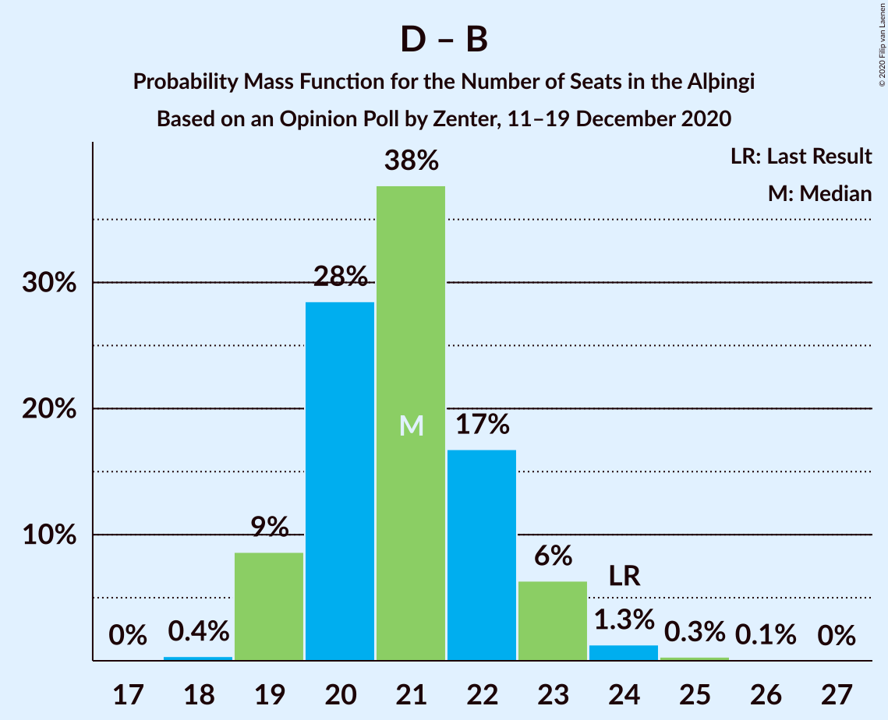

| Number of Seats | Probability | Accumulated | Special Marks |
|:---------------:|:-----------:|:-----------:|:-------------:|
| 18 | 0.4% | 100% |  |
| 19 | 9% | 99.6% |  |
| 20 | 28% | 91% |  |
| 21 | 38% | 62% | Median |
| 22 | 17% | 25% |  |
| 23 | 6% | 8% |  |
| 24 | 1.3% | 2% | Last Result |
| 25 | 0.3% | 0.4% |  |
| 26 | 0.1% | 0.1% |  |
| 27 | 0% | 0% |  |

### Sjálfstæðisflokkurinn – Miðflokkurinn

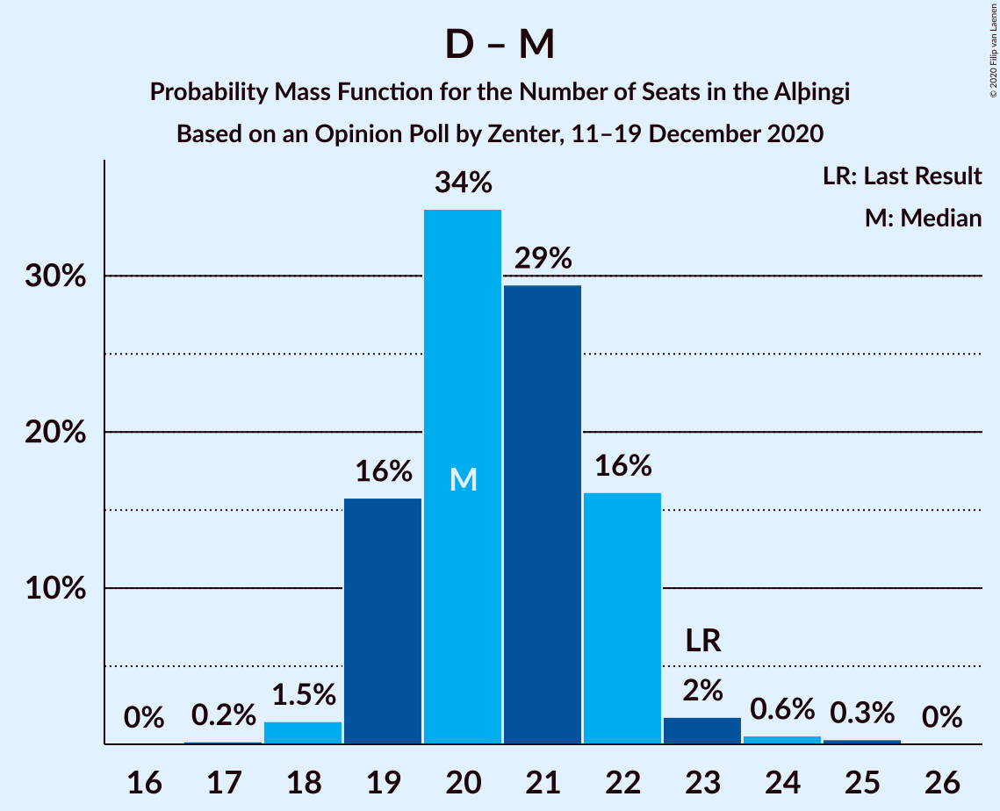

| Number of Seats | Probability | Accumulated | Special Marks |
|:---------------:|:-----------:|:-----------:|:-------------:|
| 17 | 0.2% | 100% |  |
| 18 | 1.5% | 99.8% |  |
| 19 | 16% | 98% |  |
| 20 | 34% | 83% | Median |
| 21 | 29% | 48% |  |
| 22 | 16% | 19% |  |
| 23 | 2% | 3% | Last Result |
| 24 | 0.6% | 0.9% |  |
| 25 | 0.3% | 0.4% |  |
| 26 | 0% | 0% |  |

### Píratar – Vinstrihreyfingin – grænt framboð

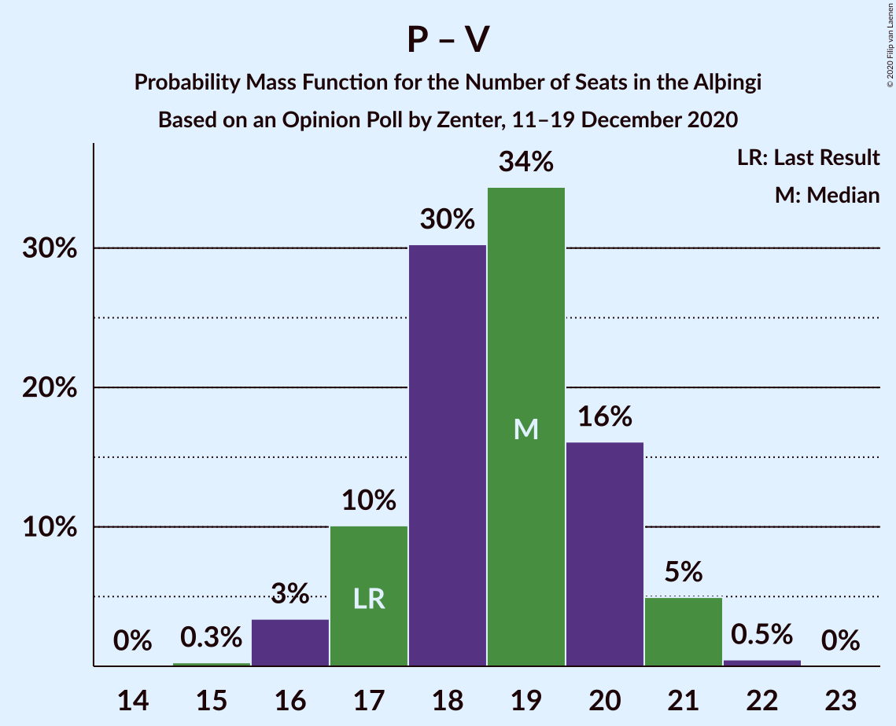

| Number of Seats | Probability | Accumulated | Special Marks |
|:---------------:|:-----------:|:-----------:|:-------------:|
| 15 | 0.3% | 100% |  |
| 16 | 3% | 99.7% |  |
| 17 | 10% | 96% | Last Result |
| 18 | 30% | 86% |  |
| 19 | 34% | 56% | Median |
| 20 | 16% | 22% |  |
| 21 | 5% | 5% |  |
| 22 | 0.5% | 0.5% |  |
| 23 | 0% | 0% |  |

### Samfylkingin – Vinstrihreyfingin – grænt framboð

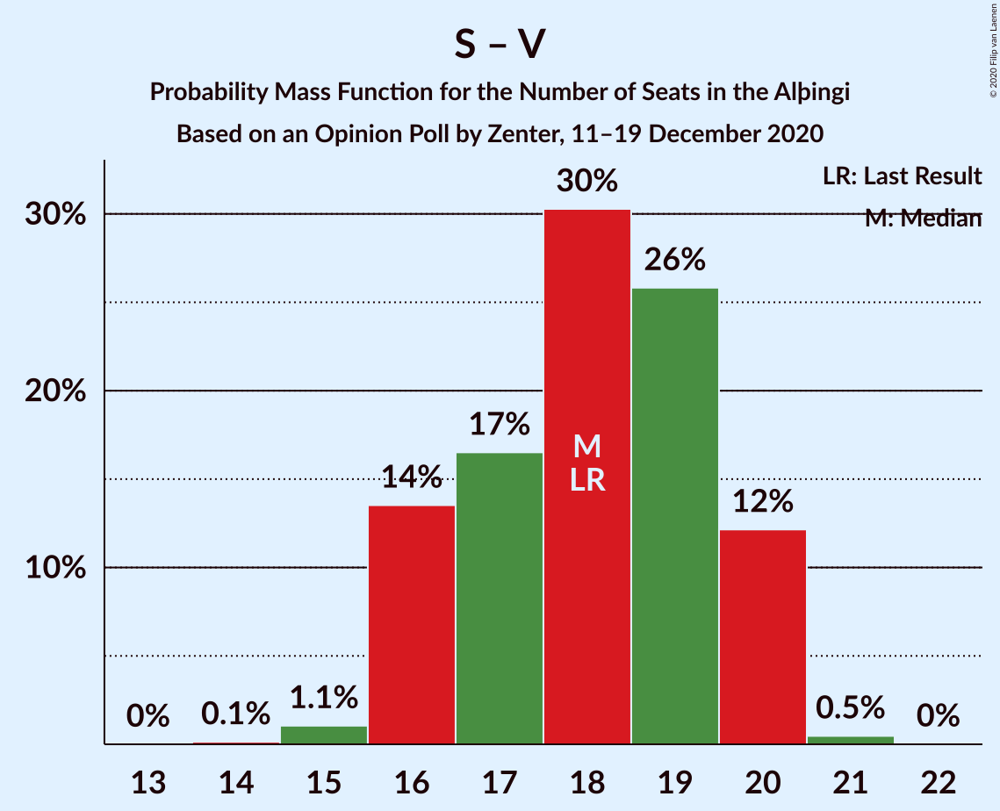

| Number of Seats | Probability | Accumulated | Special Marks |
|:---------------:|:-----------:|:-----------:|:-------------:|
| 14 | 0.1% | 100% |  |
| 15 | 1.1% | 99.9% |  |
| 16 | 14% | 98.8% |  |
| 17 | 17% | 85% |  |
| 18 | 30% | 69% | Last Result, Median |
| 19 | 26% | 38% |  |
| 20 | 12% | 13% |  |
| 21 | 0.5% | 0.5% |  |
| 22 | 0% | 0% |  |

### Vinstrihreyfingin – grænt framboð – Framsóknarflokkurinn – Miðflokkurinn

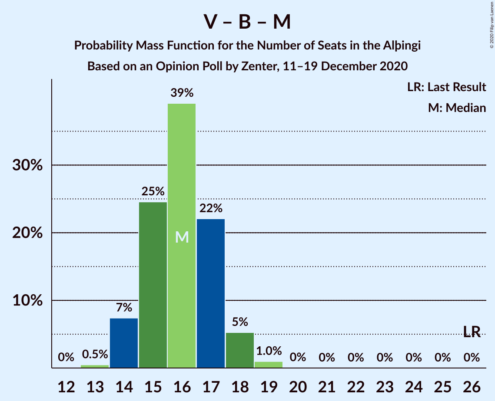

| Number of Seats | Probability | Accumulated | Special Marks |
|:---------------:|:-----------:|:-----------:|:-------------:|
| 12 | 0% | 100% |  |
| 13 | 0.5% | 99.9% |  |
| 14 | 7% | 99.5% |  |
| 15 | 25% | 92% |  |
| 16 | 39% | 68% | Median |
| 17 | 22% | 28% |  |
| 18 | 5% | 6% |  |
| 19 | 1.0% | 1.0% |  |
| 20 | 0% | 0.1% |  |
| 21 | 0% | 0% |  |
| 22 | 0% | 0% |  |
| 23 | 0% | 0% |  |
| 24 | 0% | 0% |  |
| 25 | 0% | 0% |  |
| 26 | 0% | 0% | Last Result |

### Vinstrihreyfingin – grænt framboð – Framsóknarflokkurinn

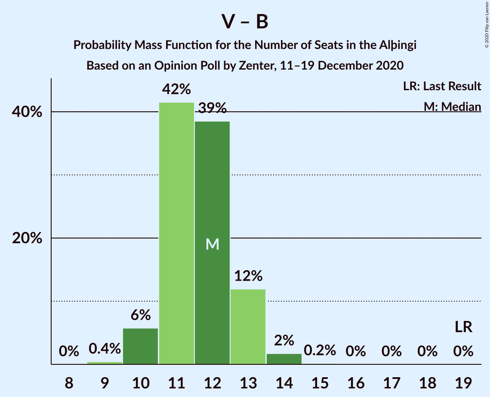

| Number of Seats | Probability | Accumulated | Special Marks |
|:---------------:|:-----------:|:-----------:|:-------------:|
| 9 | 0.4% | 100% |  |
| 10 | 6% | 99.6% |  |
| 11 | 42% | 94% |  |
| 12 | 39% | 52% | Median |
| 13 | 12% | 14% |  |
| 14 | 2% | 2% |  |
| 15 | 0.2% | 0.2% |  |
| 16 | 0% | 0% |  |
| 17 | 0% | 0% |  |
| 18 | 0% | 0% |  |
| 19 | 0% | 0% | Last Result |

### Vinstrihreyfingin – grænt framboð – Miðflokkurinn

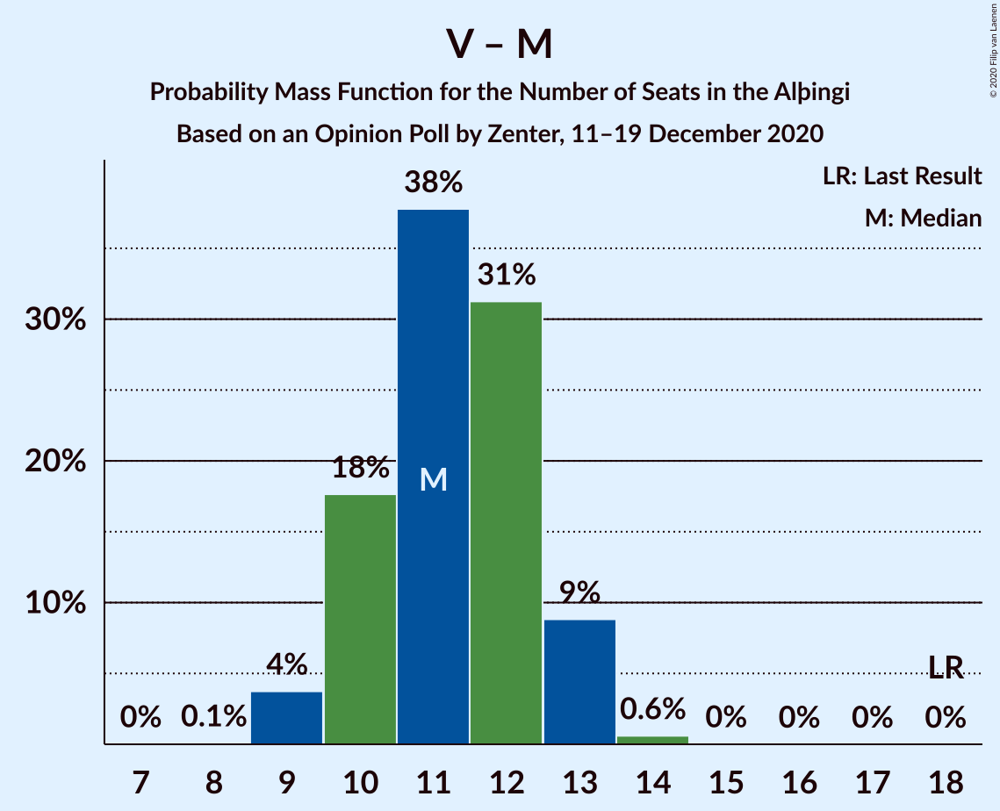

| Number of Seats | Probability | Accumulated | Special Marks |
|:---------------:|:-----------:|:-----------:|:-------------:|
| 8 | 0.1% | 100% |  |
| 9 | 4% | 99.9% |  |
| 10 | 18% | 96% |  |
| 11 | 38% | 78% | Median |
| 12 | 31% | 41% |  |
| 13 | 9% | 9% |  |
| 14 | 0.6% | 0.6% |  |
| 15 | 0% | 0% |  |
| 16 | 0% | 0% |  |
| 17 | 0% | 0% |  |
| 18 | 0% | 0% | Last Result |

## Technical Information

### Opinion Poll

+ **Polling firm:** Zenter
+ **Commissioner(s):** —
+ **Fieldwork period:** 11–19 December 2020

### Calculations

+ **Sample size:** 1320
+ **Simulations done:** 1,048,576
+ **Error estimate:** 1.20%

