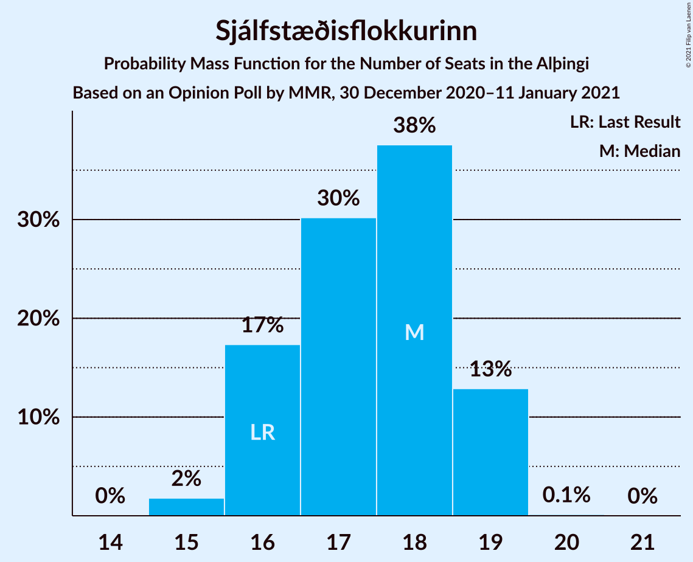
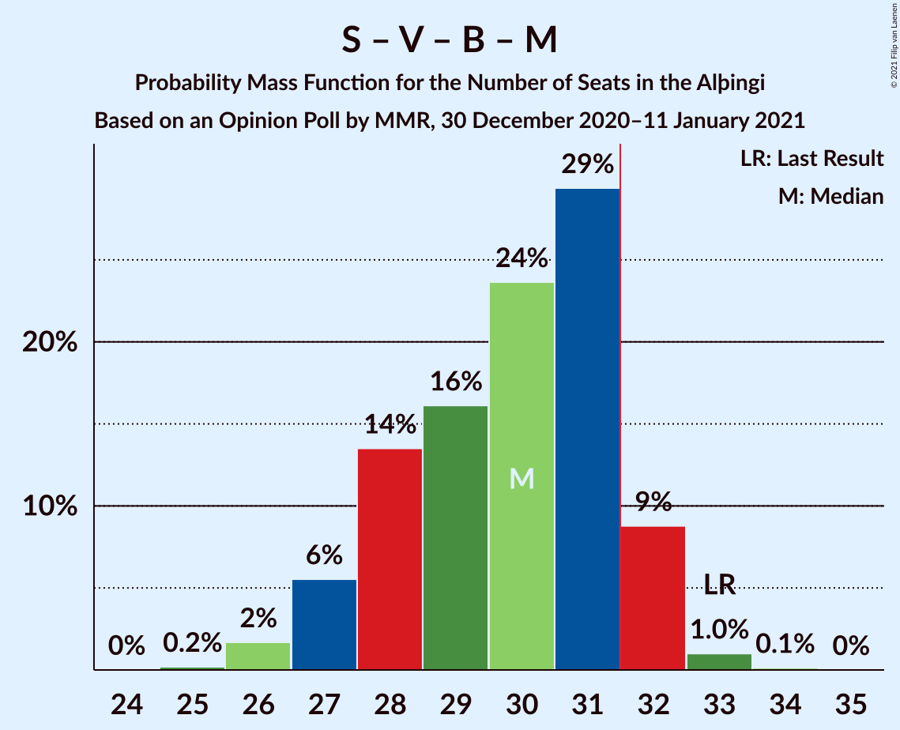
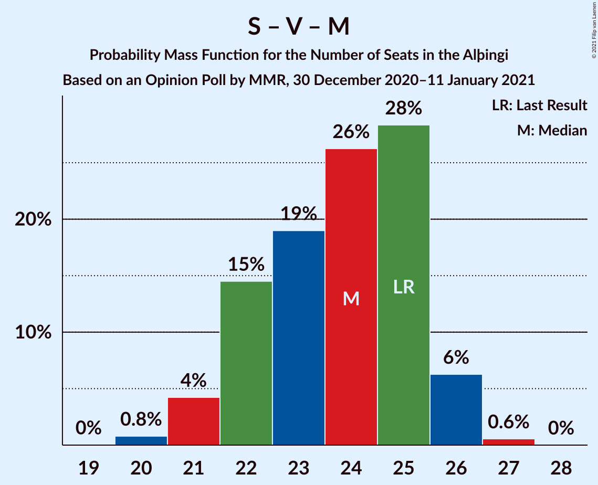

# Opinion Poll by MMR, 30 December 2020–11 January 2021

<a href="#voting-intentions">Voting Intentions</a> | <a href="#seats">Seats</a> | <a href="#coalitions">Coalitions</a> | <a href="#technical-information">Technical Information</a>

## Voting Intentions

### Confidence Intervals

| Party | Last Result | Poll Result | 80% Confidence Interval | 90% Confidence Interval | 95% Confidence Interval | 99% Confidence Interval |
|:-----:|:-----------:|:-----------:|:-----------------------:|:-----------------------:|:-----------------------:|:-----------------------:|
| Sjálfstæðisflokkurinn | 25.2% | 24.4% | 23.2–25.6% |22.8–26.0% |22.5–26.3% |22.0–26.9% |
| Samfylkingin | 12.1% | 15.6% | 14.6–16.7% |14.3–17.0% |14.1–17.2% |13.6–17.8% |
| Píratar | 9.2% | 12.3% | 11.4–13.3% |11.1–13.6% |10.9–13.8% |10.5–14.3% |
| Vinstrihreyfingin – grænt framboð | 16.9% | 10.9% | 10.0–11.8% |9.8–12.1% |9.6–12.3% |9.2–12.8% |
| Framsóknarflokkurinn | 10.7% | 9.1% | 8.3–10.0% |8.1–10.2% |7.9–10.4% |7.5–10.9% |
| Viðreisn | 6.7% | 8.8% | 8.0–9.7% |7.8–9.9% |7.6–10.1% |7.3–10.5% |
| Miðflokkurinn | 10.9% | 8.6% | 7.8–9.4% |7.6–9.7% |7.4–9.9% |7.1–10.3% |
| Flokkur fólksins | 6.9% | 4.9% | 4.3–5.6% |4.2–5.8% |4.0–5.9% |3.8–6.3% |
| Sósíalistaflokkur Íslands | 0.0% | 4.4% | 3.9–5.0% |3.7–5.2% |3.6–5.4% |3.3–5.7% |

*Note:* The poll result column reflects the actual value used in the calculations. Published results may vary slightly, and in addition be rounded to fewer digits.

## Seats

### Confidence Intervals

| Party | Last Result | Median | 80% Confidence Interval | 90% Confidence Interval | 95% Confidence Interval | 99% Confidence Interval |
|:-----:|:-----------:|:------:|:-----------------------:|:-----------------------:|:-----------------------:|:-----------------------:|
| <a href="#sjálfstæðisflokkurinn">Sjálfstæðisflokkurinn</a> | 16 | 18 | 17–19 |16–19 |16–19 |15–20 |
| <a href="#samfylkingin">Samfylkingin</a> | 7 | 10 | 10–12 |10–12 |10–12 |9–12 |
| <a href="#píratar">Píratar</a> | 6 | 8 | 7–9 |7–10 |7–10 |6–10 |
| <a href="#vinstrihreyfingin-–-grænt-framboð">Vinstrihreyfingin – grænt framboð</a> | 11 | 7 | 6–8 |6–8 |6–8 |6–9 |
| <a href="#framsóknarflokkurinn">Framsóknarflokkurinn</a> | 8 | 6 | 5–7 |5–7 |5–7 |5–8 |
| <a href="#viðreisn">Viðreisn</a> | 4 | 5 | 5–6 |5–6 |5–7 |5–7 |
| <a href="#miðflokkurinn">Miðflokkurinn</a> | 7 | 6 | 4–7 |4–7 |4–7 |4–7 |
| <a href="#flokkur-fólksins">Flokkur fólksins</a> | 4 | 0 | 0–3 |0–4 |0–4 |0–4 |
| <a href="#sósíalistaflokkur-íslands">Sósíalistaflokkur Íslands</a> | 0 | 0 | 0–3 |0–3 |0–3 |0–3 |

### Sjálfstæðisflokkurinn

*For a full overview of the results for this party, see the [Sjálfstæðisflokkurinn](party-sjálfstæðisflokkurinn.html) page.*

| Number of Seats | Probability | Accumulated | Special Marks |
|:---------------:|:-----------:|:-----------:|:-------------:|
| 15 | 2% | 100% |  |
| 16 | 6% | 98% | Last Result |
| 17 | 32% | 92% |  |
| 18 | 23% | 60% | Median |
| 19 | 36% | 37% |  |
| 20 | 1.1% | 1.2% |  |
| 21 | 0% | 0% |  |

### Samfylkingin

*For a full overview of the results for this party, see the [Samfylkingin](party-samfylkingin.html) page.*

| Number of Seats | Probability | Accumulated | Special Marks |
|:---------------:|:-----------:|:-----------:|:-------------:|
| 7 | 0% | 100% | Last Result |
| 8 | 0.3% | 100% |  |
| 9 | 2% | 99.7% |  |
| 10 | 50% | 98% | Median |
| 11 | 32% | 48% |  |
| 12 | 15% | 16% |  |
| 13 | 0.3% | 0.3% |  |
| 14 | 0% | 0% |  |

### Píratar

*For a full overview of the results for this party, see the [Píratar](party-píratar.html) page.*

| Number of Seats | Probability | Accumulated | Special Marks |
|:---------------:|:-----------:|:-----------:|:-------------:|
| 6 | 0.5% | 100% | Last Result |
| 7 | 14% | 99.5% |  |
| 8 | 39% | 86% | Median |
| 9 | 40% | 46% |  |
| 10 | 6% | 6% |  |
| 11 | 0.1% | 0.1% |  |
| 12 | 0% | 0% |  |

### Vinstrihreyfingin – grænt framboð

*For a full overview of the results for this party, see the [Vinstrihreyfingin – grænt framboð](party-vinstrihreyfingin–græntframboð.html) page.*

| Number of Seats | Probability | Accumulated | Special Marks |
|:---------------:|:-----------:|:-----------:|:-------------:|
| 5 | 0.1% | 100% |  |
| 6 | 12% | 99.9% |  |
| 7 | 56% | 88% | Median |
| 8 | 31% | 33% |  |
| 9 | 1.3% | 1.4% |  |
| 10 | 0.1% | 0.1% |  |
| 11 | 0% | 0% | Last Result |

### Framsóknarflokkurinn

*For a full overview of the results for this party, see the [Framsóknarflokkurinn](party-framsóknarflokkurinn.html) page.*

| Number of Seats | Probability | Accumulated | Special Marks |
|:---------------:|:-----------:|:-----------:|:-------------:|
| 4 | 0.4% | 100% |  |
| 5 | 23% | 99.6% |  |
| 6 | 66% | 77% | Median |
| 7 | 10% | 11% |  |
| 8 | 1.3% | 1.3% | Last Result |
| 9 | 0% | 0% |  |

### Viðreisn

*For a full overview of the results for this party, see the [Viðreisn](party-viðreisn.html) page.*

| Number of Seats | Probability | Accumulated | Special Marks |
|:---------------:|:-----------:|:-----------:|:-------------:|
| 4 | 0.2% | 100% | Last Result |
| 5 | 53% | 99.8% | Median |
| 6 | 42% | 46% |  |
| 7 | 4% | 4% |  |
| 8 | 0.2% | 0.2% |  |
| 9 | 0% | 0% |  |

### Miðflokkurinn

*For a full overview of the results for this party, see the [Miðflokkurinn](party-miðflokkurinn.html) page.*

| Number of Seats | Probability | Accumulated | Special Marks |
|:---------------:|:-----------:|:-----------:|:-------------:|
| 4 | 10% | 100% |  |
| 5 | 28% | 90% |  |
| 6 | 47% | 62% | Median |
| 7 | 15% | 15% | Last Result |
| 8 | 0.1% | 0.2% |  |
| 9 | 0% | 0% |  |

### Flokkur fólksins

*For a full overview of the results for this party, see the [Flokkur fólksins](party-flokkurfólksins.html) page.*

| Number of Seats | Probability | Accumulated | Special Marks |
|:---------------:|:-----------:|:-----------:|:-------------:|
| 0 | 58% | 100% | Median |
| 1 | 0% | 42% |  |
| 2 | 0% | 42% |  |
| 3 | 36% | 42% |  |
| 4 | 6% | 6% | Last Result |
| 5 | 0% | 0% |  |

### Sósíalistaflokkur Íslands

*For a full overview of the results for this party, see the [Sósíalistaflokkur Íslands](party-sósíalistaflokkuríslands.html) page.*

| Number of Seats | Probability | Accumulated | Special Marks |
|:---------------:|:-----------:|:-----------:|:-------------:|
| 0 | 83% | 100% | Last Result, Median |
| 1 | 0% | 17% |  |
| 2 | 0% | 17% |  |
| 3 | 16% | 17% |  |
| 4 | 0.4% | 0.4% |  |
| 5 | 0% | 0% |  |

## Coalitions

### Confidence Intervals

| Coalition | Last Result | Median | Majority? | 80% Confidence Interval | 90% Confidence Interval | 95% Confidence Interval | 99% Confidence Interval |
|:---------:|:-----------:|:------:|:---------:|:-----------------------:|:-----------------------:|:-----------------------:|:-----------------------:|
| Samfylkingin – Píratar – Vinstrihreyfingin – grænt framboð – Viðreisn | 28 | 32 | 60% | 29–34 | 29–34 | 29–34 | 29–35 |
| Sjálfstæðisflokkurinn – Vinstrihreyfingin – grænt framboð – Framsóknarflokkurinn | 35 | 31 | 38% | 30–32 | 29–33 | 28–33 | 28–33 |
| Samfylkingin – Vinstrihreyfingin – grænt framboð – Framsóknarflokkurinn – Miðflokkurinn | 33 | 30 | 10% | 26–31 | 26–32 | 26–32 | 26–33 |
| Sjálfstæðisflokkurinn – Framsóknarflokkurinn – Miðflokkurinn | 31 | 29 | 2% | 28–31 | 27–31 | 27–31 | 26–32 |
| Sjálfstæðisflokkurinn – Samfylkingin | 23 | 29 | 0% | 27–29 | 26–31 | 26–31 | 25–31 |
| Samfylkingin – Píratar – Vinstrihreyfingin – grænt framboð | 24 | 26 | 0% | 24–28 | 24–28 | 24–29 | 23–30 |
| Sjálfstæðisflokkurinn – Vinstrihreyfingin – grænt framboð | 27 | 25 | 0% | 24–26 | 23–27 | 23–27 | 22–27 |
| Samfylkingin – Vinstrihreyfingin – grænt framboð – Framsóknarflokkurinn | 26 | 24 | 0% | 22–25 | 22–25 | 21–26 | 20–26 |
| Samfylkingin – Vinstrihreyfingin – grænt framboð – Miðflokkurinn | 25 | 23 | 0% | 21–25 | 21–26 | 21–26 | 20–26 |
| Sjálfstæðisflokkurinn – Framsóknarflokkurinn | 24 | 24 | 0% | 22–25 | 22–25 | 21–25 | 21–26 |
| Sjálfstæðisflokkurinn – Miðflokkurinn | 23 | 23 | 0% | 22–25 | 22–25 | 21–25 | 21–26 |
| Sjálfstæðisflokkurinn – Viðreisn | 20 | 23 | 0% | 22–25 | 22–25 | 21–25 | 21–26 |
| Vinstrihreyfingin – grænt framboð – Framsóknarflokkurinn – Miðflokkurinn | 26 | 19 | 0% | 16–20 | 16–21 | 16–21 | 16–22 |
| Samfylkingin – Vinstrihreyfingin – grænt framboð | 18 | 18 | 0% | 17–19 | 16–19 | 16–20 | 15–20 |
| Píratar – Vinstrihreyfingin – grænt framboð | 17 | 16 | 0% | 14–17 | 14–17 | 14–18 | 13–18 |
| Vinstrihreyfingin – grænt framboð – Framsóknarflokkurinn | 19 | 13 | 0% | 12–14 | 12–14 | 11–15 | 11–15 |
| Vinstrihreyfingin – grænt framboð – Miðflokkurinn | 18 | 13 | 0% | 11–14 | 11–15 | 11–15 | 11–15 |

### Samfylkingin – Píratar – Vinstrihreyfingin – grænt framboð – Viðreisn

| Number of Seats | Probability | Accumulated | Special Marks |
|:---------------:|:-----------:|:-----------:|:-------------:|
| 28 | 0.4% | 100% | Last Result |
| 29 | 11% | 99.6% |  |
| 30 | 7% | 88% | Median |
| 31 | 22% | 82% |  |
| 32 | 31% | 60% | Majority |
| 33 | 17% | 29% |  |
| 34 | 10% | 12% |  |
| 35 | 2% | 2% |  |
| 36 | 0.1% | 0.1% |  |
| 37 | 0% | 0% |  |

### Sjálfstæðisflokkurinn – Vinstrihreyfingin – grænt framboð – Framsóknarflokkurinn

| Number of Seats | Probability | Accumulated | Special Marks |
|:---------------:|:-----------:|:-----------:|:-------------:|
| 27 | 0.2% | 100% |  |
| 28 | 4% | 99.7% |  |
| 29 | 4% | 95% |  |
| 30 | 25% | 91% |  |
| 31 | 28% | 66% | Median |
| 32 | 29% | 38% | Majority |
| 33 | 9% | 9% |  |
| 34 | 0.1% | 0.1% |  |
| 35 | 0% | 0% | Last Result |

### Samfylkingin – Vinstrihreyfingin – grænt framboð – Framsóknarflokkurinn – Miðflokkurinn

| Number of Seats | Probability | Accumulated | Special Marks |
|:---------------:|:-----------:|:-----------:|:-------------:|
| 24 | 0.3% | 100% |  |
| 25 | 0.2% | 99.7% |  |
| 26 | 10% | 99.5% |  |
| 27 | 2% | 90% |  |
| 28 | 11% | 87% |  |
| 29 | 24% | 76% | Median |
| 30 | 27% | 52% |  |
| 31 | 15% | 25% |  |
| 32 | 9% | 10% | Majority |
| 33 | 0.6% | 0.7% | Last Result |
| 34 | 0.1% | 0.1% |  |
| 35 | 0% | 0% |  |

### Sjálfstæðisflokkurinn – Framsóknarflokkurinn – Miðflokkurinn

| Number of Seats | Probability | Accumulated | Special Marks |
|:---------------:|:-----------:|:-----------:|:-------------:|
| 25 | 0.1% | 100% |  |
| 26 | 2% | 99.9% |  |
| 27 | 4% | 98% |  |
| 28 | 19% | 94% |  |
| 29 | 29% | 75% |  |
| 30 | 18% | 46% | Median |
| 31 | 26% | 28% | Last Result |
| 32 | 2% | 2% | Majority |
| 33 | 0.1% | 0.1% |  |
| 34 | 0% | 0% |  |

### Sjálfstæðisflokkurinn – Samfylkingin

| Number of Seats | Probability | Accumulated | Special Marks |
|:---------------:|:-----------:|:-----------:|:-------------:|
| 23 | 0% | 100% | Last Result |
| 24 | 0% | 100% |  |
| 25 | 1.1% | 100% |  |
| 26 | 4% | 98.8% |  |
| 27 | 11% | 95% |  |
| 28 | 26% | 83% | Median |
| 29 | 48% | 57% |  |
| 30 | 4% | 9% |  |
| 31 | 5% | 5% |  |
| 32 | 0% | 0% | Majority |

### Samfylkingin – Píratar – Vinstrihreyfingin – grænt framboð

| Number of Seats | Probability | Accumulated | Special Marks |
|:---------------:|:-----------:|:-----------:|:-------------:|
| 22 | 0.2% | 100% |  |
| 23 | 0.8% | 99.8% |  |
| 24 | 13% | 99.0% | Last Result |
| 25 | 10% | 86% | Median |
| 26 | 34% | 76% |  |
| 27 | 25% | 41% |  |
| 28 | 13% | 16% |  |
| 29 | 2% | 3% |  |
| 30 | 0.8% | 0.9% |  |
| 31 | 0% | 0% |  |

### Sjálfstæðisflokkurinn – Vinstrihreyfingin – grænt framboð

| Number of Seats | Probability | Accumulated | Special Marks |
|:---------------:|:-----------:|:-----------:|:-------------:|
| 21 | 0.1% | 100% |  |
| 22 | 2% | 99.9% |  |
| 23 | 5% | 98% |  |
| 24 | 28% | 93% |  |
| 25 | 19% | 65% | Median |
| 26 | 38% | 46% |  |
| 27 | 8% | 8% | Last Result |
| 28 | 0.1% | 0.1% |  |
| 29 | 0% | 0% |  |

### Samfylkingin – Vinstrihreyfingin – grænt framboð – Framsóknarflokkurinn

| Number of Seats | Probability | Accumulated | Special Marks |
|:---------------:|:-----------:|:-----------:|:-------------:|
| 20 | 0.6% | 100% |  |
| 21 | 2% | 99.4% |  |
| 22 | 14% | 97% |  |
| 23 | 24% | 83% | Median |
| 24 | 28% | 59% |  |
| 25 | 27% | 30% |  |
| 26 | 3% | 4% | Last Result |
| 27 | 0.3% | 0.3% |  |
| 28 | 0% | 0% |  |

### Samfylkingin – Vinstrihreyfingin – grænt framboð – Miðflokkurinn

| Number of Seats | Probability | Accumulated | Special Marks |
|:---------------:|:-----------:|:-----------:|:-------------:|
| 19 | 0.3% | 100% |  |
| 20 | 0.3% | 99.7% |  |
| 21 | 10% | 99.4% |  |
| 22 | 12% | 89% |  |
| 23 | 28% | 77% | Median |
| 24 | 22% | 50% |  |
| 25 | 21% | 28% | Last Result |
| 26 | 7% | 7% |  |
| 27 | 0.1% | 0.2% |  |
| 28 | 0% | 0% |  |

### Sjálfstæðisflokkurinn – Framsóknarflokkurinn

| Number of Seats | Probability | Accumulated | Special Marks |
|:---------------:|:-----------:|:-----------:|:-------------:|
| 20 | 0.2% | 100% |  |
| 21 | 3% | 99.8% |  |
| 22 | 7% | 97% |  |
| 23 | 30% | 90% |  |
| 24 | 31% | 60% | Last Result, Median |
| 25 | 26% | 28% |  |
| 26 | 2% | 2% |  |
| 27 | 0.1% | 0.1% |  |
| 28 | 0% | 0% |  |

### Sjálfstæðisflokkurinn – Miðflokkurinn

| Number of Seats | Probability | Accumulated | Special Marks |
|:---------------:|:-----------:|:-----------:|:-------------:|
| 19 | 0.1% | 100% |  |
| 20 | 0.4% | 99.9% |  |
| 21 | 4% | 99.5% |  |
| 22 | 10% | 95% |  |
| 23 | 39% | 85% | Last Result |
| 24 | 17% | 46% | Median |
| 25 | 27% | 28% |  |
| 26 | 1.3% | 1.4% |  |
| 27 | 0% | 0% |  |

### Sjálfstæðisflokkurinn – Viðreisn

| Number of Seats | Probability | Accumulated | Special Marks |
|:---------------:|:-----------:|:-----------:|:-------------:|
| 20 | 0.4% | 100% | Last Result |
| 21 | 3% | 99.6% |  |
| 22 | 19% | 97% |  |
| 23 | 31% | 77% | Median |
| 24 | 31% | 47% |  |
| 25 | 13% | 16% |  |
| 26 | 2% | 2% |  |
| 27 | 0% | 0% |  |

### Vinstrihreyfingin – grænt framboð – Framsóknarflokkurinn – Miðflokkurinn

| Number of Seats | Probability | Accumulated | Special Marks |
|:---------------:|:-----------:|:-----------:|:-------------:|
| 15 | 0.3% | 100% |  |
| 16 | 11% | 99.7% |  |
| 17 | 6% | 89% |  |
| 18 | 12% | 83% |  |
| 19 | 44% | 71% | Median |
| 20 | 17% | 27% |  |
| 21 | 9% | 9% |  |
| 22 | 0.7% | 0.7% |  |
| 23 | 0% | 0% |  |
| 24 | 0% | 0% |  |
| 25 | 0% | 0% |  |
| 26 | 0% | 0% | Last Result |

### Samfylkingin – Vinstrihreyfingin – grænt framboð

| Number of Seats | Probability | Accumulated | Special Marks |
|:---------------:|:-----------:|:-----------:|:-------------:|
| 15 | 0.8% | 100% |  |
| 16 | 5% | 99.2% |  |
| 17 | 33% | 94% | Median |
| 18 | 35% | 61% | Last Result |
| 19 | 22% | 26% |  |
| 20 | 3% | 3% |  |
| 21 | 0.2% | 0.2% |  |
| 22 | 0% | 0% |  |

### Píratar – Vinstrihreyfingin – grænt framboð

| Number of Seats | Probability | Accumulated | Special Marks |
|:---------------:|:-----------:|:-----------:|:-------------:|
| 13 | 0.5% | 100% |  |
| 14 | 18% | 99.5% |  |
| 15 | 26% | 82% | Median |
| 16 | 36% | 56% |  |
| 17 | 16% | 20% | Last Result |
| 18 | 4% | 4% |  |
| 19 | 0% | 0% |  |

### Vinstrihreyfingin – grænt framboð – Framsóknarflokkurinn

| Number of Seats | Probability | Accumulated | Special Marks |
|:---------------:|:-----------:|:-----------:|:-------------:|
| 10 | 0.1% | 100% |  |
| 11 | 4% | 99.9% |  |
| 12 | 23% | 96% |  |
| 13 | 35% | 73% | Median |
| 14 | 34% | 38% |  |
| 15 | 4% | 4% |  |
| 16 | 0.3% | 0.3% |  |
| 17 | 0% | 0% |  |
| 18 | 0% | 0% |  |
| 19 | 0% | 0% | Last Result |

### Vinstrihreyfingin – grænt framboð – Miðflokkurinn

| Number of Seats | Probability | Accumulated | Special Marks |
|:---------------:|:-----------:|:-----------:|:-------------:|
| 10 | 0.4% | 100% |  |
| 11 | 15% | 99.6% |  |
| 12 | 12% | 85% |  |
| 13 | 47% | 73% | Median |
| 14 | 21% | 26% |  |
| 15 | 6% | 6% |  |
| 16 | 0.1% | 0.1% |  |
| 17 | 0% | 0% |  |
| 18 | 0% | 0% | Last Result |

## Technical Information

### Opinion Poll

+ **Polling firm:** MMR
+ **Commissioner(s):** —
+ **Fieldwork period:** 30 December 2020–11 January 2021

### Calculations

+ **Sample size:** 2002
+ **Simulations done:** 131,072
+ **Error estimate:** 1.98%

