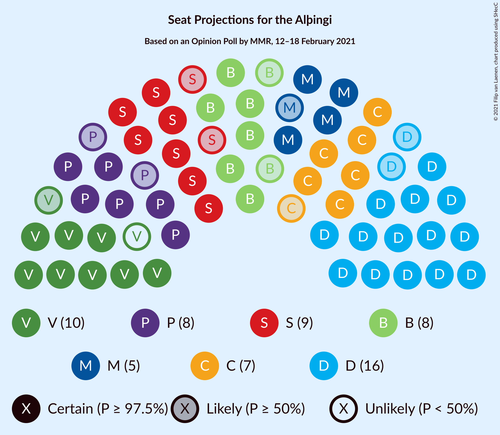
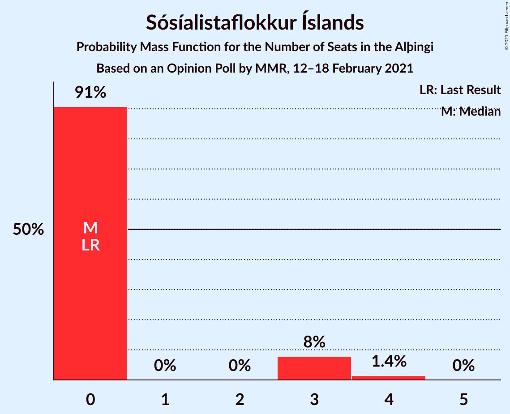
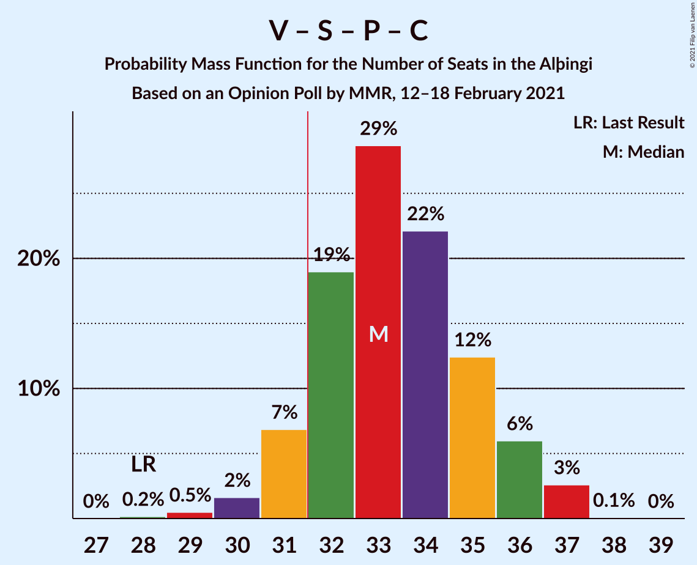
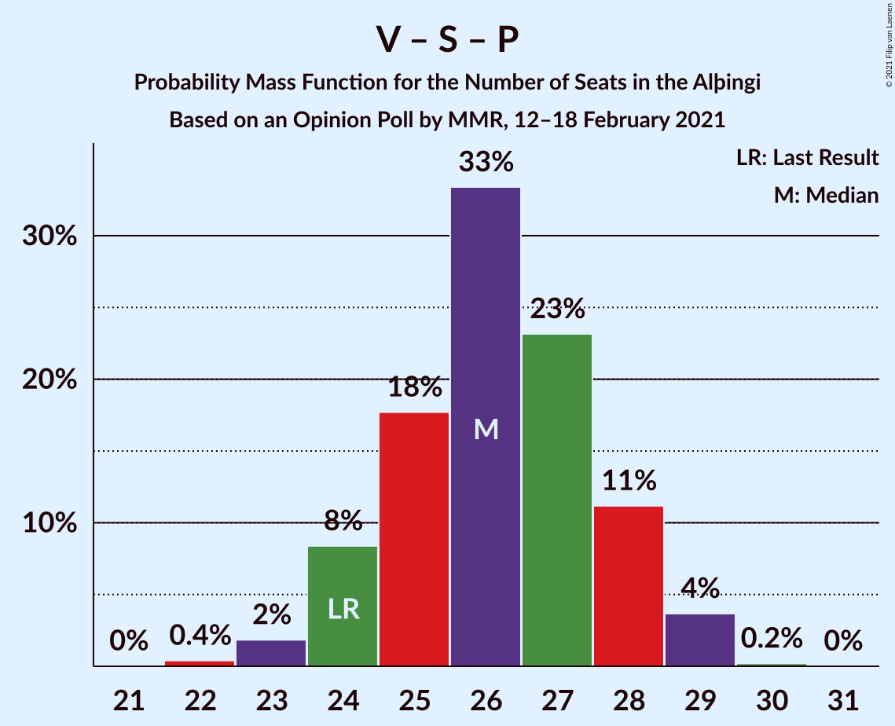

# Opinion Poll by MMR, 12–18 February 2021

<a href="#voting-intentions">Voting Intentions</a> | <a href="#seats">Seats</a> | <a href="#coalitions">Coalitions</a> | <a href="#technical-information">Technical Information</a>

## Voting Intentions

### Confidence Intervals

| Party | Last Result | Poll Result | 80% Confidence Interval | 90% Confidence Interval | 95% Confidence Interval | 99% Confidence Interval |
|:-----:|:-----------:|:-----------:|:-----------------------:|:-----------------------:|:-----------------------:|:-----------------------:|
| Sjálfstæðisflokkurinn | 25.2% | 22.2% | 20.5–24.0% |20.0–24.6% |19.6–25.0% |18.8–25.9% |
| Vinstrihreyfingin – grænt framboð | 16.9% | 13.5% | 12.1–15.0% |11.8–15.5% |11.4–15.9% |10.8–16.6% |
| Samfylkingin | 12.1% | 13.2% | 11.8–14.7% |11.4–15.1% |11.1–15.5% |10.5–16.3% |
| Framsóknarflokkurinn | 10.7% | 11.4% | 10.2–12.9% |9.8–13.3% |9.5–13.6% |9.0–14.4% |
| Píratar | 9.2% | 11.4% | 10.2–12.9% |9.8–13.3% |9.5–13.6% |9.0–14.4% |
| Viðreisn | 6.7% | 10.7% | 9.4–12.1% |9.1–12.5% |8.8–12.8% |8.3–13.5% |
| Miðflokkurinn | 10.9% | 8.1% | 7.0–9.3% |6.7–9.7% |6.5–10.0% |6.0–10.6% |
| Sósíalistaflokkur Íslands | 0.0% | 4.1% | 3.4–5.1% |3.2–5.4% |3.0–5.6% |2.7–6.1% |
| Flokkur fólksins | 6.9% | 3.6% | 2.9–4.5% |2.7–4.8% |2.6–5.0% |2.3–5.5% |

*Note:* The poll result column reflects the actual value used in the calculations. Published results may vary slightly, and in addition be rounded to fewer digits.

## Seats

### Confidence Intervals

| Party | Last Result | Median | 80% Confidence Interval | 90% Confidence Interval | 95% Confidence Interval | 99% Confidence Interval |
|:-----:|:-----------:|:------:|:-----------------------:|:-----------------------:|:-----------------------:|:-----------------------:|
| <a href="#sjálfstæðisflokkurinn">Sjálfstæðisflokkurinn</a> | 16 | 16 | 14–17 |14–18 |14–18 |13–19 |
| <a href="#vinstrihreyfingin-–-grænt-framboð">Vinstrihreyfingin – grænt framboð</a> | 11 | 9 | 8–10 |8–11 |8–11 |7–12 |
| <a href="#samfylkingin">Samfylkingin</a> | 7 | 9 | 8–10 |8–11 |8–11 |7–11 |
| <a href="#framsóknarflokkurinn">Framsóknarflokkurinn</a> | 8 | 8 | 7–10 |7–10 |6–10 |6–11 |
| <a href="#píratar">Píratar</a> | 6 | 8 | 7–9 |7–9 |6–9 |5–10 |
| <a href="#viðreisn">Viðreisn</a> | 4 | 7 | 6–9 |6–9 |6–9 |5–9 |
| <a href="#miðflokkurinn">Miðflokkurinn</a> | 7 | 5 | 5–7 |4–7 |4–7 |4–7 |
| <a href="#sósíalistaflokkur-íslands">Sósíalistaflokkur Íslands</a> | 0 | 0 | 0 |0–3 |0–3 |0–4 |
| <a href="#flokkur-fólksins">Flokkur fólksins</a> | 4 | 0 | 0 |0 |0–3 |0–3 |

### Sjálfstæðisflokkurinn

*For a full overview of the results for this party, see the [Sjálfstæðisflokkurinn](party-sjálfstæðisflokkurinn.html) page.*

| Number of Seats | Probability | Accumulated | Special Marks |
|:---------------:|:-----------:|:-----------:|:-------------:|
| 12 | 0.2% | 100% |  |
| 13 | 2% | 99.8% |  |
| 14 | 22% | 98% |  |
| 15 | 22% | 76% |  |
| 16 | 26% | 54% | Last Result, Median |
| 17 | 21% | 29% |  |
| 18 | 7% | 8% |  |
| 19 | 0.6% | 0.6% |  |
| 20 | 0% | 0% |  |

### Vinstrihreyfingin – grænt framboð

*For a full overview of the results for this party, see the [Vinstrihreyfingin – grænt framboð](party-vinstrihreyfingin–græntframboð.html) page.*

| Number of Seats | Probability | Accumulated | Special Marks |
|:---------------:|:-----------:|:-----------:|:-------------:|
| 7 | 0.7% | 100% |  |
| 8 | 23% | 99.3% |  |
| 9 | 42% | 76% | Median |
| 10 | 26% | 34% |  |
| 11 | 6% | 8% | Last Result |
| 12 | 1.5% | 1.5% |  |
| 13 | 0% | 0% |  |

### Samfylkingin

*For a full overview of the results for this party, see the [Samfylkingin](party-samfylkingin.html) page.*

| Number of Seats | Probability | Accumulated | Special Marks |
|:---------------:|:-----------:|:-----------:|:-------------:|
| 7 | 2% | 100% | Last Result |
| 8 | 21% | 98% |  |
| 9 | 39% | 76% | Median |
| 10 | 32% | 38% |  |
| 11 | 5% | 6% |  |
| 12 | 0.3% | 0.3% |  |
| 13 | 0% | 0% |  |

### Framsóknarflokkurinn

*For a full overview of the results for this party, see the [Framsóknarflokkurinn](party-framsóknarflokkurinn.html) page.*

| Number of Seats | Probability | Accumulated | Special Marks |
|:---------------:|:-----------:|:-----------:|:-------------:|
| 5 | 0.1% | 100% |  |
| 6 | 3% | 99.9% |  |
| 7 | 27% | 97% |  |
| 8 | 51% | 70% | Last Result, Median |
| 9 | 5% | 20% |  |
| 10 | 13% | 14% |  |
| 11 | 0.8% | 0.8% |  |
| 12 | 0% | 0% |  |

### Píratar

*For a full overview of the results for this party, see the [Píratar](party-píratar.html) page.*

| Number of Seats | Probability | Accumulated | Special Marks |
|:---------------:|:-----------:|:-----------:|:-------------:|
| 5 | 0.5% | 100% |  |
| 6 | 3% | 99.5% | Last Result |
| 7 | 35% | 96% |  |
| 8 | 43% | 61% | Median |
| 9 | 16% | 18% |  |
| 10 | 2% | 2% |  |
| 11 | 0.1% | 0.1% |  |
| 12 | 0% | 0% |  |

### Viðreisn

*For a full overview of the results for this party, see the [Viðreisn](party-viðreisn.html) page.*

| Number of Seats | Probability | Accumulated | Special Marks |
|:---------------:|:-----------:|:-----------:|:-------------:|
| 4 | 0% | 100% | Last Result |
| 5 | 0.8% | 100% |  |
| 6 | 26% | 99.2% |  |
| 7 | 32% | 73% | Median |
| 8 | 29% | 41% |  |
| 9 | 12% | 12% |  |
| 10 | 0.5% | 0.5% |  |
| 11 | 0% | 0% |  |

### Miðflokkurinn

*For a full overview of the results for this party, see the [Miðflokkurinn](party-miðflokkurinn.html) page.*

| Number of Seats | Probability | Accumulated | Special Marks |
|:---------------:|:-----------:|:-----------:|:-------------:|
| 3 | 0.1% | 100% |  |
| 4 | 8% | 99.9% |  |
| 5 | 42% | 92% | Median |
| 6 | 39% | 50% |  |
| 7 | 11% | 11% | Last Result |
| 8 | 0.1% | 0.3% |  |
| 9 | 0.2% | 0.2% |  |
| 10 | 0% | 0% |  |

### Sósíalistaflokkur Íslands

*For a full overview of the results for this party, see the [Sósíalistaflokkur Íslands](party-sósíalistaflokkuríslands.html) page.*

| Number of Seats | Probability | Accumulated | Special Marks |
|:---------------:|:-----------:|:-----------:|:-------------:|
| 0 | 91% | 100% | Last Result, Median |
| 1 | 0% | 9% |  |
| 2 | 0% | 9% |  |
| 3 | 8% | 9% |  |
| 4 | 1.3% | 1.3% |  |
| 5 | 0% | 0% |  |

### Flokkur fólksins

*For a full overview of the results for this party, see the [Flokkur fólksins](party-flokkurfólksins.html) page.*

| Number of Seats | Probability | Accumulated | Special Marks |
|:---------------:|:-----------:|:-----------:|:-------------:|
| 0 | 97% | 100% | Median |
| 1 | 0% | 3% |  |
| 2 | 0% | 3% |  |
| 3 | 3% | 3% |  |
| 4 | 0.2% | 0.2% | Last Result |
| 5 | 0% | 0% |  |

## Coalitions

### Confidence Intervals

| Coalition | Last Result | Median | Majority? | 80% Confidence Interval | 90% Confidence Interval | 95% Confidence Interval | 99% Confidence Interval |
|:---------:|:-----------:|:------:|:---------:|:-----------------------:|:-----------------------:|:-----------------------:|:-----------------------:|
| Vinstrihreyfingin – grænt framboð – Samfylkingin – Píratar – Viðreisn | 28 | 33 | 91% | 32–36 | 31–36 | 31–37 | 30–37 |
| Sjálfstæðisflokkurinn – Vinstrihreyfingin – grænt framboð – Framsóknarflokkurinn | 35 | 33 | 81% | 31–35 | 31–35 | 30–35 | 30–36 |
| Vinstrihreyfingin – grænt framboð – Samfylkingin – Framsóknarflokkurinn – Miðflokkurinn | 33 | 32 | 61% | 30–34 | 30–34 | 29–35 | 28–35 |
| Sjálfstæðisflokkurinn – Framsóknarflokkurinn – Miðflokkurinn | 31 | 29 | 5% | 27–31 | 26–31 | 26–32 | 26–33 |
| Vinstrihreyfingin – grænt framboð – Samfylkingin – Framsóknarflokkurinn | 26 | 26 | 0% | 25–28 | 25–29 | 24–29 | 23–30 |
| Vinstrihreyfingin – grænt framboð – Samfylkingin – Píratar | 24 | 26 | 0% | 24–28 | 24–29 | 24–29 | 23–29 |
| Sjálfstæðisflokkurinn – Samfylkingin | 23 | 25 | 0% | 23–27 | 22–27 | 22–27 | 21–28 |
| Sjálfstæðisflokkurinn – Vinstrihreyfingin – grænt framboð | 27 | 25 | 0% | 23–27 | 23–27 | 22–27 | 21–28 |
| Vinstrihreyfingin – grænt framboð – Samfylkingin – Miðflokkurinn | 25 | 24 | 0% | 22–26 | 22–26 | 21–27 | 20–27 |
| Sjálfstæðisflokkurinn – Framsóknarflokkurinn | 24 | 24 | 0% | 21–26 | 21–26 | 21–26 | 20–27 |
| Vinstrihreyfingin – grænt framboð – Framsóknarflokkurinn – Miðflokkurinn | 26 | 23 | 0% | 22–24 | 21–25 | 20–25 | 19–26 |
| Sjálfstæðisflokkurinn – Viðreisn | 20 | 23 | 0% | 21–25 | 21–25 | 20–25 | 19–26 |
| Sjálfstæðisflokkurinn – Miðflokkurinn | 23 | 21 | 0% | 19–23 | 19–23 | 18–23 | 18–24 |
| Vinstrihreyfingin – grænt framboð – Samfylkingin | 18 | 18 | 0% | 17–20 | 17–21 | 16–21 | 15–21 |
| Vinstrihreyfingin – grænt framboð – Framsóknarflokkurinn | 19 | 17 | 0% | 16–19 | 16–19 | 15–20 | 14–20 |
| Vinstrihreyfingin – grænt framboð – Píratar | 17 | 17 | 0% | 16–19 | 16–19 | 15–19 | 14–20 |
| Vinstrihreyfingin – grænt framboð – Miðflokkurinn | 18 | 15 | 0% | 13–16 | 13–16 | 13–17 | 12–18 |

### Vinstrihreyfingin – grænt framboð – Samfylkingin – Píratar – Viðreisn

| Number of Seats | Probability | Accumulated | Special Marks |
|:---------------:|:-----------:|:-----------:|:-------------:|
| 28 | 0.1% | 100% | Last Result |
| 29 | 0.4% | 99.9% |  |
| 30 | 2% | 99.6% |  |
| 31 | 6% | 98% |  |
| 32 | 24% | 91% | Majority |
| 33 | 22% | 67% | Median |
| 34 | 21% | 45% |  |
| 35 | 13% | 25% |  |
| 36 | 8% | 12% |  |
| 37 | 4% | 4% |  |
| 38 | 0% | 0% |  |

### Sjálfstæðisflokkurinn – Vinstrihreyfingin – grænt framboð – Framsóknarflokkurinn

| Number of Seats | Probability | Accumulated | Special Marks |
|:---------------:|:-----------:|:-----------:|:-------------:|
| 28 | 0.1% | 100% |  |
| 29 | 0.2% | 99.9% |  |
| 30 | 4% | 99.8% |  |
| 31 | 15% | 96% |  |
| 32 | 18% | 81% | Majority |
| 33 | 32% | 63% | Median |
| 34 | 17% | 31% |  |
| 35 | 12% | 14% | Last Result |
| 36 | 2% | 2% |  |
| 37 | 0.3% | 0.3% |  |
| 38 | 0% | 0% |  |

### Vinstrihreyfingin – grænt framboð – Samfylkingin – Framsóknarflokkurinn – Miðflokkurinn

| Number of Seats | Probability | Accumulated | Special Marks |
|:---------------:|:-----------:|:-----------:|:-------------:|
| 27 | 0.1% | 100% |  |
| 28 | 0.6% | 99.9% |  |
| 29 | 2% | 99.3% |  |
| 30 | 8% | 97% |  |
| 31 | 28% | 89% | Median |
| 32 | 29% | 61% | Majority |
| 33 | 20% | 32% | Last Result |
| 34 | 10% | 12% |  |
| 35 | 2% | 3% |  |
| 36 | 0.1% | 0.3% |  |
| 37 | 0.2% | 0.2% |  |
| 38 | 0% | 0% |  |

### Sjálfstæðisflokkurinn – Framsóknarflokkurinn – Miðflokkurinn

| Number of Seats | Probability | Accumulated | Special Marks |
|:---------------:|:-----------:|:-----------:|:-------------:|
| 24 | 0.2% | 100% |  |
| 25 | 0.2% | 99.8% |  |
| 26 | 6% | 99.5% |  |
| 27 | 10% | 94% |  |
| 28 | 16% | 83% |  |
| 29 | 21% | 67% | Median |
| 30 | 21% | 46% |  |
| 31 | 21% | 26% | Last Result |
| 32 | 4% | 5% | Majority |
| 33 | 0.6% | 0.6% |  |
| 34 | 0% | 0% |  |

### Vinstrihreyfingin – grænt framboð – Samfylkingin – Framsóknarflokkurinn

| Number of Seats | Probability | Accumulated | Special Marks |
|:---------------:|:-----------:|:-----------:|:-------------:|
| 22 | 0.2% | 100% |  |
| 23 | 0.7% | 99.8% |  |
| 24 | 4% | 99.1% |  |
| 25 | 18% | 96% |  |
| 26 | 38% | 78% | Last Result, Median |
| 27 | 20% | 40% |  |
| 28 | 15% | 20% |  |
| 29 | 4% | 5% |  |
| 30 | 0.9% | 1.2% |  |
| 31 | 0.2% | 0.2% |  |
| 32 | 0% | 0% | Majority |

### Vinstrihreyfingin – grænt framboð – Samfylkingin – Píratar

| Number of Seats | Probability | Accumulated | Special Marks |
|:---------------:|:-----------:|:-----------:|:-------------:|
| 22 | 0.3% | 100% |  |
| 23 | 1.1% | 99.6% |  |
| 24 | 11% | 98.5% | Last Result |
| 25 | 18% | 88% |  |
| 26 | 35% | 70% | Median |
| 27 | 16% | 35% |  |
| 28 | 14% | 19% |  |
| 29 | 5% | 5% |  |
| 30 | 0.2% | 0.2% |  |
| 31 | 0% | 0% |  |

### Sjálfstæðisflokkurinn – Samfylkingin

| Number of Seats | Probability | Accumulated | Special Marks |
|:---------------:|:-----------:|:-----------:|:-------------:|
| 20 | 0.2% | 100% |  |
| 21 | 0.7% | 99.8% |  |
| 22 | 6% | 99.1% |  |
| 23 | 15% | 93% | Last Result |
| 24 | 23% | 78% |  |
| 25 | 17% | 55% | Median |
| 26 | 19% | 38% |  |
| 27 | 18% | 19% |  |
| 28 | 0.8% | 1.2% |  |
| 29 | 0.4% | 0.4% |  |
| 30 | 0% | 0% |  |

### Sjálfstæðisflokkurinn – Vinstrihreyfingin – grænt framboð

| Number of Seats | Probability | Accumulated | Special Marks |
|:---------------:|:-----------:|:-----------:|:-------------:|
| 21 | 0.5% | 100% |  |
| 22 | 2% | 99.5% |  |
| 23 | 15% | 97% |  |
| 24 | 20% | 82% |  |
| 25 | 32% | 62% | Median |
| 26 | 19% | 30% |  |
| 27 | 10% | 12% | Last Result |
| 28 | 2% | 2% |  |
| 29 | 0.1% | 0.1% |  |
| 30 | 0% | 0% |  |

### Vinstrihreyfingin – grænt framboð – Samfylkingin – Miðflokkurinn

| Number of Seats | Probability | Accumulated | Special Marks |
|:---------------:|:-----------:|:-----------:|:-------------:|
| 19 | 0.1% | 100% |  |
| 20 | 0.5% | 99.9% |  |
| 21 | 3% | 99.5% |  |
| 22 | 10% | 97% |  |
| 23 | 32% | 87% | Median |
| 24 | 21% | 55% |  |
| 25 | 18% | 34% | Last Result |
| 26 | 11% | 15% |  |
| 27 | 4% | 4% |  |
| 28 | 0.1% | 0.1% |  |
| 29 | 0% | 0% |  |

### Sjálfstæðisflokkurinn – Framsóknarflokkurinn

| Number of Seats | Probability | Accumulated | Special Marks |
|:---------------:|:-----------:|:-----------:|:-------------:|
| 19 | 0.1% | 100% |  |
| 20 | 0.4% | 99.9% |  |
| 21 | 11% | 99.4% |  |
| 22 | 9% | 88% |  |
| 23 | 25% | 79% |  |
| 24 | 20% | 54% | Last Result, Median |
| 25 | 24% | 34% |  |
| 26 | 10% | 11% |  |
| 27 | 0.6% | 0.9% |  |
| 28 | 0.3% | 0.3% |  |
| 29 | 0% | 0% |  |

### Vinstrihreyfingin – grænt framboð – Framsóknarflokkurinn – Miðflokkurinn

| Number of Seats | Probability | Accumulated | Special Marks |
|:---------------:|:-----------:|:-----------:|:-------------:|
| 19 | 0.8% | 100% |  |
| 20 | 2% | 99.2% |  |
| 21 | 7% | 97% |  |
| 22 | 37% | 90% | Median |
| 23 | 30% | 54% |  |
| 24 | 15% | 24% |  |
| 25 | 6% | 9% |  |
| 26 | 2% | 2% | Last Result |
| 27 | 0.2% | 0.2% |  |
| 28 | 0% | 0% |  |

### Sjálfstæðisflokkurinn – Viðreisn

| Number of Seats | Probability | Accumulated | Special Marks |
|:---------------:|:-----------:|:-----------:|:-------------:|
| 19 | 0.5% | 100% |  |
| 20 | 2% | 99.5% | Last Result |
| 21 | 9% | 97% |  |
| 22 | 21% | 88% |  |
| 23 | 37% | 67% | Median |
| 24 | 20% | 30% |  |
| 25 | 9% | 10% |  |
| 26 | 1.1% | 1.2% |  |
| 27 | 0.1% | 0.1% |  |
| 28 | 0% | 0% |  |

### Sjálfstæðisflokkurinn – Miðflokkurinn

| Number of Seats | Probability | Accumulated | Special Marks |
|:---------------:|:-----------:|:-----------:|:-------------:|
| 17 | 0.1% | 100% |  |
| 18 | 3% | 99.9% |  |
| 19 | 13% | 97% |  |
| 20 | 24% | 84% |  |
| 21 | 15% | 60% | Median |
| 22 | 16% | 45% |  |
| 23 | 27% | 29% | Last Result |
| 24 | 2% | 2% |  |
| 25 | 0.2% | 0.2% |  |
| 26 | 0% | 0% |  |

### Vinstrihreyfingin – grænt framboð – Samfylkingin

| Number of Seats | Probability | Accumulated | Special Marks |
|:---------------:|:-----------:|:-----------:|:-------------:|
| 15 | 0.5% | 100% |  |
| 16 | 4% | 99.5% |  |
| 17 | 19% | 95% |  |
| 18 | 31% | 76% | Last Result, Median |
| 19 | 29% | 45% |  |
| 20 | 10% | 16% |  |
| 21 | 6% | 6% |  |
| 22 | 0.2% | 0.3% |  |
| 23 | 0% | 0% |  |

### Vinstrihreyfingin – grænt framboð – Framsóknarflokkurinn

| Number of Seats | Probability | Accumulated | Special Marks |
|:---------------:|:-----------:|:-----------:|:-------------:|
| 14 | 0.8% | 100% |  |
| 15 | 2% | 99.2% |  |
| 16 | 29% | 97% |  |
| 17 | 36% | 69% | Median |
| 18 | 13% | 33% |  |
| 19 | 15% | 19% | Last Result |
| 20 | 3% | 4% |  |
| 21 | 0.4% | 0.4% |  |
| 22 | 0% | 0% |  |

### Vinstrihreyfingin – grænt framboð – Píratar

| Number of Seats | Probability | Accumulated | Special Marks |
|:---------------:|:-----------:|:-----------:|:-------------:|
| 14 | 0.7% | 100% |  |
| 15 | 4% | 99.2% |  |
| 16 | 39% | 96% |  |
| 17 | 28% | 56% | Last Result, Median |
| 18 | 14% | 28% |  |
| 19 | 13% | 15% |  |
| 20 | 2% | 2% |  |
| 21 | 0% | 0% |  |

### Vinstrihreyfingin – grænt framboð – Miðflokkurinn

| Number of Seats | Probability | Accumulated | Special Marks |
|:---------------:|:-----------:|:-----------:|:-------------:|
| 11 | 0.1% | 100% |  |
| 12 | 2% | 99.9% |  |
| 13 | 10% | 98% |  |
| 14 | 35% | 88% | Median |
| 15 | 25% | 53% |  |
| 16 | 24% | 28% |  |
| 17 | 3% | 4% |  |
| 18 | 1.0% | 1.1% | Last Result |
| 19 | 0% | 0% |  |

## Technical Information

### Opinion Poll

+ **Polling firm:** MMR
+ **Commissioner(s):** —
+ **Fieldwork period:** 12–18 February 2021

### Calculations

+ **Sample size:** 919
+ **Simulations done:** 262,144
+ **Error estimate:** 1.65%

