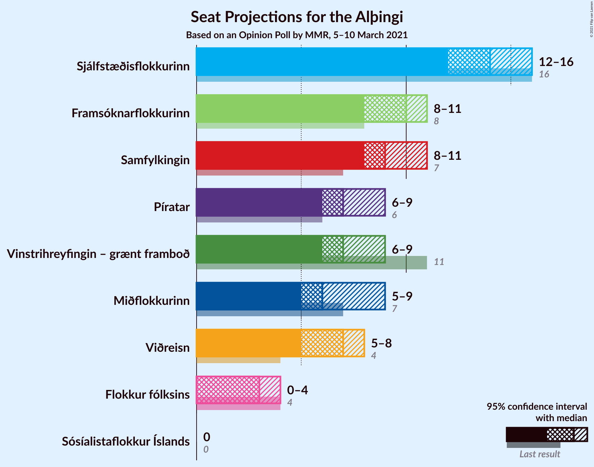

# Opinion Poll by MMR, 5–10 March 2021

<a href="#voting-intentions">Voting Intentions</a> | <a href="#seats">Seats</a> | <a href="#coalitions">Coalitions</a> | <a href="#technical-information">Technical Information</a>

## Voting Intentions

### Confidence Intervals

| Party | Last Result | Poll Result | 80% Confidence Interval | 90% Confidence Interval | 95% Confidence Interval | 99% Confidence Interval |
|:-----:|:-----------:|:-----------:|:-----------------------:|:-----------------------:|:-----------------------:|:-----------------------:|
| Sjálfstæðisflokkurinn | 25.2% | 21.0% | 19.4–22.8% |18.9–23.3% |18.6–23.7% |17.8–24.6% |
| Samfylkingin | 12.1% | 13.8% | 12.4–15.3% |12.1–15.7% |11.7–16.1% |11.1–16.9% |
| Framsóknarflokkurinn | 10.7% | 12.7% | 11.4–14.2% |11.1–14.6% |10.8–15.0% |10.2–15.7% |
| Vinstrihreyfingin – grænt framboð | 16.9% | 11.7% | 10.4–13.1% |10.1–13.5% |9.8–13.9% |9.2–14.6% |
| Píratar | 9.2% | 11.5% | 10.2–12.9% |9.9–13.3% |9.6–13.6% |9.0–14.4% |
| Viðreisn | 6.7% | 10.0% | 8.8–11.3% |8.5–11.7% |8.2–12.1% |7.7–12.7% |
| Miðflokkurinn | 10.9% | 9.4% | 8.2–10.7% |7.9–11.1% |7.7–11.4% |7.2–12.0% |
| Flokkur fólksins | 6.9% | 5.2% | 4.3–6.2% |4.1–6.5% |3.9–6.8% |3.6–7.3% |
| Sósíalistaflokkur Íslands | 0.0% | 3.8% | 3.1–4.7% |2.9–5.0% |2.7–5.2% |2.5–5.7% |

*Note:* The poll result column reflects the actual value used in the calculations. Published results may vary slightly, and in addition be rounded to fewer digits.

## Seats

### Confidence Intervals

| Party | Last Result | Median | 80% Confidence Interval | 90% Confidence Interval | 95% Confidence Interval | 99% Confidence Interval |
|:-----:|:-----------:|:------:|:-----------------------:|:-----------------------:|:-----------------------:|:-----------------------:|
| <a href="#sjálfstæðisflokkurinn">Sjálfstæðisflokkurinn</a> | 16 | 14 | 13–15 |12–16 |12–16 |12–18 |
| <a href="#samfylkingin">Samfylkingin</a> | 7 | 9 | 9–11 |8–11 |8–11 |7–12 |
| <a href="#framsóknarflokkurinn">Framsóknarflokkurinn</a> | 8 | 10 | 8–11 |8–11 |8–11 |7–11 |
| <a href="#vinstrihreyfingin-–-grænt-framboð">Vinstrihreyfingin – grænt framboð</a> | 11 | 8 | 6–9 |6–9 |6–10 |6–10 |
| <a href="#píratar">Píratar</a> | 6 | 7 | 7–9 |6–9 |6–9 |5–10 |
| <a href="#viðreisn">Viðreisn</a> | 4 | 7 | 6–7 |5–8 |5–8 |5–8 |
| <a href="#miðflokkurinn">Miðflokkurinn</a> | 7 | 6 | 6–7 |5–8 |5–9 |4–9 |
| <a href="#flokkur-fólksins">Flokkur fólksins</a> | 4 | 0 | 0–3 |0–4 |0–4 |0–4 |
| <a href="#sósíalistaflokkur-íslands">Sósíalistaflokkur Íslands</a> | 0 | 0 | 0 |0 |0–3 |0–3 |

### Sjálfstæðisflokkurinn

*For a full overview of the results for this party, see the [Sjálfstæðisflokkurinn](party-sjálfstæðisflokkurinn.html) page.*

| Number of Seats | Probability | Accumulated | Special Marks |
|:---------------:|:-----------:|:-----------:|:-------------:|
| 11 | 0.3% | 100% |  |
| 12 | 5% | 99.7% |  |
| 13 | 36% | 94% |  |
| 14 | 34% | 58% | Median |
| 15 | 18% | 24% |  |
| 16 | 4% | 6% | Last Result |
| 17 | 1.5% | 2% |  |
| 18 | 0.5% | 0.5% |  |
| 19 | 0% | 0% |  |

### Samfylkingin

*For a full overview of the results for this party, see the [Samfylkingin](party-samfylkingin.html) page.*

| Number of Seats | Probability | Accumulated | Special Marks |
|:---------------:|:-----------:|:-----------:|:-------------:|
| 7 | 2% | 100% | Last Result |
| 8 | 8% | 98% |  |
| 9 | 41% | 90% | Median |
| 10 | 37% | 49% |  |
| 11 | 11% | 12% |  |
| 12 | 1.0% | 1.0% |  |
| 13 | 0% | 0% |  |

### Framsóknarflokkurinn

*For a full overview of the results for this party, see the [Framsóknarflokkurinn](party-framsóknarflokkurinn.html) page.*

| Number of Seats | Probability | Accumulated | Special Marks |
|:---------------:|:-----------:|:-----------:|:-------------:|
| 6 | 0.1% | 100% |  |
| 7 | 1.3% | 99.9% |  |
| 8 | 13% | 98.5% | Last Result |
| 9 | 13% | 86% |  |
| 10 | 52% | 73% | Median |
| 11 | 21% | 21% |  |
| 12 | 0.3% | 0.3% |  |
| 13 | 0% | 0% |  |

### Vinstrihreyfingin – grænt framboð

*For a full overview of the results for this party, see the [Vinstrihreyfingin – grænt framboð](party-vinstrihreyfingin–græntframboð.html) page.*

| Number of Seats | Probability | Accumulated | Special Marks |
|:---------------:|:-----------:|:-----------:|:-------------:|
| 5 | 0.1% | 100% |  |
| 6 | 10% | 99.9% |  |
| 7 | 40% | 90% |  |
| 8 | 37% | 50% | Median |
| 9 | 11% | 14% |  |
| 10 | 3% | 3% |  |
| 11 | 0.1% | 0.1% | Last Result |
| 12 | 0% | 0% |  |

### Píratar

*For a full overview of the results for this party, see the [Píratar](party-píratar.html) page.*

| Number of Seats | Probability | Accumulated | Special Marks |
|:---------------:|:-----------:|:-----------:|:-------------:|
| 5 | 0.5% | 100% |  |
| 6 | 6% | 99.5% | Last Result |
| 7 | 47% | 94% | Median |
| 8 | 29% | 47% |  |
| 9 | 17% | 17% |  |
| 10 | 0.8% | 0.8% |  |
| 11 | 0% | 0% |  |

### Viðreisn

*For a full overview of the results for this party, see the [Viðreisn](party-viðreisn.html) page.*

| Number of Seats | Probability | Accumulated | Special Marks |
|:---------------:|:-----------:|:-----------:|:-------------:|
| 4 | 0.1% | 100% | Last Result |
| 5 | 5% | 99.9% |  |
| 6 | 43% | 95% |  |
| 7 | 45% | 52% | Median |
| 8 | 7% | 7% |  |
| 9 | 0.3% | 0.3% |  |
| 10 | 0% | 0% |  |

### Miðflokkurinn

*For a full overview of the results for this party, see the [Miðflokkurinn](party-miðflokkurinn.html) page.*

| Number of Seats | Probability | Accumulated | Special Marks |
|:---------------:|:-----------:|:-----------:|:-------------:|
| 4 | 0.6% | 100% |  |
| 5 | 9% | 99.4% |  |
| 6 | 41% | 90% | Median |
| 7 | 43% | 49% | Last Result |
| 8 | 2% | 6% |  |
| 9 | 4% | 4% |  |
| 10 | 0.1% | 0.1% |  |
| 11 | 0% | 0% |  |

### Flokkur fólksins

*For a full overview of the results for this party, see the [Flokkur fólksins](party-flokkurfólksins.html) page.*

| Number of Seats | Probability | Accumulated | Special Marks |
|:---------------:|:-----------:|:-----------:|:-------------:|
| 0 | 51% | 100% | Median |
| 1 | 0% | 49% |  |
| 2 | 0% | 49% |  |
| 3 | 40% | 49% |  |
| 4 | 9% | 9% | Last Result |
| 5 | 0.3% | 0.3% |  |
| 6 | 0% | 0% |  |

### Sósíalistaflokkur Íslands

*For a full overview of the results for this party, see the [Sósíalistaflokkur Íslands](party-sósíalistaflokkuríslands.html) page.*

| Number of Seats | Probability | Accumulated | Special Marks |
|:---------------:|:-----------:|:-----------:|:-------------:|
| 0 | 96% | 100% | Last Result, Median |
| 1 | 0% | 4% |  |
| 2 | 0% | 4% |  |
| 3 | 4% | 4% |  |
| 4 | 0.1% | 0.1% |  |
| 5 | 0% | 0% |  |

## Coalitions

### Confidence Intervals

| Coalition | Last Result | Median | Majority? | 80% Confidence Interval | 90% Confidence Interval | 95% Confidence Interval | 99% Confidence Interval |
|:---------:|:-----------:|:------:|:---------:|:-----------------------:|:-----------------------:|:-----------------------:|:-----------------------:|
| Samfylkingin – Framsóknarflokkurinn – Vinstrihreyfingin – grænt framboð – Miðflokkurinn | 33 | 34 | 90% | 32–35 | 31–36 | 30–36 | 28–37 |
| Sjálfstæðisflokkurinn – Framsóknarflokkurinn – Vinstrihreyfingin – grænt framboð | 35 | 31 | 40% | 30–33 | 29–33 | 28–34 | 28–34 |
| Samfylkingin – Vinstrihreyfingin – grænt framboð – Píratar – Viðreisn | 28 | 31 | 41% | 29–33 | 29–34 | 28–34 | 27–35 |
| Sjálfstæðisflokkurinn – Framsóknarflokkurinn – Miðflokkurinn | 31 | 30 | 18% | 28–33 | 27–33 | 27–33 | 27–33 |
| Samfylkingin – Framsóknarflokkurinn – Vinstrihreyfingin – grænt framboð | 26 | 27 | 0% | 25–29 | 24–29 | 24–30 | 22–30 |
| Samfylkingin – Vinstrihreyfingin – grænt framboð – Píratar | 24 | 24 | 0% | 23–27 | 23–27 | 22–27 | 21–28 |
| Framsóknarflokkurinn – Vinstrihreyfingin – grænt framboð – Miðflokkurinn | 26 | 24 | 0% | 22–25 | 22–26 | 21–26 | 20–27 |
| Sjálfstæðisflokkurinn – Framsóknarflokkurinn | 24 | 24 | 0% | 22–26 | 21–26 | 21–26 | 20–27 |
| Samfylkingin – Vinstrihreyfingin – grænt framboð – Miðflokkurinn | 25 | 23 | 0% | 22–25 | 21–26 | 21–26 | 20–27 |
| Sjálfstæðisflokkurinn – Samfylkingin | 23 | 23 | 0% | 22–25 | 22–25 | 21–26 | 20–27 |
| Sjálfstæðisflokkurinn – Vinstrihreyfingin – grænt framboð | 27 | 21 | 0% | 20–23 | 20–24 | 19–25 | 19–26 |
| Sjálfstæðisflokkurinn – Viðreisn | 20 | 20 | 0% | 19–22 | 19–22 | 19–23 | 18–24 |
| Sjálfstæðisflokkurinn – Miðflokkurinn | 23 | 20 | 0% | 19–22 | 18–23 | 18–23 | 17–24 |
| Samfylkingin – Vinstrihreyfingin – grænt framboð | 18 | 17 | 0% | 15–19 | 15–19 | 15–20 | 14–20 |
| Framsóknarflokkurinn – Vinstrihreyfingin – grænt framboð | 19 | 17 | 0% | 16–19 | 15–19 | 15–19 | 14–20 |
| Vinstrihreyfingin – grænt framboð – Píratar | 17 | 15 | 0% | 14–17 | 14–17 | 13–17 | 12–18 |
| Vinstrihreyfingin – grænt framboð – Miðflokkurinn | 18 | 14 | 0% | 13–16 | 12–16 | 12–16 | 11–17 |

### Samfylkingin – Framsóknarflokkurinn – Vinstrihreyfingin – grænt framboð – Miðflokkurinn

| Number of Seats | Probability | Accumulated | Special Marks |
|:---------------:|:-----------:|:-----------:|:-------------:|
| 27 | 0.3% | 100% |  |
| 28 | 0.5% | 99.7% |  |
| 29 | 1.4% | 99.2% |  |
| 30 | 2% | 98% |  |
| 31 | 5% | 95% |  |
| 32 | 11% | 90% | Majority |
| 33 | 27% | 79% | Last Result, Median |
| 34 | 38% | 52% |  |
| 35 | 7% | 14% |  |
| 36 | 7% | 7% |  |
| 37 | 0.5% | 0.5% |  |
| 38 | 0% | 0% |  |

### Sjálfstæðisflokkurinn – Framsóknarflokkurinn – Vinstrihreyfingin – grænt framboð

| Number of Seats | Probability | Accumulated | Special Marks |
|:---------------:|:-----------:|:-----------:|:-------------:|
| 27 | 0.4% | 100% |  |
| 28 | 4% | 99.6% |  |
| 29 | 5% | 96% |  |
| 30 | 18% | 90% |  |
| 31 | 32% | 72% |  |
| 32 | 19% | 40% | Median, Majority |
| 33 | 17% | 21% |  |
| 34 | 3% | 4% |  |
| 35 | 0.3% | 0.4% | Last Result |
| 36 | 0.1% | 0.1% |  |
| 37 | 0% | 0% |  |

### Samfylkingin – Vinstrihreyfingin – grænt framboð – Píratar – Viðreisn

| Number of Seats | Probability | Accumulated | Special Marks |
|:---------------:|:-----------:|:-----------:|:-------------:|
| 25 | 0.1% | 100% |  |
| 26 | 0.2% | 99.9% |  |
| 27 | 0.4% | 99.8% |  |
| 28 | 3% | 99.4% | Last Result |
| 29 | 10% | 97% |  |
| 30 | 32% | 87% |  |
| 31 | 14% | 55% | Median |
| 32 | 10% | 41% | Majority |
| 33 | 22% | 31% |  |
| 34 | 8% | 9% |  |
| 35 | 0.7% | 0.9% |  |
| 36 | 0.2% | 0.2% |  |
| 37 | 0% | 0% |  |

### Sjálfstæðisflokkurinn – Framsóknarflokkurinn – Miðflokkurinn

| Number of Seats | Probability | Accumulated | Special Marks |
|:---------------:|:-----------:|:-----------:|:-------------:|
| 25 | 0% | 100% |  |
| 26 | 0.4% | 99.9% |  |
| 27 | 6% | 99.6% |  |
| 28 | 5% | 94% |  |
| 29 | 19% | 89% |  |
| 30 | 36% | 69% | Median |
| 31 | 15% | 33% | Last Result |
| 32 | 6% | 18% | Majority |
| 33 | 11% | 12% |  |
| 34 | 0.3% | 0.3% |  |
| 35 | 0% | 0% |  |

### Samfylkingin – Framsóknarflokkurinn – Vinstrihreyfingin – grænt framboð

| Number of Seats | Probability | Accumulated | Special Marks |
|:---------------:|:-----------:|:-----------:|:-------------:|
| 21 | 0.1% | 100% |  |
| 22 | 0.6% | 99.9% |  |
| 23 | 1.3% | 99.4% |  |
| 24 | 4% | 98% |  |
| 25 | 11% | 94% |  |
| 26 | 16% | 83% | Last Result |
| 27 | 39% | 67% | Median |
| 28 | 14% | 28% |  |
| 29 | 11% | 14% |  |
| 30 | 2% | 3% |  |
| 31 | 0.5% | 0.5% |  |
| 32 | 0% | 0% | Majority |

### Samfylkingin – Vinstrihreyfingin – grænt framboð – Píratar

| Number of Seats | Probability | Accumulated | Special Marks |
|:---------------:|:-----------:|:-----------:|:-------------:|
| 19 | 0.1% | 100% |  |
| 20 | 0.1% | 99.9% |  |
| 21 | 0.4% | 99.8% |  |
| 22 | 3% | 99.4% |  |
| 23 | 27% | 96% |  |
| 24 | 27% | 69% | Last Result, Median |
| 25 | 8% | 42% |  |
| 26 | 13% | 34% |  |
| 27 | 20% | 21% |  |
| 28 | 1.4% | 2% |  |
| 29 | 0.1% | 0.2% |  |
| 30 | 0.1% | 0.1% |  |
| 31 | 0% | 0% |  |

### Framsóknarflokkurinn – Vinstrihreyfingin – grænt framboð – Miðflokkurinn

| Number of Seats | Probability | Accumulated | Special Marks |
|:---------------:|:-----------:|:-----------:|:-------------:|
| 19 | 0.3% | 100% |  |
| 20 | 1.5% | 99.7% |  |
| 21 | 3% | 98% |  |
| 22 | 7% | 95% |  |
| 23 | 25% | 89% |  |
| 24 | 34% | 64% | Median |
| 25 | 22% | 30% |  |
| 26 | 7% | 8% | Last Result |
| 27 | 0.9% | 1.0% |  |
| 28 | 0% | 0.1% |  |
| 29 | 0% | 0% |  |

### Sjálfstæðisflokkurinn – Framsóknarflokkurinn

| Number of Seats | Probability | Accumulated | Special Marks |
|:---------------:|:-----------:|:-----------:|:-------------:|
| 19 | 0% | 100% |  |
| 20 | 2% | 99.9% |  |
| 21 | 4% | 98% |  |
| 22 | 8% | 94% |  |
| 23 | 36% | 86% |  |
| 24 | 29% | 51% | Last Result, Median |
| 25 | 9% | 22% |  |
| 26 | 12% | 13% |  |
| 27 | 0.6% | 0.7% |  |
| 28 | 0.1% | 0.1% |  |
| 29 | 0% | 0% |  |

### Samfylkingin – Vinstrihreyfingin – grænt framboð – Miðflokkurinn

| Number of Seats | Probability | Accumulated | Special Marks |
|:---------------:|:-----------:|:-----------:|:-------------:|
| 19 | 0.3% | 100% |  |
| 20 | 0.9% | 99.6% |  |
| 21 | 5% | 98.8% |  |
| 22 | 15% | 94% |  |
| 23 | 31% | 79% | Median |
| 24 | 21% | 48% |  |
| 25 | 17% | 27% | Last Result |
| 26 | 9% | 10% |  |
| 27 | 0.8% | 0.9% |  |
| 28 | 0.1% | 0.1% |  |
| 29 | 0% | 0% |  |

### Sjálfstæðisflokkurinn – Samfylkingin

| Number of Seats | Probability | Accumulated | Special Marks |
|:---------------:|:-----------:|:-----------:|:-------------:|
| 20 | 1.4% | 100% |  |
| 21 | 4% | 98.6% |  |
| 22 | 19% | 95% |  |
| 23 | 31% | 76% | Last Result, Median |
| 24 | 32% | 45% |  |
| 25 | 9% | 14% |  |
| 26 | 2% | 4% |  |
| 27 | 2% | 2% |  |
| 28 | 0.3% | 0.3% |  |
| 29 | 0% | 0% |  |

### Sjálfstæðisflokkurinn – Vinstrihreyfingin – grænt framboð

| Number of Seats | Probability | Accumulated | Special Marks |
|:---------------:|:-----------:|:-----------:|:-------------:|
| 18 | 0.2% | 100% |  |
| 19 | 5% | 99.8% |  |
| 20 | 22% | 95% |  |
| 21 | 25% | 73% |  |
| 22 | 33% | 49% | Median |
| 23 | 10% | 16% |  |
| 24 | 3% | 5% |  |
| 25 | 1.4% | 3% |  |
| 26 | 1.2% | 1.4% |  |
| 27 | 0.1% | 0.1% | Last Result |
| 28 | 0% | 0% |  |

### Sjálfstæðisflokkurinn – Viðreisn

| Number of Seats | Probability | Accumulated | Special Marks |
|:---------------:|:-----------:|:-----------:|:-------------:|
| 17 | 0.3% | 100% |  |
| 18 | 2% | 99.7% |  |
| 19 | 17% | 98% |  |
| 20 | 47% | 80% | Last Result |
| 21 | 10% | 33% | Median |
| 22 | 19% | 23% |  |
| 23 | 4% | 5% |  |
| 24 | 0.7% | 0.9% |  |
| 25 | 0.2% | 0.2% |  |
| 26 | 0% | 0% |  |

### Sjálfstæðisflokkurinn – Miðflokkurinn

| Number of Seats | Probability | Accumulated | Special Marks |
|:---------------:|:-----------:|:-----------:|:-------------:|
| 16 | 0.1% | 100% |  |
| 17 | 0.7% | 99.9% |  |
| 18 | 5% | 99.2% |  |
| 19 | 24% | 94% |  |
| 20 | 28% | 70% | Median |
| 21 | 20% | 42% |  |
| 22 | 15% | 21% |  |
| 23 | 4% | 6% | Last Result |
| 24 | 2% | 2% |  |
| 25 | 0.2% | 0.3% |  |
| 26 | 0% | 0% |  |

### Samfylkingin – Vinstrihreyfingin – grænt framboð

| Number of Seats | Probability | Accumulated | Special Marks |
|:---------------:|:-----------:|:-----------:|:-------------:|
| 13 | 0.1% | 100% |  |
| 14 | 1.4% | 99.9% |  |
| 15 | 10% | 98% |  |
| 16 | 25% | 88% |  |
| 17 | 25% | 63% | Median |
| 18 | 24% | 39% | Last Result |
| 19 | 12% | 15% |  |
| 20 | 3% | 3% |  |
| 21 | 0.1% | 0.1% |  |
| 22 | 0% | 0% |  |

### Framsóknarflokkurinn – Vinstrihreyfingin – grænt framboð

| Number of Seats | Probability | Accumulated | Special Marks |
|:---------------:|:-----------:|:-----------:|:-------------:|
| 13 | 0.1% | 100% |  |
| 14 | 1.5% | 99.9% |  |
| 15 | 5% | 98% |  |
| 16 | 13% | 93% |  |
| 17 | 32% | 80% |  |
| 18 | 35% | 49% | Median |
| 19 | 12% | 13% | Last Result |
| 20 | 2% | 2% |  |
| 21 | 0% | 0% |  |

### Vinstrihreyfingin – grænt framboð – Píratar

| Number of Seats | Probability | Accumulated | Special Marks |
|:---------------:|:-----------:|:-----------:|:-------------:|
| 12 | 0.5% | 100% |  |
| 13 | 3% | 99.4% |  |
| 14 | 35% | 96% |  |
| 15 | 23% | 61% | Median |
| 16 | 19% | 38% |  |
| 17 | 17% | 19% | Last Result |
| 18 | 2% | 2% |  |
| 19 | 0.2% | 0.2% |  |
| 20 | 0% | 0% |  |

### Vinstrihreyfingin – grænt framboð – Miðflokkurinn

| Number of Seats | Probability | Accumulated | Special Marks |
|:---------------:|:-----------:|:-----------:|:-------------:|
| 11 | 1.1% | 100% |  |
| 12 | 5% | 98.9% |  |
| 13 | 27% | 93% |  |
| 14 | 33% | 67% | Median |
| 15 | 22% | 34% |  |
| 16 | 10% | 12% |  |
| 17 | 1.4% | 2% |  |
| 18 | 0.2% | 0.2% | Last Result |
| 19 | 0% | 0% |  |

## Technical Information

### Opinion Poll

+ **Polling firm:** MMR
+ **Commissioner(s):** —
+ **Fieldwork period:** 5–10 March 2021

### Calculations

+ **Sample size:** 951
+ **Simulations done:** 524,288
+ **Error estimate:** 2.30%

