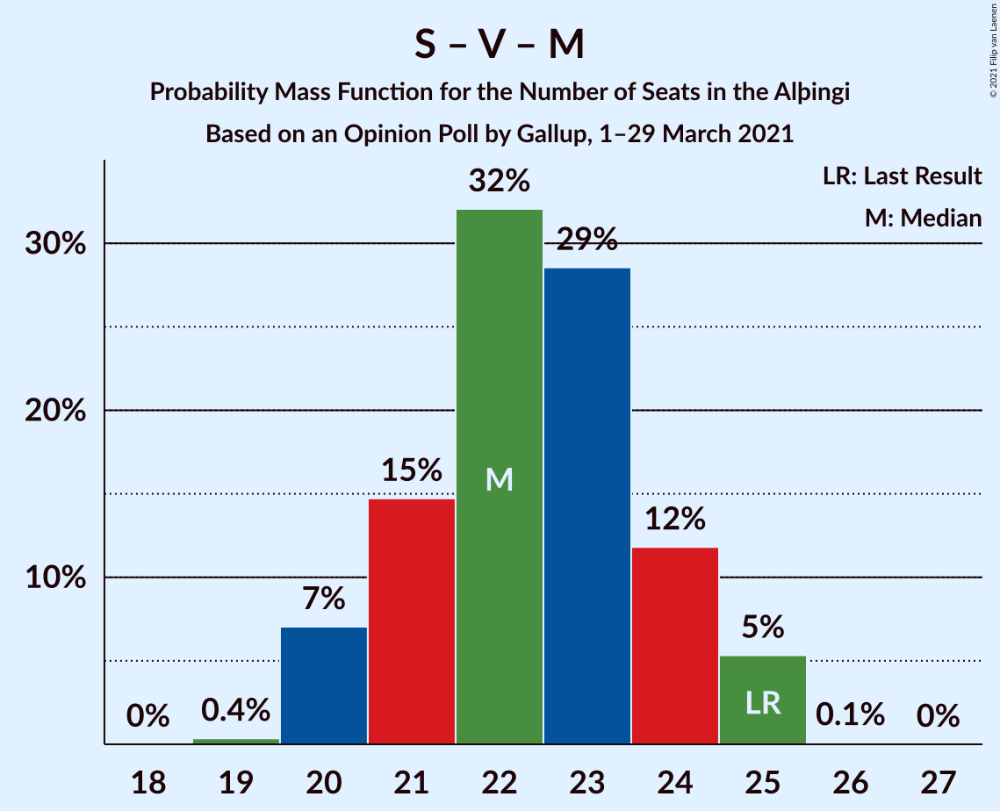

# Opinion Poll by Gallup, 1–29 March 2021

<a href="#voting-intentions">Voting Intentions</a> | <a href="#seats">Seats</a> | <a href="#coalitions">Coalitions</a> | <a href="#technical-information">Technical Information</a>

## Voting Intentions

### Confidence Intervals

| Party | Last Result | Poll Result | 80% Confidence Interval | 90% Confidence Interval | 95% Confidence Interval | 99% Confidence Interval |
|:-----:|:-----------:|:-----------:|:-----------------------:|:-----------------------:|:-----------------------:|:-----------------------:|
| Sjálfstæðisflokkurinn | 25.2% | 23.0% | 22.3–23.8% |22.1–24.0% |21.9–24.2% |21.6–24.5% |
| Samfylkingin | 12.1% | 12.7% | 12.1–13.3% |12.0–13.5% |11.8–13.6% |11.6–13.9% |
| Vinstrihreyfingin – grænt framboð | 16.9% | 12.3% | 11.7–12.9% |11.6–13.1% |11.4–13.2% |11.2–13.5% |
| Píratar | 9.2% | 11.5% | 11.0–12.1% |10.8–12.3% |10.7–12.4% |10.4–12.7% |
| Framsóknarflokkurinn | 10.7% | 11.1% | 10.6–11.7% |10.4–11.8% |10.3–12.0% |10.0–12.3% |
| Miðflokkurinn | 10.9% | 9.5% | 9.0–10.0% |8.9–10.2% |8.7–10.3% |8.5–10.6% |
| Viðreisn | 6.7% | 9.5% | 9.0–10.0% |8.9–10.2% |8.7–10.3% |8.5–10.6% |
| Flokkur fólksins | 6.9% | 5.0% | 4.6–5.4% |4.5–5.5% |4.4–5.6% |4.3–5.8% |
| Sósíalistaflokkur Íslands | 0.0% | 5.0% | 4.6–5.4% |4.5–5.5% |4.4–5.6% |4.3–5.8% |

*Note:* The poll result column reflects the actual value used in the calculations. Published results may vary slightly, and in addition be rounded to fewer digits.

## Seats

### Confidence Intervals

| Party | Last Result | Median | 80% Confidence Interval | 90% Confidence Interval | 95% Confidence Interval | 99% Confidence Interval |
|:-----:|:-----------:|:------:|:-----------------------:|:-----------------------:|:-----------------------:|:-----------------------:|
| <a href="#sjálfstæðisflokkurinn">Sjálfstæðisflokkurinn</a> | 16 | 16 | 15–17 |15–17 |15–17 |14–18 |
| <a href="#samfylkingin">Samfylkingin</a> | 7 | 8 | 7–9 |7–9 |7–9 |7–10 |
| <a href="#vinstrihreyfingin-–-grænt-framboð">Vinstrihreyfingin – grænt framboð</a> | 11 | 8 | 7–9 |7–9 |7–9 |7–9 |
| <a href="#píratar">Píratar</a> | 6 | 7 | 7–8 |7–8 |6–8 |6–9 |
| <a href="#framsóknarflokkurinn">Framsóknarflokkurinn</a> | 8 | 8 | 7–8 |7–8 |7–8 |7–8 |
| <a href="#miðflokkurinn">Miðflokkurinn</a> | 7 | 6 | 5–7 |5–7 |5–7 |5–7 |
| <a href="#viðreisn">Viðreisn</a> | 4 | 6 | 5–6 |5–7 |5–7 |5–7 |
| <a href="#flokkur-fólksins">Flokkur fólksins</a> | 4 | 3 | 0–3 |0–3 |0–3 |0–4 |
| <a href="#sósíalistaflokkur-íslands">Sósíalistaflokkur Íslands</a> | 0 | 3 | 0–3 |0–3 |0–3 |0–3 |

### Sjálfstæðisflokkurinn

*For a full overview of the results for this party, see the [Sjálfstæðisflokkurinn](party-sjálfstæðisflokkurinn.html) page.*

| Number of Seats | Probability | Accumulated | Special Marks |
|:---------------:|:-----------:|:-----------:|:-------------:|
| 14 | 0.5% | 100% |  |
| 15 | 35% | 99.5% |  |
| 16 | 25% | 64% | Last Result, Median |
| 17 | 38% | 39% |  |
| 18 | 0.6% | 0.6% |  |
| 19 | 0% | 0% |  |

### Samfylkingin

*For a full overview of the results for this party, see the [Samfylkingin](party-samfylkingin.html) page.*

| Number of Seats | Probability | Accumulated | Special Marks |
|:---------------:|:-----------:|:-----------:|:-------------:|
| 6 | 0.2% | 100% |  |
| 7 | 15% | 99.8% | Last Result |
| 8 | 40% | 84% | Median |
| 9 | 44% | 45% |  |
| 10 | 0.6% | 0.6% |  |
| 11 | 0% | 0% |  |

### Vinstrihreyfingin – grænt framboð

*For a full overview of the results for this party, see the [Vinstrihreyfingin – grænt framboð](party-vinstrihreyfingin–græntframboð.html) page.*

| Number of Seats | Probability | Accumulated | Special Marks |
|:---------------:|:-----------:|:-----------:|:-------------:|
| 7 | 24% | 100% |  |
| 8 | 41% | 76% | Median |
| 9 | 35% | 35% |  |
| 10 | 0.3% | 0.3% |  |
| 11 | 0% | 0% | Last Result |

### Píratar

*For a full overview of the results for this party, see the [Píratar](party-píratar.html) page.*

| Number of Seats | Probability | Accumulated | Special Marks |
|:---------------:|:-----------:|:-----------:|:-------------:|
| 6 | 4% | 100% | Last Result |
| 7 | 52% | 96% | Median |
| 8 | 42% | 44% |  |
| 9 | 1.4% | 1.4% |  |
| 10 | 0% | 0% |  |

### Framsóknarflokkurinn

*For a full overview of the results for this party, see the [Framsóknarflokkurinn](party-framsóknarflokkurinn.html) page.*

| Number of Seats | Probability | Accumulated | Special Marks |
|:---------------:|:-----------:|:-----------:|:-------------:|
| 6 | 0.1% | 100% |  |
| 7 | 16% | 99.9% |  |
| 8 | 84% | 84% | Last Result, Median |
| 9 | 0.2% | 0.2% |  |
| 10 | 0% | 0% |  |

### Miðflokkurinn

*For a full overview of the results for this party, see the [Miðflokkurinn](party-miðflokkurinn.html) page.*

| Number of Seats | Probability | Accumulated | Special Marks |
|:---------------:|:-----------:|:-----------:|:-------------:|
| 5 | 15% | 100% |  |
| 6 | 73% | 85% | Median |
| 7 | 13% | 13% | Last Result |
| 8 | 0% | 0% |  |

### Viðreisn

*For a full overview of the results for this party, see the [Viðreisn](party-viðreisn.html) page.*

| Number of Seats | Probability | Accumulated | Special Marks |
|:---------------:|:-----------:|:-----------:|:-------------:|
| 4 | 0% | 100% | Last Result |
| 5 | 32% | 100% |  |
| 6 | 59% | 68% | Median |
| 7 | 9% | 9% |  |
| 8 | 0% | 0% |  |

### Flokkur fólksins

*For a full overview of the results for this party, see the [Flokkur fólksins](party-flokkurfólksins.html) page.*

| Number of Seats | Probability | Accumulated | Special Marks |
|:---------------:|:-----------:|:-----------:|:-------------:|
| 0 | 40% | 100% |  |
| 1 | 0% | 60% |  |
| 2 | 0% | 60% |  |
| 3 | 59% | 60% | Median |
| 4 | 1.5% | 1.5% | Last Result |
| 5 | 0% | 0% |  |

### Sósíalistaflokkur Íslands

*For a full overview of the results for this party, see the [Sósíalistaflokkur Íslands](party-sósíalistaflokkuríslands.html) page.*

| Number of Seats | Probability | Accumulated | Special Marks |
|:---------------:|:-----------:|:-----------:|:-------------:|
| 0 | 42% | 100% | Last Result |
| 1 | 0% | 58% |  |
| 2 | 0% | 58% |  |
| 3 | 58% | 58% | Median |
| 4 | 0.4% | 0.4% |  |
| 5 | 0% | 0% |  |

## Coalitions

### Confidence Intervals

| Coalition | Last Result | Median | Majority? | 80% Confidence Interval | 90% Confidence Interval | 95% Confidence Interval | 99% Confidence Interval |
|:---------:|:-----------:|:------:|:---------:|:-----------------------:|:-----------------------:|:-----------------------:|:-----------------------:|
| Sjálfstæðisflokkurinn – Vinstrihreyfingin – grænt framboð – Framsóknarflokkurinn | 35 | 32 | 63% | 30–34 | 30–34 | 30–34 | 30–34 |
| Samfylkingin – Vinstrihreyfingin – grænt framboð – Framsóknarflokkurinn – Miðflokkurinn | 33 | 30 | 14% | 29–32 | 28–32 | 28–33 | 27–33 |
| Sjálfstæðisflokkurinn – Framsóknarflokkurinn – Miðflokkurinn | 31 | 30 | 4% | 29–31 | 28–31 | 28–32 | 27–32 |
| Samfylkingin – Vinstrihreyfingin – grænt framboð – Píratar – Viðreisn | 28 | 30 | 14% | 27–32 | 27–32 | 26–32 | 26–33 |
| Sjálfstæðisflokkurinn – Samfylkingin | 23 | 24 | 0% | 23–25 | 23–26 | 23–26 | 22–27 |
| Samfylkingin – Vinstrihreyfingin – grænt framboð – Framsóknarflokkurinn | 26 | 24 | 0% | 23–25 | 22–26 | 22–26 | 22–26 |
| Sjálfstæðisflokkurinn – Vinstrihreyfingin – grænt framboð | 27 | 24 | 0% | 22–26 | 22–26 | 22–26 | 22–26 |
| Samfylkingin – Vinstrihreyfingin – grænt framboð – Píratar | 24 | 24 | 0% | 22–25 | 21–26 | 21–26 | 20–27 |
| Sjálfstæðisflokkurinn – Framsóknarflokkurinn | 24 | 24 | 0% | 23–25 | 22–25 | 22–25 | 22–25 |
| Samfylkingin – Vinstrihreyfingin – grænt framboð – Miðflokkurinn | 25 | 22 | 0% | 21–24 | 20–25 | 20–25 | 20–25 |
| Sjálfstæðisflokkurinn – Miðflokkurinn | 23 | 22 | 0% | 21–23 | 21–24 | 21–24 | 20–24 |
| Vinstrihreyfingin – grænt framboð – Framsóknarflokkurinn – Miðflokkurinn | 26 | 22 | 0% | 21–23 | 21–24 | 20–24 | 20–24 |
| Sjálfstæðisflokkurinn – Viðreisn | 20 | 22 | 0% | 20–23 | 20–23 | 20–24 | 20–24 |
| Samfylkingin – Vinstrihreyfingin – grænt framboð | 18 | 16 | 0% | 15–18 | 14–18 | 14–18 | 14–18 |
| Vinstrihreyfingin – grænt framboð – Framsóknarflokkurinn | 19 | 16 | 0% | 15–17 | 15–17 | 15–17 | 15–17 |
| Vinstrihreyfingin – grænt framboð – Píratar | 17 | 16 | 0% | 14–17 | 14–17 | 14–17 | 13–18 |
| Vinstrihreyfingin – grænt framboð – Miðflokkurinn | 18 | 14 | 0% | 13–15 | 13–16 | 13–16 | 12–16 |

### Sjálfstæðisflokkurinn – Vinstrihreyfingin – grænt framboð – Framsóknarflokkurinn

| Number of Seats | Probability | Accumulated | Special Marks |
|:---------------:|:-----------:|:-----------:|:-------------:|
| 29 | 0.4% | 100% |  |
| 30 | 17% | 99.6% |  |
| 31 | 19% | 83% |  |
| 32 | 21% | 63% | Median, Majority |
| 33 | 31% | 42% |  |
| 34 | 11% | 11% |  |
| 35 | 0.1% | 0.1% | Last Result |
| 36 | 0% | 0% |  |

### Samfylkingin – Vinstrihreyfingin – grænt framboð – Framsóknarflokkurinn – Miðflokkurinn

| Number of Seats | Probability | Accumulated | Special Marks |
|:---------------:|:-----------:|:-----------:|:-------------:|
| 27 | 0.5% | 100% |  |
| 28 | 9% | 99.5% |  |
| 29 | 16% | 91% |  |
| 30 | 34% | 75% | Median |
| 31 | 26% | 40% |  |
| 32 | 11% | 14% | Majority |
| 33 | 3% | 3% | Last Result |
| 34 | 0% | 0% |  |

### Sjálfstæðisflokkurinn – Framsóknarflokkurinn – Miðflokkurinn

| Number of Seats | Probability | Accumulated | Special Marks |
|:---------------:|:-----------:|:-----------:|:-------------:|
| 27 | 1.5% | 100% |  |
| 28 | 4% | 98.5% |  |
| 29 | 40% | 95% |  |
| 30 | 21% | 54% | Median |
| 31 | 29% | 33% | Last Result |
| 32 | 4% | 4% | Majority |
| 33 | 0.1% | 0.1% |  |
| 34 | 0% | 0% |  |

### Samfylkingin – Vinstrihreyfingin – grænt framboð – Píratar – Viðreisn

| Number of Seats | Probability | Accumulated | Special Marks |
|:---------------:|:-----------:|:-----------:|:-------------:|
| 26 | 4% | 100% |  |
| 27 | 7% | 96% |  |
| 28 | 20% | 89% | Last Result |
| 29 | 18% | 69% | Median |
| 30 | 14% | 51% |  |
| 31 | 23% | 37% |  |
| 32 | 12% | 14% | Majority |
| 33 | 2% | 2% |  |
| 34 | 0.1% | 0.1% |  |
| 35 | 0% | 0% |  |

### Sjálfstæðisflokkurinn – Samfylkingin

| Number of Seats | Probability | Accumulated | Special Marks |
|:---------------:|:-----------:|:-----------:|:-------------:|
| 22 | 0.7% | 100% |  |
| 23 | 15% | 99.2% | Last Result |
| 24 | 44% | 84% | Median |
| 25 | 32% | 40% |  |
| 26 | 8% | 8% |  |
| 27 | 0.6% | 0.6% |  |
| 28 | 0% | 0% |  |

### Samfylkingin – Vinstrihreyfingin – grænt framboð – Framsóknarflokkurinn

| Number of Seats | Probability | Accumulated | Special Marks |
|:---------------:|:-----------:|:-----------:|:-------------:|
| 21 | 0.1% | 100% |  |
| 22 | 6% | 99.9% |  |
| 23 | 10% | 94% |  |
| 24 | 44% | 84% | Median |
| 25 | 32% | 40% |  |
| 26 | 7% | 7% | Last Result |
| 27 | 0.1% | 0.1% |  |
| 28 | 0% | 0% |  |

### Sjálfstæðisflokkurinn – Vinstrihreyfingin – grænt framboð

| Number of Seats | Probability | Accumulated | Special Marks |
|:---------------:|:-----------:|:-----------:|:-------------:|
| 21 | 0.1% | 100% |  |
| 22 | 14% | 99.9% |  |
| 23 | 19% | 86% |  |
| 24 | 19% | 67% | Median |
| 25 | 33% | 47% |  |
| 26 | 14% | 14% |  |
| 27 | 0.4% | 0.4% | Last Result |
| 28 | 0% | 0% |  |

### Samfylkingin – Vinstrihreyfingin – grænt framboð – Píratar

| Number of Seats | Probability | Accumulated | Special Marks |
|:---------------:|:-----------:|:-----------:|:-------------:|
| 20 | 1.1% | 100% |  |
| 21 | 5% | 98.9% |  |
| 22 | 7% | 94% |  |
| 23 | 32% | 87% | Median |
| 24 | 20% | 56% | Last Result |
| 25 | 26% | 36% |  |
| 26 | 9% | 9% |  |
| 27 | 0.6% | 0.6% |  |
| 28 | 0% | 0% |  |

### Sjálfstæðisflokkurinn – Framsóknarflokkurinn

| Number of Seats | Probability | Accumulated | Special Marks |
|:---------------:|:-----------:|:-----------:|:-------------:|
| 21 | 0.3% | 100% |  |
| 22 | 5% | 99.7% |  |
| 23 | 35% | 95% |  |
| 24 | 26% | 60% | Last Result, Median |
| 25 | 33% | 33% |  |
| 26 | 0.2% | 0.2% |  |
| 27 | 0% | 0% |  |

### Samfylkingin – Vinstrihreyfingin – grænt framboð – Miðflokkurinn

| Number of Seats | Probability | Accumulated | Special Marks |
|:---------------:|:-----------:|:-----------:|:-------------:|
| 19 | 0.4% | 100% |  |
| 20 | 7% | 99.6% |  |
| 21 | 15% | 93% |  |
| 22 | 32% | 78% | Median |
| 23 | 29% | 46% |  |
| 24 | 12% | 17% |  |
| 25 | 5% | 5% | Last Result |
| 26 | 0.1% | 0.1% |  |
| 27 | 0% | 0% |  |

### Sjálfstæðisflokkurinn – Miðflokkurinn

| Number of Seats | Probability | Accumulated | Special Marks |
|:---------------:|:-----------:|:-----------:|:-------------:|
| 20 | 2% | 100% |  |
| 21 | 37% | 98% |  |
| 22 | 24% | 60% | Median |
| 23 | 29% | 36% | Last Result |
| 24 | 7% | 7% |  |
| 25 | 0% | 0% |  |

### Vinstrihreyfingin – grænt framboð – Framsóknarflokkurinn – Miðflokkurinn

| Number of Seats | Probability | Accumulated | Special Marks |
|:---------------:|:-----------:|:-----------:|:-------------:|
| 19 | 0.2% | 100% |  |
| 20 | 4% | 99.8% |  |
| 21 | 31% | 96% |  |
| 22 | 39% | 65% | Median |
| 23 | 19% | 26% |  |
| 24 | 7% | 7% |  |
| 25 | 0.1% | 0.1% |  |
| 26 | 0% | 0% | Last Result |

### Sjálfstæðisflokkurinn – Viðreisn

| Number of Seats | Probability | Accumulated | Special Marks |
|:---------------:|:-----------:|:-----------:|:-------------:|
| 19 | 0.1% | 100% |  |
| 20 | 15% | 99.9% | Last Result |
| 21 | 27% | 85% |  |
| 22 | 24% | 58% | Median |
| 23 | 30% | 34% |  |
| 24 | 3% | 3% |  |
| 25 | 0.2% | 0.2% |  |
| 26 | 0% | 0% |  |

### Samfylkingin – Vinstrihreyfingin – grænt framboð

| Number of Seats | Probability | Accumulated | Special Marks |
|:---------------:|:-----------:|:-----------:|:-------------:|
| 14 | 6% | 100% |  |
| 15 | 6% | 94% |  |
| 16 | 41% | 88% | Median |
| 17 | 35% | 47% |  |
| 18 | 11% | 12% | Last Result |
| 19 | 0.3% | 0.3% |  |
| 20 | 0% | 0% |  |

### Vinstrihreyfingin – grænt framboð – Framsóknarflokkurinn

| Number of Seats | Probability | Accumulated | Special Marks |
|:---------------:|:-----------:|:-----------:|:-------------:|
| 14 | 0.5% | 100% |  |
| 15 | 31% | 99.5% |  |
| 16 | 42% | 69% | Median |
| 17 | 27% | 27% |  |
| 18 | 0.2% | 0.2% |  |
| 19 | 0% | 0% | Last Result |

### Vinstrihreyfingin – grænt framboð – Píratar

| Number of Seats | Probability | Accumulated | Special Marks |
|:---------------:|:-----------:|:-----------:|:-------------:|
| 13 | 2% | 100% |  |
| 14 | 20% | 98% |  |
| 15 | 22% | 78% | Median |
| 16 | 37% | 56% |  |
| 17 | 18% | 19% | Last Result |
| 18 | 1.3% | 1.3% |  |
| 19 | 0% | 0% |  |

### Vinstrihreyfingin – grænt framboð – Miðflokkurinn

| Number of Seats | Probability | Accumulated | Special Marks |
|:---------------:|:-----------:|:-----------:|:-------------:|
| 12 | 2% | 100% |  |
| 13 | 27% | 98% |  |
| 14 | 40% | 71% | Median |
| 15 | 22% | 31% |  |
| 16 | 9% | 9% |  |
| 17 | 0% | 0% |  |
| 18 | 0% | 0% | Last Result |

## Technical Information

### Opinion Poll

+ **Polling firm:** Gallup
+ **Commissioner(s):** —
+ **Fieldwork period:** 1–29 March 2021

### Calculations

+ **Sample size:** 5224
+ **Simulations done:** 1,048,576
+ **Error estimate:** 1.20%

