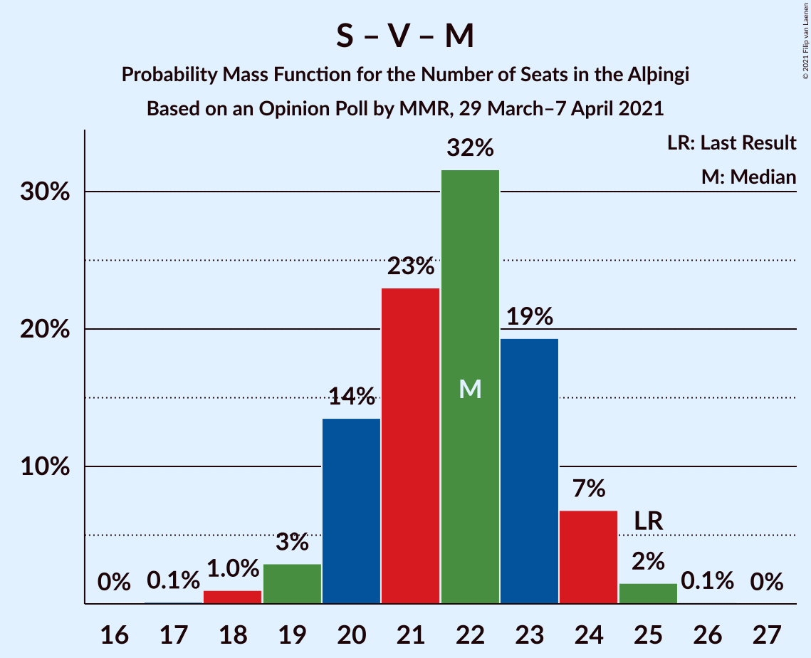

# Opinion Poll by MMR, 29 March–7 April 2021

<a href="#voting-intentions">Voting Intentions</a> | <a href="#seats">Seats</a> | <a href="#coalitions">Coalitions</a> | <a href="#technical-information">Technical Information</a>

## Voting Intentions

### Confidence Intervals

| Party | Last Result | Poll Result | 80% Confidence Interval | 90% Confidence Interval | 95% Confidence Interval | 99% Confidence Interval |
|:-----:|:-----------:|:-----------:|:-----------------------:|:-----------------------:|:-----------------------:|:-----------------------:|
| Sjálfstæðisflokkurinn | 25.2% | 23.1% | 21.4–24.9% |20.9–25.4% |20.5–25.9% |19.7–26.8% |
| Samfylkingin | 12.1% | 15.4% | 14.0–17.0% |13.6–17.5% |13.3–17.9% |12.6–18.7% |
| Píratar | 9.2% | 13.2% | 11.9–14.7% |11.5–15.1% |11.2–15.5% |10.6–16.3% |
| Framsóknarflokkurinn | 10.7% | 11.5% | 10.2–12.9% |9.9–13.3% |9.6–13.7% |9.0–14.4% |
| Vinstrihreyfingin – grænt framboð | 16.9% | 10.1% | 8.9–11.5% |8.6–11.9% |8.3–12.2% |7.8–12.9% |
| Viðreisn | 6.7% | 10.0% | 8.8–11.4% |8.5–11.8% |8.2–12.1% |7.7–12.8% |
| Miðflokkurinn | 10.9% | 6.9% | 6.0–8.1% |5.7–8.4% |5.5–8.7% |5.0–9.3% |
| Flokkur fólksins | 6.9% | 4.7% | 3.9–5.7% |3.7–6.0% |3.5–6.2% |3.2–6.8% |
| Sósíalistaflokkur Íslands | 0.0% | 4.0% | 3.3–5.0% |3.1–5.3% |3.0–5.5% |2.7–6.0% |

*Note:* The poll result column reflects the actual value used in the calculations. Published results may vary slightly, and in addition be rounded to fewer digits.

## Seats

### Confidence Intervals

| Party | Last Result | Median | 80% Confidence Interval | 90% Confidence Interval | 95% Confidence Interval | 99% Confidence Interval |
|:-----:|:-----------:|:------:|:-----------------------:|:-----------------------:|:-----------------------:|:-----------------------:|
| <a href="#sjálfstæðisflokkurinn">Sjálfstæðisflokkurinn</a> | 16 | 16 | 15–18 |14–18 |14–18 |13–19 |
| <a href="#samfylkingin">Samfylkingin</a> | 7 | 11 | 9–12 |9–12 |9–12 |8–13 |
| <a href="#píratar">Píratar</a> | 6 | 9 | 8–10 |8–10 |7–11 |7–11 |
| <a href="#framsóknarflokkurinn">Framsóknarflokkurinn</a> | 8 | 8 | 7–10 |7–10 |6–10 |6–11 |
| <a href="#vinstrihreyfingin-–-grænt-framboð">Vinstrihreyfingin – grænt framboð</a> | 11 | 7 | 6–8 |6–8 |5–8 |5–9 |
| <a href="#viðreisn">Viðreisn</a> | 4 | 7 | 6–8 |6–8 |5–8 |5–9 |
| <a href="#miðflokkurinn">Miðflokkurinn</a> | 7 | 5 | 4–5 |3–6 |3–6 |2–6 |
| <a href="#flokkur-fólksins">Flokkur fólksins</a> | 4 | 0 | 0–3 |0–4 |0–4 |0–4 |
| <a href="#sósíalistaflokkur-íslands">Sósíalistaflokkur Íslands</a> | 0 | 0 | 0 |0–3 |0–3 |0–4 |

### Sjálfstæðisflokkurinn

*For a full overview of the results for this party, see the [Sjálfstæðisflokkurinn](party-sjálfstæðisflokkurinn.html) page.*

| Number of Seats | Probability | Accumulated | Special Marks |
|:---------------:|:-----------:|:-----------:|:-------------:|
| 13 | 1.4% | 100% |  |
| 14 | 7% | 98.6% |  |
| 15 | 18% | 91% |  |
| 16 | 41% | 73% | Last Result, Median |
| 17 | 22% | 33% |  |
| 18 | 8% | 11% |  |
| 19 | 2% | 2% |  |
| 20 | 0.2% | 0.2% |  |
| 21 | 0% | 0% |  |

### Samfylkingin

*For a full overview of the results for this party, see the [Samfylkingin](party-samfylkingin.html) page.*

| Number of Seats | Probability | Accumulated | Special Marks |
|:---------------:|:-----------:|:-----------:|:-------------:|
| 7 | 0% | 100% | Last Result |
| 8 | 1.1% | 100% |  |
| 9 | 14% | 98.8% |  |
| 10 | 30% | 85% |  |
| 11 | 41% | 55% | Median |
| 12 | 12% | 14% |  |
| 13 | 1.3% | 1.5% |  |
| 14 | 0.1% | 0.1% |  |
| 15 | 0% | 0% |  |

### Píratar

*For a full overview of the results for this party, see the [Píratar](party-píratar.html) page.*

| Number of Seats | Probability | Accumulated | Special Marks |
|:---------------:|:-----------:|:-----------:|:-------------:|
| 6 | 0.2% | 100% | Last Result |
| 7 | 5% | 99.8% |  |
| 8 | 26% | 95% |  |
| 9 | 44% | 69% | Median |
| 10 | 21% | 25% |  |
| 11 | 3% | 3% |  |
| 12 | 0.1% | 0.1% |  |
| 13 | 0% | 0% |  |

### Framsóknarflokkurinn

*For a full overview of the results for this party, see the [Framsóknarflokkurinn](party-framsóknarflokkurinn.html) page.*

| Number of Seats | Probability | Accumulated | Special Marks |
|:---------------:|:-----------:|:-----------:|:-------------:|
| 5 | 0.1% | 100% |  |
| 6 | 3% | 99.9% |  |
| 7 | 7% | 97% |  |
| 8 | 55% | 90% | Last Result, Median |
| 9 | 20% | 35% |  |
| 10 | 14% | 15% |  |
| 11 | 2% | 2% |  |
| 12 | 0% | 0% |  |

### Vinstrihreyfingin – grænt framboð

*For a full overview of the results for this party, see the [Vinstrihreyfingin – grænt framboð](party-vinstrihreyfingin–græntframboð.html) page.*

| Number of Seats | Probability | Accumulated | Special Marks |
|:---------------:|:-----------:|:-----------:|:-------------:|
| 5 | 4% | 100% |  |
| 6 | 40% | 96% |  |
| 7 | 44% | 56% | Median |
| 8 | 11% | 12% |  |
| 9 | 0.8% | 0.9% |  |
| 10 | 0.1% | 0.1% |  |
| 11 | 0% | 0% | Last Result |

### Viðreisn

*For a full overview of the results for this party, see the [Viðreisn](party-viðreisn.html) page.*

| Number of Seats | Probability | Accumulated | Special Marks |
|:---------------:|:-----------:|:-----------:|:-------------:|
| 4 | 0% | 100% | Last Result |
| 5 | 5% | 100% |  |
| 6 | 33% | 95% |  |
| 7 | 50% | 63% | Median |
| 8 | 12% | 13% |  |
| 9 | 0.8% | 0.8% |  |
| 10 | 0% | 0% |  |

### Miðflokkurinn

*For a full overview of the results for this party, see the [Miðflokkurinn](party-miðflokkurinn.html) page.*

| Number of Seats | Probability | Accumulated | Special Marks |
|:---------------:|:-----------:|:-----------:|:-------------:|
| 1 | 0.5% | 100% |  |
| 2 | 0.1% | 99.5% |  |
| 3 | 5% | 99.4% |  |
| 4 | 39% | 95% |  |
| 5 | 50% | 55% | Median |
| 6 | 5% | 5% |  |
| 7 | 0.1% | 0.1% | Last Result |
| 8 | 0% | 0% |  |

### Flokkur fólksins

*For a full overview of the results for this party, see the [Flokkur fólksins](party-flokkurfólksins.html) page.*

| Number of Seats | Probability | Accumulated | Special Marks |
|:---------------:|:-----------:|:-----------:|:-------------:|
| 0 | 70% | 100% | Median |
| 1 | 0% | 30% |  |
| 2 | 0% | 30% |  |
| 3 | 25% | 30% |  |
| 4 | 5% | 5% | Last Result |
| 5 | 0.1% | 0.1% |  |
| 6 | 0% | 0% |  |

### Sósíalistaflokkur Íslands

*For a full overview of the results for this party, see the [Sósíalistaflokkur Íslands](party-sósíalistaflokkuríslands.html) page.*

| Number of Seats | Probability | Accumulated | Special Marks |
|:---------------:|:-----------:|:-----------:|:-------------:|
| 0 | 95% | 100% | Last Result, Median |
| 1 | 0.1% | 5% |  |
| 2 | 0% | 5% |  |
| 3 | 4% | 5% |  |
| 4 | 1.3% | 1.3% |  |
| 5 | 0% | 0% |  |

## Coalitions

### Confidence Intervals

| Coalition | Last Result | Median | Majority? | 80% Confidence Interval | 90% Confidence Interval | 95% Confidence Interval | 99% Confidence Interval |
|:---------:|:-----------:|:------:|:---------:|:-----------------------:|:-----------------------:|:-----------------------:|:-----------------------:|
| Samfylkingin – Píratar – Vinstrihreyfingin – grænt framboð – Viðreisn | 28 | 33 | 79% | 31–35 | 30–35 | 29–36 | 28–37 |
| Sjálfstæðisflokkurinn – Framsóknarflokkurinn – Vinstrihreyfingin – grænt framboð | 35 | 31 | 33% | 30–33 | 29–33 | 29–33 | 28–34 |
| Samfylkingin – Framsóknarflokkurinn – Vinstrihreyfingin – grænt framboð – Miðflokkurinn | 33 | 30 | 16% | 28–32 | 28–32 | 27–33 | 26–33 |
| Sjálfstæðisflokkurinn – Framsóknarflokkurinn – Miðflokkurinn | 31 | 29 | 1.5% | 27–31 | 27–31 | 26–31 | 25–32 |
| Sjálfstæðisflokkurinn – Samfylkingin | 23 | 27 | 0% | 25–29 | 24–29 | 24–29 | 23–30 |
| Samfylkingin – Píratar – Vinstrihreyfingin – grænt framboð | 24 | 26 | 0% | 24–28 | 24–28 | 23–29 | 22–30 |
| Samfylkingin – Framsóknarflokkurinn – Vinstrihreyfingin – grænt framboð | 26 | 26 | 0% | 24–27 | 23–28 | 23–28 | 22–29 |
| Sjálfstæðisflokkurinn – Framsóknarflokkurinn | 24 | 24 | 0% | 23–26 | 22–27 | 22–27 | 21–27 |
| Sjálfstæðisflokkurinn – Vinstrihreyfingin – grænt framboð | 27 | 23 | 0% | 21–24 | 21–25 | 20–25 | 19–26 |
| Sjálfstæðisflokkurinn – Viðreisn | 20 | 23 | 0% | 21–24 | 20–25 | 20–25 | 19–26 |
| Samfylkingin – Vinstrihreyfingin – grænt framboð – Miðflokkurinn | 25 | 22 | 0% | 20–23 | 20–24 | 19–24 | 18–25 |
| Sjálfstæðisflokkurinn – Miðflokkurinn | 23 | 21 | 0% | 19–22 | 19–23 | 18–23 | 17–24 |
| Framsóknarflokkurinn – Vinstrihreyfingin – grænt framboð – Miðflokkurinn | 26 | 20 | 0% | 18–21 | 18–22 | 17–22 | 16–23 |
| Samfylkingin – Vinstrihreyfingin – grænt framboð | 18 | 17 | 0% | 16–19 | 15–19 | 15–20 | 14–21 |
| Píratar – Vinstrihreyfingin – grænt framboð | 17 | 16 | 0% | 14–17 | 14–17 | 13–18 | 13–19 |
| Framsóknarflokkurinn – Vinstrihreyfingin – grænt framboð | 19 | 15 | 0% | 14–17 | 13–17 | 13–17 | 12–18 |
| Vinstrihreyfingin – grænt framboð – Miðflokkurinn | 18 | 11 | 0% | 10–12 | 10–13 | 9–13 | 8–14 |

### Samfylkingin – Píratar – Vinstrihreyfingin – grænt framboð – Viðreisn

| Number of Seats | Probability | Accumulated | Special Marks |
|:---------------:|:-----------:|:-----------:|:-------------:|
| 27 | 0.1% | 100% |  |
| 28 | 0.4% | 99.9% | Last Result |
| 29 | 3% | 99.5% |  |
| 30 | 6% | 97% |  |
| 31 | 12% | 91% |  |
| 32 | 16% | 79% | Majority |
| 33 | 22% | 62% |  |
| 34 | 28% | 40% | Median |
| 35 | 10% | 12% |  |
| 36 | 2% | 3% |  |
| 37 | 0.5% | 0.6% |  |
| 38 | 0.1% | 0.1% |  |
| 39 | 0% | 0% |  |

### Sjálfstæðisflokkurinn – Framsóknarflokkurinn – Vinstrihreyfingin – grænt framboð

| Number of Seats | Probability | Accumulated | Special Marks |
|:---------------:|:-----------:|:-----------:|:-------------:|
| 27 | 0.4% | 100% |  |
| 28 | 2% | 99.6% |  |
| 29 | 8% | 98% |  |
| 30 | 16% | 90% |  |
| 31 | 42% | 75% | Median |
| 32 | 16% | 33% | Majority |
| 33 | 15% | 17% |  |
| 34 | 2% | 2% |  |
| 35 | 0.4% | 0.5% | Last Result |
| 36 | 0% | 0% |  |

### Samfylkingin – Framsóknarflokkurinn – Vinstrihreyfingin – grænt framboð – Miðflokkurinn

| Number of Seats | Probability | Accumulated | Special Marks |
|:---------------:|:-----------:|:-----------:|:-------------:|
| 25 | 0.2% | 100% |  |
| 26 | 0.8% | 99.8% |  |
| 27 | 3% | 99.0% |  |
| 28 | 9% | 96% |  |
| 29 | 18% | 87% |  |
| 30 | 27% | 69% |  |
| 31 | 26% | 42% | Median |
| 32 | 12% | 16% | Majority |
| 33 | 4% | 4% | Last Result |
| 34 | 0.4% | 0.5% |  |
| 35 | 0.1% | 0.1% |  |
| 36 | 0% | 0% |  |

### Sjálfstæðisflokkurinn – Framsóknarflokkurinn – Miðflokkurinn

| Number of Seats | Probability | Accumulated | Special Marks |
|:---------------:|:-----------:|:-----------:|:-------------:|
| 24 | 0.1% | 100% |  |
| 25 | 0.7% | 99.9% |  |
| 26 | 4% | 99.2% |  |
| 27 | 8% | 96% |  |
| 28 | 17% | 87% |  |
| 29 | 35% | 70% | Median |
| 30 | 22% | 35% |  |
| 31 | 12% | 13% | Last Result |
| 32 | 1.3% | 1.5% | Majority |
| 33 | 0.2% | 0.2% |  |
| 34 | 0% | 0% |  |

### Sjálfstæðisflokkurinn – Samfylkingin

| Number of Seats | Probability | Accumulated | Special Marks |
|:---------------:|:-----------:|:-----------:|:-------------:|
| 22 | 0.1% | 100% |  |
| 23 | 1.1% | 99.9% | Last Result |
| 24 | 7% | 98.8% |  |
| 25 | 9% | 91% |  |
| 26 | 27% | 82% |  |
| 27 | 31% | 55% | Median |
| 28 | 13% | 24% |  |
| 29 | 10% | 11% |  |
| 30 | 0.9% | 1.3% |  |
| 31 | 0.4% | 0.4% |  |
| 32 | 0% | 0% | Majority |

### Samfylkingin – Píratar – Vinstrihreyfingin – grænt framboð

| Number of Seats | Probability | Accumulated | Special Marks |
|:---------------:|:-----------:|:-----------:|:-------------:|
| 21 | 0.1% | 100% |  |
| 22 | 0.5% | 99.8% |  |
| 23 | 3% | 99.4% |  |
| 24 | 15% | 96% | Last Result |
| 25 | 11% | 81% |  |
| 26 | 24% | 71% |  |
| 27 | 32% | 46% | Median |
| 28 | 11% | 14% |  |
| 29 | 3% | 3% |  |
| 30 | 0.5% | 0.6% |  |
| 31 | 0.1% | 0.1% |  |
| 32 | 0% | 0% | Majority |

### Samfylkingin – Framsóknarflokkurinn – Vinstrihreyfingin – grænt framboð

| Number of Seats | Probability | Accumulated | Special Marks |
|:---------------:|:-----------:|:-----------:|:-------------:|
| 21 | 0.2% | 100% |  |
| 22 | 0.9% | 99.8% |  |
| 23 | 7% | 98.8% |  |
| 24 | 11% | 92% |  |
| 25 | 23% | 81% |  |
| 26 | 37% | 58% | Last Result, Median |
| 27 | 16% | 21% |  |
| 28 | 3% | 5% |  |
| 29 | 2% | 2% |  |
| 30 | 0.2% | 0.2% |  |
| 31 | 0% | 0% |  |

### Sjálfstæðisflokkurinn – Framsóknarflokkurinn

| Number of Seats | Probability | Accumulated | Special Marks |
|:---------------:|:-----------:|:-----------:|:-------------:|
| 20 | 0.1% | 100% |  |
| 21 | 1.1% | 99.9% |  |
| 22 | 5% | 98.8% |  |
| 23 | 11% | 94% |  |
| 24 | 34% | 83% | Last Result, Median |
| 25 | 31% | 49% |  |
| 26 | 12% | 18% |  |
| 27 | 6% | 6% |  |
| 28 | 0.3% | 0.4% |  |
| 29 | 0.1% | 0.1% |  |
| 30 | 0% | 0% |  |

### Sjálfstæðisflokkurinn – Vinstrihreyfingin – grænt framboð

| Number of Seats | Probability | Accumulated | Special Marks |
|:---------------:|:-----------:|:-----------:|:-------------:|
| 19 | 0.6% | 100% |  |
| 20 | 3% | 99.3% |  |
| 21 | 14% | 96% |  |
| 22 | 23% | 82% |  |
| 23 | 33% | 59% | Median |
| 24 | 18% | 27% |  |
| 25 | 7% | 9% |  |
| 26 | 2% | 2% |  |
| 27 | 0.3% | 0.3% | Last Result |
| 28 | 0% | 0% |  |

### Sjálfstæðisflokkurinn – Viðreisn

| Number of Seats | Probability | Accumulated | Special Marks |
|:---------------:|:-----------:|:-----------:|:-------------:|
| 18 | 0.1% | 100% |  |
| 19 | 0.7% | 99.9% |  |
| 20 | 4% | 99.2% | Last Result |
| 21 | 9% | 95% |  |
| 22 | 23% | 86% |  |
| 23 | 36% | 63% | Median |
| 24 | 17% | 27% |  |
| 25 | 8% | 10% |  |
| 26 | 1.2% | 2% |  |
| 27 | 0.4% | 0.4% |  |
| 28 | 0% | 0% |  |

### Samfylkingin – Vinstrihreyfingin – grænt framboð – Miðflokkurinn

| Number of Seats | Probability | Accumulated | Special Marks |
|:---------------:|:-----------:|:-----------:|:-------------:|
| 17 | 0.1% | 100% |  |
| 18 | 1.0% | 99.9% |  |
| 19 | 3% | 98.9% |  |
| 20 | 14% | 96% |  |
| 21 | 23% | 82% |  |
| 22 | 32% | 59% |  |
| 23 | 19% | 28% | Median |
| 24 | 7% | 8% |  |
| 25 | 2% | 2% | Last Result |
| 26 | 0.1% | 0.1% |  |
| 27 | 0% | 0% |  |

### Sjálfstæðisflokkurinn – Miðflokkurinn

| Number of Seats | Probability | Accumulated | Special Marks |
|:---------------:|:-----------:|:-----------:|:-------------:|
| 16 | 0.2% | 100% |  |
| 17 | 1.3% | 99.7% |  |
| 18 | 3% | 98% |  |
| 19 | 14% | 95% |  |
| 20 | 25% | 81% |  |
| 21 | 31% | 56% | Median |
| 22 | 21% | 26% |  |
| 23 | 3% | 5% | Last Result |
| 24 | 2% | 2% |  |
| 25 | 0.1% | 0.1% |  |
| 26 | 0% | 0% |  |

### Framsóknarflokkurinn – Vinstrihreyfingin – grænt framboð – Miðflokkurinn

| Number of Seats | Probability | Accumulated | Special Marks |
|:---------------:|:-----------:|:-----------:|:-------------:|
| 15 | 0.1% | 100% |  |
| 16 | 0.7% | 99.8% |  |
| 17 | 4% | 99.1% |  |
| 18 | 13% | 95% |  |
| 19 | 29% | 82% |  |
| 20 | 28% | 52% | Median |
| 21 | 19% | 24% |  |
| 22 | 4% | 5% |  |
| 23 | 1.0% | 1.1% |  |
| 24 | 0% | 0% |  |
| 25 | 0% | 0% |  |
| 26 | 0% | 0% | Last Result |

### Samfylkingin – Vinstrihreyfingin – grænt framboð

| Number of Seats | Probability | Accumulated | Special Marks |
|:---------------:|:-----------:|:-----------:|:-------------:|
| 13 | 0.1% | 100% |  |
| 14 | 0.8% | 99.9% |  |
| 15 | 7% | 99.0% |  |
| 16 | 18% | 93% |  |
| 17 | 33% | 74% |  |
| 18 | 31% | 41% | Last Result, Median |
| 19 | 8% | 10% |  |
| 20 | 2% | 3% |  |
| 21 | 0.5% | 0.5% |  |
| 22 | 0% | 0% |  |

### Píratar – Vinstrihreyfingin – grænt framboð

| Number of Seats | Probability | Accumulated | Special Marks |
|:---------------:|:-----------:|:-----------:|:-------------:|
| 12 | 0.2% | 100% |  |
| 13 | 4% | 99.7% |  |
| 14 | 14% | 96% |  |
| 15 | 29% | 82% |  |
| 16 | 32% | 53% | Median |
| 17 | 16% | 21% | Last Result |
| 18 | 4% | 5% |  |
| 19 | 0.6% | 0.7% |  |
| 20 | 0.1% | 0.1% |  |
| 21 | 0% | 0% |  |

### Framsóknarflokkurinn – Vinstrihreyfingin – grænt framboð

| Number of Seats | Probability | Accumulated | Special Marks |
|:---------------:|:-----------:|:-----------:|:-------------:|
| 11 | 0.1% | 100% |  |
| 12 | 1.4% | 99.9% |  |
| 13 | 4% | 98% |  |
| 14 | 24% | 94% |  |
| 15 | 40% | 70% | Median |
| 16 | 20% | 30% |  |
| 17 | 9% | 10% |  |
| 18 | 1.4% | 2% |  |
| 19 | 0.1% | 0.1% | Last Result |
| 20 | 0% | 0% |  |

### Vinstrihreyfingin – grænt framboð – Miðflokkurinn

| Number of Seats | Probability | Accumulated | Special Marks |
|:---------------:|:-----------:|:-----------:|:-------------:|
| 7 | 0.1% | 100% |  |
| 8 | 0.4% | 99.9% |  |
| 9 | 3% | 99.4% |  |
| 10 | 20% | 96% |  |
| 11 | 39% | 76% |  |
| 12 | 28% | 37% | Median |
| 13 | 8% | 10% |  |
| 14 | 1.3% | 1.3% |  |
| 15 | 0.1% | 0.1% |  |
| 16 | 0% | 0% |  |
| 17 | 0% | 0% |  |
| 18 | 0% | 0% | Last Result |

## Technical Information

### Opinion Poll

+ **Polling firm:** MMR
+ **Commissioner(s):** —
+ **Fieldwork period:** 29 March–7 April 2021

### Calculations

+ **Sample size:** 940
+ **Simulations done:** 1,048,576
+ **Error estimate:** 1.36%

