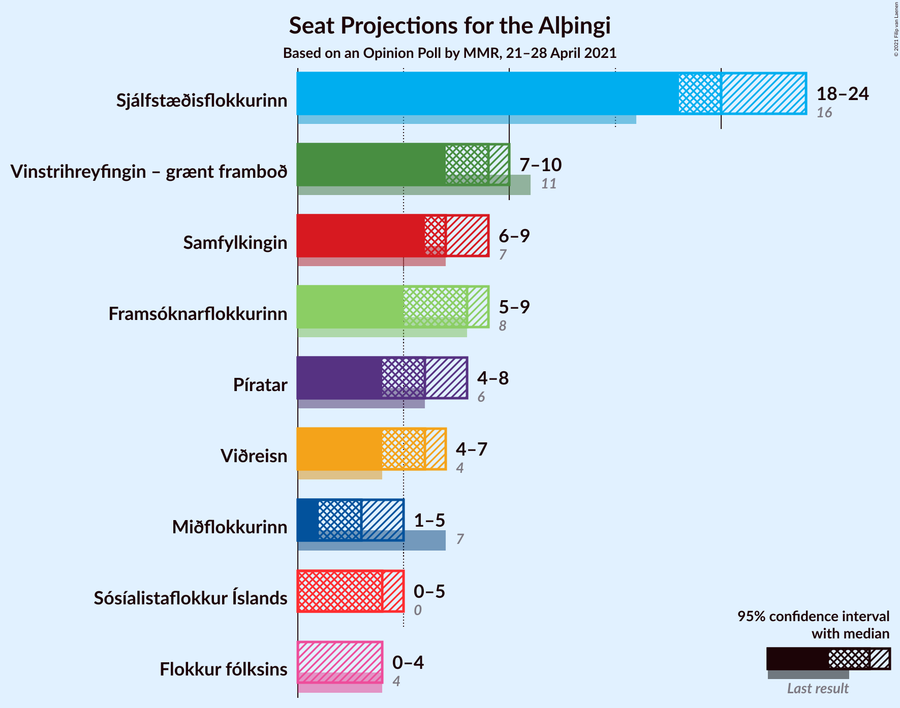
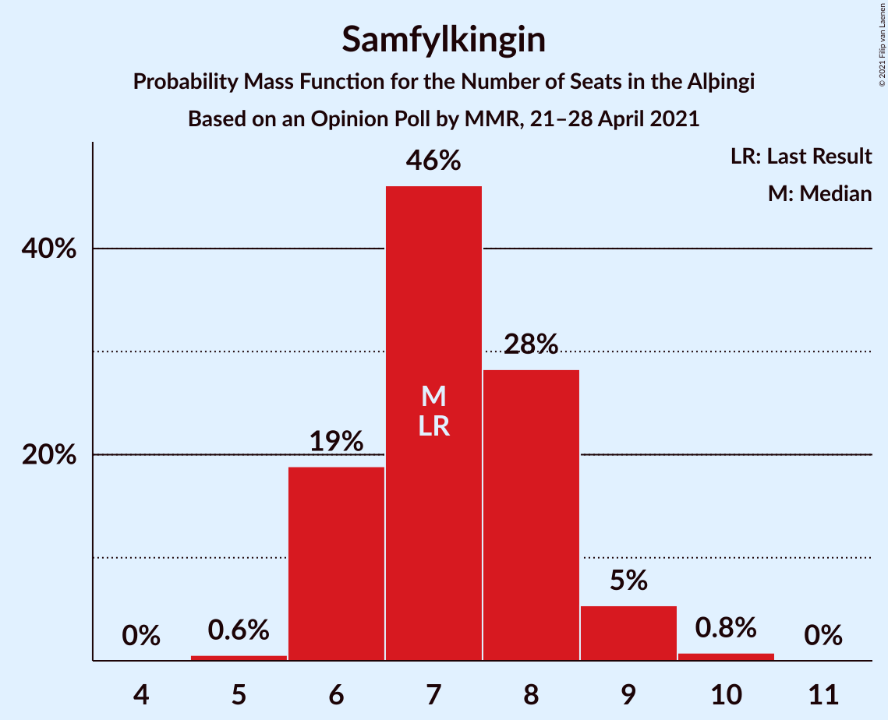
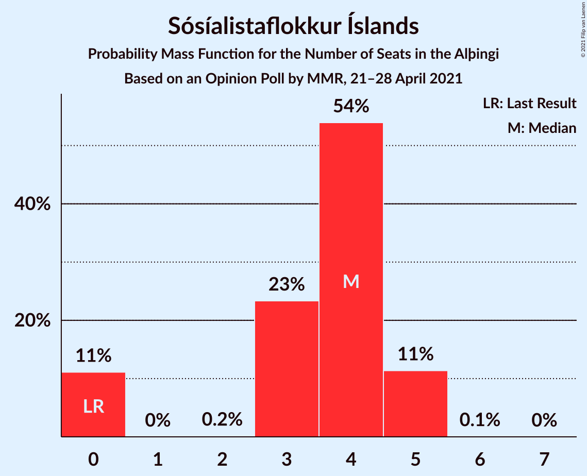
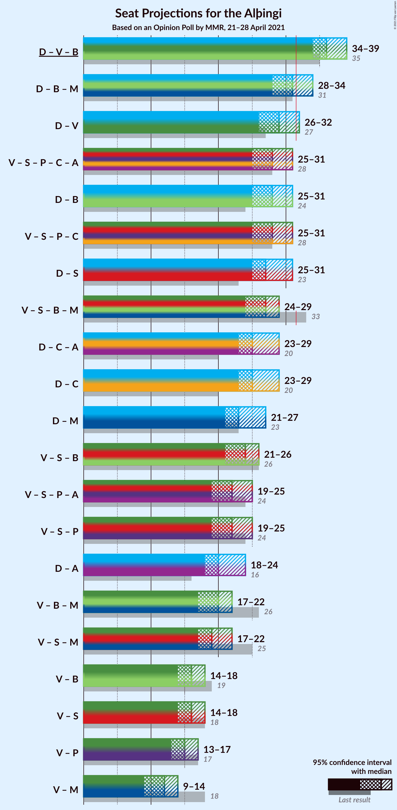
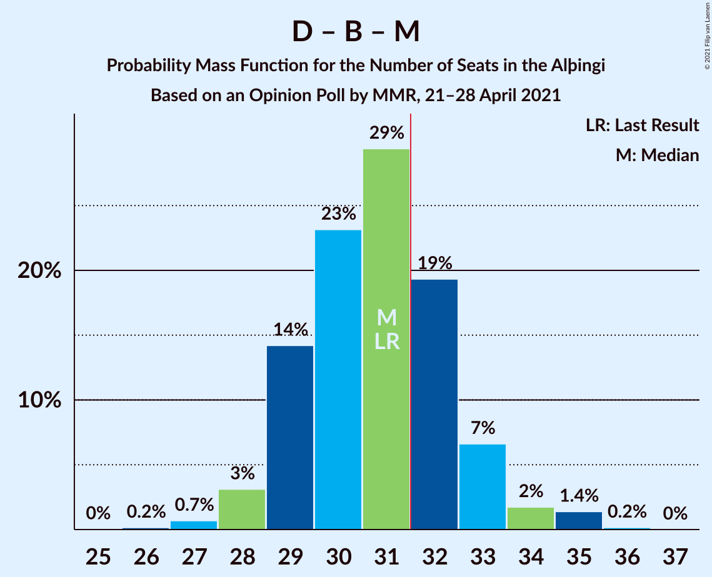
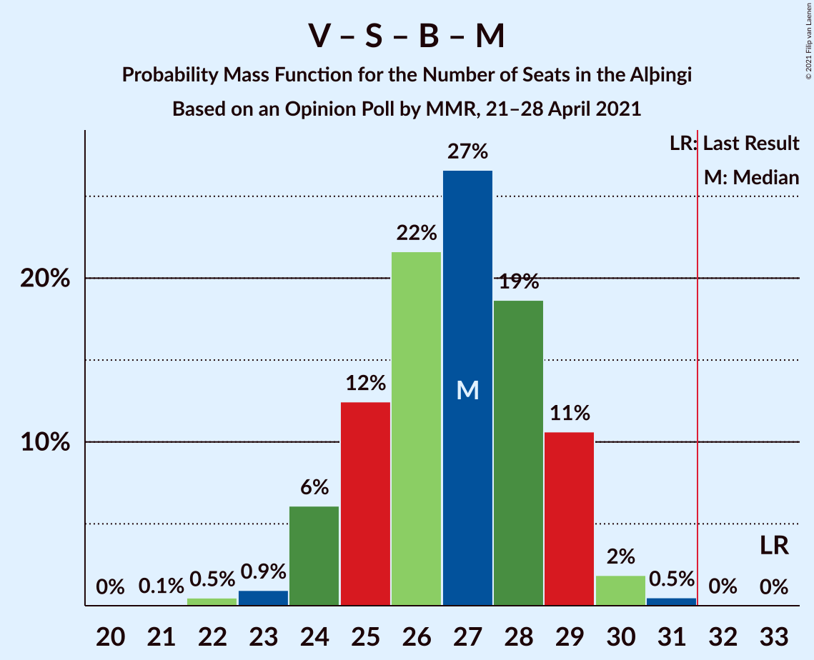
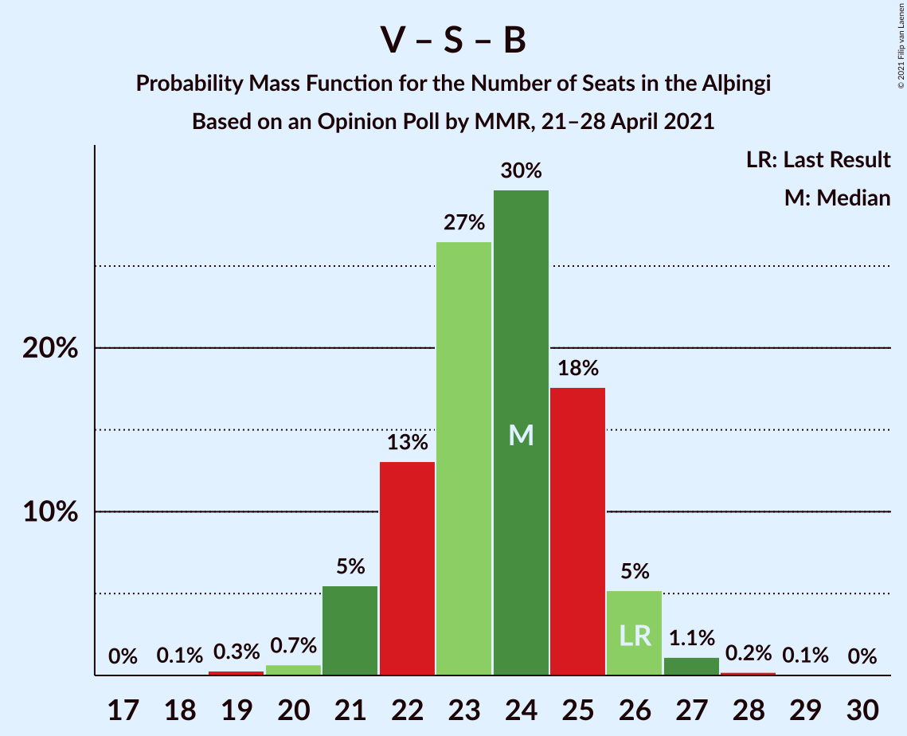
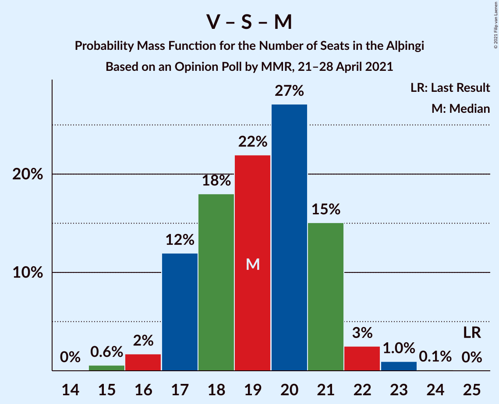

# Opinion Poll by MMR, 21–28 April 2021

<a href="#voting-intentions">Voting Intentions</a> | <a href="#seats">Seats</a> | <a href="#coalitions">Coalitions</a> | <a href="#technical-information">Technical Information</a>

## Voting Intentions

### Confidence Intervals

| Party | Last Result | Poll Result | 80% Confidence Interval | 90% Confidence Interval | 95% Confidence Interval | 99% Confidence Interval |
|:-----:|:-----------:|:-----------:|:-----------------------:|:-----------------------:|:-----------------------:|:-----------------------:|
| Sjálfstæðisflokkurinn | 25.2% | 28.8% | 26.9–30.7% |26.4–31.2% |26.0–31.7% |25.1–32.7% |
| Vinstrihreyfingin – grænt framboð | 16.9% | 12.9% | 11.6–14.4% |11.2–14.8% |10.9–15.2% |10.3–15.9% |
| Samfylkingin | 12.1% | 11.3% | 10.1–12.7% |9.7–13.1% |9.4–13.5% |8.9–14.2% |
| Framsóknarflokkurinn | 10.7% | 10.6% | 9.4–12.0% |9.1–12.3% |8.8–12.7% |8.2–13.4% |
| Píratar | 9.2% | 9.6% | 8.5–11.0% |8.2–11.3% |7.9–11.7% |7.4–12.3% |
| Viðreisn | 6.7% | 8.8% | 7.7–10.1% |7.4–10.4% |7.1–10.7% |6.6–11.4% |
| Sósíalistaflokkur Íslands | 0.0% | 6.0% | 5.1–7.1% |4.9–7.5% |4.7–7.7% |4.3–8.3% |
| Miðflokkurinn | 10.9% | 5.8% | 4.9–6.9% |4.7–7.2% |4.5–7.5% |4.1–8.0% |
| Flokkur fólksins | 6.9% | 4.8% | 4.0–5.8% |3.7–6.1% |3.6–6.3% |3.2–6.8% |

*Note:* The poll result column reflects the actual value used in the calculations. Published results may vary slightly, and in addition be rounded to fewer digits.

## Seats

### Confidence Intervals

| Party | Last Result | Median | 80% Confidence Interval | 90% Confidence Interval | 95% Confidence Interval | 99% Confidence Interval |
|:-----:|:-----------:|:------:|:-----------------------:|:-----------------------:|:-----------------------:|:-----------------------:|
| <a href="#sjálfstæðisflokkurinn">Sjálfstæðisflokkurinn</a> | 16 | 20 | 19–22 |19–23 |18–24 |17–24 |
| <a href="#vinstrihreyfingin-–-grænt-framboð">Vinstrihreyfingin – grænt framboð</a> | 11 | 9 | 8–10 |7–10 |7–10 |6–11 |
| <a href="#samfylkingin">Samfylkingin</a> | 7 | 7 | 6–8 |6–9 |6–9 |5–10 |
| <a href="#framsóknarflokkurinn">Framsóknarflokkurinn</a> | 8 | 8 | 6–8 |6–9 |5–9 |5–10 |
| <a href="#píratar">Píratar</a> | 6 | 6 | 5–7 |5–7 |4–8 |4–8 |
| <a href="#viðreisn">Viðreisn</a> | 4 | 6 | 5–6 |4–7 |4–7 |4–7 |
| <a href="#sósíalistaflokkur-íslands">Sósíalistaflokkur Íslands</a> | 0 | 4 | 0–5 |0–5 |0–5 |0–5 |
| <a href="#miðflokkurinn">Miðflokkurinn</a> | 7 | 3 | 1–4 |1–4 |1–5 |1–5 |
| <a href="#flokkur-fólksins">Flokkur fólksins</a> | 4 | 0 | 0–3 |0–4 |0–4 |0–4 |

### Sjálfstæðisflokkurinn

*For a full overview of the results for this party, see the [Sjálfstæðisflokkurinn](party-sjálfstæðisflokkurinn.html) page.*

| Number of Seats | Probability | Accumulated | Special Marks |
|:---------------:|:-----------:|:-----------:|:-------------:|
| 16 | 0.1% | 100% | Last Result |
| 17 | 0.5% | 99.9% |  |
| 18 | 3% | 99.4% |  |
| 19 | 37% | 97% |  |
| 20 | 31% | 59% | Median |
| 21 | 16% | 29% |  |
| 22 | 8% | 13% |  |
| 23 | 3% | 5% |  |
| 24 | 2% | 3% |  |
| 25 | 0.4% | 0.4% |  |
| 26 | 0% | 0% |  |

### Vinstrihreyfingin – grænt framboð

*For a full overview of the results for this party, see the [Vinstrihreyfingin – grænt framboð](party-vinstrihreyfingin–græntframboð.html) page.*

| Number of Seats | Probability | Accumulated | Special Marks |
|:---------------:|:-----------:|:-----------:|:-------------:|
| 6 | 0.7% | 100% |  |
| 7 | 7% | 99.3% |  |
| 8 | 31% | 93% |  |
| 9 | 36% | 62% | Median |
| 10 | 25% | 26% |  |
| 11 | 0.9% | 1.0% | Last Result |
| 12 | 0.1% | 0.1% |  |
| 13 | 0% | 0% |  |

### Samfylkingin

*For a full overview of the results for this party, see the [Samfylkingin](party-samfylkingin.html) page.*

| Number of Seats | Probability | Accumulated | Special Marks |
|:---------------:|:-----------:|:-----------:|:-------------:|
| 5 | 0.6% | 100% |  |
| 6 | 19% | 99.4% |  |
| 7 | 46% | 81% | Last Result, Median |
| 8 | 28% | 34% |  |
| 9 | 5% | 6% |  |
| 10 | 0.8% | 0.8% |  |
| 11 | 0% | 0% |  |

### Framsóknarflokkurinn

*For a full overview of the results for this party, see the [Framsóknarflokkurinn](party-framsóknarflokkurinn.html) page.*

| Number of Seats | Probability | Accumulated | Special Marks |
|:---------------:|:-----------:|:-----------:|:-------------:|
| 4 | 0.2% | 100% |  |
| 5 | 2% | 99.8% |  |
| 6 | 13% | 97% |  |
| 7 | 19% | 84% |  |
| 8 | 58% | 65% | Last Result, Median |
| 9 | 5% | 7% |  |
| 10 | 2% | 2% |  |
| 11 | 0.2% | 0.2% |  |
| 12 | 0% | 0% |  |

### Píratar

*For a full overview of the results for this party, see the [Píratar](party-píratar.html) page.*

| Number of Seats | Probability | Accumulated | Special Marks |
|:---------------:|:-----------:|:-----------:|:-------------:|
| 4 | 3% | 100% |  |
| 5 | 18% | 97% |  |
| 6 | 47% | 79% | Last Result, Median |
| 7 | 28% | 32% |  |
| 8 | 4% | 4% |  |
| 9 | 0.1% | 0.1% |  |
| 10 | 0% | 0% |  |

### Viðreisn

*For a full overview of the results for this party, see the [Viðreisn](party-viðreisn.html) page.*

| Number of Seats | Probability | Accumulated | Special Marks |
|:---------------:|:-----------:|:-----------:|:-------------:|
| 4 | 5% | 100% | Last Result |
| 5 | 42% | 95% |  |
| 6 | 46% | 53% | Median |
| 7 | 7% | 7% |  |
| 8 | 0.4% | 0.4% |  |
| 9 | 0% | 0% |  |

### Sósíalistaflokkur Íslands

*For a full overview of the results for this party, see the [Sósíalistaflokkur Íslands](party-sósíalistaflokkuríslands.html) page.*

| Number of Seats | Probability | Accumulated | Special Marks |
|:---------------:|:-----------:|:-----------:|:-------------:|
| 0 | 11% | 100% | Last Result |
| 1 | 0% | 89% |  |
| 2 | 0.2% | 89% |  |
| 3 | 23% | 89% |  |
| 4 | 54% | 65% | Median |
| 5 | 11% | 11% |  |
| 6 | 0.1% | 0.1% |  |
| 7 | 0% | 0% |  |

### Miðflokkurinn

*For a full overview of the results for this party, see the [Miðflokkurinn](party-miðflokkurinn.html) page.*

| Number of Seats | Probability | Accumulated | Special Marks |
|:---------------:|:-----------:|:-----------:|:-------------:|
| 0 | 0.2% | 100% |  |
| 1 | 17% | 99.8% |  |
| 2 | 0.2% | 83% |  |
| 3 | 35% | 83% | Median |
| 4 | 45% | 48% |  |
| 5 | 3% | 3% |  |
| 6 | 0.1% | 0.1% |  |
| 7 | 0% | 0% | Last Result |

### Flokkur fólksins

*For a full overview of the results for this party, see the [Flokkur fólksins](party-flokkurfólksins.html) page.*

| Number of Seats | Probability | Accumulated | Special Marks |
|:---------------:|:-----------:|:-----------:|:-------------:|
| 0 | 66% | 100% | Median |
| 1 | 0% | 34% |  |
| 2 | 0.2% | 34% |  |
| 3 | 28% | 34% |  |
| 4 | 6% | 6% | Last Result |
| 5 | 0% | 0% |  |

## Coalitions

### Confidence Intervals

| Coalition | Last Result | Median | Majority? | 80% Confidence Interval | 90% Confidence Interval | 95% Confidence Interval | 99% Confidence Interval |
|:---------:|:-----------:|:------:|:---------:|:-----------------------:|:-----------------------:|:-----------------------:|:-----------------------:|
| Sjálfstæðisflokkurinn – Vinstrihreyfingin – grænt framboð – Framsóknarflokkurinn | 35 | 36 | 100% | 35–38 | 34–39 | 34–39 | 33–40 |
| Sjálfstæðisflokkurinn – Framsóknarflokkurinn – Miðflokkurinn | 31 | 31 | 29% | 29–32 | 29–33 | 28–34 | 27–35 |
| Sjálfstæðisflokkurinn – Vinstrihreyfingin – grænt framboð | 27 | 29 | 5% | 27–31 | 27–31 | 26–32 | 26–34 |
| Sjálfstæðisflokkurinn – Framsóknarflokkurinn | 24 | 28 | 0.4% | 26–29 | 26–30 | 25–31 | 24–31 |
| Vinstrihreyfingin – grænt framboð – Samfylkingin – Píratar – Viðreisn | 28 | 28 | 1.0% | 25–30 | 25–30 | 25–31 | 23–32 |
| Sjálfstæðisflokkurinn – Samfylkingin | 23 | 27 | 2% | 26–29 | 25–30 | 25–31 | 24–32 |
| Vinstrihreyfingin – grænt framboð – Samfylkingin – Framsóknarflokkurinn – Miðflokkurinn | 33 | 27 | 0% | 25–29 | 24–29 | 24–29 | 22–31 |
| Sjálfstæðisflokkurinn – Viðreisn | 20 | 25 | 0% | 24–28 | 24–28 | 23–29 | 22–30 |
| Sjálfstæðisflokkurinn – Miðflokkurinn | 23 | 23 | 0% | 22–25 | 21–26 | 21–27 | 20–28 |
| Vinstrihreyfingin – grænt framboð – Samfylkingin – Framsóknarflokkurinn | 26 | 24 | 0% | 22–25 | 21–26 | 21–26 | 20–27 |
| Vinstrihreyfingin – grænt framboð – Samfylkingin – Píratar | 24 | 22 | 0% | 20–24 | 20–24 | 19–25 | 19–26 |
| Vinstrihreyfingin – grænt framboð – Framsóknarflokkurinn – Miðflokkurinn | 26 | 20 | 0% | 18–21 | 17–22 | 17–22 | 16–23 |
| Vinstrihreyfingin – grænt framboð – Samfylkingin – Miðflokkurinn | 25 | 19 | 0% | 17–21 | 17–21 | 17–22 | 15–23 |
| Vinstrihreyfingin – grænt framboð – Framsóknarflokkurinn | 19 | 16 | 0% | 15–18 | 14–18 | 14–18 | 13–20 |
| Vinstrihreyfingin – grænt framboð – Samfylkingin | 18 | 16 | 0% | 14–17 | 14–18 | 14–18 | 13–19 |
| Vinstrihreyfingin – grænt framboð – Píratar | 17 | 15 | 0% | 13–16 | 13–17 | 13–17 | 12–18 |
| Vinstrihreyfingin – grænt framboð – Miðflokkurinn | 18 | 12 | 0% | 10–14 | 10–14 | 9–14 | 9–15 |

### Sjálfstæðisflokkurinn – Vinstrihreyfingin – grænt framboð – Framsóknarflokkurinn

| Number of Seats | Probability | Accumulated | Special Marks |
|:---------------:|:-----------:|:-----------:|:-------------:|
| 32 | 0.2% | 100% | Majority |
| 33 | 1.4% | 99.8% |  |
| 34 | 7% | 98% |  |
| 35 | 18% | 91% | Last Result |
| 36 | 27% | 73% |  |
| 37 | 24% | 46% | Median |
| 38 | 12% | 22% |  |
| 39 | 7% | 10% |  |
| 40 | 2% | 2% |  |
| 41 | 0.4% | 0.5% |  |
| 42 | 0% | 0% |  |

### Sjálfstæðisflokkurinn – Framsóknarflokkurinn – Miðflokkurinn

| Number of Seats | Probability | Accumulated | Special Marks |
|:---------------:|:-----------:|:-----------:|:-------------:|
| 26 | 0.2% | 100% |  |
| 27 | 0.7% | 99.8% |  |
| 28 | 3% | 99.1% |  |
| 29 | 14% | 96% |  |
| 30 | 23% | 82% |  |
| 31 | 29% | 59% | Last Result, Median |
| 32 | 19% | 29% | Majority |
| 33 | 7% | 10% |  |
| 34 | 2% | 3% |  |
| 35 | 1.4% | 2% |  |
| 36 | 0.2% | 0.2% |  |
| 37 | 0% | 0% |  |

### Sjálfstæðisflokkurinn – Vinstrihreyfingin – grænt framboð

| Number of Seats | Probability | Accumulated | Special Marks |
|:---------------:|:-----------:|:-----------:|:-------------:|
| 25 | 0.3% | 100% |  |
| 26 | 4% | 99.7% |  |
| 27 | 13% | 96% | Last Result |
| 28 | 24% | 83% |  |
| 29 | 30% | 59% | Median |
| 30 | 15% | 28% |  |
| 31 | 8% | 13% |  |
| 32 | 3% | 5% | Majority |
| 33 | 1.3% | 2% |  |
| 34 | 0.7% | 0.9% |  |
| 35 | 0.1% | 0.2% |  |
| 36 | 0% | 0% |  |

### Sjálfstæðisflokkurinn – Framsóknarflokkurinn

| Number of Seats | Probability | Accumulated | Special Marks |
|:---------------:|:-----------:|:-----------:|:-------------:|
| 24 | 0.6% | 100% | Last Result |
| 25 | 4% | 99.4% |  |
| 26 | 14% | 95% |  |
| 27 | 31% | 81% |  |
| 28 | 26% | 50% | Median |
| 29 | 17% | 25% |  |
| 30 | 5% | 8% |  |
| 31 | 2% | 3% |  |
| 32 | 0.3% | 0.4% | Majority |
| 33 | 0% | 0.1% |  |
| 34 | 0% | 0% |  |

### Vinstrihreyfingin – grænt framboð – Samfylkingin – Píratar – Viðreisn

| Number of Seats | Probability | Accumulated | Special Marks |
|:---------------:|:-----------:|:-----------:|:-------------:|
| 22 | 0.1% | 100% |  |
| 23 | 0.6% | 99.9% |  |
| 24 | 2% | 99.3% |  |
| 25 | 8% | 98% |  |
| 26 | 11% | 89% |  |
| 27 | 20% | 78% |  |
| 28 | 27% | 58% | Last Result, Median |
| 29 | 16% | 30% |  |
| 30 | 11% | 14% |  |
| 31 | 2% | 3% |  |
| 32 | 0.7% | 1.0% | Majority |
| 33 | 0.2% | 0.3% |  |
| 34 | 0.1% | 0.1% |  |
| 35 | 0% | 0% |  |

### Sjálfstæðisflokkurinn – Samfylkingin

| Number of Seats | Probability | Accumulated | Special Marks |
|:---------------:|:-----------:|:-----------:|:-------------:|
| 23 | 0.1% | 100% | Last Result |
| 24 | 0.6% | 99.9% |  |
| 25 | 8% | 99.4% |  |
| 26 | 25% | 91% |  |
| 27 | 25% | 66% | Median |
| 28 | 28% | 42% |  |
| 29 | 6% | 14% |  |
| 30 | 3% | 8% |  |
| 31 | 2% | 4% |  |
| 32 | 2% | 2% | Majority |
| 33 | 0.1% | 0.1% |  |
| 34 | 0% | 0% |  |

### Vinstrihreyfingin – grænt framboð – Samfylkingin – Framsóknarflokkurinn – Miðflokkurinn

| Number of Seats | Probability | Accumulated | Special Marks |
|:---------------:|:-----------:|:-----------:|:-------------:|
| 21 | 0.1% | 100% |  |
| 22 | 0.5% | 99.9% |  |
| 23 | 0.9% | 99.4% |  |
| 24 | 6% | 98% |  |
| 25 | 12% | 92% |  |
| 26 | 22% | 80% |  |
| 27 | 27% | 58% | Median |
| 28 | 19% | 32% |  |
| 29 | 11% | 13% |  |
| 30 | 2% | 2% |  |
| 31 | 0.5% | 0.5% |  |
| 32 | 0% | 0% | Majority |
| 33 | 0% | 0% | Last Result |

### Sjálfstæðisflokkurinn – Viðreisn

| Number of Seats | Probability | Accumulated | Special Marks |
|:---------------:|:-----------:|:-----------:|:-------------:|
| 20 | 0% | 100% | Last Result |
| 21 | 0% | 100% |  |
| 22 | 0.5% | 99.9% |  |
| 23 | 2% | 99.5% |  |
| 24 | 20% | 97% |  |
| 25 | 30% | 77% |  |
| 26 | 24% | 47% | Median |
| 27 | 12% | 23% |  |
| 28 | 7% | 11% |  |
| 29 | 2% | 4% |  |
| 30 | 2% | 2% |  |
| 31 | 0.2% | 0.2% |  |
| 32 | 0% | 0% | Majority |

### Sjálfstæðisflokkurinn – Miðflokkurinn

| Number of Seats | Probability | Accumulated | Special Marks |
|:---------------:|:-----------:|:-----------:|:-------------:|
| 19 | 0.2% | 100% |  |
| 20 | 2% | 99.8% |  |
| 21 | 6% | 98% |  |
| 22 | 22% | 92% |  |
| 23 | 32% | 70% | Last Result, Median |
| 24 | 23% | 38% |  |
| 25 | 10% | 15% |  |
| 26 | 3% | 6% |  |
| 27 | 1.3% | 3% |  |
| 28 | 1.3% | 1.4% |  |
| 29 | 0.1% | 0.1% |  |
| 30 | 0% | 0% |  |

### Vinstrihreyfingin – grænt framboð – Samfylkingin – Framsóknarflokkurinn

| Number of Seats | Probability | Accumulated | Special Marks |
|:---------------:|:-----------:|:-----------:|:-------------:|
| 18 | 0.1% | 100% |  |
| 19 | 0.3% | 99.9% |  |
| 20 | 0.7% | 99.6% |  |
| 21 | 5% | 99.0% |  |
| 22 | 13% | 93% |  |
| 23 | 27% | 80% |  |
| 24 | 30% | 54% | Median |
| 25 | 18% | 24% |  |
| 26 | 5% | 7% | Last Result |
| 27 | 1.1% | 1.4% |  |
| 28 | 0.2% | 0.3% |  |
| 29 | 0.1% | 0.1% |  |
| 30 | 0% | 0% |  |

### Vinstrihreyfingin – grænt framboð – Samfylkingin – Píratar

| Number of Seats | Probability | Accumulated | Special Marks |
|:---------------:|:-----------:|:-----------:|:-------------:|
| 17 | 0.1% | 100% |  |
| 18 | 0.3% | 99.9% |  |
| 19 | 4% | 99.6% |  |
| 20 | 10% | 96% |  |
| 21 | 17% | 86% |  |
| 22 | 27% | 69% | Median |
| 23 | 26% | 42% |  |
| 24 | 13% | 17% | Last Result |
| 25 | 3% | 4% |  |
| 26 | 0.9% | 1.1% |  |
| 27 | 0.1% | 0.2% |  |
| 28 | 0% | 0% |  |

### Vinstrihreyfingin – grænt framboð – Framsóknarflokkurinn – Miðflokkurinn

| Number of Seats | Probability | Accumulated | Special Marks |
|:---------------:|:-----------:|:-----------:|:-------------:|
| 14 | 0.1% | 100% |  |
| 15 | 0.4% | 99.9% |  |
| 16 | 2% | 99.5% |  |
| 17 | 6% | 98% |  |
| 18 | 17% | 92% |  |
| 19 | 24% | 75% |  |
| 20 | 23% | 51% | Median |
| 21 | 18% | 28% |  |
| 22 | 8% | 10% |  |
| 23 | 2% | 2% |  |
| 24 | 0.1% | 0.1% |  |
| 25 | 0% | 0% |  |
| 26 | 0% | 0% | Last Result |

### Vinstrihreyfingin – grænt framboð – Samfylkingin – Miðflokkurinn

| Number of Seats | Probability | Accumulated | Special Marks |
|:---------------:|:-----------:|:-----------:|:-------------:|
| 15 | 0.6% | 100% |  |
| 16 | 2% | 99.4% |  |
| 17 | 12% | 98% |  |
| 18 | 18% | 86% |  |
| 19 | 22% | 68% | Median |
| 20 | 27% | 46% |  |
| 21 | 15% | 19% |  |
| 22 | 3% | 4% |  |
| 23 | 1.0% | 1.1% |  |
| 24 | 0.1% | 0.1% |  |
| 25 | 0% | 0% | Last Result |

### Vinstrihreyfingin – grænt framboð – Framsóknarflokkurinn

| Number of Seats | Probability | Accumulated | Special Marks |
|:---------------:|:-----------:|:-----------:|:-------------:|
| 12 | 0.3% | 100% |  |
| 13 | 0.9% | 99.7% |  |
| 14 | 4% | 98.8% |  |
| 15 | 21% | 95% |  |
| 16 | 25% | 73% |  |
| 17 | 30% | 49% | Median |
| 18 | 16% | 18% |  |
| 19 | 1.4% | 2% | Last Result |
| 20 | 0.9% | 0.9% |  |
| 21 | 0.1% | 0.1% |  |
| 22 | 0% | 0% |  |

### Vinstrihreyfingin – grænt framboð – Samfylkingin

| Number of Seats | Probability | Accumulated | Special Marks |
|:---------------:|:-----------:|:-----------:|:-------------:|
| 12 | 0.1% | 100% |  |
| 13 | 0.6% | 99.9% |  |
| 14 | 12% | 99.2% |  |
| 15 | 20% | 88% |  |
| 16 | 30% | 67% | Median |
| 17 | 29% | 38% |  |
| 18 | 7% | 8% | Last Result |
| 19 | 2% | 2% |  |
| 20 | 0.3% | 0.3% |  |
| 21 | 0% | 0% |  |

### Vinstrihreyfingin – grænt framboð – Píratar

| Number of Seats | Probability | Accumulated | Special Marks |
|:---------------:|:-----------:|:-----------:|:-------------:|
| 11 | 0.4% | 100% |  |
| 12 | 2% | 99.6% |  |
| 13 | 8% | 98% |  |
| 14 | 26% | 90% |  |
| 15 | 30% | 64% | Median |
| 16 | 25% | 33% |  |
| 17 | 7% | 8% | Last Result |
| 18 | 0.7% | 0.7% |  |
| 19 | 0.1% | 0.1% |  |
| 20 | 0% | 0% |  |

### Vinstrihreyfingin – grænt framboð – Miðflokkurinn

| Number of Seats | Probability | Accumulated | Special Marks |
|:---------------:|:-----------:|:-----------:|:-------------:|
| 8 | 0.4% | 100% |  |
| 9 | 4% | 99.6% |  |
| 10 | 8% | 96% |  |
| 11 | 22% | 88% |  |
| 12 | 29% | 65% | Median |
| 13 | 23% | 36% |  |
| 14 | 12% | 13% |  |
| 15 | 0.7% | 0.8% |  |
| 16 | 0% | 0% |  |
| 17 | 0% | 0% |  |
| 18 | 0% | 0% | Last Result |

## Technical Information

### Opinion Poll

+ **Polling firm:** MMR
+ **Commissioner(s):** —
+ **Fieldwork period:** 21–28 April 2021

### Calculations

+ **Sample size:** 946
+ **Simulations done:** 1,048,576
+ **Error estimate:** 1.58%

