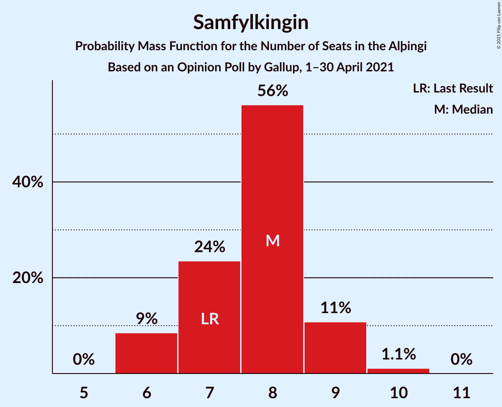
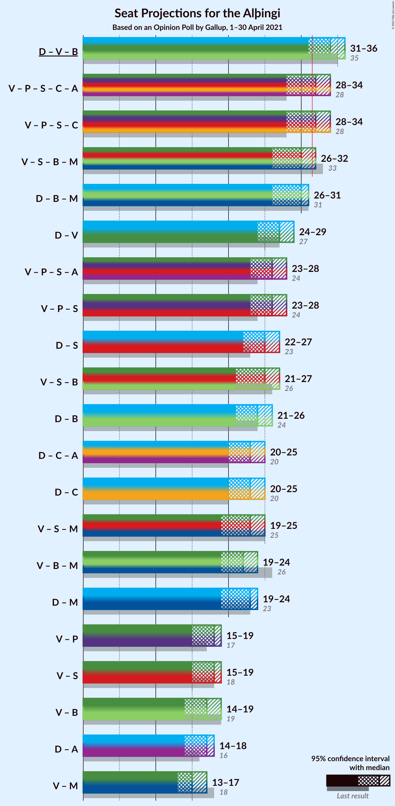
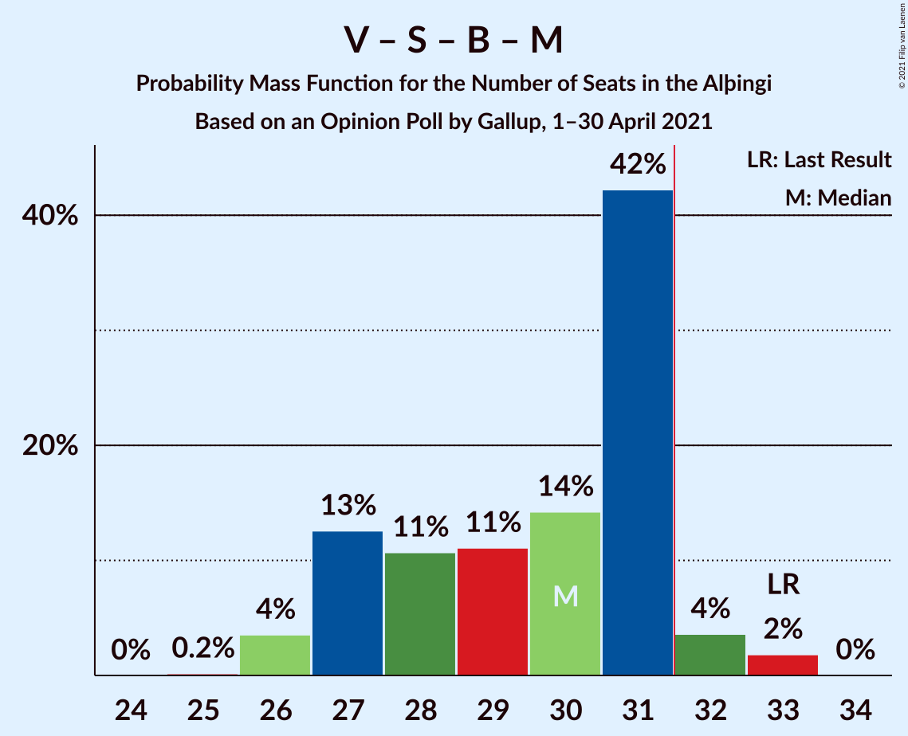
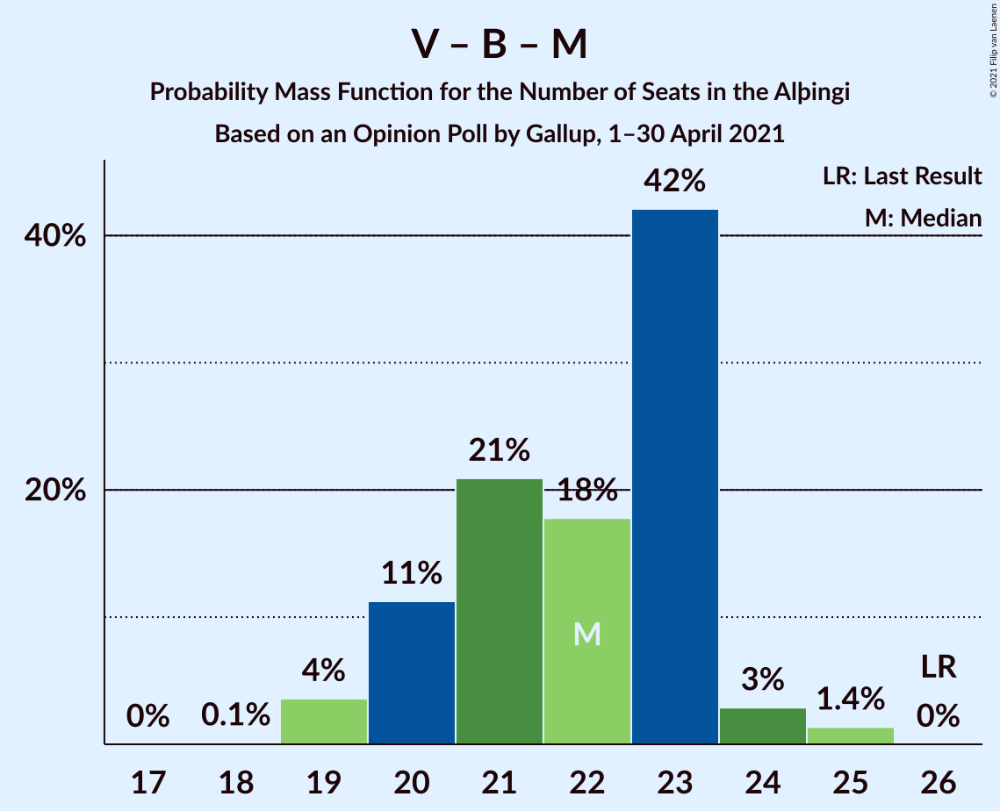

# Opinion Poll by Gallup, 1–30 April 2021

<a href="#voting-intentions">Voting Intentions</a> | <a href="#seats">Seats</a> | <a href="#coalitions">Coalitions</a> | <a href="#technical-information">Technical Information</a>

## Voting Intentions

### Confidence Intervals

| Party | Last Result | Poll Result | 80% Confidence Interval | 90% Confidence Interval | 95% Confidence Interval | 99% Confidence Interval |
|:-----:|:-----------:|:-----------:|:-----------------------:|:-----------------------:|:-----------------------:|:-----------------------:|
| Sjálfstæðisflokkurinn | 25.2% | 23.8% | 22.6–25.1% |22.2–25.4% |21.9–25.8% |21.3–26.4% |
| Vinstrihreyfingin – grænt framboð | 16.9% | 14.3% | 13.3–15.4% |13.0–15.7% |12.8–15.9% |12.3–16.5% |
| Samfylkingin | 12.1% | 12.0% | 11.1–13.0% |10.8–13.3% |10.6–13.5% |10.2–14.0% |
| Píratar | 9.2% | 12.0% | 11.1–13.0% |10.8–13.3% |10.6–13.5% |10.2–14.0% |
| Framsóknarflokkurinn | 10.7% | 10.1% | 9.2–11.0% |9.0–11.3% |8.8–11.5% |8.4–12.0% |
| Viðreisn | 6.7% | 9.6% | 8.8–10.5% |8.6–10.8% |8.4–11.0% |8.0–11.5% |
| Miðflokkurinn | 10.9% | 8.2% | 7.4–9.0% |7.2–9.3% |7.0–9.5% |6.7–9.9% |
| Sósíalistaflokkur Íslands | 0.0% | 5.0% | 4.4–5.7% |4.2–5.9% |4.1–6.1% |3.8–6.4% |
| Flokkur fólksins | 6.9% | 4.7% | 4.1–5.4% |4.0–5.6% |3.9–5.8% |3.6–6.1% |

*Note:* The poll result column reflects the actual value used in the calculations. Published results may vary slightly, and in addition be rounded to fewer digits.

## Seats

### Confidence Intervals

| Party | Last Result | Median | 80% Confidence Interval | 90% Confidence Interval | 95% Confidence Interval | 99% Confidence Interval |
|:-----:|:-----------:|:------:|:-----------------------:|:-----------------------:|:-----------------------:|:-----------------------:|
| <a href="#sjálfstæðisflokkurinn">Sjálfstæðisflokkurinn</a> | 16 | 17 | 15–18 |15–18 |15–18 |14–19 |
| <a href="#vinstrihreyfingin-–-grænt-framboð">Vinstrihreyfingin – grænt framboð</a> | 11 | 9 | 9–10 |8–10 |8–11 |8–11 |
| <a href="#samfylkingin">Samfylkingin</a> | 7 | 7 | 6–9 |6–9 |6–9 |6–10 |
| <a href="#píratar">Píratar</a> | 6 | 8 | 7–9 |7–9 |7–9 |6–9 |
| <a href="#framsóknarflokkurinn">Framsóknarflokkurinn</a> | 8 | 7 | 5–8 |5–8 |5–8 |5–8 |
| <a href="#viðreisn">Viðreisn</a> | 4 | 6 | 5–7 |5–7 |5–7 |5–7 |
| <a href="#miðflokkurinn">Miðflokkurinn</a> | 7 | 5 | 5–6 |4–6 |4–6 |4–6 |
| <a href="#sósíalistaflokkur-íslands">Sósíalistaflokkur Íslands</a> | 0 | 3 | 0–3 |0–3 |0–3 |0–4 |
| <a href="#flokkur-fólksins">Flokkur fólksins</a> | 4 | 3 | 0–3 |0–3 |0–3 |0–4 |

### Sjálfstæðisflokkurinn

*For a full overview of the results for this party, see the [Sjálfstæðisflokkurinn](party-sjálfstæðisflokkurinn.html) page.*

| Number of Seats | Probability | Accumulated | Special Marks |
|:---------------:|:-----------:|:-----------:|:-------------:|
| 13 | 0.1% | 100% |  |
| 14 | 2% | 99.9% |  |
| 15 | 13% | 98% |  |
| 16 | 17% | 85% | Last Result |
| 17 | 26% | 68% | Median |
| 18 | 40% | 41% |  |
| 19 | 1.0% | 1.1% |  |
| 20 | 0.1% | 0.1% |  |
| 21 | 0% | 0% |  |

### Vinstrihreyfingin – grænt framboð

*For a full overview of the results for this party, see the [Vinstrihreyfingin – grænt framboð](party-vinstrihreyfingin–græntframboð.html) page.*

| Number of Seats | Probability | Accumulated | Special Marks |
|:---------------:|:-----------:|:-----------:|:-------------:|
| 8 | 5% | 100% |  |
| 9 | 65% | 95% | Median |
| 10 | 25% | 29% |  |
| 11 | 4% | 4% | Last Result |
| 12 | 0.2% | 0.2% |  |
| 13 | 0% | 0% |  |

### Samfylkingin

*For a full overview of the results for this party, see the [Samfylkingin](party-samfylkingin.html) page.*

| Number of Seats | Probability | Accumulated | Special Marks |
|:---------------:|:-----------:|:-----------:|:-------------:|
| 6 | 11% | 100% |  |
| 7 | 56% | 89% | Last Result, Median |
| 8 | 18% | 33% |  |
| 9 | 14% | 15% |  |
| 10 | 0.9% | 0.9% |  |
| 11 | 0% | 0% |  |

### Píratar

*For a full overview of the results for this party, see the [Píratar](party-píratar.html) page.*

| Number of Seats | Probability | Accumulated | Special Marks |
|:---------------:|:-----------:|:-----------:|:-------------:|
| 6 | 2% | 100% | Last Result |
| 7 | 16% | 98% |  |
| 8 | 70% | 83% | Median |
| 9 | 12% | 12% |  |
| 10 | 0.4% | 0.4% |  |
| 11 | 0% | 0% |  |

### Framsóknarflokkurinn

*For a full overview of the results for this party, see the [Framsóknarflokkurinn](party-framsóknarflokkurinn.html) page.*

| Number of Seats | Probability | Accumulated | Special Marks |
|:---------------:|:-----------:|:-----------:|:-------------:|
| 5 | 27% | 100% |  |
| 6 | 16% | 73% |  |
| 7 | 34% | 57% | Median |
| 8 | 23% | 23% | Last Result |
| 9 | 0.1% | 0.1% |  |
| 10 | 0% | 0% |  |

### Viðreisn

*For a full overview of the results for this party, see the [Viðreisn](party-viðreisn.html) page.*

| Number of Seats | Probability | Accumulated | Special Marks |
|:---------------:|:-----------:|:-----------:|:-------------:|
| 4 | 0% | 100% | Last Result |
| 5 | 39% | 100% |  |
| 6 | 35% | 61% | Median |
| 7 | 26% | 26% |  |
| 8 | 0.4% | 0.4% |  |
| 9 | 0% | 0% |  |

### Miðflokkurinn

*For a full overview of the results for this party, see the [Miðflokkurinn](party-miðflokkurinn.html) page.*

| Number of Seats | Probability | Accumulated | Special Marks |
|:---------------:|:-----------:|:-----------:|:-------------:|
| 3 | 0.2% | 100% |  |
| 4 | 10% | 99.8% |  |
| 5 | 62% | 90% | Median |
| 6 | 28% | 28% |  |
| 7 | 0.3% | 0.3% | Last Result |
| 8 | 0% | 0% |  |

### Sósíalistaflokkur Íslands

*For a full overview of the results for this party, see the [Sósíalistaflokkur Íslands](party-sósíalistaflokkuríslands.html) page.*

| Number of Seats | Probability | Accumulated | Special Marks |
|:---------------:|:-----------:|:-----------:|:-------------:|
| 0 | 23% | 100% | Last Result |
| 1 | 0% | 77% |  |
| 2 | 0% | 77% |  |
| 3 | 75% | 77% | Median |
| 4 | 2% | 2% |  |
| 5 | 0% | 0% |  |

### Flokkur fólksins

*For a full overview of the results for this party, see the [Flokkur fólksins](party-flokkurfólksins.html) page.*

| Number of Seats | Probability | Accumulated | Special Marks |
|:---------------:|:-----------:|:-----------:|:-------------:|
| 0 | 49% | 100% |  |
| 1 | 0% | 51% |  |
| 2 | 0% | 51% |  |
| 3 | 50% | 51% | Median |
| 4 | 1.4% | 1.4% | Last Result |
| 5 | 0% | 0% |  |

## Coalitions

### Confidence Intervals

| Coalition | Last Result | Median | Majority? | 80% Confidence Interval | 90% Confidence Interval | 95% Confidence Interval | 99% Confidence Interval |
|:---------:|:-----------:|:------:|:---------:|:-----------------------:|:-----------------------:|:-----------------------:|:-----------------------:|
| Sjálfstæðisflokkurinn – Vinstrihreyfingin – grænt framboð – Framsóknarflokkurinn | 35 | 32 | 92% | 32–35 | 31–35 | 30–36 | 30–37 |
| Vinstrihreyfingin – grænt framboð – Píratar – Samfylkingin – Viðreisn | 28 | 30 | 27% | 28–33 | 28–33 | 28–33 | 28–35 |
| Vinstrihreyfingin – grænt framboð – Samfylkingin – Framsóknarflokkurinn – Miðflokkurinn | 33 | 29 | 4% | 26–31 | 26–31 | 26–32 | 26–33 |
| Sjálfstæðisflokkurinn – Framsóknarflokkurinn – Miðflokkurinn | 31 | 29 | 0.6% | 27–30 | 27–31 | 26–31 | 25–32 |
| Sjálfstæðisflokkurinn – Vinstrihreyfingin – grænt framboð | 27 | 26 | 0% | 25–28 | 25–28 | 24–28 | 24–29 |
| Vinstrihreyfingin – grænt framboð – Píratar – Samfylkingin | 24 | 24 | 0% | 23–27 | 23–27 | 23–27 | 23–29 |
| Sjálfstæðisflokkurinn – Samfylkingin | 23 | 25 | 0% | 23–26 | 23–26 | 22–26 | 21–27 |
| Vinstrihreyfingin – grænt framboð – Samfylkingin – Framsóknarflokkurinn | 26 | 23 | 0% | 21–26 | 21–26 | 21–26 | 21–27 |
| Sjálfstæðisflokkurinn – Framsóknarflokkurinn | 24 | 23 | 0% | 22–25 | 21–26 | 21–26 | 20–27 |
| Vinstrihreyfingin – grænt framboð – Samfylkingin – Miðflokkurinn | 25 | 22 | 0% | 20–24 | 20–24 | 20–25 | 20–25 |
| Sjálfstæðisflokkurinn – Viðreisn | 20 | 23 | 0% | 21–24 | 21–24 | 21–24 | 20–25 |
| Sjálfstæðisflokkurinn – Miðflokkurinn | 23 | 22 | 0% | 20–23 | 20–24 | 20–24 | 19–24 |
| Vinstrihreyfingin – grænt framboð – Framsóknarflokkurinn – Miðflokkurinn | 26 | 21 | 0% | 19–23 | 19–23 | 19–24 | 19–25 |
| Vinstrihreyfingin – grænt framboð – Píratar | 17 | 17 | 0% | 16–18 | 16–19 | 16–19 | 15–20 |
| Vinstrihreyfingin – grænt framboð – Samfylkingin | 18 | 16 | 0% | 15–18 | 15–19 | 15–19 | 15–20 |
| Vinstrihreyfingin – grænt framboð – Framsóknarflokkurinn | 19 | 16 | 0% | 14–17 | 14–18 | 14–19 | 14–19 |
| Vinstrihreyfingin – grænt framboð – Miðflokkurinn | 18 | 14 | 0% | 14–16 | 14–16 | 13–16 | 13–17 |

### Sjálfstæðisflokkurinn – Vinstrihreyfingin – grænt framboð – Framsóknarflokkurinn

| Number of Seats | Probability | Accumulated | Special Marks |
|:---------------:|:-----------:|:-----------:|:-------------:|
| 29 | 0.3% | 100% |  |
| 30 | 2% | 99.7% |  |
| 31 | 5% | 97% |  |
| 32 | 46% | 92% | Majority |
| 33 | 22% | 46% | Median |
| 34 | 11% | 24% |  |
| 35 | 10% | 12% | Last Result |
| 36 | 2% | 3% |  |
| 37 | 0.5% | 0.5% |  |
| 38 | 0.1% | 0.1% |  |
| 39 | 0% | 0% |  |

### Vinstrihreyfingin – grænt framboð – Píratar – Samfylkingin – Viðreisn

| Number of Seats | Probability | Accumulated | Special Marks |
|:---------------:|:-----------:|:-----------:|:-------------:|
| 26 | 0.1% | 100% |  |
| 27 | 0.2% | 99.9% |  |
| 28 | 11% | 99.7% | Last Result |
| 29 | 26% | 89% |  |
| 30 | 16% | 63% | Median |
| 31 | 20% | 47% |  |
| 32 | 7% | 27% | Majority |
| 33 | 18% | 20% |  |
| 34 | 1.0% | 2% |  |
| 35 | 0.9% | 1.0% |  |
| 36 | 0.1% | 0.1% |  |
| 37 | 0% | 0% |  |

### Vinstrihreyfingin – grænt framboð – Samfylkingin – Framsóknarflokkurinn – Miðflokkurinn

| Number of Seats | Probability | Accumulated | Special Marks |
|:---------------:|:-----------:|:-----------:|:-------------:|
| 25 | 0.1% | 100% |  |
| 26 | 24% | 99.9% |  |
| 27 | 12% | 76% |  |
| 28 | 13% | 64% | Median |
| 29 | 26% | 51% |  |
| 30 | 7% | 25% |  |
| 31 | 13% | 18% |  |
| 32 | 4% | 4% | Majority |
| 33 | 0.5% | 0.5% | Last Result |
| 34 | 0% | 0% |  |

### Sjálfstæðisflokkurinn – Framsóknarflokkurinn – Miðflokkurinn

| Number of Seats | Probability | Accumulated | Special Marks |
|:---------------:|:-----------:|:-----------:|:-------------:|
| 24 | 0.4% | 100% |  |
| 25 | 2% | 99.6% |  |
| 26 | 2% | 98% |  |
| 27 | 15% | 96% |  |
| 28 | 26% | 81% |  |
| 29 | 29% | 55% | Median |
| 30 | 18% | 26% |  |
| 31 | 7% | 8% | Last Result |
| 32 | 0.6% | 0.6% | Majority |
| 33 | 0.1% | 0.1% |  |
| 34 | 0% | 0% |  |

### Sjálfstæðisflokkurinn – Vinstrihreyfingin – grænt framboð

| Number of Seats | Probability | Accumulated | Special Marks |
|:---------------:|:-----------:|:-----------:|:-------------:|
| 22 | 0.1% | 100% |  |
| 23 | 0.2% | 99.9% |  |
| 24 | 3% | 99.7% |  |
| 25 | 26% | 97% |  |
| 26 | 29% | 71% | Median |
| 27 | 31% | 41% | Last Result |
| 28 | 10% | 11% |  |
| 29 | 0.6% | 0.9% |  |
| 30 | 0.2% | 0.2% |  |
| 31 | 0% | 0% |  |

### Vinstrihreyfingin – grænt framboð – Píratar – Samfylkingin

| Number of Seats | Probability | Accumulated | Special Marks |
|:---------------:|:-----------:|:-----------:|:-------------:|
| 21 | 0.1% | 100% |  |
| 22 | 0.2% | 99.9% |  |
| 23 | 17% | 99.7% |  |
| 24 | 45% | 82% | Last Result, Median |
| 25 | 13% | 37% |  |
| 26 | 10% | 24% |  |
| 27 | 12% | 14% |  |
| 28 | 1.0% | 2% |  |
| 29 | 0.7% | 0.7% |  |
| 30 | 0% | 0% |  |

### Sjálfstæðisflokkurinn – Samfylkingin

| Number of Seats | Probability | Accumulated | Special Marks |
|:---------------:|:-----------:|:-----------:|:-------------:|
| 20 | 0.3% | 100% |  |
| 21 | 0.9% | 99.7% |  |
| 22 | 3% | 98.8% |  |
| 23 | 32% | 96% | Last Result |
| 24 | 12% | 64% | Median |
| 25 | 33% | 52% |  |
| 26 | 17% | 19% |  |
| 27 | 2% | 2% |  |
| 28 | 0.2% | 0.2% |  |
| 29 | 0% | 0% |  |

### Vinstrihreyfingin – grænt framboð – Samfylkingin – Framsóknarflokkurinn

| Number of Seats | Probability | Accumulated | Special Marks |
|:---------------:|:-----------:|:-----------:|:-------------:|
| 21 | 18% | 100% |  |
| 22 | 25% | 82% |  |
| 23 | 17% | 57% | Median |
| 24 | 16% | 39% |  |
| 25 | 8% | 24% |  |
| 26 | 13% | 16% | Last Result |
| 27 | 2% | 2% |  |
| 28 | 0.3% | 0.3% |  |
| 29 | 0% | 0% |  |

### Sjálfstæðisflokkurinn – Framsóknarflokkurinn

| Number of Seats | Probability | Accumulated | Special Marks |
|:---------------:|:-----------:|:-----------:|:-------------:|
| 20 | 2% | 100% |  |
| 21 | 5% | 98% |  |
| 22 | 7% | 92% |  |
| 23 | 44% | 85% |  |
| 24 | 20% | 41% | Last Result, Median |
| 25 | 12% | 20% |  |
| 26 | 8% | 8% |  |
| 27 | 0.5% | 0.6% |  |
| 28 | 0.1% | 0.1% |  |
| 29 | 0% | 0% |  |

### Vinstrihreyfingin – grænt framboð – Samfylkingin – Miðflokkurinn

| Number of Seats | Probability | Accumulated | Special Marks |
|:---------------:|:-----------:|:-----------:|:-------------:|
| 18 | 0.1% | 100% |  |
| 19 | 0.3% | 99.9% |  |
| 20 | 11% | 99.6% |  |
| 21 | 35% | 89% | Median |
| 22 | 28% | 53% |  |
| 23 | 10% | 25% |  |
| 24 | 12% | 15% |  |
| 25 | 3% | 3% | Last Result |
| 26 | 0.2% | 0.2% |  |
| 27 | 0% | 0% |  |

### Sjálfstæðisflokkurinn – Viðreisn

| Number of Seats | Probability | Accumulated | Special Marks |
|:---------------:|:-----------:|:-----------:|:-------------:|
| 19 | 0.3% | 100% |  |
| 20 | 1.0% | 99.6% | Last Result |
| 21 | 11% | 98.6% |  |
| 22 | 18% | 88% |  |
| 23 | 47% | 70% | Median |
| 24 | 20% | 22% |  |
| 25 | 2% | 2% |  |
| 26 | 0.3% | 0.3% |  |
| 27 | 0% | 0% |  |

### Sjálfstæðisflokkurinn – Miðflokkurinn

| Number of Seats | Probability | Accumulated | Special Marks |
|:---------------:|:-----------:|:-----------:|:-------------:|
| 17 | 0.1% | 100% |  |
| 18 | 0.1% | 99.9% |  |
| 19 | 2% | 99.8% |  |
| 20 | 9% | 98% |  |
| 21 | 9% | 89% |  |
| 22 | 42% | 79% | Median |
| 23 | 30% | 38% | Last Result |
| 24 | 7% | 8% |  |
| 25 | 0.3% | 0.3% |  |
| 26 | 0% | 0% |  |

### Vinstrihreyfingin – grænt framboð – Framsóknarflokkurinn – Miðflokkurinn

| Number of Seats | Probability | Accumulated | Special Marks |
|:---------------:|:-----------:|:-----------:|:-------------:|
| 18 | 0.4% | 100% |  |
| 19 | 25% | 99.6% |  |
| 20 | 9% | 75% |  |
| 21 | 21% | 66% | Median |
| 22 | 35% | 45% |  |
| 23 | 7% | 10% |  |
| 24 | 3% | 4% |  |
| 25 | 0.6% | 0.6% |  |
| 26 | 0% | 0% | Last Result |

### Vinstrihreyfingin – grænt framboð – Píratar

| Number of Seats | Probability | Accumulated | Special Marks |
|:---------------:|:-----------:|:-----------:|:-------------:|
| 14 | 0.1% | 100% |  |
| 15 | 0.6% | 99.9% |  |
| 16 | 15% | 99.3% |  |
| 17 | 54% | 85% | Last Result, Median |
| 18 | 24% | 30% |  |
| 19 | 5% | 6% |  |
| 20 | 1.5% | 1.5% |  |
| 21 | 0% | 0% |  |

### Vinstrihreyfingin – grænt framboð – Samfylkingin

| Number of Seats | Probability | Accumulated | Special Marks |
|:---------------:|:-----------:|:-----------:|:-------------:|
| 14 | 0.1% | 100% |  |
| 15 | 11% | 99.9% |  |
| 16 | 47% | 89% | Median |
| 17 | 17% | 42% |  |
| 18 | 16% | 25% | Last Result |
| 19 | 8% | 9% |  |
| 20 | 1.2% | 1.2% |  |
| 21 | 0.1% | 0.1% |  |
| 22 | 0% | 0% |  |

### Vinstrihreyfingin – grænt framboð – Framsóknarflokkurinn

| Number of Seats | Probability | Accumulated | Special Marks |
|:---------------:|:-----------:|:-----------:|:-------------:|
| 14 | 24% | 100% |  |
| 15 | 13% | 76% |  |
| 16 | 30% | 63% | Median |
| 17 | 25% | 32% |  |
| 18 | 5% | 8% |  |
| 19 | 2% | 3% | Last Result |
| 20 | 0% | 0% |  |

### Vinstrihreyfingin – grænt framboð – Miðflokkurinn

| Number of Seats | Probability | Accumulated | Special Marks |
|:---------------:|:-----------:|:-----------:|:-------------:|
| 12 | 0.5% | 100% |  |
| 13 | 3% | 99.5% |  |
| 14 | 59% | 97% | Median |
| 15 | 27% | 38% |  |
| 16 | 9% | 11% |  |
| 17 | 2% | 2% |  |
| 18 | 0% | 0% | Last Result |

## Technical Information

### Opinion Poll

+ **Polling firm:** Gallup
+ **Commissioner(s):** —
+ **Fieldwork period:** 1–30 April 2021

### Calculations

+ **Sample size:** 1884
+ **Simulations done:** 131,072
+ **Error estimate:** 1.05%

