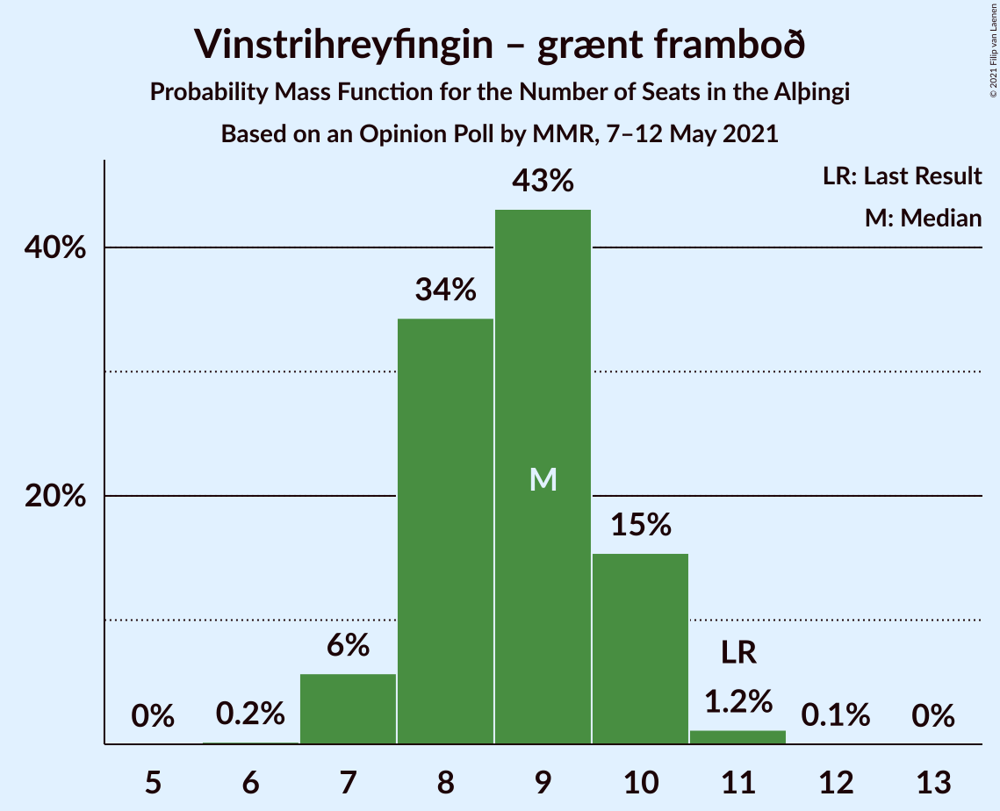
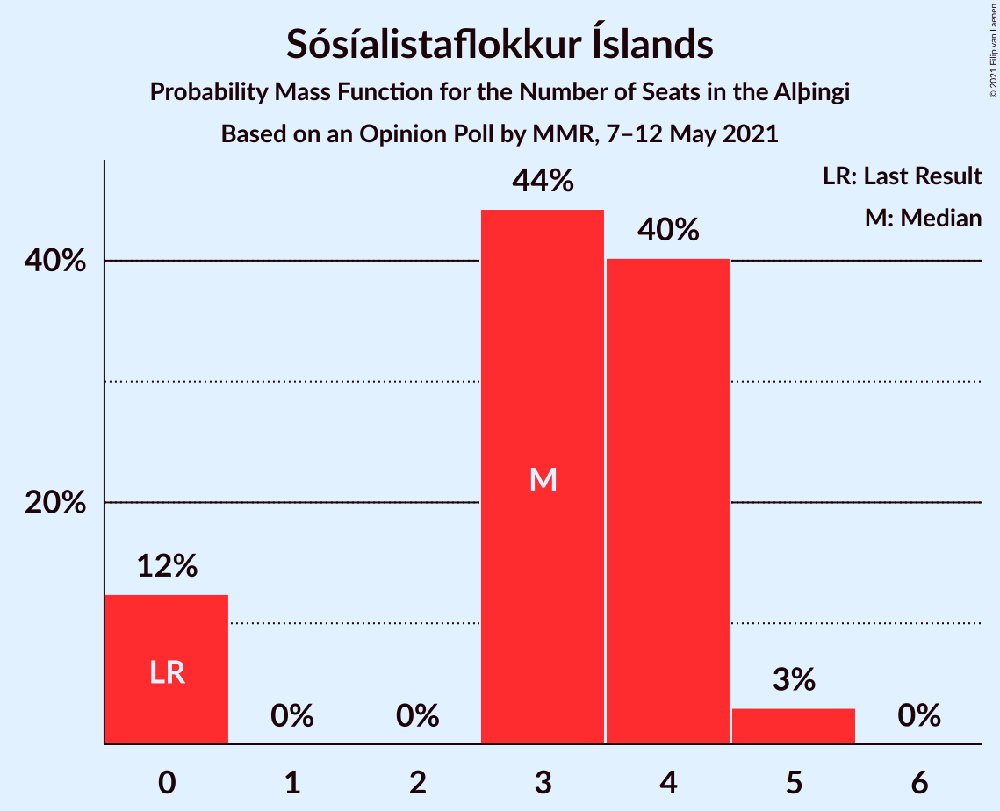
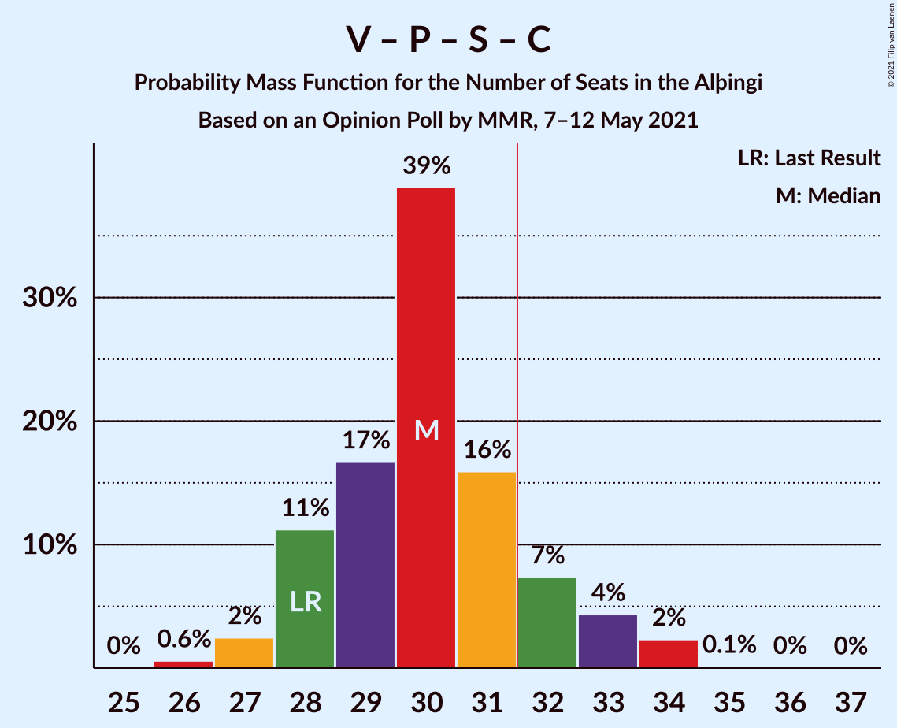
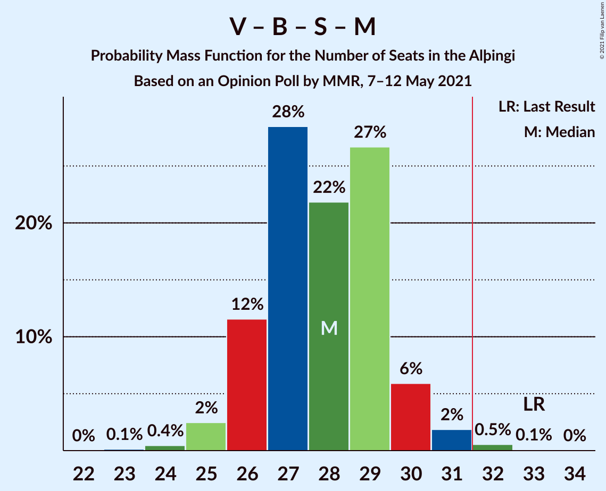
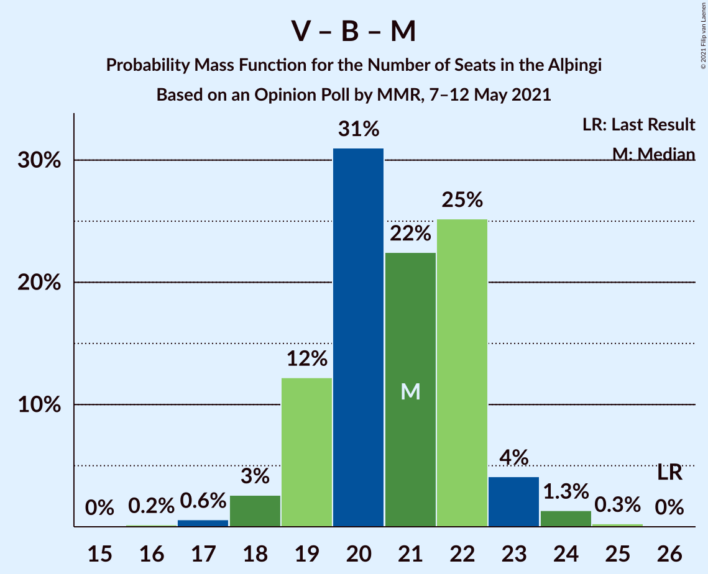

# Opinion Poll by MMR, 7–12 May 2021

<a href="#voting-intentions">Voting Intentions</a> | <a href="#seats">Seats</a> | <a href="#coalitions">Coalitions</a> | <a href="#technical-information">Technical Information</a>

## Voting Intentions

### Confidence Intervals

| Party | Last Result | Poll Result | 80% Confidence Interval | 90% Confidence Interval | 95% Confidence Interval | 99% Confidence Interval |
|:-----:|:-----------:|:-----------:|:-----------------------:|:-----------------------:|:-----------------------:|:-----------------------:|
| Sjálfstæðisflokkurinn | 25.2% | 25.6% | 23.9–27.5% |23.4–28.0% |22.9–28.5% |22.1–29.4% |
| Vinstrihreyfingin – grænt framboð | 16.9% | 13.1% | 11.8–14.6% |11.4–15.0% |11.1–15.4% |10.5–16.2% |
| Framsóknarflokkurinn | 10.7% | 12.6% | 11.3–14.1% |10.9–14.5% |10.6–14.9% |10.0–15.6% |
| Píratar | 9.2% | 11.3% | 10.1–12.8% |9.8–13.2% |9.5–13.5% |8.9–14.2% |
| Samfylkingin | 12.1% | 10.9% | 9.7–12.3% |9.4–12.7% |9.1–13.1% |8.5–13.7% |
| Viðreisn | 6.7% | 10.6% | 9.4–12.0% |9.1–12.4% |8.8–12.7% |8.3–13.4% |
| Miðflokkurinn | 10.9% | 5.7% | 4.8–6.8% |4.6–7.1% |4.4–7.3% |4.0–7.9% |
| Sósíalistaflokkur Íslands | 0.0% | 5.7% | 4.8–6.8% |4.6–7.1% |4.4–7.3% |4.0–7.9% |
| Flokkur fólksins | 6.9% | 3.3% | 2.6–4.1% |2.4–4.4% |2.3–4.6% |2.0–5.0% |

*Note:* The poll result column reflects the actual value used in the calculations. Published results may vary slightly, and in addition be rounded to fewer digits.

## Seats

### Confidence Intervals

| Party | Last Result | Median | 80% Confidence Interval | 90% Confidence Interval | 95% Confidence Interval | 99% Confidence Interval |
|:-----:|:-----------:|:------:|:-----------------------:|:-----------------------:|:-----------------------:|:-----------------------:|
| <a href="#sjálfstæðisflokkurinn">Sjálfstæðisflokkurinn</a> | 16 | 18 | 17–19 |16–20 |15–20 |15–21 |
| <a href="#vinstrihreyfingin-–-grænt-framboð">Vinstrihreyfingin – grænt framboð</a> | 11 | 9 | 8–10 |7–10 |7–10 |7–11 |
| <a href="#framsóknarflokkurinn">Framsóknarflokkurinn</a> | 8 | 9 | 8–10 |8–10 |8–11 |7–12 |
| <a href="#píratar">Píratar</a> | 6 | 7 | 7–8 |6–9 |6–9 |5–9 |
| <a href="#samfylkingin">Samfylkingin</a> | 7 | 7 | 6–8 |6–8 |6–9 |5–9 |
| <a href="#viðreisn">Viðreisn</a> | 4 | 7 | 6–8 |6–8 |6–8 |5–9 |
| <a href="#miðflokkurinn">Miðflokkurinn</a> | 7 | 3 | 1–4 |1–4 |1–4 |0–5 |
| <a href="#sósíalistaflokkur-íslands">Sósíalistaflokkur Íslands</a> | 0 | 3 | 0–4 |0–4 |0–5 |0–5 |
| <a href="#flokkur-fólksins">Flokkur fólksins</a> | 4 | 0 | 0 |0 |0 |0 |

### Sjálfstæðisflokkurinn

*For a full overview of the results for this party, see the [Sjálfstæðisflokkurinn](party-sjálfstæðisflokkurinn.html) page.*

| Number of Seats | Probability | Accumulated | Special Marks |
|:---------------:|:-----------:|:-----------:|:-------------:|
| 14 | 0.3% | 100% |  |
| 15 | 2% | 99.7% |  |
| 16 | 4% | 97% | Last Result |
| 17 | 29% | 93% |  |
| 18 | 32% | 64% | Median |
| 19 | 26% | 32% |  |
| 20 | 5% | 6% |  |
| 21 | 0.5% | 0.6% |  |
| 22 | 0.1% | 0.1% |  |
| 23 | 0% | 0% |  |

### Vinstrihreyfingin – grænt framboð

*For a full overview of the results for this party, see the [Vinstrihreyfingin – grænt framboð](party-vinstrihreyfingin–græntframboð.html) page.*

| Number of Seats | Probability | Accumulated | Special Marks |
|:---------------:|:-----------:|:-----------:|:-------------:|
| 6 | 0.2% | 100% |  |
| 7 | 7% | 99.8% |  |
| 8 | 25% | 93% |  |
| 9 | 51% | 68% | Median |
| 10 | 16% | 18% |  |
| 11 | 1.5% | 2% | Last Result |
| 12 | 0.1% | 0.1% |  |
| 13 | 0% | 0% |  |

### Framsóknarflokkurinn

*For a full overview of the results for this party, see the [Framsóknarflokkurinn](party-framsóknarflokkurinn.html) page.*

| Number of Seats | Probability | Accumulated | Special Marks |
|:---------------:|:-----------:|:-----------:|:-------------:|
| 6 | 0.5% | 100% |  |
| 7 | 2% | 99.5% |  |
| 8 | 34% | 98% | Last Result |
| 9 | 27% | 64% | Median |
| 10 | 34% | 37% |  |
| 11 | 2% | 3% |  |
| 12 | 1.2% | 1.2% |  |
| 13 | 0% | 0% |  |

### Píratar

*For a full overview of the results for this party, see the [Píratar](party-píratar.html) page.*

| Number of Seats | Probability | Accumulated | Special Marks |
|:---------------:|:-----------:|:-----------:|:-------------:|
| 5 | 0.6% | 100% |  |
| 6 | 8% | 99.4% | Last Result |
| 7 | 46% | 92% | Median |
| 8 | 39% | 45% |  |
| 9 | 6% | 6% |  |
| 10 | 0.4% | 0.4% |  |
| 11 | 0% | 0% |  |

### Samfylkingin

*For a full overview of the results for this party, see the [Samfylkingin](party-samfylkingin.html) page.*

| Number of Seats | Probability | Accumulated | Special Marks |
|:---------------:|:-----------:|:-----------:|:-------------:|
| 5 | 0.7% | 100% |  |
| 6 | 14% | 99.3% |  |
| 7 | 65% | 85% | Last Result, Median |
| 8 | 17% | 20% |  |
| 9 | 2% | 3% |  |
| 10 | 0.4% | 0.4% |  |
| 11 | 0% | 0% |  |

### Viðreisn

*For a full overview of the results for this party, see the [Viðreisn](party-viðreisn.html) page.*

| Number of Seats | Probability | Accumulated | Special Marks |
|:---------------:|:-----------:|:-----------:|:-------------:|
| 4 | 0% | 100% | Last Result |
| 5 | 2% | 100% |  |
| 6 | 43% | 98% |  |
| 7 | 35% | 55% | Median |
| 8 | 18% | 20% |  |
| 9 | 2% | 2% |  |
| 10 | 0.1% | 0.1% |  |
| 11 | 0% | 0% |  |

### Miðflokkurinn

*For a full overview of the results for this party, see the [Miðflokkurinn](party-miðflokkurinn.html) page.*

| Number of Seats | Probability | Accumulated | Special Marks |
|:---------------:|:-----------:|:-----------:|:-------------:|
| 0 | 1.0% | 100% |  |
| 1 | 17% | 99.0% |  |
| 2 | 0% | 82% |  |
| 3 | 45% | 82% | Median |
| 4 | 35% | 37% |  |
| 5 | 2% | 2% |  |
| 6 | 0% | 0% |  |
| 7 | 0% | 0% | Last Result |

### Sósíalistaflokkur Íslands

*For a full overview of the results for this party, see the [Sósíalistaflokkur Íslands](party-sósíalistaflokkuríslands.html) page.*

| Number of Seats | Probability | Accumulated | Special Marks |
|:---------------:|:-----------:|:-----------:|:-------------:|
| 0 | 13% | 100% | Last Result |
| 1 | 0% | 87% |  |
| 2 | 0% | 87% |  |
| 3 | 55% | 87% | Median |
| 4 | 29% | 32% |  |
| 5 | 3% | 3% |  |
| 6 | 0.1% | 0.1% |  |
| 7 | 0% | 0% |  |

### Flokkur fólksins

*For a full overview of the results for this party, see the [Flokkur fólksins](party-flokkurfólksins.html) page.*

| Number of Seats | Probability | Accumulated | Special Marks |
|:---------------:|:-----------:|:-----------:|:-------------:|
| 0 | 99.6% | 100% | Median |
| 1 | 0% | 0.4% |  |
| 2 | 0% | 0.4% |  |
| 3 | 0.4% | 0.4% |  |
| 4 | 0% | 0% | Last Result |

## Coalitions

### Confidence Intervals

| Coalition | Last Result | Median | Majority? | 80% Confidence Interval | 90% Confidence Interval | 95% Confidence Interval | 99% Confidence Interval |
|:---------:|:-----------:|:------:|:---------:|:-----------------------:|:-----------------------:|:-----------------------:|:-----------------------:|
| Sjálfstæðisflokkurinn – Vinstrihreyfingin – grænt framboð – Framsóknarflokkurinn | 35 | 36 | 99.7% | 34–37 | 33–38 | 33–38 | 32–40 |
| Sjálfstæðisflokkurinn – Framsóknarflokkurinn – Miðflokkurinn | 31 | 30 | 14% | 28–32 | 27–32 | 27–33 | 26–33 |
| Vinstrihreyfingin – grænt framboð – Píratar – Samfylkingin – Viðreisn | 28 | 30 | 14% | 28–32 | 28–33 | 27–33 | 26–34 |
| Vinstrihreyfingin – grænt framboð – Framsóknarflokkurinn – Samfylkingin – Miðflokkurinn | 33 | 28 | 0.7% | 26–29 | 26–30 | 25–31 | 25–32 |
| Sjálfstæðisflokkurinn – Framsóknarflokkurinn | 24 | 27 | 0% | 25–29 | 25–29 | 24–30 | 23–30 |
| Sjálfstæðisflokkurinn – Vinstrihreyfingin – grænt framboð | 27 | 27 | 0% | 26–28 | 25–29 | 24–29 | 23–30 |
| Sjálfstæðisflokkurinn – Samfylkingin | 23 | 25 | 0% | 24–27 | 23–27 | 23–27 | 22–28 |
| Vinstrihreyfingin – grænt framboð – Framsóknarflokkurinn – Samfylkingin | 26 | 25 | 0% | 23–26 | 23–27 | 22–27 | 21–29 |
| Sjálfstæðisflokkurinn – Viðreisn | 20 | 25 | 0% | 23–26 | 23–27 | 22–27 | 21–28 |
| Vinstrihreyfingin – grænt framboð – Píratar – Samfylkingin | 24 | 23 | 0% | 22–25 | 21–26 | 21–26 | 20–27 |
| Sjálfstæðisflokkurinn – Miðflokkurinn | 23 | 21 | 0% | 19–23 | 18–23 | 18–24 | 17–24 |
| Vinstrihreyfingin – grænt framboð – Framsóknarflokkurinn – Miðflokkurinn | 26 | 21 | 0% | 19–22 | 19–23 | 18–23 | 17–24 |
| Vinstrihreyfingin – grænt framboð – Samfylkingin – Miðflokkurinn | 25 | 19 | 0% | 17–20 | 17–21 | 16–22 | 15–23 |
| Vinstrihreyfingin – grænt framboð – Framsóknarflokkurinn | 19 | 18 | 0% | 16–19 | 16–19 | 15–20 | 15–21 |
| Vinstrihreyfingin – grænt framboð – Píratar | 17 | 16 | 0% | 15–18 | 14–18 | 14–19 | 13–19 |
| Vinstrihreyfingin – grænt framboð – Samfylkingin | 18 | 16 | 0% | 15–17 | 14–18 | 14–18 | 13–19 |
| Vinstrihreyfingin – grænt framboð – Miðflokkurinn | 18 | 12 | 0% | 10–13 | 10–14 | 9–14 | 9–15 |

### Sjálfstæðisflokkurinn – Vinstrihreyfingin – grænt framboð – Framsóknarflokkurinn

| Number of Seats | Probability | Accumulated | Special Marks |
|:---------------:|:-----------:|:-----------:|:-------------:|
| 31 | 0.3% | 100% |  |
| 32 | 1.0% | 99.7% | Majority |
| 33 | 4% | 98.8% |  |
| 34 | 11% | 95% |  |
| 35 | 22% | 84% | Last Result |
| 36 | 39% | 62% | Median |
| 37 | 13% | 23% |  |
| 38 | 8% | 10% |  |
| 39 | 1.1% | 2% |  |
| 40 | 0.4% | 0.6% |  |
| 41 | 0.2% | 0.2% |  |
| 42 | 0% | 0% |  |

### Sjálfstæðisflokkurinn – Framsóknarflokkurinn – Miðflokkurinn

| Number of Seats | Probability | Accumulated | Special Marks |
|:---------------:|:-----------:|:-----------:|:-------------:|
| 25 | 0.4% | 100% |  |
| 26 | 1.0% | 99.6% |  |
| 27 | 4% | 98.7% |  |
| 28 | 11% | 94% |  |
| 29 | 11% | 83% |  |
| 30 | 38% | 71% | Median |
| 31 | 20% | 34% | Last Result |
| 32 | 11% | 14% | Majority |
| 33 | 3% | 3% |  |
| 34 | 0.3% | 0.4% |  |
| 35 | 0% | 0% |  |

### Vinstrihreyfingin – grænt framboð – Píratar – Samfylkingin – Viðreisn

| Number of Seats | Probability | Accumulated | Special Marks |
|:---------------:|:-----------:|:-----------:|:-------------:|
| 26 | 0.6% | 100% |  |
| 27 | 3% | 99.4% |  |
| 28 | 9% | 96% | Last Result |
| 29 | 20% | 87% |  |
| 30 | 35% | 67% | Median |
| 31 | 18% | 32% |  |
| 32 | 7% | 14% | Majority |
| 33 | 5% | 7% |  |
| 34 | 2% | 2% |  |
| 35 | 0.1% | 0.2% |  |
| 36 | 0.1% | 0.1% |  |
| 37 | 0% | 0% |  |

### Vinstrihreyfingin – grænt framboð – Framsóknarflokkurinn – Samfylkingin – Miðflokkurinn

| Number of Seats | Probability | Accumulated | Special Marks |
|:---------------:|:-----------:|:-----------:|:-------------:|
| 23 | 0.1% | 100% |  |
| 24 | 0.4% | 99.9% |  |
| 25 | 3% | 99.5% |  |
| 26 | 10% | 96% |  |
| 27 | 29% | 87% |  |
| 28 | 15% | 57% | Median |
| 29 | 35% | 43% |  |
| 30 | 6% | 8% |  |
| 31 | 2% | 3% |  |
| 32 | 0.6% | 0.7% | Majority |
| 33 | 0.1% | 0.1% | Last Result |
| 34 | 0% | 0% |  |

### Sjálfstæðisflokkurinn – Framsóknarflokkurinn

| Number of Seats | Probability | Accumulated | Special Marks |
|:---------------:|:-----------:|:-----------:|:-------------:|
| 22 | 0.1% | 100% |  |
| 23 | 1.1% | 99.9% |  |
| 24 | 3% | 98.9% | Last Result |
| 25 | 9% | 96% |  |
| 26 | 13% | 87% |  |
| 27 | 52% | 75% | Median |
| 28 | 10% | 23% |  |
| 29 | 10% | 13% |  |
| 30 | 2% | 3% |  |
| 31 | 0.1% | 0.1% |  |
| 32 | 0% | 0% | Majority |

### Sjálfstæðisflokkurinn – Vinstrihreyfingin – grænt framboð

| Number of Seats | Probability | Accumulated | Special Marks |
|:---------------:|:-----------:|:-----------:|:-------------:|
| 22 | 0.2% | 100% |  |
| 23 | 1.1% | 99.8% |  |
| 24 | 2% | 98.8% |  |
| 25 | 7% | 97% |  |
| 26 | 40% | 90% |  |
| 27 | 27% | 50% | Last Result, Median |
| 28 | 14% | 24% |  |
| 29 | 7% | 10% |  |
| 30 | 2% | 2% |  |
| 31 | 0.4% | 0.4% |  |
| 32 | 0% | 0% | Majority |

### Sjálfstæðisflokkurinn – Samfylkingin

| Number of Seats | Probability | Accumulated | Special Marks |
|:---------------:|:-----------:|:-----------:|:-------------:|
| 21 | 0.4% | 100% |  |
| 22 | 2% | 99.5% |  |
| 23 | 5% | 98% | Last Result |
| 24 | 26% | 93% |  |
| 25 | 36% | 67% | Median |
| 26 | 20% | 31% |  |
| 27 | 9% | 10% |  |
| 28 | 1.4% | 2% |  |
| 29 | 0.4% | 0.4% |  |
| 30 | 0% | 0% |  |

### Vinstrihreyfingin – grænt framboð – Framsóknarflokkurinn – Samfylkingin

| Number of Seats | Probability | Accumulated | Special Marks |
|:---------------:|:-----------:|:-----------:|:-------------:|
| 21 | 0.8% | 100% |  |
| 22 | 2% | 99.2% |  |
| 23 | 12% | 97% |  |
| 24 | 25% | 85% |  |
| 25 | 21% | 60% | Median |
| 26 | 32% | 39% | Last Result |
| 27 | 6% | 7% |  |
| 28 | 1.2% | 2% |  |
| 29 | 0.6% | 0.6% |  |
| 30 | 0% | 0% |  |

### Sjálfstæðisflokkurinn – Viðreisn

| Number of Seats | Probability | Accumulated | Special Marks |
|:---------------:|:-----------:|:-----------:|:-------------:|
| 20 | 0.1% | 100% | Last Result |
| 21 | 0.5% | 99.9% |  |
| 22 | 2% | 99.4% |  |
| 23 | 24% | 97% |  |
| 24 | 19% | 73% |  |
| 25 | 23% | 55% | Median |
| 26 | 23% | 31% |  |
| 27 | 7% | 9% |  |
| 28 | 1.3% | 2% |  |
| 29 | 0.3% | 0.3% |  |
| 30 | 0% | 0% |  |

### Vinstrihreyfingin – grænt framboð – Píratar – Samfylkingin

| Number of Seats | Probability | Accumulated | Special Marks |
|:---------------:|:-----------:|:-----------:|:-------------:|
| 19 | 0.1% | 100% |  |
| 20 | 0.9% | 99.9% |  |
| 21 | 8% | 99.0% |  |
| 22 | 22% | 91% |  |
| 23 | 19% | 69% | Median |
| 24 | 33% | 49% | Last Result |
| 25 | 9% | 16% |  |
| 26 | 5% | 7% |  |
| 27 | 1.3% | 1.4% |  |
| 28 | 0.1% | 0.1% |  |
| 29 | 0% | 0% |  |

### Sjálfstæðisflokkurinn – Miðflokkurinn

| Number of Seats | Probability | Accumulated | Special Marks |
|:---------------:|:-----------:|:-----------:|:-------------:|
| 16 | 0.1% | 100% |  |
| 17 | 1.1% | 99.9% |  |
| 18 | 6% | 98.8% |  |
| 19 | 8% | 93% |  |
| 20 | 25% | 86% |  |
| 21 | 21% | 61% | Median |
| 22 | 27% | 40% |  |
| 23 | 11% | 14% | Last Result |
| 24 | 3% | 3% |  |
| 25 | 0.3% | 0.3% |  |
| 26 | 0% | 0% |  |

### Vinstrihreyfingin – grænt framboð – Framsóknarflokkurinn – Miðflokkurinn

| Number of Seats | Probability | Accumulated | Special Marks |
|:---------------:|:-----------:|:-----------:|:-------------:|
| 16 | 0.1% | 100% |  |
| 17 | 0.4% | 99.9% |  |
| 18 | 2% | 99.5% |  |
| 19 | 14% | 97% |  |
| 20 | 23% | 83% |  |
| 21 | 20% | 60% | Median |
| 22 | 34% | 40% |  |
| 23 | 4% | 5% |  |
| 24 | 1.2% | 1.5% |  |
| 25 | 0.3% | 0.3% |  |
| 26 | 0% | 0% | Last Result |

### Vinstrihreyfingin – grænt framboð – Samfylkingin – Miðflokkurinn

| Number of Seats | Probability | Accumulated | Special Marks |
|:---------------:|:-----------:|:-----------:|:-------------:|
| 15 | 0.5% | 100% |  |
| 16 | 2% | 99.4% |  |
| 17 | 11% | 97% |  |
| 18 | 24% | 87% |  |
| 19 | 32% | 63% | Median |
| 20 | 22% | 31% |  |
| 21 | 6% | 9% |  |
| 22 | 2% | 4% |  |
| 23 | 1.1% | 1.2% |  |
| 24 | 0.1% | 0.1% |  |
| 25 | 0% | 0% | Last Result |

### Vinstrihreyfingin – grænt framboð – Framsóknarflokkurinn

| Number of Seats | Probability | Accumulated | Special Marks |
|:---------------:|:-----------:|:-----------:|:-------------:|
| 14 | 0.3% | 100% |  |
| 15 | 4% | 99.7% |  |
| 16 | 9% | 96% |  |
| 17 | 25% | 87% |  |
| 18 | 29% | 62% | Median |
| 19 | 29% | 33% | Last Result |
| 20 | 3% | 4% |  |
| 21 | 1.0% | 1.1% |  |
| 22 | 0.1% | 0.1% |  |
| 23 | 0% | 0% |  |

### Vinstrihreyfingin – grænt framboð – Píratar

| Number of Seats | Probability | Accumulated | Special Marks |
|:---------------:|:-----------:|:-----------:|:-------------:|
| 13 | 0.5% | 100% |  |
| 14 | 6% | 99.4% |  |
| 15 | 23% | 93% |  |
| 16 | 24% | 70% | Median |
| 17 | 34% | 46% | Last Result |
| 18 | 9% | 12% |  |
| 19 | 2% | 3% |  |
| 20 | 0.4% | 0.4% |  |
| 21 | 0% | 0% |  |

### Vinstrihreyfingin – grænt framboð – Samfylkingin

| Number of Seats | Probability | Accumulated | Special Marks |
|:---------------:|:-----------:|:-----------:|:-------------:|
| 12 | 0.1% | 100% |  |
| 13 | 0.9% | 99.9% |  |
| 14 | 8% | 99.0% |  |
| 15 | 25% | 91% |  |
| 16 | 43% | 66% | Median |
| 17 | 15% | 23% |  |
| 18 | 7% | 8% | Last Result |
| 19 | 1.1% | 1.3% |  |
| 20 | 0.2% | 0.3% |  |
| 21 | 0% | 0% |  |

### Vinstrihreyfingin – grænt framboð – Miðflokkurinn

| Number of Seats | Probability | Accumulated | Special Marks |
|:---------------:|:-----------:|:-----------:|:-------------:|
| 8 | 0.4% | 100% |  |
| 9 | 2% | 99.6% |  |
| 10 | 11% | 97% |  |
| 11 | 26% | 87% |  |
| 12 | 29% | 61% | Median |
| 13 | 26% | 32% |  |
| 14 | 5% | 6% |  |
| 15 | 0.9% | 1.1% |  |
| 16 | 0.1% | 0.1% |  |
| 17 | 0% | 0% |  |
| 18 | 0% | 0% | Last Result |

## Technical Information

### Opinion Poll

+ **Polling firm:** MMR
+ **Commissioner(s):** —
+ **Fieldwork period:** 7–12 May 2021

### Calculations

+ **Sample size:** 953
+ **Simulations done:** 524,288
+ **Error estimate:** 1.45%

