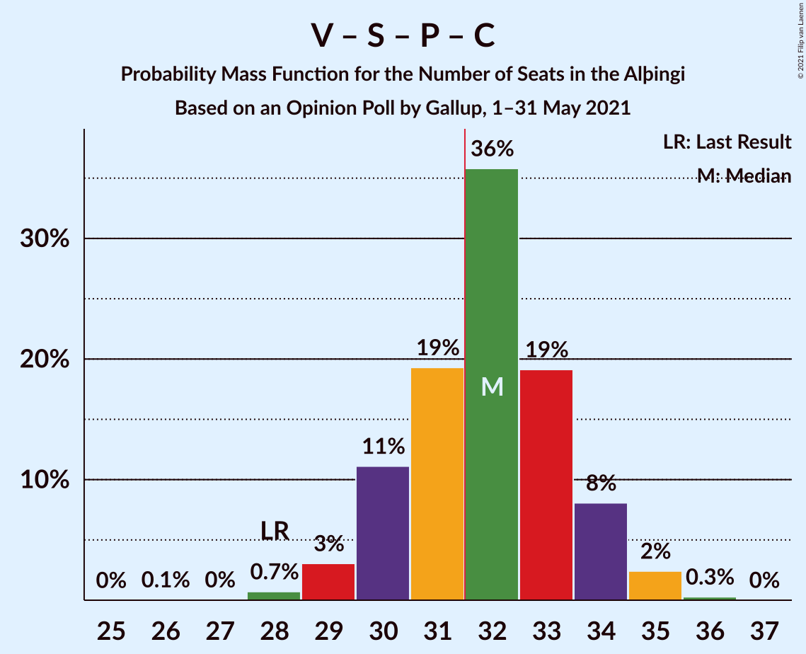
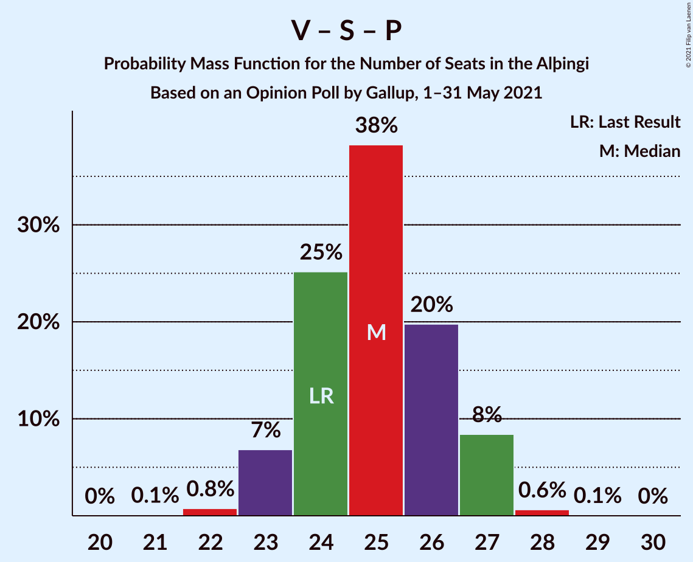

# Opinion Poll by Gallup, 1–31 May 2021

<a href="#voting-intentions">Voting Intentions</a> | <a href="#seats">Seats</a> | <a href="#coalitions">Coalitions</a> | <a href="#technical-information">Technical Information</a>

## Voting Intentions

### Confidence Intervals

| Party | Last Result | Poll Result | 80% Confidence Interval | 90% Confidence Interval | 95% Confidence Interval | 99% Confidence Interval |
|:-----:|:-----------:|:-----------:|:-----------------------:|:-----------------------:|:-----------------------:|:-----------------------:|
| Sjálfstæðisflokkurinn | 25.2% | 23.5% | 22.3–24.8% |21.9–25.2% |21.7–25.5% |21.1–26.1% |
| Vinstrihreyfingin – grænt framboð | 16.9% | 14.7% | 13.7–15.8% |13.4–16.1% |13.2–16.4% |12.7–16.9% |
| Samfylkingin | 12.1% | 12.4% | 11.5–13.4% |11.2–13.7% |11.0–14.0% |10.6–14.5% |
| Píratar | 9.2% | 11.0% | 10.1–12.0% |9.9–12.2% |9.6–12.5% |9.3–13.0% |
| Viðreisn | 6.7% | 10.9% | 10.0–11.9% |9.8–12.1% |9.6–12.4% |9.1–12.8% |
| Framsóknarflokkurinn | 10.7% | 10.4% | 9.5–11.4% |9.3–11.6% |9.1–11.9% |8.7–12.3% |
| Miðflokkurinn | 10.9% | 7.2% | 6.5–8.0% |6.3–8.3% |6.1–8.5% |5.8–8.9% |
| Sósíalistaflokkur Íslands | 0.0% | 5.4% | 4.8–6.1% |4.6–6.4% |4.5–6.5% |4.2–6.9% |
| Flokkur fólksins | 6.9% | 4.3% | 3.7–5.0% |3.6–5.2% |3.5–5.3% |3.2–5.7% |

*Note:* The poll result column reflects the actual value used in the calculations. Published results may vary slightly, and in addition be rounded to fewer digits.

## Seats

### Confidence Intervals

| Party | Last Result | Median | 80% Confidence Interval | 90% Confidence Interval | 95% Confidence Interval | 99% Confidence Interval |
|:-----:|:-----------:|:------:|:-----------------------:|:-----------------------:|:-----------------------:|:-----------------------:|
| <a href="#sjálfstæðisflokkurinn">Sjálfstæðisflokkurinn</a> | 16 | 15 | 15–18 |15–18 |14–19 |14–19 |
| <a href="#vinstrihreyfingin-–-grænt-framboð">Vinstrihreyfingin – grænt framboð</a> | 11 | 9 | 9–10 |9–11 |9–11 |8–11 |
| <a href="#samfylkingin">Samfylkingin</a> | 7 | 8 | 7–9 |7–9 |7–9 |7–10 |
| <a href="#píratar">Píratar</a> | 6 | 8 | 6–8 |6–8 |6–8 |6–9 |
| <a href="#viðreisn">Viðreisn</a> | 4 | 7 | 7–8 |6–8 |6–8 |6–9 |
| <a href="#framsóknarflokkurinn">Framsóknarflokkurinn</a> | 8 | 8 | 6–8 |6–8 |5–8 |5–8 |
| <a href="#miðflokkurinn">Miðflokkurinn</a> | 7 | 5 | 4–5 |4–5 |4–5 |4–6 |
| <a href="#sósíalistaflokkur-íslands">Sósíalistaflokkur Íslands</a> | 0 | 3 | 0–3 |0–4 |0–4 |0–4 |
| <a href="#flokkur-fólksins">Flokkur fólksins</a> | 4 | 0 | 0 |0–3 |0–3 |0–3 |

### Sjálfstæðisflokkurinn

*For a full overview of the results for this party, see the [Sjálfstæðisflokkurinn](party-sjálfstæðisflokkurinn.html) page.*

| Number of Seats | Probability | Accumulated | Special Marks |
|:---------------:|:-----------:|:-----------:|:-------------:|
| 13 | 0.1% | 100% |  |
| 14 | 3% | 99.9% |  |
| 15 | 54% | 97% | Median |
| 16 | 11% | 42% | Last Result |
| 17 | 16% | 32% |  |
| 18 | 12% | 16% |  |
| 19 | 3% | 3% |  |
| 20 | 0% | 0% |  |

### Vinstrihreyfingin – grænt framboð

*For a full overview of the results for this party, see the [Vinstrihreyfingin – grænt framboð](party-vinstrihreyfingin–græntframboð.html) page.*

| Number of Seats | Probability | Accumulated | Special Marks |
|:---------------:|:-----------:|:-----------:|:-------------:|
| 8 | 0.8% | 100% |  |
| 9 | 55% | 99.2% | Median |
| 10 | 39% | 45% |  |
| 11 | 5% | 5% | Last Result |
| 12 | 0.4% | 0.4% |  |
| 13 | 0% | 0% |  |

### Samfylkingin

*For a full overview of the results for this party, see the [Samfylkingin](party-samfylkingin.html) page.*

| Number of Seats | Probability | Accumulated | Special Marks |
|:---------------:|:-----------:|:-----------:|:-------------:|
| 6 | 0.3% | 100% |  |
| 7 | 14% | 99.7% | Last Result |
| 8 | 72% | 86% | Median |
| 9 | 12% | 14% |  |
| 10 | 2% | 2% |  |
| 11 | 0% | 0% |  |

### Píratar

*For a full overview of the results for this party, see the [Píratar](party-píratar.html) page.*

| Number of Seats | Probability | Accumulated | Special Marks |
|:---------------:|:-----------:|:-----------:|:-------------:|
| 5 | 0.2% | 100% |  |
| 6 | 13% | 99.8% | Last Result |
| 7 | 30% | 87% |  |
| 8 | 56% | 57% | Median |
| 9 | 0.7% | 0.7% |  |
| 10 | 0% | 0% |  |

### Viðreisn

*For a full overview of the results for this party, see the [Viðreisn](party-viðreisn.html) page.*

| Number of Seats | Probability | Accumulated | Special Marks |
|:---------------:|:-----------:|:-----------:|:-------------:|
| 4 | 0% | 100% | Last Result |
| 5 | 0.1% | 100% |  |
| 6 | 9% | 99.9% |  |
| 7 | 68% | 91% | Median |
| 8 | 21% | 22% |  |
| 9 | 1.3% | 1.3% |  |
| 10 | 0% | 0% |  |

### Framsóknarflokkurinn

*For a full overview of the results for this party, see the [Framsóknarflokkurinn](party-framsóknarflokkurinn.html) page.*

| Number of Seats | Probability | Accumulated | Special Marks |
|:---------------:|:-----------:|:-----------:|:-------------:|
| 5 | 3% | 100% |  |
| 6 | 10% | 97% |  |
| 7 | 3% | 87% |  |
| 8 | 84% | 84% | Last Result, Median |
| 9 | 0.1% | 0.1% |  |
| 10 | 0% | 0% |  |

### Miðflokkurinn

*For a full overview of the results for this party, see the [Miðflokkurinn](party-miðflokkurinn.html) page.*

| Number of Seats | Probability | Accumulated | Special Marks |
|:---------------:|:-----------:|:-----------:|:-------------:|
| 3 | 0.2% | 100% |  |
| 4 | 28% | 99.8% |  |
| 5 | 71% | 72% | Median |
| 6 | 1.2% | 1.2% |  |
| 7 | 0% | 0% | Last Result |

### Sósíalistaflokkur Íslands

*For a full overview of the results for this party, see the [Sósíalistaflokkur Íslands](party-sósíalistaflokkuríslands.html) page.*

| Number of Seats | Probability | Accumulated | Special Marks |
|:---------------:|:-----------:|:-----------:|:-------------:|
| 0 | 23% | 100% | Last Result |
| 1 | 0% | 77% |  |
| 2 | 0% | 77% |  |
| 3 | 69% | 77% | Median |
| 4 | 8% | 8% |  |
| 5 | 0% | 0% |  |

### Flokkur fólksins

*For a full overview of the results for this party, see the [Flokkur fólksins](party-flokkurfólksins.html) page.*

| Number of Seats | Probability | Accumulated | Special Marks |
|:---------------:|:-----------:|:-----------:|:-------------:|
| 0 | 93% | 100% | Median |
| 1 | 0% | 7% |  |
| 2 | 0% | 7% |  |
| 3 | 7% | 7% |  |
| 4 | 0% | 0% | Last Result |

## Coalitions

### Confidence Intervals

| Coalition | Last Result | Median | Majority? | 80% Confidence Interval | 90% Confidence Interval | 95% Confidence Interval | 99% Confidence Interval |
|:---------:|:-----------:|:------:|:---------:|:-----------------------:|:-----------------------:|:-----------------------:|:-----------------------:|
| Sjálfstæðisflokkurinn – Vinstrihreyfingin – grænt framboð – Framsóknarflokkurinn | 35 | 32 | 94% | 32–36 | 31–36 | 31–36 | 31–36 |
| Vinstrihreyfingin – grænt framboð – Samfylkingin – Píratar – Viðreisn | 28 | 32 | 78% | 30–34 | 30–34 | 30–35 | 29–36 |
| Vinstrihreyfingin – grænt framboð – Samfylkingin – Framsóknarflokkurinn – Miðflokkurinn | 33 | 30 | 4% | 29–31 | 28–31 | 27–32 | 27–32 |
| Sjálfstæðisflokkurinn – Framsóknarflokkurinn – Miðflokkurinn | 31 | 28 | 0% | 27–30 | 26–30 | 26–30 | 26–30 |
| Sjálfstæðisflokkurinn – Vinstrihreyfingin – grænt framboð | 27 | 25 | 0% | 24–28 | 24–28 | 24–28 | 24–29 |
| Vinstrihreyfingin – grænt framboð – Samfylkingin – Framsóknarflokkurinn | 26 | 25 | 0% | 24–26 | 23–27 | 23–27 | 22–28 |
| Vinstrihreyfingin – grænt framboð – Samfylkingin – Píratar | 24 | 25 | 0% | 23–26 | 23–27 | 23–27 | 23–28 |
| Sjálfstæðisflokkurinn – Samfylkingin | 23 | 23 | 0% | 23–26 | 23–26 | 22–27 | 22–27 |
| Sjálfstæðisflokkurinn – Framsóknarflokkurinn | 24 | 23 | 0% | 23–26 | 22–26 | 21–26 | 21–26 |
| Sjálfstæðisflokkurinn – Viðreisn | 20 | 22 | 0% | 22–25 | 22–25 | 21–26 | 20–27 |
| Vinstrihreyfingin – grænt framboð – Samfylkingin – Miðflokkurinn | 25 | 22 | 0% | 21–23 | 21–24 | 21–24 | 20–25 |
| Vinstrihreyfingin – grænt framboð – Framsóknarflokkurinn – Miðflokkurinn | 26 | 22 | 0% | 21–23 | 20–23 | 19–23 | 19–24 |
| Sjálfstæðisflokkurinn – Miðflokkurinn | 23 | 20 | 0% | 20–22 | 19–22 | 19–23 | 18–24 |
| Vinstrihreyfingin – grænt framboð – Samfylkingin | 18 | 17 | 0% | 17–19 | 17–19 | 17–20 | 16–20 |
| Vinstrihreyfingin – grænt framboð – Píratar | 17 | 17 | 0% | 16–18 | 16–18 | 16–19 | 15–19 |
| Vinstrihreyfingin – grænt framboð – Framsóknarflokkurinn | 19 | 17 | 0% | 16–18 | 15–18 | 15–19 | 14–19 |
| Vinstrihreyfingin – grænt framboð – Miðflokkurinn | 18 | 14 | 0% | 14–15 | 13–15 | 13–16 | 13–16 |

### Sjálfstæðisflokkurinn – Vinstrihreyfingin – grænt framboð – Framsóknarflokkurinn

| Number of Seats | Probability | Accumulated | Special Marks |
|:---------------:|:-----------:|:-----------:|:-------------:|
| 29 | 0.2% | 100% |  |
| 30 | 0.1% | 99.8% |  |
| 31 | 5% | 99.7% |  |
| 32 | 48% | 94% | Median, Majority |
| 33 | 16% | 47% |  |
| 34 | 7% | 31% |  |
| 35 | 14% | 24% | Last Result |
| 36 | 10% | 10% |  |
| 37 | 0.1% | 0.1% |  |
| 38 | 0% | 0% |  |

### Vinstrihreyfingin – grænt framboð – Samfylkingin – Píratar – Viðreisn

| Number of Seats | Probability | Accumulated | Special Marks |
|:---------------:|:-----------:|:-----------:|:-------------:|
| 28 | 0.3% | 100% | Last Result |
| 29 | 0.2% | 99.7% |  |
| 30 | 13% | 99.5% |  |
| 31 | 9% | 86% |  |
| 32 | 48% | 78% | Median, Majority |
| 33 | 17% | 30% |  |
| 34 | 9% | 12% |  |
| 35 | 2% | 3% |  |
| 36 | 2% | 2% |  |
| 37 | 0% | 0% |  |

### Vinstrihreyfingin – grænt framboð – Samfylkingin – Framsóknarflokkurinn – Miðflokkurinn

| Number of Seats | Probability | Accumulated | Special Marks |
|:---------------:|:-----------:|:-----------:|:-------------:|
| 26 | 0.4% | 100% |  |
| 27 | 5% | 99.6% |  |
| 28 | 2% | 95% |  |
| 29 | 17% | 93% |  |
| 30 | 52% | 76% | Median |
| 31 | 20% | 24% |  |
| 32 | 4% | 4% | Majority |
| 33 | 0.2% | 0.3% | Last Result |
| 34 | 0.1% | 0.1% |  |
| 35 | 0% | 0% |  |

### Sjálfstæðisflokkurinn – Framsóknarflokkurinn – Miðflokkurinn

| Number of Seats | Probability | Accumulated | Special Marks |
|:---------------:|:-----------:|:-----------:|:-------------:|
| 24 | 0.2% | 100% |  |
| 25 | 0.2% | 99.8% |  |
| 26 | 7% | 99.6% |  |
| 27 | 11% | 93% |  |
| 28 | 47% | 82% | Median |
| 29 | 13% | 34% |  |
| 30 | 21% | 21% |  |
| 31 | 0.4% | 0.4% | Last Result |
| 32 | 0% | 0% | Majority |

### Sjálfstæðisflokkurinn – Vinstrihreyfingin – grænt framboð

| Number of Seats | Probability | Accumulated | Special Marks |
|:---------------:|:-----------:|:-----------:|:-------------:|
| 23 | 0.3% | 100% |  |
| 24 | 46% | 99.6% | Median |
| 25 | 16% | 53% |  |
| 26 | 6% | 38% |  |
| 27 | 16% | 31% | Last Result |
| 28 | 15% | 16% |  |
| 29 | 0.9% | 1.0% |  |
| 30 | 0.1% | 0.1% |  |
| 31 | 0% | 0% |  |

### Vinstrihreyfingin – grænt framboð – Samfylkingin – Framsóknarflokkurinn

| Number of Seats | Probability | Accumulated | Special Marks |
|:---------------:|:-----------:|:-----------:|:-------------:|
| 22 | 2% | 100% |  |
| 23 | 4% | 98% |  |
| 24 | 6% | 94% |  |
| 25 | 58% | 88% | Median |
| 26 | 21% | 29% | Last Result |
| 27 | 7% | 9% |  |
| 28 | 2% | 2% |  |
| 29 | 0.1% | 0.1% |  |
| 30 | 0% | 0% |  |

### Vinstrihreyfingin – grænt framboð – Samfylkingin – Píratar

| Number of Seats | Probability | Accumulated | Special Marks |
|:---------------:|:-----------:|:-----------:|:-------------:|
| 22 | 0.3% | 100% |  |
| 23 | 10% | 99.7% |  |
| 24 | 11% | 90% | Last Result |
| 25 | 60% | 79% | Median |
| 26 | 12% | 19% |  |
| 27 | 5% | 7% |  |
| 28 | 1.3% | 2% |  |
| 29 | 0.2% | 0.2% |  |
| 30 | 0% | 0% |  |

### Sjálfstæðisflokkurinn – Samfylkingin

| Number of Seats | Probability | Accumulated | Special Marks |
|:---------------:|:-----------:|:-----------:|:-------------:|
| 21 | 0.4% | 100% |  |
| 22 | 3% | 99.6% |  |
| 23 | 53% | 96% | Last Result, Median |
| 24 | 6% | 43% |  |
| 25 | 27% | 37% |  |
| 26 | 7% | 10% |  |
| 27 | 3% | 4% |  |
| 28 | 0.4% | 0.4% |  |
| 29 | 0% | 0% |  |

### Sjálfstæðisflokkurinn – Framsóknarflokkurinn

| Number of Seats | Probability | Accumulated | Special Marks |
|:---------------:|:-----------:|:-----------:|:-------------:|
| 20 | 0.2% | 100% |  |
| 21 | 5% | 99.8% |  |
| 22 | 4% | 95% |  |
| 23 | 55% | 91% | Median |
| 24 | 12% | 36% | Last Result |
| 25 | 13% | 24% |  |
| 26 | 11% | 11% |  |
| 27 | 0% | 0.1% |  |
| 28 | 0% | 0% |  |

### Sjálfstæðisflokkurinn – Viðreisn

| Number of Seats | Probability | Accumulated | Special Marks |
|:---------------:|:-----------:|:-----------:|:-------------:|
| 19 | 0.1% | 100% |  |
| 20 | 2% | 99.9% | Last Result |
| 21 | 2% | 98% |  |
| 22 | 52% | 96% | Median |
| 23 | 11% | 44% |  |
| 24 | 6% | 33% |  |
| 25 | 23% | 27% |  |
| 26 | 3% | 4% |  |
| 27 | 0.9% | 0.9% |  |
| 28 | 0% | 0% |  |

### Vinstrihreyfingin – grænt framboð – Samfylkingin – Miðflokkurinn

| Number of Seats | Probability | Accumulated | Special Marks |
|:---------------:|:-----------:|:-----------:|:-------------:|
| 20 | 1.2% | 100% |  |
| 21 | 12% | 98.7% |  |
| 22 | 55% | 87% | Median |
| 23 | 27% | 32% |  |
| 24 | 5% | 5% |  |
| 25 | 0.6% | 0.8% | Last Result |
| 26 | 0.2% | 0.2% |  |
| 27 | 0% | 0% |  |

### Vinstrihreyfingin – grænt framboð – Framsóknarflokkurinn – Miðflokkurinn

| Number of Seats | Probability | Accumulated | Special Marks |
|:---------------:|:-----------:|:-----------:|:-------------:|
| 18 | 0.2% | 100% |  |
| 19 | 4% | 99.8% |  |
| 20 | 4% | 96% |  |
| 21 | 9% | 92% |  |
| 22 | 64% | 83% | Median |
| 23 | 17% | 18% |  |
| 24 | 2% | 2% |  |
| 25 | 0.1% | 0.1% |  |
| 26 | 0% | 0% | Last Result |

### Sjálfstæðisflokkurinn – Miðflokkurinn

| Number of Seats | Probability | Accumulated | Special Marks |
|:---------------:|:-----------:|:-----------:|:-------------:|
| 18 | 2% | 100% |  |
| 19 | 6% | 98% |  |
| 20 | 51% | 92% | Median |
| 21 | 14% | 40% |  |
| 22 | 22% | 26% |  |
| 23 | 2% | 4% | Last Result |
| 24 | 2% | 2% |  |
| 25 | 0% | 0% |  |

### Vinstrihreyfingin – grænt framboð – Samfylkingin

| Number of Seats | Probability | Accumulated | Special Marks |
|:---------------:|:-----------:|:-----------:|:-------------:|
| 16 | 2% | 100% |  |
| 17 | 60% | 98% | Median |
| 18 | 26% | 38% | Last Result |
| 19 | 9% | 12% |  |
| 20 | 3% | 3% |  |
| 21 | 0.2% | 0.2% |  |
| 22 | 0% | 0% |  |

### Vinstrihreyfingin – grænt framboð – Píratar

| Number of Seats | Probability | Accumulated | Special Marks |
|:---------------:|:-----------:|:-----------:|:-------------:|
| 14 | 0.3% | 100% |  |
| 15 | 0.7% | 99.7% |  |
| 16 | 22% | 99.0% |  |
| 17 | 64% | 77% | Last Result, Median |
| 18 | 9% | 13% |  |
| 19 | 4% | 4% |  |
| 20 | 0.1% | 0.1% |  |
| 21 | 0% | 0% |  |

### Vinstrihreyfingin – grænt framboð – Framsóknarflokkurinn

| Number of Seats | Probability | Accumulated | Special Marks |
|:---------------:|:-----------:|:-----------:|:-------------:|
| 14 | 2% | 100% |  |
| 15 | 4% | 98% |  |
| 16 | 7% | 94% |  |
| 17 | 53% | 87% | Median |
| 18 | 30% | 34% |  |
| 19 | 3% | 4% | Last Result |
| 20 | 0.3% | 0.3% |  |
| 21 | 0% | 0% |  |

### Vinstrihreyfingin – grænt framboð – Miðflokkurinn

| Number of Seats | Probability | Accumulated | Special Marks |
|:---------------:|:-----------:|:-----------:|:-------------:|
| 12 | 0.5% | 100% |  |
| 13 | 5% | 99.5% |  |
| 14 | 70% | 95% | Median |
| 15 | 23% | 25% |  |
| 16 | 3% | 3% |  |
| 17 | 0.1% | 0.2% |  |
| 18 | 0% | 0% | Last Result |

## Technical Information

### Opinion Poll

+ **Polling firm:** Gallup
+ **Commissioner(s):** —
+ **Fieldwork period:** 1–31 May 2021

### Calculations

+ **Sample size:** 1884
+ **Simulations done:** 131,072
+ **Error estimate:** 1.69%

