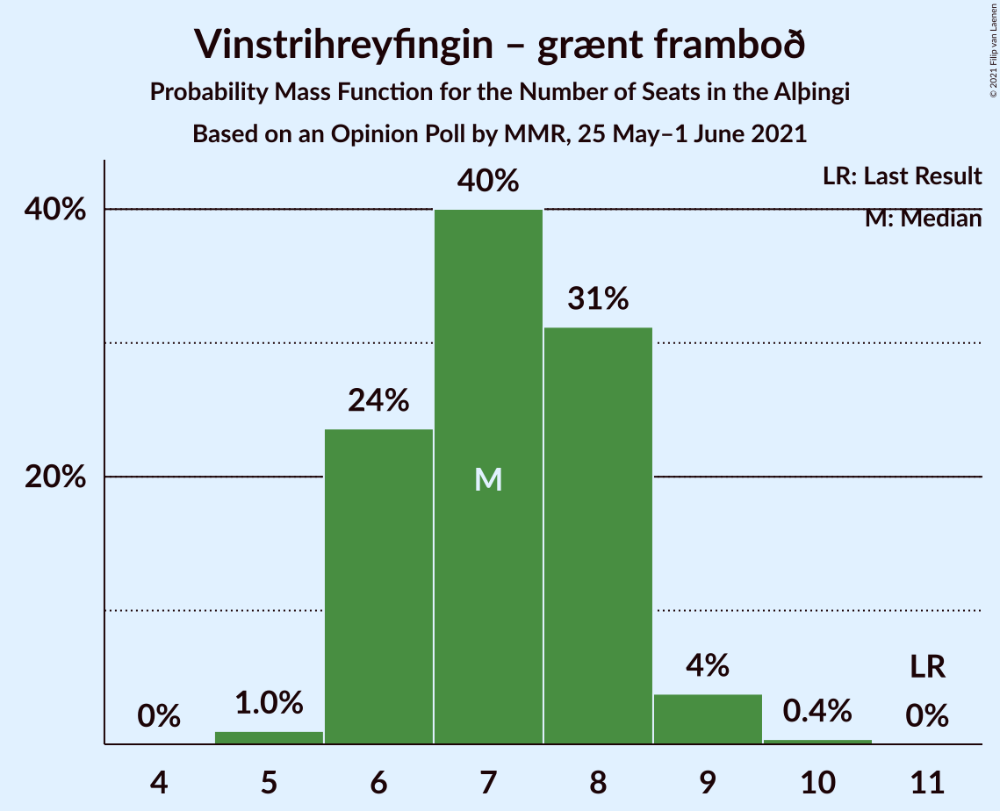
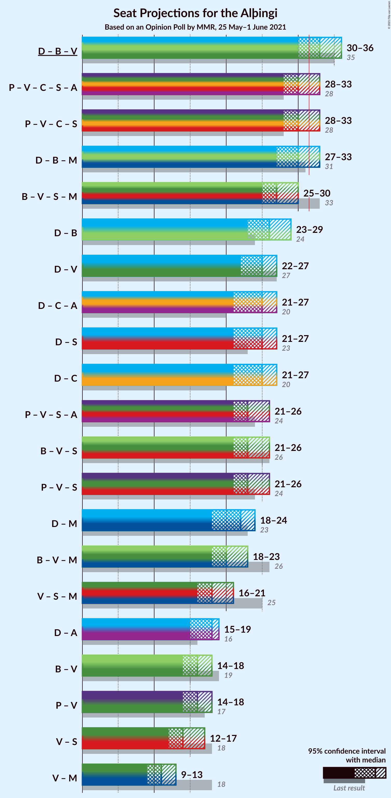
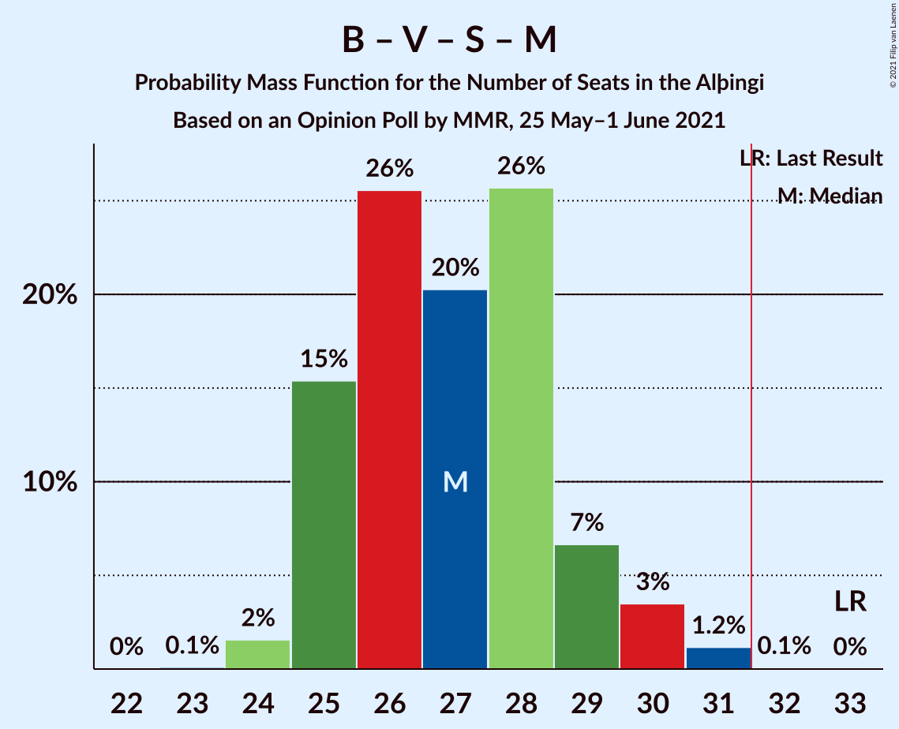
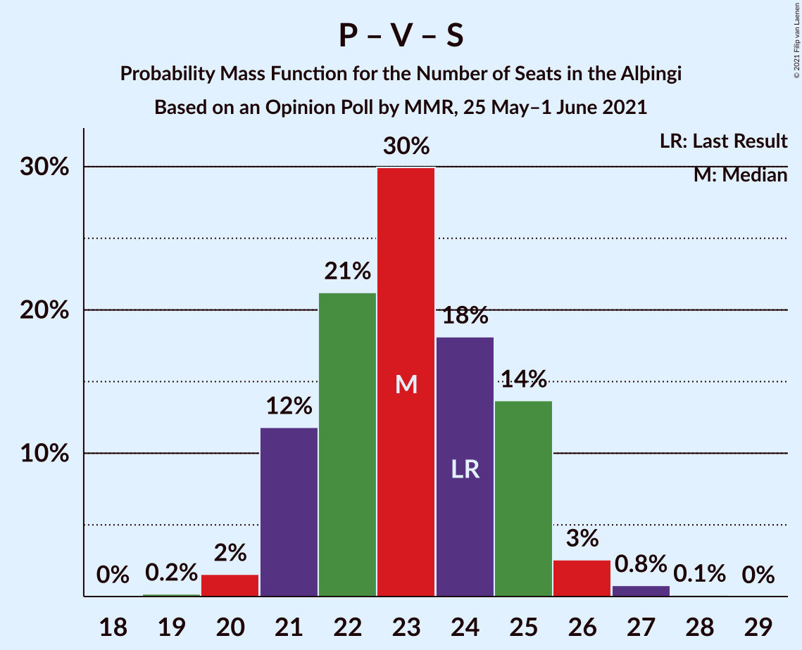
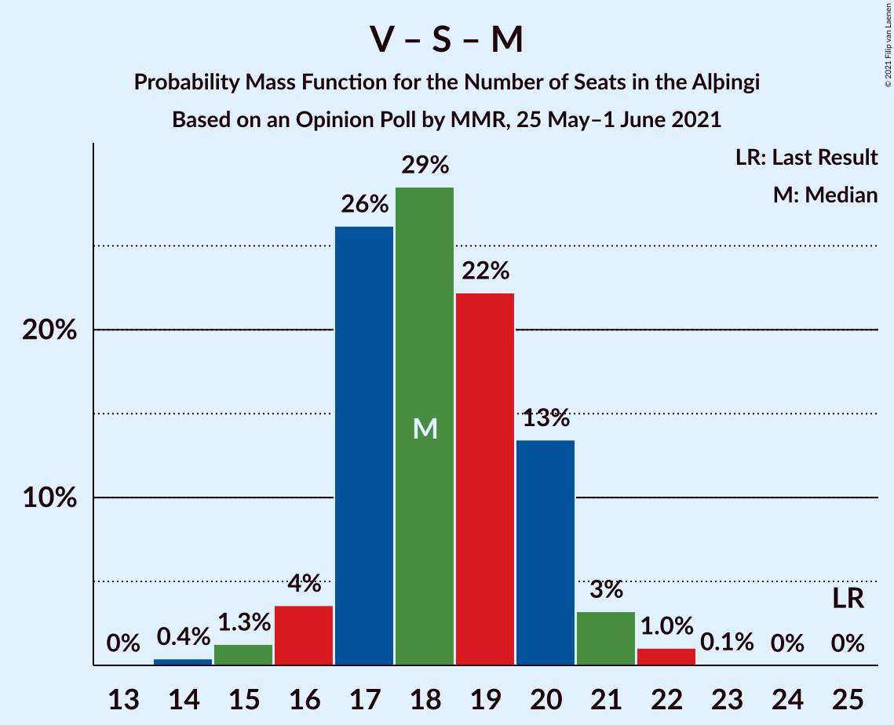

# Opinion Poll by MMR, 25 May–1 June 2021

<a href="#voting-intentions">Voting Intentions</a> | <a href="#seats">Seats</a> | <a href="#coalitions">Coalitions</a> | <a href="#technical-information">Technical Information</a>

## Voting Intentions

### Confidence Intervals

| Party | Last Result | Poll Result | 80% Confidence Interval | 90% Confidence Interval | 95% Confidence Interval | 99% Confidence Interval |
|:-----:|:-----------:|:-----------:|:-----------------------:|:-----------------------:|:-----------------------:|:-----------------------:|
| Sjálfstæðisflokkurinn | 25.2% | 24.6% | 22.9–26.5% |22.4–27.0% |22.0–27.4% |21.2–28.3% |
| Píratar | 9.2% | 13.5% | 12.1–15.0% |11.8–15.4% |11.4–15.8% |10.8–16.5% |
| Framsóknarflokkurinn | 10.7% | 12.5% | 11.2–14.0% |10.9–14.4% |10.6–14.8% |10.0–15.5% |
| Vinstrihreyfingin – grænt framboð | 16.9% | 11.0% | 9.8–12.5% |9.5–12.8% |9.2–13.2% |8.7–13.9% |
| Viðreisn | 6.7% | 11.0% | 9.8–12.5% |9.5–12.8% |9.2–13.2% |8.7–13.9% |
| Samfylkingin | 12.1% | 10.9% | 9.7–12.3% |9.4–12.7% |9.1–13.1% |8.6–13.8% |
| Miðflokkurinn | 10.9% | 6.5% | 5.6–7.7% |5.3–8.0% |5.1–8.3% |4.7–8.9% |
| Sósíalistaflokkur Íslands | 0.0% | 5.6% | 4.7–6.6% |4.5–7.0% |4.3–7.2% |3.9–7.8% |
| Flokkur fólksins | 6.9% | 2.8% | 2.3–3.7% |2.1–3.9% |2.0–4.1% |1.7–4.5% |

*Note:* The poll result column reflects the actual value used in the calculations. Published results may vary slightly, and in addition be rounded to fewer digits.

## Seats

### Confidence Intervals

| Party | Last Result | Median | 80% Confidence Interval | 90% Confidence Interval | 95% Confidence Interval | 99% Confidence Interval |
|:-----:|:-----------:|:------:|:-----------------------:|:-----------------------:|:-----------------------:|:-----------------------:|
| <a href="#sjálfstæðisflokkurinn">Sjálfstæðisflokkurinn</a> | 16 | 17 | 15–19 |15–19 |15–20 |14–20 |
| <a href="#píratar">Píratar</a> | 6 | 9 | 8–10 |8–10 |7–10 |7–11 |
| <a href="#framsóknarflokkurinn">Framsóknarflokkurinn</a> | 8 | 8 | 8–10 |7–11 |7–11 |7–12 |
| <a href="#vinstrihreyfingin-–-grænt-framboð">Vinstrihreyfingin – grænt framboð</a> | 11 | 7 | 6–8 |6–9 |6–9 |5–10 |
| <a href="#viðreisn">Viðreisn</a> | 4 | 7 | 6–8 |6–9 |6–9 |5–9 |
| <a href="#samfylkingin">Samfylkingin</a> | 7 | 7 | 6–8 |6–8 |5–9 |5–9 |
| <a href="#miðflokkurinn">Miðflokkurinn</a> | 7 | 4 | 3–5 |3–5 |1–5 |1–5 |
| <a href="#sósíalistaflokkur-íslands">Sósíalistaflokkur Íslands</a> | 0 | 3 | 0–4 |0–5 |0–5 |0–5 |
| <a href="#flokkur-fólksins">Flokkur fólksins</a> | 4 | 0 | 0 |0 |0 |0 |

### Sjálfstæðisflokkurinn

*For a full overview of the results for this party, see the [Sjálfstæðisflokkurinn](party-sjálfstæðisflokkurinn.html) page.*

| Number of Seats | Probability | Accumulated | Special Marks |
|:---------------:|:-----------:|:-----------:|:-------------:|
| 13 | 0.1% | 100% |  |
| 14 | 2% | 99.9% |  |
| 15 | 14% | 98% |  |
| 16 | 22% | 84% | Last Result |
| 17 | 12% | 62% | Median |
| 18 | 19% | 50% |  |
| 19 | 28% | 31% |  |
| 20 | 3% | 3% |  |
| 21 | 0% | 0% |  |

### Píratar

*For a full overview of the results for this party, see the [Píratar](party-píratar.html) page.*

| Number of Seats | Probability | Accumulated | Special Marks |
|:---------------:|:-----------:|:-----------:|:-------------:|
| 6 | 0.4% | 100% | Last Result |
| 7 | 4% | 99.6% |  |
| 8 | 32% | 96% |  |
| 9 | 46% | 64% | Median |
| 10 | 17% | 18% |  |
| 11 | 1.3% | 1.4% |  |
| 12 | 0.1% | 0.1% |  |
| 13 | 0% | 0% |  |

### Framsóknarflokkurinn

*For a full overview of the results for this party, see the [Framsóknarflokkurinn](party-framsóknarflokkurinn.html) page.*

| Number of Seats | Probability | Accumulated | Special Marks |
|:---------------:|:-----------:|:-----------:|:-------------:|
| 6 | 0.4% | 100% |  |
| 7 | 5% | 99.6% |  |
| 8 | 56% | 95% | Last Result, Median |
| 9 | 13% | 39% |  |
| 10 | 18% | 26% |  |
| 11 | 6% | 8% |  |
| 12 | 2% | 2% |  |
| 13 | 0% | 0% |  |

### Vinstrihreyfingin – grænt framboð

*For a full overview of the results for this party, see the [Vinstrihreyfingin – grænt framboð](party-vinstrihreyfingin–græntframboð.html) page.*

| Number of Seats | Probability | Accumulated | Special Marks |
|:---------------:|:-----------:|:-----------:|:-------------:|
| 5 | 2% | 100% |  |
| 6 | 34% | 98% |  |
| 7 | 37% | 64% | Median |
| 8 | 22% | 27% |  |
| 9 | 4% | 5% |  |
| 10 | 0.7% | 0.7% |  |
| 11 | 0% | 0% | Last Result |

### Viðreisn

*For a full overview of the results for this party, see the [Viðreisn](party-viðreisn.html) page.*

| Number of Seats | Probability | Accumulated | Special Marks |
|:---------------:|:-----------:|:-----------:|:-------------:|
| 4 | 0% | 100% | Last Result |
| 5 | 1.0% | 100% |  |
| 6 | 21% | 99.0% |  |
| 7 | 48% | 78% | Median |
| 8 | 24% | 31% |  |
| 9 | 7% | 7% |  |
| 10 | 0.2% | 0.2% |  |
| 11 | 0% | 0% |  |

### Samfylkingin

*For a full overview of the results for this party, see the [Samfylkingin](party-samfylkingin.html) page.*

| Number of Seats | Probability | Accumulated | Special Marks |
|:---------------:|:-----------:|:-----------:|:-------------:|
| 5 | 3% | 100% |  |
| 6 | 22% | 97% |  |
| 7 | 40% | 74% | Last Result, Median |
| 8 | 30% | 34% |  |
| 9 | 4% | 4% |  |
| 10 | 0.2% | 0.2% |  |
| 11 | 0% | 0% |  |

### Miðflokkurinn

*For a full overview of the results for this party, see the [Miðflokkurinn](party-miðflokkurinn.html) page.*

| Number of Seats | Probability | Accumulated | Special Marks |
|:---------------:|:-----------:|:-----------:|:-------------:|
| 1 | 3% | 100% |  |
| 2 | 0% | 97% |  |
| 3 | 9% | 97% |  |
| 4 | 60% | 87% | Median |
| 5 | 27% | 28% |  |
| 6 | 0.4% | 0.4% |  |
| 7 | 0% | 0% | Last Result |

### Sósíalistaflokkur Íslands

*For a full overview of the results for this party, see the [Sósíalistaflokkur Íslands](party-sósíalistaflokkuríslands.html) page.*

| Number of Seats | Probability | Accumulated | Special Marks |
|:---------------:|:-----------:|:-----------:|:-------------:|
| 0 | 17% | 100% | Last Result |
| 1 | 0% | 83% |  |
| 2 | 0% | 83% |  |
| 3 | 44% | 83% | Median |
| 4 | 29% | 38% |  |
| 5 | 9% | 9% |  |
| 6 | 0% | 0% |  |

### Flokkur fólksins

*For a full overview of the results for this party, see the [Flokkur fólksins](party-flokkurfólksins.html) page.*

| Number of Seats | Probability | Accumulated | Special Marks |
|:---------------:|:-----------:|:-----------:|:-------------:|
| 0 | 99.9% | 100% | Median |
| 1 | 0% | 0.1% |  |
| 2 | 0% | 0.1% |  |
| 3 | 0.1% | 0.1% |  |
| 4 | 0% | 0% | Last Result |

## Coalitions

### Confidence Intervals

| Coalition | Last Result | Median | Majority? | 80% Confidence Interval | 90% Confidence Interval | 95% Confidence Interval | 99% Confidence Interval |
|:---------:|:-----------:|:------:|:---------:|:-----------------------:|:-----------------------:|:-----------------------:|:-----------------------:|
| Sjálfstæðisflokkurinn – Framsóknarflokkurinn – Vinstrihreyfingin – grænt framboð | 35 | 33 | 77% | 31–35 | 30–36 | 30–36 | 30–38 |
| Píratar – Vinstrihreyfingin – grænt framboð – Viðreisn – Samfylkingin | 28 | 30 | 18% | 28–32 | 28–33 | 27–34 | 25–35 |
| Sjálfstæðisflokkurinn – Framsóknarflokkurinn – Miðflokkurinn | 31 | 30 | 14% | 28–32 | 28–33 | 27–33 | 27–35 |
| Framsóknarflokkurinn – Vinstrihreyfingin – grænt framboð – Samfylkingin – Miðflokkurinn | 33 | 27 | 0.2% | 25–29 | 25–29 | 24–30 | 24–31 |
| Sjálfstæðisflokkurinn – Framsóknarflokkurinn | 24 | 26 | 0% | 24–28 | 24–29 | 23–29 | 23–30 |
| Sjálfstæðisflokkurinn – Viðreisn | 20 | 25 | 0% | 22–26 | 21–27 | 21–28 | 20–28 |
| Sjálfstæðisflokkurinn – Samfylkingin | 23 | 24 | 0% | 22–26 | 21–27 | 21–27 | 20–27 |
| Sjálfstæðisflokkurinn – Vinstrihreyfingin – grænt framboð | 27 | 25 | 0% | 22–26 | 21–27 | 21–27 | 20–27 |
| Framsóknarflokkurinn – Vinstrihreyfingin – grænt framboð – Samfylkingin | 26 | 23 | 0% | 21–25 | 21–25 | 21–26 | 20–27 |
| Píratar – Vinstrihreyfingin – grænt framboð – Samfylkingin | 24 | 22 | 0% | 21–25 | 21–25 | 20–26 | 19–27 |
| Sjálfstæðisflokkurinn – Miðflokkurinn | 23 | 22 | 0% | 19–23 | 19–23 | 18–24 | 18–24 |
| Framsóknarflokkurinn – Vinstrihreyfingin – grænt framboð – Miðflokkurinn | 26 | 20 | 0% | 18–22 | 18–23 | 18–23 | 18–24 |
| Vinstrihreyfingin – grænt framboð – Samfylkingin – Miðflokkurinn | 25 | 18 | 0% | 17–20 | 16–20 | 16–21 | 14–22 |
| Framsóknarflokkurinn – Vinstrihreyfingin – grænt framboð | 19 | 15 | 0% | 14–18 | 14–18 | 14–19 | 13–19 |
| Píratar – Vinstrihreyfingin – grænt framboð | 17 | 15 | 0% | 14–17 | 14–18 | 14–18 | 13–19 |
| Vinstrihreyfingin – grænt framboð – Samfylkingin | 18 | 14 | 0% | 13–16 | 12–16 | 12–17 | 12–18 |
| Vinstrihreyfingin – grænt framboð – Miðflokkurinn | 18 | 11 | 0% | 10–13 | 10–13 | 9–13 | 8–14 |

### Sjálfstæðisflokkurinn – Framsóknarflokkurinn – Vinstrihreyfingin – grænt framboð

| Number of Seats | Probability | Accumulated | Special Marks |
|:---------------:|:-----------:|:-----------:|:-------------:|
| 29 | 0.2% | 100% |  |
| 30 | 6% | 99.8% |  |
| 31 | 16% | 93% |  |
| 32 | 14% | 77% | Median, Majority |
| 33 | 33% | 63% |  |
| 34 | 12% | 30% |  |
| 35 | 9% | 18% | Last Result |
| 36 | 7% | 9% |  |
| 37 | 1.2% | 2% |  |
| 38 | 0.5% | 0.5% |  |
| 39 | 0% | 0% |  |

### Píratar – Vinstrihreyfingin – grænt framboð – Viðreisn – Samfylkingin

| Number of Seats | Probability | Accumulated | Special Marks |
|:---------------:|:-----------:|:-----------:|:-------------:|
| 25 | 0.6% | 100% |  |
| 26 | 0.8% | 99.4% |  |
| 27 | 3% | 98.6% |  |
| 28 | 10% | 96% | Last Result |
| 29 | 30% | 86% |  |
| 30 | 21% | 55% | Median |
| 31 | 17% | 35% |  |
| 32 | 10% | 18% | Majority |
| 33 | 5% | 8% |  |
| 34 | 2% | 3% |  |
| 35 | 0.7% | 0.8% |  |
| 36 | 0.1% | 0.1% |  |
| 37 | 0% | 0% |  |

### Sjálfstæðisflokkurinn – Framsóknarflokkurinn – Miðflokkurinn

| Number of Seats | Probability | Accumulated | Special Marks |
|:---------------:|:-----------:|:-----------:|:-------------:|
| 25 | 0.1% | 100% |  |
| 26 | 0.2% | 99.9% |  |
| 27 | 3% | 99.7% |  |
| 28 | 17% | 96% |  |
| 29 | 16% | 80% | Median |
| 30 | 19% | 63% |  |
| 31 | 31% | 45% | Last Result |
| 32 | 8% | 14% | Majority |
| 33 | 5% | 6% |  |
| 34 | 0.6% | 1.2% |  |
| 35 | 0.5% | 0.5% |  |
| 36 | 0% | 0% |  |

### Framsóknarflokkurinn – Vinstrihreyfingin – grænt framboð – Samfylkingin – Miðflokkurinn

| Number of Seats | Probability | Accumulated | Special Marks |
|:---------------:|:-----------:|:-----------:|:-------------:|
| 22 | 0.1% | 100% |  |
| 23 | 0.1% | 99.9% |  |
| 24 | 3% | 99.9% |  |
| 25 | 24% | 97% |  |
| 26 | 18% | 74% | Median |
| 27 | 18% | 56% |  |
| 28 | 25% | 38% |  |
| 29 | 9% | 13% |  |
| 30 | 3% | 4% |  |
| 31 | 1.0% | 1.1% |  |
| 32 | 0.1% | 0.2% | Majority |
| 33 | 0% | 0% | Last Result |

### Sjálfstæðisflokkurinn – Framsóknarflokkurinn

| Number of Seats | Probability | Accumulated | Special Marks |
|:---------------:|:-----------:|:-----------:|:-------------:|
| 22 | 0.2% | 100% |  |
| 23 | 5% | 99.8% |  |
| 24 | 20% | 95% | Last Result |
| 25 | 15% | 75% | Median |
| 26 | 17% | 60% |  |
| 27 | 26% | 43% |  |
| 28 | 9% | 16% |  |
| 29 | 6% | 7% |  |
| 30 | 0.4% | 0.8% |  |
| 31 | 0.4% | 0.4% |  |
| 32 | 0% | 0% | Majority |

### Sjálfstæðisflokkurinn – Viðreisn

| Number of Seats | Probability | Accumulated | Special Marks |
|:---------------:|:-----------:|:-----------:|:-------------:|
| 20 | 0.6% | 100% | Last Result |
| 21 | 7% | 99.4% |  |
| 22 | 6% | 93% |  |
| 23 | 17% | 86% |  |
| 24 | 19% | 69% | Median |
| 25 | 17% | 51% |  |
| 26 | 26% | 34% |  |
| 27 | 5% | 8% |  |
| 28 | 3% | 3% |  |
| 29 | 0.1% | 0.1% |  |
| 30 | 0% | 0% |  |

### Sjálfstæðisflokkurinn – Samfylkingin

| Number of Seats | Probability | Accumulated | Special Marks |
|:---------------:|:-----------:|:-----------:|:-------------:|
| 20 | 1.1% | 100% |  |
| 21 | 5% | 98.9% |  |
| 22 | 13% | 94% |  |
| 23 | 10% | 81% | Last Result |
| 24 | 23% | 71% | Median |
| 25 | 10% | 48% |  |
| 26 | 32% | 38% |  |
| 27 | 6% | 6% |  |
| 28 | 0.4% | 0.4% |  |
| 29 | 0% | 0% |  |

### Sjálfstæðisflokkurinn – Vinstrihreyfingin – grænt framboð

| Number of Seats | Probability | Accumulated | Special Marks |
|:---------------:|:-----------:|:-----------:|:-------------:|
| 20 | 0.6% | 100% |  |
| 21 | 5% | 99.4% |  |
| 22 | 8% | 94% |  |
| 23 | 21% | 87% |  |
| 24 | 13% | 66% | Median |
| 25 | 36% | 53% |  |
| 26 | 10% | 17% |  |
| 27 | 6% | 7% | Last Result |
| 28 | 0.3% | 0.4% |  |
| 29 | 0% | 0% |  |

### Framsóknarflokkurinn – Vinstrihreyfingin – grænt framboð – Samfylkingin

| Number of Seats | Probability | Accumulated | Special Marks |
|:---------------:|:-----------:|:-----------:|:-------------:|
| 19 | 0% | 100% |  |
| 20 | 1.5% | 99.9% |  |
| 21 | 25% | 98% |  |
| 22 | 19% | 74% | Median |
| 23 | 25% | 55% |  |
| 24 | 18% | 30% |  |
| 25 | 8% | 12% |  |
| 26 | 1.2% | 3% | Last Result |
| 27 | 2% | 2% |  |
| 28 | 0.1% | 0.1% |  |
| 29 | 0% | 0% |  |

### Píratar – Vinstrihreyfingin – grænt framboð – Samfylkingin

| Number of Seats | Probability | Accumulated | Special Marks |
|:---------------:|:-----------:|:-----------:|:-------------:|
| 19 | 0.7% | 100% |  |
| 20 | 2% | 99.3% |  |
| 21 | 7% | 97% |  |
| 22 | 40% | 90% |  |
| 23 | 25% | 50% | Median |
| 24 | 7% | 25% | Last Result |
| 25 | 14% | 18% |  |
| 26 | 1.1% | 3% |  |
| 27 | 2% | 2% |  |
| 28 | 0.3% | 0.3% |  |
| 29 | 0% | 0% |  |

### Sjálfstæðisflokkurinn – Miðflokkurinn

| Number of Seats | Probability | Accumulated | Special Marks |
|:---------------:|:-----------:|:-----------:|:-------------:|
| 16 | 0.1% | 100% |  |
| 17 | 0.2% | 99.9% |  |
| 18 | 3% | 99.8% |  |
| 19 | 11% | 97% |  |
| 20 | 21% | 87% |  |
| 21 | 14% | 65% | Median |
| 22 | 19% | 51% |  |
| 23 | 29% | 32% | Last Result |
| 24 | 3% | 4% |  |
| 25 | 0.3% | 0.3% |  |
| 26 | 0% | 0% |  |

### Framsóknarflokkurinn – Vinstrihreyfingin – grænt framboð – Miðflokkurinn

| Number of Seats | Probability | Accumulated | Special Marks |
|:---------------:|:-----------:|:-----------:|:-------------:|
| 15 | 0.1% | 100% |  |
| 16 | 0.1% | 99.9% |  |
| 17 | 0.3% | 99.9% |  |
| 18 | 33% | 99.6% |  |
| 19 | 13% | 67% | Median |
| 20 | 25% | 54% |  |
| 21 | 13% | 29% |  |
| 22 | 8% | 16% |  |
| 23 | 6% | 7% |  |
| 24 | 1.4% | 1.5% |  |
| 25 | 0% | 0.1% |  |
| 26 | 0% | 0% | Last Result |

### Vinstrihreyfingin – grænt framboð – Samfylkingin – Miðflokkurinn

| Number of Seats | Probability | Accumulated | Special Marks |
|:---------------:|:-----------:|:-----------:|:-------------:|
| 14 | 0.6% | 100% |  |
| 15 | 0.8% | 99.4% |  |
| 16 | 7% | 98.6% |  |
| 17 | 29% | 91% |  |
| 18 | 23% | 62% | Median |
| 19 | 20% | 39% |  |
| 20 | 15% | 19% |  |
| 21 | 4% | 4% |  |
| 22 | 0.4% | 0.5% |  |
| 23 | 0.2% | 0.2% |  |
| 24 | 0% | 0% |  |
| 25 | 0% | 0% | Last Result |

### Framsóknarflokkurinn – Vinstrihreyfingin – grænt framboð

| Number of Seats | Probability | Accumulated | Special Marks |
|:---------------:|:-----------:|:-----------:|:-------------:|
| 12 | 0.1% | 100% |  |
| 13 | 0.7% | 99.9% |  |
| 14 | 30% | 99.2% |  |
| 15 | 21% | 69% | Median |
| 16 | 20% | 48% |  |
| 17 | 13% | 28% |  |
| 18 | 12% | 16% |  |
| 19 | 4% | 4% | Last Result |
| 20 | 0.2% | 0.2% |  |
| 21 | 0% | 0% |  |

### Píratar – Vinstrihreyfingin – grænt framboð

| Number of Seats | Probability | Accumulated | Special Marks |
|:---------------:|:-----------:|:-----------:|:-------------:|
| 13 | 1.3% | 100% |  |
| 14 | 10% | 98.7% |  |
| 15 | 40% | 89% |  |
| 16 | 21% | 49% | Median |
| 17 | 20% | 28% | Last Result |
| 18 | 6% | 8% |  |
| 19 | 2% | 2% |  |
| 20 | 0.2% | 0.2% |  |
| 21 | 0% | 0% |  |

### Vinstrihreyfingin – grænt framboð – Samfylkingin

| Number of Seats | Probability | Accumulated | Special Marks |
|:---------------:|:-----------:|:-----------:|:-------------:|
| 10 | 0.1% | 100% |  |
| 11 | 0.4% | 99.9% |  |
| 12 | 5% | 99.5% |  |
| 13 | 33% | 94% |  |
| 14 | 25% | 61% | Median |
| 15 | 25% | 36% |  |
| 16 | 9% | 11% |  |
| 17 | 2% | 3% |  |
| 18 | 0.9% | 0.9% | Last Result |
| 19 | 0% | 0% |  |

### Vinstrihreyfingin – grænt framboð – Miðflokkurinn

| Number of Seats | Probability | Accumulated | Special Marks |
|:---------------:|:-----------:|:-----------:|:-------------:|
| 8 | 2% | 100% |  |
| 9 | 2% | 98% |  |
| 10 | 34% | 96% |  |
| 11 | 29% | 62% | Median |
| 12 | 20% | 33% |  |
| 13 | 11% | 13% |  |
| 14 | 2% | 2% |  |
| 15 | 0.1% | 0.1% |  |
| 16 | 0% | 0% |  |
| 17 | 0% | 0% |  |
| 18 | 0% | 0% | Last Result |

## Technical Information

### Opinion Poll

+ **Polling firm:** MMR
+ **Commissioner(s):** —
+ **Fieldwork period:** 25 May–1 June 2021

### Calculations

+ **Sample size:** 951
+ **Simulations done:** 131,072
+ **Error estimate:** 2.77%

