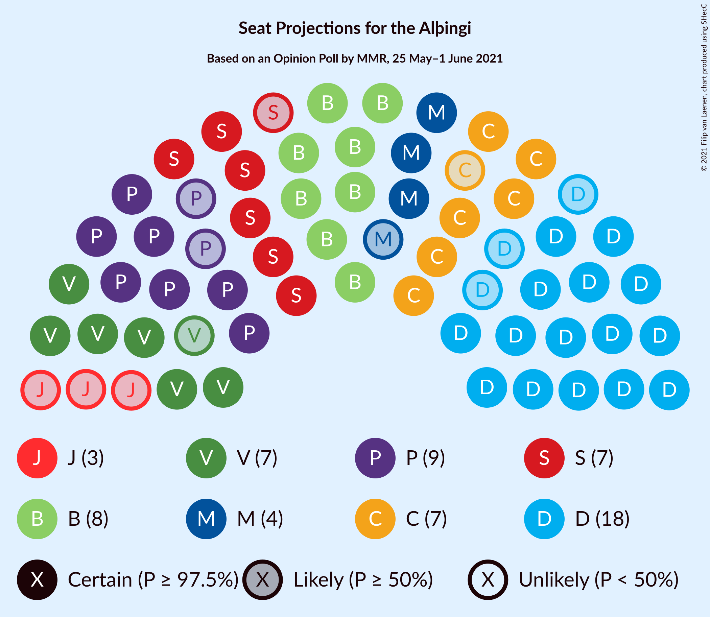
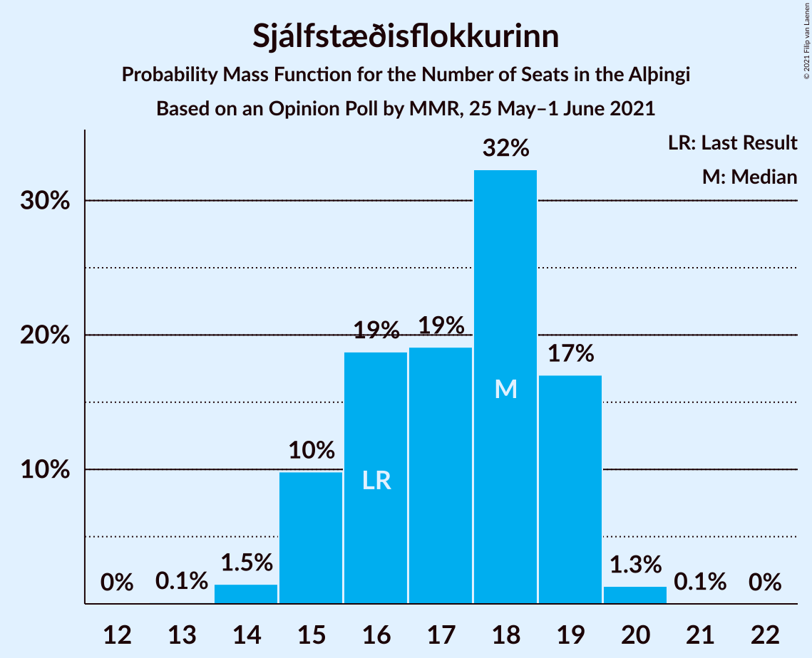
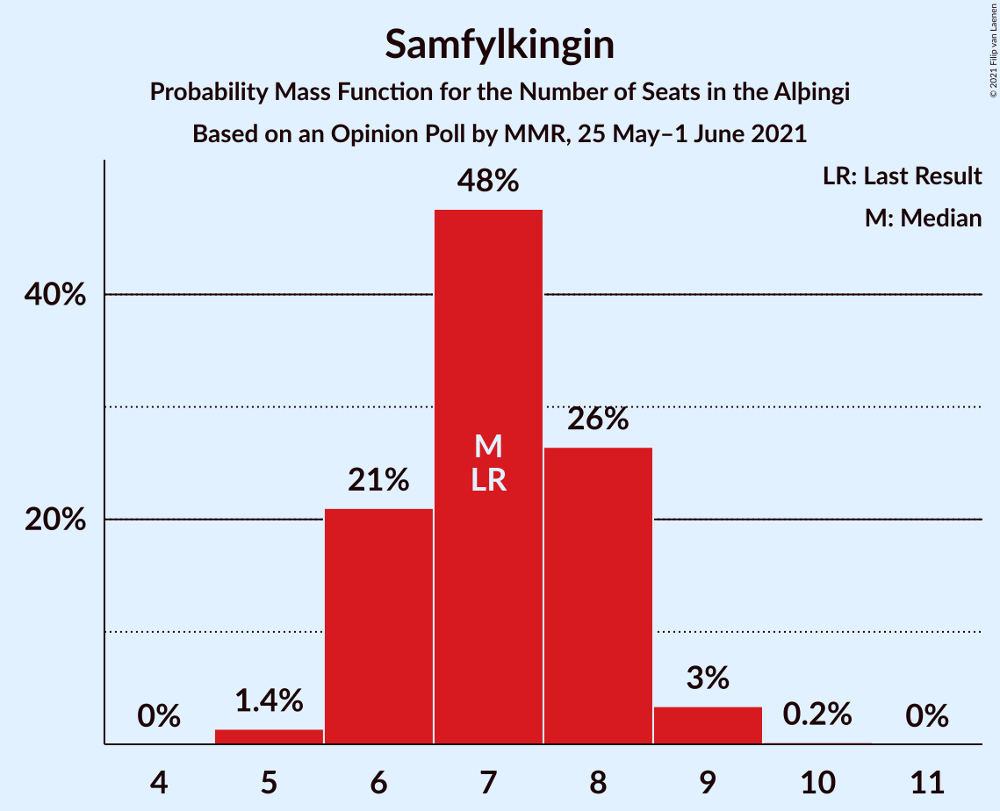
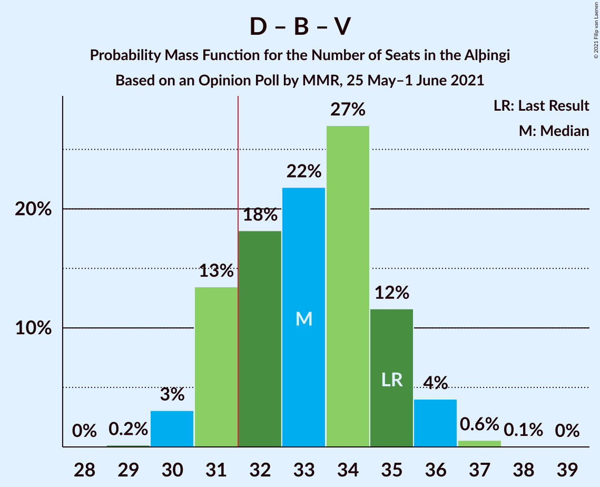
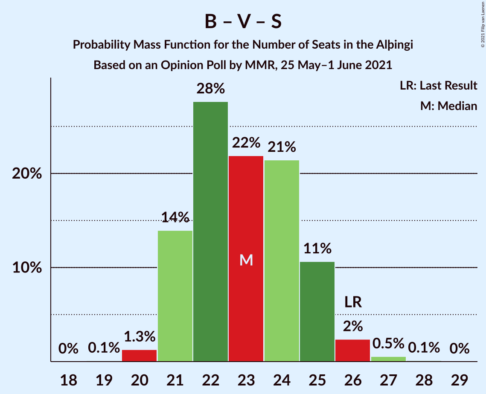
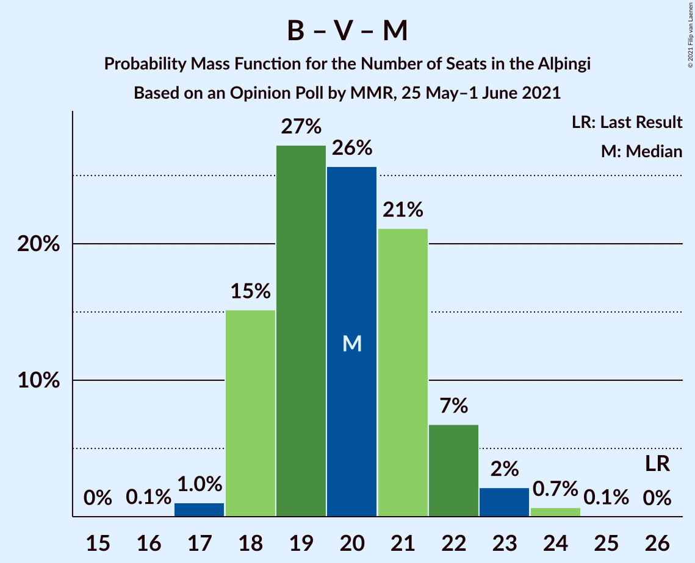

# Opinion Poll by MMR, 25 May–1 June 2021

<a href="#voting-intentions">Voting Intentions</a> | <a href="#seats">Seats</a> | <a href="#coalitions">Coalitions</a> | <a href="#technical-information">Technical Information</a>

## Voting Intentions

### Confidence Intervals

| Party | Last Result | Poll Result | 80% Confidence Interval | 90% Confidence Interval | 95% Confidence Interval | 99% Confidence Interval |
|:-----:|:-----------:|:-----------:|:-----------------------:|:-----------------------:|:-----------------------:|:-----------------------:|
| Sjálfstæðisflokkurinn | 25.2% | 24.6% | 22.9–26.5% |22.4–27.0% |22.0–27.4% |21.2–28.3% |
| Píratar | 9.2% | 13.5% | 12.1–15.0% |11.8–15.4% |11.4–15.8% |10.8–16.5% |
| Framsóknarflokkurinn | 10.7% | 12.5% | 11.2–14.0% |10.9–14.4% |10.6–14.8% |10.0–15.5% |
| Vinstrihreyfingin – grænt framboð | 16.9% | 11.0% | 9.8–12.5% |9.5–12.8% |9.2–13.2% |8.7–13.9% |
| Viðreisn | 6.7% | 11.0% | 9.8–12.5% |9.5–12.8% |9.2–13.2% |8.7–13.9% |
| Samfylkingin | 12.1% | 10.9% | 9.7–12.3% |9.4–12.7% |9.1–13.1% |8.6–13.8% |
| Miðflokkurinn | 10.9% | 6.5% | 5.6–7.7% |5.3–8.0% |5.1–8.3% |4.7–8.9% |
| Sósíalistaflokkur Íslands | 0.0% | 5.6% | 4.7–6.6% |4.5–7.0% |4.3–7.2% |3.9–7.8% |
| Flokkur fólksins | 6.9% | 2.8% | 2.3–3.7% |2.1–3.9% |2.0–4.1% |1.7–4.5% |

*Note:* The poll result column reflects the actual value used in the calculations. Published results may vary slightly, and in addition be rounded to fewer digits.

## Seats

### Confidence Intervals

| Party | Last Result | Median | 80% Confidence Interval | 90% Confidence Interval | 95% Confidence Interval | 99% Confidence Interval |
|:-----:|:-----------:|:------:|:-----------------------:|:-----------------------:|:-----------------------:|:-----------------------:|
| <a href="#sjálfstæðisflokkurinn">Sjálfstæðisflokkurinn</a> | 16 | 18 | 15–19 |15–19 |15–19 |14–20 |
| <a href="#píratar">Píratar</a> | 6 | 9 | 8–10 |8–10 |7–10 |7–11 |
| <a href="#framsóknarflokkurinn">Framsóknarflokkurinn</a> | 8 | 8 | 8–10 |8–11 |8–11 |7–12 |
| <a href="#vinstrihreyfingin-–-grænt-framboð">Vinstrihreyfingin – grænt framboð</a> | 11 | 7 | 6–8 |6–8 |6–9 |5–9 |
| <a href="#viðreisn">Viðreisn</a> | 4 | 7 | 6–8 |6–9 |6–9 |5–9 |
| <a href="#samfylkingin">Samfylkingin</a> | 7 | 7 | 6–8 |6–8 |6–9 |5–9 |
| <a href="#miðflokkurinn">Miðflokkurinn</a> | 7 | 4 | 3–5 |3–5 |3–5 |1–6 |
| <a href="#sósíalistaflokkur-íslands">Sósíalistaflokkur Íslands</a> | 0 | 3 | 0–4 |0–4 |0–5 |0–5 |
| <a href="#flokkur-fólksins">Flokkur fólksins</a> | 4 | 0 | 0 |0 |0 |0 |

### Sjálfstæðisflokkurinn

*For a full overview of the results for this party, see the [Sjálfstæðisflokkurinn](party-sjálfstæðisflokkurinn.html) page.*

| Number of Seats | Probability | Accumulated | Special Marks |
|:---------------:|:-----------:|:-----------:|:-------------:|
| 13 | 0.1% | 100% |  |
| 14 | 1.5% | 99.9% |  |
| 15 | 10% | 98% |  |
| 16 | 19% | 89% | Last Result |
| 17 | 19% | 70% |  |
| 18 | 32% | 51% | Median |
| 19 | 17% | 18% |  |
| 20 | 1.3% | 1.4% |  |
| 21 | 0.1% | 0.1% |  |
| 22 | 0% | 0% |  |

### Píratar

*For a full overview of the results for this party, see the [Píratar](party-píratar.html) page.*

| Number of Seats | Probability | Accumulated | Special Marks |
|:---------------:|:-----------:|:-----------:|:-------------:|
| 6 | 0.1% | 100% | Last Result |
| 7 | 3% | 99.8% |  |
| 8 | 33% | 97% |  |
| 9 | 44% | 64% | Median |
| 10 | 18% | 20% |  |
| 11 | 2% | 2% |  |
| 12 | 0.1% | 0.1% |  |
| 13 | 0% | 0% |  |

### Framsóknarflokkurinn

*For a full overview of the results for this party, see the [Framsóknarflokkurinn](party-framsóknarflokkurinn.html) page.*

| Number of Seats | Probability | Accumulated | Special Marks |
|:---------------:|:-----------:|:-----------:|:-------------:|
| 6 | 0.3% | 100% |  |
| 7 | 2% | 99.7% |  |
| 8 | 55% | 98% | Last Result, Median |
| 9 | 24% | 43% |  |
| 10 | 12% | 19% |  |
| 11 | 6% | 7% |  |
| 12 | 1.3% | 1.3% |  |
| 13 | 0% | 0% |  |

### Vinstrihreyfingin – grænt framboð

*For a full overview of the results for this party, see the [Vinstrihreyfingin – grænt framboð](party-vinstrihreyfingin–græntframboð.html) page.*

| Number of Seats | Probability | Accumulated | Special Marks |
|:---------------:|:-----------:|:-----------:|:-------------:|
| 5 | 1.0% | 100% |  |
| 6 | 24% | 99.0% |  |
| 7 | 40% | 75% | Median |
| 8 | 31% | 35% |  |
| 9 | 4% | 4% |  |
| 10 | 0.4% | 0.4% |  |
| 11 | 0% | 0% | Last Result |

### Viðreisn

*For a full overview of the results for this party, see the [Viðreisn](party-viðreisn.html) page.*

| Number of Seats | Probability | Accumulated | Special Marks |
|:---------------:|:-----------:|:-----------:|:-------------:|
| 4 | 0% | 100% | Last Result |
| 5 | 0.7% | 100% |  |
| 6 | 19% | 99.3% |  |
| 7 | 45% | 80% | Median |
| 8 | 30% | 35% |  |
| 9 | 5% | 5% |  |
| 10 | 0.2% | 0.2% |  |
| 11 | 0% | 0% |  |

### Samfylkingin

*For a full overview of the results for this party, see the [Samfylkingin](party-samfylkingin.html) page.*

| Number of Seats | Probability | Accumulated | Special Marks |
|:---------------:|:-----------:|:-----------:|:-------------:|
| 5 | 1.4% | 100% |  |
| 6 | 21% | 98.6% |  |
| 7 | 48% | 78% | Last Result, Median |
| 8 | 26% | 30% |  |
| 9 | 3% | 4% |  |
| 10 | 0.2% | 0.2% |  |
| 11 | 0% | 0% |  |

### Miðflokkurinn

*For a full overview of the results for this party, see the [Miðflokkurinn](party-miðflokkurinn.html) page.*

| Number of Seats | Probability | Accumulated | Special Marks |
|:---------------:|:-----------:|:-----------:|:-------------:|
| 1 | 1.5% | 100% |  |
| 2 | 0.3% | 98% |  |
| 3 | 14% | 98% |  |
| 4 | 66% | 84% | Median |
| 5 | 17% | 18% |  |
| 6 | 0.9% | 1.0% |  |
| 7 | 0% | 0% | Last Result |

### Sósíalistaflokkur Íslands

*For a full overview of the results for this party, see the [Sósíalistaflokkur Íslands](party-sósíalistaflokkuríslands.html) page.*

| Number of Seats | Probability | Accumulated | Special Marks |
|:---------------:|:-----------:|:-----------:|:-------------:|
| 0 | 20% | 100% | Last Result |
| 1 | 0% | 80% |  |
| 2 | 0% | 80% |  |
| 3 | 45% | 80% | Median |
| 4 | 33% | 35% |  |
| 5 | 3% | 3% |  |
| 6 | 0% | 0% |  |

### Flokkur fólksins

*For a full overview of the results for this party, see the [Flokkur fólksins](party-flokkurfólksins.html) page.*

| Number of Seats | Probability | Accumulated | Special Marks |
|:---------------:|:-----------:|:-----------:|:-------------:|
| 0 | 99.9% | 100% | Median |
| 1 | 0% | 0.1% |  |
| 2 | 0% | 0.1% |  |
| 3 | 0.1% | 0.1% |  |
| 4 | 0% | 0% | Last Result |

## Coalitions

### Confidence Intervals

| Coalition | Last Result | Median | Majority? | 80% Confidence Interval | 90% Confidence Interval | 95% Confidence Interval | 99% Confidence Interval |
|:---------:|:-----------:|:------:|:---------:|:-----------------------:|:-----------------------:|:-----------------------:|:-----------------------:|
| Sjálfstæðisflokkurinn – Framsóknarflokkurinn – Vinstrihreyfingin – grænt framboð | 35 | 33 | 83% | 31–35 | 31–35 | 30–36 | 30–37 |
| Píratar – Vinstrihreyfingin – grænt framboð – Viðreisn – Samfylkingin | 28 | 30 | 27% | 28–32 | 28–33 | 28–33 | 26–35 |
| Sjálfstæðisflokkurinn – Framsóknarflokkurinn – Miðflokkurinn | 31 | 30 | 12% | 28–32 | 28–32 | 27–33 | 26–34 |
| Framsóknarflokkurinn – Vinstrihreyfingin – grænt framboð – Samfylkingin – Miðflokkurinn | 33 | 27 | 0.1% | 25–29 | 25–29 | 25–30 | 24–31 |
| Sjálfstæðisflokkurinn – Framsóknarflokkurinn | 24 | 26 | 0% | 24–28 | 24–28 | 23–29 | 23–30 |
| Sjálfstæðisflokkurinn – Vinstrihreyfingin – grænt framboð | 27 | 25 | 0% | 22–26 | 22–26 | 22–27 | 21–28 |
| Sjálfstæðisflokkurinn – Samfylkingin | 23 | 25 | 0% | 22–26 | 22–26 | 21–27 | 21–27 |
| Sjálfstæðisflokkurinn – Viðreisn | 20 | 25 | 0% | 23–26 | 22–26 | 21–27 | 21–28 |
| Framsóknarflokkurinn – Vinstrihreyfingin – grænt framboð – Samfylkingin | 26 | 23 | 0% | 21–25 | 21–25 | 21–26 | 20–27 |
| Píratar – Vinstrihreyfingin – grænt framboð – Samfylkingin | 24 | 23 | 0% | 21–25 | 21–25 | 21–26 | 20–27 |
| Sjálfstæðisflokkurinn – Miðflokkurinn | 23 | 22 | 0% | 19–23 | 19–23 | 18–24 | 17–25 |
| Framsóknarflokkurinn – Vinstrihreyfingin – grænt framboð – Miðflokkurinn | 26 | 20 | 0% | 18–21 | 18–22 | 18–23 | 17–24 |
| Vinstrihreyfingin – grænt framboð – Samfylkingin – Miðflokkurinn | 25 | 18 | 0% | 17–20 | 16–20 | 16–21 | 15–22 |
| Framsóknarflokkurinn – Vinstrihreyfingin – grænt framboð | 19 | 16 | 0% | 14–18 | 14–18 | 14–18 | 14–19 |
| Píratar – Vinstrihreyfingin – grænt framboð | 17 | 16 | 0% | 14–17 | 14–18 | 14–18 | 13–19 |
| Vinstrihreyfingin – grænt framboð – Samfylkingin | 18 | 14 | 0% | 13–16 | 13–16 | 12–17 | 11–17 |
| Vinstrihreyfingin – grænt framboð – Miðflokkurinn | 18 | 11 | 0% | 10–12 | 10–13 | 9–13 | 8–14 |

### Sjálfstæðisflokkurinn – Framsóknarflokkurinn – Vinstrihreyfingin – grænt framboð

| Number of Seats | Probability | Accumulated | Special Marks |
|:---------------:|:-----------:|:-----------:|:-------------:|
| 29 | 0.2% | 100% |  |
| 30 | 3% | 99.8% |  |
| 31 | 13% | 97% |  |
| 32 | 18% | 83% | Majority |
| 33 | 22% | 65% | Median |
| 34 | 27% | 43% |  |
| 35 | 12% | 16% | Last Result |
| 36 | 4% | 5% |  |
| 37 | 0.6% | 0.7% |  |
| 38 | 0.1% | 0.1% |  |
| 39 | 0% | 0% |  |

### Píratar – Vinstrihreyfingin – grænt framboð – Viðreisn – Samfylkingin

| Number of Seats | Probability | Accumulated | Special Marks |
|:---------------:|:-----------:|:-----------:|:-------------:|
| 25 | 0.1% | 100% |  |
| 26 | 0.6% | 99.9% |  |
| 27 | 2% | 99.3% |  |
| 28 | 13% | 98% | Last Result |
| 29 | 17% | 84% |  |
| 30 | 28% | 67% | Median |
| 31 | 12% | 39% |  |
| 32 | 18% | 27% | Majority |
| 33 | 8% | 10% |  |
| 34 | 0.9% | 1.4% |  |
| 35 | 0.4% | 0.5% |  |
| 36 | 0.1% | 0.1% |  |
| 37 | 0% | 0% |  |

### Sjálfstæðisflokkurinn – Framsóknarflokkurinn – Miðflokkurinn

| Number of Seats | Probability | Accumulated | Special Marks |
|:---------------:|:-----------:|:-----------:|:-------------:|
| 25 | 0.1% | 100% |  |
| 26 | 0.6% | 99.9% |  |
| 27 | 4% | 99.3% |  |
| 28 | 12% | 95% |  |
| 29 | 19% | 83% |  |
| 30 | 25% | 63% | Median |
| 31 | 27% | 39% | Last Result |
| 32 | 9% | 12% | Majority |
| 33 | 3% | 3% |  |
| 34 | 0.6% | 0.7% |  |
| 35 | 0.1% | 0.1% |  |
| 36 | 0% | 0% |  |

### Framsóknarflokkurinn – Vinstrihreyfingin – grænt framboð – Samfylkingin – Miðflokkurinn

| Number of Seats | Probability | Accumulated | Special Marks |
|:---------------:|:-----------:|:-----------:|:-------------:|
| 23 | 0.1% | 100% |  |
| 24 | 2% | 99.9% |  |
| 25 | 15% | 98% |  |
| 26 | 26% | 83% | Median |
| 27 | 20% | 57% |  |
| 28 | 26% | 37% |  |
| 29 | 7% | 11% |  |
| 30 | 3% | 5% |  |
| 31 | 1.2% | 1.3% |  |
| 32 | 0.1% | 0.1% | Majority |
| 33 | 0% | 0% | Last Result |

### Sjálfstæðisflokkurinn – Framsóknarflokkurinn

| Number of Seats | Probability | Accumulated | Special Marks |
|:---------------:|:-----------:|:-----------:|:-------------:|
| 22 | 0.3% | 100% |  |
| 23 | 4% | 99.7% |  |
| 24 | 13% | 96% | Last Result |
| 25 | 20% | 83% |  |
| 26 | 25% | 62% | Median |
| 27 | 25% | 38% |  |
| 28 | 8% | 13% |  |
| 29 | 4% | 5% |  |
| 30 | 0.6% | 0.7% |  |
| 31 | 0.1% | 0.1% |  |
| 32 | 0% | 0% | Majority |

### Sjálfstæðisflokkurinn – Vinstrihreyfingin – grænt framboð

| Number of Seats | Probability | Accumulated | Special Marks |
|:---------------:|:-----------:|:-----------:|:-------------:|
| 20 | 0.3% | 100% |  |
| 21 | 2% | 99.7% |  |
| 22 | 8% | 98% |  |
| 23 | 17% | 90% |  |
| 24 | 21% | 73% |  |
| 25 | 28% | 52% | Median |
| 26 | 21% | 25% |  |
| 27 | 3% | 3% | Last Result |
| 28 | 0.5% | 0.6% |  |
| 29 | 0.1% | 0.1% |  |
| 30 | 0% | 0% |  |

### Sjálfstæðisflokkurinn – Samfylkingin

| Number of Seats | Probability | Accumulated | Special Marks |
|:---------------:|:-----------:|:-----------:|:-------------:|
| 20 | 0.4% | 100% |  |
| 21 | 3% | 99.6% |  |
| 22 | 8% | 97% |  |
| 23 | 14% | 89% | Last Result |
| 24 | 24% | 74% |  |
| 25 | 28% | 51% | Median |
| 26 | 20% | 23% |  |
| 27 | 3% | 3% |  |
| 28 | 0.4% | 0.4% |  |
| 29 | 0% | 0% |  |

### Sjálfstæðisflokkurinn – Viðreisn

| Number of Seats | Probability | Accumulated | Special Marks |
|:---------------:|:-----------:|:-----------:|:-------------:|
| 20 | 0.2% | 100% | Last Result |
| 21 | 2% | 99.8% |  |
| 22 | 7% | 97% |  |
| 23 | 16% | 91% |  |
| 24 | 25% | 75% |  |
| 25 | 22% | 51% | Median |
| 26 | 25% | 28% |  |
| 27 | 3% | 4% |  |
| 28 | 0.6% | 0.7% |  |
| 29 | 0% | 0% |  |

### Framsóknarflokkurinn – Vinstrihreyfingin – grænt framboð – Samfylkingin

| Number of Seats | Probability | Accumulated | Special Marks |
|:---------------:|:-----------:|:-----------:|:-------------:|
| 19 | 0.1% | 100% |  |
| 20 | 1.3% | 99.9% |  |
| 21 | 14% | 98.6% |  |
| 22 | 28% | 85% | Median |
| 23 | 22% | 57% |  |
| 24 | 21% | 35% |  |
| 25 | 11% | 14% |  |
| 26 | 2% | 3% | Last Result |
| 27 | 0.5% | 0.7% |  |
| 28 | 0.1% | 0.1% |  |
| 29 | 0% | 0% |  |

### Píratar – Vinstrihreyfingin – grænt framboð – Samfylkingin

| Number of Seats | Probability | Accumulated | Special Marks |
|:---------------:|:-----------:|:-----------:|:-------------:|
| 19 | 0.2% | 100% |  |
| 20 | 2% | 99.8% |  |
| 21 | 12% | 98% |  |
| 22 | 21% | 86% |  |
| 23 | 30% | 65% | Median |
| 24 | 18% | 35% | Last Result |
| 25 | 14% | 17% |  |
| 26 | 3% | 3% |  |
| 27 | 0.8% | 0.9% |  |
| 28 | 0.1% | 0.1% |  |
| 29 | 0% | 0% |  |

### Sjálfstæðisflokkurinn – Miðflokkurinn

| Number of Seats | Probability | Accumulated | Special Marks |
|:---------------:|:-----------:|:-----------:|:-------------:|
| 16 | 0.1% | 100% |  |
| 17 | 0.5% | 99.9% |  |
| 18 | 2% | 99.4% |  |
| 19 | 9% | 97% |  |
| 20 | 17% | 88% |  |
| 21 | 20% | 71% |  |
| 22 | 31% | 50% | Median |
| 23 | 17% | 19% | Last Result |
| 24 | 2% | 3% |  |
| 25 | 0.6% | 0.6% |  |
| 26 | 0% | 0% |  |

### Framsóknarflokkurinn – Vinstrihreyfingin – grænt framboð – Miðflokkurinn

| Number of Seats | Probability | Accumulated | Special Marks |
|:---------------:|:-----------:|:-----------:|:-------------:|
| 16 | 0.1% | 100% |  |
| 17 | 1.0% | 99.9% |  |
| 18 | 15% | 98.9% |  |
| 19 | 27% | 84% | Median |
| 20 | 26% | 56% |  |
| 21 | 21% | 31% |  |
| 22 | 7% | 10% |  |
| 23 | 2% | 3% |  |
| 24 | 0.7% | 0.7% |  |
| 25 | 0.1% | 0.1% |  |
| 26 | 0% | 0% | Last Result |

### Vinstrihreyfingin – grænt framboð – Samfylkingin – Miðflokkurinn

| Number of Seats | Probability | Accumulated | Special Marks |
|:---------------:|:-----------:|:-----------:|:-------------:|
| 14 | 0.4% | 100% |  |
| 15 | 1.3% | 99.6% |  |
| 16 | 4% | 98% |  |
| 17 | 26% | 95% |  |
| 18 | 29% | 69% | Median |
| 19 | 22% | 40% |  |
| 20 | 13% | 18% |  |
| 21 | 3% | 4% |  |
| 22 | 1.0% | 1.1% |  |
| 23 | 0.1% | 0.1% |  |
| 24 | 0% | 0% |  |
| 25 | 0% | 0% | Last Result |

### Framsóknarflokkurinn – Vinstrihreyfingin – grænt framboð

| Number of Seats | Probability | Accumulated | Special Marks |
|:---------------:|:-----------:|:-----------:|:-------------:|
| 12 | 0.1% | 100% |  |
| 13 | 0.4% | 99.9% |  |
| 14 | 15% | 99.5% |  |
| 15 | 28% | 85% | Median |
| 16 | 29% | 57% |  |
| 17 | 17% | 28% |  |
| 18 | 9% | 11% |  |
| 19 | 2% | 2% | Last Result |
| 20 | 0.2% | 0.2% |  |
| 21 | 0% | 0% |  |

### Píratar – Vinstrihreyfingin – grænt framboð

| Number of Seats | Probability | Accumulated | Special Marks |
|:---------------:|:-----------:|:-----------:|:-------------:|
| 13 | 0.8% | 100% |  |
| 14 | 10% | 99.2% |  |
| 15 | 27% | 89% |  |
| 16 | 28% | 62% | Median |
| 17 | 25% | 35% | Last Result |
| 18 | 8% | 10% |  |
| 19 | 1.3% | 2% |  |
| 20 | 0.2% | 0.3% |  |
| 21 | 0% | 0% |  |

### Vinstrihreyfingin – grænt framboð – Samfylkingin

| Number of Seats | Probability | Accumulated | Special Marks |
|:---------------:|:-----------:|:-----------:|:-------------:|
| 11 | 0.5% | 100% |  |
| 12 | 3% | 99.4% |  |
| 13 | 26% | 96% |  |
| 14 | 28% | 70% | Median |
| 15 | 29% | 42% |  |
| 16 | 11% | 13% |  |
| 17 | 2% | 3% |  |
| 18 | 0.2% | 0.2% | Last Result |
| 19 | 0% | 0% |  |

### Vinstrihreyfingin – grænt framboð – Miðflokkurinn

| Number of Seats | Probability | Accumulated | Special Marks |
|:---------------:|:-----------:|:-----------:|:-------------:|
| 7 | 0.1% | 100% |  |
| 8 | 0.8% | 99.9% |  |
| 9 | 3% | 99.1% |  |
| 10 | 25% | 96% |  |
| 11 | 34% | 71% | Median |
| 12 | 28% | 37% |  |
| 13 | 8% | 9% |  |
| 14 | 1.5% | 2% |  |
| 15 | 0.1% | 0.1% |  |
| 16 | 0% | 0% |  |
| 17 | 0% | 0% |  |
| 18 | 0% | 0% | Last Result |

## Technical Information

### Opinion Poll

+ **Polling firm:** MMR
+ **Commissioner(s):** —
+ **Fieldwork period:** 25 May–1 June 2021

### Calculations

+ **Sample size:** 951
+ **Simulations done:** 1,048,576
+ **Error estimate:** 2.03%

