# Opinion Poll by MMR, 4–14 June 2021

<a href="#voting-intentions">Voting Intentions</a> | <a href="#seats">Seats</a> | <a href="#coalitions">Coalitions</a> | <a href="#technical-information">Technical Information</a>

## Voting Intentions

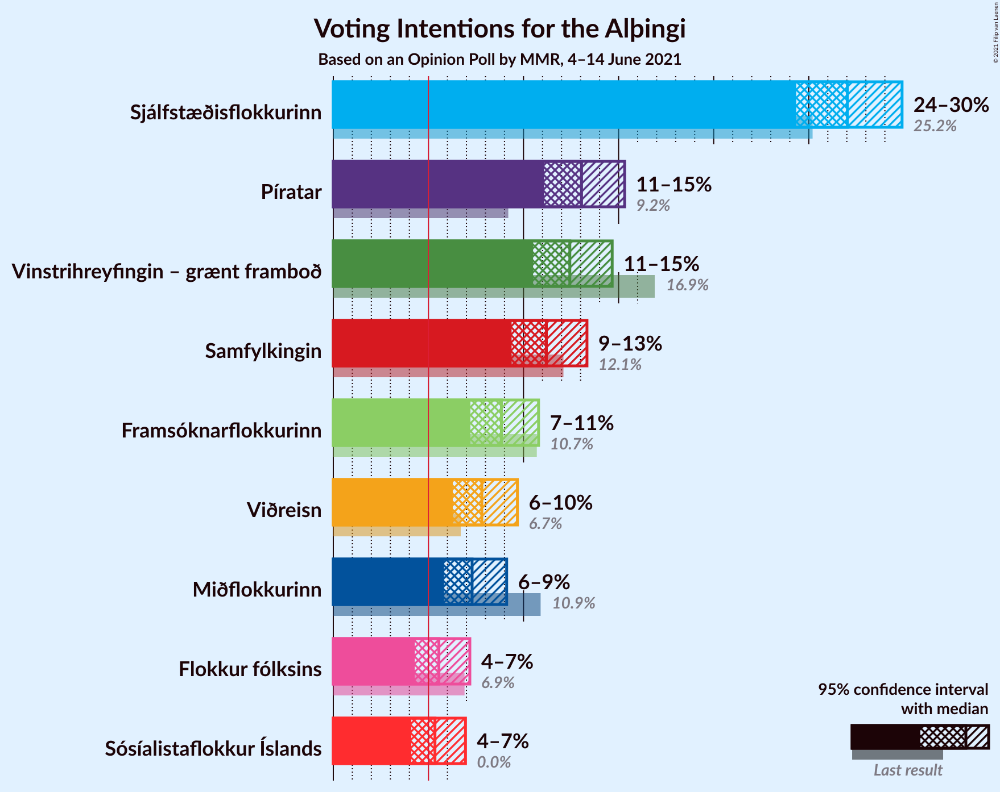

### Confidence Intervals

| Party | Last Result | Poll Result | 80% Confidence Interval | 90% Confidence Interval | 95% Confidence Interval | 99% Confidence Interval |
|:-----:|:-----------:|:-----------:|:-----------------------:|:-----------------------:|:-----------------------:|:-----------------------:|
| Sjálfstæðisflokkurinn | 25.2% | 27.0% | 25.3–28.9% |24.8–29.4% |24.3–29.9% |23.5–30.8% |
| Píratar | 9.2% | 13.1% | 11.8–14.5% |11.4–15.0% |11.1–15.3% |10.5–16.0% |
| Vinstrihreyfingin – grænt framboð | 16.9% | 12.4% | 11.2–13.9% |10.8–14.3% |10.5–14.7% |9.9–15.4% |
| Samfylkingin | 12.1% | 11.2% | 10.0–12.6% |9.7–13.0% |9.4–13.3% |8.8–14.0% |
| Framsóknarflokkurinn | 10.7% | 8.8% | 7.8–10.1% |7.5–10.5% |7.2–10.8% |6.7–11.4% |
| Viðreisn | 6.7% | 7.8% | 6.8–9.0% |6.5–9.4% |6.3–9.7% |5.8–10.3% |
| Miðflokkurinn | 10.9% | 7.3% | 6.3–8.5% |6.1–8.8% |5.8–9.1% |5.4–9.7% |
| Flokkur fólksins | 6.9% | 5.5% | 4.7–6.6% |4.5–6.9% |4.3–7.2% |3.9–7.7% |
| Sósíalistaflokkur Íslands | 0.0% | 5.3% | 4.5–6.4% |4.3–6.7% |4.1–7.0% |3.7–7.5% |

*Note:* The poll result column reflects the actual value used in the calculations. Published results may vary slightly, and in addition be rounded to fewer digits.

## Seats

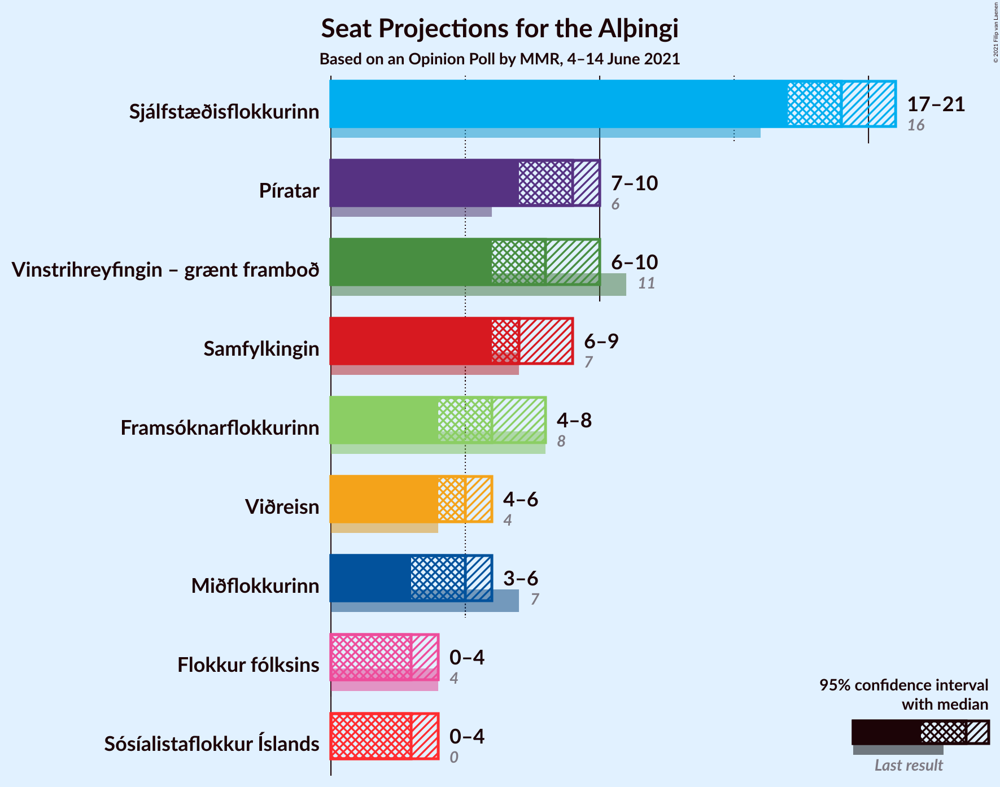

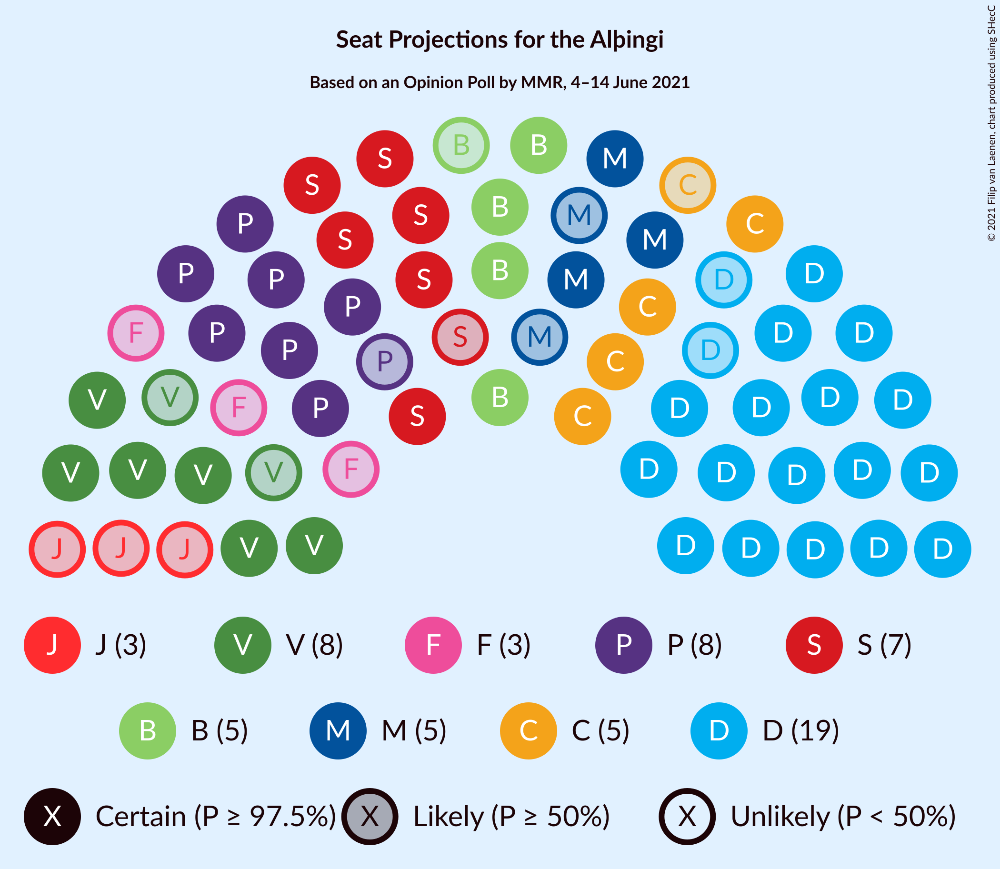

### Confidence Intervals

| Party | Last Result | Median | 80% Confidence Interval | 90% Confidence Interval | 95% Confidence Interval | 99% Confidence Interval |
|:-----:|:-----------:|:------:|:-----------------------:|:-----------------------:|:-----------------------:|:-----------------------:|
| <a href="#sjálfstæðisflokkurinn">Sjálfstæðisflokkurinn</a> | 16 | 19 | 18–21 |18–21 |17–21 |16–22 |
| <a href="#píratar">Píratar</a> | 6 | 9 | 8–9 |7–10 |7–10 |6–11 |
| <a href="#vinstrihreyfingin-–-grænt-framboð">Vinstrihreyfingin – grænt framboð</a> | 11 | 8 | 7–10 |6–10 |6–10 |6–10 |
| <a href="#samfylkingin">Samfylkingin</a> | 7 | 7 | 6–8 |6–8 |6–9 |5–9 |
| <a href="#framsóknarflokkurinn">Framsóknarflokkurinn</a> | 8 | 6 | 4–7 |4–8 |4–8 |4–8 |
| <a href="#viðreisn">Viðreisn</a> | 4 | 5 | 4–6 |4–6 |4–6 |4–6 |
| <a href="#miðflokkurinn">Miðflokkurinn</a> | 7 | 5 | 3–5 |3–6 |3–6 |3–6 |
| <a href="#flokkur-fólksins">Flokkur fólksins</a> | 4 | 3 | 0–4 |0–4 |0–4 |0–5 |
| <a href="#sósíalistaflokkur-íslands">Sósíalistaflokkur Íslands</a> | 0 | 3 | 0–4 |0–4 |0–4 |0–5 |

### Sjálfstæðisflokkurinn

*For a full overview of the results for this party, see the [Sjálfstæðisflokkurinn](party-sjálfstæðisflokkurinn.html) page.*

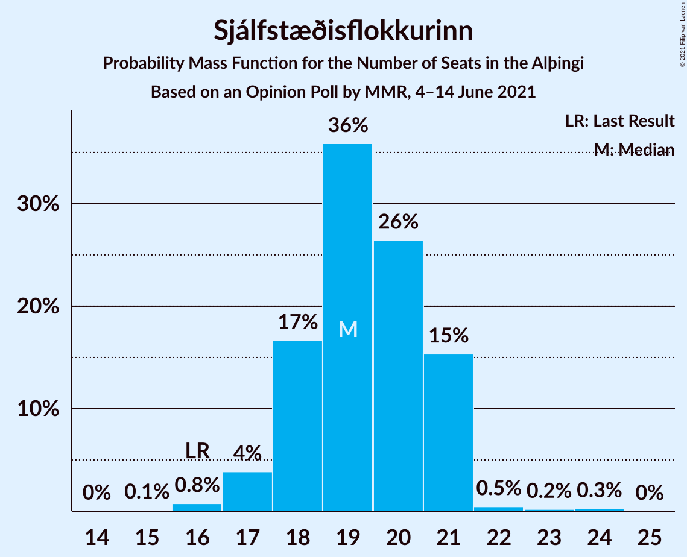

| Number of Seats | Probability | Accumulated | Special Marks |
|:---------------:|:-----------:|:-----------:|:-------------:|
| 15 | 0.1% | 100% |  |
| 16 | 0.8% | 99.9% | Last Result |
| 17 | 4% | 99.1% |  |
| 18 | 17% | 95% |  |
| 19 | 36% | 79% | Median |
| 20 | 26% | 43% |  |
| 21 | 15% | 16% |  |
| 22 | 0.5% | 0.9% |  |
| 23 | 0.2% | 0.5% |  |
| 24 | 0.3% | 0.3% |  |
| 25 | 0% | 0% |  |

### Píratar

*For a full overview of the results for this party, see the [Píratar](party-píratar.html) page.*

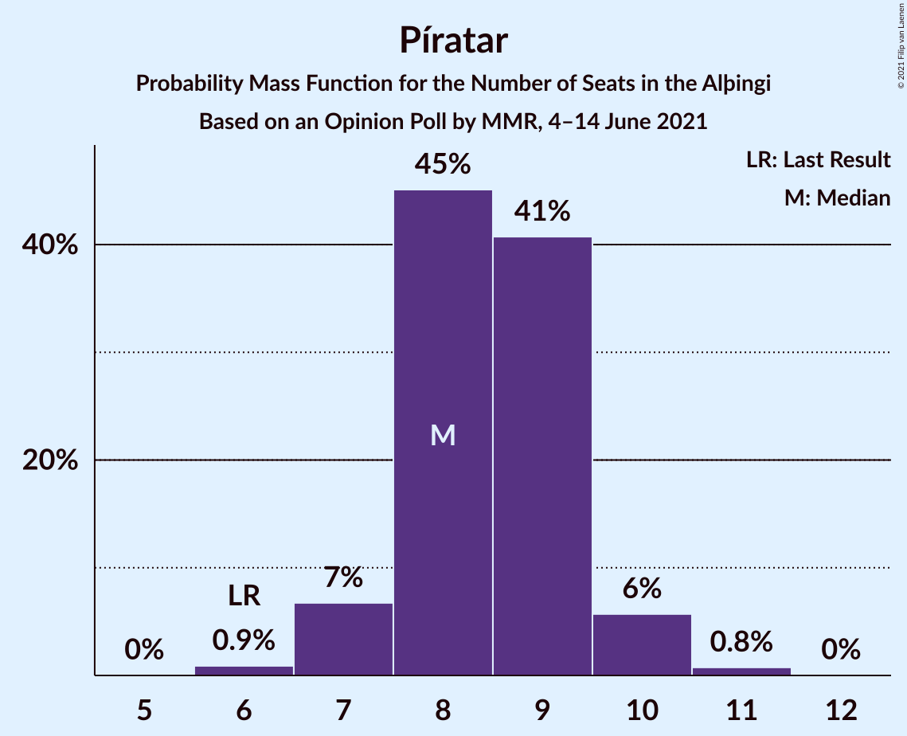

| Number of Seats | Probability | Accumulated | Special Marks |
|:---------------:|:-----------:|:-----------:|:-------------:|
| 6 | 2% | 100% | Last Result |
| 7 | 5% | 98% |  |
| 8 | 41% | 93% |  |
| 9 | 44% | 52% | Median |
| 10 | 7% | 8% |  |
| 11 | 1.1% | 1.1% |  |
| 12 | 0% | 0% |  |

### Vinstrihreyfingin – grænt framboð

*For a full overview of the results for this party, see the [Vinstrihreyfingin – grænt framboð](party-vinstrihreyfingin–græntframboð.html) page.*

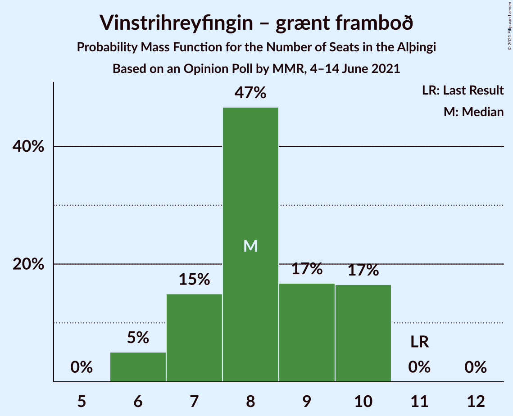

| Number of Seats | Probability | Accumulated | Special Marks |
|:---------------:|:-----------:|:-----------:|:-------------:|
| 6 | 5% | 100% |  |
| 7 | 15% | 95% |  |
| 8 | 47% | 80% | Median |
| 9 | 17% | 33% |  |
| 10 | 17% | 17% |  |
| 11 | 0% | 0.1% | Last Result |
| 12 | 0% | 0% |  |

### Samfylkingin

*For a full overview of the results for this party, see the [Samfylkingin](party-samfylkingin.html) page.*

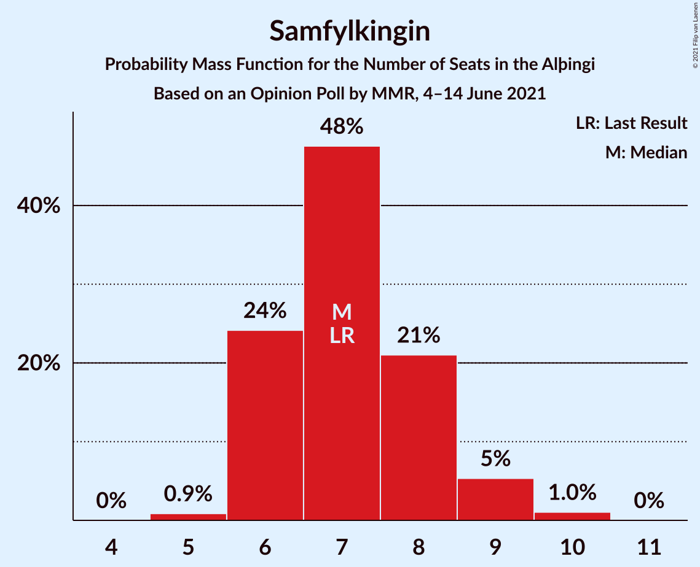

| Number of Seats | Probability | Accumulated | Special Marks |
|:---------------:|:-----------:|:-----------:|:-------------:|
| 5 | 0.9% | 100% |  |
| 6 | 26% | 99.1% |  |
| 7 | 50% | 73% | Last Result, Median |
| 8 | 21% | 23% |  |
| 9 | 2% | 3% |  |
| 10 | 0.3% | 0.3% |  |
| 11 | 0% | 0% |  |

### Framsóknarflokkurinn

*For a full overview of the results for this party, see the [Framsóknarflokkurinn](party-framsóknarflokkurinn.html) page.*

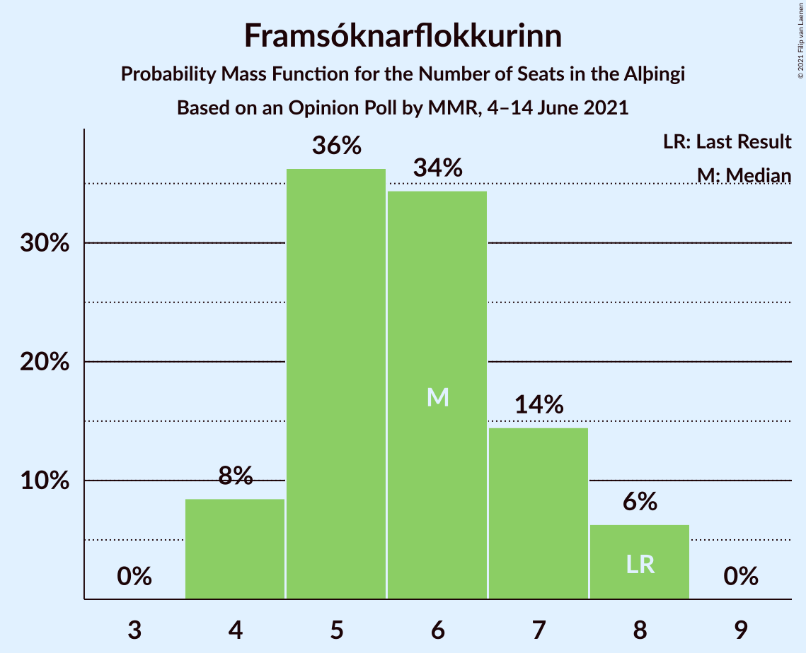

| Number of Seats | Probability | Accumulated | Special Marks |
|:---------------:|:-----------:|:-----------:|:-------------:|
| 4 | 14% | 100% |  |
| 5 | 29% | 86% |  |
| 6 | 32% | 57% | Median |
| 7 | 21% | 26% |  |
| 8 | 5% | 5% | Last Result |
| 9 | 0.1% | 0.1% |  |
| 10 | 0% | 0% |  |

### Viðreisn

*For a full overview of the results for this party, see the [Viðreisn](party-viðreisn.html) page.*

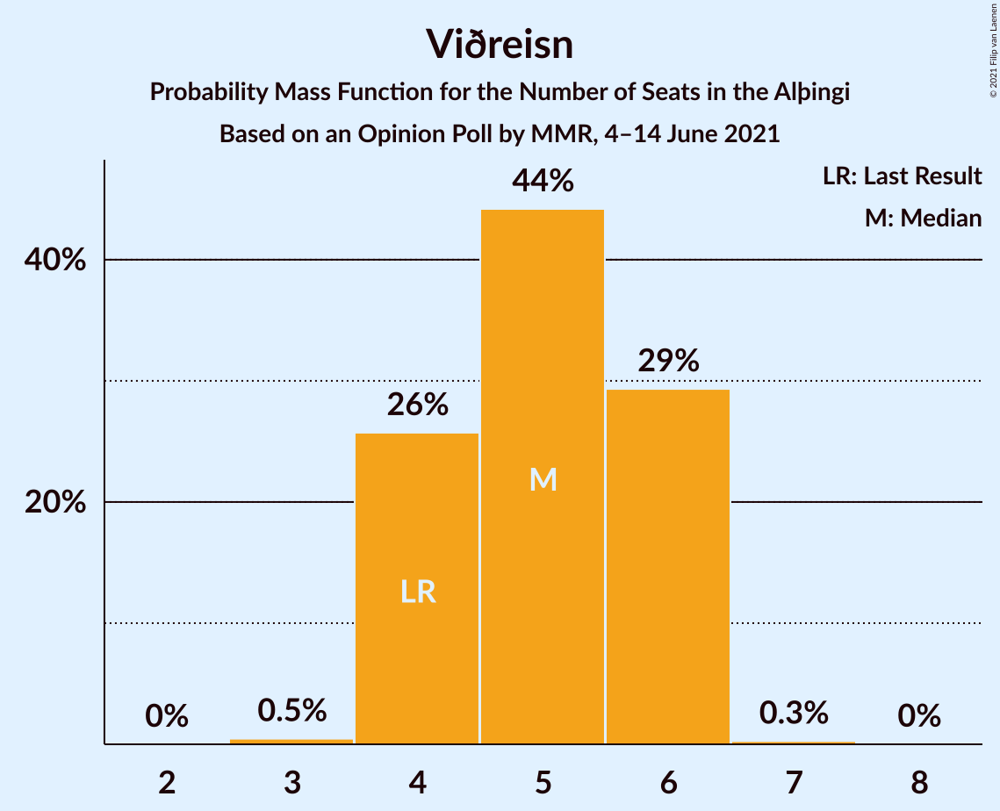

| Number of Seats | Probability | Accumulated | Special Marks |
|:---------------:|:-----------:|:-----------:|:-------------:|
| 3 | 0.5% | 100% |  |
| 4 | 26% | 99.5% | Last Result |
| 5 | 44% | 74% | Median |
| 6 | 29% | 30% |  |
| 7 | 0.3% | 0.3% |  |
| 8 | 0% | 0% |  |

### Miðflokkurinn

*For a full overview of the results for this party, see the [Miðflokkurinn](party-miðflokkurinn.html) page.*

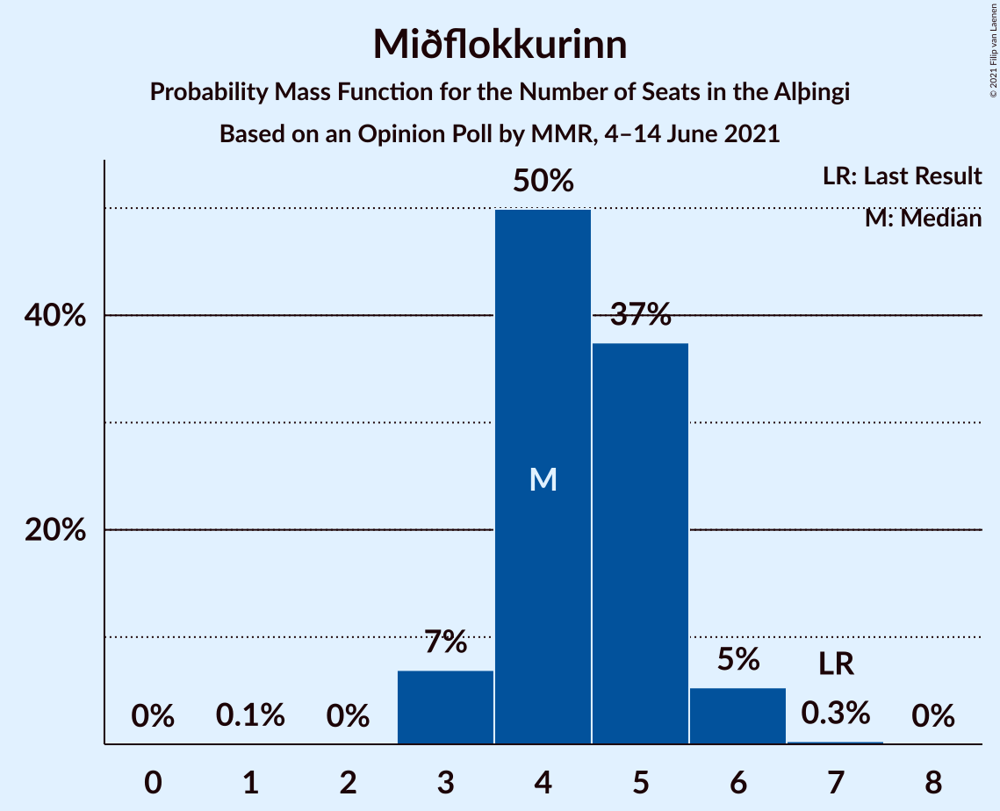

| Number of Seats | Probability | Accumulated | Special Marks |
|:---------------:|:-----------:|:-----------:|:-------------:|
| 1 | 0.1% | 100% |  |
| 2 | 0% | 99.9% |  |
| 3 | 11% | 99.9% |  |
| 4 | 34% | 89% |  |
| 5 | 47% | 55% | Median |
| 6 | 8% | 8% |  |
| 7 | 0.1% | 0.1% | Last Result |
| 8 | 0% | 0% |  |

### Flokkur fólksins

*For a full overview of the results for this party, see the [Flokkur fólksins](party-flokkurfólksins.html) page.*

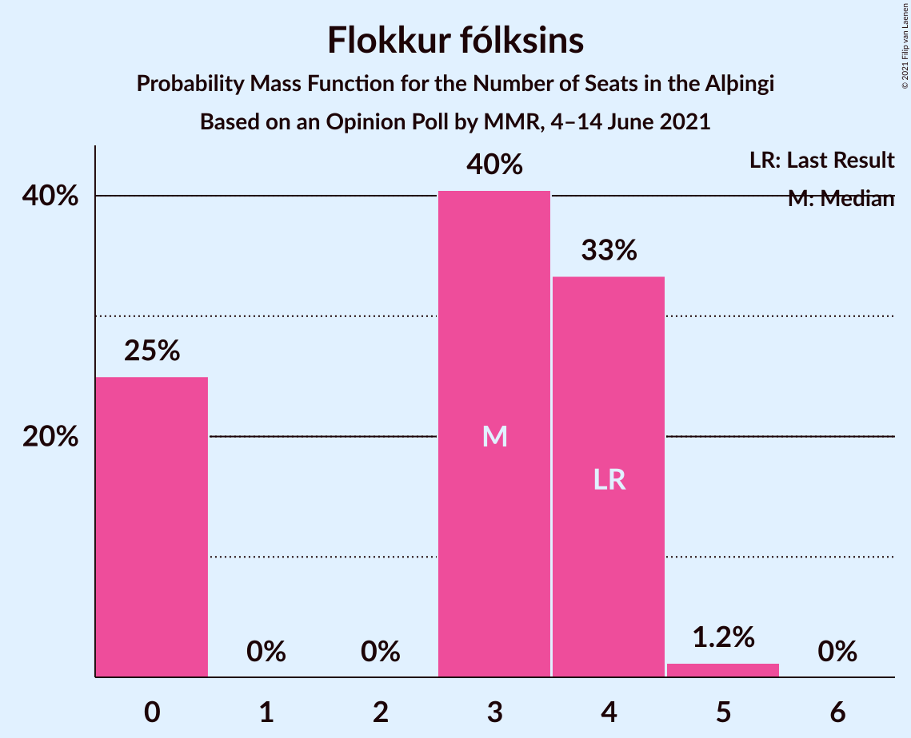

| Number of Seats | Probability | Accumulated | Special Marks |
|:---------------:|:-----------:|:-----------:|:-------------:|
| 0 | 28% | 100% |  |
| 1 | 0% | 72% |  |
| 2 | 0% | 72% |  |
| 3 | 43% | 72% | Median |
| 4 | 28% | 28% | Last Result |
| 5 | 0.9% | 0.9% |  |
| 6 | 0% | 0% |  |

### Sósíalistaflokkur Íslands

*For a full overview of the results for this party, see the [Sósíalistaflokkur Íslands](party-sósíalistaflokkuríslands.html) page.*

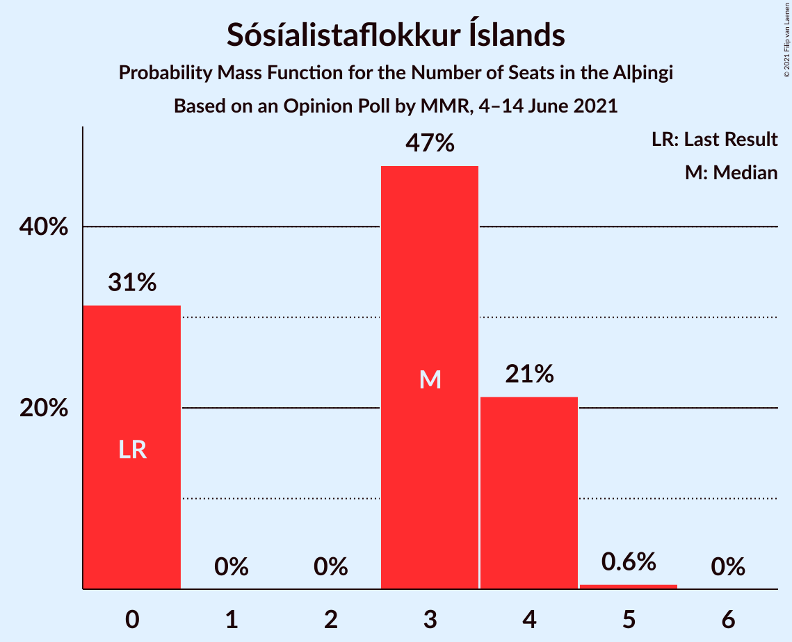

| Number of Seats | Probability | Accumulated | Special Marks |
|:---------------:|:-----------:|:-----------:|:-------------:|
| 0 | 33% | 100% | Last Result |
| 1 | 0% | 67% |  |
| 2 | 0% | 67% |  |
| 3 | 51% | 67% | Median |
| 4 | 15% | 16% |  |
| 5 | 0.9% | 0.9% |  |
| 6 | 0% | 0% |  |

## Coalitions

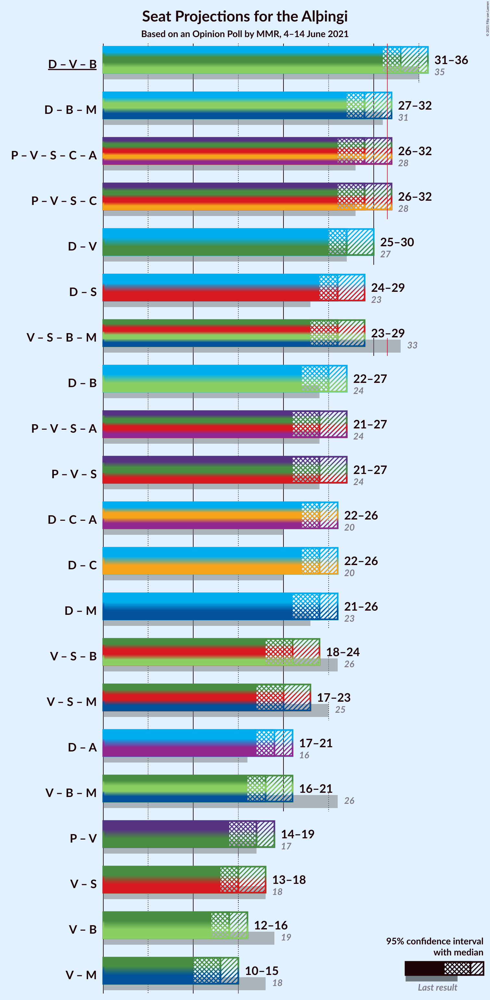

### Confidence Intervals

| Coalition | Last Result | Median | Majority? | 80% Confidence Interval | 90% Confidence Interval | 95% Confidence Interval | 99% Confidence Interval |
|:---------:|:-----------:|:------:|:---------:|:-----------------------:|:-----------------------:|:-----------------------:|:-----------------------:|
| Sjálfstæðisflokkurinn – Vinstrihreyfingin – grænt framboð – Framsóknarflokkurinn | 35 | 34 | 89% | 31–35 | 31–35 | 31–36 | 30–37 |
| Sjálfstæðisflokkurinn – Framsóknarflokkurinn – Miðflokkurinn | 31 | 30 | 13% | 27–32 | 27–32 | 27–32 | 26–33 |
| Píratar – Vinstrihreyfingin – grænt framboð – Samfylkingin – Viðreisn | 28 | 29 | 2% | 27–31 | 26–31 | 26–31 | 25–33 |
| Sjálfstæðisflokkurinn – Vinstrihreyfingin – grænt framboð | 27 | 28 | 0.1% | 26–29 | 25–30 | 25–30 | 24–30 |
| Sjálfstæðisflokkurinn – Samfylkingin | 23 | 26 | 0% | 25–29 | 25–29 | 24–29 | 23–30 |
| Vinstrihreyfingin – grænt framboð – Samfylkingin – Framsóknarflokkurinn – Miðflokkurinn | 33 | 26 | 0% | 23–28 | 22–28 | 22–28 | 22–29 |
| Sjálfstæðisflokkurinn – Framsóknarflokkurinn | 24 | 26 | 0% | 23–27 | 22–27 | 22–27 | 22–29 |
| Sjálfstæðisflokkurinn – Miðflokkurinn | 23 | 24 | 0% | 22–26 | 22–26 | 22–26 | 20–27 |
| Sjálfstæðisflokkurinn – Viðreisn | 20 | 24 | 0% | 23–26 | 22–26 | 22–26 | 21–27 |
| Píratar – Vinstrihreyfingin – grænt framboð – Samfylkingin | 24 | 24 | 0% | 22–26 | 21–26 | 21–26 | 21–28 |
| Vinstrihreyfingin – grænt framboð – Samfylkingin – Framsóknarflokkurinn | 26 | 21 | 0% | 19–23 | 18–23 | 18–24 | 18–25 |
| Vinstrihreyfingin – grænt framboð – Samfylkingin – Miðflokkurinn | 25 | 20 | 0% | 18–22 | 17–22 | 17–22 | 17–23 |
| Vinstrihreyfingin – grænt framboð – Framsóknarflokkurinn – Miðflokkurinn | 26 | 18 | 0% | 17–21 | 16–21 | 15–21 | 15–22 |
| Píratar – Vinstrihreyfingin – grænt framboð | 17 | 17 | 0% | 15–18 | 14–19 | 14–19 | 14–20 |
| Vinstrihreyfingin – grænt framboð – Samfylkingin | 18 | 15 | 0% | 14–17 | 13–17 | 13–17 | 13–18 |
| Vinstrihreyfingin – grænt framboð – Framsóknarflokkurinn | 19 | 14 | 0% | 12–16 | 12–16 | 11–16 | 11–17 |
| Vinstrihreyfingin – grænt framboð – Miðflokkurinn | 18 | 13 | 0% | 11–15 | 11–15 | 10–15 | 10–16 |

### Sjálfstæðisflokkurinn – Vinstrihreyfingin – grænt framboð – Framsóknarflokkurinn

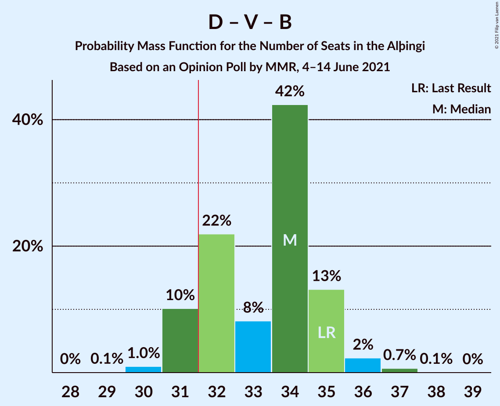

| Number of Seats | Probability | Accumulated | Special Marks |
|:---------------:|:-----------:|:-----------:|:-------------:|
| 29 | 0.1% | 100% |  |
| 30 | 1.0% | 99.9% |  |
| 31 | 10% | 98.9% |  |
| 32 | 22% | 89% | Majority |
| 33 | 8% | 67% | Median |
| 34 | 42% | 59% |  |
| 35 | 13% | 16% | Last Result |
| 36 | 2% | 3% |  |
| 37 | 0.7% | 0.8% |  |
| 38 | 0.1% | 0.1% |  |
| 39 | 0% | 0% |  |

### Sjálfstæðisflokkurinn – Framsóknarflokkurinn – Miðflokkurinn

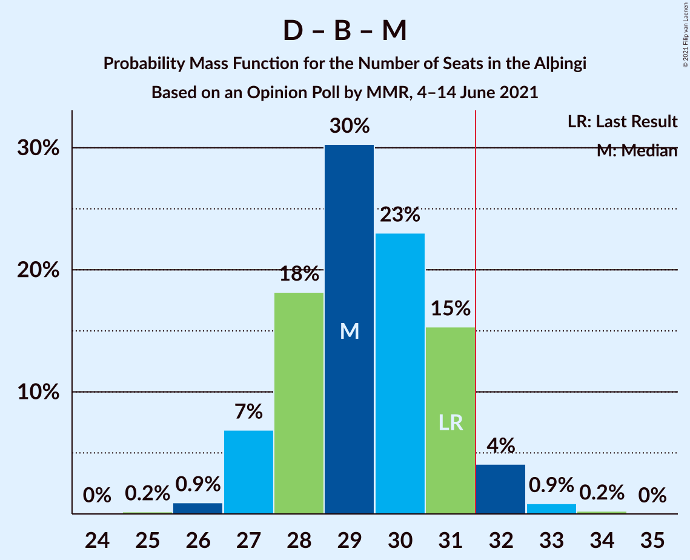

| Number of Seats | Probability | Accumulated | Special Marks |
|:---------------:|:-----------:|:-----------:|:-------------:|
| 25 | 0.2% | 100% |  |
| 26 | 0.7% | 99.8% |  |
| 27 | 10% | 99.1% |  |
| 28 | 17% | 89% |  |
| 29 | 19% | 72% |  |
| 30 | 21% | 53% | Median |
| 31 | 18% | 32% | Last Result |
| 32 | 12% | 13% | Majority |
| 33 | 1.4% | 2% |  |
| 34 | 0.3% | 0.3% |  |
| 35 | 0% | 0% |  |

### Píratar – Vinstrihreyfingin – grænt framboð – Samfylkingin – Viðreisn

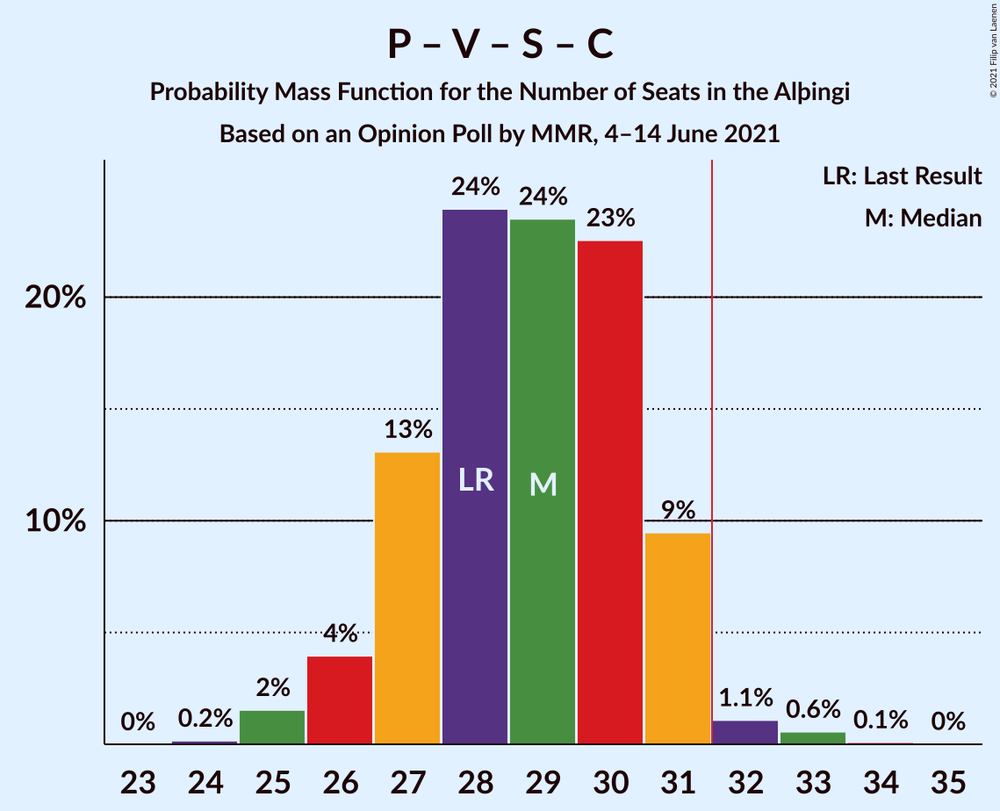

| Number of Seats | Probability | Accumulated | Special Marks |
|:---------------:|:-----------:|:-----------:|:-------------:|
| 24 | 0.2% | 100% |  |
| 25 | 2% | 99.8% |  |
| 26 | 4% | 98% |  |
| 27 | 13% | 94% |  |
| 28 | 24% | 81% | Last Result |
| 29 | 24% | 57% | Median |
| 30 | 23% | 34% |  |
| 31 | 9% | 11% |  |
| 32 | 1.1% | 2% | Majority |
| 33 | 0.6% | 0.7% |  |
| 34 | 0.1% | 0.1% |  |
| 35 | 0% | 0% |  |

### Sjálfstæðisflokkurinn – Vinstrihreyfingin – grænt framboð

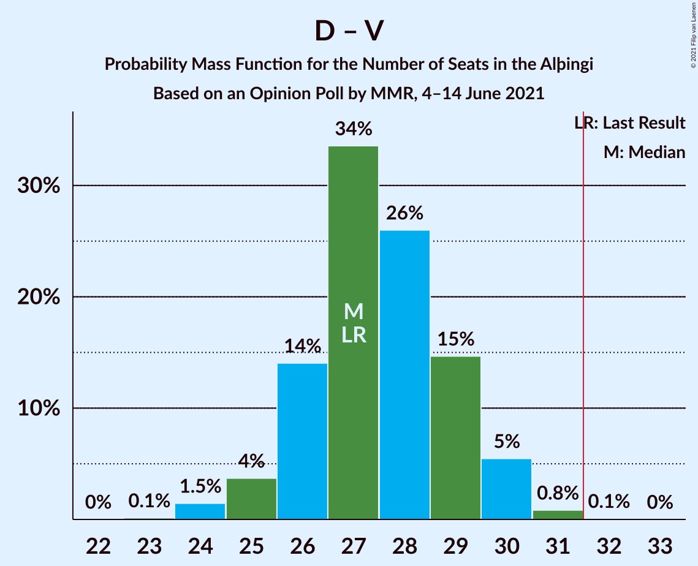

| Number of Seats | Probability | Accumulated | Special Marks |
|:---------------:|:-----------:|:-----------:|:-------------:|
| 23 | 0.1% | 100% |  |
| 24 | 0.8% | 99.9% |  |
| 25 | 5% | 99.1% |  |
| 26 | 12% | 94% |  |
| 27 | 26% | 83% | Last Result, Median |
| 28 | 38% | 57% |  |
| 29 | 13% | 19% |  |
| 30 | 6% | 6% |  |
| 31 | 0.4% | 0.5% |  |
| 32 | 0.1% | 0.1% | Majority |
| 33 | 0% | 0% |  |

### Sjálfstæðisflokkurinn – Samfylkingin

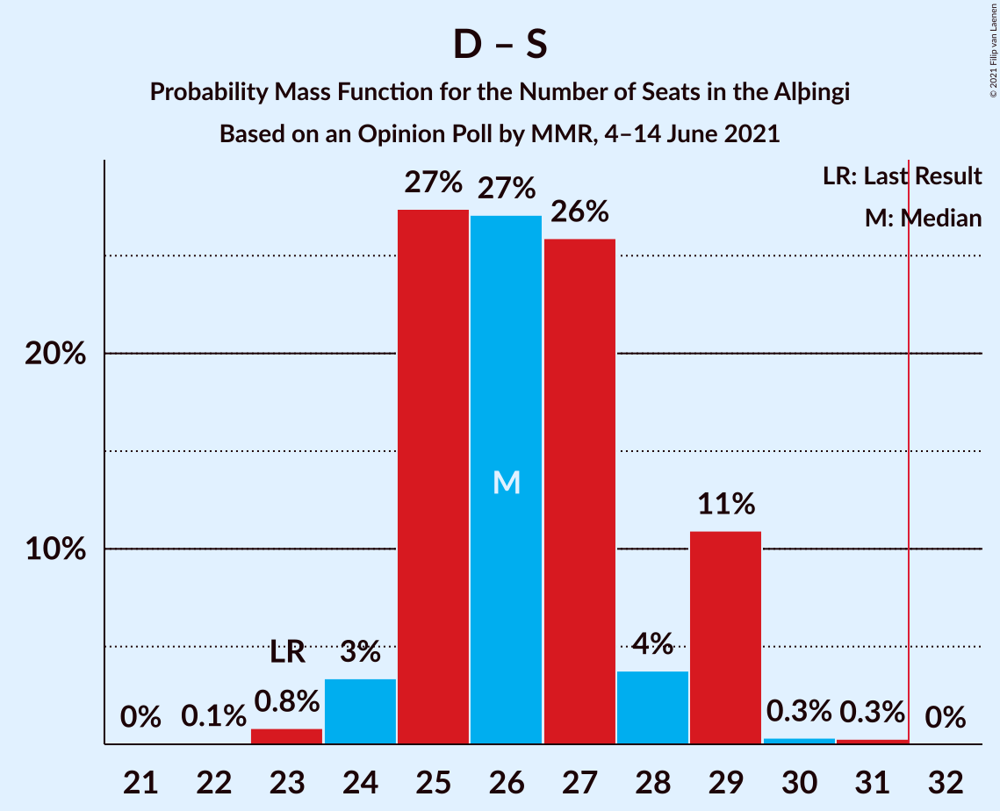

| Number of Seats | Probability | Accumulated | Special Marks |
|:---------------:|:-----------:|:-----------:|:-------------:|
| 22 | 0.1% | 100% |  |
| 23 | 0.8% | 99.9% | Last Result |
| 24 | 3% | 99.1% |  |
| 25 | 27% | 96% |  |
| 26 | 27% | 68% | Median |
| 27 | 26% | 41% |  |
| 28 | 4% | 15% |  |
| 29 | 11% | 12% |  |
| 30 | 0.3% | 0.6% |  |
| 31 | 0.3% | 0.3% |  |
| 32 | 0% | 0% | Majority |

### Vinstrihreyfingin – grænt framboð – Samfylkingin – Framsóknarflokkurinn – Miðflokkurinn

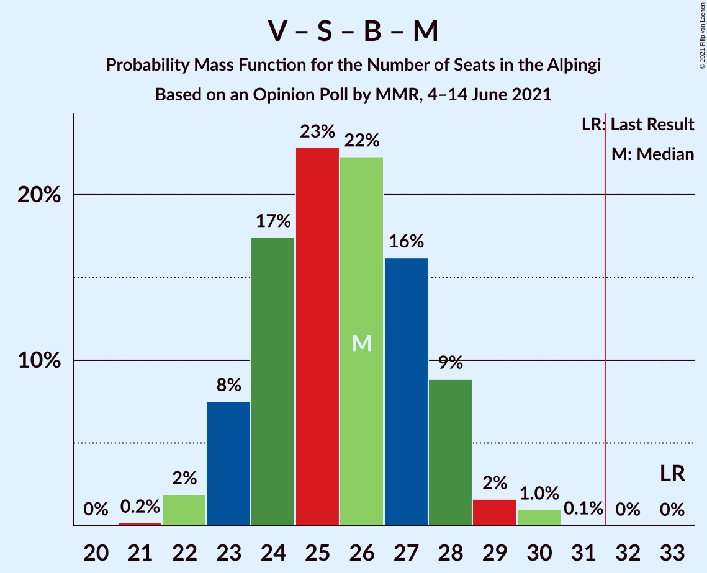

| Number of Seats | Probability | Accumulated | Special Marks |
|:---------------:|:-----------:|:-----------:|:-------------:|
| 21 | 0.1% | 100% |  |
| 22 | 7% | 99.9% |  |
| 23 | 6% | 92% |  |
| 24 | 11% | 86% |  |
| 25 | 20% | 76% |  |
| 26 | 34% | 56% | Median |
| 27 | 5% | 21% |  |
| 28 | 14% | 16% |  |
| 29 | 2% | 2% |  |
| 30 | 0.2% | 0.3% |  |
| 31 | 0.1% | 0.1% |  |
| 32 | 0% | 0% | Majority |
| 33 | 0% | 0% | Last Result |

### Sjálfstæðisflokkurinn – Framsóknarflokkurinn

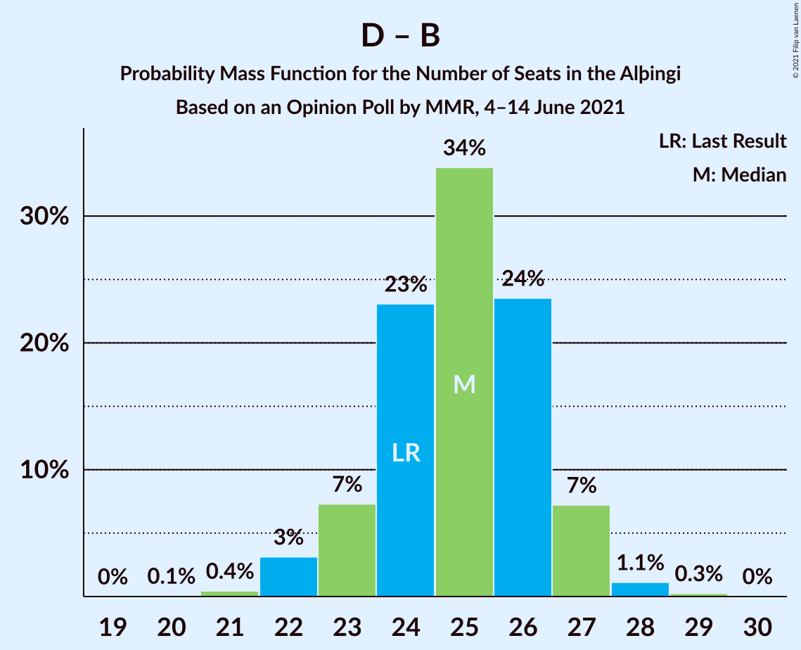

| Number of Seats | Probability | Accumulated | Special Marks |
|:---------------:|:-----------:|:-----------:|:-------------:|
| 21 | 0.1% | 100% |  |
| 22 | 9% | 99.8% |  |
| 23 | 7% | 90% |  |
| 24 | 13% | 83% | Last Result |
| 25 | 18% | 70% | Median |
| 26 | 41% | 52% |  |
| 27 | 10% | 11% |  |
| 28 | 0.4% | 1.1% |  |
| 29 | 0.8% | 0.8% |  |
| 30 | 0% | 0% |  |

### Sjálfstæðisflokkurinn – Miðflokkurinn

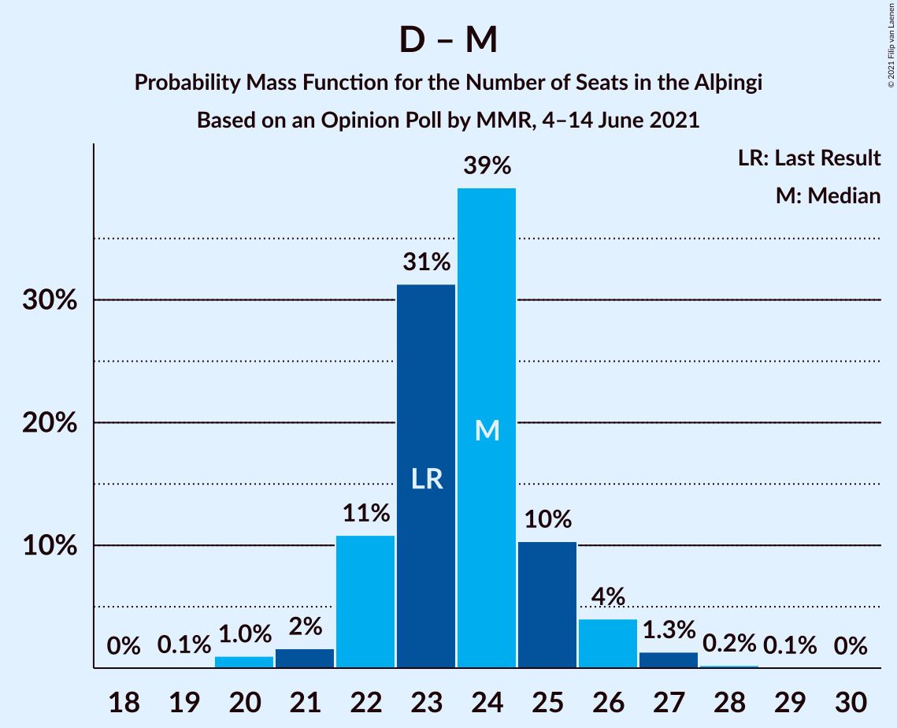

| Number of Seats | Probability | Accumulated | Special Marks |
|:---------------:|:-----------:|:-----------:|:-------------:|
| 19 | 0.1% | 100% |  |
| 20 | 0.8% | 99.9% |  |
| 21 | 0.6% | 99.1% |  |
| 22 | 12% | 98.5% |  |
| 23 | 24% | 86% | Last Result |
| 24 | 40% | 62% | Median |
| 25 | 6% | 22% |  |
| 26 | 15% | 16% |  |
| 27 | 0.2% | 0.6% |  |
| 28 | 0.1% | 0.4% |  |
| 29 | 0.3% | 0.3% |  |
| 30 | 0% | 0% |  |

### Sjálfstæðisflokkurinn – Viðreisn

| Number of Seats | Probability | Accumulated | Special Marks |
|:---------------:|:-----------:|:-----------:|:-------------:|
| 20 | 0.4% | 100% | Last Result |
| 21 | 1.1% | 99.6% |  |
| 22 | 5% | 98% |  |
| 23 | 27% | 94% |  |
| 24 | 19% | 66% | Median |
| 25 | 20% | 48% |  |
| 26 | 26% | 28% |  |
| 27 | 2% | 2% |  |
| 28 | 0.1% | 0.4% |  |
| 29 | 0.3% | 0.3% |  |
| 30 | 0% | 0% |  |

### Píratar – Vinstrihreyfingin – grænt framboð – Samfylkingin

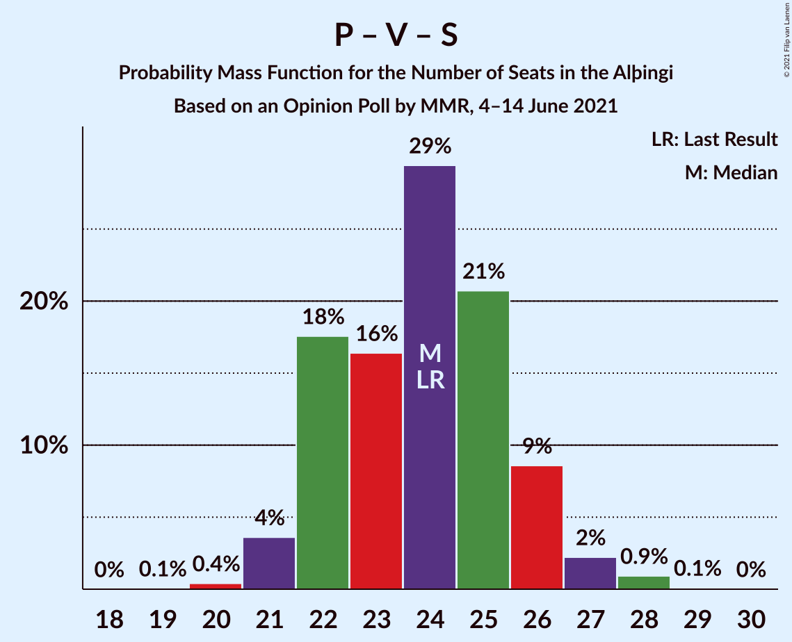

| Number of Seats | Probability | Accumulated | Special Marks |
|:---------------:|:-----------:|:-----------:|:-------------:|
| 19 | 0.1% | 100% |  |
| 20 | 0.3% | 99.9% |  |
| 21 | 6% | 99.6% |  |
| 22 | 14% | 94% |  |
| 23 | 26% | 80% |  |
| 24 | 21% | 54% | Last Result, Median |
| 25 | 22% | 34% |  |
| 26 | 9% | 12% |  |
| 27 | 1.5% | 2% |  |
| 28 | 0.6% | 0.6% |  |
| 29 | 0% | 0% |  |

### Vinstrihreyfingin – grænt framboð – Samfylkingin – Framsóknarflokkurinn

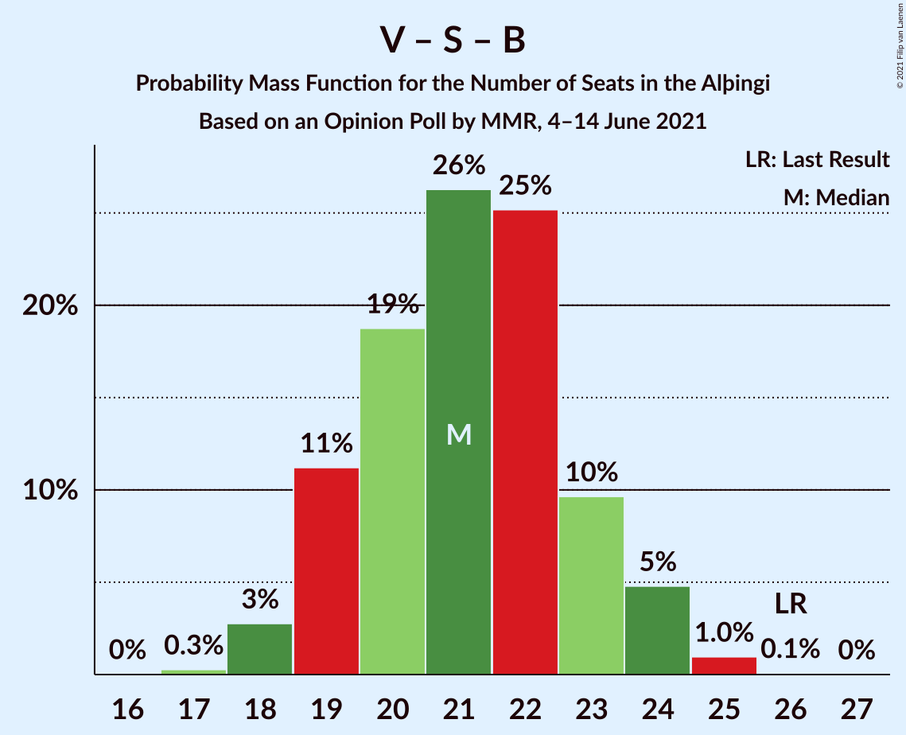

| Number of Seats | Probability | Accumulated | Special Marks |
|:---------------:|:-----------:|:-----------:|:-------------:|
| 17 | 0.2% | 100% |  |
| 18 | 7% | 99.8% |  |
| 19 | 8% | 93% |  |
| 20 | 13% | 85% |  |
| 21 | 41% | 72% | Median |
| 22 | 17% | 31% |  |
| 23 | 10% | 14% |  |
| 24 | 2% | 3% |  |
| 25 | 0.7% | 0.8% |  |
| 26 | 0% | 0.1% | Last Result |
| 27 | 0% | 0% |  |

### Vinstrihreyfingin – grænt framboð – Samfylkingin – Miðflokkurinn

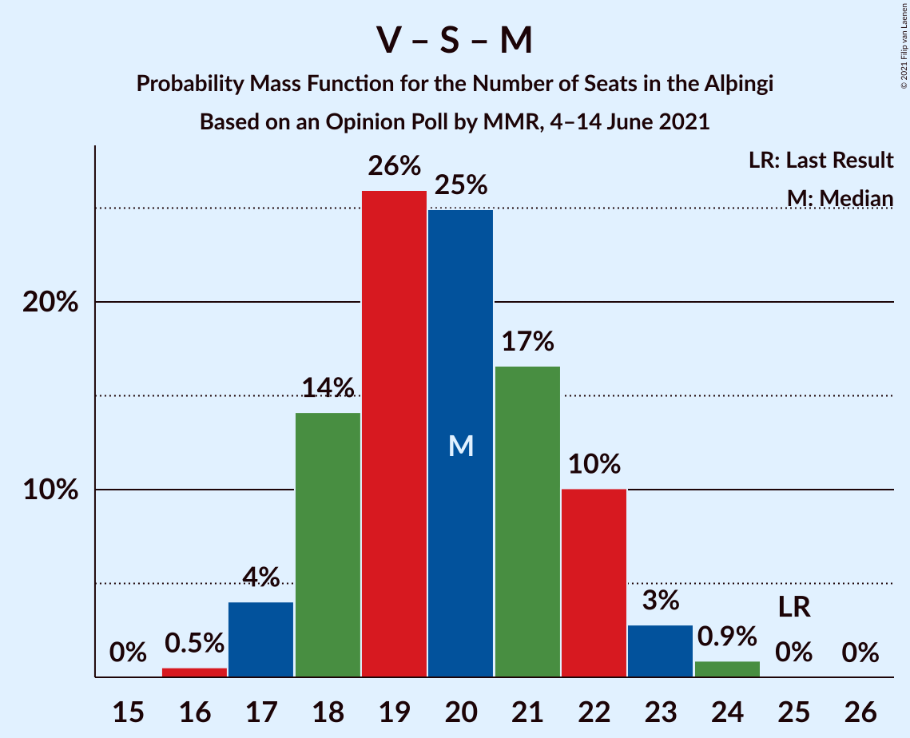

| Number of Seats | Probability | Accumulated | Special Marks |
|:---------------:|:-----------:|:-----------:|:-------------:|
| 16 | 0.2% | 100% |  |
| 17 | 9% | 99.8% |  |
| 18 | 12% | 91% |  |
| 19 | 28% | 79% |  |
| 20 | 18% | 52% | Median |
| 21 | 16% | 34% |  |
| 22 | 16% | 18% |  |
| 23 | 2% | 2% |  |
| 24 | 0.1% | 0.2% |  |
| 25 | 0% | 0% | Last Result |

### Vinstrihreyfingin – grænt framboð – Framsóknarflokkurinn – Miðflokkurinn

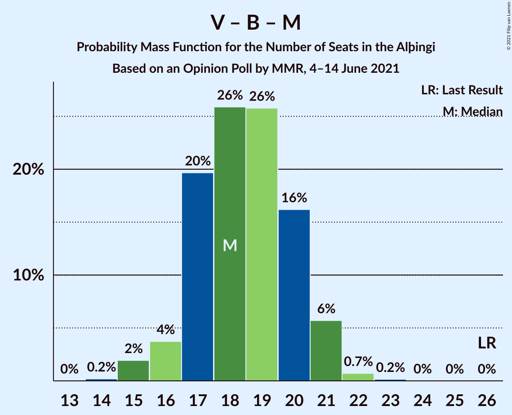

| Number of Seats | Probability | Accumulated | Special Marks |
|:---------------:|:-----------:|:-----------:|:-------------:|
| 14 | 0.1% | 100% |  |
| 15 | 4% | 99.9% |  |
| 16 | 5% | 96% |  |
| 17 | 15% | 91% |  |
| 18 | 31% | 76% |  |
| 19 | 15% | 45% | Median |
| 20 | 17% | 30% |  |
| 21 | 12% | 13% |  |
| 22 | 0.5% | 0.6% |  |
| 23 | 0.1% | 0.2% |  |
| 24 | 0.1% | 0.1% |  |
| 25 | 0% | 0% |  |
| 26 | 0% | 0% | Last Result |

### Píratar – Vinstrihreyfingin – grænt framboð

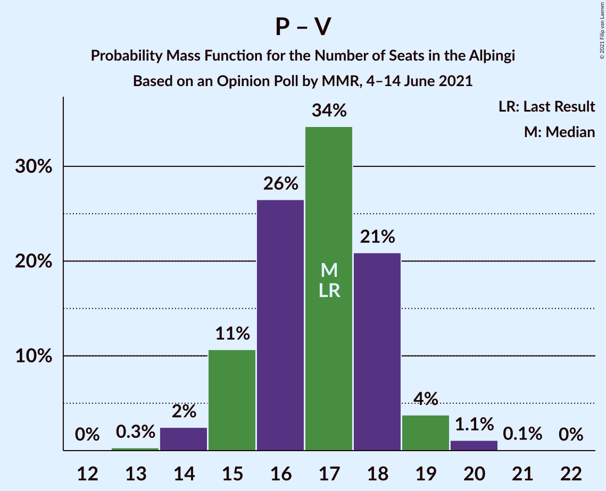

| Number of Seats | Probability | Accumulated | Special Marks |
|:---------------:|:-----------:|:-----------:|:-------------:|
| 13 | 0.1% | 100% |  |
| 14 | 6% | 99.9% |  |
| 15 | 14% | 94% |  |
| 16 | 18% | 80% |  |
| 17 | 31% | 62% | Last Result, Median |
| 18 | 21% | 31% |  |
| 19 | 9% | 10% |  |
| 20 | 0.8% | 0.9% |  |
| 21 | 0.1% | 0.1% |  |
| 22 | 0% | 0% |  |

### Vinstrihreyfingin – grænt framboð – Samfylkingin

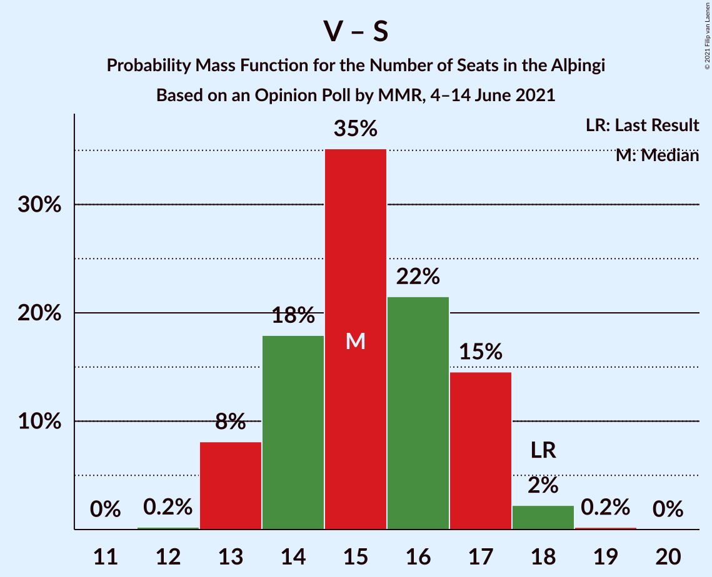

| Number of Seats | Probability | Accumulated | Special Marks |
|:---------------:|:-----------:|:-----------:|:-------------:|
| 12 | 0.2% | 100% |  |
| 13 | 8% | 99.7% |  |
| 14 | 18% | 92% |  |
| 15 | 35% | 74% | Median |
| 16 | 22% | 39% |  |
| 17 | 15% | 17% |  |
| 18 | 2% | 2% | Last Result |
| 19 | 0.2% | 0.2% |  |
| 20 | 0% | 0% |  |

### Vinstrihreyfingin – grænt framboð – Framsóknarflokkurinn

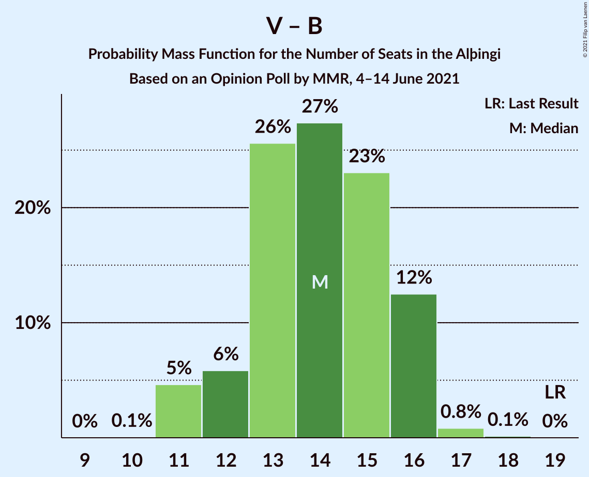

| Number of Seats | Probability | Accumulated | Special Marks |
|:---------------:|:-----------:|:-----------:|:-------------:|
| 10 | 0.1% | 100% |  |
| 11 | 5% | 99.9% |  |
| 12 | 6% | 95% |  |
| 13 | 26% | 89% |  |
| 14 | 27% | 64% | Median |
| 15 | 23% | 37% |  |
| 16 | 12% | 13% |  |
| 17 | 0.8% | 1.0% |  |
| 18 | 0.1% | 0.1% |  |
| 19 | 0% | 0% | Last Result |

### Vinstrihreyfingin – grænt framboð – Miðflokkurinn

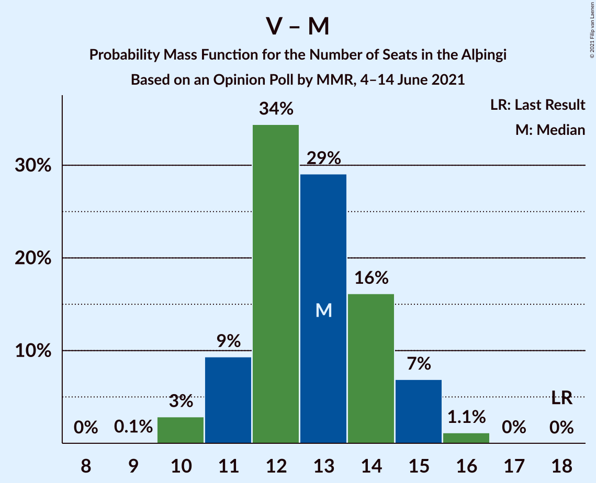

| Number of Seats | Probability | Accumulated | Special Marks |
|:---------------:|:-----------:|:-----------:|:-------------:|
| 9 | 0.1% | 100% |  |
| 10 | 4% | 99.9% |  |
| 11 | 11% | 95% |  |
| 12 | 33% | 85% |  |
| 13 | 22% | 52% | Median |
| 14 | 14% | 29% |  |
| 15 | 14% | 15% |  |
| 16 | 0.6% | 0.6% |  |
| 17 | 0% | 0% |  |
| 18 | 0% | 0% | Last Result |

## Technical Information

### Opinion Poll

+ **Polling firm:** MMR
+ **Commissioner(s):** —
+ **Fieldwork period:** 4–14 June 2021

### Calculations

+ **Sample size:** 973
+ **Simulations done:** 131,072
+ **Error estimate:** 2.27%

