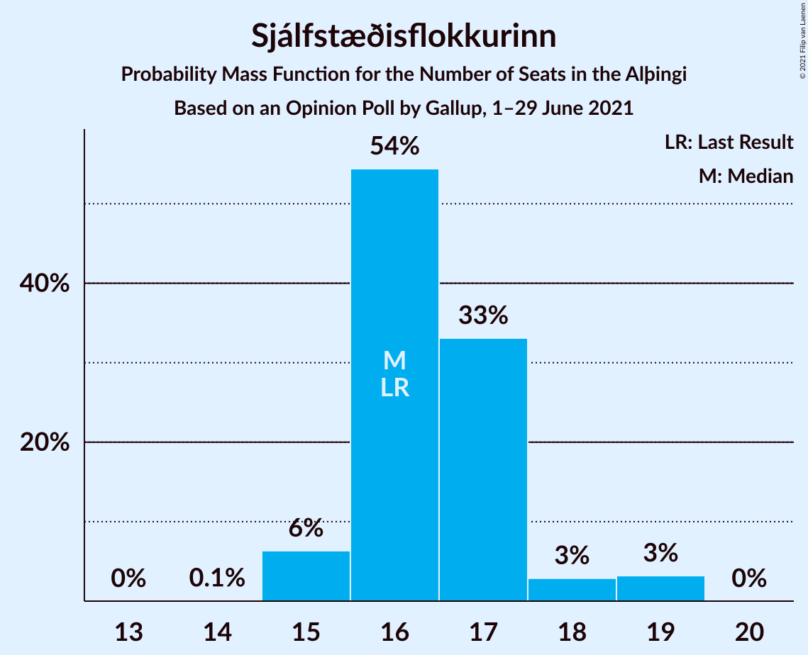
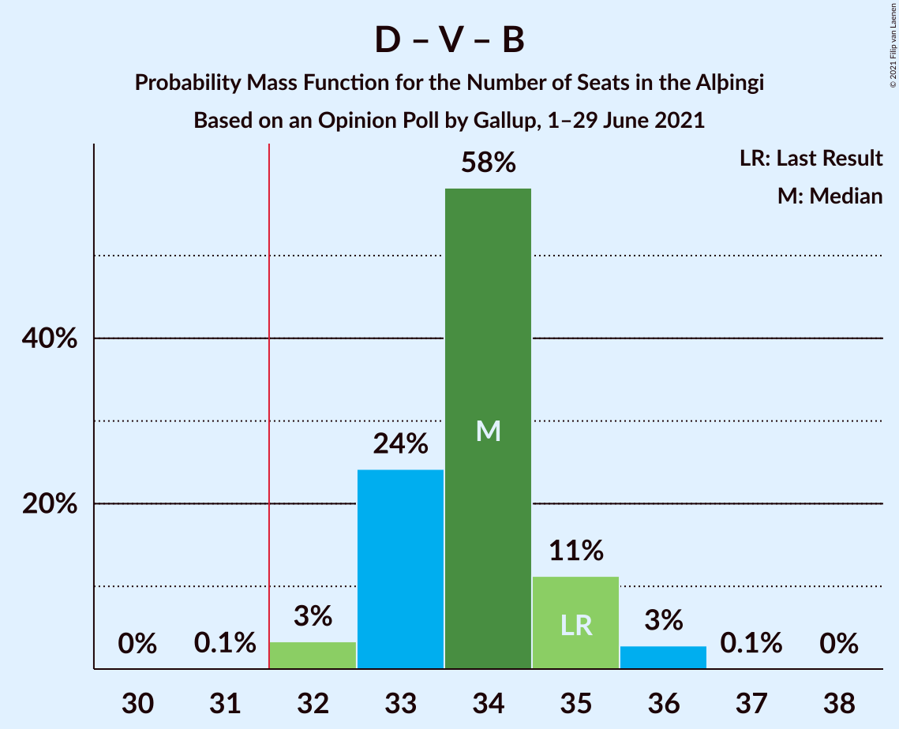
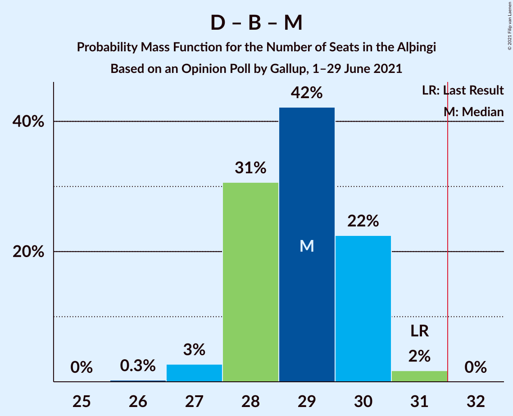
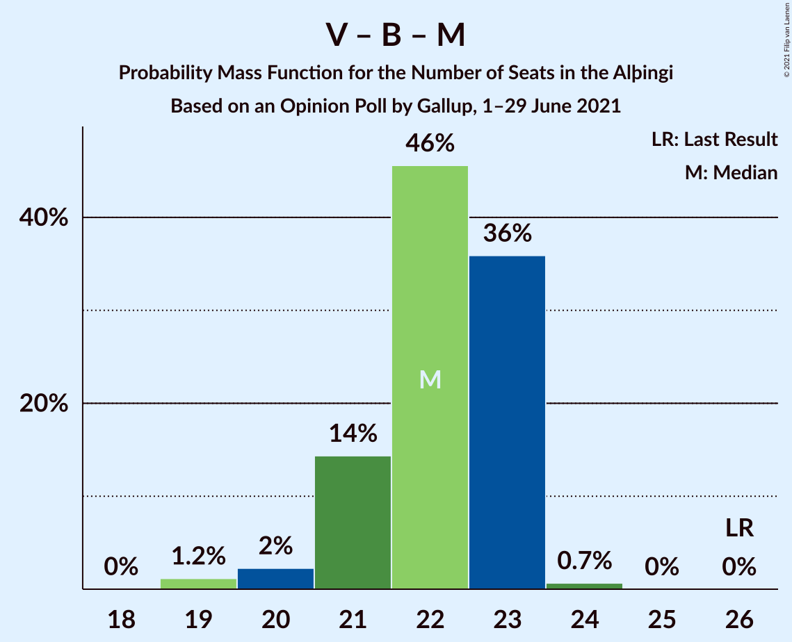

# Opinion Poll by Gallup, 1–29 June 2021

<a href="#voting-intentions">Voting Intentions</a> | <a href="#seats">Seats</a> | <a href="#coalitions">Coalitions</a> | <a href="#technical-information">Technical Information</a>

## Voting Intentions

### Confidence Intervals

| Party | Last Result | Poll Result | 80% Confidence Interval | 90% Confidence Interval | 95% Confidence Interval | 99% Confidence Interval |
|:-----:|:-----------:|:-----------:|:-----------------------:|:-----------------------:|:-----------------------:|:-----------------------:|
| Sjálfstæðisflokkurinn | 25.2% | 24.1% | 23.3–25.0% |23.0–25.2% |22.8–25.4% |22.5–25.8% |
| Vinstrihreyfingin – grænt framboð | 16.9% | 14.7% | 14.0–15.4% |13.8–15.6% |13.7–15.8% |13.4–16.2% |
| Píratar | 9.2% | 12.9% | 12.3–13.6% |12.1–13.8% |11.9–14.0% |11.6–14.3% |
| Viðreisn | 6.7% | 10.9% | 10.3–11.6% |10.2–11.7% |10.0–11.9% |9.7–12.2% |
| Framsóknarflokkurinn | 10.7% | 10.3% | 9.7–10.9% |9.6–11.1% |9.4–11.3% |9.2–11.6% |
| Samfylkingin | 12.1% | 9.9% | 9.3–10.5% |9.2–10.7% |9.0–10.8% |8.8–11.1% |
| Miðflokkurinn | 10.9% | 7.5% | 7.0–8.0% |6.9–8.2% |6.7–8.3% |6.5–8.6% |
| Sósíalistaflokkur Íslands | 0.0% | 5.4% | 5.0–5.9% |4.8–6.0% |4.8–6.1% |4.6–6.4% |
| Flokkur fólksins | 6.9% | 4.2% | 3.8–4.6% |3.7–4.7% |3.6–4.8% |3.5–5.1% |

*Note:* The poll result column reflects the actual value used in the calculations. Published results may vary slightly, and in addition be rounded to fewer digits.

## Seats

### Confidence Intervals

| Party | Last Result | Median | 80% Confidence Interval | 90% Confidence Interval | 95% Confidence Interval | 99% Confidence Interval |
|:-----:|:-----------:|:------:|:-----------------------:|:-----------------------:|:-----------------------:|:-----------------------:|
| <a href="#sjálfstæðisflokkurinn">Sjálfstæðisflokkurinn</a> | 16 | 16 | 16–17 |15–18 |15–19 |15–19 |
| <a href="#vinstrihreyfingin-–-grænt-framboð">Vinstrihreyfingin – grænt framboð</a> | 11 | 10 | 9–10 |9–10 |9–11 |9–11 |
| <a href="#píratar">Píratar</a> | 6 | 8 | 8–9 |8–9 |8–9 |7–9 |
| <a href="#viðreisn">Viðreisn</a> | 4 | 7 | 7–8 |6–8 |6–8 |6–8 |
| <a href="#framsóknarflokkurinn">Framsóknarflokkurinn</a> | 8 | 8 | 7–8 |6–8 |6–8 |6–8 |
| <a href="#samfylkingin">Samfylkingin</a> | 7 | 6 | 6–7 |6–7 |6–7 |5–7 |
| <a href="#miðflokkurinn">Miðflokkurinn</a> | 7 | 5 | 4–5 |4–5 |4–5 |4–6 |
| <a href="#sósíalistaflokkur-íslands">Sósíalistaflokkur Íslands</a> | 0 | 3 | 0–3 |0–4 |0–4 |0–4 |
| <a href="#flokkur-fólksins">Flokkur fólksins</a> | 4 | 0 | 0 |0 |0 |0–3 |

### Sjálfstæðisflokkurinn

*For a full overview of the results for this party, see the [Sjálfstæðisflokkurinn](party-sjálfstæðisflokkurinn.html) page.*

| Number of Seats | Probability | Accumulated | Special Marks |
|:---------------:|:-----------:|:-----------:|:-------------:|
| 14 | 0.1% | 100% |  |
| 15 | 6% | 99.9% |  |
| 16 | 54% | 94% | Last Result, Median |
| 17 | 33% | 39% |  |
| 18 | 3% | 6% |  |
| 19 | 3% | 3% |  |
| 20 | 0% | 0% |  |

### Vinstrihreyfingin – grænt framboð

*For a full overview of the results for this party, see the [Vinstrihreyfingin – grænt framboð](party-vinstrihreyfingin–græntframboð.html) page.*

| Number of Seats | Probability | Accumulated | Special Marks |
|:---------------:|:-----------:|:-----------:|:-------------:|
| 8 | 0.2% | 100% |  |
| 9 | 35% | 99.8% |  |
| 10 | 63% | 65% | Median |
| 11 | 3% | 3% | Last Result |
| 12 | 0% | 0% |  |

### Píratar

*For a full overview of the results for this party, see the [Píratar](party-píratar.html) page.*

| Number of Seats | Probability | Accumulated | Special Marks |
|:---------------:|:-----------:|:-----------:|:-------------:|
| 6 | 0% | 100% | Last Result |
| 7 | 1.5% | 100% |  |
| 8 | 57% | 98.5% | Median |
| 9 | 41% | 42% |  |
| 10 | 0.5% | 0.5% |  |
| 11 | 0% | 0% |  |

### Viðreisn

*For a full overview of the results for this party, see the [Viðreisn](party-viðreisn.html) page.*

| Number of Seats | Probability | Accumulated | Special Marks |
|:---------------:|:-----------:|:-----------:|:-------------:|
| 4 | 0% | 100% | Last Result |
| 5 | 0% | 100% |  |
| 6 | 5% | 100% |  |
| 7 | 78% | 95% | Median |
| 8 | 16% | 16% |  |
| 9 | 0% | 0% |  |

### Framsóknarflokkurinn

*For a full overview of the results for this party, see the [Framsóknarflokkurinn](party-framsóknarflokkurinn.html) page.*

| Number of Seats | Probability | Accumulated | Special Marks |
|:---------------:|:-----------:|:-----------:|:-------------:|
| 5 | 0.1% | 100% |  |
| 6 | 7% | 99.9% |  |
| 7 | 10% | 93% |  |
| 8 | 83% | 83% | Last Result, Median |
| 9 | 0% | 0% |  |

### Samfylkingin

*For a full overview of the results for this party, see the [Samfylkingin](party-samfylkingin.html) page.*

| Number of Seats | Probability | Accumulated | Special Marks |
|:---------------:|:-----------:|:-----------:|:-------------:|
| 5 | 1.0% | 100% |  |
| 6 | 77% | 99.0% | Median |
| 7 | 22% | 22% | Last Result |
| 8 | 0.3% | 0.3% |  |
| 9 | 0% | 0% |  |

### Miðflokkurinn

*For a full overview of the results for this party, see the [Miðflokkurinn](party-miðflokkurinn.html) page.*

| Number of Seats | Probability | Accumulated | Special Marks |
|:---------------:|:-----------:|:-----------:|:-------------:|
| 3 | 0.1% | 100% |  |
| 4 | 30% | 99.9% |  |
| 5 | 69% | 70% | Median |
| 6 | 0.7% | 0.7% |  |
| 7 | 0% | 0% | Last Result |

### Sósíalistaflokkur Íslands

*For a full overview of the results for this party, see the [Sósíalistaflokkur Íslands](party-sósíalistaflokkuríslands.html) page.*

| Number of Seats | Probability | Accumulated | Special Marks |
|:---------------:|:-----------:|:-----------:|:-------------:|
| 0 | 13% | 100% | Last Result |
| 1 | 0% | 87% |  |
| 2 | 0% | 87% |  |
| 3 | 79% | 87% | Median |
| 4 | 8% | 8% |  |
| 5 | 0% | 0% |  |

### Flokkur fólksins

*For a full overview of the results for this party, see the [Flokkur fólksins](party-flokkurfólksins.html) page.*

| Number of Seats | Probability | Accumulated | Special Marks |
|:---------------:|:-----------:|:-----------:|:-------------:|
| 0 | 99.4% | 100% | Median |
| 1 | 0% | 0.6% |  |
| 2 | 0.1% | 0.6% |  |
| 3 | 0.5% | 0.5% |  |
| 4 | 0% | 0% | Last Result |

## Coalitions

### Confidence Intervals

| Coalition | Last Result | Median | Majority? | 80% Confidence Interval | 90% Confidence Interval | 95% Confidence Interval | 99% Confidence Interval |
|:---------:|:-----------:|:------:|:---------:|:-----------------------:|:-----------------------:|:-----------------------:|:-----------------------:|
| Sjálfstæðisflokkurinn – Vinstrihreyfingin – grænt framboð – Framsóknarflokkurinn | 35 | 34 | 99.9% | 33–35 | 33–35 | 32–36 | 32–36 |
| Vinstrihreyfingin – grænt framboð – Píratar – Viðreisn – Samfylkingin | 28 | 31 | 41% | 30–33 | 30–33 | 30–34 | 29–34 |
| Sjálfstæðisflokkurinn – Framsóknarflokkurinn – Miðflokkurinn | 31 | 29 | 0% | 28–30 | 28–30 | 27–30 | 27–31 |
| Vinstrihreyfingin – grænt framboð – Framsóknarflokkurinn – Samfylkingin – Miðflokkurinn | 33 | 28 | 0% | 27–30 | 27–30 | 26–30 | 25–30 |
| Sjálfstæðisflokkurinn – Vinstrihreyfingin – grænt framboð | 27 | 26 | 0% | 25–27 | 25–28 | 25–28 | 24–29 |
| Vinstrihreyfingin – grænt framboð – Píratar – Samfylkingin | 24 | 24 | 0% | 23–25 | 23–26 | 23–26 | 23–27 |
| Sjálfstæðisflokkurinn – Viðreisn | 20 | 23 | 0% | 23–25 | 22–25 | 22–26 | 22–26 |
| Sjálfstæðisflokkurinn – Framsóknarflokkurinn | 24 | 24 | 0% | 23–25 | 23–25 | 23–25 | 22–26 |
| Vinstrihreyfingin – grænt framboð – Framsóknarflokkurinn – Samfylkingin | 26 | 24 | 0% | 23–25 | 22–25 | 22–25 | 21–26 |
| Sjálfstæðisflokkurinn – Samfylkingin | 23 | 22 | 0% | 22–24 | 22–24 | 21–25 | 21–26 |
| Vinstrihreyfingin – grænt framboð – Framsóknarflokkurinn – Miðflokkurinn | 26 | 22 | 0% | 21–23 | 21–23 | 20–23 | 19–24 |
| Sjálfstæðisflokkurinn – Miðflokkurinn | 23 | 21 | 0% | 20–22 | 20–23 | 20–23 | 19–24 |
| Vinstrihreyfingin – grænt framboð – Samfylkingin – Miðflokkurinn | 25 | 21 | 0% | 20–22 | 19–22 | 19–22 | 19–23 |
| Vinstrihreyfingin – grænt framboð – Píratar | 17 | 18 | 0% | 17–19 | 17–19 | 17–19 | 17–20 |
| Vinstrihreyfingin – grænt framboð – Framsóknarflokkurinn | 19 | 18 | 0% | 17–18 | 16–18 | 16–18 | 15–19 |
| Vinstrihreyfingin – grænt framboð – Samfylkingin | 18 | 16 | 0% | 15–17 | 15–17 | 15–17 | 15–18 |
| Vinstrihreyfingin – grænt framboð – Miðflokkurinn | 18 | 14 | 0% | 13–15 | 13–15 | 13–15 | 13–16 |

### Sjálfstæðisflokkurinn – Vinstrihreyfingin – grænt framboð – Framsóknarflokkurinn

| Number of Seats | Probability | Accumulated | Special Marks |
|:---------------:|:-----------:|:-----------:|:-------------:|
| 31 | 0.1% | 100% |  |
| 32 | 3% | 99.9% | Majority |
| 33 | 24% | 97% |  |
| 34 | 58% | 72% | Median |
| 35 | 11% | 14% | Last Result |
| 36 | 3% | 3% |  |
| 37 | 0.1% | 0.1% |  |
| 38 | 0% | 0% |  |

### Vinstrihreyfingin – grænt framboð – Píratar – Viðreisn – Samfylkingin

| Number of Seats | Probability | Accumulated | Special Marks |
|:---------------:|:-----------:|:-----------:|:-------------:|
| 28 | 0.1% | 100% | Last Result |
| 29 | 0.9% | 99.9% |  |
| 30 | 16% | 99.0% |  |
| 31 | 42% | 83% | Median |
| 32 | 27% | 41% | Majority |
| 33 | 10% | 14% |  |
| 34 | 3% | 3% |  |
| 35 | 0.3% | 0.3% |  |
| 36 | 0% | 0% |  |

### Sjálfstæðisflokkurinn – Framsóknarflokkurinn – Miðflokkurinn

| Number of Seats | Probability | Accumulated | Special Marks |
|:---------------:|:-----------:|:-----------:|:-------------:|
| 26 | 0.3% | 100% |  |
| 27 | 3% | 99.7% |  |
| 28 | 31% | 97% |  |
| 29 | 42% | 66% | Median |
| 30 | 22% | 24% |  |
| 31 | 2% | 2% | Last Result |
| 32 | 0% | 0% | Majority |

### Vinstrihreyfingin – grænt framboð – Framsóknarflokkurinn – Samfylkingin – Miðflokkurinn

| Number of Seats | Probability | Accumulated | Special Marks |
|:---------------:|:-----------:|:-----------:|:-------------:|
| 25 | 0.9% | 100% |  |
| 26 | 2% | 99.0% |  |
| 27 | 10% | 97% |  |
| 28 | 46% | 87% |  |
| 29 | 29% | 41% | Median |
| 30 | 11% | 12% |  |
| 31 | 0.4% | 0.4% |  |
| 32 | 0% | 0% | Majority |
| 33 | 0% | 0% | Last Result |

### Sjálfstæðisflokkurinn – Vinstrihreyfingin – grænt framboð

| Number of Seats | Probability | Accumulated | Special Marks |
|:---------------:|:-----------:|:-----------:|:-------------:|
| 24 | 1.0% | 100% |  |
| 25 | 18% | 99.0% |  |
| 26 | 61% | 81% | Median |
| 27 | 13% | 20% | Last Result |
| 28 | 5% | 7% |  |
| 29 | 2% | 2% |  |
| 30 | 0% | 0% |  |

### Vinstrihreyfingin – grænt framboð – Píratar – Samfylkingin

| Number of Seats | Probability | Accumulated | Special Marks |
|:---------------:|:-----------:|:-----------:|:-------------:|
| 22 | 0.3% | 100% |  |
| 23 | 16% | 99.7% |  |
| 24 | 46% | 84% | Last Result, Median |
| 25 | 32% | 38% |  |
| 26 | 5% | 6% |  |
| 27 | 1.4% | 1.5% |  |
| 28 | 0% | 0% |  |

### Sjálfstæðisflokkurinn – Viðreisn

| Number of Seats | Probability | Accumulated | Special Marks |
|:---------------:|:-----------:|:-----------:|:-------------:|
| 20 | 0% | 100% | Last Result |
| 21 | 0.2% | 100% |  |
| 22 | 7% | 99.8% |  |
| 23 | 48% | 92% | Median |
| 24 | 31% | 44% |  |
| 25 | 10% | 13% |  |
| 26 | 3% | 3% |  |
| 27 | 0.4% | 0.4% |  |
| 28 | 0% | 0% |  |

### Sjálfstæðisflokkurinn – Framsóknarflokkurinn

| Number of Seats | Probability | Accumulated | Special Marks |
|:---------------:|:-----------:|:-----------:|:-------------:|
| 21 | 0.1% | 100% |  |
| 22 | 2% | 99.9% |  |
| 23 | 12% | 98% |  |
| 24 | 53% | 86% | Last Result, Median |
| 25 | 30% | 32% |  |
| 26 | 2% | 2% |  |
| 27 | 0% | 0% |  |

### Vinstrihreyfingin – grænt framboð – Framsóknarflokkurinn – Samfylkingin

| Number of Seats | Probability | Accumulated | Special Marks |
|:---------------:|:-----------:|:-----------:|:-------------:|
| 21 | 2% | 100% |  |
| 22 | 3% | 98% |  |
| 23 | 37% | 95% |  |
| 24 | 44% | 58% | Median |
| 25 | 12% | 13% |  |
| 26 | 1.2% | 1.2% | Last Result |
| 27 | 0% | 0% |  |

### Sjálfstæðisflokkurinn – Samfylkingin

| Number of Seats | Probability | Accumulated | Special Marks |
|:---------------:|:-----------:|:-----------:|:-------------:|
| 20 | 0.1% | 100% |  |
| 21 | 4% | 99.9% |  |
| 22 | 51% | 96% | Median |
| 23 | 26% | 45% | Last Result |
| 24 | 14% | 18% |  |
| 25 | 3% | 4% |  |
| 26 | 0.8% | 0.8% |  |
| 27 | 0% | 0% |  |

### Vinstrihreyfingin – grænt framboð – Framsóknarflokkurinn – Miðflokkurinn

| Number of Seats | Probability | Accumulated | Special Marks |
|:---------------:|:-----------:|:-----------:|:-------------:|
| 19 | 1.2% | 100% |  |
| 20 | 2% | 98.8% |  |
| 21 | 14% | 97% |  |
| 22 | 46% | 82% |  |
| 23 | 36% | 37% | Median |
| 24 | 0.7% | 0.7% |  |
| 25 | 0% | 0% |  |
| 26 | 0% | 0% | Last Result |

### Sjálfstæðisflokkurinn – Miðflokkurinn

| Number of Seats | Probability | Accumulated | Special Marks |
|:---------------:|:-----------:|:-----------:|:-------------:|
| 19 | 0.8% | 100% |  |
| 20 | 24% | 99.1% |  |
| 21 | 44% | 75% | Median |
| 22 | 25% | 31% |  |
| 23 | 4% | 6% | Last Result |
| 24 | 2% | 2% |  |
| 25 | 0% | 0% |  |

### Vinstrihreyfingin – grænt framboð – Samfylkingin – Miðflokkurinn

| Number of Seats | Probability | Accumulated | Special Marks |
|:---------------:|:-----------:|:-----------:|:-------------:|
| 18 | 0.1% | 100% |  |
| 19 | 8% | 99.9% |  |
| 20 | 41% | 92% |  |
| 21 | 36% | 51% | Median |
| 22 | 15% | 16% |  |
| 23 | 0.8% | 0.9% |  |
| 24 | 0.1% | 0.1% |  |
| 25 | 0% | 0% | Last Result |

### Vinstrihreyfingin – grænt framboð – Píratar

| Number of Seats | Probability | Accumulated | Special Marks |
|:---------------:|:-----------:|:-----------:|:-------------:|
| 16 | 0.4% | 100% |  |
| 17 | 19% | 99.6% | Last Result |
| 18 | 55% | 81% | Median |
| 19 | 24% | 26% |  |
| 20 | 2% | 2% |  |
| 21 | 0% | 0% |  |

### Vinstrihreyfingin – grænt framboð – Framsóknarflokkurinn

| Number of Seats | Probability | Accumulated | Special Marks |
|:---------------:|:-----------:|:-----------:|:-------------:|
| 15 | 2% | 100% |  |
| 16 | 7% | 98% |  |
| 17 | 37% | 91% |  |
| 18 | 52% | 53% | Median |
| 19 | 2% | 2% | Last Result |
| 20 | 0% | 0% |  |

### Vinstrihreyfingin – grænt framboð – Samfylkingin

| Number of Seats | Probability | Accumulated | Special Marks |
|:---------------:|:-----------:|:-----------:|:-------------:|
| 14 | 0.1% | 100% |  |
| 15 | 30% | 99.9% |  |
| 16 | 52% | 70% | Median |
| 17 | 16% | 18% |  |
| 18 | 2% | 2% | Last Result |
| 19 | 0% | 0% |  |

### Vinstrihreyfingin – grænt framboð – Miðflokkurinn

| Number of Seats | Probability | Accumulated | Special Marks |
|:---------------:|:-----------:|:-----------:|:-------------:|
| 12 | 0.1% | 100% |  |
| 13 | 10% | 99.9% |  |
| 14 | 43% | 90% |  |
| 15 | 46% | 47% | Median |
| 16 | 1.4% | 2% |  |
| 17 | 0.1% | 0.1% |  |
| 18 | 0% | 0% | Last Result |

## Technical Information

### Opinion Poll

+ **Polling firm:** Gallup
+ **Commissioner(s):** —
+ **Fieldwork period:** 1–29 June 2021

### Calculations

+ **Sample size:** 4190
+ **Simulations done:** 1,048,576
+ **Error estimate:** 0.49%

