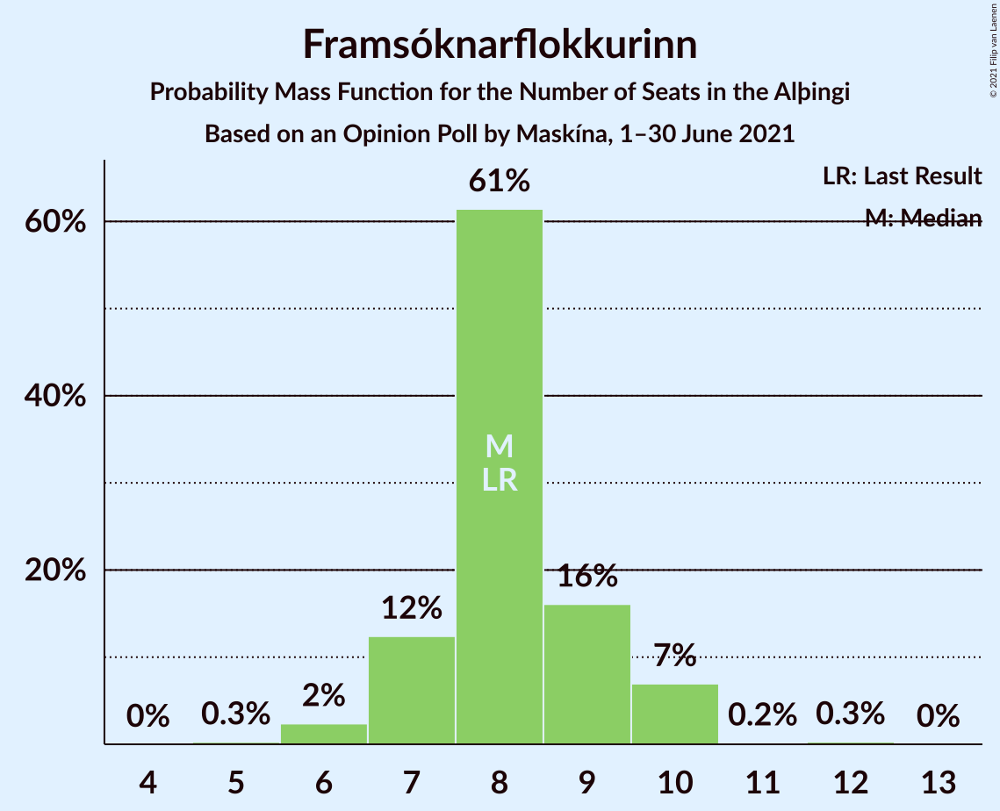
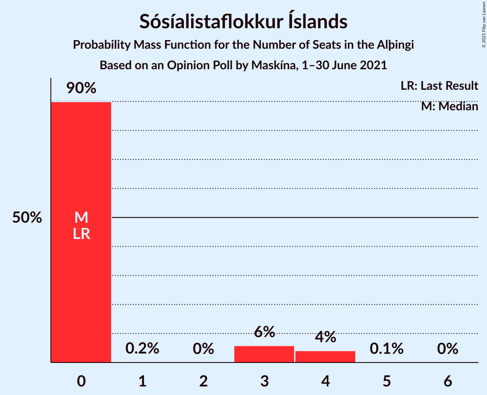

# Opinion Poll by Maskína, 1–30 June 2021

<a href="#voting-intentions">Voting Intentions</a> | <a href="#seats">Seats</a> | <a href="#coalitions">Coalitions</a> | <a href="#technical-information">Technical Information</a>

## Voting Intentions

### Confidence Intervals

| Party | Last Result | Poll Result | 80% Confidence Interval | 90% Confidence Interval | 95% Confidence Interval | 99% Confidence Interval |
|:-----:|:-----------:|:-----------:|:-----------------------:|:-----------------------:|:-----------------------:|:-----------------------:|
| Sjálfstæðisflokkurinn | 25.2% | 23.8% | 22.0–25.7% |21.5–26.2% |21.1–26.7% |20.3–27.6% |
| Vinstrihreyfingin – grænt framboð | 16.9% | 15.0% | 13.6–16.7% |13.2–17.1% |12.8–17.5% |12.1–18.4% |
| Samfylkingin | 12.1% | 12.4% | 11.1–13.9% |10.7–14.4% |10.4–14.8% |9.8–15.5% |
| Viðreisn | 6.7% | 12.3% | 11.0–13.8% |10.6–14.3% |10.3–14.6% |9.7–15.4% |
| Píratar | 9.2% | 11.6% | 10.3–13.1% |10.0–13.5% |9.6–13.9% |9.1–14.6% |
| Framsóknarflokkurinn | 10.7% | 11.4% | 10.1–12.9% |9.7–13.3% |9.4–13.7% |8.9–14.4% |
| Miðflokkurinn | 10.9% | 5.0% | 4.2–6.1% |3.9–6.4% |3.7–6.7% |3.4–7.2% |
| Sósíalistaflokkur Íslands | 0.0% | 4.3% | 3.6–5.3% |3.3–5.6% |3.2–5.9% |2.8–6.4% |
| Flokkur fólksins | 6.9% | 4.2% | 3.5–5.2% |3.2–5.5% |3.1–5.7% |2.7–6.3% |

*Note:* The poll result column reflects the actual value used in the calculations. Published results may vary slightly, and in addition be rounded to fewer digits.

## Seats

### Confidence Intervals

| Party | Last Result | Median | 80% Confidence Interval | 90% Confidence Interval | 95% Confidence Interval | 99% Confidence Interval |
|:-----:|:-----------:|:------:|:-----------------------:|:-----------------------:|:-----------------------:|:-----------------------:|
| <a href="#sjálfstæðisflokkurinn">Sjálfstæðisflokkurinn</a> | 16 | 17 | 16–18 |15–18 |15–19 |14–20 |
| <a href="#vinstrihreyfingin-–-grænt-framboð">Vinstrihreyfingin – grænt framboð</a> | 11 | 10 | 10–11 |9–12 |9–12 |8–12 |
| <a href="#samfylkingin">Samfylkingin</a> | 7 | 8 | 7–9 |7–9 |7–10 |6–10 |
| <a href="#viðreisn">Viðreisn</a> | 4 | 8 | 7–9 |7–10 |7–10 |6–10 |
| <a href="#píratar">Píratar</a> | 6 | 8 | 7–9 |7–9 |6–9 |6–10 |
| <a href="#framsóknarflokkurinn">Framsóknarflokkurinn</a> | 8 | 8 | 7–9 |7–10 |6–10 |6–10 |
| <a href="#miðflokkurinn">Miðflokkurinn</a> | 7 | 3 | 1–4 |0–4 |0–4 |0–4 |
| <a href="#sósíalistaflokkur-íslands">Sósíalistaflokkur Íslands</a> | 0 | 0 | 0–1 |0–3 |0–4 |0–4 |
| <a href="#flokkur-fólksins">Flokkur fólksins</a> | 4 | 0 | 0–3 |0–3 |0–3 |0–4 |

### Sjálfstæðisflokkurinn

*For a full overview of the results for this party, see the [Sjálfstæðisflokkurinn](party-sjálfstæðisflokkurinn.html) page.*

| Number of Seats | Probability | Accumulated | Special Marks |
|:---------------:|:-----------:|:-----------:|:-------------:|
| 13 | 0.2% | 100% |  |
| 14 | 2% | 99.8% |  |
| 15 | 7% | 98% |  |
| 16 | 26% | 91% | Last Result |
| 17 | 37% | 65% | Median |
| 18 | 25% | 28% |  |
| 19 | 2% | 3% |  |
| 20 | 0.4% | 0.5% |  |
| 21 | 0.1% | 0.1% |  |
| 22 | 0% | 0% |  |

### Vinstrihreyfingin – grænt framboð

*For a full overview of the results for this party, see the [Vinstrihreyfingin – grænt framboð](party-vinstrihreyfingin–græntframboð.html) page.*

| Number of Seats | Probability | Accumulated | Special Marks |
|:---------------:|:-----------:|:-----------:|:-------------:|
| 8 | 2% | 100% |  |
| 9 | 4% | 98% |  |
| 10 | 68% | 95% | Median |
| 11 | 18% | 27% | Last Result |
| 12 | 9% | 9% |  |
| 13 | 0.2% | 0.2% |  |
| 14 | 0% | 0% |  |

### Samfylkingin

*For a full overview of the results for this party, see the [Samfylkingin](party-samfylkingin.html) page.*

| Number of Seats | Probability | Accumulated | Special Marks |
|:---------------:|:-----------:|:-----------:|:-------------:|
| 6 | 0.7% | 100% |  |
| 7 | 10% | 99.3% | Last Result |
| 8 | 49% | 90% | Median |
| 9 | 36% | 41% |  |
| 10 | 4% | 5% |  |
| 11 | 0.4% | 0.4% |  |
| 12 | 0% | 0% |  |

### Viðreisn

*For a full overview of the results for this party, see the [Viðreisn](party-viðreisn.html) page.*

| Number of Seats | Probability | Accumulated | Special Marks |
|:---------------:|:-----------:|:-----------:|:-------------:|
| 4 | 0% | 100% | Last Result |
| 5 | 0% | 100% |  |
| 6 | 2% | 100% |  |
| 7 | 11% | 98% |  |
| 8 | 63% | 87% | Median |
| 9 | 18% | 24% |  |
| 10 | 5% | 6% |  |
| 11 | 0.4% | 0.5% |  |
| 12 | 0% | 0% |  |

### Píratar

*For a full overview of the results for this party, see the [Píratar](party-píratar.html) page.*

| Number of Seats | Probability | Accumulated | Special Marks |
|:---------------:|:-----------:|:-----------:|:-------------:|
| 5 | 0.1% | 100% |  |
| 6 | 2% | 99.9% | Last Result |
| 7 | 31% | 97% |  |
| 8 | 26% | 67% | Median |
| 9 | 39% | 41% |  |
| 10 | 2% | 2% |  |
| 11 | 0.1% | 0.1% |  |
| 12 | 0% | 0% |  |

### Framsóknarflokkurinn

*For a full overview of the results for this party, see the [Framsóknarflokkurinn](party-framsóknarflokkurinn.html) page.*

| Number of Seats | Probability | Accumulated | Special Marks |
|:---------------:|:-----------:|:-----------:|:-------------:|
| 5 | 0.3% | 100% |  |
| 6 | 2% | 99.7% |  |
| 7 | 12% | 97% |  |
| 8 | 61% | 85% | Last Result, Median |
| 9 | 16% | 23% |  |
| 10 | 7% | 7% |  |
| 11 | 0.2% | 0.4% |  |
| 12 | 0.3% | 0.3% |  |
| 13 | 0% | 0% |  |

### Miðflokkurinn

*For a full overview of the results for this party, see the [Miðflokkurinn](party-miðflokkurinn.html) page.*

| Number of Seats | Probability | Accumulated | Special Marks |
|:---------------:|:-----------:|:-----------:|:-------------:|
| 0 | 6% | 100% |  |
| 1 | 30% | 94% |  |
| 2 | 0.1% | 64% |  |
| 3 | 47% | 64% | Median |
| 4 | 17% | 17% |  |
| 5 | 0.4% | 0.4% |  |
| 6 | 0% | 0% |  |
| 7 | 0% | 0% | Last Result |

### Sósíalistaflokkur Íslands

*For a full overview of the results for this party, see the [Sósíalistaflokkur Íslands](party-sósíalistaflokkuríslands.html) page.*

| Number of Seats | Probability | Accumulated | Special Marks |
|:---------------:|:-----------:|:-----------:|:-------------:|
| 0 | 90% | 100% | Last Result, Median |
| 1 | 0.2% | 10% |  |
| 2 | 0% | 10% |  |
| 3 | 6% | 10% |  |
| 4 | 4% | 4% |  |
| 5 | 0.1% | 0.1% |  |
| 6 | 0% | 0% |  |

### Flokkur fólksins

*For a full overview of the results for this party, see the [Flokkur fólksins](party-flokkurfólksins.html) page.*

| Number of Seats | Probability | Accumulated | Special Marks |
|:---------------:|:-----------:|:-----------:|:-------------:|
| 0 | 87% | 100% | Median |
| 1 | 0.1% | 13% |  |
| 2 | 0% | 13% |  |
| 3 | 12% | 13% |  |
| 4 | 1.2% | 1.2% | Last Result |
| 5 | 0% | 0% |  |

## Coalitions

### Confidence Intervals

| Coalition | Last Result | Median | Majority? | 80% Confidence Interval | 90% Confidence Interval | 95% Confidence Interval | 99% Confidence Interval |
|:---------:|:-----------:|:------:|:---------:|:-----------------------:|:-----------------------:|:-----------------------:|:-----------------------:|
| Sjálfstæðisflokkurinn – Vinstrihreyfingin – grænt framboð – Framsóknarflokkurinn | 35 | 35 | 99.4% | 33–37 | 33–38 | 33–39 | 31–39 |
| Vinstrihreyfingin – grænt framboð – Samfylkingin – Viðreisn – Píratar | 28 | 35 | 97% | 34–36 | 32–37 | 31–38 | 30–39 |
| Vinstrihreyfingin – grænt framboð – Samfylkingin – Framsóknarflokkurinn – Miðflokkurinn | 33 | 29 | 2% | 28–30 | 27–31 | 27–31 | 26–33 |
| Sjálfstæðisflokkurinn – Framsóknarflokkurinn – Miðflokkurinn | 31 | 28 | 0.1% | 25–29 | 25–29 | 24–30 | 23–31 |
| Vinstrihreyfingin – grænt framboð – Samfylkingin – Framsóknarflokkurinn | 26 | 26 | 0.1% | 26–29 | 25–29 | 24–30 | 23–31 |
| Sjálfstæðisflokkurinn – Vinstrihreyfingin – grænt framboð | 27 | 27 | 0% | 26–28 | 25–29 | 25–29 | 23–31 |
| Vinstrihreyfingin – grænt framboð – Samfylkingin – Píratar | 24 | 27 | 0% | 25–28 | 25–29 | 23–29 | 23–30 |
| Sjálfstæðisflokkurinn – Framsóknarflokkurinn | 24 | 25 | 0% | 23–27 | 23–27 | 23–28 | 22–28 |
| Sjálfstæðisflokkurinn – Viðreisn | 20 | 25 | 0% | 24–26 | 23–27 | 23–28 | 22–29 |
| Sjálfstæðisflokkurinn – Samfylkingin | 23 | 25 | 0% | 24–27 | 23–27 | 23–27 | 22–28 |
| Vinstrihreyfingin – grænt framboð – Framsóknarflokkurinn – Miðflokkurinn | 26 | 21 | 0% | 20–22 | 19–23 | 18–23 | 18–24 |
| Vinstrihreyfingin – grænt framboð – Samfylkingin – Miðflokkurinn | 25 | 21 | 0% | 19–23 | 18–23 | 18–23 | 18–24 |
| Sjálfstæðisflokkurinn – Miðflokkurinn | 23 | 20 | 0% | 17–21 | 16–21 | 16–22 | 15–22 |
| Vinstrihreyfingin – grænt framboð – Framsóknarflokkurinn | 19 | 18 | 0% | 17–20 | 17–21 | 17–21 | 15–22 |
| Vinstrihreyfingin – grænt framboð – Samfylkingin | 18 | 19 | 0% | 18–20 | 17–20 | 17–21 | 16–22 |
| Vinstrihreyfingin – grænt framboð – Píratar | 17 | 19 | 0% | 17–19 | 16–20 | 16–20 | 15–21 |
| Vinstrihreyfingin – grænt framboð – Miðflokkurinn | 18 | 13 | 0% | 11–14 | 11–15 | 10–15 | 10–16 |

### Sjálfstæðisflokkurinn – Vinstrihreyfingin – grænt framboð – Framsóknarflokkurinn

| Number of Seats | Probability | Accumulated | Special Marks |
|:---------------:|:-----------:|:-----------:|:-------------:|
| 30 | 0.1% | 100% |  |
| 31 | 0.5% | 99.9% |  |
| 32 | 0.9% | 99.4% | Majority |
| 33 | 12% | 98% |  |
| 34 | 6% | 86% |  |
| 35 | 41% | 81% | Last Result, Median |
| 36 | 23% | 39% |  |
| 37 | 11% | 17% |  |
| 38 | 3% | 6% |  |
| 39 | 2% | 3% |  |
| 40 | 0.4% | 0.4% |  |
| 41 | 0% | 0% |  |

### Vinstrihreyfingin – grænt framboð – Samfylkingin – Viðreisn – Píratar

| Number of Seats | Probability | Accumulated | Special Marks |
|:---------------:|:-----------:|:-----------:|:-------------:|
| 28 | 0% | 100% | Last Result |
| 29 | 0.2% | 100% |  |
| 30 | 2% | 99.8% |  |
| 31 | 1.0% | 98% |  |
| 32 | 2% | 97% | Majority |
| 33 | 4% | 95% |  |
| 34 | 23% | 91% | Median |
| 35 | 43% | 68% |  |
| 36 | 16% | 24% |  |
| 37 | 4% | 8% |  |
| 38 | 2% | 4% |  |
| 39 | 2% | 2% |  |
| 40 | 0% | 0% |  |

### Vinstrihreyfingin – grænt framboð – Samfylkingin – Framsóknarflokkurinn – Miðflokkurinn

| Number of Seats | Probability | Accumulated | Special Marks |
|:---------------:|:-----------:|:-----------:|:-------------:|
| 25 | 0.4% | 100% |  |
| 26 | 2% | 99.5% |  |
| 27 | 7% | 98% |  |
| 28 | 11% | 90% |  |
| 29 | 43% | 80% | Median |
| 30 | 27% | 37% |  |
| 31 | 7% | 10% |  |
| 32 | 1.5% | 2% | Majority |
| 33 | 0.5% | 0.8% | Last Result |
| 34 | 0.2% | 0.2% |  |
| 35 | 0% | 0% |  |

### Sjálfstæðisflokkurinn – Framsóknarflokkurinn – Miðflokkurinn

| Number of Seats | Probability | Accumulated | Special Marks |
|:---------------:|:-----------:|:-----------:|:-------------:|
| 22 | 0.1% | 100% |  |
| 23 | 0.9% | 99.9% |  |
| 24 | 3% | 99.0% |  |
| 25 | 11% | 96% |  |
| 26 | 10% | 85% |  |
| 27 | 16% | 75% |  |
| 28 | 38% | 59% | Median |
| 29 | 17% | 21% |  |
| 30 | 4% | 4% |  |
| 31 | 0.6% | 0.7% | Last Result |
| 32 | 0.1% | 0.1% | Majority |
| 33 | 0% | 0% |  |

### Vinstrihreyfingin – grænt framboð – Samfylkingin – Framsóknarflokkurinn

| Number of Seats | Probability | Accumulated | Special Marks |
|:---------------:|:-----------:|:-----------:|:-------------:|
| 22 | 0.2% | 100% |  |
| 23 | 0.5% | 99.8% |  |
| 24 | 2% | 99.3% |  |
| 25 | 4% | 97% |  |
| 26 | 45% | 94% | Last Result, Median |
| 27 | 26% | 49% |  |
| 28 | 11% | 23% |  |
| 29 | 9% | 12% |  |
| 30 | 2% | 3% |  |
| 31 | 0.6% | 0.7% |  |
| 32 | 0.1% | 0.1% | Majority |
| 33 | 0% | 0% |  |

### Sjálfstæðisflokkurinn – Vinstrihreyfingin – grænt framboð

| Number of Seats | Probability | Accumulated | Special Marks |
|:---------------:|:-----------:|:-----------:|:-------------:|
| 23 | 0.5% | 100% |  |
| 24 | 0.9% | 99.4% |  |
| 25 | 6% | 98% |  |
| 26 | 15% | 92% |  |
| 27 | 42% | 78% | Last Result, Median |
| 28 | 27% | 36% |  |
| 29 | 7% | 9% |  |
| 30 | 1.3% | 2% |  |
| 31 | 0.5% | 0.6% |  |
| 32 | 0% | 0% | Majority |

### Vinstrihreyfingin – grænt framboð – Samfylkingin – Píratar

| Number of Seats | Probability | Accumulated | Special Marks |
|:---------------:|:-----------:|:-----------:|:-------------:|
| 22 | 0.1% | 100% |  |
| 23 | 3% | 99.8% |  |
| 24 | 2% | 97% | Last Result |
| 25 | 8% | 95% |  |
| 26 | 23% | 87% | Median |
| 27 | 45% | 64% |  |
| 28 | 13% | 19% |  |
| 29 | 4% | 6% |  |
| 30 | 2% | 2% |  |
| 31 | 0% | 0.1% |  |
| 32 | 0% | 0% | Majority |

### Sjálfstæðisflokkurinn – Framsóknarflokkurinn

| Number of Seats | Probability | Accumulated | Special Marks |
|:---------------:|:-----------:|:-----------:|:-------------:|
| 20 | 0% | 100% |  |
| 21 | 0.4% | 99.9% |  |
| 22 | 1.4% | 99.6% |  |
| 23 | 13% | 98% |  |
| 24 | 17% | 85% | Last Result |
| 25 | 35% | 68% | Median |
| 26 | 20% | 33% |  |
| 27 | 9% | 13% |  |
| 28 | 3% | 3% |  |
| 29 | 0.4% | 0.4% |  |
| 30 | 0% | 0% |  |

### Sjálfstæðisflokkurinn – Viðreisn

| Number of Seats | Probability | Accumulated | Special Marks |
|:---------------:|:-----------:|:-----------:|:-------------:|
| 20 | 0.1% | 100% | Last Result |
| 21 | 0.2% | 99.9% |  |
| 22 | 2% | 99.7% |  |
| 23 | 6% | 98% |  |
| 24 | 22% | 92% |  |
| 25 | 41% | 69% | Median |
| 26 | 20% | 29% |  |
| 27 | 5% | 9% |  |
| 28 | 4% | 4% |  |
| 29 | 0.5% | 0.5% |  |
| 30 | 0% | 0% |  |

### Sjálfstæðisflokkurinn – Samfylkingin

| Number of Seats | Probability | Accumulated | Special Marks |
|:---------------:|:-----------:|:-----------:|:-------------:|
| 20 | 0.1% | 100% |  |
| 21 | 0.3% | 99.9% |  |
| 22 | 2% | 99.7% |  |
| 23 | 6% | 98% | Last Result |
| 24 | 14% | 92% |  |
| 25 | 46% | 78% | Median |
| 26 | 10% | 31% |  |
| 27 | 20% | 21% |  |
| 28 | 0.9% | 1.2% |  |
| 29 | 0.2% | 0.3% |  |
| 30 | 0% | 0% |  |

### Vinstrihreyfingin – grænt framboð – Framsóknarflokkurinn – Miðflokkurinn

| Number of Seats | Probability | Accumulated | Special Marks |
|:---------------:|:-----------:|:-----------:|:-------------:|
| 16 | 0.1% | 100% |  |
| 17 | 0.4% | 99.9% |  |
| 18 | 3% | 99.6% |  |
| 19 | 6% | 97% |  |
| 20 | 20% | 91% |  |
| 21 | 57% | 72% | Median |
| 22 | 8% | 14% |  |
| 23 | 4% | 6% |  |
| 24 | 2% | 2% |  |
| 25 | 0.3% | 0.3% |  |
| 26 | 0% | 0% | Last Result |

### Vinstrihreyfingin – grænt framboð – Samfylkingin – Miðflokkurinn

| Number of Seats | Probability | Accumulated | Special Marks |
|:---------------:|:-----------:|:-----------:|:-------------:|
| 17 | 0.3% | 100% |  |
| 18 | 5% | 99.7% |  |
| 19 | 5% | 94% |  |
| 20 | 20% | 90% |  |
| 21 | 37% | 69% | Median |
| 22 | 16% | 32% |  |
| 23 | 14% | 16% |  |
| 24 | 1.3% | 2% |  |
| 25 | 0.2% | 0.3% | Last Result |
| 26 | 0% | 0% |  |

### Sjálfstæðisflokkurinn – Miðflokkurinn

| Number of Seats | Probability | Accumulated | Special Marks |
|:---------------:|:-----------:|:-----------:|:-------------:|
| 14 | 0.3% | 100% |  |
| 15 | 0.9% | 99.7% |  |
| 16 | 4% | 98.8% |  |
| 17 | 16% | 95% |  |
| 18 | 9% | 79% |  |
| 19 | 11% | 70% |  |
| 20 | 41% | 60% | Median |
| 21 | 15% | 19% |  |
| 22 | 4% | 4% |  |
| 23 | 0.3% | 0.3% | Last Result |
| 24 | 0% | 0% |  |

### Vinstrihreyfingin – grænt framboð – Framsóknarflokkurinn

| Number of Seats | Probability | Accumulated | Special Marks |
|:---------------:|:-----------:|:-----------:|:-------------:|
| 15 | 0.7% | 100% |  |
| 16 | 2% | 99.3% |  |
| 17 | 12% | 98% |  |
| 18 | 50% | 86% | Median |
| 19 | 18% | 36% | Last Result |
| 20 | 12% | 18% |  |
| 21 | 5% | 6% |  |
| 22 | 0.2% | 0.6% |  |
| 23 | 0.4% | 0.4% |  |
| 24 | 0% | 0% |  |

### Vinstrihreyfingin – grænt framboð – Samfylkingin

| Number of Seats | Probability | Accumulated | Special Marks |
|:---------------:|:-----------:|:-----------:|:-------------:|
| 15 | 0.1% | 100% |  |
| 16 | 2% | 99.9% |  |
| 17 | 7% | 98% |  |
| 18 | 35% | 91% | Last Result, Median |
| 19 | 41% | 56% |  |
| 20 | 11% | 15% |  |
| 21 | 3% | 4% |  |
| 22 | 0.7% | 0.7% |  |
| 23 | 0% | 0% |  |

### Vinstrihreyfingin – grænt framboð – Píratar

| Number of Seats | Probability | Accumulated | Special Marks |
|:---------------:|:-----------:|:-----------:|:-------------:|
| 14 | 0.1% | 100% |  |
| 15 | 1.4% | 99.9% |  |
| 16 | 4% | 98% |  |
| 17 | 21% | 95% | Last Result |
| 18 | 14% | 74% | Median |
| 19 | 54% | 60% |  |
| 20 | 4% | 6% |  |
| 21 | 2% | 2% |  |
| 22 | 0.2% | 0.3% |  |
| 23 | 0% | 0% |  |

### Vinstrihreyfingin – grænt framboð – Miðflokkurinn

| Number of Seats | Probability | Accumulated | Special Marks |
|:---------------:|:-----------:|:-----------:|:-------------:|
| 9 | 0.4% | 100% |  |
| 10 | 2% | 99.5% |  |
| 11 | 17% | 97% |  |
| 12 | 13% | 80% |  |
| 13 | 48% | 67% | Median |
| 14 | 13% | 19% |  |
| 15 | 4% | 6% |  |
| 16 | 1.3% | 1.4% |  |
| 17 | 0.1% | 0.1% |  |
| 18 | 0% | 0% | Last Result |

## Technical Information

### Opinion Poll

+ **Polling firm:** Maskína
+ **Commissioner(s):** —
+ **Fieldwork period:** 1–30 June 2021

### Calculations

+ **Sample size:** 879
+ **Simulations done:** 1,048,576
+ **Error estimate:** 2.12%

