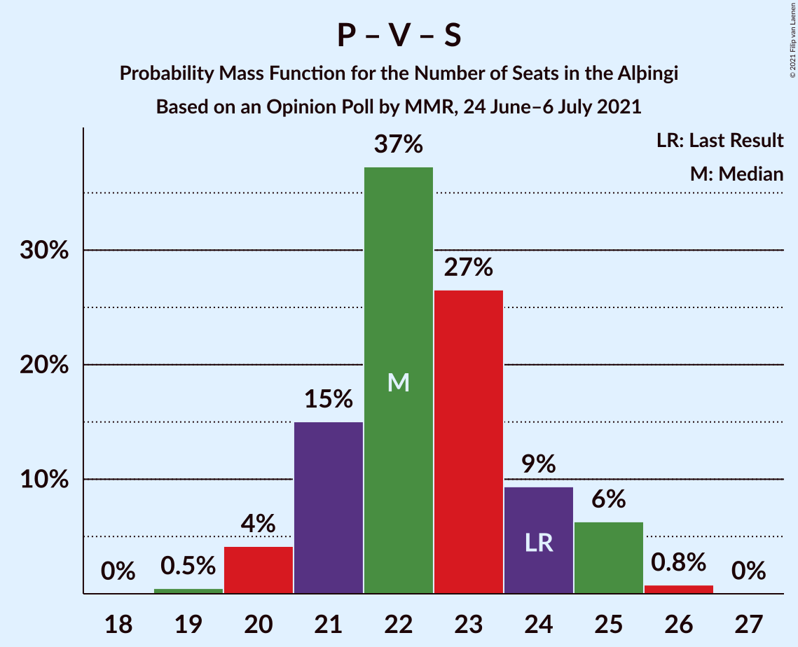
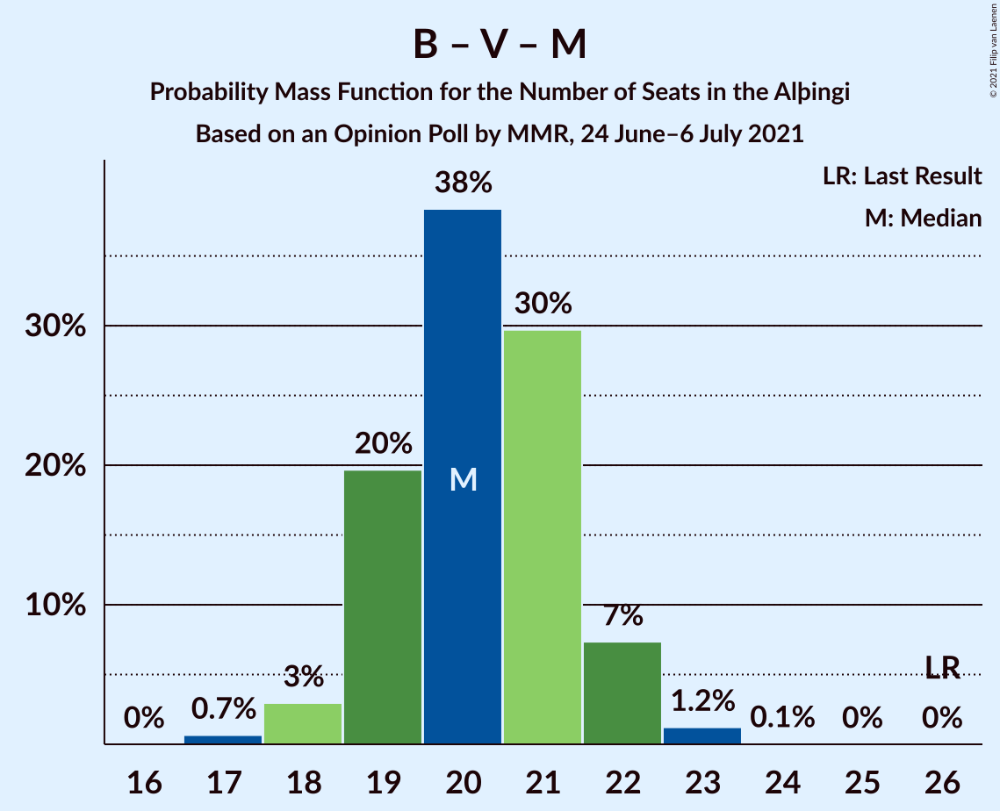

# Opinion Poll by MMR, 24 June–6 July 2021

<a href="#voting-intentions">Voting Intentions</a> | <a href="#seats">Seats</a> | <a href="#coalitions">Coalitions</a> | <a href="#technical-information">Technical Information</a>

## Voting Intentions

### Confidence Intervals

| Party | Last Result | Poll Result | 80% Confidence Interval | 90% Confidence Interval | 95% Confidence Interval | 99% Confidence Interval |
|:-----:|:-----------:|:-----------:|:-----------------------:|:-----------------------:|:-----------------------:|:-----------------------:|
| Sjálfstæðisflokkurinn | 25.2% | 25.4% | 24.2–26.6% |23.8–27.0% |23.5–27.3% |23.0–27.9% |
| Framsóknarflokkurinn | 10.7% | 12.3% | 11.4–13.3% |11.2–13.6% |10.9–13.8% |10.5–14.3% |
| Píratar | 9.2% | 12.2% | 11.3–13.2% |11.1–13.4% |10.9–13.7% |10.4–14.2% |
| Vinstrihreyfingin – grænt framboð | 16.9% | 11.9% | 11.0–12.9% |10.8–13.1% |10.6–13.4% |10.2–13.9% |
| Samfylkingin | 12.1% | 10.6% | 9.8–11.5% |9.5–11.8% |9.3–12.0% |8.9–12.5% |
| Viðreisn | 6.7% | 9.1% | 8.3–10.0% |8.1–10.2% |7.9–10.4% |7.6–10.9% |
| Miðflokkurinn | 10.9% | 6.6% | 6.0–7.4% |5.8–7.6% |5.6–7.8% |5.3–8.2% |
| Flokkur fólksins | 6.9% | 5.5% | 4.9–6.2% |4.7–6.4% |4.6–6.6% |4.3–6.9% |
| Sósíalistaflokkur Íslands | 0.0% | 5.3% | 4.7–6.0% |4.5–6.2% |4.4–6.4% |4.1–6.7% |

*Note:* The poll result column reflects the actual value used in the calculations. Published results may vary slightly, and in addition be rounded to fewer digits.

## Seats

### Confidence Intervals

| Party | Last Result | Median | 80% Confidence Interval | 90% Confidence Interval | 95% Confidence Interval | 99% Confidence Interval |
|:-----:|:-----------:|:------:|:-----------------------:|:-----------------------:|:-----------------------:|:-----------------------:|
| <a href="#sjálfstæðisflokkurinn">Sjálfstæðisflokkurinn</a> | 16 | 18 | 18–19 |17–19 |16–19 |15–20 |
| <a href="#framsóknarflokkurinn">Framsóknarflokkurinn</a> | 8 | 8 | 8–9 |8–9 |8–10 |8–10 |
| <a href="#píratar">Píratar</a> | 6 | 8 | 7–9 |7–9 |7–9 |6–10 |
| <a href="#vinstrihreyfingin-–-grænt-framboð">Vinstrihreyfingin – grænt framboð</a> | 11 | 8 | 7–9 |7–9 |6–9 |6–9 |
| <a href="#samfylkingin">Samfylkingin</a> | 7 | 7 | 6–7 |6–8 |6–8 |5–8 |
| <a href="#viðreisn">Viðreisn</a> | 4 | 6 | 5–6 |5–6 |5–7 |4–7 |
| <a href="#miðflokkurinn">Miðflokkurinn</a> | 7 | 4 | 4–5 |3–5 |3–5 |3–5 |
| <a href="#flokkur-fólksins">Flokkur fólksins</a> | 4 | 3 | 0–4 |0–4 |0–4 |0–4 |
| <a href="#sósíalistaflokkur-íslands">Sósíalistaflokkur Íslands</a> | 0 | 3 | 0–3 |0–3 |0–4 |0–4 |

### Sjálfstæðisflokkurinn

*For a full overview of the results for this party, see the [Sjálfstæðisflokkurinn](party-sjálfstæðisflokkurinn.html) page.*

| Number of Seats | Probability | Accumulated | Special Marks |
|:---------------:|:-----------:|:-----------:|:-------------:|
| 15 | 0.7% | 100% |  |
| 16 | 2% | 99.3% | Last Result |
| 17 | 6% | 97% |  |
| 18 | 52% | 91% | Median |
| 19 | 38% | 39% |  |
| 20 | 0.8% | 0.9% |  |
| 21 | 0% | 0% |  |

### Framsóknarflokkurinn

*For a full overview of the results for this party, see the [Framsóknarflokkurinn](party-framsóknarflokkurinn.html) page.*

| Number of Seats | Probability | Accumulated | Special Marks |
|:---------------:|:-----------:|:-----------:|:-------------:|
| 7 | 0.2% | 100% |  |
| 8 | 73% | 99.8% | Last Result, Median |
| 9 | 22% | 27% |  |
| 10 | 4% | 5% |  |
| 11 | 0.5% | 0.5% |  |
| 12 | 0% | 0% |  |

### Píratar

*For a full overview of the results for this party, see the [Píratar](party-píratar.html) page.*

| Number of Seats | Probability | Accumulated | Special Marks |
|:---------------:|:-----------:|:-----------:|:-------------:|
| 6 | 2% | 100% | Last Result |
| 7 | 13% | 98% |  |
| 8 | 69% | 85% | Median |
| 9 | 15% | 16% |  |
| 10 | 1.0% | 1.0% |  |
| 11 | 0% | 0% |  |

### Vinstrihreyfingin – grænt framboð

*For a full overview of the results for this party, see the [Vinstrihreyfingin – grænt framboð](party-vinstrihreyfingin–græntframboð.html) page.*

| Number of Seats | Probability | Accumulated | Special Marks |
|:---------------:|:-----------:|:-----------:|:-------------:|
| 6 | 3% | 100% |  |
| 7 | 24% | 97% |  |
| 8 | 61% | 73% | Median |
| 9 | 12% | 12% |  |
| 10 | 0.4% | 0.4% |  |
| 11 | 0% | 0% | Last Result |

### Samfylkingin

*For a full overview of the results for this party, see the [Samfylkingin](party-samfylkingin.html) page.*

| Number of Seats | Probability | Accumulated | Special Marks |
|:---------------:|:-----------:|:-----------:|:-------------:|
| 4 | 0.1% | 100% |  |
| 5 | 1.3% | 99.9% |  |
| 6 | 46% | 98.6% |  |
| 7 | 45% | 53% | Last Result, Median |
| 8 | 8% | 8% |  |
| 9 | 0.1% | 0.1% |  |
| 10 | 0% | 0% |  |

### Viðreisn

*For a full overview of the results for this party, see the [Viðreisn](party-viðreisn.html) page.*

| Number of Seats | Probability | Accumulated | Special Marks |
|:---------------:|:-----------:|:-----------:|:-------------:|
| 4 | 2% | 100% | Last Result |
| 5 | 47% | 98% |  |
| 6 | 47% | 51% | Median |
| 7 | 4% | 4% |  |
| 8 | 0% | 0% |  |

### Miðflokkurinn

*For a full overview of the results for this party, see the [Miðflokkurinn](party-miðflokkurinn.html) page.*

| Number of Seats | Probability | Accumulated | Special Marks |
|:---------------:|:-----------:|:-----------:|:-------------:|
| 1 | 0.1% | 100% |  |
| 2 | 0% | 99.9% |  |
| 3 | 8% | 99.9% |  |
| 4 | 78% | 92% | Median |
| 5 | 14% | 14% |  |
| 6 | 0.1% | 0.1% |  |
| 7 | 0% | 0% | Last Result |

### Flokkur fólksins

*For a full overview of the results for this party, see the [Flokkur fólksins](party-flokkurfólksins.html) page.*

| Number of Seats | Probability | Accumulated | Special Marks |
|:---------------:|:-----------:|:-----------:|:-------------:|
| 0 | 16% | 100% |  |
| 1 | 0% | 84% |  |
| 2 | 0% | 84% |  |
| 3 | 69% | 84% | Median |
| 4 | 15% | 15% | Last Result |
| 5 | 0% | 0% |  |

### Sósíalistaflokkur Íslands

*For a full overview of the results for this party, see the [Sósíalistaflokkur Íslands](party-sósíalistaflokkuríslands.html) page.*

| Number of Seats | Probability | Accumulated | Special Marks |
|:---------------:|:-----------:|:-----------:|:-------------:|
| 0 | 44% | 100% | Last Result |
| 1 | 0% | 56% |  |
| 2 | 0.2% | 56% |  |
| 3 | 51% | 56% | Median |
| 4 | 5% | 5% |  |
| 5 | 0% | 0% |  |

## Coalitions

### Confidence Intervals

| Coalition | Last Result | Median | Majority? | 80% Confidence Interval | 90% Confidence Interval | 95% Confidence Interval | 99% Confidence Interval |
|:---------:|:-----------:|:------:|:---------:|:-----------------------:|:-----------------------:|:-----------------------:|:-----------------------:|
| Sjálfstæðisflokkurinn – Framsóknarflokkurinn – Vinstrihreyfingin – grænt framboð | 35 | 34 | 99.4% | 34–36 | 33–36 | 33–36 | 31–37 |
| Sjálfstæðisflokkurinn – Framsóknarflokkurinn – Miðflokkurinn | 31 | 31 | 18% | 30–32 | 29–32 | 29–32 | 28–33 |
| Píratar – Vinstrihreyfingin – grænt framboð – Samfylkingin – Viðreisn | 28 | 28 | 2% | 26–30 | 26–31 | 25–31 | 25–32 |
| Framsóknarflokkurinn – Vinstrihreyfingin – grænt framboð – Samfylkingin – Miðflokkurinn | 33 | 27 | 0% | 25–28 | 25–29 | 24–29 | 24–30 |
| Sjálfstæðisflokkurinn – Framsóknarflokkurinn | 24 | 27 | 0% | 26–27 | 25–28 | 25–28 | 24–29 |
| Sjálfstæðisflokkurinn – Vinstrihreyfingin – grænt framboð | 27 | 26 | 0% | 25–27 | 25–27 | 24–28 | 23–28 |
| Sjálfstæðisflokkurinn – Samfylkingin | 23 | 25 | 0% | 24–26 | 23–26 | 23–27 | 22–27 |
| Sjálfstæðisflokkurinn – Viðreisn | 20 | 24 | 0% | 23–25 | 22–25 | 22–25 | 21–26 |
| Framsóknarflokkurinn – Vinstrihreyfingin – grænt framboð – Samfylkingin | 26 | 23 | 0% | 21–24 | 21–25 | 21–25 | 20–26 |
| Píratar – Vinstrihreyfingin – grænt framboð – Samfylkingin | 24 | 22 | 0% | 21–24 | 21–25 | 20–25 | 20–26 |
| Sjálfstæðisflokkurinn – Miðflokkurinn | 23 | 22 | 0% | 21–23 | 21–24 | 20–24 | 19–24 |
| Framsóknarflokkurinn – Vinstrihreyfingin – grænt framboð – Miðflokkurinn | 26 | 20 | 0% | 19–21 | 19–22 | 18–22 | 17–23 |
| Vinstrihreyfingin – grænt framboð – Samfylkingin – Miðflokkurinn | 25 | 19 | 0% | 17–20 | 17–20 | 16–21 | 16–21 |
| Framsóknarflokkurinn – Vinstrihreyfingin – grænt framboð | 19 | 16 | 0% | 15–17 | 15–18 | 14–18 | 14–19 |
| Píratar – Vinstrihreyfingin – grænt framboð | 17 | 16 | 0% | 15–17 | 14–17 | 14–18 | 13–18 |
| Vinstrihreyfingin – grænt framboð – Samfylkingin | 18 | 14 | 0% | 13–16 | 13–16 | 13–16 | 12–17 |
| Vinstrihreyfingin – grænt framboð – Miðflokkurinn | 18 | 12 | 0% | 11–13 | 11–13 | 10–13 | 9–14 |

### Sjálfstæðisflokkurinn – Framsóknarflokkurinn – Vinstrihreyfingin – grænt framboð

| Number of Seats | Probability | Accumulated | Special Marks |
|:---------------:|:-----------:|:-----------:|:-------------:|
| 30 | 0.1% | 100% |  |
| 31 | 0.5% | 99.9% |  |
| 32 | 1.5% | 99.4% | Majority |
| 33 | 6% | 98% |  |
| 34 | 54% | 92% | Median |
| 35 | 26% | 38% | Last Result |
| 36 | 10% | 12% |  |
| 37 | 2% | 2% |  |
| 38 | 0.2% | 0.2% |  |
| 39 | 0% | 0% |  |

### Sjálfstæðisflokkurinn – Framsóknarflokkurinn – Miðflokkurinn

| Number of Seats | Probability | Accumulated | Special Marks |
|:---------------:|:-----------:|:-----------:|:-------------:|
| 27 | 0.3% | 100% |  |
| 28 | 2% | 99.6% |  |
| 29 | 6% | 98% |  |
| 30 | 34% | 91% | Median |
| 31 | 39% | 57% | Last Result |
| 32 | 16% | 18% | Majority |
| 33 | 2% | 2% |  |
| 34 | 0.1% | 0.2% |  |
| 35 | 0% | 0% |  |

### Píratar – Vinstrihreyfingin – grænt framboð – Samfylkingin – Viðreisn

| Number of Seats | Probability | Accumulated | Special Marks |
|:---------------:|:-----------:|:-----------:|:-------------:|
| 24 | 0.2% | 100% |  |
| 25 | 3% | 99.8% |  |
| 26 | 14% | 97% |  |
| 27 | 28% | 83% |  |
| 28 | 18% | 55% | Last Result |
| 29 | 24% | 38% | Median |
| 30 | 8% | 14% |  |
| 31 | 5% | 7% |  |
| 32 | 2% | 2% | Majority |
| 33 | 0.3% | 0.3% |  |
| 34 | 0% | 0% |  |

### Framsóknarflokkurinn – Vinstrihreyfingin – grænt framboð – Samfylkingin – Miðflokkurinn

| Number of Seats | Probability | Accumulated | Special Marks |
|:---------------:|:-----------:|:-----------:|:-------------:|
| 23 | 0.1% | 100% |  |
| 24 | 3% | 99.9% |  |
| 25 | 14% | 97% |  |
| 26 | 25% | 83% |  |
| 27 | 25% | 58% | Median |
| 28 | 24% | 32% |  |
| 29 | 7% | 8% |  |
| 30 | 1.0% | 1.4% |  |
| 31 | 0.3% | 0.4% |  |
| 32 | 0% | 0% | Majority |
| 33 | 0% | 0% | Last Result |

### Sjálfstæðisflokkurinn – Framsóknarflokkurinn

| Number of Seats | Probability | Accumulated | Special Marks |
|:---------------:|:-----------:|:-----------:|:-------------:|
| 23 | 0.3% | 100% |  |
| 24 | 1.4% | 99.7% | Last Result |
| 25 | 4% | 98% |  |
| 26 | 38% | 94% | Median |
| 27 | 46% | 56% |  |
| 28 | 8% | 10% |  |
| 29 | 1.3% | 2% |  |
| 30 | 0.2% | 0.2% |  |
| 31 | 0% | 0% |  |

### Sjálfstæðisflokkurinn – Vinstrihreyfingin – grænt framboð

| Number of Seats | Probability | Accumulated | Special Marks |
|:---------------:|:-----------:|:-----------:|:-------------:|
| 22 | 0.1% | 100% |  |
| 23 | 0.7% | 99.9% |  |
| 24 | 3% | 99.2% |  |
| 25 | 8% | 96% |  |
| 26 | 68% | 89% | Median |
| 27 | 16% | 21% | Last Result |
| 28 | 4% | 5% |  |
| 29 | 0.3% | 0.3% |  |
| 30 | 0% | 0% |  |

### Sjálfstæðisflokkurinn – Samfylkingin

| Number of Seats | Probability | Accumulated | Special Marks |
|:---------------:|:-----------:|:-----------:|:-------------:|
| 21 | 0.5% | 100% |  |
| 22 | 0.8% | 99.5% |  |
| 23 | 6% | 98.8% | Last Result |
| 24 | 26% | 93% |  |
| 25 | 44% | 67% | Median |
| 26 | 18% | 23% |  |
| 27 | 4% | 5% |  |
| 28 | 0.4% | 0.4% |  |
| 29 | 0% | 0% |  |

### Sjálfstæðisflokkurinn – Viðreisn

| Number of Seats | Probability | Accumulated | Special Marks |
|:---------------:|:-----------:|:-----------:|:-------------:|
| 20 | 0.3% | 100% | Last Result |
| 21 | 1.1% | 99.7% |  |
| 22 | 6% | 98.5% |  |
| 23 | 30% | 93% |  |
| 24 | 39% | 63% | Median |
| 25 | 22% | 24% |  |
| 26 | 1.4% | 2% |  |
| 27 | 0.2% | 0.2% |  |
| 28 | 0% | 0% |  |

### Framsóknarflokkurinn – Vinstrihreyfingin – grænt framboð – Samfylkingin

| Number of Seats | Probability | Accumulated | Special Marks |
|:---------------:|:-----------:|:-----------:|:-------------:|
| 20 | 2% | 100% |  |
| 21 | 13% | 98% |  |
| 22 | 31% | 85% |  |
| 23 | 28% | 54% | Median |
| 24 | 19% | 27% |  |
| 25 | 6% | 7% |  |
| 26 | 0.9% | 1.2% | Last Result |
| 27 | 0.3% | 0.3% |  |
| 28 | 0% | 0% |  |

### Píratar – Vinstrihreyfingin – grænt framboð – Samfylkingin

| Number of Seats | Probability | Accumulated | Special Marks |
|:---------------:|:-----------:|:-----------:|:-------------:|
| 19 | 0.5% | 100% |  |
| 20 | 4% | 99.5% |  |
| 21 | 15% | 95% |  |
| 22 | 37% | 80% |  |
| 23 | 27% | 43% | Median |
| 24 | 9% | 16% | Last Result |
| 25 | 6% | 7% |  |
| 26 | 0.8% | 0.8% |  |
| 27 | 0% | 0% |  |

### Sjálfstæðisflokkurinn – Miðflokkurinn

| Number of Seats | Probability | Accumulated | Special Marks |
|:---------------:|:-----------:|:-----------:|:-------------:|
| 18 | 0.1% | 100% |  |
| 19 | 0.7% | 99.9% |  |
| 20 | 4% | 99.2% |  |
| 21 | 7% | 96% |  |
| 22 | 45% | 88% | Median |
| 23 | 36% | 43% | Last Result |
| 24 | 7% | 7% |  |
| 25 | 0.1% | 0.1% |  |
| 26 | 0% | 0% |  |

### Framsóknarflokkurinn – Vinstrihreyfingin – grænt framboð – Miðflokkurinn

| Number of Seats | Probability | Accumulated | Special Marks |
|:---------------:|:-----------:|:-----------:|:-------------:|
| 17 | 0.7% | 100% |  |
| 18 | 3% | 99.3% |  |
| 19 | 20% | 96% |  |
| 20 | 38% | 77% | Median |
| 21 | 30% | 38% |  |
| 22 | 7% | 9% |  |
| 23 | 1.2% | 1.3% |  |
| 24 | 0.1% | 0.1% |  |
| 25 | 0% | 0% |  |
| 26 | 0% | 0% | Last Result |

### Vinstrihreyfingin – grænt framboð – Samfylkingin – Miðflokkurinn

| Number of Seats | Probability | Accumulated | Special Marks |
|:---------------:|:-----------:|:-----------:|:-------------:|
| 15 | 0.3% | 100% |  |
| 16 | 3% | 99.7% |  |
| 17 | 15% | 96% |  |
| 18 | 28% | 81% |  |
| 19 | 37% | 53% | Median |
| 20 | 12% | 15% |  |
| 21 | 3% | 3% |  |
| 22 | 0.2% | 0.2% |  |
| 23 | 0% | 0% |  |
| 24 | 0% | 0% |  |
| 25 | 0% | 0% | Last Result |

### Framsóknarflokkurinn – Vinstrihreyfingin – grænt framboð

| Number of Seats | Probability | Accumulated | Special Marks |
|:---------------:|:-----------:|:-----------:|:-------------:|
| 14 | 3% | 100% |  |
| 15 | 22% | 97% |  |
| 16 | 41% | 75% | Median |
| 17 | 28% | 34% |  |
| 18 | 5% | 6% |  |
| 19 | 1.3% | 1.3% | Last Result |
| 20 | 0% | 0% |  |

### Píratar – Vinstrihreyfingin – grænt framboð

| Number of Seats | Probability | Accumulated | Special Marks |
|:---------------:|:-----------:|:-----------:|:-------------:|
| 13 | 0.6% | 100% |  |
| 14 | 5% | 99.4% |  |
| 15 | 26% | 94% |  |
| 16 | 50% | 68% | Median |
| 17 | 15% | 18% | Last Result |
| 18 | 3% | 3% |  |
| 19 | 0.1% | 0.1% |  |
| 20 | 0% | 0% |  |

### Vinstrihreyfingin – grænt framboð – Samfylkingin

| Number of Seats | Probability | Accumulated | Special Marks |
|:---------------:|:-----------:|:-----------:|:-------------:|
| 11 | 0.1% | 100% |  |
| 12 | 2% | 99.9% |  |
| 13 | 14% | 98% |  |
| 14 | 37% | 84% |  |
| 15 | 35% | 47% | Median |
| 16 | 9% | 11% |  |
| 17 | 2% | 2% |  |
| 18 | 0.1% | 0.1% | Last Result |
| 19 | 0% | 0% |  |

### Vinstrihreyfingin – grænt framboð – Miðflokkurinn

| Number of Seats | Probability | Accumulated | Special Marks |
|:---------------:|:-----------:|:-----------:|:-------------:|
| 9 | 0.8% | 100% |  |
| 10 | 4% | 99.2% |  |
| 11 | 22% | 96% |  |
| 12 | 55% | 74% | Median |
| 13 | 18% | 19% |  |
| 14 | 1.0% | 1.1% |  |
| 15 | 0% | 0% |  |
| 16 | 0% | 0% |  |
| 17 | 0% | 0% |  |
| 18 | 0% | 0% | Last Result |

## Technical Information

### Opinion Poll

+ **Polling firm:** MMR
+ **Commissioner(s):** —
+ **Fieldwork period:** 24 June–6 July 2021

### Calculations

+ **Sample size:** 2041
+ **Simulations done:** 1,048,576
+ **Error estimate:** 1.17%

