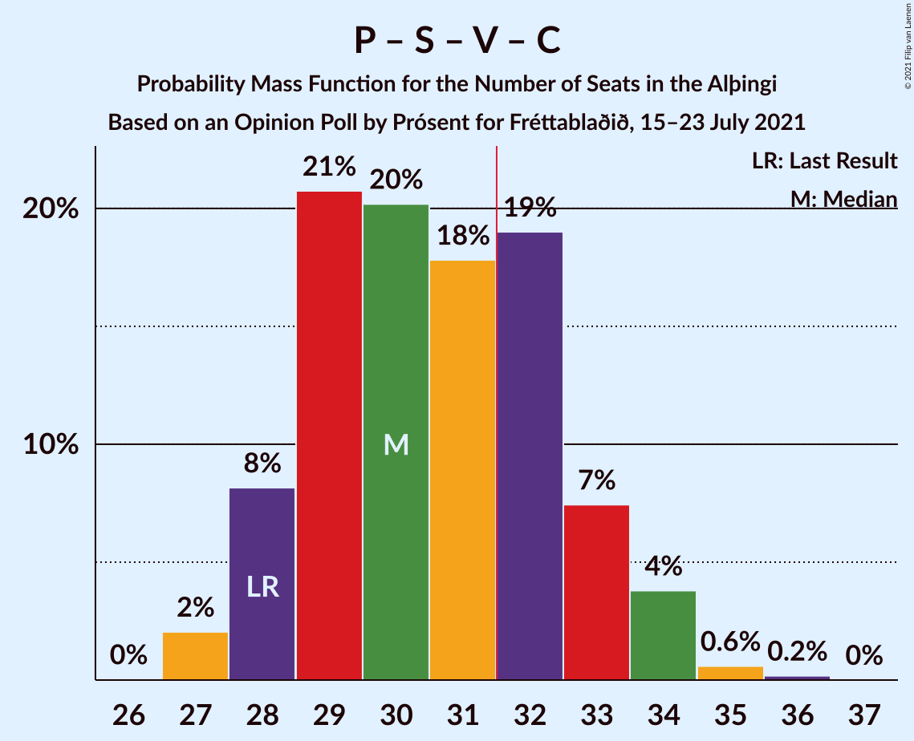

# Opinion Poll by Prósent for Fréttablaðið, 15–23 July 2021

<a href="#voting-intentions">Voting Intentions</a> | <a href="#seats">Seats</a> | <a href="#coalitions">Coalitions</a> | <a href="#technical-information">Technical Information</a>

## Voting Intentions

### Confidence Intervals

| Party | Last Result | Poll Result | 80% Confidence Interval | 90% Confidence Interval | 95% Confidence Interval | 99% Confidence Interval |
|:-----:|:-----------:|:-----------:|:-----------------------:|:-----------------------:|:-----------------------:|:-----------------------:|
| Sjálfstæðisflokkurinn | 25.2% | 23.6% | 22.6–24.7% |22.3–25.0% |22.0–25.3% |21.5–25.8% |
| Píratar | 9.2% | 13.3% | 12.5–14.2% |12.3–14.4% |12.1–14.7% |11.7–15.1% |
| Samfylkingin | 12.1% | 12.6% | 11.8–13.5% |11.6–13.7% |11.4–13.9% |11.0–14.4% |
| Vinstrihreyfingin – grænt framboð | 16.9% | 11.9% | 11.1–12.7% |10.9–13.0% |10.7–13.2% |10.3–13.6% |
| Framsóknarflokkurinn | 10.7% | 10.6% | 9.9–11.4% |9.7–11.7% |9.5–11.9% |9.1–12.3% |
| Viðreisn | 6.7% | 10.1% | 9.4–10.9% |9.2–11.1% |9.0–11.3% |8.7–11.7% |
| Sósíalistaflokkur Íslands | 0.0% | 6.1% | 5.5–6.8% |5.4–7.0% |5.3–7.1% |5.0–7.4% |
| Miðflokkurinn | 10.9% | 5.6% | 5.1–6.2% |4.9–6.4% |4.8–6.6% |4.5–6.9% |
| Flokkur fólksins | 6.9% | 5.0% | 4.5–5.6% |4.3–5.8% |4.2–5.9% |4.0–6.2% |

*Note:* The poll result column reflects the actual value used in the calculations. Published results may vary slightly, and in addition be rounded to fewer digits.

## Seats

### Confidence Intervals

| Party | Last Result | Median | 80% Confidence Interval | 90% Confidence Interval | 95% Confidence Interval | 99% Confidence Interval |
|:-----:|:-----------:|:------:|:-----------------------:|:-----------------------:|:-----------------------:|:-----------------------:|
| <a href="#sjálfstæðisflokkurinn">Sjálfstæðisflokkurinn</a> | 16 | 16 | 15–18 |15–18 |15–18 |14–19 |
| <a href="#píratar">Píratar</a> | 6 | 9 | 8–9 |8–9 |8–10 |7–10 |
| <a href="#samfylkingin">Samfylkingin</a> | 7 | 8 | 7–9 |7–9 |7–9 |6–10 |
| <a href="#vinstrihreyfingin-–-grænt-framboð">Vinstrihreyfingin – grænt framboð</a> | 11 | 8 | 7–9 |7–9 |6–9 |6–10 |
| <a href="#framsóknarflokkurinn">Framsóknarflokkurinn</a> | 8 | 8 | 7–8 |6–8 |6–8 |6–9 |
| <a href="#viðreisn">Viðreisn</a> | 4 | 6 | 5–7 |5–7 |5–7 |5–8 |
| <a href="#sósíalistaflokkur-íslands">Sósíalistaflokkur Íslands</a> | 0 | 4 | 3–4 |3–4 |3–4 |3–5 |
| <a href="#miðflokkurinn">Miðflokkurinn</a> | 7 | 3 | 3–4 |1–4 |1–4 |1–4 |
| <a href="#flokkur-fólksins">Flokkur fólksins</a> | 4 | 3 | 0–3 |0–3 |0–3 |0–4 |

### Sjálfstæðisflokkurinn

*For a full overview of the results for this party, see the [Sjálfstæðisflokkurinn](party-sjálfstæðisflokkurinn.html) page.*

| Number of Seats | Probability | Accumulated | Special Marks |
|:---------------:|:-----------:|:-----------:|:-------------:|
| 14 | 2% | 100% |  |
| 15 | 15% | 98% |  |
| 16 | 34% | 83% | Last Result, Median |
| 17 | 27% | 49% |  |
| 18 | 20% | 22% |  |
| 19 | 2% | 2% |  |
| 20 | 0% | 0% |  |

### Píratar

*For a full overview of the results for this party, see the [Píratar](party-píratar.html) page.*

| Number of Seats | Probability | Accumulated | Special Marks |
|:---------------:|:-----------:|:-----------:|:-------------:|
| 6 | 0% | 100% | Last Result |
| 7 | 0.7% | 100% |  |
| 8 | 48% | 99.3% |  |
| 9 | 47% | 51% | Median |
| 10 | 4% | 4% |  |
| 11 | 0% | 0% |  |

### Samfylkingin

*For a full overview of the results for this party, see the [Samfylkingin](party-samfylkingin.html) page.*

| Number of Seats | Probability | Accumulated | Special Marks |
|:---------------:|:-----------:|:-----------:|:-------------:|
| 6 | 2% | 100% |  |
| 7 | 28% | 98% | Last Result |
| 8 | 46% | 71% | Median |
| 9 | 23% | 25% |  |
| 10 | 2% | 2% |  |
| 11 | 0% | 0% |  |

### Vinstrihreyfingin – grænt framboð

*For a full overview of the results for this party, see the [Vinstrihreyfingin – grænt framboð](party-vinstrihreyfingin–græntframboð.html) page.*

| Number of Seats | Probability | Accumulated | Special Marks |
|:---------------:|:-----------:|:-----------:|:-------------:|
| 6 | 4% | 100% |  |
| 7 | 25% | 96% |  |
| 8 | 59% | 71% | Median |
| 9 | 10% | 12% |  |
| 10 | 2% | 2% |  |
| 11 | 0% | 0% | Last Result |

### Framsóknarflokkurinn

*For a full overview of the results for this party, see the [Framsóknarflokkurinn](party-framsóknarflokkurinn.html) page.*

| Number of Seats | Probability | Accumulated | Special Marks |
|:---------------:|:-----------:|:-----------:|:-------------:|
| 5 | 0.3% | 100% |  |
| 6 | 7% | 99.7% |  |
| 7 | 26% | 93% |  |
| 8 | 65% | 68% | Last Result, Median |
| 9 | 2% | 2% |  |
| 10 | 0.1% | 0.1% |  |
| 11 | 0% | 0% |  |

### Viðreisn

*For a full overview of the results for this party, see the [Viðreisn](party-viðreisn.html) page.*

| Number of Seats | Probability | Accumulated | Special Marks |
|:---------------:|:-----------:|:-----------:|:-------------:|
| 4 | 0% | 100% | Last Result |
| 5 | 11% | 100% |  |
| 6 | 57% | 89% | Median |
| 7 | 30% | 32% |  |
| 8 | 2% | 2% |  |
| 9 | 0% | 0% |  |

### Sósíalistaflokkur Íslands

*For a full overview of the results for this party, see the [Sósíalistaflokkur Íslands](party-sósíalistaflokkuríslands.html) page.*

| Number of Seats | Probability | Accumulated | Special Marks |
|:---------------:|:-----------:|:-----------:|:-------------:|
| 0 | 0.4% | 100% | Last Result |
| 1 | 0% | 99.6% |  |
| 2 | 0% | 99.6% |  |
| 3 | 46% | 99.6% |  |
| 4 | 52% | 53% | Median |
| 5 | 0.9% | 0.9% |  |
| 6 | 0% | 0% |  |

### Miðflokkurinn

*For a full overview of the results for this party, see the [Miðflokkurinn](party-miðflokkurinn.html) page.*

| Number of Seats | Probability | Accumulated | Special Marks |
|:---------------:|:-----------:|:-----------:|:-------------:|
| 1 | 5% | 100% |  |
| 2 | 2% | 95% |  |
| 3 | 67% | 93% | Median |
| 4 | 27% | 27% |  |
| 5 | 0.1% | 0.1% |  |
| 6 | 0% | 0% |  |
| 7 | 0% | 0% | Last Result |

### Flokkur fólksins

*For a full overview of the results for this party, see the [Flokkur fólksins](party-flokkurfólksins.html) page.*

| Number of Seats | Probability | Accumulated | Special Marks |
|:---------------:|:-----------:|:-----------:|:-------------:|
| 0 | 47% | 100% |  |
| 1 | 0% | 53% |  |
| 2 | 0% | 53% |  |
| 3 | 52% | 53% | Median |
| 4 | 1.3% | 1.3% | Last Result |
| 5 | 0% | 0% |  |

## Coalitions

### Confidence Intervals

| Coalition | Last Result | Median | Majority? | 80% Confidence Interval | 90% Confidence Interval | 95% Confidence Interval | 99% Confidence Interval |
|:---------:|:-----------:|:------:|:---------:|:-----------------------:|:-----------------------:|:-----------------------:|:-----------------------:|
| Sjálfstæðisflokkurinn – Vinstrihreyfingin – grænt framboð – Framsóknarflokkurinn | 35 | 32 | 66% | 30–33 | 30–34 | 30–34 | 29–35 |
| Píratar – Samfylkingin – Vinstrihreyfingin – grænt framboð – Viðreisn | 28 | 30 | 31% | 28–33 | 28–33 | 28–34 | 27–35 |
| Sjálfstæðisflokkurinn – Framsóknarflokkurinn – Miðflokkurinn | 31 | 27 | 0% | 25–29 | 25–29 | 25–30 | 24–30 |
| Samfylkingin – Vinstrihreyfingin – grænt framboð – Framsóknarflokkurinn – Miðflokkurinn | 33 | 27 | 0% | 25–28 | 25–28 | 24–29 | 24–29 |
| Píratar – Samfylkingin – Vinstrihreyfingin – grænt framboð | 24 | 24 | 0% | 23–26 | 22–27 | 22–27 | 21–28 |
| Sjálfstæðisflokkurinn – Framsóknarflokkurinn | 24 | 24 | 0% | 22–26 | 22–26 | 22–26 | 21–27 |
| Sjálfstæðisflokkurinn – Samfylkingin | 23 | 24 | 0% | 23–26 | 23–26 | 22–26 | 22–27 |
| Sjálfstæðisflokkurinn – Vinstrihreyfingin – grænt framboð | 27 | 24 | 0% | 23–26 | 22–26 | 22–26 | 21–27 |
| Samfylkingin – Vinstrihreyfingin – grænt framboð – Framsóknarflokkurinn | 26 | 23 | 0% | 22–25 | 22–25 | 21–25 | 21–26 |
| Sjálfstæðisflokkurinn – Viðreisn | 20 | 23 | 0% | 21–24 | 21–24 | 21–25 | 20–25 |
| Sjálfstæðisflokkurinn – Miðflokkurinn | 23 | 20 | 0% | 18–21 | 18–22 | 17–22 | 16–23 |
| Samfylkingin – Vinstrihreyfingin – grænt framboð – Miðflokkurinn | 25 | 19 | 0% | 17–20 | 17–21 | 17–21 | 16–22 |
| Vinstrihreyfingin – grænt framboð – Framsóknarflokkurinn – Miðflokkurinn | 26 | 19 | 0% | 17–20 | 17–20 | 17–20 | 16–21 |
| Píratar – Vinstrihreyfingin – grænt framboð | 17 | 16 | 0% | 15–17 | 15–18 | 15–18 | 14–19 |
| Samfylkingin – Vinstrihreyfingin – grænt framboð | 18 | 16 | 0% | 14–17 | 14–18 | 13–18 | 13–19 |
| Vinstrihreyfingin – grænt framboð – Framsóknarflokkurinn | 19 | 15 | 0% | 15–16 | 14–17 | 14–17 | 13–18 |
| Vinstrihreyfingin – grænt framboð – Miðflokkurinn | 18 | 11 | 0% | 10–12 | 10–12 | 9–12 | 8–13 |

### Sjálfstæðisflokkurinn – Vinstrihreyfingin – grænt framboð – Framsóknarflokkurinn

| Number of Seats | Probability | Accumulated | Special Marks |
|:---------------:|:-----------:|:-----------:|:-------------:|
| 29 | 1.3% | 100% |  |
| 30 | 13% | 98.7% |  |
| 31 | 20% | 86% |  |
| 32 | 28% | 66% | Median, Majority |
| 33 | 29% | 38% |  |
| 34 | 8% | 8% |  |
| 35 | 0.8% | 0.8% | Last Result |
| 36 | 0% | 0% |  |

### Píratar – Samfylkingin – Vinstrihreyfingin – grænt framboð – Viðreisn

| Number of Seats | Probability | Accumulated | Special Marks |
|:---------------:|:-----------:|:-----------:|:-------------:|
| 27 | 2% | 100% |  |
| 28 | 8% | 98% | Last Result |
| 29 | 21% | 90% |  |
| 30 | 20% | 69% |  |
| 31 | 18% | 49% | Median |
| 32 | 19% | 31% | Majority |
| 33 | 7% | 12% |  |
| 34 | 4% | 5% |  |
| 35 | 0.6% | 0.8% |  |
| 36 | 0.2% | 0.2% |  |
| 37 | 0% | 0% |  |

### Sjálfstæðisflokkurinn – Framsóknarflokkurinn – Miðflokkurinn

| Number of Seats | Probability | Accumulated | Special Marks |
|:---------------:|:-----------:|:-----------:|:-------------:|
| 23 | 0.4% | 100% |  |
| 24 | 1.2% | 99.6% |  |
| 25 | 9% | 98% |  |
| 26 | 12% | 89% |  |
| 27 | 32% | 77% | Median |
| 28 | 28% | 45% |  |
| 29 | 13% | 17% |  |
| 30 | 4% | 5% |  |
| 31 | 0.3% | 0.3% | Last Result |
| 32 | 0% | 0% | Majority |

### Samfylkingin – Vinstrihreyfingin – grænt framboð – Framsóknarflokkurinn – Miðflokkurinn

| Number of Seats | Probability | Accumulated | Special Marks |
|:---------------:|:-----------:|:-----------:|:-------------:|
| 23 | 0.2% | 100% |  |
| 24 | 3% | 99.7% |  |
| 25 | 14% | 97% |  |
| 26 | 30% | 83% |  |
| 27 | 34% | 53% | Median |
| 28 | 17% | 19% |  |
| 29 | 2% | 3% |  |
| 30 | 0.2% | 0.2% |  |
| 31 | 0% | 0% |  |
| 32 | 0% | 0% | Majority |
| 33 | 0% | 0% | Last Result |

### Píratar – Samfylkingin – Vinstrihreyfingin – grænt framboð

| Number of Seats | Probability | Accumulated | Special Marks |
|:---------------:|:-----------:|:-----------:|:-------------:|
| 21 | 1.5% | 100% |  |
| 22 | 7% | 98.5% |  |
| 23 | 18% | 92% |  |
| 24 | 30% | 74% | Last Result |
| 25 | 27% | 44% | Median |
| 26 | 12% | 17% |  |
| 27 | 4% | 5% |  |
| 28 | 0.7% | 0.9% |  |
| 29 | 0.2% | 0.2% |  |
| 30 | 0% | 0% |  |

### Sjálfstæðisflokkurinn – Framsóknarflokkurinn

| Number of Seats | Probability | Accumulated | Special Marks |
|:---------------:|:-----------:|:-----------:|:-------------:|
| 21 | 0.7% | 100% |  |
| 22 | 11% | 99.2% |  |
| 23 | 17% | 89% |  |
| 24 | 31% | 72% | Last Result, Median |
| 25 | 26% | 41% |  |
| 26 | 13% | 14% |  |
| 27 | 1.4% | 1.5% |  |
| 28 | 0.1% | 0.1% |  |
| 29 | 0% | 0% |  |

### Sjálfstæðisflokkurinn – Samfylkingin

| Number of Seats | Probability | Accumulated | Special Marks |
|:---------------:|:-----------:|:-----------:|:-------------:|
| 21 | 0.5% | 100% |  |
| 22 | 3% | 99.5% |  |
| 23 | 12% | 96% | Last Result |
| 24 | 37% | 85% | Median |
| 25 | 27% | 47% |  |
| 26 | 18% | 20% |  |
| 27 | 2% | 2% |  |
| 28 | 0.1% | 0.1% |  |
| 29 | 0% | 0% |  |

### Sjálfstæðisflokkurinn – Vinstrihreyfingin – grænt framboð

| Number of Seats | Probability | Accumulated | Special Marks |
|:---------------:|:-----------:|:-----------:|:-------------:|
| 21 | 0.7% | 100% |  |
| 22 | 6% | 99.3% |  |
| 23 | 18% | 94% |  |
| 24 | 30% | 76% | Median |
| 25 | 29% | 46% |  |
| 26 | 16% | 18% |  |
| 27 | 2% | 2% | Last Result |
| 28 | 0.1% | 0.1% |  |
| 29 | 0% | 0% |  |

### Samfylkingin – Vinstrihreyfingin – grænt framboð – Framsóknarflokkurinn

| Number of Seats | Probability | Accumulated | Special Marks |
|:---------------:|:-----------:|:-----------:|:-------------:|
| 20 | 0.3% | 100% |  |
| 21 | 3% | 99.7% |  |
| 22 | 14% | 96% |  |
| 23 | 38% | 82% |  |
| 24 | 30% | 44% | Median |
| 25 | 12% | 14% |  |
| 26 | 2% | 2% | Last Result |
| 27 | 0.1% | 0.1% |  |
| 28 | 0% | 0% |  |

### Sjálfstæðisflokkurinn – Viðreisn

| Number of Seats | Probability | Accumulated | Special Marks |
|:---------------:|:-----------:|:-----------:|:-------------:|
| 20 | 1.1% | 100% | Last Result |
| 21 | 10% | 98.9% |  |
| 22 | 28% | 89% | Median |
| 23 | 37% | 61% |  |
| 24 | 20% | 24% |  |
| 25 | 4% | 4% |  |
| 26 | 0.4% | 0.4% |  |
| 27 | 0% | 0% |  |

### Sjálfstæðisflokkurinn – Miðflokkurinn

| Number of Seats | Probability | Accumulated | Special Marks |
|:---------------:|:-----------:|:-----------:|:-------------:|
| 16 | 0.6% | 100% |  |
| 17 | 2% | 99.3% |  |
| 18 | 13% | 97% |  |
| 19 | 25% | 84% | Median |
| 20 | 34% | 58% |  |
| 21 | 18% | 24% |  |
| 22 | 6% | 6% |  |
| 23 | 0.6% | 0.6% | Last Result |
| 24 | 0% | 0% |  |

### Samfylkingin – Vinstrihreyfingin – grænt framboð – Miðflokkurinn

| Number of Seats | Probability | Accumulated | Special Marks |
|:---------------:|:-----------:|:-----------:|:-------------:|
| 16 | 2% | 100% |  |
| 17 | 9% | 98% |  |
| 18 | 24% | 89% |  |
| 19 | 35% | 65% | Median |
| 20 | 22% | 30% |  |
| 21 | 7% | 8% |  |
| 22 | 1.3% | 1.4% |  |
| 23 | 0.1% | 0.1% |  |
| 24 | 0% | 0% |  |
| 25 | 0% | 0% | Last Result |

### Vinstrihreyfingin – grænt framboð – Framsóknarflokkurinn – Miðflokkurinn

| Number of Seats | Probability | Accumulated | Special Marks |
|:---------------:|:-----------:|:-----------:|:-------------:|
| 15 | 0.2% | 100% |  |
| 16 | 0.9% | 99.8% |  |
| 17 | 10% | 98.9% |  |
| 18 | 32% | 89% |  |
| 19 | 44% | 57% | Median |
| 20 | 12% | 13% |  |
| 21 | 0.7% | 0.7% |  |
| 22 | 0% | 0% |  |
| 23 | 0% | 0% |  |
| 24 | 0% | 0% |  |
| 25 | 0% | 0% |  |
| 26 | 0% | 0% | Last Result |

### Píratar – Vinstrihreyfingin – grænt framboð

| Number of Seats | Probability | Accumulated | Special Marks |
|:---------------:|:-----------:|:-----------:|:-------------:|
| 14 | 2% | 100% |  |
| 15 | 16% | 98% |  |
| 16 | 38% | 83% |  |
| 17 | 36% | 44% | Last Result, Median |
| 18 | 7% | 8% |  |
| 19 | 2% | 2% |  |
| 20 | 0.2% | 0.2% |  |
| 21 | 0% | 0% |  |

### Samfylkingin – Vinstrihreyfingin – grænt framboð

| Number of Seats | Probability | Accumulated | Special Marks |
|:---------------:|:-----------:|:-----------:|:-------------:|
| 13 | 3% | 100% |  |
| 14 | 8% | 97% |  |
| 15 | 30% | 90% |  |
| 16 | 37% | 59% | Median |
| 17 | 16% | 23% |  |
| 18 | 6% | 6% | Last Result |
| 19 | 0.8% | 0.8% |  |
| 20 | 0% | 0% |  |

### Vinstrihreyfingin – grænt framboð – Framsóknarflokkurinn

| Number of Seats | Probability | Accumulated | Special Marks |
|:---------------:|:-----------:|:-----------:|:-------------:|
| 12 | 0.2% | 100% |  |
| 13 | 0.5% | 99.8% |  |
| 14 | 9% | 99.3% |  |
| 15 | 44% | 90% |  |
| 16 | 40% | 46% | Median |
| 17 | 6% | 7% |  |
| 18 | 0.8% | 0.8% |  |
| 19 | 0% | 0% | Last Result |

### Vinstrihreyfingin – grænt framboð – Miðflokkurinn

| Number of Seats | Probability | Accumulated | Special Marks |
|:---------------:|:-----------:|:-----------:|:-------------:|
| 8 | 1.0% | 100% |  |
| 9 | 4% | 99.0% |  |
| 10 | 21% | 95% |  |
| 11 | 50% | 75% | Median |
| 12 | 23% | 25% |  |
| 13 | 2% | 2% |  |
| 14 | 0% | 0% |  |
| 15 | 0% | 0% |  |
| 16 | 0% | 0% |  |
| 17 | 0% | 0% |  |
| 18 | 0% | 0% | Last Result |

## Technical Information

### Opinion Poll

+ **Polling firm:** Prósent
+ **Commissioner(s):** Fréttablaðið
+ **Fieldwork period:** 15–23 July 2021

### Calculations

+ **Sample size:** 2600
+ **Simulations done:** 1,048,576
+ **Error estimate:** 1.36%

