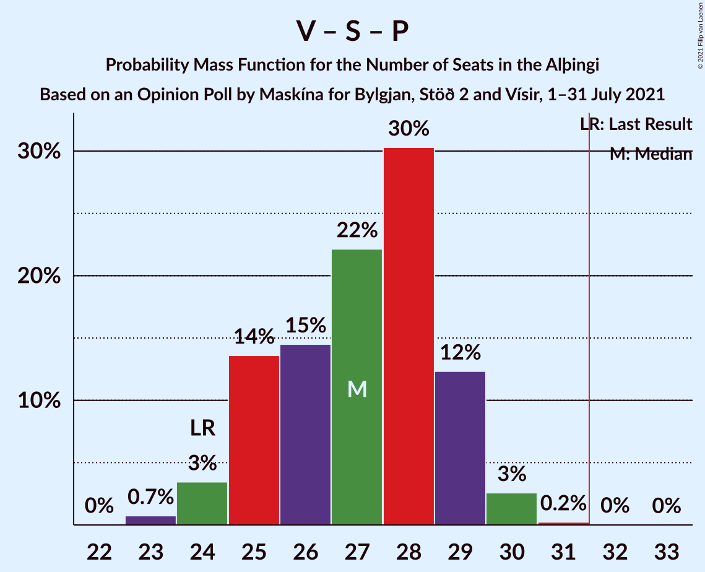

# Opinion Poll by Maskína for Bylgjan, Stöð 2 and Vísir, 1–31 July 2021

<a href="#voting-intentions">Voting Intentions</a> | <a href="#seats">Seats</a> | <a href="#coalitions">Coalitions</a> | <a href="#technical-information">Technical Information</a>

## Voting Intentions

### Confidence Intervals

| Party | Last Result | Poll Result | 80% Confidence Interval | 90% Confidence Interval | 95% Confidence Interval | 99% Confidence Interval |
|:-----:|:-----------:|:-----------:|:-----------------------:|:-----------------------:|:-----------------------:|:-----------------------:|
| Sjálfstæðisflokkurinn | 25.2% | 20.9% | 19.2–22.8% |18.8–23.3% |18.4–23.7% |17.6–24.6% |
| Vinstrihreyfingin – grænt framboð | 16.9% | 14.1% | 12.7–15.7% |12.3–16.2% |12.0–16.6% |11.3–17.4% |
| Samfylkingin | 12.1% | 13.7% | 12.3–15.2% |11.9–15.7% |11.5–16.1% |10.9–16.9% |
| Píratar | 9.2% | 12.7% | 11.4–14.3% |11.0–14.7% |10.7–15.1% |10.1–15.9% |
| Viðreisn | 6.7% | 12.3% | 11.0–13.8% |10.6–14.3% |10.3–14.6% |9.7–15.4% |
| Framsóknarflokkurinn | 10.7% | 9.9% | 8.7–11.3% |8.4–11.7% |8.1–12.1% |7.6–12.8% |
| Sósíalistaflokkur Íslands | 0.0% | 6.3% | 5.3–7.4% |5.1–7.8% |4.8–8.1% |4.4–8.7% |
| Miðflokkurinn | 10.9% | 5.5% | 4.6–6.6% |4.3–6.9% |4.1–7.2% |3.8–7.7% |
| Flokkur fólksins | 6.9% | 4.2% | 3.5–5.2% |3.2–5.5% |3.1–5.7% |2.7–6.3% |

*Note:* The poll result column reflects the actual value used in the calculations. Published results may vary slightly, and in addition be rounded to fewer digits.

## Seats

### Confidence Intervals

| Party | Last Result | Median | 80% Confidence Interval | 90% Confidence Interval | 95% Confidence Interval | 99% Confidence Interval |
|:-----:|:-----------:|:------:|:-----------------------:|:-----------------------:|:-----------------------:|:-----------------------:|
| <a href="#sjálfstæðisflokkurinn">Sjálfstæðisflokkurinn</a> | 16 | 15 | 13–15 |13–16 |13–16 |12–17 |
| <a href="#vinstrihreyfingin-–-grænt-framboð">Vinstrihreyfingin – grænt framboð</a> | 11 | 10 | 8–11 |8–11 |8–11 |7–11 |
| <a href="#samfylkingin">Samfylkingin</a> | 7 | 9 | 8–10 |8–11 |8–11 |7–11 |
| <a href="#píratar">Píratar</a> | 6 | 8 | 7–10 |7–10 |7–10 |6–11 |
| <a href="#viðreisn">Viðreisn</a> | 4 | 8 | 7–9 |7–9 |7–10 |6–10 |
| <a href="#framsóknarflokkurinn">Framsóknarflokkurinn</a> | 8 | 6 | 5–8 |5–9 |5–9 |5–10 |
| <a href="#sósíalistaflokkur-íslands">Sósíalistaflokkur Íslands</a> | 0 | 4 | 4–5 |3–5 |0–5 |0–5 |
| <a href="#miðflokkurinn">Miðflokkurinn</a> | 7 | 3 | 1–4 |1–4 |0–4 |0–5 |
| <a href="#flokkur-fólksins">Flokkur fólksins</a> | 4 | 0 | 0–3 |0–3 |0–3 |0–4 |

### Sjálfstæðisflokkurinn

*For a full overview of the results for this party, see the [Sjálfstæðisflokkurinn](party-sjálfstæðisflokkurinn.html) page.*

| Number of Seats | Probability | Accumulated | Special Marks |
|:---------------:|:-----------:|:-----------:|:-------------:|
| 11 | 0.2% | 100% |  |
| 12 | 2% | 99.8% |  |
| 13 | 24% | 98% |  |
| 14 | 22% | 73% |  |
| 15 | 44% | 52% | Median |
| 16 | 7% | 8% | Last Result |
| 17 | 0.8% | 1.1% |  |
| 18 | 0.2% | 0.2% |  |
| 19 | 0% | 0% |  |

### Vinstrihreyfingin – grænt framboð

*For a full overview of the results for this party, see the [Vinstrihreyfingin – grænt framboð](party-vinstrihreyfingin–græntframboð.html) page.*

| Number of Seats | Probability | Accumulated | Special Marks |
|:---------------:|:-----------:|:-----------:|:-------------:|
| 7 | 1.2% | 100% |  |
| 8 | 10% | 98.8% |  |
| 9 | 24% | 89% |  |
| 10 | 53% | 65% | Median |
| 11 | 12% | 12% | Last Result |
| 12 | 0.4% | 0.5% |  |
| 13 | 0% | 0.1% |  |
| 14 | 0% | 0% |  |

### Samfylkingin

*For a full overview of the results for this party, see the [Samfylkingin](party-samfylkingin.html) page.*

| Number of Seats | Probability | Accumulated | Special Marks |
|:---------------:|:-----------:|:-----------:|:-------------:|
| 6 | 0.1% | 100% |  |
| 7 | 2% | 99.9% | Last Result |
| 8 | 28% | 98% |  |
| 9 | 47% | 70% | Median |
| 10 | 16% | 22% |  |
| 11 | 6% | 7% |  |
| 12 | 0.4% | 0.5% |  |
| 13 | 0% | 0% |  |

### Píratar

*For a full overview of the results for this party, see the [Píratar](party-píratar.html) page.*

| Number of Seats | Probability | Accumulated | Special Marks |
|:---------------:|:-----------:|:-----------:|:-------------:|
| 6 | 0.9% | 100% | Last Result |
| 7 | 12% | 99.0% |  |
| 8 | 40% | 87% | Median |
| 9 | 35% | 47% |  |
| 10 | 12% | 13% |  |
| 11 | 0.7% | 0.7% |  |
| 12 | 0% | 0% |  |

### Viðreisn

*For a full overview of the results for this party, see the [Viðreisn](party-viðreisn.html) page.*

| Number of Seats | Probability | Accumulated | Special Marks |
|:---------------:|:-----------:|:-----------:|:-------------:|
| 4 | 0% | 100% | Last Result |
| 5 | 0% | 100% |  |
| 6 | 2% | 100% |  |
| 7 | 14% | 98% |  |
| 8 | 47% | 84% | Median |
| 9 | 33% | 37% |  |
| 10 | 5% | 5% |  |
| 11 | 0.2% | 0.2% |  |
| 12 | 0% | 0% |  |

### Framsóknarflokkurinn

*For a full overview of the results for this party, see the [Framsóknarflokkurinn](party-framsóknarflokkurinn.html) page.*

| Number of Seats | Probability | Accumulated | Special Marks |
|:---------------:|:-----------:|:-----------:|:-------------:|
| 4 | 0.3% | 100% |  |
| 5 | 11% | 99.7% |  |
| 6 | 47% | 89% | Median |
| 7 | 26% | 42% |  |
| 8 | 11% | 16% | Last Result |
| 9 | 4% | 5% |  |
| 10 | 1.1% | 1.1% |  |
| 11 | 0% | 0% |  |

### Sósíalistaflokkur Íslands

*For a full overview of the results for this party, see the [Sósíalistaflokkur Íslands](party-sósíalistaflokkuríslands.html) page.*

| Number of Seats | Probability | Accumulated | Special Marks |
|:---------------:|:-----------:|:-----------:|:-------------:|
| 0 | 3% | 100% | Last Result |
| 1 | 0% | 97% |  |
| 2 | 0% | 97% |  |
| 3 | 5% | 97% |  |
| 4 | 71% | 92% | Median |
| 5 | 20% | 21% |  |
| 6 | 0.3% | 0.3% |  |
| 7 | 0% | 0% |  |

### Miðflokkurinn

*For a full overview of the results for this party, see the [Miðflokkurinn](party-miðflokkurinn.html) page.*

| Number of Seats | Probability | Accumulated | Special Marks |
|:---------------:|:-----------:|:-----------:|:-------------:|
| 0 | 3% | 100% |  |
| 1 | 37% | 97% |  |
| 2 | 2% | 60% |  |
| 3 | 31% | 58% | Median |
| 4 | 25% | 26% |  |
| 5 | 1.2% | 1.2% |  |
| 6 | 0% | 0% |  |
| 7 | 0% | 0% | Last Result |

### Flokkur fólksins

*For a full overview of the results for this party, see the [Flokkur fólksins](party-flokkurfólksins.html) page.*

| Number of Seats | Probability | Accumulated | Special Marks |
|:---------------:|:-----------:|:-----------:|:-------------:|
| 0 | 88% | 100% | Median |
| 1 | 0.1% | 12% |  |
| 2 | 0% | 12% |  |
| 3 | 11% | 12% |  |
| 4 | 0.7% | 0.7% | Last Result |
| 5 | 0% | 0% |  |

## Coalitions

### Confidence Intervals

| Coalition | Last Result | Median | Majority? | 80% Confidence Interval | 90% Confidence Interval | 95% Confidence Interval | 99% Confidence Interval |
|:---------:|:-----------:|:------:|:---------:|:-----------------------:|:-----------------------:|:-----------------------:|:-----------------------:|
| Vinstrihreyfingin – grænt framboð – Samfylkingin – Píratar – Viðreisn | 28 | 36 | 98.9% | 33–37 | 33–37 | 32–38 | 31–39 |
| Sjálfstæðisflokkurinn – Vinstrihreyfingin – grænt framboð – Framsóknarflokkurinn | 35 | 31 | 28% | 29–32 | 28–33 | 28–33 | 27–34 |
| Vinstrihreyfingin – grænt framboð – Samfylkingin – Framsóknarflokkurinn – Miðflokkurinn | 33 | 27 | 0.8% | 26–30 | 25–30 | 25–31 | 24–32 |
| Vinstrihreyfingin – grænt framboð – Samfylkingin – Píratar | 24 | 27 | 0.1% | 25–29 | 25–29 | 24–30 | 23–30 |
| Vinstrihreyfingin – grænt framboð – Samfylkingin – Framsóknarflokkurinn | 26 | 25 | 0% | 23–27 | 23–28 | 22–28 | 22–29 |
| Sjálfstæðisflokkurinn – Framsóknarflokkurinn – Miðflokkurinn | 31 | 23 | 0% | 22–25 | 22–26 | 21–26 | 21–28 |
| Sjálfstæðisflokkurinn – Samfylkingin | 23 | 23 | 0% | 22–25 | 21–26 | 21–26 | 20–27 |
| Sjálfstæðisflokkurinn – Vinstrihreyfingin – grænt framboð | 27 | 24 | 0% | 22–26 | 22–26 | 21–26 | 21–27 |
| Sjálfstæðisflokkurinn – Viðreisn | 20 | 23 | 0% | 21–24 | 20–24 | 20–25 | 19–26 |
| Vinstrihreyfingin – grænt framboð – Samfylkingin – Miðflokkurinn | 25 | 21 | 0% | 19–23 | 19–23 | 18–24 | 17–25 |
| Sjálfstæðisflokkurinn – Framsóknarflokkurinn | 24 | 21 | 0% | 19–22 | 19–23 | 18–23 | 18–24 |
| Vinstrihreyfingin – grænt framboð – Framsóknarflokkurinn – Miðflokkurinn | 26 | 18 | 0% | 17–20 | 16–21 | 16–22 | 15–23 |
| Vinstrihreyfingin – grænt framboð – Samfylkingin | 18 | 19 | 0% | 17–20 | 16–21 | 16–21 | 15–22 |
| Vinstrihreyfingin – grænt framboð – Píratar | 17 | 18 | 0% | 16–19 | 16–20 | 16–20 | 15–21 |
| Sjálfstæðisflokkurinn – Miðflokkurinn | 23 | 17 | 0% | 16–18 | 15–19 | 14–20 | 13–21 |
| Vinstrihreyfingin – grænt framboð – Framsóknarflokkurinn | 19 | 16 | 0% | 15–18 | 14–18 | 14–19 | 13–19 |
| Vinstrihreyfingin – grænt framboð – Miðflokkurinn | 18 | 12 | 0% | 10–14 | 10–14 | 9–14 | 9–15 |

### Vinstrihreyfingin – grænt framboð – Samfylkingin – Píratar – Viðreisn

| Number of Seats | Probability | Accumulated | Special Marks |
|:---------------:|:-----------:|:-----------:|:-------------:|
| 28 | 0% | 100% | Last Result |
| 29 | 0% | 100% |  |
| 30 | 0.2% | 99.9% |  |
| 31 | 0.8% | 99.7% |  |
| 32 | 2% | 98.9% | Majority |
| 33 | 12% | 97% |  |
| 34 | 11% | 84% |  |
| 35 | 19% | 73% | Median |
| 36 | 33% | 55% |  |
| 37 | 19% | 22% |  |
| 38 | 2% | 3% |  |
| 39 | 0.9% | 1.1% |  |
| 40 | 0.2% | 0.2% |  |
| 41 | 0% | 0% |  |

### Sjálfstæðisflokkurinn – Vinstrihreyfingin – grænt framboð – Framsóknarflokkurinn

| Number of Seats | Probability | Accumulated | Special Marks |
|:---------------:|:-----------:|:-----------:|:-------------:|
| 26 | 0.1% | 100% |  |
| 27 | 1.4% | 99.9% |  |
| 28 | 8% | 98.5% |  |
| 29 | 17% | 91% |  |
| 30 | 23% | 74% |  |
| 31 | 23% | 51% | Median |
| 32 | 22% | 28% | Majority |
| 33 | 5% | 6% |  |
| 34 | 1.0% | 1.4% |  |
| 35 | 0.3% | 0.3% | Last Result |
| 36 | 0.1% | 0.1% |  |
| 37 | 0% | 0% |  |

### Vinstrihreyfingin – grænt framboð – Samfylkingin – Framsóknarflokkurinn – Miðflokkurinn

| Number of Seats | Probability | Accumulated | Special Marks |
|:---------------:|:-----------:|:-----------:|:-------------:|
| 24 | 0.5% | 100% |  |
| 25 | 5% | 99.5% |  |
| 26 | 18% | 94% |  |
| 27 | 32% | 76% |  |
| 28 | 17% | 44% | Median |
| 29 | 17% | 27% |  |
| 30 | 6% | 11% |  |
| 31 | 3% | 4% |  |
| 32 | 0.7% | 0.8% | Majority |
| 33 | 0.1% | 0.1% | Last Result |
| 34 | 0% | 0% |  |

### Vinstrihreyfingin – grænt framboð – Samfylkingin – Píratar

| Number of Seats | Probability | Accumulated | Special Marks |
|:---------------:|:-----------:|:-----------:|:-------------:|
| 23 | 0.7% | 100% |  |
| 24 | 3% | 99.2% | Last Result |
| 25 | 14% | 96% |  |
| 26 | 15% | 82% |  |
| 27 | 22% | 68% | Median |
| 28 | 30% | 46% |  |
| 29 | 12% | 15% |  |
| 30 | 3% | 3% |  |
| 31 | 0.2% | 0.3% |  |
| 32 | 0% | 0.1% | Majority |
| 33 | 0% | 0% |  |

### Vinstrihreyfingin – grænt framboð – Samfylkingin – Framsóknarflokkurinn

| Number of Seats | Probability | Accumulated | Special Marks |
|:---------------:|:-----------:|:-----------:|:-------------:|
| 21 | 0.1% | 100% |  |
| 22 | 4% | 99.8% |  |
| 23 | 10% | 96% |  |
| 24 | 17% | 87% |  |
| 25 | 29% | 70% | Median |
| 26 | 27% | 41% | Last Result |
| 27 | 9% | 14% |  |
| 28 | 4% | 5% |  |
| 29 | 1.0% | 1.2% |  |
| 30 | 0.1% | 0.2% |  |
| 31 | 0% | 0% |  |

### Sjálfstæðisflokkurinn – Framsóknarflokkurinn – Miðflokkurinn

| Number of Seats | Probability | Accumulated | Special Marks |
|:---------------:|:-----------:|:-----------:|:-------------:|
| 19 | 0.1% | 100% |  |
| 20 | 0.4% | 99.9% |  |
| 21 | 3% | 99.5% |  |
| 22 | 28% | 97% |  |
| 23 | 35% | 68% |  |
| 24 | 14% | 33% | Median |
| 25 | 12% | 19% |  |
| 26 | 4% | 7% |  |
| 27 | 2% | 2% |  |
| 28 | 0.4% | 0.6% |  |
| 29 | 0.2% | 0.2% |  |
| 30 | 0% | 0% |  |
| 31 | 0% | 0% | Last Result |

### Sjálfstæðisflokkurinn – Samfylkingin

| Number of Seats | Probability | Accumulated | Special Marks |
|:---------------:|:-----------:|:-----------:|:-------------:|
| 19 | 0.1% | 100% |  |
| 20 | 0.8% | 99.9% |  |
| 21 | 8% | 99.1% |  |
| 22 | 24% | 91% |  |
| 23 | 21% | 68% | Last Result |
| 24 | 31% | 47% | Median |
| 25 | 10% | 16% |  |
| 26 | 5% | 6% |  |
| 27 | 0.7% | 0.8% |  |
| 28 | 0.1% | 0.1% |  |
| 29 | 0% | 0% |  |

### Sjálfstæðisflokkurinn – Vinstrihreyfingin – grænt framboð

| Number of Seats | Probability | Accumulated | Special Marks |
|:---------------:|:-----------:|:-----------:|:-------------:|
| 20 | 0.4% | 100% |  |
| 21 | 3% | 99.6% |  |
| 22 | 10% | 97% |  |
| 23 | 27% | 87% |  |
| 24 | 18% | 59% |  |
| 25 | 31% | 42% | Median |
| 26 | 9% | 11% |  |
| 27 | 0.8% | 1.1% | Last Result |
| 28 | 0.2% | 0.3% |  |
| 29 | 0% | 0.1% |  |
| 30 | 0% | 0% |  |

### Sjálfstæðisflokkurinn – Viðreisn

| Number of Seats | Probability | Accumulated | Special Marks |
|:---------------:|:-----------:|:-----------:|:-------------:|
| 18 | 0% | 100% |  |
| 19 | 2% | 99.9% |  |
| 20 | 5% | 98% | Last Result |
| 21 | 16% | 93% |  |
| 22 | 18% | 77% |  |
| 23 | 34% | 59% | Median |
| 24 | 20% | 24% |  |
| 25 | 3% | 4% |  |
| 26 | 0.7% | 0.8% |  |
| 27 | 0.1% | 0.2% |  |
| 28 | 0% | 0% |  |

### Vinstrihreyfingin – grænt framboð – Samfylkingin – Miðflokkurinn

| Number of Seats | Probability | Accumulated | Special Marks |
|:---------------:|:-----------:|:-----------:|:-------------:|
| 16 | 0.1% | 100% |  |
| 17 | 0.4% | 99.9% |  |
| 18 | 3% | 99.5% |  |
| 19 | 13% | 97% |  |
| 20 | 20% | 84% |  |
| 21 | 30% | 64% |  |
| 22 | 15% | 35% | Median |
| 23 | 16% | 19% |  |
| 24 | 3% | 4% |  |
| 25 | 0.9% | 1.0% | Last Result |
| 26 | 0.1% | 0.1% |  |
| 27 | 0% | 0% |  |

### Sjálfstæðisflokkurinn – Framsóknarflokkurinn

| Number of Seats | Probability | Accumulated | Special Marks |
|:---------------:|:-----------:|:-----------:|:-------------:|
| 17 | 0.1% | 100% |  |
| 18 | 5% | 99.9% |  |
| 19 | 14% | 95% |  |
| 20 | 18% | 82% |  |
| 21 | 31% | 64% | Median |
| 22 | 24% | 32% |  |
| 23 | 6% | 8% |  |
| 24 | 2% | 2% | Last Result |
| 25 | 0.4% | 0.4% |  |
| 26 | 0% | 0% |  |

### Vinstrihreyfingin – grænt framboð – Framsóknarflokkurinn – Miðflokkurinn

| Number of Seats | Probability | Accumulated | Special Marks |
|:---------------:|:-----------:|:-----------:|:-------------:|
| 15 | 1.0% | 100% |  |
| 16 | 5% | 99.0% |  |
| 17 | 17% | 94% |  |
| 18 | 30% | 77% |  |
| 19 | 19% | 48% | Median |
| 20 | 19% | 29% |  |
| 21 | 6% | 9% |  |
| 22 | 3% | 3% |  |
| 23 | 0.6% | 0.6% |  |
| 24 | 0.1% | 0.1% |  |
| 25 | 0% | 0% |  |
| 26 | 0% | 0% | Last Result |

### Vinstrihreyfingin – grænt framboð – Samfylkingin

| Number of Seats | Probability | Accumulated | Special Marks |
|:---------------:|:-----------:|:-----------:|:-------------:|
| 15 | 0.6% | 100% |  |
| 16 | 5% | 99.4% |  |
| 17 | 11% | 95% |  |
| 18 | 28% | 83% | Last Result |
| 19 | 32% | 55% | Median |
| 20 | 17% | 23% |  |
| 21 | 5% | 6% |  |
| 22 | 0.6% | 0.7% |  |
| 23 | 0.1% | 0.1% |  |
| 24 | 0% | 0% |  |

### Vinstrihreyfingin – grænt framboð – Píratar

| Number of Seats | Probability | Accumulated | Special Marks |
|:---------------:|:-----------:|:-----------:|:-------------:|
| 14 | 0.1% | 100% |  |
| 15 | 2% | 99.9% |  |
| 16 | 10% | 98% |  |
| 17 | 18% | 88% | Last Result |
| 18 | 25% | 70% | Median |
| 19 | 36% | 45% |  |
| 20 | 8% | 9% |  |
| 21 | 0.9% | 1.0% |  |
| 22 | 0.1% | 0.1% |  |
| 23 | 0% | 0% |  |

### Sjálfstæðisflokkurinn – Miðflokkurinn

| Number of Seats | Probability | Accumulated | Special Marks |
|:---------------:|:-----------:|:-----------:|:-------------:|
| 13 | 1.1% | 100% |  |
| 14 | 1.4% | 98.9% |  |
| 15 | 5% | 97% |  |
| 16 | 42% | 93% |  |
| 17 | 28% | 50% |  |
| 18 | 15% | 22% | Median |
| 19 | 5% | 8% |  |
| 20 | 2% | 3% |  |
| 21 | 0.6% | 0.7% |  |
| 22 | 0.1% | 0.1% |  |
| 23 | 0% | 0% | Last Result |

### Vinstrihreyfingin – grænt framboð – Framsóknarflokkurinn

| Number of Seats | Probability | Accumulated | Special Marks |
|:---------------:|:-----------:|:-----------:|:-------------:|
| 13 | 1.1% | 100% |  |
| 14 | 7% | 98.8% |  |
| 15 | 18% | 92% |  |
| 16 | 34% | 74% | Median |
| 17 | 30% | 40% |  |
| 18 | 7% | 10% |  |
| 19 | 3% | 3% | Last Result |
| 20 | 0.4% | 0.5% |  |
| 21 | 0.1% | 0.1% |  |
| 22 | 0% | 0% |  |

### Vinstrihreyfingin – grænt framboð – Miðflokkurinn

| Number of Seats | Probability | Accumulated | Special Marks |
|:---------------:|:-----------:|:-----------:|:-------------:|
| 8 | 0.3% | 100% |  |
| 9 | 3% | 99.7% |  |
| 10 | 7% | 97% |  |
| 11 | 32% | 90% |  |
| 12 | 15% | 58% |  |
| 13 | 26% | 43% | Median |
| 14 | 15% | 17% |  |
| 15 | 2% | 2% |  |
| 16 | 0.2% | 0.2% |  |
| 17 | 0% | 0% |  |
| 18 | 0% | 0% | Last Result |

## Technical Information

### Opinion Poll

+ **Polling firm:** Maskína
+ **Commissioner(s):** Bylgjan, Stöð 2 and Vísir
+ **Fieldwork period:** 1–31 July 2021

### Calculations

+ **Sample size:** 879
+ **Simulations done:** 1,048,576
+ **Error estimate:** 1.22%

